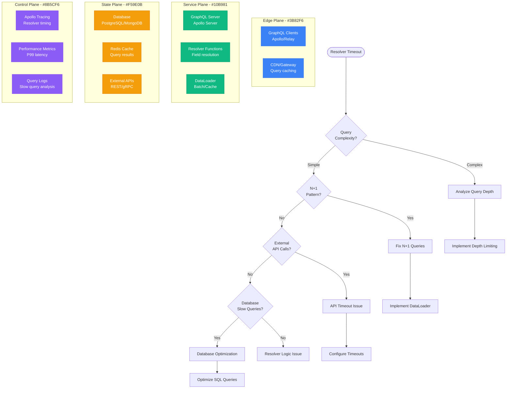

# GraphQL Resolver Timeout Debugging

## Overview

GraphQL resolver timeouts occur when individual field resolvers or resolver chains take too long to execute, causing client requests to fail or timeout. This guide provides systematic approaches to identify, debug, and optimize resolver performance in production GraphQL services.

## Immediate Symptoms Checklist

- [ ] Client requests timing out after 30+ seconds
- [ ] Specific GraphQL queries consistently slow
- [ ] N+1 query problems in database logs
- [ ] Memory usage spikes during complex queries
- [ ] High CPU utilization in resolver execution
- [ ] Timeouts only on nested/complex queries

## GraphQL Resolver Timeout Analysis Flow



## Step-by-Step Debugging Process

### Phase 1: Query Analysis (< 3 minutes)

```javascript
// 1. Enable Apollo Server tracing
const server = new ApolloServer({
  typeDefs,
  resolvers,
  tracing: true,  // Enable resolver timing
  cacheControl: true,
  plugins: [
    ApolloServerPluginLandingPageGraphQLPlayground(),
    {
      requestDidStart() {
        return {
          willSendResponse(requestContext) {
            console.log('Query execution time:',
              requestContext.request.http.body.query,
              requestContext.metrics.executionTime);
          }
        };
      }
    }
  ]
});

// 2. Add query complexity analysis
const depthLimit = require('graphql-depth-limit');
const costAnalysis = require('graphql-cost-analysis');

const server = new ApolloServer({
  typeDefs,
  resolvers,
  validationRules: [
    depthLimit(10),  // Limit query depth
    costAnalysis({
      maximumCost: 1000,
      scalarCost: 1,
      objectCost: 1,
      listFactor: 10,
      introspectionCost: 100
    })
  ]
});
```

### Phase 2: Resolver Performance Profiling (< 5 minutes)

```javascript
// 1. Add timing middleware to resolvers
const withTiming = (resolver) => {
  return async (parent, args, context, info) => {
    const start = Date.now();
    try {
      const result = await resolver(parent, args, context, info);
      const duration = Date.now() - start;

      // Log slow resolvers
      if (duration > 100) {
        console.warn(`Slow resolver: ${info.fieldName} took ${duration}ms`);
      }

      return result;
    } catch (error) {
      const duration = Date.now() - start;
      console.error(`Resolver error in ${info.fieldName} after ${duration}ms:`, error);
      throw error;
    }
  };
};

// 2. Apply timing to all resolvers
const resolvers = {
  Query: {
    user: withTiming(async (parent, { id }, { dataSources }) => {
      return dataSources.userAPI.getUser(id);
    }),
    posts: withTiming(async (parent, args, { dataSources }) => {
      return dataSources.postAPI.getPosts(args);
    })
  }
};

// 3. Database query profiling
const db = require('./database');

// Wrap database calls with timing
const timedQuery = async (query, params) => {
  const start = Date.now();
  try {
    const result = await db.query(query, params);
    const duration = Date.now() - start;

    if (duration > 50) {
      console.warn(`Slow DB query (${duration}ms): ${query.substring(0, 100)}`);
    }

    return result;
  } catch (error) {
    console.error(`DB query error: ${query}`, error);
    throw error;
  }
};
```

### Phase 3: N+1 Query Detection (< 3 minutes)

```javascript
// 1. Database query counter middleware
let queryCount = 0;

const trackQueries = {
  requestDidStart() {
    return {
      willSendResponse() {
        if (queryCount > 10) {
          console.warn(`Potential N+1 problem: ${queryCount} queries executed`);
        }
        queryCount = 0;  // Reset for next request
      }
    };
  }
};

// 2. Implement query logging
const originalQuery = db.query;
db.query = function(...args) {
  queryCount++;
  console.log(`Query #${queryCount}: ${args[0].substring(0, 50)}...`);
  return originalQuery.apply(this, args);
};

// 3. Analyze query patterns
// Look for repeated similar queries:
// Query #1: SELECT * FROM users WHERE id = 1
// Query #2: SELECT * FROM users WHERE id = 2
// Query #3: SELECT * FROM users WHERE id = 3
// ^ This indicates N+1 problem
```

## Common Root Causes and Solutions

### 1. N+1 Query Problems (50% of cases)

**Symptoms:**
- Hundreds of similar database queries per GraphQL request
- Linear increase in execution time with result set size
- Database connection pool exhaustion

**Root Cause Example:**
```javascript
// Problematic resolver causing N+1
const resolvers = {
  Query: {
    posts: () => db.query('SELECT * FROM posts LIMIT 10')
  },
  Post: {
    // This runs once per post (N+1 problem!)
    author: (post) => db.query('SELECT * FROM users WHERE id = ?', [post.author_id])
  }
};

// With 10 posts, this executes:
// 1 query for posts + 10 queries for authors = 11 total queries
```

**Solution: DataLoader Implementation**
```javascript
const DataLoader = require('dataloader');

// Create batch loader for users
const userLoader = new DataLoader(async (userIds) => {
  // Single query for all requested users
  const users = await db.query(
    'SELECT * FROM users WHERE id IN (?)',
    [userIds]
  );

  // Return users in same order as requested IDs
  return userIds.map(id => users.find(user => user.id === id));
});

const resolvers = {
  Query: {
    posts: () => db.query('SELECT * FROM posts LIMIT 10')
  },
  Post: {
    // Now batches and caches user lookups
    author: (post) => userLoader.load(post.author_id)
  }
};

// Result: 1 query for posts + 1 query for all authors = 2 total queries
```

**Advanced DataLoader with Caching:**
```javascript
const userLoader = new DataLoader(
  async (userIds) => {
    console.log(`Batch loading users: ${userIds.join(', ')}`);
    const users = await db.query(
      'SELECT * FROM users WHERE id IN (?)',
      [userIds]
    );
    return userIds.map(id => users.find(user => user.id === id));
  },
  {
    // Cache results for 5 minutes
    cacheKeyFn: (key) => `user:${key}`,
    cache: true,
    maxBatchSize: 100  // Limit batch size
  }
);

// Clear cache when user data changes
const updateUser = async (userId, data) => {
  await db.query('UPDATE users SET ? WHERE id = ?', [data, userId]);
  userLoader.clear(userId);  // Clear cached entry
};
```

### 2. Deep/Complex Query Issues (25% of cases)

**Symptoms:**
- Exponential increase in execution time with query depth
- Memory usage spikes during query execution
- Timeouts on nested queries

**Root Cause Example:**
```graphql
# Problematic deep nested query
query DeepQuery {
  user(id: "1") {
    posts {
      comments {
        author {
          posts {
            comments {
              author {
                # This can go very deep...
              }
            }
          }
        }
      }
    }
  }
}
```

**Solution: Query Depth Limiting**
```javascript
const depthLimit = require('graphql-depth-limit');

const server = new ApolloServer({
  typeDefs,
  resolvers,
  validationRules: [
    depthLimit(7, {
      ignore: ['__schema', '__type']  // Ignore introspection queries
    })
  ]
});

// Custom depth analysis with field-specific limits
const customDepthLimit = (maxDepth, options = {}) => {
  return (context) => {
    return {
      Field(node, key, parent, path, ancestors) {
        const depth = ancestors.filter(ancestor =>
          ancestor.kind === 'Field'
        ).length;

        // Special handling for expensive fields
        const fieldName = node.name.value;
        const expensiveFields = ['posts', 'comments', 'followers'];

        if (expensiveFields.includes(fieldName) && depth > 3) {
          context.reportError(
            new Error(`Field "${fieldName}" exceeds depth limit at level ${depth}`)
          );
        } else if (depth > maxDepth) {
          context.reportError(
            new Error(`Query exceeds maximum depth of ${maxDepth}`)
          );
        }
      }
    };
  };
};
```

**Query Complexity Analysis:**
```javascript
const costAnalysis = require('graphql-cost-analysis');

const server = new ApolloServer({
  typeDefs,
  resolvers,
  validationRules: [
    costAnalysis({
      maximumCost: 1000,
      defaultCost: 1,
      scalarCost: 1,
      objectCost: 2,
      listFactor: 10,
      introspectionCost: 100,
      fieldCosts: {
        'User.posts': { cost: 10 },      // Expensive field
        'Post.comments': { cost: 15 },   // Very expensive
        'User.followers': { cost: 20 }   // Most expensive
      }
    })
  ]
});
```

### 3. External API Timeouts (15% of cases)

**Symptoms:**
- Resolvers hanging on external API calls
- Inconsistent response times
- Cascade failures from external services

**Root Cause Example:**
```javascript
// Problematic external API call without timeout
const resolvers = {
  User: {
    profile: async (user) => {
      // No timeout - hangs indefinitely if API is slow
      const response = await fetch(`https://api.external.com/profile/${user.id}`);
      return response.json();
    }
  }
};
```

**Solution: Timeout and Circuit Breaker**
```javascript
const CircuitBreaker = require('opossum');

// Configure circuit breaker for external API
const externalAPIOptions = {
  timeout: 3000,              // 3 second timeout
  errorThresholdPercentage: 50, // Open circuit at 50% error rate
  resetTimeout: 30000,        // Try again after 30 seconds
  rollingCountTimeout: 10000, // 10 second rolling window
  rollingCountBuckets: 10
};

const externalAPIBreaker = new CircuitBreaker(callExternalAPI, externalAPIOptions);

// Fallback when circuit is open
externalAPIBreaker.fallback(() => ({
  name: 'Unknown',
  email: 'unavailable@example.com',
  status: 'Service temporarily unavailable'
}));

async function callExternalAPI(userId) {
  const controller = new AbortController();
  const timeoutId = setTimeout(() => controller.abort(), 2000);

  try {
    const response = await fetch(
      `https://api.external.com/profile/${userId}`,
      {
        signal: controller.signal,
        headers: {
          'Authorization': `Bearer ${process.env.API_TOKEN}`,
          'Content-Type': 'application/json'
        }
      }
    );

    if (!response.ok) {
      throw new Error(`API responded with status ${response.status}`);
    }

    return await response.json();
  } finally {
    clearTimeout(timeoutId);
  }
}

const resolvers = {
  User: {
    profile: (user) => externalAPIBreaker.fire(user.id)
  }
};
```

**API Call Batching:**
```javascript
// Batch multiple API calls together
const apiLoader = new DataLoader(async (userIds) => {
  try {
    // Single API call for multiple users
    const response = await fetch('https://api.external.com/profiles', {
      method: 'POST',
      headers: { 'Content-Type': 'application/json' },
      body: JSON.stringify({ userIds }),
      signal: AbortSignal.timeout(5000)  // 5 second timeout
    });

    const profiles = await response.json();

    // Return profiles in same order as requested IDs
    return userIds.map(id =>
      profiles.find(profile => profile.userId === id) || null
    );
  } catch (error) {
    console.error('Batch API call failed:', error);
    // Return null for all requested IDs
    return userIds.map(() => null);
  }
}, {
  maxBatchSize: 50,  // Limit batch size
  batchScheduleFn: callback => setTimeout(callback, 10)  // Small delay for batching
});
```

### 4. Database Performance Issues (10% of cases)

**Symptoms:**
- Slow SQL queries in database logs
- High database CPU utilization
- Connection pool exhaustion

**Debugging Database Performance:**
```javascript
// Database query performance monitoring
const slowQueryThreshold = 100; // 100ms

const monitoredQuery = async (query, params) => {
  const start = process.hrtime.bigint();

  try {
    const result = await db.query(query, params);
    const duration = Number(process.hrtime.bigint() - start) / 1000000; // Convert to ms

    if (duration > slowQueryThreshold) {
      console.warn(`Slow query detected (${duration.toFixed(2)}ms):`);
      console.warn(`SQL: ${query}`);
      console.warn(`Params: ${JSON.stringify(params)}`);

      // Log query plan for optimization
      if (query.toLowerCase().startsWith('select')) {
        const plan = await db.query(`EXPLAIN ${query}`, params);
        console.warn(`Query plan:`, plan);
      }
    }

    return result;
  } catch (error) {
    const duration = Number(process.hrtime.bigint() - start) / 1000000;
    console.error(`Query failed after ${duration.toFixed(2)}ms:`, error);
    throw error;
  }
};
```

**Query Optimization Examples:**
```javascript
// Before: Inefficient query
const getUserPosts = async (userId) => {
  return db.query(`
    SELECT p.*, u.name as author_name
    FROM posts p
    JOIN users u ON p.author_id = u.id
    WHERE p.author_id = ?
    ORDER BY p.created_at DESC
  `, [userId]);
};

// After: Optimized with proper indexing
const getUserPosts = async (userId) => {
  return db.query(`
    SELECT p.id, p.title, p.content, p.created_at, u.name as author_name
    FROM posts p
    JOIN users u ON p.author_id = u.id
    WHERE p.author_id = ?
    ORDER BY p.created_at DESC
    LIMIT 100
  `, [userId]);
};

// Required indexes:
// CREATE INDEX idx_posts_author_created ON posts(author_id, created_at DESC);
// CREATE INDEX idx_users_id ON users(id);
```

## Critical Monitoring and Metrics

### GraphQL Performance Metrics

```javascript
// Custom Apollo Server plugin for metrics
const metricsPlugin = {
  requestDidStart() {
    return {
      didResolveOperation(requestContext) {
        const operationName = requestContext.request.operationName;
        console.log(`Operation: ${operationName}`);
      },

      willSendResponse(requestContext) {
        const executionTime = requestContext.metrics.executionTime;
        const operationName = requestContext.request.operationName;

        // Track execution times
        console.log(`${operationName} execution time: ${executionTime}ms`);

        // Alert on slow queries
        if (executionTime > 5000) {
          console.error(`SLOW QUERY ALERT: ${operationName} took ${executionTime}ms`);
        }
      }
    };
  }
};

// Prometheus metrics integration
const prometheus = require('prom-client');

const resolverDuration = new prometheus.Histogram({
  name: 'graphql_resolver_duration_seconds',
  help: 'Duration of GraphQL resolver execution',
  labelNames: ['field_name', 'type_name'],
  buckets: [0.1, 0.5, 1, 2, 5, 10]
});

const resolverErrorRate = new prometheus.Counter({
  name: 'graphql_resolver_errors_total',
  help: 'Total number of GraphQL resolver errors',
  labelNames: ['field_name', 'type_name', 'error_type']
});
```

### Performance Dashboard Queries

```javascript
// Query execution time analysis
const analyzeQueryPerformance = async () => {
  const queries = await db.query(`
    SELECT
      operation_name,
      AVG(execution_time) as avg_time,
      MAX(execution_time) as max_time,
      COUNT(*) as request_count,
      COUNT(CASE WHEN execution_time > 1000 THEN 1 END) as slow_queries
    FROM graphql_logs
    WHERE created_at > NOW() - INTERVAL 1 HOUR
    GROUP BY operation_name
    ORDER BY avg_time DESC
  `);

  queries.forEach(query => {
    if (query.avg_time > 500) {
      console.warn(`Slow operation: ${query.operation_name} avg: ${query.avg_time}ms`);
    }
  });

  return queries;
};

// Database connection pool monitoring
const monitorConnectionPool = () => {
  const pool = db.getPool();
  console.log(`Database connections: ${pool.totalCount} total, ${pool.idleCount} idle`);

  if (pool.waitingCount > 0) {
    console.warn(`Connection pool saturation: ${pool.waitingCount} queries waiting`);
  }
};

setInterval(monitorConnectionPool, 30000); // Check every 30 seconds
```

## Production Example: GitHub's GraphQL API

**Problem:** Resolver timeouts during repository query execution

**Initial Metrics:**
- P99 query execution time: 45 seconds
- 25% of complex repository queries timing out
- Database CPU usage: 85% during peak hours

**Root Causes Identified:**
1. N+1 queries for repository collaborators
2. Lack of query depth limits
3. Inefficient database queries for file listings

**Solution Implementation:**
```javascript
// 1. DataLoader for collaborators
const collaboratorLoader = new DataLoader(async (repoIds) => {
  const collaborators = await db.query(`
    SELECT rc.repository_id, u.id, u.login, u.avatar_url
    FROM repository_collaborators rc
    JOIN users u ON rc.user_id = u.id
    WHERE rc.repository_id IN (?)
  `, [repoIds]);

  return repoIds.map(repoId =>
    collaborators.filter(c => c.repository_id === repoId)
  );
});

// 2. Query complexity limits
const server = new ApolloServer({
  validationRules: [
    depthLimit(10),
    costAnalysis({
      maximumCost: 10000,
      fieldCosts: {
        'Repository.files': { cost: 100 },
        'Repository.collaborators': { cost: 50 }
      }
    })
  ]
});

// 3. Database query optimization
const getRepositoryFiles = async (repoId, path = '/') => {
  return db.query(`
    SELECT name, type, size, sha
    FROM repository_files
    WHERE repository_id = ? AND parent_path = ?
    ORDER BY type DESC, name ASC
    LIMIT 1000
  `, [repoId, path]);
};
```

**Results:**
- P99 execution time reduced to 2.3 seconds
- Timeout rate dropped to <0.1%
- Database CPU usage reduced to 45%
- 10x improvement in query throughput

## Emergency Response Playbook

### Immediate Actions (< 2 minutes)

1. **Identify Slow Resolvers:**
   ```bash
   # Check recent slow queries in application logs
   grep "Slow resolver" /var/log/app/graphql.log | tail -20
   ```

2. **Database Quick Check:**
   ```sql
   -- Check for long-running queries
   SHOW FULL PROCESSLIST;

   -- Check current connections
   SHOW STATUS LIKE 'Threads_connected';
   ```

3. **Memory Usage Check:**
   ```bash
   # Check Node.js memory usage
   ps aux | grep node | awk '{print $6}' | sort -n | tail -1
   ```

### Short-term Mitigation (< 10 minutes)

1. **Enable Query Timeouts:**
   ```javascript
   const server = new ApolloServer({
     // Global timeout for all queries
     plugins: [{
       requestDidStart() {
         return {
           willSendResponse(requestContext) {
             if (Date.now() - requestContext.requestStartTime > 30000) {
               throw new Error('Query timeout: exceeded 30 seconds');
             }
           }
         };
       }
     }]
   });
   ```

2. **Temporarily Disable Complex Queries:**
   ```javascript
   const isComplexQuery = (query) => {
     return query.includes('repository') &&
            query.includes('files') &&
            query.includes('collaborators');
   };

   const server = new ApolloServer({
     plugins: [{
       requestDidStart() {
         return {
           didResolveOperation(requestContext) {
             if (isComplexQuery(requestContext.request.query)) {
               throw new Error('Complex queries temporarily disabled');
             }
           }
         };
       }
     }]
   });
   ```

### Long-term Solutions

1. **Implement Caching Strategy:**
   - Add Redis caching for expensive resolvers
   - Use Apollo Client query caching
   - Implement field-level caching

2. **Query Optimization:**
   - Add database indexes for common query patterns
   - Implement query batching with DataLoader
   - Use query whitelisting for production

3. **Monitoring and Alerting:**
   - Set up alerts for slow queries (>5 seconds)
   - Monitor database connection pool usage
   - Track resolver execution time trends

## Related Debugging Guides

- [Database Connection Pool Debugging](/debugging/database-connection-pool-debugging)
- [API Gateway Issues Debugging](/debugging/api-gateway-issues-debugging)
- [Microservice Timeout Chains](/debugging/microservice-timeout-chains-debugging)