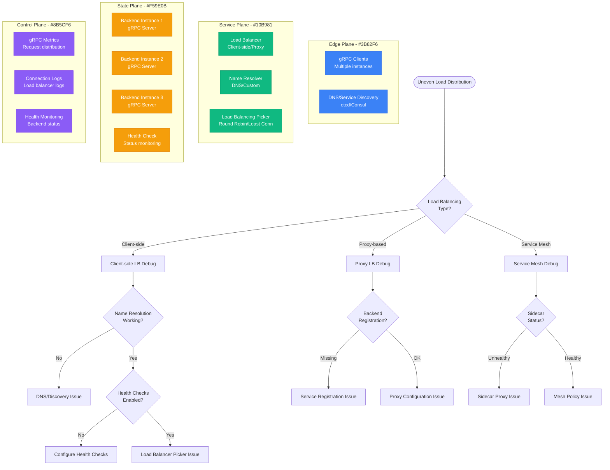

# gRPC Load Balancing Debugging

## Overview

gRPC load balancing issues can cause uneven traffic distribution, connection failures, and poor performance in microservice architectures. This guide provides systematic debugging for gRPC load balancing problems across client-side, proxy-based, and service mesh implementations.

## Immediate Symptoms Checklist

- [ ] Uneven traffic distribution across backend instances
- [ ] Connection refused errors from gRPC clients
- [ ] High latency on specific backend instances
- [ ] Load balancer not detecting unhealthy backends
- [ ] Sticky connections to single backend instance
- [ ] DNS resolution issues in service discovery

## gRPC Load Balancing Debug Flow



## Step-by-Step Debugging Process

### Phase 1: Load Distribution Analysis (< 3 minutes)

```bash
# 1. Check gRPC client connections and distribution
# Using grpcurl to test multiple requests
for i in {1..100}; do
  grpcurl -plaintext localhost:50051 grpc.health.v1.Health/Check 2>&1 | \
    grep -o "server_id.*" || echo "Request $i failed"
done | sort | uniq -c

# 2. Check backend instance registration
nslookup my-grpc-service.default.svc.cluster.local

# 3. Monitor active connections per backend
ss -tunlp | grep :50051  # Check listening ports
netstat -an | grep :50051 | wc -l  # Count active connections
```

**Load Distribution Patterns:**
```bash
# Good - Even distribution
     34 server_id: backend-1
     33 server_id: backend-2
     33 server_id: backend-3

# Bad - Uneven distribution (sticky connections)
     97 server_id: backend-1
      2 server_id: backend-2
      1 server_id: backend-3

# Bad - Some backends unreachable
     50 server_id: backend-1
     50 server_id: backend-2
      0 Request failed: connection refused
```

### Phase 2: Client-side Load Balancing Debug (< 5 minutes)

**Go gRPC Client Analysis:**
```go
// Debug gRPC client configuration
package main

import (
    "context"
    "log"
    "time"

    "google.golang.org/grpc"
    "google.golang.org/grpc/balancer/roundrobin"
    "google.golang.org/grpc/resolver"
)

func debugGRPCLoadBalancing() {
    // Enable gRPC debug logging
    grpc.EnableTracing = true

    // Create connection with load balancing
    conn, err := grpc.Dial(
        "dns:///my-service.default.svc.cluster.local:50051",
        grpc.WithInsecure(),
        grpc.WithDefaultServiceConfig(`{
            "loadBalancingPolicy": "round_robin",
            "healthCheckConfig": {
                "serviceName": ""
            }
        }`),
    )
    if err != nil {
        log.Fatal(err)
    }
    defer conn.Close()

    // Check connection state
    log.Printf("Connection state: %v", conn.GetState())

    // Wait for connection to be ready
    ctx, cancel := context.WithTimeout(context.Background(), 5*time.Second)
    defer cancel()

    if !conn.WaitForStateChange(ctx, grpc.Idle) {
        log.Printf("Connection failed to become ready")
    }

    // Test multiple requests to see distribution
    client := pb.NewYourServiceClient(conn)
    for i := 0; i < 10; i++ {
        resp, err := client.YourMethod(context.Background(), &pb.YourRequest{})
        if err != nil {
            log.Printf("Request %d failed: %v", i, err)
        } else {
            log.Printf("Request %d: server=%s", i, resp.ServerId)
        }
    }
}
```

**Python gRPC Client Analysis:**
```python
import grpc
import logging
import time
from concurrent import futures

# Enable gRPC debug logging
logging.basicConfig(level=logging.DEBUG)

def debug_grpc_load_balancing():
    # Configure load balancing options
    options = [
        ('grpc.lb_policy_name', 'round_robin'),
        ('grpc.enable_health_check', 1),
        ('grpc.health_check_timeout_ms', 5000),
    ]

    # Create channel with load balancing
    channel = grpc.insecure_channel(
        'dns:///my-service.default.svc.cluster.local:50051',
        options=options
    )

    # Wait for channel to be ready
    try:
        grpc.channel_ready_future(channel).result(timeout=10)
        print("Channel is ready")
    except grpc.FutureTimeoutError:
        print("Channel failed to become ready")
        return

    # Test load distribution
    stub = your_service_pb2_grpc.YourServiceStub(channel)

    server_counts = {}
    for i in range(100):
        try:
            response = stub.YourMethod(your_service_pb2.YourRequest())
            server_id = response.server_id
            server_counts[server_id] = server_counts.get(server_id, 0) + 1
        except grpc.RpcError as e:
            print(f"Request {i} failed: {e}")

    print("Request distribution:")
    for server, count in server_counts.items():
        print(f"  {server}: {count} requests")

    channel.close()

if __name__ == "__main__":
    debug_grpc_load_balancing()
```

### Phase 3: Backend Health Check Analysis (< 5 minutes)

```bash
# 1. Check gRPC health check implementation
grpcurl -plaintext localhost:50051 grpc.health.v1.Health/Check

# 2. Test health check for specific service
grpcurl -plaintext -d '{"service": "myservice"}' \
  localhost:50051 grpc.health.v1.Health/Check

# 3. Monitor health check status over time
for i in {1..10}; do
  echo "Health check attempt $i:"
  grpcurl -plaintext localhost:50051 grpc.health.v1.Health/Check
  sleep 2
done

# 4. Check server reflection (if enabled)
grpcurl -plaintext localhost:50051 list
grpcurl -plaintext localhost:50051 describe grpc.health.v1.Health
```

## Common Root Causes and Solutions

### 1. Client-side Load Balancing Configuration Issues (40% of cases)

**Symptoms:**
- All requests going to single backend
- Client not discovering all backend instances
- Health checks not working properly

**Root Cause Examples:**
```go
// Problematic - No load balancing policy specified
conn, err := grpc.Dial(
    "my-service:50051",  // Single endpoint, no DNS discovery
    grpc.WithInsecure(),
)

// Problematic - Wrong service config
conn, err := grpc.Dial(
    "dns:///my-service:50051",
    grpc.WithInsecure(),
    grpc.WithDefaultServiceConfig(`{}`),  // No load balancing policy
)
```

**Solutions:**

**Option 1: Proper Client-side Load Balancing**
```go
// Correct client-side load balancing configuration
conn, err := grpc.Dial(
    "dns:///my-service.default.svc.cluster.local:50051",
    grpc.WithInsecure(),
    grpc.WithDefaultServiceConfig(`{
        "loadBalancingPolicy": "round_robin",
        "healthCheckConfig": {
            "serviceName": "myservice"
        }
    }`),
    grpc.WithKeepaliveParams(keepalive.ClientParameters{
        Time:                10 * time.Second,
        Timeout:             3 * time.Second,
        PermitWithoutStream: true,
    }),
)
```

**Option 2: Custom Resolver for Better Discovery**
```go
package main

import (
    "context"
    "net"
    "google.golang.org/grpc/resolver"
)

// Custom resolver for better service discovery
type customResolver struct {
    target     resolver.Target
    cc         resolver.ClientConn
    addrsStore map[string][]string
}

func (r *customResolver) ResolveNow(o resolver.ResolveNowOptions) {
    // Implement custom service discovery logic
    addrs := r.lookupService(r.target.Endpoint)
    r.cc.UpdateState(resolver.State{Addresses: addrs})
}

func (r *customResolver) lookupService(service string) []resolver.Address {
    // Custom logic to discover backend instances
    ips, err := net.LookupHost(service)
    if err != nil {
        return nil
    }

    var addrs []resolver.Address
    for _, ip := range ips {
        addrs = append(addrs, resolver.Address{
            Addr: net.JoinHostPort(ip, "50051"),
        })
    }
    return addrs
}

func (r *customResolver) Close() {}

// Register custom resolver
func init() {
    resolver.Register(&customResolverBuilder{})
}

type customResolverBuilder struct{}

func (*customResolverBuilder) Build(target resolver.Target, cc resolver.ClientConn, opts resolver.BuildOptions) (resolver.Resolver, error) {
    r := &customResolver{
        target: target,
        cc:     cc,
    }
    r.ResolveNow(resolver.ResolveNowOptions{})
    return r, nil
}

func (*customResolverBuilder) Scheme() string { return "custom" }
```

**Option 3: Python Client with Proper Configuration**
```python
import grpc
from grpc_health.v1 import health_pb2, health_pb2_grpc

def create_grpc_channel_with_lb():
    # Proper load balancing configuration
    options = [
        ('grpc.lb_policy_name', 'round_robin'),
        ('grpc.enable_health_check', 1),
        ('grpc.health_check_timeout_ms', 5000),
        ('grpc.keepalive_time_ms', 10000),
        ('grpc.keepalive_timeout_ms', 3000),
        ('grpc.keepalive_permit_without_calls', True),
        ('grpc.http2.max_pings_without_data', 0),
        ('grpc.http2.min_time_between_pings_ms', 10000),
    ]

    channel = grpc.insecure_channel(
        'dns:///my-service.default.svc.cluster.local:50051',
        options=options
    )

    return channel

def test_load_balancing():
    channel = create_grpc_channel_with_lb()

    # Test health check
    health_stub = health_pb2_grpc.HealthStub(channel)
    request = health_pb2.HealthCheckRequest(service='myservice')

    try:
        response = health_stub.Check(request)
        print(f"Health check status: {response.status}")
    except grpc.RpcError as e:
        print(f"Health check failed: {e}")

    # Test service calls with load balancing
    service_stub = your_service_pb2_grpc.YourServiceStub(channel)

    for i in range(10):
        try:
            response = service_stub.YourMethod(your_service_pb2.YourRequest())
            print(f"Request {i}: server={response.server_id}")
        except grpc.RpcError as e:
            print(f"Request {i} failed: {e}")

    channel.close()
```

### 2. Service Discovery and DNS Issues (30% of cases)

**Symptoms:**
- DNS not resolving to all backend instances
- Service registration delays
- Stale DNS entries

**Debugging DNS/Service Discovery:**
```bash
# 1. Check DNS resolution
nslookup my-service.default.svc.cluster.local
dig my-service.default.svc.cluster.local

# 2. Check Kubernetes service endpoints
kubectl get svc my-service -o yaml
kubectl get endpoints my-service -o yaml

# 3. Test DNS from within cluster
kubectl run dns-test --image=busybox --rm -it -- sh
# Inside pod:
nslookup my-service.default.svc.cluster.local
dig +short my-service.default.svc.cluster.local

# 4. Check service registration in external discovery systems
# Consul
curl http://consul:8500/v1/health/service/my-service

# etcd
etcdctl get --prefix /services/my-service
```

**Solutions:**

**Option 1: Fix Kubernetes Service Configuration**
```yaml
# Correct headless service for gRPC load balancing
apiVersion: v1
kind: Service
metadata:
  name: my-grpc-service
  labels:
    app: my-grpc-service
spec:
  clusterIP: None  # Headless service for client-side LB
  selector:
    app: my-grpc-service
  ports:
  - name: grpc
    port: 50051
    targetPort: 50051
    protocol: TCP
---
# Regular service with ClusterIP for proxy-based LB
apiVersion: v1
kind: Service
metadata:
  name: my-grpc-service-proxy
  labels:
    app: my-grpc-service
spec:
  selector:
    app: my-grpc-service
  ports:
  - name: grpc
    port: 50051
    targetPort: 50051
    protocol: TCP
  type: ClusterIP
```

**Option 2: Custom Service Discovery**
```go
// Custom etcd-based service discovery
package discovery

import (
    "context"
    "strings"
    "time"

    "go.etcd.io/etcd/clientv3"
    "google.golang.org/grpc/resolver"
)

type etcdResolver struct {
    client *clientv3.Client
    target resolver.Target
    cc     resolver.ClientConn
}

func (r *etcdResolver) ResolveNow(o resolver.ResolveNowOptions) {
    ctx, cancel := context.WithTimeout(context.Background(), 5*time.Second)
    defer cancel()

    resp, err := r.client.Get(ctx, "/services/"+r.target.Endpoint, clientv3.WithPrefix())
    if err != nil {
        return
    }

    var addrs []resolver.Address
    for _, kv := range resp.Kvs {
        addr := string(kv.Value)
        addrs = append(addrs, resolver.Address{Addr: addr})
    }

    r.cc.UpdateState(resolver.State{Addresses: addrs})
}

func (r *etcdResolver) Close() {
    r.client.Close()
}

// Usage
func NewEtcdResolver(endpoints []string) resolver.Builder {
    return &etcdResolverBuilder{endpoints: endpoints}
}

type etcdResolverBuilder struct {
    endpoints []string
}

func (erb *etcdResolverBuilder) Build(target resolver.Target, cc resolver.ClientConn, opts resolver.BuildOptions) (resolver.Resolver, error) {
    client, err := clientv3.New(clientv3.Config{
        Endpoints:   erb.endpoints,
        DialTimeout: 5 * time.Second,
    })
    if err != nil {
        return nil, err
    }

    r := &etcdResolver{
        client: client,
        target: target,
        cc:     cc,
    }

    r.ResolveNow(resolver.ResolveNowOptions{})
    return r, nil
}

func (erb *etcdResolverBuilder) Scheme() string { return "etcd" }
```

### 3. Health Check Implementation Issues (20% of cases)

**Symptoms:**
- Load balancer routing to unhealthy backends
- Health checks always returning healthy
- Health check timeouts

**Implementing Proper Health Checks:**

**Go gRPC Health Check Server:**
```go
package main

import (
    "context"
    "net"
    "google.golang.org/grpc"
    "google.golang.org/grpc/health"
    "google.golang.org/grpc/health/grpc_health_v1"
)

func main() {
    lis, err := net.Listen("tcp", ":50051")
    if err != nil {
        panic(err)
    }

    server := grpc.NewServer()

    // Register health check service
    healthServer := health.NewServer()
    grpc_health_v1.RegisterHealthServer(server, healthServer)

    // Set initial health status
    healthServer.SetServingStatus("myservice", grpc_health_v1.HealthCheckResponse_SERVING)

    // Register your actual service
    RegisterYourService(server, &yourServiceImpl{healthServer: healthServer})

    server.Serve(lis)
}

type yourServiceImpl struct {
    healthServer *health.Server
}

func (s *yourServiceImpl) SomeMethod(ctx context.Context, req *YourRequest) (*YourResponse, error) {
    // Business logic here

    // Update health status based on internal state
    if s.checkInternalHealth() {
        s.healthServer.SetServingStatus("myservice", grpc_health_v1.HealthCheckResponse_SERVING)
    } else {
        s.healthServer.SetServingStatus("myservice", grpc_health_v1.HealthCheckResponse_NOT_SERVING)
    }

    return &YourResponse{ServerId: "backend-1"}, nil
}

func (s *yourServiceImpl) checkInternalHealth() bool {
    // Implement actual health checks:
    // - Database connectivity
    // - External service availability
    // - Resource utilization
    // - Circuit breaker status
    return true
}
```

**Python gRPC Health Check Server:**
```python
import grpc
from concurrent import futures
import time
import threading
from grpc_health.v1 import health_pb2, health_pb2_grpc

class HealthServicer(health_pb2_grpc.HealthServicer):
    def __init__(self):
        self._status = {
            '': health_pb2.HealthCheckResponse.SERVING,
            'myservice': health_pb2.HealthCheckResponse.SERVING,
        }
        self._lock = threading.Lock()

    def Check(self, request, context):
        with self._lock:
            status = self._status.get(request.service,
                health_pb2.HealthCheckResponse.SERVICE_UNKNOWN)
            return health_pb2.HealthCheckResponse(status=status)

    def Watch(self, request, context):
        # Implement streaming health checks
        last_status = None
        while True:
            with self._lock:
                status = self._status.get(request.service,
                    health_pb2.HealthCheckResponse.SERVICE_UNKNOWN)

            if status != last_status:
                yield health_pb2.HealthCheckResponse(status=status)
                last_status = status

            time.sleep(1)

    def set_status(self, service, status):
        with self._lock:
            self._status[service] = status

class YourServiceImpl:
    def __init__(self, health_servicer):
        self.health_servicer = health_servicer
        self.server_id = "backend-1"

    def YourMethod(self, request, context):
        # Business logic

        # Update health based on internal checks
        if self.check_internal_health():
            self.health_servicer.set_status('myservice',
                health_pb2.HealthCheckResponse.SERVING)
        else:
            self.health_servicer.set_status('myservice',
                health_pb2.HealthCheckResponse.NOT_SERVING)

        return your_service_pb2.YourResponse(server_id=self.server_id)

    def check_internal_health(self):
        # Implement health checks
        return True

def serve():
    server = grpc.server(futures.ThreadPoolExecutor(max_workers=10))

    # Add health check service
    health_servicer = HealthServicer()
    health_pb2_grpc.add_HealthServicer_to_server(health_servicer, server)

    # Add your service
    service_impl = YourServiceImpl(health_servicer)
    your_service_pb2_grpc.add_YourServiceServicer_to_server(service_impl, server)

    listen_addr = '[::]:50051'
    server.add_insecure_port(listen_addr)

    print(f"Server starting on {listen_addr}")
    server.start()
    server.wait_for_termination()

if __name__ == '__main__':
    serve()
```

### 4. Proxy/Ingress Load Balancing Issues (10% of cases)

**Symptoms:**
- Envoy/NGINX not distributing gRPC requests properly
- HTTP/2 connection pooling issues
- TLS termination problems

**Envoy gRPC Load Balancing Configuration:**
```yaml
# Envoy configuration for gRPC load balancing
static_resources:
  listeners:
  - name: grpc_listener
    address:
      socket_address:
        address: 0.0.0.0
        port_value: 50051
    filter_chains:
    - filters:
      - name: envoy.filters.network.http_connection_manager
        typed_config:
          "@type": type.googleapis.com/envoy.extensions.filters.network.http_connection_manager.v3.HttpConnectionManager
          stat_prefix: grpc_stats
          codec_type: AUTO
          route_config:
            name: local_route
            virtual_hosts:
            - name: grpc_service
              domains: ["*"]
              routes:
              - match:
                  prefix: "/"
                  grpc: {}
                route:
                  cluster: grpc_cluster
          http_filters:
          - name: envoy.filters.http.grpc_stats
            typed_config:
              "@type": type.googleapis.com/envoy.extensions.filters.http.grpc_stats.v3.GrpcStats
              emit_filter_state: true
          - name: envoy.filters.http.router

  clusters:
  - name: grpc_cluster
    connect_timeout: 5s
    type: STRICT_DNS
    lb_policy: ROUND_ROBIN
    http2_protocol_options: {}  # Enable HTTP/2
    health_checks:
    - timeout: 3s
      interval: 10s
      grpc_health_check:
        service_name: "myservice"
    endpoints:
    - lb_endpoints:
      - endpoint:
          address:
            socket_address:
              address: backend-1
              port_value: 50051
      - endpoint:
          address:
            socket_address:
              address: backend-2
              port_value: 50051
      - endpoint:
          address:
            socket_address:
              address: backend-3
              port_value: 50051
```

**NGINX gRPC Load Balancing:**
```nginx
# NGINX configuration for gRPC load balancing
upstream grpc_backend {
    least_conn;  # Load balancing method
    server backend-1:50051;
    server backend-2:50051;
    server backend-3:50051;
}

server {
    listen 50051 http2;

    location / {
        grpc_pass grpc://grpc_backend;
        grpc_set_header Host $host;
        grpc_set_header X-Real-IP $remote_addr;

        # Health checks
        grpc_next_upstream error timeout http_502 http_503 http_504;
        grpc_next_upstream_tries 3;
        grpc_next_upstream_timeout 10s;
    }
}
```

## Critical Monitoring and Metrics

### gRPC Load Balancing Monitoring Script

```bash
#!/bin/bash
# grpc_lb_monitor.sh

GRPC_SERVICE=${1:-localhost:50051}
REQUESTS=${2:-100}

echo "=== gRPC Load Balancing Monitor ==="
echo "Service: $GRPC_SERVICE"
echo "Test requests: $REQUESTS"
echo

# Test service availability
echo "=== Service Health Check ==="
grpcurl -plaintext $GRPC_SERVICE grpc.health.v1.Health/Check || {
    echo "❌ Health check failed"
    exit 1
}
echo "✅ Service is healthy"

# Test load distribution
echo
echo "=== Load Distribution Test ==="
declare -A server_counts

for i in $(seq 1 $REQUESTS); do
    response=$(grpcurl -plaintext $GRPC_SERVICE myservice.MyService/MyMethod 2>/dev/null)
    if [ $? -eq 0 ]; then
        server_id=$(echo "$response" | jq -r '.serverId // "unknown"')
        server_counts["$server_id"]=$((${server_counts["$server_id"]} + 1))
    else
        server_counts["ERROR"]=$((${server_counts["ERROR"]} + 1))
    fi

    # Progress indicator
    if [ $((i % 10)) -eq 0 ]; then
        echo -n "."
    fi
done

echo
echo
echo "=== Request Distribution ==="
printf "%-20s %s\n" "SERVER" "REQUESTS"
echo "--------------------------------"

total_requests=0
for server in "${!server_counts[@]}"; do
    count=${server_counts[$server]}
    printf "%-20s %d\n" "$server" "$count"
    if [ "$server" != "ERROR" ]; then
        total_requests=$((total_requests + count))
    fi
done

# Calculate distribution evenness
if [ ${#server_counts[@]} -gt 1 ] && [ $total_requests -gt 0 ]; then
    expected_per_server=$((total_requests / (${#server_counts[@]} - (${server_counts["ERROR"]:+1}))))
    echo
    echo "Expected requests per server: $expected_per_server"

    max_deviation=0
    for server in "${!server_counts[@]}"; do
        if [ "$server" != "ERROR" ]; then
            count=${server_counts[$server]}
            deviation=$(( count > expected_per_server ? count - expected_per_server : expected_per_server - count ))
            if [ $deviation -gt $max_deviation ]; then
                max_deviation=$deviation
            fi
        fi
    done

    deviation_percent=$((max_deviation * 100 / expected_per_server))
    echo "Max deviation: $deviation_percent%"

    if [ $deviation_percent -lt 20 ]; then
        echo "✅ Load distribution is good"
    elif [ $deviation_percent -lt 50 ]; then
        echo "⚠️  Load distribution could be better"
    else
        echo "❌ Poor load distribution detected"
    fi
fi

# Check for errors
if [ -n "${server_counts['ERROR']}" ]; then
    error_rate=$((${server_counts['ERROR']} * 100 / REQUESTS))
    echo
    echo "❌ Error rate: $error_rate%"
fi
```

### gRPC Metrics Collection

```go
// gRPC client with metrics collection
package main

import (
    "context"
    "time"

    "google.golang.org/grpc"
    "google.golang.org/grpc/stats"
    "github.com/prometheus/client_golang/prometheus"
)

var (
    grpcRequestDuration = prometheus.NewHistogramVec(
        prometheus.HistogramOpts{
            Name: "grpc_client_request_duration_seconds",
            Help: "Duration of gRPC client requests",
        },
        []string{"method", "status", "server"},
    )

    grpcRequestsTotal = prometheus.NewCounterVec(
        prometheus.CounterOpts{
            Name: "grpc_client_requests_total",
            Help: "Total number of gRPC client requests",
        },
        []string{"method", "status", "server"},
    )
)

func init() {
    prometheus.MustRegister(grpcRequestDuration)
    prometheus.MustRegister(grpcRequestsTotal)
}

type metricsHandler struct{}

func (h *metricsHandler) TagRPC(ctx context.Context, info *stats.RPCTagInfo) context.Context {
    return context.WithValue(ctx, "start_time", time.Now())
}

func (h *metricsHandler) HandleRPC(ctx context.Context, stat stats.RPCStats) {
    switch s := stat.(type) {
    case *stats.End:
        method := "unknown"
        if info := ctx.Value("method"); info != nil {
            method = info.(string)
        }

        startTime := ctx.Value("start_time").(time.Time)
        duration := time.Since(startTime).Seconds()

        status := "OK"
        if s.Error != nil {
            status = "ERROR"
        }

        server := "unknown"
        if info := ctx.Value("server"); info != nil {
            server = info.(string)
        }

        grpcRequestDuration.WithLabelValues(method, status, server).Observe(duration)
        grpcRequestsTotal.WithLabelValues(method, status, server).Inc()
    }
}

func (h *metricsHandler) TagConn(ctx context.Context, info *stats.ConnTagInfo) context.Context {
    return ctx
}

func (h *metricsHandler) HandleConn(ctx context.Context, stat stats.ConnStats) {}

func createMonitoredGRPCClient() *grpc.ClientConn {
    conn, err := grpc.Dial(
        "dns:///my-service:50051",
        grpc.WithInsecure(),
        grpc.WithStatsHandler(&metricsHandler{}),
        grpc.WithDefaultServiceConfig(`{
            "loadBalancingPolicy": "round_robin",
            "healthCheckConfig": {
                "serviceName": "myservice"
            }
        }`),
    )
    if err != nil {
        panic(err)
    }

    return conn
}
```

## Production Example: Discord's gRPC Load Balancing

**Problem:** Voice service experiencing uneven load distribution causing audio quality issues

**Initial Issues:**
- 80% of requests going to 2 out of 10 backend instances
- High latency spikes on overloaded instances
- Connection stickiness causing poor load distribution

**Root Cause Analysis:**
1. Client-side load balancing not configured properly
2. Health checks not reflecting actual server load
3. Long-lived connections causing stickiness

**Solution Implementation:**

```go
// Improved client configuration with custom load balancer
func createVoiceServiceClient() *grpc.ClientConn {
    conn, err := grpc.Dial(
        "dns:///voice-service.discord.svc.cluster.local:50051",
        grpc.WithInsecure(),
        grpc.WithDefaultServiceConfig(`{
            "loadBalancingPolicy": "round_robin",
            "healthCheckConfig": {
                "serviceName": "voice-service"
            },
            "maxReceiveMessageSize": 4194304,
            "maxSendMessageSize": 4194304
        }`),
        grpc.WithKeepaliveParams(keepalive.ClientParameters{
            Time:                30 * time.Second,
            Timeout:             5 * time.Second,
            PermitWithoutStream: true,
        }),
        grpc.WithStatsHandler(&loadAwareStatsHandler{}),
    )

    return conn
}

// Custom stats handler for load-aware routing
type loadAwareStatsHandler struct{}

func (h *loadAwareStatsHandler) HandleRPC(ctx context.Context, stat stats.RPCStats) {
    switch s := stat.(type) {
    case *stats.End:
        // Track response times per server for load awareness
        if server := getServerFromContext(ctx); server != "" {
            latency := s.EndTime.Sub(s.BeginTime)
            updateServerLatencyMetrics(server, latency)
        }
    }
}
```

**Enhanced Health Checks:**
```go
// Load-aware health check implementation
func (s *voiceServiceImpl) Check(ctx context.Context, req *health.HealthCheckRequest) (*health.HealthCheckResponse, error) {
    // Check various health indicators
    checks := []healthCheck{
        s.checkDatabaseConnectivity,
        s.checkCPUUsage,
        s.checkMemoryUsage,
        s.checkActiveConnections,
        s.checkLatencyToUpstream,
    }

    for _, check := range checks {
        if !check() {
            return &health.HealthCheckResponse{
                Status: health.HealthCheckResponse_NOT_SERVING,
            }, nil
        }
    }

    return &health.HealthCheckResponse{
        Status: health.HealthCheckResponse_SERVING,
    }, nil
}

func (s *voiceServiceImpl) checkCPUUsage() bool {
    // Fail health check if CPU usage > 80%
    return s.getCurrentCPUUsage() < 0.8
}

func (s *voiceServiceImpl) checkActiveConnections() bool {
    // Fail health check if too many active connections
    return s.getActiveConnectionCount() < s.maxConnections*0.9
}
```

**Results:**
- Load distribution improved to within 5% variance across all instances
- Average latency reduced by 40%
- Audio quality issues eliminated
- Zero service outages due to overloaded instances

## Emergency Response Playbook

### Immediate Actions (< 2 minutes)

1. **Check Service Health:**
   ```bash
   grpcurl -plaintext $GRPC_SERVICE grpc.health.v1.Health/Check
   ```

2. **Test Load Distribution:**
   ```bash
   for i in {1..20}; do
     grpcurl -plaintext $GRPC_SERVICE myservice.Service/Method
   done | grep server_id | sort | uniq -c
   ```

3. **Check DNS Resolution:**
   ```bash
   nslookup $GRPC_SERVICE
   ```

### Short-term Mitigation (< 10 minutes)

1. **Force Connection Reset:**
   ```bash
   # Kill existing connections to force rebalancing
   pkill -f "grpc.*$GRPC_SERVICE"
   ```

2. **Update Load Balancing Policy:**
   ```go
   // Temporarily use least_request policy
   grpc.WithDefaultServiceConfig(`{
       "loadBalancingPolicy": "least_request"
   }`)
   ```

3. **Scale Backend Services:**
   ```bash
   kubectl scale deployment grpc-service --replicas=10
   ```

### Long-term Solutions

1. **Implement Advanced Load Balancing:**
   - Use weighted round-robin based on server capacity
   - Implement outlier detection
   - Add circuit breakers

2. **Enhanced Monitoring:**
   - Real-time load distribution metrics
   - Server health scoring
   - Automated scaling based on load

3. **Client-side Improvements:**
   - Connection pooling optimization
   - Retry policies with backoff
   - Request hedging for critical services

## Related Debugging Guides

- [Load Balancer Debugging](/debugging/load-balancer-debugging)
- [Microservice Timeout Chains](/debugging/microservice-timeout-chains-debugging)
- [Kubernetes DNS Resolution](/debugging/kubernetes-dns-resolution-debugging)