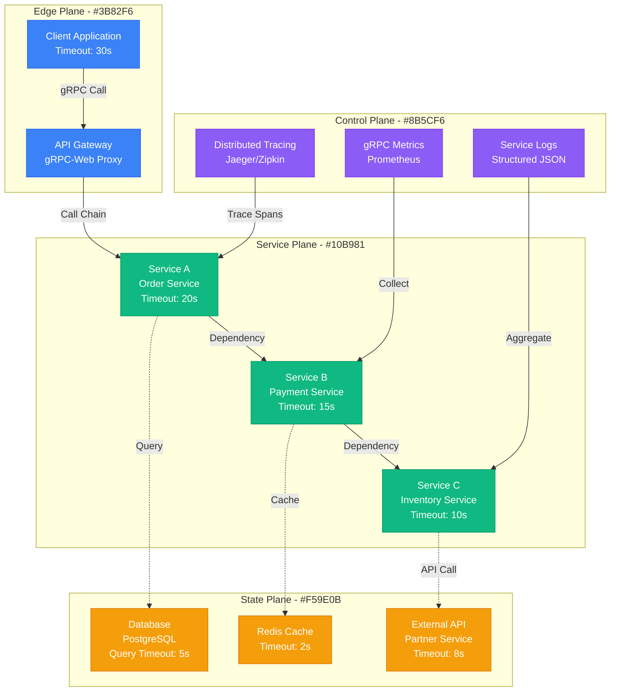
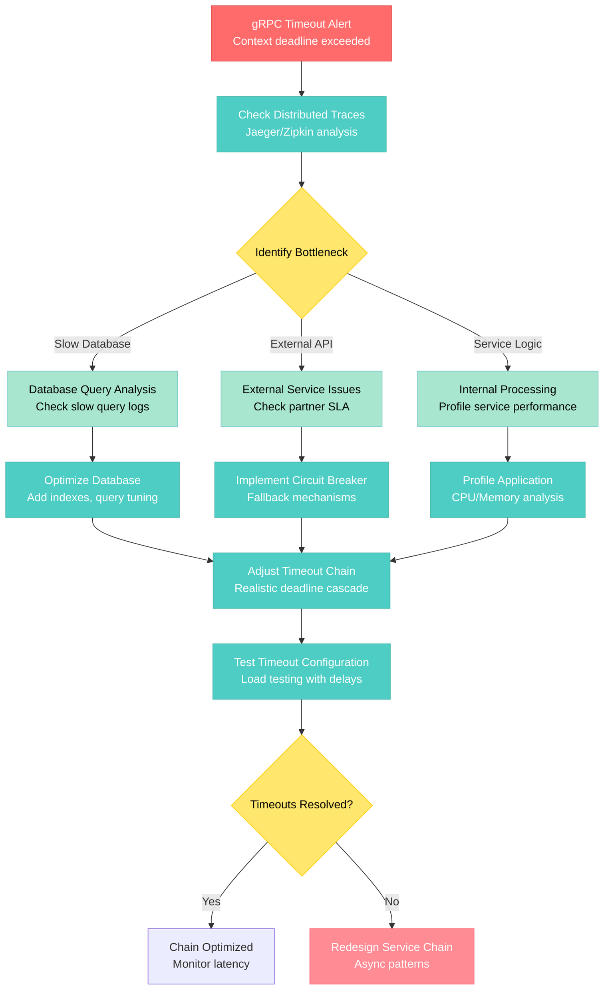

# gRPC Timeout Chain Debugging

**Scenario**: Production gRPC service chains experiencing cascading timeouts, causing request failures and service degradation across microservices.

**The 3 AM Reality**: Multiple services timing out in sequence, partial responses reaching clients, and complex distributed system failures.

## Symptoms Checklist

- [ ] gRPC calls timing out after configured deadline
- [ ] Cascading failures across service dependency chain
- [ ] High latency in service-to-service communication
- [ ] Context deadline exceeded errors in logs
- [ ] Circuit breaker activations in downstream services

## gRPC Timeout Chain Architecture



## Step-by-Step Debugging Flow



## Critical Commands & Queries

### gRPC Service Analysis
```bash
# Check gRPC service health
grpc_health_probe -addr=localhost:9090

# List available gRPC services
grpcurl -plaintext localhost:9090 list

# Describe gRPC service methods
grpcurl -plaintext localhost:9090 describe myservice.MyService

# Test gRPC call with timeout
grpcurl -d '{"id": "123"}' -max-time 10 -plaintext localhost:9090 myservice.MyService/GetOrder
```

### Distributed Tracing Analysis
```bash
# Query Jaeger for failed traces
curl "http://jaeger:16686/api/traces?service=order-service&lookback=1h&tags={\"error\":\"true\"}"

# Find traces with high latency
curl "http://jaeger:16686/api/traces?service=order-service&minDuration=5s"

# Analyze trace spans for timeout patterns
curl "http://jaeger:16686/api/traces?service=order-service" | \
jq '.data[] | select(.spans[] | select(.operationName | contains("timeout")))'
```

### gRPC Metrics Queries
```bash
# Check gRPC request duration
curl -s 'http://prometheus:9090/api/v1/query?query=grpc_server_handling_seconds' | jq .

# gRPC error rates by status code
curl -s 'http://prometheus:9090/api/v1/query?query=rate(grpc_server_handled_total{grpc_code!="OK"}[5m])' | jq .

# Active gRPC connections
curl -s 'http://prometheus:9090/api/v1/query?query=grpc_server_started_total' | jq .
```

### Service Performance Profiling
```bash
# Go service - pprof CPU profiling
curl http://service:6060/debug/pprof/profile?seconds=30 > cpu.prof
go tool pprof cpu.prof

# Memory profiling
curl http://service:6060/debug/pprof/heap > heap.prof
go tool pprof heap.prof

# Goroutine analysis
curl http://service:6060/debug/pprof/goroutine?debug=1
```

## Log Analysis Locations

### gRPC Service Logs
```bash
# Search for timeout-related errors
grep -E "context deadline exceeded|timeout|DeadlineExceeded" /var/log/service/*.log

# Parse structured JSON logs for gRPC errors
jq 'select(.level == "error" and (.message | contains("grpc") or contains("timeout")))' /var/log/service/app.log

# Filter logs by trace ID for correlation
grep "trace_id=abc123" /var/log/*/service.log | grep -E "error|timeout"

# Monitor real-time gRPC logs
tail -f /var/log/service/grpc.log | jq 'select(.grpc_code != "OK")'
```

### Prometheus gRPC Metrics
```promql
# gRPC request duration percentiles
histogram_quantile(0.95, rate(grpc_server_handling_seconds_bucket[5m]))

# gRPC error rate by service and method
rate(grpc_server_handled_total{grpc_code!="OK"}[5m]) / rate(grpc_server_handled_total[5m])

# gRPC timeout rate
rate(grpc_server_handled_total{grpc_code="DeadlineExceeded"}[5m])

# Service dependency call duration
histogram_quantile(0.99, rate(grpc_client_handling_seconds_bucket[5m]))
```

### Circuit Breaker Logs
```bash
# Hystrix circuit breaker events
grep -E "CIRCUIT_OPEN|FALLBACK|TIMEOUT" /var/log/service/circuit.log

# Check circuit breaker status
curl http://service:8080/health/circuitbreakers

# Monitor circuit breaker metrics
watch -n 5 'curl -s http://service:8080/metrics | grep circuit_breaker'
```

## Common Root Causes (by Probability)

### 1. Inadequate Timeout Configuration (45% of cases)
**Symptoms**: Timeouts too aggressive for actual service response times
```go
// Detection - Check timeout vs actual response time
func analyzeTimeouts() {
    ctx, cancel := context.WithTimeout(context.Background(), 5*time.Second)
    defer cancel()

    start := time.Now()
    _, err := client.GetOrder(ctx, &pb.GetOrderRequest{Id: "123"})
    duration := time.Since(start)

    if err != nil && duration >= 5*time.Second {
        log.Printf("Timeout too aggressive: %v", duration)
    }
}

// Fix - Implement realistic timeout chain
func configureTimeouts() {
    // Client timeout should be sum of all downstream timeouts + buffer
    clientTimeout := 30 * time.Second     // Total request timeout
    serviceATimeout := 20 * time.Second   // Service A processing
    serviceBTimeout := 15 * time.Second   // Service B processing
    databaseTimeout := 5 * time.Second    // Database query timeout
}
```

### 2. Slow Database Queries (25% of cases)
**Symptoms**: Database operations taking longer than allocated timeout
```sql
-- Detection - Find slow queries
SELECT query, mean_time, calls, total_time
FROM pg_stat_statements
WHERE mean_time > 1000  -- Queries taking > 1 second
ORDER BY mean_time DESC;

-- Fix - Add missing indexes
EXPLAIN ANALYZE SELECT * FROM orders WHERE customer_id = ?;
CREATE INDEX idx_orders_customer_id ON orders(customer_id);

-- Set appropriate query timeouts
SET statement_timeout = '5s';
```

### 3. External Service Dependencies (20% of cases)
**Symptoms**: Partner APIs or external services responding slowly
```go
// Detection - Monitor external call latency
func monitorExternalCalls() {
    start := time.Now()
    resp, err := http.Get("https://partner-api.com/data")
    duration := time.Since(start)

    metrics.RecordDuration("external_api_call", duration)

    if duration > 8*time.Second {
        log.Printf("External API slow: %v", duration)
    }
}

// Fix - Implement circuit breaker and fallback
type CircuitBreaker struct {
    maxFailures int
    timeout     time.Duration
    failures    int
    lastFailure time.Time
    state       string // "closed", "open", "half-open"
}

func (cb *CircuitBreaker) Call(fn func() error) error {
    if cb.state == "open" && time.Since(cb.lastFailure) > cb.timeout {
        cb.state = "half-open"
    }

    if cb.state == "open" {
        return errors.New("circuit breaker open")
    }

    err := fn()
    if err != nil {
        cb.failures++
        cb.lastFailure = time.Now()
        if cb.failures >= cb.maxFailures {
            cb.state = "open"
        }
    } else {
        cb.failures = 0
        cb.state = "closed"
    }

    return err
}
```

### 4. Resource Contention (7% of cases)
**Symptoms**: High CPU/memory usage causing processing delays
```bash
# Detection - Monitor resource usage
top -p $(pgrep service-name)
ps aux | grep service-name

# Check memory pressure
cat /proc/meminfo | grep -E "MemFree|MemAvailable"

# Monitor file descriptor usage
lsof -p $(pgrep service-name) | wc -l
```

### 5. Network Issues (3% of cases)
**Symptoms**: Network latency or packet loss between services
```bash
# Detection - Network diagnostics
ping -c 10 service-b.internal
traceroute service-b.internal
mtr --report service-b.internal

# Check network interface statistics
cat /proc/net/dev
ss -i  # Show network interface statistics
```

## Immediate Mitigation Steps

### Emergency Response (< 5 minutes)
1. **Increase Timeout Temporarily**
   ```go
   // Emergency timeout increase
   ctx, cancel := context.WithTimeout(context.Background(), 60*time.Second)
   defer cancel()

   // Apply to all critical paths
   ```

2. **Enable Circuit Breakers**
   ```go
   // Quick circuit breaker implementation
   if consecutiveFailures > 5 {
       return errors.New("circuit breaker activated")
   }
   ```

3. **Scale Slow Services**
   ```bash
   # Kubernetes scaling
   kubectl scale deployment slow-service --replicas=10

   # Docker Compose scaling
   docker-compose up -d --scale slow-service=5
   ```

### Short-term Fixes (< 30 minutes)
1. **Optimize Timeout Chain**
   ```yaml
   # service-config.yaml
   timeouts:
     client_total: 30s
     service_a: 20s
     service_b: 15s
     database: 5s
     external_api: 8s
     buffer: 2s  # Always add buffer
   ```

2. **Implement Retry Logic**
   ```go
   func callWithRetry(ctx context.Context, fn func() error) error {
       var err error
       for i := 0; i < 3; i++ {
           err = fn()
           if err == nil {
               return nil
           }

           // Exponential backoff
           backoff := time.Duration(math.Pow(2, float64(i))) * 100 * time.Millisecond
           select {
           case <-time.After(backoff):
               continue
           case <-ctx.Done():
               return ctx.Err()
           }
       }
       return err
   }
   ```

## Long-term Prevention

### Distributed Tracing Implementation
```go
// OpenTelemetry tracing setup
func initTracing() {
    tp := trace.NewTracerProvider(
        trace.WithBatcher(jaeger.New(jaeger.WithCollectorEndpoint(
            jaeger.WithEndpoint("http://jaeger:14268/api/traces"),
        ))),
        trace.WithSampler(trace.TraceIDRatioBased(0.1)), // 10% sampling
    )

    otel.SetTracerProvider(tp)
}

// Add tracing to gRPC calls
func (s *OrderService) GetOrder(ctx context.Context, req *pb.GetOrderRequest) (*pb.Order, error) {
    tracer := otel.Tracer("order-service")
    ctx, span := tracer.Start(ctx, "GetOrder")
    defer span.End()

    span.SetAttributes(
        attribute.String("order.id", req.Id),
        attribute.String("service.name", "order-service"),
    )

    // Propagate context to downstream calls
    return s.fetchOrderFromDB(ctx, req.Id)
}
```

### Comprehensive Monitoring Setup
```yaml
# prometheus-config.yml
global:
  scrape_interval: 15s

scrape_configs:
  - job_name: 'grpc-services'
    static_configs:
      - targets: ['service-a:9090', 'service-b:9090', 'service-c:9090']
    metrics_path: /metrics
    scrape_interval: 5s

  - job_name: 'jaeger'
    static_configs:
      - targets: ['jaeger:14269']

rule_files:
  - "grpc_alerts.yml"

alerting:
  alertmanagers:
    - static_configs:
        - targets: ['alertmanager:9093']
```

### gRPC Interceptor for Timeout Monitoring
```go
// Server interceptor for timeout monitoring
func TimeoutMonitoringInterceptor() grpc.UnaryServerInterceptor {
    return func(ctx context.Context, req interface{}, info *grpc.UnaryServerInfo, handler grpc.UnaryHandler) (interface{}, error) {
        start := time.Now()

        resp, err := handler(ctx, req)

        duration := time.Since(start)

        // Record metrics
        grpcDuration.WithLabelValues(info.FullMethod).Observe(duration.Seconds())

        if err != nil {
            if status.Code(err) == codes.DeadlineExceeded {
                timeoutCounter.WithLabelValues(info.FullMethod).Inc()
                log.Printf("Timeout in %s after %v", info.FullMethod, duration)
            }
        }

        return resp, err
    }
}

// Client interceptor for deadline propagation
func DeadlinePropagationInterceptor() grpc.UnaryClientInterceptor {
    return func(ctx context.Context, method string, req, reply interface{}, cc *grpc.ClientConn, invoker grpc.UnaryInvoker, opts ...grpc.CallOption) error {
        // Reduce deadline for downstream calls
        if deadline, ok := ctx.Deadline(); ok {
            remaining := time.Until(deadline)
            downstreamTimeout := remaining - (remaining / 10) // Keep 10% buffer

            if downstreamTimeout > 0 {
                newCtx, cancel := context.WithTimeout(ctx, downstreamTimeout)
                defer cancel()
                ctx = newCtx
            }
        }

        return invoker(ctx, method, req, reply, cc, opts...)
    }
}
```

### Timeout Configuration Management
```go
// Configuration management for timeouts
type TimeoutConfig struct {
    ServiceTimeouts map[string]time.Duration `json:"service_timeouts"`
    DefaultTimeout  time.Duration            `json:"default_timeout"`
    BufferRatio     float64                  `json:"buffer_ratio"`
}

func LoadTimeoutConfig() *TimeoutConfig {
    return &TimeoutConfig{
        ServiceTimeouts: map[string]time.Duration{
            "order-service":     20 * time.Second,
            "payment-service":   15 * time.Second,
            "inventory-service": 10 * time.Second,
            "database":          5 * time.Second,
            "external-api":      8 * time.Second,
        },
        DefaultTimeout: 30 * time.Second,
        BufferRatio:    0.1, // 10% buffer
    }
}

func (tc *TimeoutConfig) GetTimeoutForService(service string) time.Duration {
    if timeout, exists := tc.ServiceTimeouts[service]; exists {
        return timeout
    }
    return tc.DefaultTimeout
}

func (tc *TimeoutConfig) GetDownstreamTimeout(parentTimeout time.Duration) time.Duration {
    buffer := time.Duration(float64(parentTimeout) * tc.BufferRatio)
    return parentTimeout - buffer
}
```

## Production Examples

### Uber's gRPC Timeout Cascade (2020)
- **Incident**: Ride matching timeouts cascading through 8-service chain
- **Root Cause**: Database queries taking 6s with 5s gRPC timeout
- **Impact**: 40% ride matching failures for 12 minutes
- **Resolution**: Increased database timeout to 8s, optimized queries
- **Learning**: Always measure actual response times before setting timeouts

### Discord's Voice Service Chain (2021)
- **Incident**: Voice channel creation timing out during peak usage
- **Root Cause**: External WebRTC signaling service overwhelmed
- **Impact**: Voice channels unavailable for 15 minutes
- **Resolution**: Implemented circuit breaker, fallback to local signaling
- **Prevention**: Circuit breaker pattern for all external dependencies

### Shopify's Checkout Timeout Storm (2019)
- **Incident**: Payment processing timeouts during Black Friday
- **Root Cause**: Aggressive 3s timeout with payment provider taking 5s
- **Impact**: 25% checkout failures, $2M revenue impact
- **Resolution**: Increased timeout to 10s, added payment retry logic
- **Learning**: External service SLAs must inform timeout configuration

## Recovery Automation

### Timeout Chain Analysis Script
```bash
#!/bin/bash
# grpc-timeout-analyzer.sh - Analyze gRPC timeout patterns

JAEGER_ENDPOINT="http://jaeger:16686"
SERVICE_NAME="order-service"
LOOKBACK="1h"

# Function to analyze timeout patterns
analyze_timeouts() {
    echo "Analyzing gRPC timeout patterns for $SERVICE_NAME..."

    # Get traces with timeout errors
    timeout_traces=$(curl -s "$JAEGER_ENDPOINT/api/traces?service=$SERVICE_NAME&lookback=$LOOKBACK&tags={\"error\":\"true\"}" | \
        jq '.data[] | select(.spans[] | select(.tags[] | select(.key == "grpc.status_code" and .value == "4")))')

    # Extract timeout durations
    echo "$timeout_traces" | jq -r '.spans[] | select(.tags[] | select(.key == "grpc.status_code" and .value == "4")) | .duration' | \
    awk '{sum += $1; count++} END {if (count > 0) print "Average timeout duration:", sum/count/1000, "ms"; print "Total timeouts:", count}'

    # Find bottleneck services
    echo "Bottleneck analysis:"
    echo "$timeout_traces" | jq -r '.spans[] | .process.serviceName' | sort | uniq -c | sort -nr | head -5
}

# Function to recommend timeout adjustments
recommend_timeouts() {
    echo "Fetching successful request percentiles..."

    # Get P95 response times for each service
    services=("order-service" "payment-service" "inventory-service")

    for service in "${services[@]}"; do
        p95_time=$(curl -s "http://prometheus:9090/api/v1/query?query=histogram_quantile(0.95, rate(grpc_server_handling_seconds_bucket{job=\"$service\"}[5m]))" | \
            jq -r '.data.result[0].value[1]')

        if [ "$p95_time" != "null" ]; then
            # Recommend timeout as P95 + 50% buffer
            recommended=$(echo "$p95_time * 1.5" | bc)
            echo "$service recommended timeout: ${recommended}s (P95: ${p95_time}s)"
        fi
    done
}

analyze_timeouts
recommend_timeouts
```

### Automatic Timeout Adjustment
```go
// Adaptive timeout configuration
type AdaptiveTimeoutManager struct {
    serviceTimes    map[string]*ResponseTimeStats
    configFile      string
    updateInterval  time.Duration
    mu              sync.RWMutex
}

type ResponseTimeStats struct {
    P95         time.Duration
    P99         time.Duration
    LastUpdate  time.Time
    SampleCount int
}

func (atm *AdaptiveTimeoutManager) UpdateTimeouts() {
    atm.mu.Lock()
    defer atm.mu.Unlock()

    config := make(map[string]time.Duration)

    for service, stats := range atm.serviceTimes {
        // Set timeout as P99 + 50% buffer, minimum 1 second
        recommendedTimeout := stats.P99 + (stats.P99 / 2)
        if recommendedTimeout < time.Second {
            recommendedTimeout = time.Second
        }

        config[service] = recommendedTimeout
        log.Printf("Updated timeout for %s: %v (P99: %v)", service, recommendedTimeout, stats.P99)
    }

    // Write updated configuration
    atm.writeConfig(config)
}

func (atm *AdaptiveTimeoutManager) RecordResponseTime(service string, duration time.Duration) {
    atm.mu.Lock()
    defer atm.mu.Unlock()

    if stats, exists := atm.serviceTimes[service]; exists {
        stats.SampleCount++
        // Update percentiles using streaming algorithm
        atm.updatePercentiles(stats, duration)
    }
}
```

**Remember**: gRPC timeout chains require careful orchestration. Always measure actual response times before setting timeouts, implement proper circuit breakers for external dependencies, and use distributed tracing to identify bottlenecks in complex service chains.