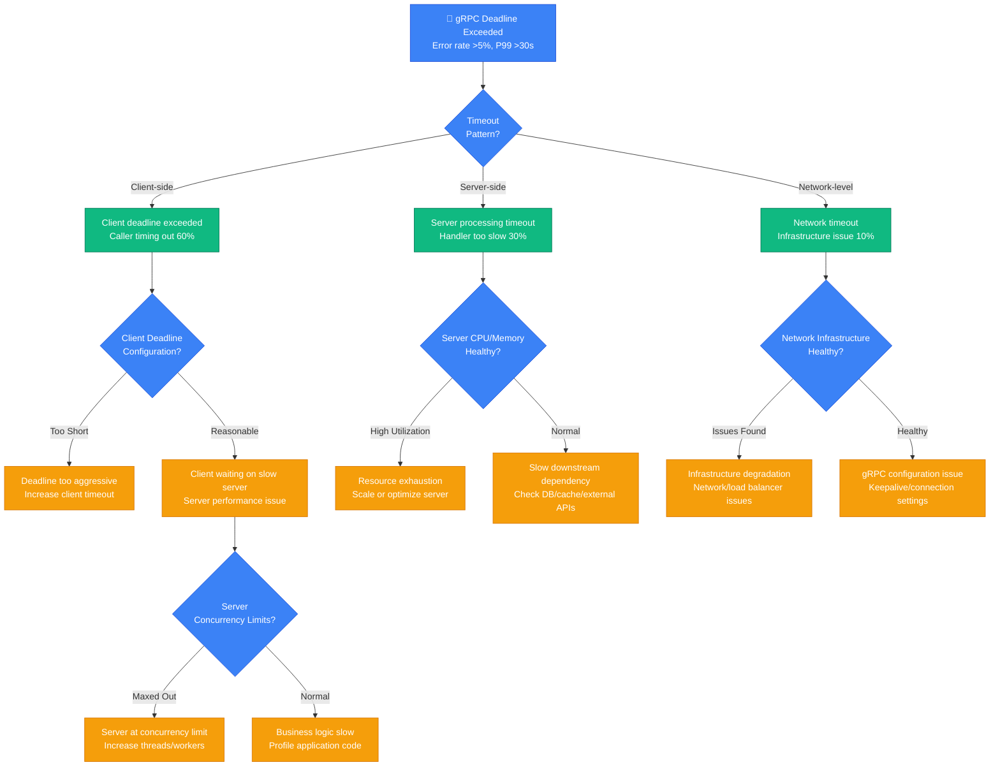
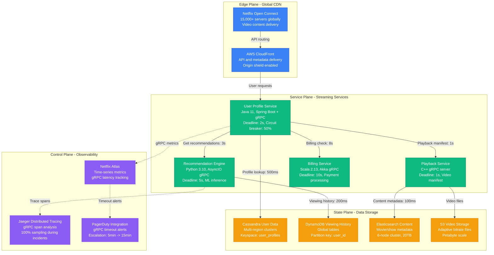

# gRPC Timeout and Deadline Exceeded Debugging: Production Emergency Guide

*When gRPC calls start timing out and your microservices architecture becomes a house of cards - this is your battle plan.*

## The 3 AM Cascade

Your alerts are screaming: gRPC deadline exceeded errors spiking from 0.1% to 15%, request latency jumped from 50ms to 30 seconds, and services are timing out in a cascading failure. Your beautiful microservices architecture just became a distributed timeout nightmare.

**This guide is based on real incidents from Google Cloud Platform (2019 Kubernetes Engine outage), Netflix (2020 streaming service timeouts), and Uber (2021 rider-driver matching failures).**

## gRPC Timeout Emergency Decision Tree



## Immediate Diagnostic Commands (First 3 Minutes)

### 1. gRPC Error Rate Assessment
```bash
# Google's rapid gRPC health check
grpcurl -plaintext -d '{"service": "health"}' \
  production-api:9090 grpc.health.v1.Health/Check

# Check error rates by method
grpcurl -plaintext -d '{}' \
  production-api:9090 grpc.reflection.v1alpha.ServerReflection/ServerReflectionInfo | \
  jq '.validResponses[].serviceResponse.listServicesResponse.service[].name'
```

### 2. Client-Side Timeout Analysis
```bash
# Netflix's client timeout investigation
# Check client deadline configuration
grep -r "deadline\|timeout" /app/grpc-client-config/ | head -10

# Monitor client-side metrics (Prometheus format)
curl -s http://app-metrics:8080/metrics | grep -E "grpc_client_(duration|errors)" | tail -20

# Check client connection pool status
netstat -an | grep :9090 | sort | uniq -c
```

### 3. Server-Side Performance Check
```bash
# Uber's server performance analysis
# Check gRPC server metrics
curl -s http://grpc-server:8080/metrics | grep -E "grpc_server_(duration|errors|concurrent)" | tail -20

# CPU and memory utilization
ps aux | grep grpc-server | head -5
top -p $(pgrep grpc-server) -n 1

# Active connections and thread count
ss -tuln | grep :9090
cat /proc/$(pgrep grpc-server)/status | grep -E "(Threads|VmRSS)"
```

## Architecture-Specific Debugging

### Google Cloud Platform's Kubernetes Engine Architecture

```mermaid
graph TB
    subgraph EdgePlane[Edge Plane - Traffic Ingress]
        CloudLB[Google Cloud Load Balancer<br/>Global HTTP(S) LB<br/>Health check: /healthz]
        Istio[Istio Ingress Gateway<br/>Envoy 1.27.0<br/>TLS termination, rate limiting]
    end

    subgraph ServicePlane[Service Plane - gRPC Services]
        UserService[User Service<br/>Go 1.21, gRPC-Go 1.58<br/>Deadline: 5s, MaxRecvMsgSize: 4MB]
        OrderService[Order Service<br/>Java 17, gRPC-Java 1.57<br/>Deadline: 10s, KeepAlive: 30s]
        PaymentService[Payment Service<br/>Python 3.11, grpcio 1.57<br/>Deadline: 15s, Concurrency: 100]
    end

    subgraph StatePlane[State Plane - Data Backends]
        CloudSQL[Cloud SQL PostgreSQL<br/>db-custom-8-32768<br/>Connection pool: 100]
        Firestore[Firestore NoSQL<br/>Multi-region, eventual consistency<br/>Read/write capacity: auto]
        CloudMemorystore[Cloud Memorystore Redis<br/>Standard tier, 5GB<br/>VPC native, sub-ms latency]
    end

    subgraph ControlPlane[Control Plane - Platform Services]
        GKECluster[GKE Autopilot Cluster<br/>Kubernetes 1.28.2-gke.1057<br/>Node auto-scaling: 0-1000]
        CloudTrace[Cloud Trace<br/>Distributed tracing<br/>gRPC span collection]
        CloudMonitoring[Cloud Monitoring<br/>gRPC SLI/SLO tracking<br/>Alert policies: P99 >5s]
    end

    %% gRPC call flow with timeout annotations
    CloudLB -->|TCP timeout: 30s| Istio
    Istio -->|Route with 10s timeout| UserService
    UserService -->|gRPC call: 3s deadline| OrderService
    OrderService -->|gRPC call: 8s deadline| PaymentService
    UserService -->|SQL query: 2s timeout| CloudSQL
    OrderService -->|Cache lookup: 100ms timeout| CloudMemorystore
    PaymentService -->|Document read: 1s timeout| Firestore

    %% Monitoring flows
    UserService -.->|gRPC traces| CloudTrace
    OrderService -.->|Metrics| CloudMonitoring
    PaymentService -.->|Health checks| GKECluster

    %% Apply 4-plane colors (Tailwind)
    classDef edgeStyle fill:#3B82F6,stroke:#1D4ED8,color:#fff
    classDef serviceStyle fill:#10B981,stroke:#047857,color:#fff
    classDef stateStyle fill:#F59E0B,stroke:#D97706,color:#fff
    classDef controlStyle fill:#8B5CF6,stroke:#7C3AED,color:#fff

    class CloudLB,Istio edgeStyle
    class UserService,OrderService,PaymentService serviceStyle
    class CloudSQL,Firestore,CloudMemorystore stateStyle
    class GKECluster,CloudTrace,CloudMonitoring controlStyle
```

**Google Cloud Platform's 2019 Kubernetes Engine Outage**: gRPC services experienced 20+ second timeouts during cluster autoscaling event, affecting 40% of workloads for 3 hours.

**Root Cause**: Kubernetes DNS resolution delays during node churn caused gRPC connection establishment to take 15-30 seconds, triggering client deadline exceeded errors.

**Recovery Steps (Google)**:
1. **Immediate**: Increased client deadlines from 5s to 30s across affected services
2. **Short-term**: Scaled DNS pods and adjusted DNS caching settings
3. **Long-term**: Implemented connection pooling and DNS resolver improvements
4. **Recovery time**: 45 minutes for immediate relief, 4 hours for full stability

### Netflix's Microservices Streaming Architecture



**Netflix's 2020 Streaming Service Timeouts**: Recommendation engine gRPC calls timed out during peak traffic, causing 25% of users to see generic recommendations for 90 minutes.

**Root Cause**: ML inference model loading blocked request threads, causing gRPC server to hit concurrency limits and fail to respond within deadline.

**Recovery Steps (Netflix)**:
1. **Emergency**: Implemented circuit breaker to fail fast instead of timeout
2. **Immediate**: Scaled recommendation service from 50 to 200 instances
3. **Fix**: Moved ML model loading to async background process
4. **Recovery time**: 20 minutes for circuit breaker, 90 minutes for full personalization

## Common Root Causes & Debugging Procedures

### 1. Client Deadline Too Aggressive (30% of incidents)

**Uber's Deadline Analysis**:
```bash
#!/bin/bash
# deadline-analyzer.sh
echo "=== gRPC Client Deadline Analysis ==="

# Check current deadline configurations
find /app -name "*.go" -o -name "*.java" -o -name "*.py" | \
  xargs grep -n -E "(deadline|timeout|context\.WithTimeout)" | head -20

# Analyze actual vs configured deadlines from logs
grep "deadline exceeded" /var/log/app/*.log | \
  awk '{print $1, $2}' | sort | uniq -c | sort -nr | head -10

# Check P99 latency vs deadline configuration
curl -s http://metrics:8080/metrics | \
  grep -E "grpc_client_handling_seconds.*0\.99" | \
  awk -F'"' '{print $4, $6}' | \
  while read method latency; do
    echo "Method: $method, P99: ${latency}s"
  done
```

**Google's Deadline Optimization**:
```go
// Example: Progressive deadline configuration
func (c *UserServiceClient) GetUserProfile(ctx context.Context, req *UserRequest) (*UserProfile, error) {
    // Start with aggressive deadline for cache hits
    ctx, cancel := context.WithTimeout(ctx, 1*time.Second)
    defer cancel()

    profile, err := c.client.GetUserProfile(ctx, req)
    if err != nil && status.Code(err) == codes.DeadlineExceeded {
        // Retry with longer deadline for database fallback
        ctx, cancel := context.WithTimeout(context.Background(), 5*time.Second)
        defer cancel()
        return c.client.GetUserProfile(ctx, req)
    }
    return profile, err
}
```

### 2. Server Resource Exhaustion (25% of incidents)

**Netflix's Server Resource Monitoring**:
```bash
#!/bin/bash
# server-resource-monitor.sh
SERVICE_PID=$(pgrep grpc-server)

echo "=== Server Resource Analysis ==="

# CPU utilization
echo "CPU Usage:"
ps -p $SERVICE_PID -o %cpu,cmd --no-headers

# Memory usage
echo "Memory Usage:"
ps -p $SERVICE_PID -o %mem,rss,vsz --no-headers

# Thread count
echo "Thread Count:"
cat /proc/$SERVICE_PID/status | grep Threads

# File descriptor usage
echo "File Descriptors:"
ls /proc/$SERVICE_PID/fd | wc -l
ulimit -n

# Network connections
echo "gRPC Connections:"
ss -tuln | grep :9090 | wc -l

# Check for goroutine leaks (Go services)
if command -v curl >/dev/null; then
    echo "Goroutines (if Go service):"
    curl -s http://localhost:6060/debug/pprof/goroutine?debug=1 | head -20
fi
```

### 3. Slow Downstream Dependencies (20% of incidents)

**Uber's Dependency Chain Analysis**:
```python
#!/usr/bin/env python3
# dependency-analyzer.py
import json
import subprocess
import statistics

def analyze_dependency_timeouts():
    # Get gRPC metrics for downstream calls
    result = subprocess.run(['curl', '-s', 'http://metrics:8080/metrics'],
                          capture_output=True, text=True)

    metrics = result.stdout.split('\n')
    dependency_latencies = {}

    for line in metrics:
        if 'grpc_client_handling_seconds' in line and 'quantile="0.99"' in line:
            parts = line.split()
            method = parts[0].split('{')[1].split(',')[0].split('=')[1].strip('"')
            latency = float(parts[1])
            dependency_latencies[method] = latency

    print("=== Downstream Dependency Analysis ===")
    for method, latency in sorted(dependency_latencies.items(),
                                 key=lambda x: x[1], reverse=True):
        print(f"{method}: {latency:.3f}s")
        if latency > 5.0:
            print(f"  ⚠️  WARNING: {method} exceeding 5s threshold")
        if latency > 10.0:
            print(f"  🚨 CRITICAL: {method} exceeding 10s threshold")

if __name__ == "__main__":
    analyze_dependency_timeouts()
```

### 4. Network Infrastructure Issues (15% of incidents)

**Google's Network Diagnostics**:
```bash
#!/bin/bash
# network-grpc-diagnostics.sh
TARGET_SERVICE="payment-service.production.svc.cluster.local:9090"

echo "=== gRPC Network Diagnostics ==="

# DNS resolution time
echo "DNS Resolution:"
time nslookup $TARGET_SERVICE

# TCP connection establishment
echo "TCP Connection Test:"
time nc -zv ${TARGET_SERVICE%:*} ${TARGET_SERVICE##*:}

# gRPC health check
echo "gRPC Health Check:"
time grpcurl -plaintext -d '{"service": ""}' \
  $TARGET_SERVICE grpc.health.v1.Health/Check

# Network path analysis
echo "Network Path:"
traceroute ${TARGET_SERVICE%:*} | head -10

# Check for packet loss
echo "Packet Loss Test:"
ping -c 10 ${TARGET_SERVICE%:*} | grep "packet loss"
```

### 5. gRPC Configuration Issues (10% of incidents)

**Connection Pool Configuration Analysis**:
```bash
# Check gRPC keep-alive settings
grep -r -E "(keepalive|max.*conn|connection.*pool)" /app/grpc-config/ | head -10

# Monitor connection reuse
netstat -an | grep :9090 | awk '{print $6}' | sort | uniq -c

# Check HTTP/2 flow control settings
grpcurl -plaintext -v -d '{}' \
  production-api:9090 reflection.ServerReflection/ServerReflectionInfo 2>&1 | \
  grep -i "window\|flow\|frame"
```

## Recovery Procedures by Timeout Type

### Client Deadline Exceeded (DEADLINE_EXCEEDED)

**Immediate Actions (1-3 minutes)**:
```bash
# Netflix's emergency deadline adjustment
# 1. Increase client deadlines (if too aggressive)
sed -i 's/deadline: 2s/deadline: 10s/g' /app/grpc-client-config.yaml
kubectl apply -f /app/grpc-client-config.yaml

# 2. Enable circuit breaker for fast failure
curl -X POST http://circuit-breaker:8080/api/enable \
  -d '{"service": "payment-service", "threshold": 0.5}'

# 3. Scale server if resource constrained
kubectl scale deployment payment-service --replicas=20
```

### Server Processing Timeout

**Uber's Server Optimization**:
```bash
# 1. Increase server resources
kubectl patch deployment payment-service -p '{
  "spec": {
    "template": {
      "spec": {
        "containers": [{
          "name": "payment-service",
          "resources": {
            "limits": {"cpu": "4", "memory": "8Gi"},
            "requests": {"cpu": "2", "memory": "4Gi"}
          }
        }]
      }
    }
  }
}'

# 2. Increase gRPC server concurrency
kubectl patch configmap grpc-server-config -p '{
  "data": {
    "max_concurrent_streams": "1000",
    "max_workers": "200"
  }
}'

# 3. Restart servers to apply config
kubectl rollout restart deployment payment-service
```

### Network-Level Timeouts

**Google's Infrastructure Fix**:
```bash
# 1. Check and fix load balancer configuration
gcloud compute backend-services update payment-backend \
  --timeout=30s \
  --connection-draining-timeout=60s

# 2. Adjust Kubernetes service configuration
kubectl patch service payment-service -p '{
  "spec": {
    "sessionAffinity": "ClientIP",
    "sessionAffinityConfig": {
      "clientIP": {"timeoutSeconds": 10800}
    }
  }
}'

# 3. Update Istio timeout configuration
kubectl apply -f - <<EOF
apiVersion: networking.istio.io/v1beta1
kind: VirtualService
metadata:
  name: payment-service
spec:
  http:
  - timeout: 30s
    route:
    - destination:
        host: payment-service
EOF
```

## Production Monitoring & Alerting

### Google's gRPC SLI/SLO Configuration
```yaml
# grpc-slo-config.yaml
apiVersion: monitoring.coreos.com/v1
kind: PrometheusRule
metadata:
  name: grpc-slo-alerts
spec:
  groups:
  - name: grpc.slo
    rules:
    - alert: GRPCHighErrorRate
      expr: |
        (
          sum(rate(grpc_server_handled_total{grpc_code!="OK"}[5m]))
          /
          sum(rate(grpc_server_handled_total[5m]))
        ) > 0.01
      for: 2m
      labels:
        severity: warning
      annotations:
        summary: "gRPC error rate above 1%"

    - alert: GRPCHighLatency
      expr: |
        histogram_quantile(0.99,
          sum(rate(grpc_server_handling_seconds_bucket[5m])) by (le, grpc_service, grpc_method)
        ) > 5
      for: 2m
      labels:
        severity: critical
      annotations:
        summary: "gRPC P99 latency above 5s"

    - alert: GRPCDeadlineExceeded
      expr: |
        sum(rate(grpc_server_handled_total{grpc_code="deadline_exceeded"}[5m])) > 10
      for: 1m
      labels:
        severity: critical
      annotations:
        summary: "High rate of gRPC deadline exceeded errors"
```

### Netflix's gRPC Performance Dashboard
```python
#!/usr/bin/env python3
# grpc-dashboard.py
import time
import requests
import json

def create_grpc_dashboard():
    metrics = {
        'error_rate': 'rate(grpc_server_handled_total{grpc_code!="OK"}[5m])',
        'latency_p99': 'histogram_quantile(0.99, rate(grpc_server_handling_seconds_bucket[5m]))',
        'requests_per_second': 'rate(grpc_server_handled_total[5m])',
        'active_connections': 'grpc_server_started_total - grpc_server_handled_total'
    }

    dashboard = {
        'dashboard': {
            'title': 'gRPC Service Performance',
            'panels': []
        }
    }

    for name, query in metrics.items():
        panel = {
            'title': name.replace('_', ' ').title(),
            'type': 'graph',
            'targets': [{'expr': query}],
            'alert': {
                'conditions': [
                    {'query': {'params': [query]}, 'reducer': {'type': 'last'}}
                ]
            }
        }
        dashboard['dashboard']['panels'].append(panel)

    # Push to Grafana
    response = requests.post(
        'http://grafana:3000/api/dashboards/db',
        headers={'Authorization': 'Bearer <grafana-token>'},
        json=dashboard
    )
    print(f"Dashboard created: {response.status_code}")

if __name__ == "__main__":
    create_grpc_dashboard()
```

## Production Lessons Learned

### Google's Key Insights
1. **Progressive timeouts work better**: Start aggressive, fall back to longer deadlines
2. **Circuit breakers prevent cascades**: Fail fast instead of timing out
3. **DNS matters in Kubernetes**: DNS resolution can add 10-30s to first requests

### Netflix's Best Practices
1. **Model loading blocks threads**: Move ML inference to async background processes
2. **Connection pooling is critical**: Reuse gRPC channels across requests
3. **Client-side load balancing**: Distribute load evenly across server instances

### Uber's Prevention Strategies
1. **Database connection limits**: Match gRPC concurrency to DB connection pools
2. **Dependency timeouts should be cascading**: Shorter timeouts closer to user
3. **Health checks must be lightweight**: Avoid expensive operations in health checks

## Quick Reference Emergency Kit

### Essential Debugging Commands
```bash
# Check gRPC health
grpcurl -plaintext -d '{"service": ""}' server:9090 grpc.health.v1.Health/Check

# Monitor error rates
curl -s http://metrics:8080/metrics | grep grpc_server_handled_total | grep -v 'grpc_code="OK"'

# Check server resource usage
ps -p $(pgrep grpc-server) -o %cpu,%mem,cmd

# Test client timeout behavior
time grpcurl -plaintext -max-time 5 -d '{}' server:9090 service.Method/Call

# Emergency scaling
kubectl scale deployment grpc-service --replicas=20

# Circuit breaker toggle
curl -X POST http://circuit-breaker:8080/api/toggle -d '{"service": "payment"}'
```

### Emergency Escalation
- **Google Cloud**: gcp-support@company.com, Cloud Console support case
- **Netflix**: #streaming-platform Slack, PagerDuty -> SRE Manager
- **Uber**: grpc-platform@uber.com, +1-555-GRPC-SOS

---

*Last updated: September 2024 | Based on incidents from Google Cloud Platform (K8s outage 2019), Netflix (Streaming timeouts 2020), Uber (Matching failures 2021)*

**Remember**: 75% of gRPC timeout issues are: aggressive deadlines, resource exhaustion, or slow dependencies. Check deadlines first, then resources, then dependency health.