# High Latency Investigation Guide

## Overview

High latency in distributed systems manifests in multiple forms - from database queries taking 10x longer than expected to API endpoints timing out during peak traffic. This guide provides systematic debugging approaches used by production teams at Netflix, Uber, and other scale companies.

**Time to Resolution**: 15-45 minutes for basic cases, 2-4 hours for complex distributed issues

## Decision Tree - 4-Plane Architecture Debug Flow

```mermaid
graph TD
    A[🚨 High Latency Alert<br/>SLO Breach: p99 > target] --> B{Debug Plane<br/>Analysis?}

    B -->|Edge Layer| C[Edge Plane Debug<br/>CDN/WAF/Load Balancer<br/>⏱️ 2-5 min]
    B -->|Service Layer| D[Service Plane Debug<br/>API Gateway/Microservices<br/>⏱️ 5-10 min]
    B -->|Data Layer| E[State Plane Debug<br/>Database/Cache/Storage<br/>⏱️ 10-15 min]
    B -->|Operations| F[Control Plane Debug<br/>Monitoring/Config/Deployment<br/>⏱️ 3-8 min]

    C --> C1[🔍 Edge Investigation<br/>• CloudFlare cache hit ratio<br/>• ALB target response time<br/>• WAF rule latency]

    D --> D1[🔍 Service Investigation<br/>• API Gateway p99 latency<br/>• Thread pool exhaustion<br/>• Circuit breaker state]

    E --> E1[🔍 State Investigation<br/>• Database slow queries<br/>• Cache miss storms<br/>• Connection pool status]

    F --> F1[🔍 Control Investigation<br/>• Recent deployments<br/>• Config changes<br/>• Monitoring gaps]

    C1 --> G[🎯 Debugging Commands<br/>Execute based on plane]
    D1 --> G
    E1 --> G
    F1 --> G

    G --> H[📊 Metrics Collection<br/>Gather evidence]
    H --> I[🔧 Resolution Action<br/>Apply targeted fix]

    %% Apply 4-plane colors
    classDef edgeStyle fill:#0066CC,stroke:#004499,color:#fff
    classDef serviceStyle fill:#00AA00,stroke:#007700,color:#fff
    classDef stateStyle fill:#FF8800,stroke:#CC6600,color:#fff
    classDef controlStyle fill:#CC0000,stroke:#990000,color:#fff

    class A,C,C1 edgeStyle
    class D,D1,G serviceStyle
    class E,E1,H stateStyle
    class F,F1,I controlStyle
```



## 4-Plane Emergency Commands (First 5 Minutes)

### 🔵 Edge Plane (0066CC) - Load Balancer & CDN Debug
```bash
# AWS ALB metrics (replace with your LB ARN)
aws cloudwatch get-metric-statistics --namespace AWS/ApplicationELB \
  --metric-name TargetResponseTime --dimensions Name=LoadBalancer,Value=app/my-alb/1234567890123456 \
  --start-time $(date -u -d '10 minutes ago' +%Y-%m-%dT%H:%M:%S) \
  --end-time $(date -u +%Y-%m-%dT%H:%M:%S) --period 60 --statistics Average,Maximum

# CloudFlare analytics (if using CF)
curl -X GET "https://api.cloudflare.com/client/v4/zones/{zone_id}/analytics/dashboard" \
  -H "Authorization: Bearer {api_token}" | jq '.result.timeseries[] | select(.since > (now - 600))'

# NGINX/HAProxy check (if self-hosted)
curl -s http://localhost/nginx_status | grep -E "(Active|Reading|Writing|Waiting)"
echo "show stat" | socat stdio /var/lib/haproxy/stats | head -10
```

### 🟢 Service Plane (00AA00) - Application & API Debug
```bash
# API Gateway latency (AWS)
aws logs filter-log-events --log-group-name API-Gateway-Execution-Logs_{api_id}/{stage} \
  --start-time $(date -d '10 minutes ago' +%s)000 \
  --filter-pattern '[timestamp, id, ip, user, time > 100, ...]'

# Java application thread dumps (if Java service)
jstack $(pgrep java) > /tmp/threaddump_$(date +%s).txt && echo "Thread dump saved"
jcmd $(pgrep java) GC.run_finalization && echo "GC triggered"

# Spring Boot Actuator health
curl -s http://localhost:8080/actuator/health | jq '.'
curl -s http://localhost:8080/actuator/metrics/http.server.requests | jq '.measurements[] | select(.statistic == "MAX")'

# Container resource usage (if containerized)
docker stats --no-stream --format "table {{.Container}}\t{{.CPUPerc}}\t{{.MemUsage}}\t{{.NetIO}}"
kubectl top pods --all-namespaces --sort-by cpu
```

### 🟠 State Plane (FF8800) - Database & Cache Debug
```bash
# PostgreSQL active queries and blocking
psql -c "SELECT pid, now() - pg_stat_activity.query_start AS duration, query, state
         FROM pg_stat_activity
         WHERE (now() - pg_stat_activity.query_start) > interval '5 minutes';"

psql -c "SELECT blocked_locks.pid AS blocked_pid, blocking_locks.pid AS blocking_pid,
         blocked_activity.query AS blocked_statement, blocking_activity.query AS blocking_statement
         FROM pg_catalog.pg_locks blocked_locks
         JOIN pg_catalog.pg_stat_activity blocked_activity ON blocked_activity.pid = blocked_locks.pid
         JOIN pg_catalog.pg_locks blocking_locks ON blocking_locks.locktype = blocked_locks.locktype
         JOIN pg_catalog.pg_stat_activity blocking_activity ON blocking_activity.pid = blocking_locks.pid
         WHERE NOT blocked_locks.granted;"

# Redis performance check
redis-cli --latency-history -i 1 | head -20
redis-cli info stats | grep -E "(instantaneous_ops_per_sec|used_memory_human|connected_clients)"
redis-cli slowlog get 10

# MongoDB slow operations (if MongoDB)
mongo --eval "db.runCommand({profile: 2, slowms: 100}); db.system.profile.find().limit(5).sort({ts:-1}).pretty()"

# Cache hit ratios
redis-cli info stats | awk -F: '/keyspace_hits|keyspace_misses/ {print $1 ": " $2}'
```

### 🔴 Control Plane (CC0000) - Monitoring & Operations Debug
```bash
# Recent deployments and config changes
git log --oneline -10 --since="2 hours ago"
kubectl get events --sort-by='.lastTimestamp' | head -20

# System resource utilization
uptime && free -h && df -h
iostat 1 3 | tail -5
vmstat 1 3 | tail -3

# Prometheus/Grafana alerts (if using Prometheus)
curl -s "http://prometheus:9090/api/v1/alerts" | jq '.data.alerts[] | select(.state == "firing")'

# Application logs error surge
tail -1000 /var/log/application.log | grep -E "(ERROR|FATAL|Exception)" | tail -20
journalctl --since "10 minutes ago" --priority=err | tail -10
```

### 2. Database Quick Check
```bash
# PostgreSQL active queries
psql -c "SELECT query, state, query_start, now() - query_start as duration FROM pg_stat_activity WHERE state = 'active' ORDER BY duration DESC LIMIT 10;"

# MySQL process list
mysql -e "SHOW PROCESSLIST;"

# Redis latency
redis-cli --latency-history -i 1
```

### 3. Application Server Status
```bash
# Java thread dumps (for CPU investigation)
jstack $(pgrep java) > threaddump_$(date +%s).txt

# Python/gunicorn worker status
ps aux | grep gunicorn | head -10

# Node.js event loop lag
node -e "const { performance, PerformanceObserver } = require('perf_hooks'); setInterval(() => console.log('Event Loop Lag:', process.hrtime.bigint() - performance.now() + 'ms'), 1000)"
```

## Deep Dive Analysis

### Distributed Tracing Analysis

```bash
# Jaeger query for slow traces (adjust time range and service)
curl -G "http://jaeger-query:16686/api/traces" \
  --data-urlencode "service=order-service" \
  --data-urlencode "start=$(date -d '1 hour ago' +%s)000000" \
  --data-urlencode "end=$(date +%s)000000" \
  --data-urlencode "limit=50" \
  --data-urlencode "minDuration=5s" | jq '.data[0].spans[] | select(.duration > 5000000) | {operationName, duration}'
```

### Network vs Processing Time Separation

```python
# Python script for latency breakdown analysis
import requests
import time

def measure_latency_breakdown(url, iterations=10):
    """Measure DNS, TCP, TLS, and processing time separately"""
    results = []

    for i in range(iterations):
        start_time = time.perf_counter()

        try:
            response = requests.get(url, timeout=30)
            total_time = time.perf_counter() - start_time

            # Extract timing information
            results.append({
                'total_time': total_time,
                'status_code': response.status_code,
                'response_size': len(response.content),
                'headers': dict(response.headers)
            })
        except Exception as e:
            results.append({'error': str(e), 'total_time': time.perf_counter() - start_time})

    return results

# Usage
results = measure_latency_breakdown('https://api.example.com/health')
avg_latency = sum(r.get('total_time', 0) for r in results) / len(results)
print(f"Average latency: {avg_latency:.3f}s")
```

### Database Query Performance Deep Dive

```sql
-- PostgreSQL query performance analysis
SELECT
    query,
    calls,
    total_time,
    mean_time,
    stddev_time,
    rows,
    100.0 * shared_blks_hit / nullif(shared_blks_hit + shared_blks_read, 0) AS hit_percent
FROM pg_stat_statements
WHERE mean_time > 100  -- queries taking more than 100ms on average
ORDER BY mean_time DESC
LIMIT 20;

-- Index usage verification
SELECT
    schemaname,
    tablename,
    indexname,
    idx_scan,
    idx_tup_read,
    idx_tup_fetch
FROM pg_stat_user_indexes
WHERE idx_scan < 10  -- potentially unused indexes
ORDER BY schemaname, tablename;
```

### Cache Performance Investigation

```bash
# Redis cache hit ratio
redis-cli info stats | grep -E "(hits|misses)"

# Memcached statistics
echo "stats" | nc memcached-host 11211 | grep -E "(get_hits|get_misses|cmd_get)"

# Application-level cache analysis (example for Python with Redis)
python -c "
import redis
r = redis.Redis()
info = r.info('stats')
hit_rate = info['keyspace_hits'] / (info['keyspace_hits'] + info['keyspace_misses']) * 100
print(f'Cache hit rate: {hit_rate:.2f}%')
"
```

## Platform-Specific Debugging

### AWS

```bash
# CloudWatch metrics for latency investigation
aws cloudwatch get-metric-statistics \
  --namespace AWS/ApplicationELB \
  --metric-name TargetResponseTime \
  --dimensions Name=LoadBalancer,Value=app/my-loadbalancer/1234567890123456 \
  --start-time $(date -u -d '1 hour ago' +%Y-%m-%dT%H:%M:%S) \
  --end-time $(date -u +%Y-%m-%dT%H:%M:%S) \
  --period 300 \
  --statistics Average,Maximum

# RDS performance insights
aws rds describe-db-log-files --db-instance-identifier mydb-instance
aws rds download-db-log-file-portion --db-instance-identifier mydb-instance --log-file-name slow-query-log

# X-Ray trace analysis
aws xray get-trace-summaries --time-range-type TimeRangeByStartTime --start-time $(date -u -d '1 hour ago' +%Y-%m-%dT%H:%M:%S) --end-time $(date -u +%Y-%m-%dT%H:%M:%S) --filter-expression 'ResponseTime > 5'
```

### GCP

```bash
# Cloud Monitoring for latency metrics
gcloud monitoring metrics list --filter="metric.type:appengine.googleapis.com/http/server/response_latencies"

# Cloud SQL query insights
gcloud sql operations list --instance=my-instance --filter="operationType=UPDATE_DATABASE"

# Cloud Trace analysis
gcloud trace list-traces --start-time=$(date -u -d '1 hour ago' +%Y-%m-%dT%H:%M:%S.%3NZ) --filter="latency:>5s"
```

### Azure

```bash
# Application Insights query for high latency
az monitor app-insights query --app my-app-insights --analytics-query "
requests
| where timestamp > ago(1h)
| where duration > 5000
| summarize percentiles(duration, 50, 95, 99) by bin(timestamp, 5m)
"

# Azure SQL Database query performance
az sql db query-performance list --resource-group myResourceGroup --server myServer --database myDatabase
```

## Production Case Studies

### Case Study 1: Netflix - Microservice Chain Latency

**Problem**: API latency spiked from 50ms p99 to 2.5s during peak hours

**Investigation Process**:
1. **Distributed tracing** revealed the recommendation service was the bottleneck
2. **Database analysis** showed recommendation queries weren't using proper indexes
3. **Cache analysis** revealed cache invalidation storm during user preference updates

**Commands Used**:
```bash
# Identified slow spans in Jaeger
curl -G "http://jaeger:16686/api/traces" --data-urlencode "service=recommendation-service" --data-urlencode "minDuration=2s"

# Found missing indexes in PostgreSQL
psql -c "SELECT schemaname,tablename,attname,inherited,n_distinct,correlation FROM pg_stats WHERE schemaname='recommendations' AND n_distinct > 100;"

# Discovered cache stampede
redis-cli monitor | grep -E "(DEL|EXPIRED)"
```

**Resolution**: Added composite indexes, implemented cache warming, reduced cache invalidation scope
**Time to Resolution**: 3.5 hours

### Case Study 2: Uber - Database Connection Pool Exhaustion

**Problem**: Ride booking latency increased 10x during surge pricing events

**Root Cause**: Connection pool exhaustion causing request queuing

**Investigation Commands**:
```bash
# Connection pool statistics
psql -c "SELECT state, count(*) FROM pg_stat_activity GROUP BY state;"

# Application connection pool metrics (HikariCP example)
curl http://app-metrics:8080/actuator/metrics/hikaricp.connections.active
curl http://app-metrics:8080/actuator/metrics/hikaricp.connections.pending
```

**Resolution**: Increased connection pool size, implemented connection retry with exponential backoff
**Time to Resolution**: 45 minutes

### Case Study 3: Stripe - Payment Processing Delays

**Problem**: Payment confirmations delayed by 15-30 seconds during Black Friday

**Root Cause**: Third-party payment gateway latency plus inadequate timeout configuration

**Key Metrics**:
- Payment gateway response time: 12-15 seconds (normal: 1-2s)
- Internal timeout: 30 seconds
- User abandonment: 23% increase

**Resolution**: Implemented parallel payment processing, reduced timeouts, added fallback gateways
**Time to Resolution**: 2 hours

## Prevention Strategies

### 1. Proactive Monitoring Setup

```yaml
# Prometheus alerting rules for latency
groups:
- name: latency_alerts
  rules:
  - alert: HighLatency
    expr: histogram_quantile(0.99, http_request_duration_seconds_bucket) > 1.0
    for: 2m
    labels:
      severity: warning
    annotations:
      summary: "High latency detected ({{ $value }}s)"

  - alert: DatabaseSlowQuery
    expr: pg_stat_statements_mean_time_seconds > 0.5
    for: 1m
    labels:
      severity: critical
```

### 2. Synthetic Monitoring

```python
# Synthetic transaction monitoring
import requests
import time
from datetime import datetime

def synthetic_transaction_test():
    """Simulate user journey and measure latency at each step"""
    steps = [
        {"name": "login", "url": "https://api.company.com/auth/login", "method": "POST"},
        {"name": "profile", "url": "https://api.company.com/user/profile", "method": "GET"},
        {"name": "search", "url": "https://api.company.com/search?q=test", "method": "GET"}
    ]

    session = requests.Session()
    results = {}

    for step in steps:
        start_time = time.perf_counter()
        try:
            response = session.request(step["method"], step["url"], timeout=10)
            duration = time.perf_counter() - start_time
            results[step["name"]] = {
                "duration": duration,
                "status_code": response.status_code,
                "timestamp": datetime.utcnow().isoformat()
            }
        except Exception as e:
            results[step["name"]] = {"error": str(e), "timestamp": datetime.utcnow().isoformat()}

    return results
```

### 3. Capacity Planning Based on Latency

```bash
# Load testing with latency focus (using wrk)
wrk -t12 -c400 -d30s --script=lua/latency-test.lua http://api.example.com/endpoint

# JMeter command line for latency testing
jmeter -n -t latency_test.jmx -l results.jtl -e -o report_folder
```

## 🚨 3 AM Emergency Debugging Checklist

**Target Resolution Times**: P0 incidents < 15 minutes, P1 incidents < 45 minutes

### ⏱️ First 2 Minutes - Situation Assessment
- [ ] **System Health Check**: `uptime && iostat 1 1`
  - **Alert if**: Load average > 4.0 or iowait > 20%
- [ ] **Database Connectivity**: `pg_isready -h $DB_HOST -p 5432`
  - **Alert if**: Connection failed or response > 1s
- [ ] **Recent Changes**: `git log --oneline -10 --since="2 hours ago"`
  - **Alert if**: Any deployments in last 30 minutes
- [ ] **Error Surge**: `grep -c ERROR /var/log/app.log | tail -5`
  - **Alert if**: >100 errors in last 5 minutes

### ⏱️ Minutes 2-5 - 4-Plane Quick Triage

#### 🔵 Edge Plane Health
- [ ] **Load Balancer**: `aws elbv2 describe-target-health --target-group-arn $TG_ARN`
  - **Alert if**: Any targets showing "unhealthy"
- [ ] **CDN Cache Hit**: Check CloudFlare/CloudFront hit ratio
  - **Alert if**: Hit ratio < 85% (normal: >90%)

#### 🟢 Service Plane Health
- [ ] **API Latency**: `curl -w "Total: %{time_total}s\n" -s -o /dev/null $API_ENDPOINT`
  - **Alert if**: Response time > 2 seconds
- [ ] **Thread Pool**: `jstack $(pgrep java) | grep -c "java.lang.Thread.State: BLOCKED"`
  - **Alert if**: >20 blocked threads

#### 🟠 State Plane Health
- [ ] **DB Slow Queries**: `psql -c "SELECT count(*) FROM pg_stat_activity WHERE state='active' AND query_start < now() - interval '30 seconds';"`
  - **Alert if**: >5 long-running queries
- [ ] **Cache Performance**: `redis-cli info stats | grep keyspace_hit`
  - **Alert if**: Hit rate < 90%

#### 🔴 Control Plane Health
- [ ] **Monitoring Gaps**: Check if Prometheus/Grafana is responsive
- [ ] **Resource Exhaustion**: `df -h | grep -E "(9[0-9]%|100%)"`
  - **Alert if**: Any disk >90% full

### ⏱️ Minutes 5-15 - Deep Investigation

#### If Edge Plane Issues Detected:
```bash
# ALB target response times
aws cloudwatch get-metric-statistics --namespace AWS/ApplicationELB \
  --metric-name TargetResponseTime --start-time $(date -d '30 minutes ago' -Iseconds) \
  --end-time $(date -Iseconds) --period 300 --statistics Maximum

# Expected: <100ms p95, Alert if: >500ms
```

#### If Service Plane Issues Detected:
```bash
# Circuit breaker states
curl -s http://localhost:8080/actuator/circuitbreakers | jq '.circuitBreakers[] | select(.state != "CLOSED")'

# Thread dump analysis
jstack $(pgrep java) | grep -A 5 -B 5 "BLOCKED\|WAITING"
```

#### If State Plane Issues Detected:
```bash
# Database lock analysis
psql -c "SELECT pid, usename, query_start, query FROM pg_stat_activity WHERE state = 'active' ORDER BY query_start;"

# Connection pool status
curl -s http://localhost:8080/actuator/metrics/hikaricp.connections | jq '.measurements'
```

### ⏱️ After 15 Minutes - Escalation Actions

#### Critical Escalation (P0 - Service Down)
- [ ] **Immediate**: Page @incident-commander via PagerDuty
- [ ] **War Room**: Bridge line: +1-XXX-XXX-XXXX, pin 12345
- [ ] **Communication**: Update status page with initial findings
- [ ] **Rollback Decision**: If deployment <2 hours ago, prepare rollback

#### High Priority (P1 - Performance Degraded)
- [ ] **Technical Lead**: Slack @tech-leads with investigation summary
- [ ] **Monitoring**: Enable debug logging: `kubectl patch deployment app -p '{"spec":{"template":{"spec":{"containers":[{"name":"app","env":[{"name":"LOG_LEVEL","value":"DEBUG"}]}]}}}}'`
- [ ] **Customer Impact**: Check error rates by customer tier

### 📊 Key Thresholds for Escalation

| Metric | Normal | Warning | Critical | Action |
|--------|--------|---------|----------|---------|
| API p99 Latency | <100ms | 100-500ms | >500ms | Immediate escalation |
| Error Rate | <0.1% | 0.1-1% | >1% | Page on-call |
| DB Connection Pool | <70% | 70-85% | >85% | Restart app pods |
| Cache Hit Rate | >95% | 90-95% | <90% | Check cache warmth |
| CPU Utilization | <70% | 70-85% | >85% | Scale out |
| Memory Usage | <80% | 80-90% | >90% | Memory leak investigation |

### 🔧 Common Quick Fixes (if safe to apply)

1. **High CPU**: `kubectl scale deployment app --replicas=10`
2. **Memory Pressure**: `kubectl delete pod -l app=myapp --force` (rolling restart)
3. **DB Connections**: Restart connection pool: `curl -X POST http://localhost:8080/actuator/restart-db-pool`
4. **Cache Miss Storm**: `redis-cli flushdb && ./warm-cache.sh`
5. **Circuit Breaker Stuck**: `curl -X POST http://localhost:8080/actuator/circuitbreakers/reset`

## Metrics and SLOs

### Key Latency Metrics to Track
- **p50, p95, p99 response times** by service and endpoint
- **Database query response times** by query type
- **Cache hit ratios** and cache response times
- **Network latency** between services
- **Connection pool utilization** percentages

### Example SLO Configuration
```yaml
service_level_objectives:
  - name: "API Response Time"
    description: "99% of API requests complete within 500ms"
    metric: "http_request_duration_seconds"
    target: 0.5
    percentile: 99
    window: "5m"

  - name: "Database Query Performance"
    description: "95% of database queries complete within 100ms"
    metric: "db_query_duration_seconds"
    target: 0.1
    percentile: 95
    window: "5m"
```

**Remember**: In production incidents, every second counts. Focus on quick wins first - restart services, clear caches, or implement circuit breakers - while you investigate root causes.

This guide is battle-tested across companies processing billions of requests daily. The goal is not just to fix the immediate issue, but to understand why it happened and prevent recurrence.