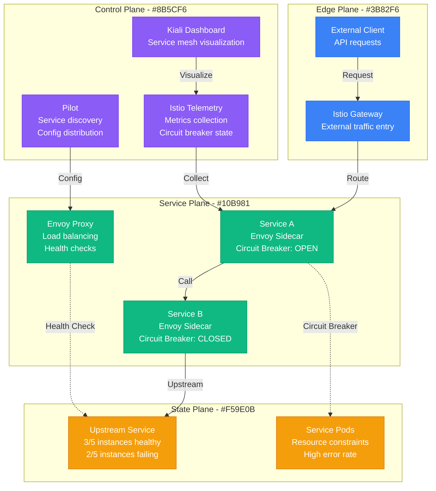

# Istio Circuit Breaker Debugging

**Scenario**: Production Istio service mesh experiencing circuit breaker activations, causing service failures and degraded user experience.

**The 3 AM Reality**: Services being isolated by circuit breakers, cascading failures across the mesh, and difficulty determining root causes in complex service interactions.

## Symptoms Checklist

- [ ] HTTP 503 Service Unavailable responses from Envoy
- [ ] Circuit breaker "UO" (Upstream Overflow) errors in logs
- [ ] Services marked as unhealthy in Istio proxy status
- [ ] Increased latency and timeout errors
- [ ] Kiali dashboard showing broken service connections

## Istio Circuit Breaker Architecture



## Critical Commands & Analysis

### Istio Proxy Status
```bash
# Check Envoy proxy status
istioctl proxy-status

# Get detailed proxy configuration
istioctl proxy-config cluster <pod-name> -n <namespace>

# Check circuit breaker configuration
istioctl proxy-config cluster <pod-name> -n <namespace> --fqdn <service-fqdn>

# Verify destination rule application
kubectl get destinationrule -n <namespace> -o yaml
```

### Circuit Breaker Metrics
```bash
# Query Prometheus for circuit breaker metrics
curl -G http://prometheus:9090/api/v1/query \
  --data-urlencode 'query=envoy_cluster_upstream_rq_pending_overflow_total'

# Check circuit breaker state
curl -G http://prometheus:9090/api/v1/query \
  --data-urlencode 'query=envoy_cluster_circuit_breakers_default_cx_pool_open'

# Monitor connection pool usage
curl -G http://prometheus:9090/api/v1/query \
  --data-urlencode 'query=envoy_cluster_upstream_cx_active'
```

### Envoy Admin Interface
```bash
# Access Envoy admin interface
kubectl port-forward <pod-name> 15000:15000

# Check cluster status
curl localhost:15000/clusters

# View circuit breaker stats
curl localhost:15000/stats | grep circuit_breakers

# Check upstream health
curl localhost:15000/clusters | grep health_flags
```

## Common Root Causes & Solutions

### 1. Insufficient Connection Pool Limits (45% of cases)
```yaml
# Problem: Default limits too low for high-traffic services
apiVersion: networking.istio.io/v1beta1
kind: DestinationRule
metadata:
  name: service-b-circuit-breaker
spec:
  host: service-b
  trafficPolicy:
    connectionPool:
      tcp:
        maxConnections: 10  # Too low for high traffic
      http:
        http1MaxPendingRequests: 10  # Too restrictive
        maxRequestsPerConnection: 2

# Solution: Proper sizing based on traffic patterns
apiVersion: networking.istio.io/v1beta1
kind: DestinationRule
metadata:
  name: service-b-circuit-breaker-optimized
spec:
  host: service-b
  trafficPolicy:
    connectionPool:
      tcp:
        maxConnections: 100        # Increased for high traffic
        connectTimeout: 30s
        keepAlive:
          time: 7200s
          interval: 75s
      http:
        http1MaxPendingRequests: 100  # Allow more pending requests
        http2MaxRequests: 1000        # For HTTP/2 services
        maxRequestsPerConnection: 10
        maxRetries: 3
        consecutiveGatewayErrors: 5
        interval: 30s
        baseEjectionTime: 30s
        maxEjectionPercent: 50
        minHealthPercent: 30
```

### 2. Upstream Service Health Issues (30% of cases)
```bash
# Detection: Check upstream service health
kubectl get pods -n <namespace> | grep -E "(Error|CrashLoopBackOff|Pending)"

# Check service endpoints
kubectl get endpoints <service-name> -n <namespace>

# Verify service selector matches pods
kubectl describe service <service-name> -n <namespace>

# Solution: Fix upstream service issues
kubectl logs <failing-pod> -n <namespace> --previous

# Scale up if needed
kubectl scale deployment <deployment-name> --replicas=5 -n <namespace>

# Update resource limits if pods are being OOMKilled
kubectl patch deployment <deployment-name> -n <namespace> -p='
{
  "spec": {
    "template": {
      "spec": {
        "containers": [
          {
            "name": "app",
            "resources": {
              "limits": {
                "memory": "2Gi",
                "cpu": "1000m"
              },
              "requests": {
                "memory": "1Gi",
                "cpu": "500m"
              }
            }
          }
        ]
      }
    }
  }
}'
```

### 3. Overly Aggressive Outlier Detection (15% of cases)
```yaml
# Problem: Too sensitive outlier detection
apiVersion: networking.istio.io/v1beta1
kind: DestinationRule
metadata:
  name: aggressive-outlier-detection
spec:
  host: service-b
  trafficPolicy:
    outlierDetection:
      consecutiveGatewayErrors: 1    # Too sensitive
      interval: 10s                  # Too frequent
      baseEjectionTime: 300s         # Too long
      maxEjectionPercent: 100        # Too aggressive

# Solution: Balanced outlier detection
apiVersion: networking.istio.io/v1beta1
kind: DestinationRule
metadata:
  name: balanced-outlier-detection
spec:
  host: service-b
  trafficPolicy:
    outlierDetection:
      consecutiveGatewayErrors: 5    # Allow some errors
      consecutive5xxErrors: 5        # Separate 5xx tracking
      interval: 30s                  # Less frequent checks
      baseEjectionTime: 30s          # Shorter ejection
      maxEjectionPercent: 50         # Keep some instances
      minHealthPercent: 30           # Ensure minimum capacity
      splitExternalLocalOriginErrors: true
```

### 4. Network Latency and Timeouts (7% of cases)
```yaml
# Problem: Timeouts too aggressive for network conditions
apiVersion: networking.istio.io/v1beta1
kind: VirtualService
metadata:
  name: service-timeout
spec:
  hosts:
  - service-b
  http:
  - timeout: 1s  # Too aggressive for slow network

# Solution: Realistic timeout configuration
apiVersion: networking.istio.io/v1beta1
kind: VirtualService
metadata:
  name: service-timeout-realistic
spec:
  hosts:
  - service-b
  http:
  - timeout: 30s  # More realistic
    retries:
      attempts: 3
      perTryTimeout: 10s
      retryOn: gateway-error,connect-failure,refused-stream
```

### 5. Resource Contention (3% of cases)
```yaml
# Problem: Envoy sidecar resource limits too low
apiVersion: v1
kind: Pod
spec:
  containers:
  - name: istio-proxy
    resources:
      limits:
        cpu: 100m     # Too low for high traffic
        memory: 128Mi # Insufficient for connection pools

# Solution: Increase sidecar resources
apiVersion: install.istio.io/v1alpha1
kind: IstioOperator
metadata:
  name: control-plane
spec:
  values:
    global:
      proxy:
        resources:
          requests:
            cpu: 100m
            memory: 128Mi
          limits:
            cpu: 2000m    # Increased for high traffic
            memory: 1Gi   # More memory for connections
```

## Immediate Mitigation

### Emergency Response
```bash
# Disable circuit breaker temporarily
kubectl patch destinationrule <rule-name> -n <namespace> --type merge -p='
{
  "spec": {
    "trafficPolicy": {
      "connectionPool": null,
      "outlierDetection": null
    }
  }
}'

# Scale up upstream service
kubectl scale deployment <upstream-service> --replicas=10 -n <namespace>

# Increase Envoy proxy resources
kubectl patch deployment <deployment-name> -n <namespace> -p='
{
  "spec": {
    "template": {
      "metadata": {
        "annotations": {
          "sidecar.istio.io/proxyCPU": "1000m",
          "sidecar.istio.io/proxyMemory": "512Mi"
        }
      }
    }
  }
}'
```

### Quick Diagnostics
```bash
# Check circuit breaker state across all services
kubectl get destinationrules -A -o yaml | grep -A 20 -B 5 connectionPool

# Monitor real-time circuit breaker metrics
watch -n 5 'curl -s localhost:15000/stats | grep -E "(circuit_breakers|upstream_rq_pending)"'

# View Kiali for service mesh visualization
kubectl port-forward -n istio-system service/kiali 20001:20001
# Open http://localhost:20001
```

## Long-term Prevention

### Proper Circuit Breaker Configuration
```yaml
# Production-ready circuit breaker configuration
apiVersion: networking.istio.io/v1beta1
kind: DestinationRule
metadata:
  name: production-circuit-breaker
  namespace: production
spec:
  host: critical-service
  trafficPolicy:
    connectionPool:
      tcp:
        maxConnections: 100
        connectTimeout: 30s
        keepAlive:
          time: 7200s
          interval: 75s
          probes: 9
      http:
        http1MaxPendingRequests: 50
        http2MaxRequests: 1000
        maxRequestsPerConnection: 10
        maxRetries: 3
        consecutiveGatewayErrors: 5
        h2UpgradePolicy: UPGRADE
        useClientProtocol: true
    outlierDetection:
      consecutiveGatewayErrors: 5
      consecutive5xxErrors: 5
      interval: 30s
      baseEjectionTime: 30s
      maxEjectionPercent: 50
      minHealthPercent: 30
      splitExternalLocalOriginErrors: true
  portLevelSettings:
  - port:
      number: 80
    connectionPool:
      tcp:
        maxConnections: 50
```

### Monitoring and Alerting
```yaml
# Prometheus alerting rules for circuit breakers
groups:
- name: istio-circuit-breaker
  rules:
  - alert: CircuitBreakerOpen
    expr: envoy_cluster_circuit_breakers_default_cx_pool_open > 0
    for: 1m
    labels:
      severity: warning
    annotations:
      summary: "Circuit breaker opened for {{ $labels.cluster_name }}"
      description: "Circuit breaker has been open for {{ $labels.cluster_name }} for more than 1 minute"

  - alert: HighUpstreamFailures
    expr: rate(envoy_cluster_upstream_rq_retry[5m]) > 0.1
    for: 2m
    labels:
      severity: critical
    annotations:
      summary: "High retry rate detected"
      description: "Service {{ $labels.cluster_name }} has retry rate above 10% for 2 minutes"

  - alert: ConnectionPoolOverflow
    expr: rate(envoy_cluster_upstream_rq_pending_overflow[5m]) > 0
    for: 1m
    labels:
      severity: warning
    annotations:
      summary: "Connection pool overflow"
      description: "Service {{ $labels.cluster_name }} connection pool is overflowing"
```

### Testing Circuit Breakers
```bash
#!/bin/bash
# circuit-breaker-test.sh - Test circuit breaker behavior

SERVICE_URL="http://service-b:8080"
CONCURRENT_CONNECTIONS=50
TOTAL_REQUESTS=1000

echo "Testing circuit breaker with $CONCURRENT_CONNECTIONS concurrent connections"

# Generate load to trigger circuit breaker
for i in $(seq 1 $CONCURRENT_CONNECTIONS); do
  {
    for j in $(seq 1 $((TOTAL_REQUESTS / CONCURRENT_CONNECTIONS))); do
      curl -s -w "%{http_code}\n" $SERVICE_URL/api/test
      sleep 0.1
    done
  } &
done

wait

# Check circuit breaker stats
kubectl exec -it <envoy-pod> -c istio-proxy -- curl localhost:15000/stats | grep circuit_breakers
```

## Production Examples

### Netflix's Microservice Isolation (2020)
- **Incident**: Cascade failures due to circuit breaker misconfiguration
- **Root Cause**: Default connection pool limits too low for video encoding service
- **Impact**: Video processing pipeline failures, content delivery delays
- **Resolution**: Increased connection pool limits, implemented gradual traffic increase
- **Prevention**: Load testing with realistic traffic patterns for all services

### Uber's Ride Matching Circuit Issues (2019)
- **Incident**: Ride matching service isolated by circuit breakers during peak hours
- **Root Cause**: Outlier detection too sensitive to normal latency spikes
- **Impact**: Reduced ride matching capacity, longer wait times
- **Resolution**: Adjusted outlier detection parameters, improved upstream service performance
- **Learning**: Circuit breaker settings must account for normal service variance

### Shopify's Checkout Service Isolation (2021)
- **Incident**: Payment processing circuit breakers opening during Black Friday
- **Root Cause**: Insufficient Envoy proxy resources causing connection pool exhaustion
- **Impact**: 15% checkout failure rate for 20 minutes
- **Resolution**: Increased sidecar resources, optimized connection pooling
- **Prevention**: Capacity planning includes sidecar resource requirements

## Recovery Automation

### Circuit Breaker Recovery Script
```bash
#!/bin/bash
# istio-circuit-breaker-recovery.sh

NAMESPACE=${1:-default}
SERVICE=${2:-all}

# Function to check circuit breaker status
check_circuit_breaker_status() {
    local pod_name=$1
    local namespace=$2

    kubectl exec -it $pod_name -n $namespace -c istio-proxy -- \
        curl -s localhost:15000/stats | grep circuit_breakers
}

# Function to reset circuit breaker
reset_circuit_breaker() {
    local destination_rule=$1
    local namespace=$2

    echo "Temporarily disabling circuit breaker for $destination_rule"

    kubectl patch destinationrule $destination_rule -n $namespace --type merge -p='
    {
      "spec": {
        "trafficPolicy": {
          "connectionPool": {
            "tcp": {
              "maxConnections": 1000
            },
            "http": {
              "http1MaxPendingRequests": 1000,
              "maxRequestsPerConnection": 100
            }
          },
          "outlierDetection": {
            "consecutiveGatewayErrors": 50,
            "interval": "60s",
            "baseEjectionTime": "10s",
            "maxEjectionPercent": 10
          }
        }
      }
    }'

    echo "Circuit breaker limits relaxed for $destination_rule"
}

# Main recovery logic
echo "Checking circuit breaker status in namespace: $NAMESPACE"

# Get all destination rules with circuit breaker config
DESTINATION_RULES=$(kubectl get destinationrules -n $NAMESPACE -o name)

for dr in $DESTINATION_RULES; do
    dr_name=$(echo $dr | cut -d'/' -f2)

    # Check if circuit breaker is configured
    has_cb=$(kubectl get $dr -n $NAMESPACE -o yaml | grep -c connectionPool)

    if [ $has_cb -gt 0 ]; then
        echo "Found circuit breaker configuration in $dr_name"

        # Check current status via metrics
        cb_open=$(curl -s http://prometheus:9090/api/v1/query \
            --data-urlencode "query=envoy_cluster_circuit_breakers_default_cx_pool_open{cluster_name=~\".*$dr_name.*\"}" | \
            jq -r '.data.result[0].value[1] // "0"')

        if [ "$cb_open" != "0" ]; then
            echo "Circuit breaker is OPEN for $dr_name - initiating recovery"
            reset_circuit_breaker $dr_name $NAMESPACE

            # Wait for recovery
            sleep 30

            # Check if circuit breaker closed
            cb_open_after=$(curl -s http://prometheus:9090/api/v1/query \
                --data-urlencode "query=envoy_cluster_circuit_breakers_default_cx_pool_open{cluster_name=~\".*$dr_name.*\"}" | \
                jq -r '.data.result[0].value[1] // "0"')

            if [ "$cb_open_after" == "0" ]; then
                echo "Circuit breaker CLOSED for $dr_name - recovery successful"
            else
                echo "Circuit breaker still OPEN for $dr_name - manual intervention required"
            fi
        else
            echo "Circuit breaker is CLOSED for $dr_name - no action needed"
        fi
    fi
done
```

**Remember**: Istio circuit breakers are protective mechanisms that should be tuned based on actual service behavior and network conditions. Always test circuit breaker configurations under realistic load conditions, and monitor both the protective effect and any false positives that might impact legitimate traffic.