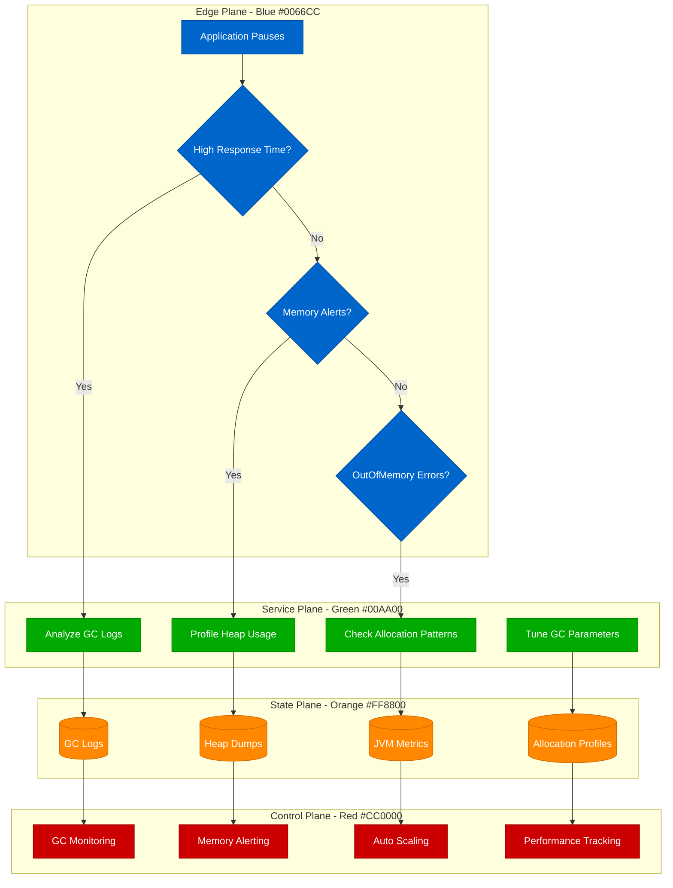
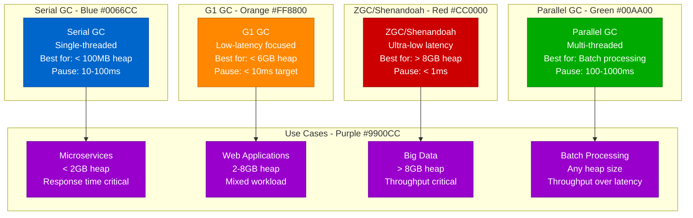
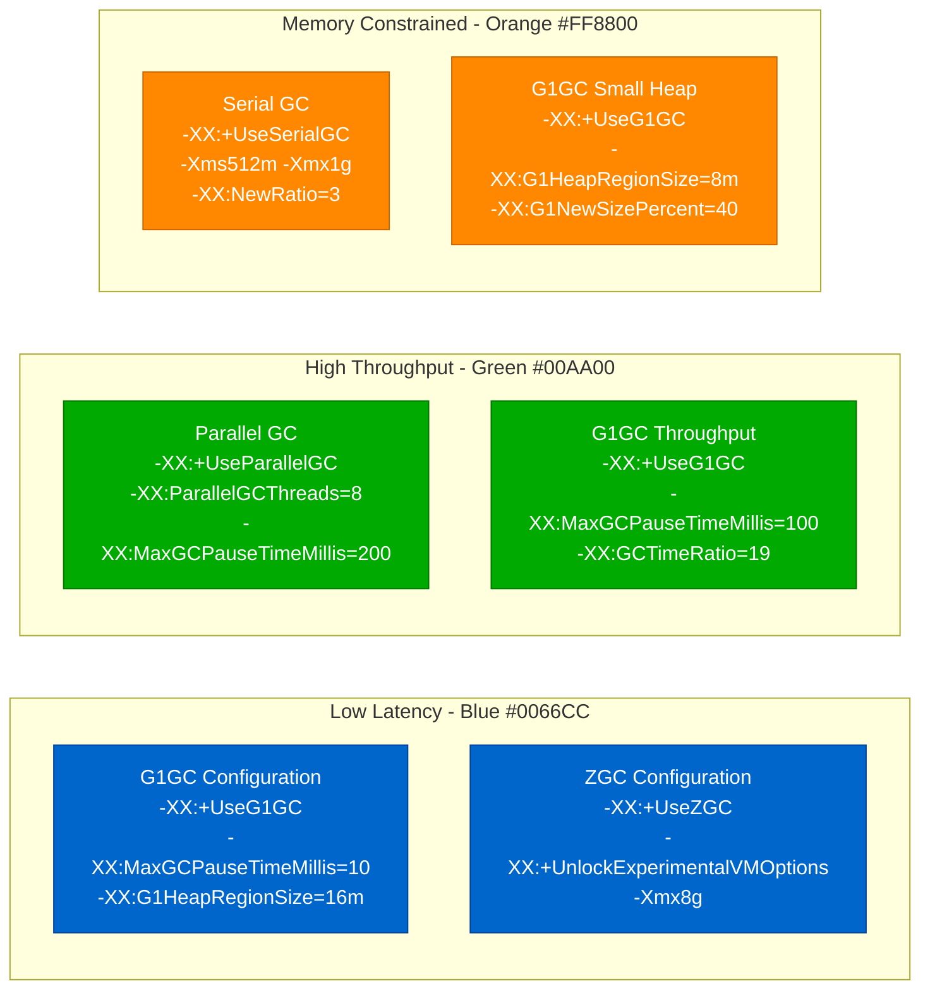

# Java GC Tuning - Production Debugging Guide

## Overview

Java Garbage Collection issues can cause application pauses, memory leaks, and performance degradation. This guide covers systematic debugging for GC optimization, heap analysis, and memory pressure resolution in production Java applications.

## Debugging Flowchart



## GC Analysis Commands

### 1. GC Log Analysis
```bash
# Enable GC logging (Java 11+)
java -XX:+UseG1GC \
     -Xlog:gc*:gc.log:time,tags \
     -XX:+UnlockExperimentalVMOptions \
     -XX:+UseStringDeduplication \
     MyApplication

# Analyze GC logs
grep "GC(" gc.log | tail -20

# Parse GC pause times
awk '/GC\(/ {print $4}' gc.log | sed 's/ms//' | sort -n | tail -10

# Calculate GC overhead
awk '
/GC\(/ {
    gsub(/[^0-9.]/, "", $4);
    total_gc += $4;
    count++
}
/Total time/ {
    gsub(/[^0-9.]/, "", $3);
    total_time = $3
}
END {
    if (total_time > 0) {
        overhead = (total_gc / total_time) * 100;
        print "GC Overhead: " overhead "%";
        print "Average GC pause: " (total_gc/count) "ms"
    }
}' gc.log

# Use GCViewer for detailed analysis
java -jar gcviewer.jar gc.log
```

### 2. Heap Analysis
```bash
# Generate heap dump
jcmd <pid> GC.run_finalization
jcmd <pid> VM.gc
jmap -dump:format=b,file=heap.hprof <pid>

# Quick heap analysis
jstat -gc <pid> 5s 10

# Output interpretation:
# S0C/S1C: Survivor space capacity
# S0U/S1U: Survivor space used
# EC: Eden capacity
# EU: Eden used
# OC: Old generation capacity
# OU: Old generation used
# MC: Metaspace capacity
# MU: Metaspace used

# Memory usage summary
jcmd <pid> VM.memory_usage

# Class histogram (top memory consumers)
jcmd <pid> GC.class_histogram | head -20

# Heap dump analysis with Eclipse MAT
# Download MAT and analyze heap.hprof
```

### 3. JVM Performance Metrics
```bash
# Monitor JVM in real-time
jstat -gcutil <pid> 5s

# Check JVM flags
jcmd <pid> VM.flags

# Monitor thread states
jstack <pid> | grep "java.lang.Thread.State" | sort | uniq -c

# Native memory tracking (if enabled)
jcmd <pid> VM.native_memory summary

# Check for memory leaks
jmap -histo <pid> | head -20

# Continuous monitoring
watch -n 5 'jstat -gc <pid>'
```

## GC Algorithm Decision Matrix

### GC Algorithm Comparison


### GC Tuning Parameters by Scenario


## Real Production Examples

### Netflix's Microservices GC Tuning
**Challenge:** 10,000+ microservices with strict latency requirements

**G1GC Configuration:**
```bash
# Netflix G1GC configuration for microservices
JAVA_OPTS="-server \
-Xms2g -Xmx2g \
-XX:+UseG1GC \
-XX:MaxGCPauseTimeMillis=20 \
-XX:G1HeapRegionSize=16m \
-XX:G1NewSizePercent=30 \
-XX:G1MaxNewSizePercent=40 \
-XX:G1MixedGCLiveThresholdPercent=90 \
-XX:G1MixedGCCountTarget=4 \
-XX:G1OldCSetRegionThreshold=8 \
-XX:+G1UseAdaptiveIHOP \
-XX:G1MixedGCLiveThresholdPercent=90 \
-XX:+UnlockExperimentalVMOptions \
-XX:+UseStringDeduplication \
-XX:+UseFastUnorderedTimeStamps \
-XX:+AggressiveOpts \
-Xlog:gc*:gc.log:time,tags \
-XX:+UnlockDiagnosticVMOptions \
-XX:+LogVMOutput"

# JVM monitoring configuration
MONITORING_OPTS="-Dcom.sun.management.jmxremote \
-Dcom.sun.management.jmxremote.port=9999 \
-Dcom.sun.management.jmxremote.authenticate=false \
-Dcom.sun.management.jmxremote.ssl=false"

# Application startup
java $JAVA_OPTS $MONITORING_OPTS -jar microservice.jar
```

**GC Monitoring and Alerting:**
```java
// Netflix-style GC monitoring with Micrometer
import io.micrometer.core.instrument.MeterRegistry;
import io.micrometer.core.instrument.Gauge;
import io.micrometer.core.instrument.Timer;
import java.lang.management.ManagementFactory;
import java.lang.management.MemoryMXBean;
import java.lang.management.GarbageCollectorMXBean;

@Component
public class GCMetricsCollector {
    private final MeterRegistry meterRegistry;
    private final MemoryMXBean memoryMXBean;
    private final List<GarbageCollectorMXBean> gcBeans;

    public GCMetricsCollector(MeterRegistry meterRegistry) {
        this.meterRegistry = meterRegistry;
        this.memoryMXBean = ManagementFactory.getMemoryMXBean();
        this.gcBeans = ManagementFactory.getGarbageCollectorMXBeans();

        registerGCMetrics();
    }

    private void registerGCMetrics() {
        // Heap memory usage
        Gauge.builder("jvm.memory.heap.used")
                .register(meterRegistry, this, GCMetricsCollector::getHeapUsed);

        Gauge.builder("jvm.memory.heap.max")
                .register(meterRegistry, this, GCMetricsCollector::getHeapMax);

        // GC pause time metrics
        for (GarbageCollectorMXBean gcBean : gcBeans) {
            String gcName = gcBean.getName().toLowerCase().replace(" ", "_");

            Gauge.builder("jvm.gc.pause.total")
                    .tag("gc", gcName)
                    .register(meterRegistry, gcBean, GarbageCollectorMXBean::getCollectionTime);

            Gauge.builder("jvm.gc.collections.total")
                    .tag("gc", gcName)
                    .register(meterRegistry, gcBean, GarbageCollectorMXBean::getCollectionCount);
        }

        // GC overhead calculation
        Timer.Sample.start(meterRegistry)
                .stop(Timer.builder("jvm.gc.overhead")
                        .description("Percentage of time spent in GC")
                        .register(meterRegistry));
    }

    private double getHeapUsed(GCMetricsCollector collector) {
        return memoryMXBean.getHeapMemoryUsage().getUsed();
    }

    private double getHeapMax(GCMetricsCollector collector) {
        return memoryMXBean.getHeapMemoryUsage().getMax();
    }

    @Scheduled(fixedDelay = 5000) // Every 5 seconds
    public void recordGCMetrics() {
        long totalGCTime = gcBeans.stream()
                .mapToLong(GarbageCollectorMXBean::getCollectionTime)
                .sum();

        long uptime = ManagementFactory.getRuntimeMXBean().getUptime();
        double gcOverhead = (double) totalGCTime / uptime * 100;

        // Alert if GC overhead > 5%
        if (gcOverhead > 5.0) {
            log.warn("High GC overhead detected: {}%", String.format("%.2f", gcOverhead));
            alertingService.sendAlert("high_gc_overhead", Map.of(
                    "overhead_percent", gcOverhead,
                    "total_gc_time_ms", totalGCTime,
                    "uptime_ms", uptime
            ));
        }

        meterRegistry.gauge("jvm.gc.overhead.percent", gcOverhead);
    }
}
```

### LinkedIn's Kafka GC Optimization
**Challenge:** Kafka brokers with 32GB heaps and strict latency SLAs

**G1GC Configuration for Large Heaps:**
```bash
# LinkedIn Kafka broker GC configuration
export KAFKA_HEAP_OPTS="-Xms16g -Xmx16g"
export KAFKA_JVM_PERFORMANCE_OPTS="\
-server \
-XX:+UseG1GC \
-XX:MaxGCPauseTimeMillis=20 \
-XX:InitiatingHeapOccupancyPercent=35 \
-XX:G1HeapRegionSize=32m \
-XX:G1MixedGCCountTarget=8 \
-XX:G1NewSizePercent=20 \
-XX:G1MaxNewSizePercent=30 \
-XX:G1ReservePercent=20 \
-XX:ConcGCThreads=4 \
-XX:ParallelGCThreads=8 \
-XX:+UnlockExperimentalVMOptions \
-XX:+UseStringDeduplication \
-XX:+ExitOnOutOfMemoryError \
-XX:+HeapDumpOnOutOfMemoryError \
-XX:HeapDumpPath=/var/log/kafka/heap-dumps/ \
-Xlog:gc*:gc.log:time,tags \
-verbose:gc"

# Additional JVM options for Kafka
export KAFKA_JVM_PERFORMANCE_OPTS="$KAFKA_JVM_PERFORMANCE_OPTS \
-Djava.awt.headless=true \
-Dcom.sun.management.jmxremote=true \
-Dcom.sun.management.jmxremote.authenticate=false \
-Dcom.sun.management.jmxremote.ssl=false \
-Dcom.sun.management.jmxremote.port=9999"

# OS-level optimizations
echo 'vm.swappiness=1' >> /etc/sysctl.conf
echo 'vm.dirty_background_ratio=5' >> /etc/sysctl.conf
echo 'vm.dirty_ratio=60' >> /etc/sysctl.conf
echo 'vm.dirty_expire_centisecs=12000' >> /etc/sysctl.conf
sysctl -p
```

**Automated GC Analysis Script:**
```python
#!/usr/bin/env python3
# LinkedIn-style GC log analysis
import re
import sys
from datetime import datetime, timedelta
from collections import defaultdict
import statistics

class GCLogAnalyzer:
    def __init__(self, log_file):
        self.log_file = log_file
        self.gc_events = []
        self.pause_times = []
        self.throughput_data = []

    def parse_gc_logs(self):
        """Parse G1GC logs and extract metrics"""

        gc_pattern = re.compile(
            r'\[(\d{4}-\d{2}-\d{2}T\d{2}:\d{2}:\d{2}\.\d{3}[+-]\d{4})\].*?'
            r'GC\((\d+)\) Pause (.+?) \((.+?)\) (\d+\.\d+)ms'
        )

        with open(self.log_file, 'r') as f:
            for line in f:
                match = gc_pattern.search(line)
                if match:
                    timestamp_str, gc_id, gc_type, gc_cause, pause_time = match.groups()

                    timestamp = datetime.fromisoformat(timestamp_str.replace('Z', '+00:00'))
                    pause_time_ms = float(pause_time)

                    gc_event = {
                        'timestamp': timestamp,
                        'gc_id': int(gc_id),
                        'gc_type': gc_type,
                        'gc_cause': gc_cause,
                        'pause_time_ms': pause_time_ms
                    }

                    self.gc_events.append(gc_event)
                    self.pause_times.append(pause_time_ms)

    def analyze_gc_performance(self):
        """Analyze GC performance metrics"""
        if not self.gc_events:
            print("No GC events found in log file")
            return

        # Calculate basic statistics
        total_events = len(self.gc_events)
        total_pause_time = sum(self.pause_times)
        avg_pause_time = statistics.mean(self.pause_times)
        max_pause_time = max(self.pause_times)
        p95_pause_time = statistics.quantiles(self.pause_times, n=20)[18]  # 95th percentile
        p99_pause_time = statistics.quantiles(self.pause_times, n=100)[98]  # 99th percentile

        # Calculate time range
        start_time = self.gc_events[0]['timestamp']
        end_time = self.gc_events[-1]['timestamp']
        duration = (end_time - start_time).total_seconds()

        # Calculate GC overhead
        gc_overhead = (total_pause_time / (duration * 1000)) * 100

        # Analyze GC frequency
        gc_frequency = total_events / (duration / 60)  # GCs per minute

        # Count by GC type
        gc_type_counts = defaultdict(int)
        gc_type_times = defaultdict(list)

        for event in self.gc_events:
            gc_type_counts[event['gc_type']] += 1
            gc_type_times[event['gc_type']].append(event['pause_time_ms'])

        print("=== GC Performance Analysis ===")
        print(f"Analysis period: {start_time} to {end_time}")
        print(f"Total duration: {duration:.1f} seconds")
        print(f"Total GC events: {total_events}")
        print(f"GC frequency: {gc_frequency:.1f} GCs/minute")
        print(f"Total pause time: {total_pause_time:.1f}ms")
        print(f"GC overhead: {gc_overhead:.2f}%")
        print()

        print("=== Pause Time Statistics ===")
        print(f"Average pause time: {avg_pause_time:.2f}ms")
        print(f"Maximum pause time: {max_pause_time:.2f}ms")
        print(f"95th percentile: {p95_pause_time:.2f}ms")
        print(f"99th percentile: {p99_pause_time:.2f}ms")
        print()

        print("=== GC Type Breakdown ===")
        for gc_type, count in gc_type_counts.items():
            avg_time = statistics.mean(gc_type_times[gc_type])
            max_time = max(gc_type_times[gc_type])
            percentage = (count / total_events) * 100
            print(f"{gc_type}: {count} events ({percentage:.1f}%), "
                  f"avg: {avg_time:.1f}ms, max: {max_time:.1f}ms")

        # Performance recommendations
        print("\n=== Performance Recommendations ===")
        if gc_overhead > 5:
            print("⚠️  High GC overhead (>5%). Consider:")
            print("   - Increasing heap size")
            print("   - Optimizing allocation patterns")
            print("   - Tuning GC parameters")

        if p95_pause_time > 50:
            print("⚠️  High 95th percentile pause time (>50ms). Consider:")
            print("   - Reducing MaxGCPauseTimeMillis target")
            print("   - Adjusting G1HeapRegionSize")
            print("   - Enabling concurrent refinement")

        if avg_pause_time > 20:
            print("⚠️  High average pause time (>20ms). Consider:")
            print("   - Switching to ZGC or Shenandoah for ultra-low latency")
            print("   - Tuning G1 mixed GC parameters")

        young_gc_count = gc_type_counts.get('Young Generation', 0)
        mixed_gc_count = gc_type_counts.get('Mixed', 0) + gc_type_counts.get('Mixed GC', 0)

        if young_gc_count > 0 and mixed_gc_count > 0:
            ratio = young_gc_count / mixed_gc_count
            if ratio < 5:
                print("⚠️  High mixed GC frequency. Consider:")
                print("   - Increasing G1MixedGCLiveThresholdPercent")
                print("   - Adjusting G1MixedGCCountTarget")

    def generate_gc_report(self):
        """Generate detailed GC report"""
        self.parse_gc_logs()
        self.analyze_gc_performance()

        # Additional analysis for trends
        if len(self.gc_events) > 100:
            self.analyze_gc_trends()

    def analyze_gc_trends(self):
        """Analyze GC trends over time"""
        print("\n=== GC Trend Analysis ===")

        # Split events into time buckets (hourly)
        hourly_stats = defaultdict(list)

        for event in self.gc_events:
            hour_key = event['timestamp'].replace(minute=0, second=0, microsecond=0)
            hourly_stats[hour_key].append(event['pause_time_ms'])

        if len(hourly_stats) > 1:
            print("Hourly GC pause time trends:")
            for hour, pause_times in sorted(hourly_stats.items()):
                avg_pause = statistics.mean(pause_times)
                max_pause = max(pause_times)
                event_count = len(pause_times)
                print(f"{hour.strftime('%H:%M')}: {event_count} GCs, "
                      f"avg: {avg_pause:.1f}ms, max: {max_pause:.1f}ms")

            # Check for degradation trend
            hours = sorted(hourly_stats.keys())
            if len(hours) >= 3:
                first_hour_avg = statistics.mean(hourly_stats[hours[0]])
                last_hour_avg = statistics.mean(hourly_stats[hours[-1]])

                if last_hour_avg > first_hour_avg * 1.5:
                    print("⚠️  GC performance degradation trend detected!")
                    print("   Consider investigating memory leaks or allocation patterns")

if __name__ == "__main__":
    if len(sys.argv) != 2:
        print("Usage: python gc_analyzer.py <gc_log_file>")
        sys.exit(1)

    analyzer = GCLogAnalyzer(sys.argv[1])
    analyzer.generate_gc_report()
```

## Advanced GC Tuning Strategies

### 1. Allocation Rate Optimization
```java
// Reduce allocation pressure
public class AllocationOptimizer {

    // Use object pooling for frequently created objects
    private final ObjectPool<StringBuilder> stringBuilderPool =
        new GenericObjectPool<>(new StringBuilderFactory());

    // Reuse collections instead of creating new ones
    private final List<String> reusableList = new ArrayList<>();

    // Optimize string operations
    public String buildString(List<String> parts) {
        StringBuilder sb = stringBuilderPool.borrowObject();
        try {
            for (String part : parts) {
                sb.append(part);
            }
            return sb.toString();
        } finally {
            sb.setLength(0); // Reset for reuse
            stringBuilderPool.returnObject(sb);
        }
    }

    // Use primitive collections to reduce object overhead
    private final TIntObjectHashMap<String> primitiveMap = new TIntObjectHashMap<>();

    // Batch allocations to reduce GC pressure
    public void processBatch(List<Data> dataList) {
        // Clear reusable collection
        reusableList.clear();

        // Process in batches to limit allocation rate
        for (int i = 0; i < dataList.size(); i += 1000) {
            int end = Math.min(i + 1000, dataList.size());
            List<Data> batch = dataList.subList(i, end);

            processBatchInternal(batch);

            // Yield to allow GC if needed
            if (i % 5000 == 0) {
                Thread.yield();
            }
        }
    }
}
```

### 2. Memory Leak Detection
```bash
#!/bin/bash
# Memory leak detection script

PID=$1
HEAP_DUMP_DIR="/tmp/heap-dumps"
INTERVAL=3600  # 1 hour

mkdir -p $HEAP_DUMP_DIR

detect_memory_leak() {
    local pid=$1
    local timestamp=$(date +%Y%m%d_%H%M%S)
    local heap_dump="$HEAP_DUMP_DIR/heap_$timestamp.hprof"

    echo "Taking heap dump for PID $pid at $timestamp"
    jcmd $pid GC.run_finalization
    jmap -dump:format=b,file=$heap_dump $pid

    if [[ -f $heap_dump ]]; then
        echo "Analyzing heap dump..."

        # Quick analysis with jhat
        jhat -J-Xmx4g -port 7000 $heap_dump &
        JHAT_PID=$!

        sleep 10

        # Get top classes by instance count
        curl -s "http://localhost:7000/histo/" | grep "class " | head -20 > "${heap_dump}.analysis"

        kill $JHAT_PID 2>/dev/null

        echo "Heap dump analysis saved to ${heap_dump}.analysis"
    fi
}

# Continuous monitoring
while true; do
    if ps -p $PID > /dev/null; then
        detect_memory_leak $PID
        sleep $INTERVAL
    else
        echo "Process $PID not found. Exiting."
        break
    fi
done
```

This comprehensive Java GC tuning debugging guide provides systematic approaches to identifying, analyzing, and resolving garbage collection issues in production Java applications, with real-world examples and automated monitoring solutions.