# JVM Memory Leak Production Debugging

## Emergency Response Overview

**Incident Severity**: P1 - Service degradation leading to OutOfMemoryError
**MTTR Target**: < 5 minutes for immediate relief, < 30 minutes for root cause identification
**Primary Tools**: `jstat`, `jmap`, `jstack`, `jcmd`, `MAT (Memory Analyzer Tool)`, `VisualVM`


## 3 AM Debugging Flowchart

```mermaid
flowchart TD
    START[🚨 Memory Leak Alert<br/>Heap usage > 85%<br/>GC pause increasing] --> IMMEDIATE_CHECK{JVM Still<br/>Responsive?}

    IMMEDIATE_CHECK -->|YES| QUICK_ANALYSIS[Quick Memory Analysis<br/>jstat -gc -t PID 5s<br/>Check heap usage trend]
    IMMEDIATE_CHECK -->|NO| EMERGENCY_RESTART[❌ EMERGENCY RESTART<br/>Service unresponsive<br/>Restart + heap dump]

    QUICK_ANALYSIS --> HEAP_TREND{Heap Usage<br/>Pattern?}

    HEAP_TREND -->|Gradual increase| MEMORY_LEAK[📈 Classic Memory Leak<br/>Objects not being GC'd<br/>Take heap dump]
    HEAP_TREND -->|Sudden spike| ALLOCATION_SPIKE[📊 Allocation Spike<br/>Large object creation<br/>Recent deployment?]
    HEAP_TREND -->|Sawtooth pattern| GC_TUNING[⚙️ GC Performance Issue<br/>Frequent full GCs<br/>Heap sizing problem]

    MEMORY_LEAK --> HEAP_DUMP[jcmd PID GC.run_finalization<br/>jcmd PID VM.gc<br/>jmap -dump PID]
    ALLOCATION_SPIKE --> THREAD_DUMP[jstack PID > threaddump.txt<br/>Analyze allocation patterns<br/>Check recent changes]
    GC_TUNING --> GC_ANALYSIS[jstat -gccause PID<br/>Analyze GC logs<br/>Check GC configuration]

    HEAP_DUMP --> HEAP_ANALYSIS[MAT/VisualVM Analysis<br/>Find memory hogs<br/>Identify leak suspects]
    THREAD_DUMP --> STACK_ANALYSIS[Analyze thread stacks<br/>Find allocation hotspots<br/>Identify blocking threads]
    GC_ANALYSIS --> GC_TUNING_ACTION[Tune GC parameters<br/>Increase heap size<br/>Change GC algorithm]

    HEAP_ANALYSIS --> ROOT_CAUSE{Root Cause<br/>Identified?}
    STACK_ANALYSIS --> ROOT_CAUSE
    GC_TUNING_ACTION --> ROOT_CAUSE

    ROOT_CAUSE -->|Collection growth| FIX_COLLECTIONS[Clear caches<br/>Fix collection leaks<br/>Add size limits]
    ROOT_CAUSE -->|ClassLoader leak| FIX_CLASSLOADER[Fix application restart<br/>Check for hot redeployment<br/>Metaspace cleanup]
    ROOT_CAUSE -->|Thread leak| FIX_THREADS[Shutdown thread pools<br/>Fix connection leaks<br/>Close resources]

    EMERGENCY_RESTART --> POST_RESTART[Monitor restart<br/>Check memory pattern<br/>Prepare for recurrence]
    FIX_COLLECTIONS --> VERIFY_FIX
    FIX_CLASSLOADER --> VERIFY_FIX
    FIX_THREADS --> VERIFY_FIX
    POST_RESTART --> VERIFY_FIX

    VERIFY_FIX{Memory Usage<br/>Stabilized?} -->|YES| MONITOR_TRENDS[✅ Issue Resolved<br/>Continue monitoring<br/>Document findings]
    VERIFY_FIX -->|NO| ESCALATE[🚨 ESCALATE<br/>Senior engineer needed<br/>Consider rolling back]

    %% Apply Tailwind colors
    classDef emergencyStyle fill:#EF4444,stroke:#DC2626,color:#fff,stroke-width:2px
    classDef warningStyle fill:#F59E0B,stroke:#D97706,color:#fff,stroke-width:2px
    classDef actionStyle fill:#3B82F6,stroke:#1E40AF,color:#fff,stroke-width:2px
    classDef successStyle fill:#10B981,stroke:#047857,color:#fff,stroke-width:2px

    class EMERGENCY_RESTART,ESCALATE emergencyStyle
    class MEMORY_LEAK,ALLOCATION_SPIKE,GC_TUNING warningStyle
    class HEAP_DUMP,THREAD_DUMP,GC_ANALYSIS,FIX_COLLECTIONS,FIX_CLASSLOADER,FIX_THREADS actionStyle
    class MONITOR_TRENDS successStyle
```



## Critical Commands & Immediate Actions

### JVM Process Identification & Quick Status (< 30 seconds)

```bash
# 1. FIND JVM PROCESSES
jps -v                                          # List all JVM processes with arguments
ps aux | grep java | grep -v grep              # Alternative process listing

# 2. QUICK MEMORY STATUS
PID=$(jps | grep -i app | awk '{print $1}')    # Get app PID
jstat -gc $PID                                  # Current GC status
jstat -gccapacity $PID                          # Heap capacity info
jstat -gcutil $PID 5s 5                        # Memory utilization every 5s

# 3. IMMEDIATE MEMORY OVERVIEW
jcmd $PID VM.info | grep -A 20 "Memory:"       # Memory configuration
jcmd $PID GC.run_finalization                  # Force finalization
jcmd $PID VM.gc                                 # Suggest garbage collection
```

### Emergency Memory Analysis (< 2 minutes)

```bash
# 1. HEAP DUMP (if JVM responsive)
jcmd $PID GC.run_finalization                  # Cleanup first
sleep 5
jmap -dump:live,format=b,file=heap-$(date +%Y%m%d-%H%M%S).hprof $PID

# Alternative heap dump methods
jcmd $PID GC.dump heap-$(date +%Y%m%d-%H%M%S).hprof    # Preferred method
jhsdb jmap --dump --format=b --file=heap.hprof --pid $PID  # If jmap fails

# 2. THREAD DUMP (always works)
jstack $PID > threaddump-$(date +%Y%m%d-%H%M%S).txt
jcmd $PID Thread.print > threaddump-jcmd-$(date +%Y%m%d-%H%M%S).txt

# 3. CLASS HISTOGRAM (quick object overview)
jcmd $PID GC.class_histogram > histogram-$(date +%Y%m%d-%H%M%S).txt
```

### Netflix Production Memory Commands

```bash
# NETFLIX'S RAPID MEMORY ASSESSMENT SCRIPT
#!/bin/bash
PID=$(jps | grep -E "(App|Service)" | head -1 | awk '{print $1}')

echo "=== NETFLIX MEMORY EMERGENCY ASSESSMENT ==="
echo "PID: $PID"
echo "Time: $(date)"

# 1. Current memory state
echo "=== MEMORY USAGE ==="
jstat -gc $PID | awk 'NR==2 {
    total_heap = $3 + $4 + $6 + $8 + $10
    used_heap = $3 + $4 + $6 + $8
    heap_usage = (used_heap / total_heap) * 100
    printf "Heap Usage: %.1f%% (%.1fMB used / %.1fMB total)\n", heap_usage, used_heap/1024, total_heap/1024
}'

# 2. GC frequency (last 1 minute)
echo "=== GC FREQUENCY ==="
jstat -gccause $PID | awk 'NR==2 {
    printf "Young GC: %d collections (%.2fs total)\n", $3, $4
    printf "Full GC: %d collections (%.2fs total)\n", $5, $6
    printf "Last GC Cause: %s\n", $7
}'

# 3. Top memory consuming classes
echo "=== TOP MEMORY CONSUMERS ==="
jcmd $PID GC.class_histogram | head -20

# 4. Thread count
echo "=== THREAD ANALYSIS ==="
jstack $PID | grep "java.lang.Thread.State" | sort | uniq -c | sort -nr

# 5. Quick leak indicators
echo "=== LEAK INDICATORS ==="
echo "Checking for common leak patterns..."
jstack $PID | grep -E "(Finalizer|Reference Handler|java.util.HashMap|java.util.ArrayList)" | wc -l
```

### Uber Production Memory Commands

```bash
# UBER'S MEMORY LEAK DETECTION SCRIPT
#!/bin/bash
PID=$(jps | grep -i service | head -1 | awk '{print $1}')

echo "=== UBER MEMORY LEAK DETECTION ==="

# 1. Multiple heap snapshots for trend analysis
for i in {1..3}; do
    echo "Taking snapshot $i/3..."
    jstat -gc $PID >> memory-trend-$(date +%Y%m%d).log
    echo "$(date): Snapshot $i" >> memory-trend-$(date +%Y%m%d).log
    sleep 30
done

# 2. Analyze allocation rate
echo "=== ALLOCATION RATE ANALYSIS ==="
jstat -gcnew $PID 1s 10 | awk '
NR==1 {print}
NR>1 {
    prev_alloc = alloc
    alloc = $5
    if (NR > 2) {
        rate = (alloc - prev_alloc) / 1024  # MB/sec
        printf "%s Allocation Rate: %.2f MB/s\n", $0, rate
    }
}'

# 3. Class loader leak detection
echo "=== CLASSLOADER LEAK CHECK ==="
jcmd $PID VM.classloader_stats | grep -E "ClassLoader|instances" | head -20

# 4. Direct memory analysis
echo "=== DIRECT MEMORY CHECK ==="
jcmd $PID VM.info | grep -A 5 -B 5 "Direct"
```

## Common Root Causes & Probabilities

### 1. Collection/Cache Growth (45% of cases)
**Netflix Example**: Session cache kept growing without TTL during 2019 Super Bowl traffic

```java
// PROBLEMATIC CODE - No size limits
private final Map<String, UserSession> sessions = new ConcurrentHashMap<>();

public void storeSession(String sessionId, UserSession session) {
    sessions.put(sessionId, session);  // NEVER REMOVED - LEAK!
}

// NETFLIX'S FIX - Size-limited cache with TTL
private final Cache<String, UserSession> sessions = Caffeine.newBuilder()
    .maximumSize(100_000)                      // Limit to 100K sessions
    .expireAfterAccess(Duration.ofHours(2))    // 2-hour TTL
    .build();

// DETECTION COMMAND
jcmd $PID GC.class_histogram | grep -E "(HashMap|Cache|ConcurrentHashMap)"
```

### 2. Thread/Connection Leaks (25% of cases)
**Uber Example**: HTTP client threads not properly shutdown in service-to-service calls

```java
// PROBLEMATIC CODE - Thread leak
public class ApiClient {
    public String callService(String url) {
        HttpClient client = HttpClient.newHttpClient();  // NEW CLIENT EVERY CALL!
        return client.send(request, HttpResponse.BodyHandlers.ofString()).body();
        // CLIENT NEVER CLOSED - THREAD LEAK!
    }
}

// UBER'S FIX - Singleton client with proper lifecycle
@Component
public class ApiClient {
    private final HttpClient httpClient;

    public ApiClient() {
        this.httpClient = HttpClient.newBuilder()
            .connectTimeout(Duration.ofSeconds(10))
            .build();
    }

    @PreDestroy
    public void shutdown() {
        // Proper cleanup in Spring Boot
    }
}

// DETECTION COMMANDS
jstack $PID | grep "Thread-" | wc -l          # Count threads
jstack $PID | grep "BLOCKED\|WAITING" | wc -l  # Count blocked threads
```

### 3. ClassLoader/Metaspace Leaks (15% of cases)
**Meta Example**: Hot deployment in development leaked ClassLoaders in production

```bash
# DETECTION - ClassLoader leak indicators
jcmd $PID VM.classloader_stats | head -20
jstat -gc $PID | awk '{print "Metaspace: " $9 "KB / " $10 "KB (" int($9/$10*100) "%)"}'

# METASPACE ANALYSIS
jcmd $PID VM.metaspace | grep -E "(Total|Free|Used)"

# TYPICAL SYMPTOMS
# - Metaspace keeps growing
# - Classes never unloaded
# - PermGen OutOfMemoryError (Java 7)
# - Multiple versions of same class loaded
```

### 4. Large Object Allocation (10% of cases)
**Stripe Example**: Payment batch processing allocated 2GB arrays in memory

```java
// PROBLEMATIC CODE - Large arrays
public void processBatch(List<Payment> payments) {
    // Allocating huge arrays for 1M+ payments
    String[] paymentIds = new String[payments.size()];        // Potential 100MB+
    BigDecimal[] amounts = new BigDecimal[payments.size()];   // Potential 500MB+

    // Process all in memory - MEMORY SPIKE!
}

// STRIPE'S FIX - Streaming processing
public void processBatch(List<Payment> payments) {
    payments.stream()
        .parallel()
        .map(this::processPayment)
        .forEach(this::saveResult);  // Process one at a time
}

// DETECTION - Large object allocation
jcmd $PID GC.class_histogram | head -10  # Look for large arrays
```

### 5. Resource Leaks (5% of cases)
**GitHub Example**: File handles and database connections not properly closed

```java
// PROBLEMATIC CODE - Resource leaks
public String readConfig(String filename) {
    try {
        FileInputStream fis = new FileInputStream(filename);  // NEVER CLOSED!
        return new String(fis.readAllBytes());
    } catch (IOException e) {
        return null;
    }
}

// GITHUB'S FIX - Try-with-resources
public String readConfig(String filename) {
    try (FileInputStream fis = new FileInputStream(filename)) {
        return new String(fis.readAllBytes());
    } catch (IOException e) {
        log.warn("Failed to read config: {}", filename, e);
        return null;
    }
}

// DETECTION COMMANDS
lsof -p $PID | wc -l                          # File handle count
ss -p $PID | grep ESTAB | wc -l               # Network connections
```

## Memory Dump Analysis

### Using Eclipse MAT (Memory Analyzer Tool)

```bash
# 1. TAKE HEAP DUMP
jcmd $PID GC.run_finalization
jmap -dump:live,format=b,file=leak-analysis.hprof $PID

# 2. ANALYZE WITH MAT (command line)
# Download from: https://www.eclipse.org/mat/downloads.php
./mat.sh -vmargs -Xmx4g -consoleLog -application org.eclipse.mat.api.parse \
    leak-analysis.hprof org.eclipse.mat.api:suspects

# 3. QUICK ANALYSIS QUERIES
# Largest objects by retained size
echo "histogram" | ./mat.sh -vmargs -Xmx4g leak-analysis.hprof

# Potential memory leaks
echo "find_leaks" | ./mat.sh -vmargs -Xmx4g leak-analysis.hprof
```

### Manual Heap Dump Analysis

```bash
# NETFLIX'S HEAP DUMP ANALYSIS SCRIPT
#!/bin/bash
HEAP_DUMP="$1"

echo "=== HEAP DUMP ANALYSIS ==="
echo "File: $HEAP_DUMP"
echo "Size: $(du -h $HEAP_DUMP | cut -f1)"

# 1. Extract basic statistics
echo "=== BASIC STATISTICS ==="
strings $HEAP_DUMP | grep -E "(java\.lang\.|java\.util\.)" | sort | uniq -c | sort -nr | head -20

# 2. Look for common leak patterns
echo "=== LEAK PATTERN DETECTION ==="
echo "Checking for HashMap growth:"
strings $HEAP_DUMP | grep "HashMap" | wc -l

echo "Checking for ArrayList growth:"
strings $HEAP_DUMP | grep "ArrayList" | wc -l

echo "Checking for String pooling issues:"
strings $HEAP_DUMP | grep -E "String|char\[\]" | wc -l

# 3. Thread analysis from heap dump
echo "=== THREAD ANALYSIS ==="
strings $HEAP_DUMP | grep "java.lang.Thread" | wc -l
```

## Recovery Procedures (< 10 minutes)

### Phase 1: Immediate Relief (< 2 minutes)

```bash
# EMERGENCY MEMORY RELIEF SCRIPT
#!/bin/bash
PID=$(jps | grep -E "(App|Service)" | head -1 | awk '{print $1}')

echo "=== EMERGENCY MEMORY RELIEF ==="
echo "Target PID: $PID"

# 1. Force garbage collection
echo "Forcing garbage collection..."
jcmd $PID GC.run_finalization
sleep 2
jcmd $PID VM.gc
sleep 3

# 2. Check if relief achieved
HEAP_BEFORE=$(jstat -gc $PID | awk 'NR==2 {print int(($3+$4+$6+$8)/1024)}')
echo "Heap usage after GC: ${HEAP_BEFORE}MB"

# 3. If still critical, restart with larger heap
MAX_HEAP=$(jcmd $PID VM.info | grep -o "max heap [0-9]*" | awk '{print $3}')
if [ $HEAP_BEFORE -gt $((MAX_HEAP * 80 / 100 / 1024 / 1024)) ]; then
    echo "Still critical. Consider restart with larger heap."
    echo "Current max heap: $((MAX_HEAP / 1024 / 1024))MB"
    echo "Recommended: $((MAX_HEAP * 2 / 1024 / 1024))MB"
fi
```

### Phase 2: Application Tuning (< 5 minutes)

```bash
# JVM TUNING FOR MEMORY RELIEF
#!/bin/bash

# 1. Current JVM arguments analysis
PID=$(jps -v | grep -E "(App|Service)" | head -1)
echo "Current JVM args:"
echo "$PID" | cut -d' ' -f2-

# 2. Recommended tuning based on issue type
echo "=== TUNING RECOMMENDATIONS ==="

# For allocation spikes
echo "# For allocation spikes - G1GC tuning"
echo "-XX:+UseG1GC"
echo "-XX:MaxGCPauseMillis=200"
echo "-XX:G1HeapRegionSize=16m"
echo "-XX:G1NewSizePercent=30"
echo "-XX:G1MaxNewSizePercent=40"

# For memory leaks - enable detailed logging
echo "# For memory leak analysis"
echo "-XX:+HeapDumpOnOutOfMemoryError"
echo "-XX:HeapDumpPath=/tmp/heapdumps/"
echo "-XX:+PrintGCDetails"
echo "-XX:+PrintGCTimeStamps"
echo "-Xloggc:/tmp/gc.log"

# For thread leaks
echo "# For thread analysis"
echo "-XX:NativeMemoryTracking=summary"
echo "-XX:+UnlockDiagnosticVMOptions"
echo "-XX:+LogVMOutput"
```

### Phase 3: Application-Level Fixes (< 10 minutes)

```bash
# APPLICATION CACHE CLEANUP (Spring Boot)
curl -X POST http://localhost:8080/actuator/cache/clear-all
curl -X POST http://localhost:8080/actuator/beans | grep -i cache

# MANUAL CACHE CLEANUP (if exposed via JMX)
jconsole localhost:$PID  # Connect via JConsole
# Navigate to: MBeans -> com.sun.management -> HotSpotDiagnostic
# Invoke: gcClass() method

# THREAD POOL CLEANUP (if accessible)
curl -X POST http://localhost:8080/actuator/threaddump | grep -c "Thread"
```

## Real-World Examples

### Netflix: 2020 Session Cache Explosion

**Scenario**: During COVID lockdown, user sessions grew 10x without cleanup

**Timeline**:
- T+0: Normal operations, 50MB session cache
- T+2hr: Users increased 500%, cache at 2GB
- T+4hr: Memory alerts triggered, heap at 6GB/8GB
- T+6hr: Full GC every 30 seconds, app unresponsive

**Detection Method**:
```bash
# Used this to identify session growth
jcmd $PID GC.class_histogram | grep -i session
# Result: 2,000,000 UserSession objects (2GB+)
```

**Root Cause**: Session TTL disabled during testing, never re-enabled

**Fix Applied**:
```java
// Before: Unlimited session cache
Map<String, UserSession> sessions = new ConcurrentHashMap<>();

// After: TTL + size limits
Cache<String, UserSession> sessions = Caffeine.newBuilder()
    .maximumSize(100_000)
    .expireAfterAccess(Duration.ofHours(2))
    .recordStats()
    .build();
```

### Uber: 2019 Thread Pool Memory Leak

**Scenario**: Service mesh HTTP clients creating unlimited threads

**Detection**:
```bash
# Identified via thread count explosion
jstack $PID | grep "Thread-" | wc -l
# Result: 15,000+ threads (normal: 200)

# Memory consumed by threads
jcmd $PID VM.info | grep -A 5 "Direct memory"
# Result: 2GB+ in thread stack memory
```

**Root Cause**: HTTP client creating new thread pool per request

**Fix**:
```java
// Before: New client per request
HttpClient client = HttpClient.newBuilder().build();

// After: Shared client with connection pooling
private static final HttpClient SHARED_CLIENT = HttpClient.newBuilder()
    .executor(ForkJoinPool.commonPool())  // Shared thread pool
    .connectTimeout(Duration.ofSeconds(5))
    .build();
```

### Stripe: 2021 Payment Batch Memory Explosion

**Scenario**: Batch payment processing allocated 4GB arrays

**Detection**:
```bash
# Large object allocation detected
jcmd $PID GC.class_histogram | head -5
# Result:
# 1: 50000000 instances of java.math.BigDecimal (3.2GB)
# 2: 50000000 instances of java.lang.String (1.8GB)
```

**Root Cause**: Loading 50M payment records into memory simultaneously

**Fix**:
```java
// Before: Load all payments
List<Payment> allPayments = paymentRepo.findAll(); // 50M records!
allPayments.forEach(this::processPayment);

// After: Stream processing
paymentRepo.findAllStream()
    .parallel()
    .forEach(this::processPayment);  // Process one at a time
```

## Monitoring & Prevention

### Key JVM Metrics (Prometheus)

```yaml
# JVM MEMORY METRICS
- jvm_memory_used_bytes{area="heap"}           # Current heap usage
- jvm_memory_max_bytes{area="heap"}            # Max heap size
- jvm_memory_used_bytes{area="nonheap"}        # Metaspace/Code cache
- jvm_gc_collection_seconds_count              # GC frequency
- jvm_gc_collection_seconds_sum                # GC time spent
- jvm_threads_live_threads                     # Thread count
- jvm_classes_loaded_classes                   # Loaded classes

# APPLICATION-SPECIFIC METRICS
- cache_size{cache="userSessions"}             # Cache sizes
- connection_pool_active{pool="database"}      # Connection pools
- thread_pool_active{pool="http"}              # Thread pools
```

### Critical Alerting Rules

```yaml
# HEAP MEMORY WARNING
- alert: JVMHeapMemoryHigh
  expr: (jvm_memory_used_bytes{area="heap"} / jvm_memory_max_bytes{area="heap"}) > 0.85
  for: 2m
  labels:
    severity: warning
  annotations:
    summary: "JVM heap memory usage high"
    description: "Heap usage {{ $value | humanizePercentage }} on {{ $labels.instance }}"

# HEAP MEMORY CRITICAL
- alert: JVMHeapMemoryCritical
  expr: (jvm_memory_used_bytes{area="heap"} / jvm_memory_max_bytes{area="heap"}) > 0.95
  for: 30s
  labels:
    severity: critical
  annotations:
    summary: "JVM heap memory critical"
    description: "Heap usage {{ $value | humanizePercentage }} on {{ $labels.instance }}"

# GC FREQUENCY ALERT
- alert: JVMGCFrequencyHigh
  expr: rate(jvm_gc_collection_seconds_count[5m]) > 2
  for: 1m
  labels:
    severity: warning
  annotations:
    summary: "JVM GC frequency high"
    description: "GC frequency {{ $value }} collections/sec on {{ $labels.instance }}"

# THREAD COUNT EXPLOSION
- alert: JVMThreadCountHigh
  expr: jvm_threads_live_threads > 500
  for: 1m
  labels:
    severity: warning
  annotations:
    summary: "JVM thread count high"
    description: "Thread count {{ $value }} on {{ $labels.instance }}"
```

### Proactive Monitoring Setup

```bash
# JVM MONITORING SETUP SCRIPT
#!/bin/bash

# 1. Enable JVM metrics endpoint (Spring Boot)
echo "Adding to application.yml:"
cat << EOF
management:
  endpoints:
    web:
      exposure:
        include: health,metrics,threaddump,heapdump
  metrics:
    export:
      prometheus:
        enabled: true
EOF

# 2. JVM arguments for production monitoring
echo "Recommended JVM monitoring args:"
cat << EOF
-XX:+HeapDumpOnOutOfMemoryError
-XX:HeapDumpPath=/tmp/heapdumps/
-XX:+PrintGCDetails
-XX:+PrintGCTimeStamps
-XX:+PrintGCApplicationStoppedTime
-Xloggc:/var/log/gc-%t.log
-XX:+UseGCLogFileRotation
-XX:NumberOfGCLogFiles=5
-XX:GCLogFileSize=10M
-Dcom.sun.management.jmxremote
-Dcom.sun.management.jmxremote.port=9999
-Dcom.sun.management.jmxremote.authenticate=false
-Dcom.sun.management.jmxremote.ssl=false
EOF

# 3. Automated heap dump collection
cat << 'EOF' > /opt/scripts/heap-dump-collector.sh
#!/bin/bash
# Collect heap dumps when memory usage > 90%
PID=$(jps | grep -E "(App|Service)" | head -1 | awk '{print $1}')
HEAP_USAGE=$(jstat -gc $PID | awk 'NR==2 {
    total = $3 + $4 + $6 + $8 + $10
    used = $3 + $4 + $6 + $8
    print int(used/total*100)
}')

if [ $HEAP_USAGE -gt 90 ]; then
    echo "High memory usage detected: ${HEAP_USAGE}%"
    jcmd $PID GC.dump /tmp/heapdumps/emergency-$(date +%Y%m%d-%H%M%S).hprof
fi
EOF

chmod +x /opt/scripts/heap-dump-collector.sh
# Add to crontab: */5 * * * * /opt/scripts/heap-dump-collector.sh
```

## Production Best Practices

### JVM Configuration for Memory Leak Resilience

```bash
# PRODUCTION JVM CONFIGURATION
# For 8GB heap application
JAVA_OPTS="
-Xms4g                              # Start with 4GB heap
-Xmx8g                              # Max 8GB heap
-XX:+UseG1GC                        # G1 for low-latency GC
-XX:MaxGCPauseMillis=200            # Max 200ms pause goal
-XX:G1HeapRegionSize=16m            # 16MB regions
-XX:+UnlockExperimentalVMOptions    # Enable experimental features
-XX:G1NewSizePercent=30             # 30% young generation
-XX:G1MaxNewSizePercent=40          # Max 40% young
-XX:G1MixedGCCountTarget=16         # Mixed GC target
-XX:+HeapDumpOnOutOfMemoryError     # Dump on OOM
-XX:HeapDumpPath=/tmp/heapdumps/    # Dump location
-XX:+PrintGCDetails                 # Detailed GC logging
-XX:+PrintGCTimeStamps              # GC timestamps
-Xloggc:/var/log/gc.log            # GC log location
-XX:+UseGCLogFileRotation           # Rotate GC logs
-XX:NumberOfGCLogFiles=5            # Keep 5 log files
-XX:GCLogFileSize=10M              # 10MB per log file
"
```

### Application Code Guidelines

```java
// MEMORY LEAK PREVENTION PATTERNS

// 1. ALWAYS USE TRY-WITH-RESOURCES
public void processFile(String filename) {
    try (FileInputStream fis = new FileInputStream(filename);
         BufferedReader reader = new BufferedReader(new InputStreamReader(fis))) {
        // Process file
    } catch (IOException e) {
        log.error("Failed to process file: {}", filename, e);
    }
}

// 2. SIZE-LIMITED CACHES WITH TTL
private final Cache<String, User> userCache = Caffeine.newBuilder()
    .maximumSize(10_000)                       // Limit entries
    .expireAfterWrite(Duration.ofMinutes(30))  // TTL
    .removalListener((key, value, cause) -> {  // Cleanup listener
        log.debug("Removed from cache: {} ({})", key, cause);
    })
    .recordStats()                             // Enable monitoring
    .build();

// 3. PROPER THREAD POOL MANAGEMENT
@Component
public class TaskExecutorConfig {
    @Bean("taskExecutor")
    public ThreadPoolTaskExecutor taskExecutor() {
        ThreadPoolTaskExecutor executor = new ThreadPoolTaskExecutor();
        executor.setCorePoolSize(10);
        executor.setMaxPoolSize(50);
        executor.setQueueCapacity(1000);
        executor.setThreadNamePrefix("async-task-");
        executor.setRejectedExecutionHandler(new ThreadPoolExecutor.CallerRunsPolicy());
        executor.initialize();
        return executor;
    }

    @PreDestroy
    public void shutdown() {
        taskExecutor().shutdown();
    }
}

// 4. STREAMING FOR LARGE DATASETS
public void processLargeDataset() {
    // DON'T: Load all data into memory
    // List<Record> allRecords = repository.findAll();

    // DO: Stream processing
    repository.findAllStream()
        .parallel()
        .map(this::transformRecord)
        .forEach(this::saveRecord);
}
```

## Incident Response Checklist

### Immediate Response (< 2 minutes)
- [ ] Identify JVM process with memory issue
- [ ] Check current heap usage (`jstat -gc PID`)
- [ ] Force garbage collection if JVM responsive
- [ ] Take thread dump for analysis
- [ ] Check for obvious memory growth patterns

### Investigation (< 5 minutes)
- [ ] Take heap dump if possible (< 95% heap usage)
- [ ] Analyze class histogram for memory hogs
- [ ] Check thread count and thread dump
- [ ] Review recent deployments or configuration changes
- [ ] Identify potential leak patterns (caches, collections, threads)

### Recovery (< 10 minutes)
- [ ] Clear application caches if accessible
- [ ] Restart application with increased heap if needed
- [ ] Apply temporary fixes (connection pool limits, etc.)
- [ ] Monitor memory usage post-recovery
- [ ] Document timeline and changes made

### Post-Incident (< 30 minutes)
- [ ] Analyze heap dump with MAT or VisualVM
- [ ] Identify root cause and implement permanent fix
- [ ] Update monitoring and alerting thresholds
- [ ] Review JVM configuration and tuning
- [ ] Schedule code review for memory leak patterns

**Remember**: Memory leaks in production are insidious - they start small and grow over time. The key is early detection and having the right tools ready when they strike at 3 AM.