# Kafka Consumer Lag Debugging: Production Battle Guide

*When consumer lag spirals out of control at 3 AM and your alerting system is going crazy - this is your survival guide.*

## The 3 AM Problem

You get paged because Kafka consumer lag has jumped from 100 messages to 2 million in 30 minutes. Orders are backing up, notifications are delayed by hours, and the on-call engineer before you just says "good luck" before hanging up.

**This guide is based on real incidents from LinkedIn (2019 Black Friday), Uber (2020 marketplace outage), and Shopify (2021 flash sale crash).**

## Diagnostic Decision Tree

```mermaid
graph TB
    Alert[🚨 Consumer Lag Alert<br/>Lag > 1M messages] --> CheckProducer{Producer<br/>Still Active?}

    CheckProducer -->|Yes| CheckConsumer[Check Consumer Health]
    CheckProducer -->|No| ProducerDown[Producer Down<br/>Different Playbook]

    CheckConsumer --> LagCheck{Current Lag<br/>vs Historical?}

    LagCheck -->|>10x Normal| CrisisMode[🔴 CRISIS MODE<br/>Lag Explosion]
    LagCheck -->|2-10x Normal| SlowDrain[🟡 SLOW DRAIN<br/>Performance Issue]
    LagCheck -->|<2x Normal| FalseAlarm[🟢 FALSE ALARM<br/>Temporary Spike]

    CrisisMode --> CheckRebalance{Recent<br/>Rebalance?}
    CheckRebalance -->|Yes| RebalanceIssue[Rebalance Storm<br/>60% probability]
    CheckRebalance -->|No| CheckThroughput{Consumer<br/>Throughput Drop?}

    CheckThroughput -->|Yes| ThroughputIssue[Consumer Bottleneck<br/>30% probability]
    CheckThroughput -->|No| PartitionIssue[Partition Skew<br/>10% probability]

    SlowDrain --> CheckGC{GC Pauses<br/>>5 seconds?}
    CheckGC -->|Yes| GCIssue[JVM Tuning Needed<br/>40% probability]
    CheckGC -->|No| CheckNetwork{Network<br/>Latency High?}

    CheckNetwork -->|Yes| NetworkIssue[Network Degradation<br/>35% probability]
    CheckNetwork -->|No| CheckProcessing{Processing<br/>Time Increase?}

    CheckProcessing -->|Yes| AppIssue[Application Bottleneck<br/>25% probability]

    %% Apply 4-plane colors (Tailwind)
    classDef edgeStyle fill:#3B82F6,stroke:#1D4ED8,color:#fff
    classDef serviceStyle fill:#10B981,stroke:#047857,color:#fff
    classDef stateStyle fill:#F59E0B,stroke:#D97706,color:#fff
    classDef controlStyle fill:#8B5CF6,stroke:#7C3AED,color:#fff

    class Alert,CheckProducer,LagCheck,CheckRebalance,CheckThroughput,CheckGC,CheckNetwork,CheckProcessing edgeStyle
    class CheckConsumer,CrisisMode,SlowDrain,FalseAlarm serviceStyle
    class RebalanceIssue,ThroughputIssue,PartitionIssue,GCIssue,NetworkIssue,AppIssue stateStyle
    class ProducerDown controlStyle
```



## Immediate Triage Commands (First 5 Minutes)

### 1. Check Consumer Group Status
```bash
# LinkedIn's on-call script
kafka-consumer-groups.sh --bootstrap-server prod-kafka:9092 \
  --group order-processing-group --describe

# Look for:
# - LAG column > 1M
# - CURRENT-OFFSET not increasing
# - Missing CONSUMER-ID (dead consumers)
```

### 2. Check Producer Health
```bash
# Uber's producer health check
kafka-topics.sh --bootstrap-server prod-kafka:9092 \
  --describe --topic order-events

# Verify:
# - Recent messages with kafka-console-consumer
# - Partition distribution
# - No stuck partitions
```

### 3. Check Consumer JVM Status
```bash
# Shopify's JVM monitoring
jstat -gc <consumer_pid> 1s 10

# Red flags:
# - GC time > 5 seconds
# - Full GC every few seconds
# - Old generation > 80% full
```

## Architecture-Specific Debugging

### LinkedIn's Multi-Datacenter Setup


**LinkedIn's Black Friday 2019 Incident**: Consumer lag jumped to 15M during peak traffic. Root cause: JVM garbage collection pauses >30 seconds in notification service.

**Recovery Steps (LinkedIn)**:
1. Immediately scaled consumers from 8 to 32 instances (5 minutes)
2. Applied emergency GC tuning: `-XX:+UseG1GC -XX:MaxGCPauseMillis=100`
3. Enabled parallel processing within consumer (doubled throughput)
4. Recovery time: 45 minutes to drain backlog

### Uber's Real-Time Matching Architecture


**Uber's 2020 Marketplace Outage**: Driver location updates lagged 20+ seconds, causing wrong ETA calculations and failed matching.

**Root Cause**: Consumer group rebalance storm triggered by network partition between Kafka brokers and consumers.

**Recovery Steps (Uber)**:
1. Identified rebalance storm in consumer logs
2. Temporarily disabled auto-rebalancing (`enable.auto.commit=false`)
3. Manually assigned partitions to healthy consumers
4. Restored service in 25 minutes, full catchup in 2 hours

## Common Root Causes & Probabilities

### 1. Rebalance Storm (35% of incidents)

**Symptoms**:
- Consumer group shows frequent rebalancing
- Lag spikes correlate with rebalance events
- Temporary loss of all consumers

**LinkedIn's Debugging Commands**:
```bash
# Check rebalance frequency
grep "Rebalance" /var/log/kafka-consumer/consumer.log | tail -20

# Check session timeout vs processing time
grep "session.timeout.ms\|max.poll.interval.ms" consumer-config.properties

# Monitor consumer group stability
kafka-consumer-groups.sh --bootstrap-server prod-kafka:9092 \
  --group order-processing-group --describe --members --verbose
```

**Fix (5-10 minutes)**:
```bash
# Immediate: Increase session timeout
session.timeout.ms=60000  # from 10000
max.poll.interval.ms=600000  # from 300000

# Long-term: Tune poll settings
max.poll.records=100  # from 500
fetch.min.bytes=50000  # batch fetching
```

### 2. JVM Garbage Collection Issues (25% of incidents)

**Uber's GC Monitoring Script**:
```bash
#!/bin/bash
# gc-monitor.sh - Run every 30 seconds during incidents
PID=$(pgrep -f "consumer-service")
jstat -gc $PID | awk 'NR>1 {
  gcTime = ($7 + $9) * 1000
  if (gcTime > 5000) {
    print "WARNING: GC time", gcTime, "ms exceeds 5s threshold"
    print "Full GC count:", $8, "Young GC count:", $6
  }
}'
```

**Emergency GC Tuning**:
```bash
# LinkedIn's production GC settings
-Xms8g -Xmx8g
-XX:+UseG1GC
-XX:MaxGCPauseMillis=100
-XX:G1HeapRegionSize=16m
-XX:+PrintGCDetails
-XX:+PrintGCTimeStamps
```

### 3. Network Latency Spikes (20% of incidents)

**Shopify's Network Diagnostics**:
```bash
# Check inter-AZ latency
for broker in kafka-1.prod kafka-2.prod kafka-3.prod; do
  echo "Testing $broker:"
  ping -c 5 $broker | grep avg
  nc -zv $broker 9092
done

# Check consumer -> broker latency
kafka-run-class.sh kafka.tools.JmxTool \
  --object-name kafka.network:type=RequestMetrics,name=TotalTimeMs,request=Fetch \
  --jmx-url service:jmx:rmi:///jndi/rmi://localhost:9999/jmxrmi
```

### 4. Application Processing Bottlenecks (15% of incidents)

**Processing Time Analysis**:
```bash
# Uber's message processing profiler
grep "Processing time" /var/log/consumer-app/app.log | \
  awk '{print $NF}' | sort -n | \
  awk '{count++; sum+=$1} END {
    print "Average:", sum/count, "ms"
    print "Count:", count
  }'

# Check database connection pool
grep "pool" /var/log/consumer-app/app.log | tail -10
```

### 5. Partition Skew (5% of incidents)

**LinkedIn's Partition Balance Check**:
```bash
# Check message distribution across partitions
kafka-run-class.sh kafka.tools.GetOffsetShell \
  --broker-list prod-kafka:9092 \
  --topic order-events \
  --time -1 | \
  awk -F: '{partition_size[$2] = $3} END {
    for (p in partition_size) {
      print "Partition", p":", partition_size[p], "messages"
    }
  }'
```

## Recovery Procedures by Severity

### CRITICAL: Lag > 10M messages (Production impact)

**Immediate Actions (0-5 minutes)**:
1. **Scale consumers horizontally**: `kubectl scale deployment consumer-service --replicas=32`
2. **Emergency GC tuning**: Apply G1GC settings
3. **Bypass non-critical processing**: Set feature flags to skip analytics

**Short-term (5-30 minutes)**:
1. **Increase consumer throughput**: Batch processing, parallel processing
2. **Temporary topic**: Route new messages to overflow topic
3. **Manual intervention**: Process high-priority messages first

**Long-term (30+ minutes)**:
1. **Drain backlog**: Let scaled consumers catch up
2. **Root cause analysis**: Review logs, metrics, traces
3. **Prevent recurrence**: Adjust configurations, add monitoring

### HIGH: Lag 1-10M messages (Degraded service)

**Uber's Standard Procedure**:
1. **Increase poll batch size**: `max.poll.records=1000`
2. **Parallel processing**: Enable multi-threading within consumer
3. **Monitor closely**: 5-minute check intervals

### MEDIUM: Lag 100K-1M messages (Early warning)

**LinkedIn's Preventive Measures**:
1. **Pre-scale**: Add 25% more consumer instances
2. **Optimize queries**: Check for slow database calls
3. **Review recent changes**: Any recent deployments?

## Monitoring & Alerting Setup

### LinkedIn's Alert Thresholds
```yaml
# datadog-kafka-alerts.yaml
alerts:
  - name: "Kafka Consumer Lag Critical"
    query: "avg(last_5m):avg:kafka.consumer_lag{environment:prod} by {consumer_group} > 1000000"
    message: "@pagerduty-kafka-oncall Consumer lag critical for {{consumer_group.name}}"

  - name: "Kafka Consumer Lag Warning"
    query: "avg(last_5m):avg:kafka.consumer_lag{environment:prod} by {consumer_group} > 100000"
    message: "@slack-kafka-alerts Consumer lag warning for {{consumer_group.name}}"

  - name: "Consumer Group Rebalancing"
    query: "change(avg(last_10m),last_5m):kafka.consumer.group.rebalance.count{*} > 5"
    message: "@slack-kafka-alerts Frequent rebalancing detected"
```

### Uber's Comprehensive Monitoring
```go
// Consumer lag metrics collection
func collectConsumerMetrics(group string) {
    lag := getConsumerLag(group)

    // Core metrics
    metrics.Gauge("kafka.consumer.lag", lag, tags)
    metrics.Gauge("kafka.consumer.throughput", getThroughput(), tags)
    metrics.Histogram("kafka.message.processing_time", getProcessingTime(), tags)

    // Health checks
    if lag > 1000000 {
        alertmanager.SendAlert("critical", fmt.Sprintf("Consumer lag critical: %d", lag))
    }

    // Predictive alerting
    if getLagTrend() > 10000 { // lag increasing by 10K/minute
        alertmanager.SendAlert("warning", "Consumer lag trending up")
    }
}
```

## Production Lessons Learned

### LinkedIn's Key Insights
1. **Consumer scaling is not linear**: Doubling consumers doesn't double throughput due to rebalancing overhead
2. **GC tuning matters more than CPU**: JVM pauses cause more lag than CPU constraints
3. **Network topology affects recovery**: Cross-AZ consumers recover slower than same-AZ

### Uber's Best Practices
1. **Circuit breakers on dependencies**: Prevent downstream slowness from backing up consumers
2. **Consumer health checks**: Proactive restarts before becoming unhealthy
3. **Partition assignment strategy**: Use cooperative rebalancing to minimize downtime

### Shopify's Flash Sale Preparation
1. **Pre-scale for known events**: 5x normal capacity for flash sales
2. **Chaos engineering**: Regular consumer kill tests
3. **Overflow handling**: Dead letter topics for failed messages

## Quick Reference Card

### Essential Commands
```bash
# Check current lag
kafka-consumer-groups.sh --bootstrap-server prod-kafka:9092 --group $GROUP --describe

# Check consumer JVM
jstat -gc $PID 1s 5

# Check rebalance logs
grep "Rebalance" /var/log/kafka-consumer/consumer.log | tail -5

# Emergency scale
kubectl scale deployment consumer-service --replicas=32

# Check message rate
kafka-run-class.sh kafka.tools.JmxTool --object-name kafka.server:type=BrokerTopicMetrics,name=MessagesInPerSec
```

### Emergency Contacts
- **LinkedIn**: #kafka-oncall Slack, PagerDuty escalation
- **Uber**: kafka-sre@uber.com, +1-555-KAFKA-911
- **Shopify**: Kafka SRE team, internal chat /kafka-emergency

---

*Last updated: September 2024 | Based on incidents from LinkedIn (Black Friday 2019), Uber (Marketplace outage 2020), Shopify (Flash sale 2021)*

**Remember**: In 90% of consumer lag incidents, the fix is one of: scale consumers, tune GC, fix rebalancing, or optimize processing. Start with the most likely cause based on your symptoms.