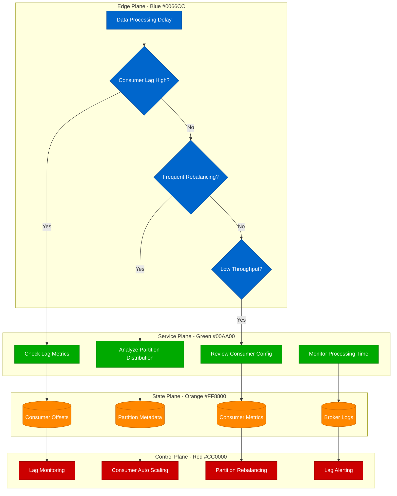
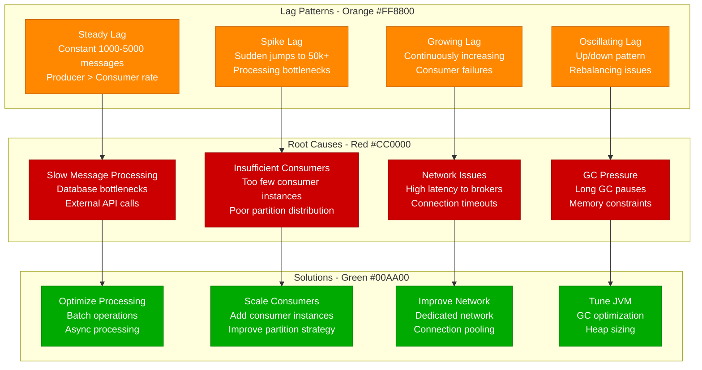
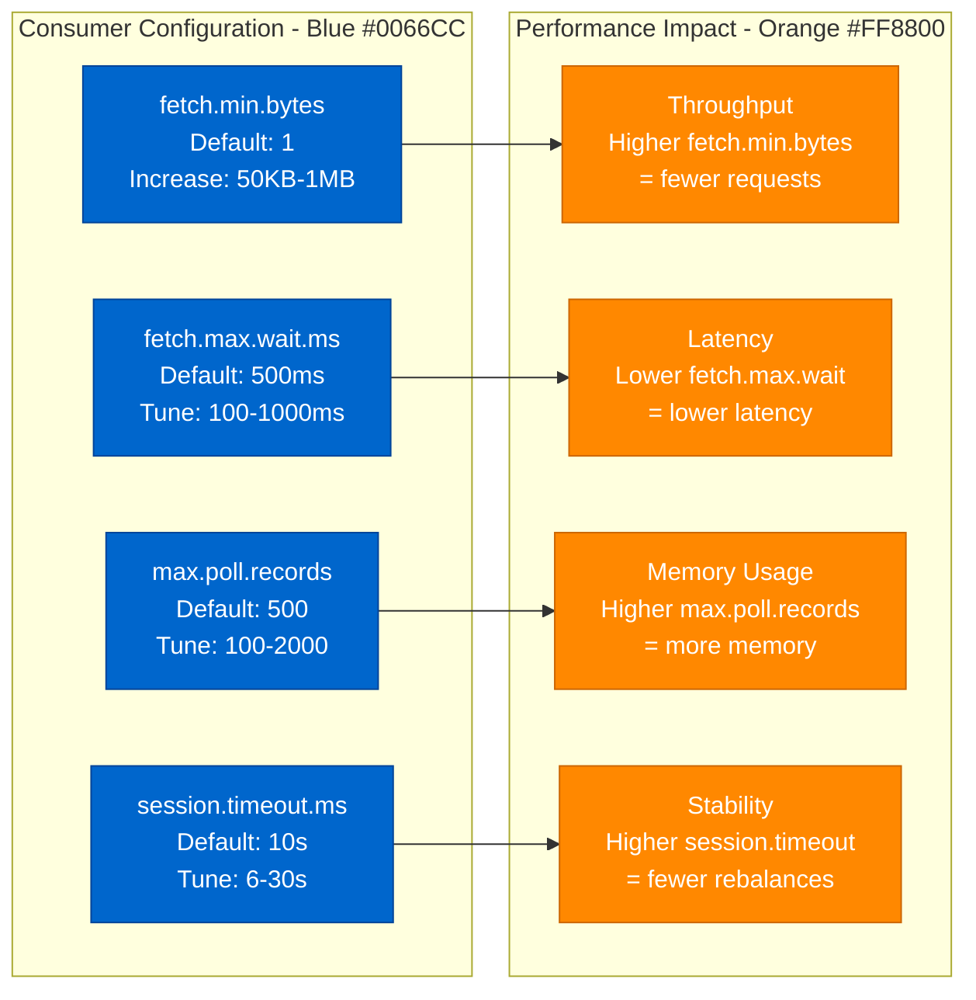

# Kafka Consumer Lag - Production Debugging Guide

## Overview

Kafka consumer lag can cause data processing delays, memory issues, and real-time system failures. This guide covers systematic debugging for partition lag investigation, consumer group rebalancing, and throughput optimization in production Kafka deployments.

## Debugging Flowchart



## Kafka Lag Investigation Commands

### 1. Consumer Lag Analysis
```bash
# Check consumer lag for all groups
kafka-consumer-groups.sh --bootstrap-server localhost:9092 --list

# Detailed lag information for specific group
kafka-consumer-groups.sh --bootstrap-server localhost:9092 \
  --group user-events-group --describe

# Output format:
# GROUP              TOPIC      PARTITION  CURRENT-OFFSET  LOG-END-OFFSET  LAG     CONSUMER-ID    HOST        CLIENT-ID
# user-events-group  events     0          1000            1500            500     consumer-1     /10.0.1.1   client-1

# Reset consumer group offsets (use carefully!)
kafka-consumer-groups.sh --bootstrap-server localhost:9092 \
  --group user-events-group --reset-offsets --to-latest --topic events --execute

# Check partition details
kafka-topics.sh --bootstrap-server localhost:9092 \
  --topic events --describe

# Monitor offset progression in real-time
watch -n 2 "kafka-consumer-groups.sh --bootstrap-server localhost:9092 --group user-events-group --describe"
```

### 2. Broker and Partition Analysis
```bash
# Check broker performance
kafka-broker-api-versions.sh --bootstrap-server localhost:9092

# Analyze partition leadership
kafka-topics.sh --bootstrap-server localhost:9092 --describe | grep "Leader:"

# Check broker disk usage
du -sh /var/kafka-logs/events-*

# Monitor active controllers
kafka-metadata-shell.sh --snapshot /var/kafka-logs/__cluster_metadata-0/00000000000000000000.log --print

# Check under-replicated partitions
kafka-topics.sh --bootstrap-server localhost:9092 --describe --under-replicated-partitions
```

### 3. Consumer Group Coordination
```bash
# Check consumer group coordinator
kafka-consumer-groups.sh --bootstrap-server localhost:9092 \
  --group user-events-group --describe --verbose

# Monitor consumer group state changes
kafka-console-consumer.sh --bootstrap-server localhost:9092 \
  --topic __consumer_offsets --formatter "kafka.coordinator.group.GroupMetadataManager\$OffsetsMessageFormatter"

# Check group membership
kafka-consumer-groups.sh --bootstrap-server localhost:9092 \
  --group user-events-group --describe --members --verbose
```

## Consumer Lag Patterns and Analysis

### Lag Pattern Classification


### Consumer Configuration Optimization


## Real Production Examples

### LinkedIn's Kafka Consumer Optimization
**Challenge:** Processing 1 trillion messages/day with minimal lag

**Configuration:**
```properties
# LinkedIn-optimized consumer configuration
bootstrap.servers=kafka-cluster.internal:9092
group.id=user-activity-processor
client.id=activity-consumer-${HOSTNAME}

# Throughput optimization
fetch.min.bytes=65536          # 64KB minimum fetch
fetch.max.wait.ms=100          # Low latency
max.poll.records=1000          # Batch processing
max.partition.fetch.bytes=2097152  # 2MB per partition

# Reliability configuration
session.timeout.ms=10000       # 10 seconds
heartbeat.interval.ms=3000     # 3 seconds
max.poll.interval.ms=300000    # 5 minutes for processing

# Offset management
enable.auto.commit=false       # Manual commit for exactly-once
auto.offset.reset=earliest     # Process all messages

# Performance tuning
connections.max.idle.ms=540000 # 9 minutes
request.timeout.ms=30000       # 30 seconds
retry.backoff.ms=100          # Quick retries

# Compression
compression.type=snappy       # Fast compression

# Security (if needed)
security.protocol=SASL_SSL
sasl.mechanism=SCRAM-SHA-256
```

**Java Consumer Implementation:**
```java
// LinkedIn-style high-performance Kafka consumer
import org.apache.kafka.clients.consumer.*;
import org.apache.kafka.common.TopicPartition;
import java.util.*;
import java.util.concurrent.*;

public class HighPerformanceKafkaConsumer {
    private final KafkaConsumer<String, String> consumer;
    private final ExecutorService executorService;
    private final Map<TopicPartition, OffsetAndMetadata> offsetsToCommit;
    private volatile boolean running = true;

    public HighPerformanceKafkaConsumer(Properties props, int threadPoolSize) {
        this.consumer = new KafkaConsumer<>(props);
        this.executorService = Executors.newFixedThreadPool(threadPoolSize);
        this.offsetsToCommit = new ConcurrentHashMap<>();
    }

    public void subscribe(List<String> topics) {
        consumer.subscribe(topics, new RebalanceListener());
    }

    public void consume() {
        try {
            while (running) {
                ConsumerRecords<String, String> records = consumer.poll(Duration.ofMillis(100));

                if (!records.isEmpty()) {
                    // Process records in parallel
                    List<Future<Void>> futures = new ArrayList<>();

                    for (TopicPartition partition : records.partitions()) {
                        List<ConsumerRecord<String, String>> partitionRecords = records.records(partition);

                        Future<Void> future = executorService.submit(() -> {
                            processPartitionRecords(partition, partitionRecords);
                            return null;
                        });

                        futures.add(future);
                    }

                    // Wait for all partitions to complete
                    for (Future<Void> future : futures) {
                        try {
                            future.get(30, TimeUnit.SECONDS);
                        } catch (TimeoutException e) {
                            log.error("Processing timeout for partition");
                            future.cancel(true);
                        }
                    }

                    // Commit offsets after successful processing
                    commitOffsetsSync();
                }
            }
        } catch (Exception e) {
            log.error("Error in consumer loop", e);
        } finally {
            consumer.close();
            executorService.shutdown();
        }
    }

    private void processPartitionRecords(TopicPartition partition, List<ConsumerRecord<String, String>> records) {
        try {
            // Batch process records for efficiency
            List<ProcessedMessage> batch = new ArrayList<>();

            for (ConsumerRecord<String, String> record : records) {
                ProcessedMessage processed = processMessage(record);
                batch.add(processed);

                // Process in batches of 100
                if (batch.size() >= 100) {
                    processBatch(batch);
                    batch.clear();
                }
            }

            // Process remaining records
            if (!batch.isEmpty()) {
                processBatch(batch);
            }

            // Track offset for commit
            ConsumerRecord<String, String> lastRecord = records.get(records.size() - 1);
            offsetsToCommit.put(partition, new OffsetAndMetadata(lastRecord.offset() + 1));

        } catch (Exception e) {
            log.error("Error processing partition " + partition, e);
            // Don't commit offset if processing failed
        }
    }

    private ProcessedMessage processMessage(ConsumerRecord<String, String> record) {
        // Business logic processing
        try {
            // Parse message
            UserActivity activity = parseUserActivity(record.value());

            // Validate and enrich
            enrichActivity(activity);

            // Store to database (async)
            return new ProcessedMessage(activity, record.offset());

        } catch (Exception e) {
            log.error("Failed to process message at offset " + record.offset(), e);
            // Handle poison pill messages
            return handlePoisonPill(record);
        }
    }

    private void processBatch(List<ProcessedMessage> batch) {
        // Batch database operations for efficiency
        try {
            databaseService.batchInsert(batch);
            cacheService.batchUpdate(batch);
            metricsService.recordProcessed(batch.size());

        } catch (Exception e) {
            log.error("Batch processing failed", e);
            // Retry individual messages or send to DLQ
            handleBatchFailure(batch);
        }
    }

    private void commitOffsetsSync() {
        if (!offsetsToCommit.isEmpty()) {
            try {
                consumer.commitSync(offsetsToCommit);
                offsetsToCommit.clear();
                log.debug("Committed offsets: " + offsetsToCommit.size());

            } catch (CommitFailedException e) {
                log.error("Offset commit failed", e);
                // Handle commit failure (potentially retry)
            }
        }
    }

    // Rebalance listener to handle partition reassignment
    private class RebalanceListener implements ConsumerRebalanceListener {
        @Override
        public void onPartitionsRevoked(Collection<TopicPartition> partitions) {
            log.info("Partitions revoked: " + partitions);
            // Commit any pending offsets
            commitOffsetsSync();
        }

        @Override
        public void onPartitionsAssigned(Collection<TopicPartition> partitions) {
            log.info("Partitions assigned: " + partitions);
            // Initialize partition-specific resources
            for (TopicPartition partition : partitions) {
                initializePartitionResources(partition);
            }
        }
    }
}
```

### Uber's Real-time Data Pipeline
**Challenge:** Processing location updates with < 100ms lag

**Streaming Architecture:**
```python
# Uber-style real-time Kafka consumer with lag monitoring
import asyncio
import time
from kafka import KafkaConsumer, TopicPartition
from kafka.errors import KafkaError
import logging
import json
from typing import Dict, List
from dataclasses import dataclass
from collections import defaultdict

@dataclass
class LagMetrics:
    partition: int
    current_offset: int
    log_end_offset: int
    lag: int
    last_commit_time: float
    processing_rate: float

class RealTimeKafkaProcessor:
    def __init__(self, config: dict):
        self.config = config
        self.consumer = None
        self.running = False
        self.lag_metrics: Dict[int, LagMetrics] = {}
        self.processing_times = defaultdict(list)
        self.logger = logging.getLogger(__name__)

    async def start_consumer(self):
        """Start the Kafka consumer with optimized configuration"""
        consumer_config = {
            'bootstrap_servers': self.config['brokers'],
            'group_id': self.config['group_id'],
            'client_id': f"realtime-processor-{self.config['instance_id']}",

            # Optimized for low latency
            'fetch_min_bytes': 1,           # Process immediately
            'fetch_max_wait_ms': 10,        # Very low latency
            'max_poll_records': 100,        # Small batches
            'session_timeout_ms': 6000,     # Quick failure detection
            'heartbeat_interval_ms': 2000,  # Frequent heartbeats

            # Reliability
            'enable_auto_commit': False,    # Manual commit
            'auto_offset_reset': 'latest',  # Only new messages

            # Performance
            'max_partition_fetch_bytes': 1048576,  # 1MB per partition
            'connections_max_idle_ms': 300000,     # 5 minutes
            'request_timeout_ms': 20000,           # 20 seconds
        }

        self.consumer = KafkaConsumer(
            self.config['topic'],
            **consumer_config,
            value_deserializer=lambda x: json.loads(x.decode('utf-8'))
        )

        self.running = True
        await self.consume_loop()

    async def consume_loop(self):
        """Main consumer loop with lag monitoring"""
        try:
            while self.running:
                # Poll for messages with short timeout
                message_batch = self.consumer.poll(timeout_ms=100)

                if message_batch:
                    # Process messages immediately
                    await self.process_message_batch(message_batch)

                    # Update lag metrics
                    await self.update_lag_metrics()

                    # Check for lag alerts
                    await self.check_lag_alerts()

                # Periodic maintenance
                if int(time.time()) % 10 == 0:  # Every 10 seconds
                    await self.log_performance_metrics()

        except Exception as e:
            self.logger.error(f"Consumer loop error: {e}")
        finally:
            if self.consumer:
                self.consumer.close()

    async def process_message_batch(self, message_batch):
        """Process a batch of messages with performance tracking"""
        start_time = time.time()
        processed_count = 0
        commit_offsets = {}

        for topic_partition, messages in message_batch.items():
            try:
                # Process messages for this partition
                partition_results = await self.process_partition_messages(
                    topic_partition.partition,
                    messages
                )

                if partition_results:
                    # Track offset for commit
                    last_message = messages[-1]
                    commit_offsets[topic_partition] = last_message.offset + 1
                    processed_count += len(messages)

            except Exception as e:
                self.logger.error(f"Failed to process partition {topic_partition.partition}: {e}")
                # Don't commit offset for failed partition

        # Commit offsets for successfully processed partitions
        if commit_offsets:
            try:
                self.consumer.commit(commit_offsets)
                self.logger.debug(f"Committed offsets for {len(commit_offsets)} partitions")
            except Exception as e:
                self.logger.error(f"Offset commit failed: {e}")

        # Track processing performance
        processing_time = time.time() - start_time
        if processed_count > 0:
            rate = processed_count / processing_time
            self.processing_times['overall'].append(rate)

    async def process_partition_messages(self, partition: int, messages: List) -> bool:
        """Process messages from a single partition"""
        try:
            start_time = time.time()

            # Batch process for efficiency
            location_updates = []
            for message in messages:
                location_update = self.parse_location_update(message.value)
                if location_update:
                    location_updates.append(location_update)

            if location_updates:
                # Batch update location cache
                await self.update_location_cache(location_updates)

                # Update nearby drivers (async)
                asyncio.create_task(self.update_nearby_drivers(location_updates))

                # Send to real-time subscribers (async)
                asyncio.create_task(self.broadcast_location_updates(location_updates))

            # Track partition processing time
            processing_time = time.time() - start_time
            rate = len(messages) / max(processing_time, 0.001)
            self.processing_times[f'partition_{partition}'].append(rate)

            return True

        except Exception as e:
            self.logger.error(f"Failed to process partition {partition}: {e}")
            return False

    async def update_lag_metrics(self):
        """Update lag metrics for all assigned partitions"""
        try:
            # Get current assignment
            assignment = self.consumer.assignment()

            for topic_partition in assignment:
                # Get current offset
                current_offset = self.consumer.position(topic_partition)

                # Get log end offset (latest available)
                end_offsets = self.consumer.end_offsets([topic_partition])
                log_end_offset = end_offsets[topic_partition]

                # Calculate lag
                lag = log_end_offset - current_offset

                # Update metrics
                self.lag_metrics[topic_partition.partition] = LagMetrics(
                    partition=topic_partition.partition,
                    current_offset=current_offset,
                    log_end_offset=log_end_offset,
                    lag=lag,
                    last_commit_time=time.time(),
                    processing_rate=self.get_partition_processing_rate(topic_partition.partition)
                )

        except Exception as e:
            self.logger.error(f"Failed to update lag metrics: {e}")

    async def check_lag_alerts(self):
        """Check for lag-based alerts and take action"""
        for partition, metrics in self.lag_metrics.items():
            # Alert on high lag
            if metrics.lag > self.config.get('lag_alert_threshold', 1000):
                await self.trigger_lag_alert(partition, metrics)

            # Auto-scale on sustained high lag
            if metrics.lag > self.config.get('lag_scale_threshold', 5000):
                await self.trigger_auto_scale(partition, metrics)

    async def trigger_lag_alert(self, partition: int, metrics: LagMetrics):
        """Trigger alert for high lag"""
        alert = {
            'alert_type': 'kafka_consumer_lag',
            'partition': partition,
            'lag': metrics.lag,
            'processing_rate': metrics.processing_rate,
            'timestamp': time.time()
        }

        self.logger.warning(f"High lag alert: {alert}")
        # Send to monitoring system
        await self.send_alert(alert)

    async def trigger_auto_scale(self, partition: int, metrics: LagMetrics):
        """Trigger auto-scaling for sustained high lag"""
        scale_request = {
            'action': 'scale_up',
            'consumer_group': self.config['group_id'],
            'partition': partition,
            'current_lag': metrics.lag,
            'reason': 'sustained_high_lag'
        }

        self.logger.critical(f"Triggering auto-scale: {scale_request}")
        # Send to orchestration system
        await self.request_scaling(scale_request)

    def get_partition_processing_rate(self, partition: int) -> float:
        """Get processing rate for a partition"""
        rates = self.processing_times.get(f'partition_{partition}', [])
        if rates:
            # Return average of last 10 measurements
            return sum(rates[-10:]) / len(rates[-10:])
        return 0.0

    async def log_performance_metrics(self):
        """Log performance and lag metrics"""
        total_lag = sum(metrics.lag for metrics in self.lag_metrics.values())
        avg_processing_rate = sum(metrics.processing_rate for metrics in self.lag_metrics.values()) / max(len(self.lag_metrics), 1)

        self.logger.info(f"Performance metrics - Total lag: {total_lag}, Avg rate: {avg_processing_rate:.2f} msg/s")

        # Send metrics to monitoring system
        await self.send_metrics({
            'total_lag': total_lag,
            'partition_count': len(self.lag_metrics),
            'avg_processing_rate': avg_processing_rate,
            'timestamp': time.time()
        })

# Usage example
config = {
    'brokers': ['kafka-1.internal:9092', 'kafka-2.internal:9092'],
    'topic': 'driver-locations',
    'group_id': 'realtime-location-processor',
    'instance_id': 'processor-1',
    'lag_alert_threshold': 500,
    'lag_scale_threshold': 2000,
}

processor = RealTimeKafkaProcessor(config)
await processor.start_consumer()
```

## Monitoring and Alerting

### Key Kafka Consumer Metrics
```bash
# JMX metrics for consumer lag monitoring
kafka.consumer:type=consumer-fetch-manager-metrics,client-id=consumer-1,partition=0,topic=events

# Important metrics to track:
# - records-lag: Current lag in number of records
# - records-lag-avg: Average lag over time window
# - records-consumed-rate: Rate of record consumption
# - fetch-latency-avg: Average fetch latency
# - commit-latency-avg: Average commit latency
```

### Prometheus Alerts for Consumer Lag
```yaml
# Prometheus alerting rules for Kafka consumer lag
groups:
- name: kafka_consumer_lag
  rules:
  - alert: KafkaConsumerLagHigh
    expr: kafka_consumer_lag > 1000
    for: 2m
    labels:
      severity: warning
    annotations:
      summary: "Kafka consumer lag is high"
      description: "Consumer group {{ $labels.group }} lag: {{ $value }} messages"

  - alert: KafkaConsumerLagCritical
    expr: kafka_consumer_lag > 10000
    for: 1m
    labels:
      severity: critical
    annotations:
      summary: "Kafka consumer lag is critical"
      description: "Consumer group {{ $labels.group }} lag: {{ $value }} messages"

  - alert: KafkaConsumerDown
    expr: up{job="kafka-consumer"} == 0
    for: 30s
    labels:
      severity: critical
    annotations:
      summary: "Kafka consumer is down"
      description: "Consumer {{ $labels.instance }} is not responding"

  - alert: KafkaFrequentRebalancing
    expr: rate(kafka_consumer_coordinator_rebalance_total[10m]) > 0.1
    for: 5m
    labels:
      severity: warning
    annotations:
      summary: "Frequent consumer group rebalancing"
      description: "Rebalance rate: {{ $value }}/min for group {{ $labels.group }}"
```

## Prevention and Optimization

### 1. Consumer Performance Tuning Script
```bash
#!/bin/bash
# Kafka consumer performance tuning script

KAFKA_HOME="/opt/kafka"
JMX_PORT=9999
CONSUMER_GROUP="user-events-group"

# Function to get current lag
get_consumer_lag() {
    $KAFKA_HOME/bin/kafka-consumer-groups.sh \
        --bootstrap-server localhost:9092 \
        --group $CONSUMER_GROUP \
        --describe | awk '{sum += $5} END {print "Total lag:", sum}'
}

# Function to analyze partition distribution
analyze_partition_distribution() {
    echo "Analyzing partition distribution..."
    $KAFKA_HOME/bin/kafka-consumer-groups.sh \
        --bootstrap-server localhost:9092 \
        --group $CONSUMER_GROUP \
        --describe | awk '
        NR>1 {
            consumer[$6]++
            lag[$6] += $5
        }
        END {
            print "Consumer Instance | Partitions | Total Lag"
            print "-------------------|------------|----------"
            for (c in consumer) {
                printf "%-18s | %-10d | %-10d\n", c, consumer[c], lag[c]
            }
        }'
}

# Function to check consumer performance
check_consumer_performance() {
    echo "Checking consumer performance metrics..."

    # Get JMX metrics
    jmx_metrics=$(curl -s "http://localhost:$JMX_PORT/metrics" | grep -E "(records-consumed-rate|fetch-latency|commit-latency)")

    echo "Performance Metrics:"
    echo "$jmx_metrics"

    # Check for performance issues
    fetch_latency=$(echo "$jmx_metrics" | grep "fetch-latency-avg" | awk '{print $2}')
    if (( $(echo "$fetch_latency > 100" | bc -l) )); then
        echo "⚠️  High fetch latency detected: ${fetch_latency}ms"
    fi

    commit_latency=$(echo "$jmx_metrics" | grep "commit-latency-avg" | awk '{print $2}')
    if (( $(echo "$commit_latency > 50" | bc -l) )); then
        echo "⚠️  High commit latency detected: ${commit_latency}ms"
    fi
}

# Function to optimize consumer configuration
optimize_consumer_config() {
    echo "Generating optimized consumer configuration..."

    cat > optimized-consumer.properties << EOF
# Optimized Kafka consumer configuration
bootstrap.servers=localhost:9092
group.id=$CONSUMER_GROUP
client.id=optimized-consumer

# Throughput optimization
fetch.min.bytes=16384          # 16KB
fetch.max.wait.ms=100          # 100ms
max.poll.records=500           # Moderate batch size
max.partition.fetch.bytes=1048576  # 1MB

# Reliability
session.timeout.ms=10000       # 10 seconds
heartbeat.interval.ms=3000     # 3 seconds
max.poll.interval.ms=300000    # 5 minutes

# Performance
connections.max.idle.ms=540000 # 9 minutes
request.timeout.ms=30000       # 30 seconds
retry.backoff.ms=100          # 100ms

# Offset management
enable.auto.commit=false       # Manual commit recommended
auto.offset.reset=latest       # Start from latest

# Compression
compression.type=snappy
EOF

    echo "✅ Optimized configuration saved to optimized-consumer.properties"
}

# Function to check topic configuration
check_topic_configuration() {
    local topic=$1
    echo "Checking topic configuration for: $topic"

    $KAFKA_HOME/bin/kafka-configs.sh \
        --bootstrap-server localhost:9092 \
        --entity-type topics \
        --entity-name $topic \
        --describe

    # Check partition count
    partition_count=$($KAFKA_HOME/bin/kafka-topics.sh \
        --bootstrap-server localhost:9092 \
        --topic $topic \
        --describe | grep "PartitionCount" | awk '{print $2}')

    consumer_count=$($KAFKA_HOME/bin/kafka-consumer-groups.sh \
        --bootstrap-server localhost:9092 \
        --group $CONSUMER_GROUP \
        --describe | grep -v "CONSUMER-ID" | wc -l)

    echo "Partition count: $partition_count"
    echo "Consumer count: $consumer_count"

    if [ $consumer_count -gt $partition_count ]; then
        echo "⚠️  More consumers than partitions - some consumers will be idle"
    elif [ $partition_count -gt $((consumer_count * 3)) ]; then
        echo "⚠️  Consider adding more consumers for better parallelism"
    fi
}

# Main execution
echo "=== Kafka Consumer Performance Analysis ==="
echo "Consumer Group: $CONSUMER_GROUP"
echo "============================================"

get_consumer_lag
echo ""
analyze_partition_distribution
echo ""
check_consumer_performance
echo ""
check_topic_configuration "events"
echo ""
optimize_consumer_config

echo ""
echo "Analysis complete. Review the optimized configuration and performance recommendations."
```

This comprehensive Kafka consumer lag debugging guide provides systematic approaches to identifying, analyzing, and resolving partition lag issues, consumer group rebalancing problems, and throughput optimization in production Kafka deployments.