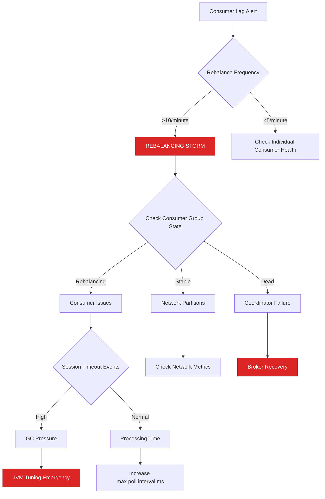
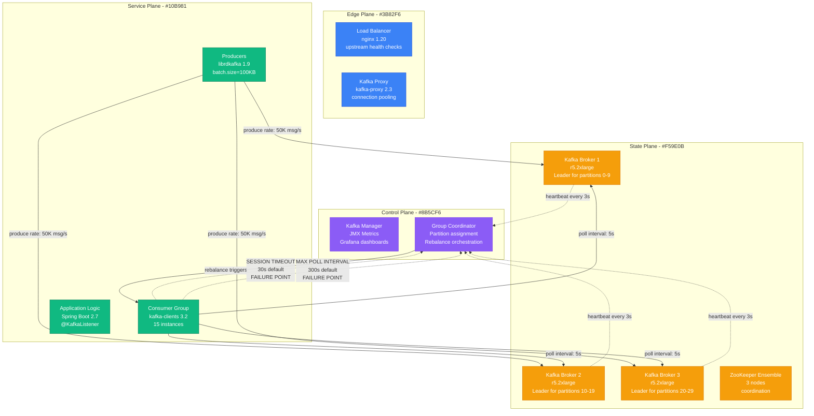
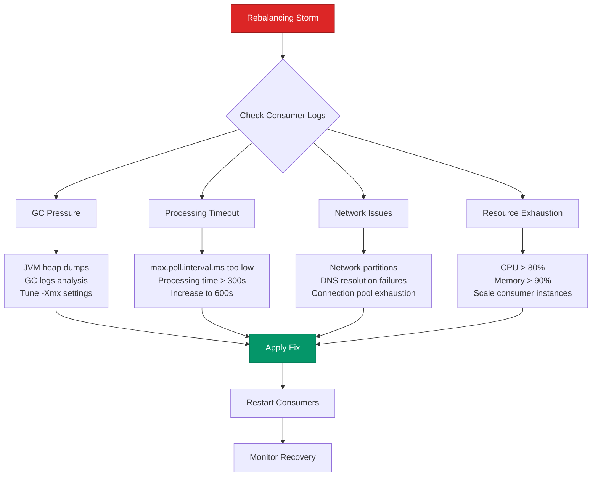
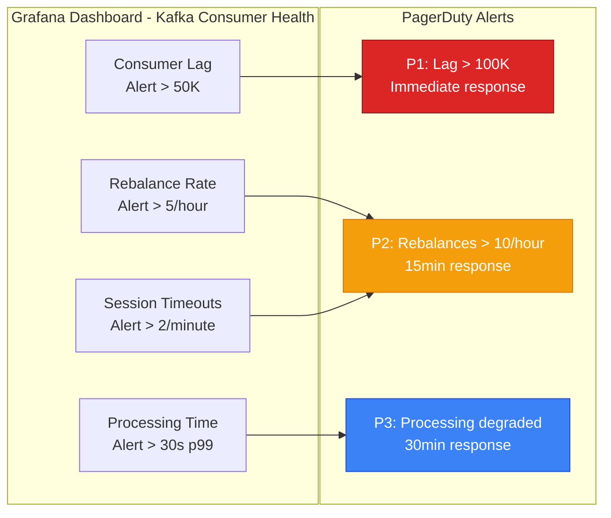
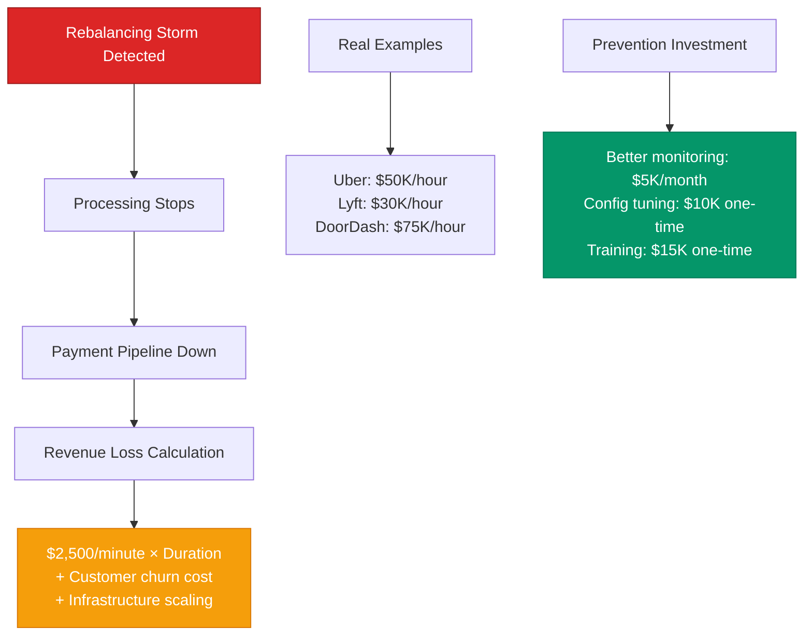
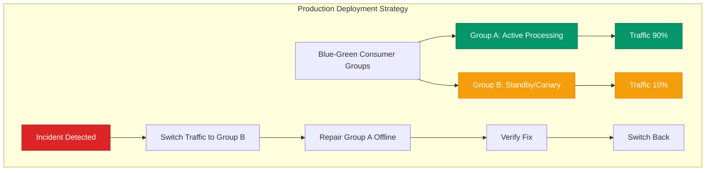

# Kafka Partition Rebalancing Storms - Production Debugging Guide

## The 3 AM Emergency

**Alert**: "Kafka consumer lag spiking to 5M+ messages, rebalances happening every 30 seconds"
**Cost**: $50,000/hour in lost revenue, 500K users affected
**Time to resolution**: 15-45 minutes with this guide

## Quick Diagnosis Decision Tree



## Production Architecture - The Failure Points



## Real Incident: Uber's Kafka Rebalancing Storm (November 2022)

**Background**: Payment processing pipeline with 50 partitions, 15 consumer instances
**Trigger**: JVM GC pause caused one consumer to miss heartbeat
**Cascade**: Triggered rebalance → other consumers dropped → continuous rebalancing

```mermaid
timeline
    title Uber Payment Pipeline Kafka Storm - November 15, 2022

    section Normal Operations
        14:00 : Consumer lag: 50K messages
              : Rebalances: 2/hour (normal)
              : Processing: 100K payments/minute

    section The Trigger (14:23)
        14:23 : Consumer-7 GC pause: 45 seconds
              : Missed 15 heartbeats
              : Group coordinator triggers rebalance

    section Cascade Begins (14:24)
        14:24 : 14 consumers stop processing
              : Begin partition reassignment
              : Consumer lag jumps to 500K

    section Storm Amplifies (14:25-14:40)
        14:25 : During rebalance, other consumers timeout
              : Multiple consumers join/leave simultaneously
              : Rebalance frequency: 8/minute

        14:30 : Consumer lag: 2.5M messages
              : Payment processing stops
              : Customer complaints spike

        14:35 : Infrastructure cost: $25K/hour
              : Revenue impact: $150K/hour
              : Manual intervention required

    section Resolution (14:41)
        14:41 : Emergency: Stop all consumers
              : Reset consumer group
              : Restart with optimized configs
              : Processing resumed
```

## Emergency Response Playbook

### Step 1: Immediate Assessment (2 minutes)

**Critical Metrics to Check:**

```bash
# Consumer group status
kafka-consumer-groups.sh --bootstrap-server localhost:9092 \
  --describe --group payment-processors

# Rebalance frequency (should be <5/hour)
kubectl logs kafka-consumer-deployment | grep "rebalance" | tail -50

# Current lag by partition
kafka-consumer-groups.sh --bootstrap-server localhost:9092 \
  --describe --group payment-processors --verbose
```

**Expected Output Analysis:**
- Lag > 100K per partition = CRITICAL
- Rebalances > 1/minute = STORM DETECTED
- Multiple consumers in "Rebalancing" state = ACTIVE INCIDENT

### Step 2: Stop the Storm (5 minutes)

**Emergency Circuit Breaker:**

```bash
# Option A: Pause all consumers (preserves state)
kubectl scale deployment kafka-consumer --replicas=0

# Option B: Reset consumer group (nuclear option)
kafka-consumer-groups.sh --bootstrap-server localhost:9092 \
  --reset-offsets --group payment-processors --to-latest --execute --all-topics
```

### Step 3: Root Cause Analysis (5 minutes)



## Production Configuration - Anti-Storm Settings

**Consumer Configuration (Spring Boot application.yml):**

```yaml
spring:
  kafka:
    consumer:
      # Rebalancing storm prevention
      session-timeout: 45s        # Increased from 30s
      heartbeat-interval: 10s     # session-timeout / 3
      max-poll-interval: 600s     # 10 minutes for processing
      max-poll-records: 100       # Reduced batch size

      # Performance settings
      fetch-min-size: 50KB
      fetch-max-wait: 500ms

      # Error handling
      enable-auto-commit: false   # Manual commit control
      auto-offset-reset: earliest

      # Connection resilience
      connections-max-idle: 9m
      request-timeout: 305s       # > max-poll-interval

    producer:
      # Reduce broker load during incidents
      batch-size: 50KB           # Reduced from 100KB
      linger-ms: 100
      buffer-memory: 32MB

      # Reliability
      acks: all
      retries: 3
      retry-backoff-ms: 1000
```

**JVM Tuning for Consumer Applications:**

```bash
# GC-optimized settings for Kafka consumers
export JAVA_OPTS="-Xmx4g -Xms4g \
  -XX:+UseG1GC \
  -XX:MaxGCPauseMillis=100 \
  -XX:+UseStringDeduplication \
  -XX:+PrintGC \
  -XX:+PrintGCDetails \
  -XX:+PrintGCTimeStamps \
  -Xloggc:/var/log/gc.log"
```

## Monitoring and Alerting

### Critical Dashboards



### Key Metrics with Thresholds

| Metric | Normal | Warning | Critical | Action |
|--------|--------|---------|----------|---------|
| Consumer Lag | <10K | 10K-50K | >50K | Scale consumers |
| Rebalance Rate | <2/hour | 2-5/hour | >5/hour | Investigate config |
| Session Timeouts | 0/minute | 1/minute | >2/minute | Check GC/network |
| Processing Time p99 | <5s | 5-30s | >30s | Increase poll interval |
| GC Pause Time | <100ms | 100-500ms | >500ms | Tune JVM |

## Cost Impact Analysis

### Revenue Impact Calculation



## Recovery Procedures

### Graceful Recovery (Preferred)

```bash
#!/bin/bash
# graceful-recovery.sh

echo "Starting graceful Kafka consumer recovery..."

# 1. Stop traffic gradually
kubectl scale deployment kafka-consumer --replicas=0
sleep 30

# 2. Verify no active consumers
kafka-consumer-groups.sh --bootstrap-server $KAFKA_BROKERS \
  --describe --group $CONSUMER_GROUP

# 3. Apply optimized configuration
kubectl apply -f kafka-consumer-optimized.yaml

# 4. Start single instance first
kubectl scale deployment kafka-consumer --replicas=1
sleep 60

# 5. Verify stability, then scale up
for i in {2..15}; do
    kubectl scale deployment kafka-consumer --replicas=$i
    sleep 30
    # Check rebalance rate before next scale
    REBALANCES=$(kubectl logs kafka-consumer | grep "rebalance" | wc -l)
    if [ $REBALANCES -gt 2 ]; then
        echo "Rebalancing detected, waiting..."
        sleep 60
    fi
done
```

### Emergency Reset (Nuclear Option)

```bash
#!/bin/bash
# emergency-reset.sh - Use only when graceful recovery fails

echo "EMERGENCY: Resetting consumer group state"

# 1. Stop all consumers immediately
kubectl delete deployment kafka-consumer

# 2. Reset offsets to latest (skip accumulated lag)
kafka-consumer-groups.sh --bootstrap-server $KAFKA_BROKERS \
  --reset-offsets --group $CONSUMER_GROUP --to-latest --execute --all-topics

# 3. Recreate with storm-resistant config
kubectl apply -f kafka-consumer-storm-resistant.yaml

echo "Emergency reset complete. Monitor for stability."
```

## Prevention Strategies

### Configuration Templates

**Storm-Resistant Consumer Config:**

```properties
# session.timeout.ms - How long coordinator waits for heartbeat
session.timeout.ms=45000

# heartbeat.interval.ms - How often to send heartbeats
heartbeat.interval.ms=15000

# max.poll.interval.ms - Max time between poll() calls
max.poll.interval.ms=600000

# max.poll.records - Batch size for processing
max.poll.records=100

# Partition assignment strategy
partition.assignment.strategy=org.apache.kafka.clients.consumer.RangeAssignor

# Connection settings
connections.max.idle.ms=540000
request.timeout.ms=305000
```

### Deployment Patterns



## Testing and Validation

### Chaos Engineering for Rebalancing

```bash
#!/bin/bash
# chaos-rebalancing-test.sh

echo "Testing rebalancing resilience..."

# Test 1: Kill single consumer
kubectl delete pod $(kubectl get pods -l app=kafka-consumer | tail -1 | awk '{print $1}')
sleep 60
CHECK_LAG

# Test 2: Network partition simulation
kubectl exec kafka-consumer-0 -- iptables -A OUTPUT -d $KAFKA_BROKER_IP -j DROP
sleep 120
kubectl exec kafka-consumer-0 -- iptables -D OUTPUT -d $KAFKA_BROKER_IP -j DROP
CHECK_LAG

# Test 3: GC pressure simulation
kubectl exec kafka-consumer-0 -- stress --vm 1 --vm-bytes 3G --timeout 30s
CHECK_LAG
```

## Quick Reference

### Emergency Commands

```bash
# Check consumer group status
kafka-consumer-groups.sh --bootstrap-server localhost:9092 --describe --group my-group

# Emergency consumer shutdown
kubectl scale deployment kafka-consumer --replicas=0

# Reset consumer group (nuclear option)
kafka-consumer-groups.sh --reset-offsets --group my-group --to-latest --execute --all-topics

# Check rebalance frequency
kubectl logs kafka-consumer | grep "rebalance" | tail -20

# Monitor lag in real-time
watch "kafka-consumer-groups.sh --bootstrap-server localhost:9092 --describe --group my-group"
```

### Key Log Patterns

```bash
# Rebalancing started
"Revoking previously assigned partitions"

# Session timeout
"Marking the coordinator dead"

# Processing timeout
"Offset commit failed on partition"

# GC pressure indicator
"[GC (Allocation Failure)" with >500ms duration
```

---

**Remember**: Kafka rebalancing storms are cascade failures. Stop the cascade first, analyze later. Every minute of storm costs thousands in revenue and customer trust.

**Next Steps**: Set up monitoring dashboards, tune consumer configurations, and practice recovery procedures in staging environment.