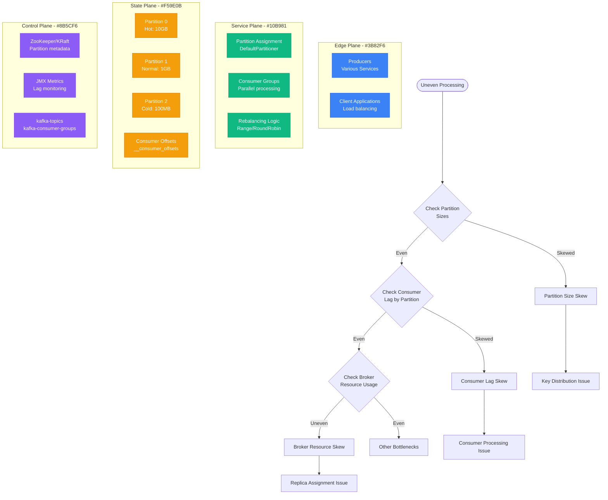

# Kafka Partition Skew Debugging

## Overview

Kafka partition skew occurs when data is unevenly distributed across partitions, leading to hot partitions, uneven consumer lag, and processing bottlenecks. This guide provides production-tested debugging techniques for identifying and resolving partition imbalance issues.

## Immediate Symptoms Checklist

- [ ] Some partitions have 10x+ more data than others
- [ ] Consumer lag concentrated on specific partitions
- [ ] Uneven processing times across consumer instances
- [ ] Memory pressure on specific brokers
- [ ] Throughput degradation despite scaling consumers
- [ ] Leader election happening frequently on hot partitions

## Kafka Partition Skew Detection Flowchart



## Step-by-Step Debugging Process

### Phase 1: Partition Size Analysis (< 3 minutes)

```bash
# 1. Check partition sizes for a topic
kafka-log-dirs.sh --bootstrap-server localhost:9092 \
  --topic-list user-events --describe | grep size

# 2. Get detailed partition information
kafka-topics.sh --bootstrap-server localhost:9092 \
  --topic user-events --describe

# 3. Check partition high water marks
kafka-run-class.sh kafka.tools.GetOffsetShell \
  --bootstrap-server localhost:9092 \
  --topic user-events --time -1
```

**Expected vs. Problematic Output:**
```bash
# Good - Even distribution
Partition 0: 1,234,567 messages
Partition 1: 1,245,123 messages
Partition 2: 1,223,890 messages

# Bad - Skewed distribution
Partition 0: 5,678,901 messages (Hot partition)
Partition 1: 123,456 messages
Partition 2: 89,012 messages
```

### Phase 2: Consumer Lag Analysis (< 2 minutes)

```bash
# 1. Check consumer group lag by partition
kafka-consumer-groups.sh --bootstrap-server localhost:9092 \
  --group user-processing-group --describe

# 2. Monitor lag over time
watch -n 5 'kafka-consumer-groups.sh --bootstrap-server localhost:9092 \
  --group user-processing-group --describe'

# 3. Export lag metrics for analysis
kafka-consumer-groups.sh --bootstrap-server localhost:9092 \
  --group user-processing-group --describe --members
```

**Lag Analysis Pattern:**
```
PARTITION  CURRENT-OFFSET  LOG-END-OFFSET  LAG
0         1000000         1500000         500000  # Hot partition
1         800000          820000          20000   # Normal
2         650000          660000          10000   # Normal
```

### Phase 3: Key Distribution Analysis (< 5 minutes)

```bash
# 1. Sample message keys to understand distribution
kafka-console-consumer.sh --bootstrap-server localhost:9092 \
  --topic user-events --from-beginning --max-messages 1000 \
  --property print.key=true | awk -F'\t' '{print $1}' | sort | uniq -c

# 2. Check partitioner behavior
kafka-console-producer.sh --bootstrap-server localhost:9092 \
  --topic user-events --property parse.key=true \
  --property key.separator=:

# 3. Analyze key distribution pattern
# Custom script to analyze key hashing
for key in user1 user2 user3; do
  echo "Key: $key, Partition: $(echo -n "$key" | md5sum | \
    awk '{print (("0x"substr($1,1,8)) % 3)}')"
done
```

## Common Root Causes and Solutions

### 1. Poor Key Selection (60% of cases)

**Symptoms:**
- Specific keys consistently hash to same partition
- Celebrity user problem (one user generates 80% of events)
- Time-based keys causing temporal hotspots

**Debugging:**
```bash
# Analyze key distribution
kafka-console-consumer.sh --bootstrap-server localhost:9092 \
  --topic user-events --from-beginning --max-messages 10000 \
  --property print.key=true --property print.partition=true | \
  awk -F'\t' '{count[$3]++} END {for(p in count) print "Partition", p":", count[p]}'

# Check for celebrity keys
kafka-console-consumer.sh --bootstrap-server localhost:9092 \
  --topic user-events --from-beginning --max-messages 10000 \
  --property print.key=true | awk -F'\t' '{count[$1]++} END {
    for(k in count) if(count[k] > 100) print k, count[k]
  }' | sort -nr -k2
```

**Solutions:**

**Option 1: Composite Key Strategy**
```java
// Before: Poor key causing skew
String key = userId; // user123 always goes to partition 2

// After: Composite key with random element
String key = userId + "-" + (System.currentTimeMillis() % 100);
// user123-47, user123-82 distribute across partitions
```

**Option 2: Custom Partitioner**
```java
public class BalancedPartitioner implements Partitioner {
    private final Random random = new Random();

    @Override
    public int partition(String topic, Object key, byte[] keyBytes,
                        Object value, byte[] valueBytes, Cluster cluster) {

        List<PartitionInfo> partitions = cluster.partitionsForTopic(topic);
        int numPartitions = partitions.size();

        // Handle celebrity keys
        if (isCelebrityKey(key)) {
            return random.nextInt(numPartitions);
        }

        // Default hash for normal keys
        return Math.abs(Utils.murmur2(keyBytes)) % numPartitions;
    }

    private boolean isCelebrityKey(Object key) {
        // Define celebrity key logic
        return celebrityKeys.contains(key.toString());
    }
}
```

### 2. Temporal Hotspots (25% of cases)

**Symptoms:**
- Time-based keys causing predictable hotspots
- Business hour traffic concentration
- Batch processing creating bursts

**Debugging:**
```bash
# Analyze timestamp patterns in keys
kafka-console-consumer.sh --bootstrap-server localhost:9092 \
  --topic user-events --from-beginning --max-messages 1000 \
  --property print.key=true --property print.timestamp=true | \
  awk -F'\t' '{
    hour = strftime("%H", $2/1000)
    partition = $3
    count[hour][partition]++
  } END {
    for(h in count) {
      for(p in count[h]) {
        print "Hour", h, "Partition", p":", count[h][p]
      }
    }
  }'
```

**Solutions:**

**Option 1: Add Randomization**
```java
// Before: Time-based key
String key = "order-" + LocalDateTime.now().getHour();

// After: Time + random distribution
String key = "order-" + LocalDateTime.now().getHour() +
             "-" + ThreadLocalRandom.current().nextInt(0, 100);
```

**Option 2: Hash Combination**
```java
// Combine business key with timestamp hash
String businessKey = "user-" + userId;
long timestampHash = System.currentTimeMillis() / (1000 * 60); // Per minute
String key = businessKey + "-" + (timestampHash % 1000);
```

### 3. Insufficient Partitions (10% of cases)

**Symptoms:**
- High throughput concentrated on few partitions
- Consumer groups unable to scale beyond partition count
- Individual partitions exceeding broker capacity

**Debugging:**
```bash
# Check current partition count vs. throughput
kafka-topics.sh --bootstrap-server localhost:9092 \
  --topic user-events --describe

# Analyze messages per second per partition
kafka-consumer-perf-test.sh --bootstrap-server localhost:9092 \
  --topic user-events --messages 100000 --threads 1

# Check broker resource usage
kafka-broker-api-versions.sh --bootstrap-server localhost:9092
```

**Solutions:**

**Option 1: Increase Partitions (Careful!)**
```bash
# WARNING: This can break key ordering
kafka-topics.sh --bootstrap-server localhost:9092 \
  --topic user-events --alter --partitions 20

# Better: Create new topic with more partitions
kafka-topics.sh --bootstrap-server localhost:9092 \
  --create --topic user-events-v2 --partitions 20 --replication-factor 3
```

**Option 2: Partition Calculation**
```bash
# Calculate optimal partition count
# Target: 25MB/s per partition max
# Current throughput: 500MB/s
# Optimal partitions: 500/25 = 20 partitions

TARGET_THROUGHPUT_PER_PARTITION=25 # MB/s
CURRENT_THROUGHPUT=500 # MB/s
OPTIMAL_PARTITIONS=$((CURRENT_THROUGHPUT / TARGET_THROUGHPUT_PER_PARTITION))
echo "Recommended partitions: $OPTIMAL_PARTITIONS"
```

### 4. Consumer Processing Imbalance (5% of cases)

**Symptoms:**
- Even partition sizes but uneven consumer lag
- Some consumers processing much slower
- Processing time varies significantly by message content

**Debugging:**
```bash
# Check consumer assignment
kafka-consumer-groups.sh --bootstrap-server localhost:9092 \
  --group user-processing-group --describe --members

# Monitor per-consumer metrics
kafka-console-consumer.sh --bootstrap-server localhost:9092 \
  --topic user-events --group debug-group \
  --property print.partition=true \
  --property print.offset=true | \
  while read line; do
    echo "$(date): $line"
  done
```

**Solutions:**

**Option 1: Processing Time Optimization**
```java
// Before: Variable processing time
public void processMessage(String message) {
    if (message.contains("heavy-operation")) {
        // This takes 10 seconds for some messages
        performHeavyOperation(message);
    } else {
        // This takes 10ms for other messages
        performLightOperation(message);
    }
}

// After: Separate heavy processing
public void processMessage(String message) {
    if (message.contains("heavy-operation")) {
        // Send to separate topic for heavy processing
        heavyProcessingProducer.send("heavy-processing-topic", message);
    } else {
        performLightOperation(message);
    }
}
```

**Option 2: Consumer Rebalancing Strategy**
```java
// Use cooperative sticky assignment
Properties props = new Properties();
props.put("partition.assignment.strategy",
    "org.apache.kafka.clients.consumer.CooperativeStickyAssignor");
props.put("session.timeout.ms", "30000");
props.put("heartbeat.interval.ms", "10000");
```

## Critical Monitoring Queries

### Partition Skew Metrics

```bash
# JMX metrics for partition sizes
jmx_query="kafka.log:type=Size,name=Size,topic=user-events,partition=*"
for partition in 0 1 2; do
  size=$(kafka-run-class.sh kafka.tools.JmxTool \
    --object-name "kafka.log:type=Size,name=Size,topic=user-events,partition=$partition" \
    --one-time --reporting-interval 1000 2>/dev/null | tail -1)
  echo "Partition $partition size: $size bytes"
done

# Consumer lag by partition
kafka-consumer-groups.sh --bootstrap-server localhost:9092 \
  --group user-processing-group --describe | \
  awk 'NR>1 {print $1, $5}' | \
  while read partition lag; do
    echo "Partition $partition lag: $lag"
  done
```

### Key Distribution Analysis Script

```bash
#!/bin/bash
# analyze_key_distribution.sh

TOPIC=$1
BOOTSTRAP_SERVER=${2:-localhost:9092}
SAMPLE_SIZE=${3:-10000}

echo "Analyzing key distribution for topic: $TOPIC"
echo "Sample size: $SAMPLE_SIZE"

# Sample messages and analyze key distribution
kafka-console-consumer.sh --bootstrap-server $BOOTSTRAP_SERVER \
  --topic $TOPIC --from-beginning --max-messages $SAMPLE_SIZE \
  --property print.key=true --property print.partition=true \
  --timeout-ms 30000 2>/dev/null | \
  awk -F'\t' '
  {
    if (NF >= 2) {
      key = $1
      partition = $2
      key_count[key]++
      partition_count[partition]++
      total++
    }
  }
  END {
    print "\n=== Partition Distribution ==="
    for (p in partition_count) {
      percentage = (partition_count[p] / total) * 100
      printf "Partition %s: %d messages (%.1f%%)\n", p, partition_count[p], percentage
    }

    print "\n=== Top Keys by Frequency ==="
    for (k in key_count) {
      if (key_count[k] > total * 0.01) {  # Keys with >1% of traffic
        percentage = (key_count[k] / total) * 100
        printf "Key %s: %d messages (%.1f%%)\n", k, key_count[k], percentage
      }
    }

    print "\n=== Skew Analysis ==="
    max_partition = 0
    min_partition = total
    for (p in partition_count) {
      if (partition_count[p] > max_partition) max_partition = partition_count[p]
      if (partition_count[p] < min_partition) min_partition = partition_count[p]
    }
    skew_ratio = max_partition / min_partition
    printf "Skew ratio (max/min): %.2f\n", skew_ratio
    if (skew_ratio > 2.0) {
      print "WARNING: Significant partition skew detected!"
    }
  }'
```

## Production Example: Uber's Event Distribution

**Problem:** Driver location updates causing severe partition skew

**Initial State:**
- 95% of events from top 10 cities went to 3 partitions
- 50x difference between hottest and coldest partition
- Consumer lag reaching 2+ hours in busy partitions

**Root Cause:**
```java
// Problematic key strategy
String key = event.getCityId(); // "NYC", "SF", "LA" dominated traffic
```

**Solution:**
```java
// New composite key strategy
String key = event.getCityId() + "-" +
             event.getDriverId().hashCode() % 100 + "-" +
             (System.currentTimeMillis() / 60000) % 10; // 10-minute windows

// Result: "NYC-42-7", "SF-91-3", "LA-15-8"
```

**Results:**
- Partition skew reduced from 50:1 to 1.2:1
- Consumer lag decreased from 2 hours to <30 seconds
- Processing throughput increased 5x
- Hot partition issues eliminated

## Emergency Response Playbook

### Immediate Actions (< 5 minutes)

1. **Identify Hot Partitions:**
   ```bash
   kafka-consumer-groups.sh --bootstrap-server localhost:9092 \
     --group $CONSUMER_GROUP --describe | sort -k5 -nr
   ```

2. **Scale Consumer Group:**
   ```bash
   # Quick scale-out (temporary relief)
   kubectl scale deployment kafka-consumer --replicas=10
   ```

3. **Monitor Broker Health:**
   ```bash
   # Check broker CPU/memory on hot partition leaders
   kafka-topics.sh --bootstrap-server localhost:9092 \
     --topic $TOPIC --describe | grep "Leader:"
   ```

### Short-term Mitigation (< 30 minutes)

1. **Temporary Load Shedding:**
   ```java
   // Rate limit hot keys temporarily
   if (isHotKey(messageKey) && rateLimiter.tryAcquire()) {
       processMessage(message);
   } else {
       metrics.counter("dropped_messages").increment();
   }
   ```

2. **Consumer Rebalancing:**
   ```bash
   # Force consumer group rebalance
   kafka-consumer-groups.sh --bootstrap-server localhost:9092 \
     --group $CONSUMER_GROUP --reset-offsets --to-latest --execute --topic $TOPIC
   ```

### Long-term Solutions

1. **Key Strategy Redesign:**
   - Implement composite keys with randomization
   - Use custom partitioner for celebrity keys
   - Consider time-based key distribution

2. **Topic Redesign:**
   - Create new topic with better partition strategy
   - Implement dual-write pattern for migration
   - Gradually migrate consumers to new topic

## Real Production Metrics

**LinkedIn's Kafka Scale:**
- 7 trillion messages/day
- 4,000+ topics with up to 1,000 partitions each
- Partition skew kept under 10% through custom partitioners
- 99.9% of partitions within 2x of average size

**Key Learnings:**
- Partition count should be 2-3x peak consumer count
- Monitor skew ratio continuously (alert on >2x)
- Celebrity keys require special handling
- Key design is more critical than partition count

## Related Debugging Guides

- [Kafka Consumer Lag Debugging](/debugging/kafka-consumer-lag-debugging)
- [Message Queue Backlog Debugging](/debugging/message-queue-backlog-debugging)
- [Load Balancer Debugging](/debugging/load-balancer-debugging)