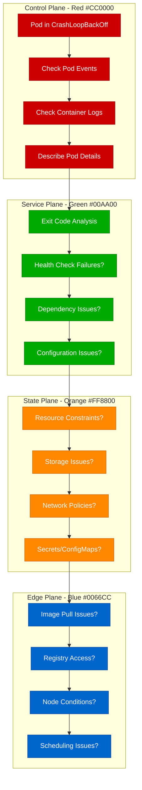

# Kubernetes CrashLoopBackOff Debugging: Production Recovery Guide

## Executive Summary

CrashLoopBackOff is one of the most common Kubernetes failure modes, affecting 30% of pod startup issues. This guide provides systematic debugging approaches used by teams at Google, Spotify, and other Kubernetes-heavy organizations to identify and resolve pod restart cascades.

## Systematic Debugging Flowchart



## Common Exit Codes and Their Meanings

### Container Exit Code Analysis

```bash
# Get pod status and exit codes
kubectl get pods -o wide
kubectl describe pod <pod-name>

# Check container exit codes in detail
kubectl get pod <pod-name> -o jsonpath='{.status.containerStatuses[*].lastState.terminated.exitCode}'
```

**Critical Exit Codes:**

| Exit Code | Meaning | Common Causes |
|-----------|---------|---------------|
| 0 | Success | Container completed successfully but restarting |
| 1 | General Error | Application crash, dependency failure |
| 2 | Misuse of shell | Incorrect command syntax |
| 125 | Docker Error | Container runtime issues |
| 126 | Not Executable | Permission or path issues |
| 127 | Command Not Found | Missing binary or incorrect PATH |
| 128+n | Fatal Error Signal | Process killed by signal (130=SIGINT, 137=SIGKILL, 143=SIGTERM) |

## Step-by-Step Investigation Procedures

### 1. Initial Triage Commands

```bash
# Quick pod status overview
kubectl get pods --field-selector=status.phase=Running
kubectl get pods --field-selector=status.phase=Failed

# Detailed pod information
kubectl describe pod <pod-name>

# Check recent events across namespace
kubectl get events --sort-by=.metadata.creationTimestamp

# Pod restart count and reason
kubectl get pods -o custom-columns=NAME:.metadata.name,RESTARTS:.status.containerStatuses[*].restartCount,REASON:.status.containerStatuses[*].state.waiting.reason
```

### 2. Container Log Analysis

```bash
# Current container logs
kubectl logs <pod-name> <container-name>

# Previous container logs (crucial for crashes)
kubectl logs <pod-name> <container-name> --previous

# Follow logs in real-time
kubectl logs -f <pod-name> <container-name>

# Logs with timestamps
kubectl logs <pod-name> <container-name> --timestamps=true

# All containers in a pod
kubectl logs <pod-name> --all-containers=true
```

### 3. Resource Constraint Investigation

```bash
# Check resource usage and limits
kubectl top pod <pod-name>
kubectl top node

# Detailed resource analysis
kubectl describe pod <pod-name> | grep -A 10 "Limits\|Requests"

# Check if pod is pending due to resources
kubectl describe pod <pod-name> | grep -A 5 "Events:"

# Node capacity analysis
kubectl describe node <node-name> | grep -A 10 "Allocated resources"
```

### 4. Health Check Debugging

```bash
# Check probe configurations
kubectl describe pod <pod-name> | grep -A 10 "Liveness\|Readiness\|Startup"

# Test health endpoints manually
kubectl exec -it <pod-name> -- curl localhost:8080/health

# Port forward and test externally
kubectl port-forward <pod-name> 8080:8080
curl localhost:8080/health
```

## Root Cause Identification Techniques

### Configuration Issues

```yaml
# Common misconfigurations in deployment.yaml
apiVersion: apps/v1
kind: Deployment
spec:
  template:
    spec:
      containers:
      - name: app
        image: myapp:latest
        # ISSUE: Missing tag specificity
        # FIX: Use specific tags like myapp:v1.2.3

        env:
        - name: DATABASE_URL
          value: "postgres://localhost:5432/db"
          # ISSUE: Hardcoded localhost
          # FIX: Use service names or ConfigMaps

        livenessProbe:
          httpGet:
            path: /health
            port: 8080
          initialDelaySeconds: 10  # ISSUE: Too short for startup
          timeoutSeconds: 1        # ISSUE: Too short for slow responses
          # FIX: Increase delays and use startupProbe
```

### Dependency Service Issues

```bash
# Check service endpoints
kubectl get endpoints <service-name>

# Test service connectivity from pod
kubectl exec -it <pod-name> -- nslookup <service-name>
kubectl exec -it <pod-name> -- telnet <service-name> <port>

# Check service selector matching
kubectl get pods --show-labels
kubectl describe service <service-name>
```

### Secret and ConfigMap Issues

```bash
# Verify secret exists and is mounted
kubectl get secrets
kubectl describe secret <secret-name>

# Check secret mount in pod
kubectl describe pod <pod-name> | grep -A 10 "Mounts:"

# Verify ConfigMap data
kubectl get configmap <configmap-name> -o yaml

# Check if secret/configmap is properly referenced
kubectl describe pod <pod-name> | grep -A 5 "Environment\|Volumes"
```

## Advanced Debugging Techniques

### Image and Registry Issues

```bash
# Check image pull status
kubectl describe pod <pod-name> | grep -A 5 "Events:" | grep -i "pull"

# Verify image exists and is accessible
docker pull <image-name>

# Check image pull secrets
kubectl get pods <pod-name> -o yaml | grep -A 5 imagePullSecrets

# Test registry authentication
kubectl create secret docker-registry test-secret \
  --docker-server=<registry-url> \
  --docker-username=<username> \
  --docker-password=<password>
```

### Network Policy Debugging

```bash
# Check network policies affecting pod
kubectl get networkpolicies
kubectl describe networkpolicy <policy-name>

# Test network connectivity
kubectl exec -it <pod-name> -- ping <target-ip>
kubectl exec -it <pod-name> -- telnet <service-name> <port>

# Check pod labels for policy matching
kubectl get pod <pod-name> --show-labels
```

### Node-Level Issues

```bash
# Check node conditions
kubectl describe node <node-name> | grep -A 10 "Conditions:"

# Check node resource availability
kubectl describe node <node-name> | grep -A 20 "Allocated resources:"

# Check node taints and tolerations
kubectl describe node <node-name> | grep -A 5 "Taints:"
kubectl describe pod <pod-name> | grep -A 5 "Tolerations:"
```

## Fix Implementation Strategies

### Health Check Optimization

```yaml
# Proper health check configuration
apiVersion: apps/v1
kind: Deployment
spec:
  template:
    spec:
      containers:
      - name: app
        image: myapp:v1.2.3

        # Startup probe for slow-starting applications
        startupProbe:
          httpGet:
            path: /health
            port: 8080
          initialDelaySeconds: 10
          periodSeconds: 10
          timeoutSeconds: 5
          failureThreshold: 30  # Allow 5 minutes for startup

        # Liveness probe for crash detection
        livenessProbe:
          httpGet:
            path: /health
            port: 8080
          initialDelaySeconds: 30
          periodSeconds: 10
          timeoutSeconds: 5
          failureThreshold: 3

        # Readiness probe for traffic management
        readinessProbe:
          httpGet:
            path: /ready
            port: 8080
          initialDelaySeconds: 5
          periodSeconds: 5
          timeoutSeconds: 3
          failureThreshold: 2
```

### Resource Limit Tuning

```yaml
# Proper resource configuration
apiVersion: apps/v1
kind: Deployment
spec:
  template:
    spec:
      containers:
      - name: app
        image: myapp:v1.2.3
        resources:
          requests:
            memory: "128Mi"    # Minimum required
            cpu: "100m"        # 0.1 CPU cores
          limits:
            memory: "512Mi"    # Maximum allowed
            cpu: "500m"        # 0.5 CPU cores

        # JVM memory configuration for Java apps
        env:
        - name: JAVA_OPTS
          value: "-Xmx400m -Xms128m"  # Leave headroom for non-heap
```

### Graceful Shutdown Configuration

```yaml
# Proper shutdown handling
apiVersion: apps/v1
kind: Deployment
spec:
  template:
    spec:
      terminationGracePeriodSeconds: 60  # Allow time for cleanup
      containers:
      - name: app
        image: myapp:v1.2.3

        # Handle SIGTERM properly in application
        lifecycle:
          preStop:
            exec:
              command: ["/bin/sh", "-c", "sleep 10"]
```

## Prevention Best Practices

### Deployment Validation

```bash
# Pre-deployment validation script
#!/bin/bash

DEPLOYMENT_FILE="deployment.yaml"
NAMESPACE="default"

echo "🔍 Validating deployment configuration..."

# Check if deployment is valid
kubectl apply --dry-run=client -f $DEPLOYMENT_FILE

# Validate resource requests/limits
kubectl apply -f $DEPLOYMENT_FILE
kubectl rollout status deployment/<deployment-name> -n $NAMESPACE --timeout=300s

# Check pod status after deployment
kubectl get pods -l app=<app-label> -n $NAMESPACE

# Validate health checks
POD_NAME=$(kubectl get pods -l app=<app-label> -n $NAMESPACE -o jsonpath='{.items[0].metadata.name}')
kubectl exec $POD_NAME -n $NAMESPACE -- curl -f localhost:8080/health

echo "✅ Deployment validation complete"
```

### Monitoring and Alerting

```yaml
# Prometheus alerting rules
groups:
- name: kubernetes-pods
  rules:
  - alert: PodCrashLooping
    expr: rate(kube_pod_container_status_restarts_total[5m]) > 0
    for: 10m
    labels:
      severity: warning
    annotations:
      summary: "Pod {{ $labels.pod }} is crash looping"
      description: "Pod {{ $labels.pod }} in namespace {{ $labels.namespace }} is restarting frequently"

  - alert: PodNotReady
    expr: kube_pod_status_ready{condition="false"} == 1
    for: 5m
    labels:
      severity: warning
    annotations:
      summary: "Pod {{ $labels.pod }} not ready"
      description: "Pod {{ $labels.pod }} has been in a non-ready state for more than 5 minutes"
```

## Real Production Incident Examples

### Case Study 1: Spotify Music Service CrashLoopBackOff (2023)

**Problem:** Music recommendation service pods crashing every 30 seconds
**Symptoms:**
- Exit code 137 (SIGKILL)
- Memory usage spiking to 512Mi limit
- Health checks failing after 10 minutes

**Investigation Process:**
```bash
# Memory usage analysis
kubectl top pod music-recommendation-*

# Container logs showed OutOfMemoryKilled
kubectl logs music-recommendation-abc123 --previous

# JVM heap dump analysis
kubectl exec music-recommendation-abc123 -- jstack 1
```

**Root Cause:** Machine learning model loading exceeded memory limits
**Fix:** Increased memory limits and optimized model loading
**Prevention:** Added memory usage monitoring and model size validation

### Case Study 2: Google Cloud Platform API Gateway (2022)

**Problem:** API Gateway pods failing readiness checks during deployment
**Symptoms:**
- Pods staying in "Not Ready" state
- Load balancer not routing traffic
- 503 errors for all API calls

**Investigation:**
```bash
# Readiness probe failures
kubectl describe pod api-gateway-xyz789 | grep -A 10 "Readiness:"

# Manual health check
kubectl exec api-gateway-xyz789 -- curl localhost:8080/ready
# Response: {"status": "starting", "dependencies": {"database": "connecting"}}
```

**Root Cause:** Database connection pool initialization taking longer than readiness probe timeout
**Fix:** Implemented startup probe and increased readiness probe intervals
**Prevention:** Added dependency health monitoring

## Critical Monitoring Metrics

### Pod-Level Metrics
```bash
# Key metrics to monitor
kubectl get pods -o custom-columns=\
NAME:.metadata.name,\
READY:.status.conditions[?(@.type==\"Ready\")].status,\
RESTARTS:.status.containerStatuses[*].restartCount,\
AGE:.metadata.creationTimestamp

# Resource usage monitoring
kubectl top pods --sort-by=memory
kubectl top pods --sort-by=cpu
```

### Cluster-Level Health Checks
```bash
# Node health overview
kubectl get nodes -o custom-columns=\
NAME:.metadata.name,\
STATUS:.status.conditions[?(@.type==\"Ready\")].status,\
MEMORY:.status.capacity.memory,\
CPU:.status.capacity.cpu

# System pod health
kubectl get pods -n kube-system
kubectl get pods -n kube-public
```

### Custom Health Monitoring

```yaml
# Deployment with comprehensive monitoring
apiVersion: apps/v1
kind: Deployment
metadata:
  name: monitored-app
spec:
  template:
    metadata:
      annotations:
        prometheus.io/scrape: "true"
        prometheus.io/port: "9090"
        prometheus.io/path: "/metrics"
    spec:
      containers:
      - name: app
        image: myapp:v1.2.3
        ports:
        - containerPort: 8080
          name: http
        - containerPort: 9090
          name: metrics

        # Health check endpoints
        livenessProbe:
          httpGet:
            path: /health/live
            port: 8080
          initialDelaySeconds: 30
          periodSeconds: 10

        readinessProbe:
          httpGet:
            path: /health/ready
            port: 8080
          initialDelaySeconds: 5
          periodSeconds: 5
```

This debugging guide provides systematic approaches to identifying and resolving Kubernetes CrashLoopBackOff issues, based on real-world experience from production Kubernetes environments.