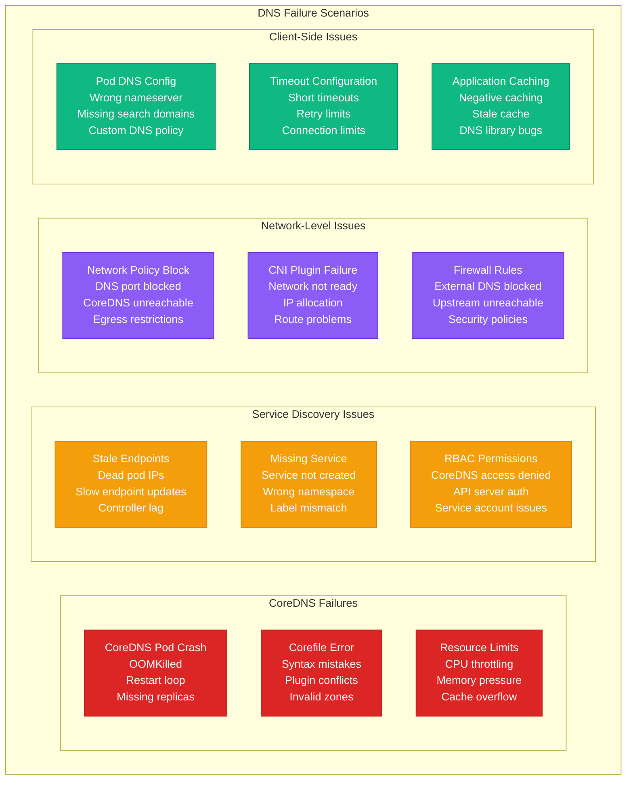
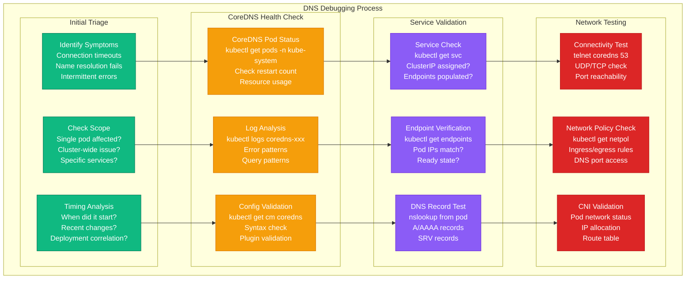

# Kubernetes DNS Resolution Debugging

## Overview

Kubernetes DNS resolution issues affect 15-20% of cluster incidents, causing service discovery failures, pod-to-pod communication breakdowns, and application timeouts. This guide provides systematic troubleshooting for CoreDNS, service discovery, and network policy issues that manifest during production outages.

## DNS Resolution Flow Diagram

```mermaid
graph TB
    subgraph DNSResolutionFlow[Kubernetes DNS Resolution Flow]
        subgraph PodDNSConfig[Pod DNS Configuration]
            POD[Pod Application<br/>DNS Query<br/>service.namespace.svc.cluster.local]
            RESOLV_CONF[/etc/resolv.conf<br/>nameserver 10.96.0.10<br/>search default.svc.cluster.local]
            DNSCONFIG[Pod.spec.dnsConfig<br/>DNS options<br/>Custom nameservers]
        end

        subgraph CoreDNSLayer[CoreDNS Layer]
            COREDNS[CoreDNS Pod<br/>DNS server<br/>10.96.0.10<br/>Port 53]
            COREFILE[Corefile Config<br/>Zone configuration<br/>Plugin chain<br/>Forward rules]
            CACHE[DNS Cache<br/>30-second TTL<br/>Success/failure cache<br/>Memory storage]
        end

        subgraph ServiceDiscovery[Service Discovery]
            KUBE_API[Kubernetes API<br/>Service/Endpoint watch<br/>Real-time updates<br/>RBAC permissions]
            SERVICE_RECORD[Service DNS Record<br/>A record: ClusterIP<br/>SRV record: Port info<br/>AAAA record: IPv6]
            ENDPOINT_RECORD[Endpoint Records<br/>Pod IP addresses<br/>Health status<br/>Ready state]
        end

        subgraph NetworkPolicy[Network Policy]
            INGRESS_RULES[Ingress Rules<br/>Allow DNS queries<br/>Port 53 TCP/UDP<br/>CoreDNS access]
            EGRESS_RULES[Egress Rules<br/>External DNS<br/>Upstream resolvers<br/>Internet access]
            CNI_PLUGIN[CNI Plugin<br/>Network implementation<br/>Policy enforcement<br/>Traffic filtering]
        end
    end

    POD --> RESOLV_CONF
    RESOLV_CONF --> DNSCONFIG
    DNSCONFIG --> COREDNS

    COREDNS --> COREFILE
    COREFILE --> CACHE
    CACHE --> KUBE_API

    KUBE_API --> SERVICE_RECORD
    SERVICE_RECORD --> ENDPOINT_RECORD

    ENDPOINT_RECORD --> INGRESS_RULES
    INGRESS_RULES --> EGRESS_RULES
    EGRESS_RULES --> CNI_PLUGIN

    classDef podStyle fill:#10B981,stroke:#047857,color:#fff
    classDef dnsStyle fill:#F59E0B,stroke:#D97706,color:#fff
    classDef discoveryStyle fill:#8B5CF6,stroke:#6D28D9,color:#fff
    classDef networkStyle fill:#DC2626,stroke:#B91C1C,color:#fff

    class POD,RESOLV_CONF,DNSCONFIG podStyle
    class COREDNS,COREFILE,CACHE dnsStyle
    class KUBE_API,SERVICE_RECORD,ENDPOINT_RECORD discoveryStyle
    class INGRESS_RULES,EGRESS_RULES,CNI_PLUGIN networkStyle
```

## Common DNS Failure Scenarios



## Systematic Debugging Process



## 3 AM Debugging Commands

### Immediate Assessment
```bash
# Check CoreDNS pod health
kubectl get pods -n kube-system -l k8s-app=kube-dns
kubectl describe pods -n kube-system -l k8s-app=kube-dns

# Check CoreDNS logs for errors
kubectl logs -n kube-system -l k8s-app=kube-dns --tail=100

# Verify kube-dns service
kubectl get svc -n kube-system kube-dns
kubectl describe svc -n kube-system kube-dns

# Check CoreDNS configuration
kubectl get configmap -n kube-system coredns -o yaml
```

### DNS Resolution Testing
```bash
# Test DNS from a pod
kubectl run dns-test --image=busybox:1.28 --rm -it --restart=Never -- nslookup kubernetes.default

# Test specific service resolution
kubectl run dns-test --image=busybox:1.28 --rm -it --restart=Never -- nslookup my-service.my-namespace.svc.cluster.local

# Check pod's DNS configuration
kubectl exec -it <pod-name> -- cat /etc/resolv.conf

# Test external DNS resolution
kubectl run dns-test --image=busybox:1.28 --rm -it --restart=Never -- nslookup google.com
```

### Service and Endpoint Validation
```bash
# Check service exists and has ClusterIP
kubectl get svc <service-name> -o wide

# Verify endpoints are populated
kubectl get endpoints <service-name>
kubectl describe endpoints <service-name>

# Check if pods are ready and have correct labels
kubectl get pods -l app=<app-label> --show-labels
kubectl get pods -l app=<app-label> -o wide
```

### Network Connectivity Testing
```bash
# Test CoreDNS connectivity from pod
kubectl exec -it <pod-name> -- telnet 10.96.0.10 53

# Check if DNS queries reach CoreDNS
kubectl exec -it <pod-name> -- dig @10.96.0.10 kubernetes.default.svc.cluster.local

# Test UDP DNS resolution
kubectl exec -it <pod-name> -- dig +short kubernetes.default.svc.cluster.local

# Check network policies affecting DNS
kubectl get networkpolicies --all-namespaces
kubectl describe networkpolicy <policy-name>
```

## Common Issues and Solutions

### Issue 1: CoreDNS Pod CrashLoopBackOff

**Symptoms:**
- DNS resolution completely fails
- CoreDNS pods in CrashLoopBackOff state
- High restart count on CoreDNS pods

**Root Cause Analysis:**
```bash
# Check CoreDNS pod status
kubectl get pods -n kube-system -l k8s-app=kube-dns

# Check why pod is failing
kubectl describe pod -n kube-system <coredns-pod-name>

# Check resource usage
kubectl top pod -n kube-system <coredns-pod-name>

# Review CoreDNS logs
kubectl logs -n kube-system <coredns-pod-name> --previous
```

**Common Causes:**
- Memory limits too low (< 170Mi)
- Invalid Corefile configuration
- Missing RBAC permissions
- Node resource exhaustion

**Solution:**
```yaml
# Increase CoreDNS memory limits
apiVersion: apps/v1
kind: Deployment
metadata:
  name: coredns
  namespace: kube-system
spec:
  template:
    spec:
      containers:
      - name: coredns
        resources:
          limits:
            memory: 512Mi  # Increase from 170Mi
          requests:
            memory: 256Mi
```

### Issue 2: Intermittent DNS Failures

**Symptoms:**
- DNS works sometimes, fails other times
- Random timeouts during resolution
- Some pods affected, others working

**Root Cause Analysis:**
```bash
# Check CoreDNS resource utilization
kubectl top pod -n kube-system -l k8s-app=kube-dns

# Monitor DNS query rate
kubectl logs -n kube-system -l k8s-app=kube-dns | grep -E "query|error"

# Check for network policy conflicts
kubectl get networkpolicies --all-namespaces -o yaml | grep -A 10 -B 10 "port: 53"
```

**Common Causes:**
- CoreDNS CPU throttling
- Network policy blocking DNS traffic
- Pod anti-affinity causing uneven distribution
- Upstream DNS server issues

**Solution:**
```yaml
# Ensure proper resource allocation
resources:
  limits:
    cpu: 1000m
    memory: 512Mi
  requests:
    cpu: 100m
    memory: 128Mi

# Add network policy for DNS
apiVersion: networking.k8s.io/v1
kind: NetworkPolicy
metadata:
  name: allow-dns
spec:
  podSelector: {}
  egress:
  - to:
    - namespaceSelector:
        matchLabels:
          name: kube-system
    ports:
    - protocol: UDP
      port: 53
    - protocol: TCP
      port: 53
```

### Issue 3: External DNS Resolution Failing

**Symptoms:**
- Internal cluster DNS works
- External domains (google.com) fail
- Applications can't reach external APIs

**Root Cause Analysis:**
```bash
# Test external DNS from CoreDNS pod
kubectl exec -n kube-system <coredns-pod> -- dig google.com

# Check CoreDNS forward configuration
kubectl get configmap -n kube-system coredns -o yaml

# Test network connectivity to upstream DNS
kubectl exec -n kube-system <coredns-pod> -- telnet 8.8.8.8 53
```

**Common Causes:**
- Upstream DNS servers unreachable
- Firewall blocking external DNS
- Incorrect forward configuration
- Corporate proxy requirements

**Solution:**
```yaml
# Update CoreDNS Corefile
apiVersion: v1
kind: ConfigMap
metadata:
  name: coredns
  namespace: kube-system
data:
  Corefile: |
    .:53 {
        errors
        health {
           lameduck 5s
        }
        ready
        kubernetes cluster.local in-addr.arpa ip6.arpa {
           pods insecure
           fallthrough in-addr.arpa ip6.arpa
           ttl 30
        }
        prometheus :9153
        forward . 8.8.8.8 8.8.4.4 {  # Add reliable upstream DNS
           max_concurrent 1000
        }
        cache 30
        loop
        reload
        loadbalance
    }
```

### Issue 4: Service Discovery Not Working

**Symptoms:**
- Services can't find each other
- DNS resolution returns NXDOMAIN
- New services not discoverable

**Root Cause Analysis:**
```bash
# Check if service exists
kubectl get svc <service-name> -n <namespace>

# Verify endpoints are created
kubectl get endpoints <service-name> -n <namespace>

# Check pod labels match service selector
kubectl get pods -n <namespace> --show-labels
kubectl describe svc <service-name> -n <namespace>

# Test DNS from different namespaces
kubectl run test --image=busybox:1.28 --rm -it -- nslookup <service>.<namespace>.svc.cluster.local
```

**Common Causes:**
- Service selector doesn't match pod labels
- No ready pods backing the service
- Endpoint controller not running
- Service created in wrong namespace

**Solution:**
```bash
# Fix label mismatch
kubectl label pod <pod-name> app=<correct-label>

# Ensure pod is ready
kubectl get pods -o wide
kubectl describe pod <pod-name>

# Recreate service if needed
kubectl delete svc <service-name>
kubectl expose deployment <deployment-name> --port=80
```

## Monitoring and Prevention

### CoreDNS Monitoring
```yaml
# Prometheus monitoring rules
groups:
- name: coredns
  rules:
  - alert: CoreDNSDown
    expr: up{job="coredns"} == 0
    for: 1m
    labels:
      severity: critical
    annotations:
      summary: "CoreDNS is down"

  - alert: CoreDNSHighErrorRate
    expr: rate(coredns_dns_responses_total{rcode="SERVFAIL"}[5m]) > 0.1
    for: 5m
    labels:
      severity: warning
    annotations:
      summary: "CoreDNS high error rate"

  - alert: CoreDNSHighLatency
    expr: histogram_quantile(0.99, rate(coredns_dns_request_duration_seconds_bucket[5m])) > 0.1
    for: 5m
    labels:
      severity: warning
    annotations:
      summary: "CoreDNS high latency"
```

### Health Check Script
```bash
#!/bin/bash
# DNS health check script

check_coredns_health() {
    echo "=== Checking CoreDNS Health ==="

    # Check pod status
    COREDNS_PODS=$(kubectl get pods -n kube-system -l k8s-app=kube-dns --no-headers)
    echo "CoreDNS Pods:"
    echo "$COREDNS_PODS"

    # Check if any pods are not ready
    NOT_READY=$(echo "$COREDNS_PODS" | grep -v "1/1.*Running" | wc -l)
    if [ $NOT_READY -gt 0 ]; then
        echo "WARNING: $NOT_READY CoreDNS pods not ready"
        return 1
    fi

    # Test DNS resolution
    echo "Testing DNS resolution..."
    if kubectl run dns-test --image=busybox:1.28 --rm -it --restart=Never -- nslookup kubernetes.default > /dev/null 2>&1; then
        echo "DNS resolution: OK"
    else
        echo "ERROR: DNS resolution failed"
        return 1
    fi

    echo "CoreDNS health check: PASSED"
    return 0
}

# Run health check
check_coredns_health
```

## Best Practices for DNS Reliability

### 1. Proper Resource Allocation
```yaml
# Recommended CoreDNS resources
resources:
  limits:
    cpu: 1000m
    memory: 512Mi
  requests:
    cpu: 100m
    memory: 128Mi
```

### 2. High Availability Setup
```yaml
# Ensure multiple CoreDNS replicas
replicas: 3

# Pod anti-affinity for distribution
affinity:
  podAntiAffinity:
    preferredDuringSchedulingIgnoredDuringExecution:
    - weight: 100
      podAffinityTerm:
        labelSelector:
          matchExpressions:
          - key: k8s-app
            operator: In
            values:
            - kube-dns
        topologyKey: kubernetes.io/hostname
```

### 3. Monitoring and Alerting
- Monitor CoreDNS pod health and restarts
- Track DNS query rates and error rates
- Alert on DNS resolution failures
- Monitor resource utilization

### 4. Network Policy Considerations
- Always allow DNS traffic (port 53 UDP/TCP)
- Consider egress policies for external DNS
- Test policies in staging before production
- Document DNS-related network policies

## Quick Reference Commands

```bash
# Emergency DNS debugging commands
kubectl get pods -n kube-system -l k8s-app=kube-dns
kubectl logs -n kube-system -l k8s-app=kube-dns --tail=50
kubectl get svc -n kube-system kube-dns
kubectl run dns-test --image=busybox:1.28 --rm -it --restart=Never -- nslookup kubernetes.default

# Check specific service
kubectl get svc <service> && kubectl get endpoints <service>

# Test from specific pod
kubectl exec -it <pod> -- nslookup <service>.<namespace>.svc.cluster.local

# Network connectivity test
kubectl exec -it <pod> -- telnet 10.96.0.10 53
```

*This debugging guide is based on real production incidents and should be kept accessible during outages for quick reference.*