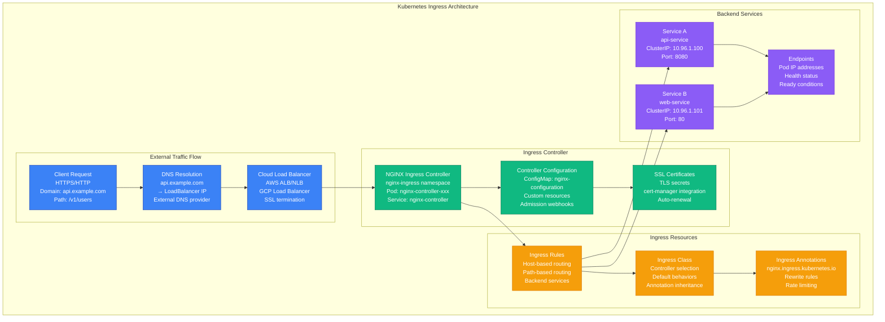
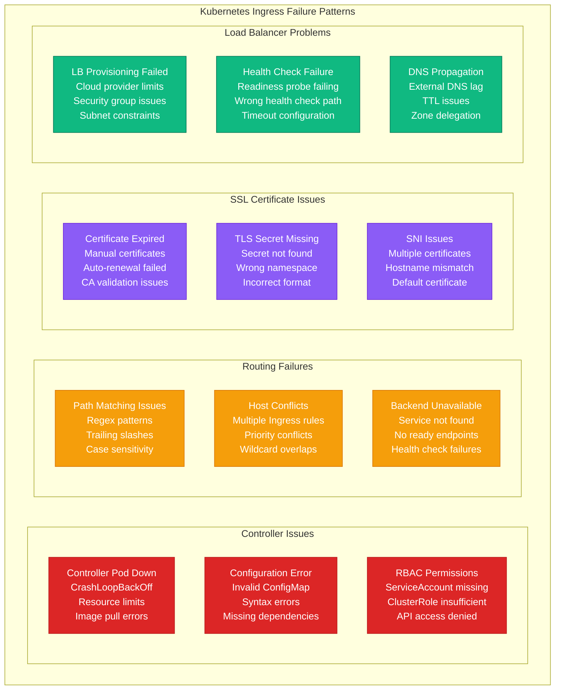
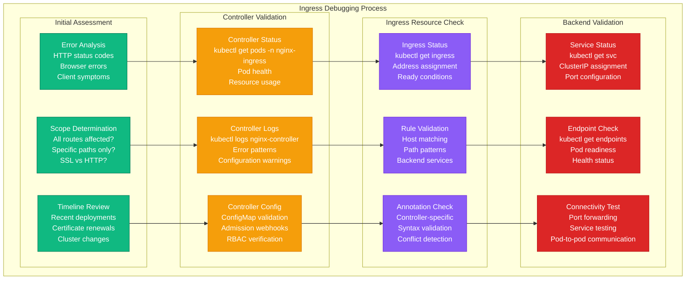

# Kubernetes Ingress Debugging

## Overview

Kubernetes Ingress failures prevent external traffic from reaching applications, causing service unavailability and routing errors. These issues affect 30% of Kubernetes networking incidents, manifesting as 404 errors, SSL termination failures, and backend connection problems. This guide provides systematic troubleshooting for Ingress controllers, routing rules, and certificate management.

## Kubernetes Ingress Architecture



## Common Ingress Failure Patterns



## Systematic Debugging Process



## 3 AM Debugging Commands

### Ingress Controller Health Check
```bash
# Check Ingress Controller pod status
kubectl get pods -n ingress-nginx
kubectl describe pod -n ingress-nginx nginx-controller-xxx

# Check controller logs
kubectl logs -n ingress-nginx nginx-controller-xxx --tail=100
kubectl logs -n ingress-nginx nginx-controller-xxx --previous

# Check controller configuration
kubectl get configmap -n ingress-nginx nginx-configuration -o yaml

# Check controller service
kubectl get svc -n ingress-nginx
kubectl describe svc -n ingress-nginx nginx-controller
```

### Ingress Resource Validation
```bash
# List all ingress resources
kubectl get ingress --all-namespaces
kubectl get ingress -o wide

# Check specific ingress details
kubectl describe ingress api-ingress
kubectl get ingress api-ingress -o yaml

# Check ingress class
kubectl get ingressclass
kubectl describe ingressclass nginx

# Validate ingress rules
kubectl explain ingress.spec.rules
```

### Backend Service Testing
```bash
# Check service and endpoints
kubectl get svc api-service
kubectl get endpoints api-service
kubectl describe svc api-service

# Check pods backing the service
kubectl get pods -l app=api-service
kubectl describe pod api-service-xxx

# Test service connectivity
kubectl port-forward svc/api-service 8080:80
curl http://localhost:8080/health

# Test from within cluster
kubectl run test-pod --image=busybox:1.28 --rm -it --restart=Never -- wget -qO- http://api-service.default.svc.cluster.local/health
```

### SSL Certificate Debugging
```bash
# Check TLS secrets
kubectl get secrets
kubectl describe secret api-tls-secret

# Check certificate details
kubectl get secret api-tls-secret -o jsonpath='{.data.tls\.crt}' | base64 -d | openssl x509 -text -noout

# Check cert-manager if used
kubectl get certificates
kubectl describe certificate api-cert
kubectl get certificaterequests
kubectl get challenges

# Test SSL connectivity
openssl s_client -connect api.example.com:443 -servername api.example.com
```

### Load Balancer and External Access
```bash
# Check load balancer service
kubectl get svc -n ingress-nginx nginx-controller
kubectl describe svc -n ingress-nginx nginx-controller

# Check external IP assignment (cloud providers)
kubectl get svc -n ingress-nginx nginx-controller -o jsonpath='{.status.loadBalancer.ingress[0].ip}'

# Test external connectivity
curl -v https://api.example.com/health
dig api.example.com

# Check DNS resolution
nslookup api.example.com
host api.example.com
```

## Common Issues and Solutions

### Issue 1: Ingress Controller Not Responding

**Symptoms:**
- HTTP 503 Service Unavailable
- Connection timeouts to external endpoints
- Controller pod in CrashLoopBackOff

**Debugging Steps:**
```bash
# Check controller pod status
kubectl get pods -n ingress-nginx
kubectl describe pod -n ingress-nginx nginx-controller-xxx

# Check recent events
kubectl get events -n ingress-nginx --sort-by='.lastTimestamp'

# Check resource limits
kubectl top pod -n ingress-nginx
kubectl describe pod -n ingress-nginx nginx-controller-xxx | grep -A 5 "Limits\|Requests"

# Check controller logs for errors
kubectl logs -n ingress-nginx nginx-controller-xxx | grep -i error
```

**Common Causes:**
- Insufficient memory/CPU resources
- Configuration errors in ConfigMap
- RBAC permissions missing
- Image pull failures

**Solution:**
```yaml
# Increase controller resources
spec:
  template:
    spec:
      containers:
      - name: controller
        resources:
          limits:
            cpu: 1000m
            memory: 1Gi
          requests:
            cpu: 500m
            memory: 512Mi

# Fix RBAC if needed
apiVersion: rbac.authorization.k8s.io/v1
kind: ClusterRole
metadata:
  name: nginx-ingress-controller
rules:
- apiGroups: [""]
  resources: ["configmaps", "endpoints", "nodes", "pods", "secrets", "services"]
  verbs: ["get", "list", "watch"]
- apiGroups: ["extensions", "networking.k8s.io"]
  resources: ["ingresses"]
  verbs: ["get", "list", "watch"]
```

### Issue 2: 404 Not Found Errors

**Symptoms:**
- HTTP 404 for valid endpoints
- Some paths work, others don't
- Default backend page shown

**Debugging Steps:**
```bash
# Check ingress rules
kubectl get ingress api-ingress -o yaml
kubectl describe ingress api-ingress

# Verify path matching
kubectl get ingress api-ingress -o jsonpath='{.spec.rules[*].http.paths[*].path}'

# Check if service exists
kubectl get svc api-service
kubectl describe svc api-service

# Test service directly
kubectl port-forward svc/api-service 8080:80
curl http://localhost:8080/v1/users

# Check controller's view of configuration
kubectl exec -n ingress-nginx nginx-controller-xxx -- cat /etc/nginx/nginx.conf | grep -A 10 "api.example.com"
```

**Common Causes:**
- Incorrect path patterns
- Service name mismatch
- Wrong namespace reference
- Path rewriting issues

**Solution:**
```yaml
apiVersion: networking.k8s.io/v1
kind: Ingress
metadata:
  name: api-ingress
  annotations:
    nginx.ingress.kubernetes.io/rewrite-target: /$1
spec:
  rules:
  - host: api.example.com
    http:
      paths:
      - path: /v1/(.*)  # Capture group for rewriting
        pathType: Prefix
        backend:
          service:
            name: api-service
            port:
              number: 80
```

### Issue 3: SSL Certificate Issues

**Symptoms:**
- Certificate warnings in browser
- SSL handshake failures
- "Your connection is not private" errors

**Debugging Steps:**
```bash
# Check TLS secret exists and is valid
kubectl get secret api-tls-secret
kubectl describe secret api-tls-secret

# Verify certificate content
kubectl get secret api-tls-secret -o jsonpath='{.data.tls\.crt}' | base64 -d | openssl x509 -text -noout | grep -E "Subject:|DNS:|Not After"

# Check if cert-manager is managing the certificate
kubectl get certificate api-cert
kubectl describe certificate api-cert

# Check certificate request status
kubectl get certificaterequest
kubectl describe certificaterequest api-cert-xxx

# Test SSL connection
echo | openssl s_client -connect api.example.com:443 -servername api.example.com 2>/dev/null | openssl x509 -noout -dates
```

**Common Causes:**
- Certificate expired
- Wrong certificate for hostname
- TLS secret in wrong namespace
- cert-manager configuration issues

**Solution:**
```yaml
# Manual certificate secret
apiVersion: v1
kind: Secret
metadata:
  name: api-tls-secret
  namespace: default
type: kubernetes.io/tls
data:
  tls.crt: LS0tLS1CRUdJTi... # base64 encoded certificate
  tls.key: LS0tLS1CRUdJTi... # base64 encoded private key

---
# cert-manager certificate
apiVersion: cert-manager.io/v1
kind: Certificate
metadata:
  name: api-cert
spec:
  secretName: api-tls-secret
  dnsNames:
  - api.example.com
  issuerRef:
    name: letsencrypt-prod
    kind: ClusterIssuer
```

### Issue 4: Backend Connection Failures

**Symptoms:**
- HTTP 502 Bad Gateway
- HTTP 503 Service Unavailable
- Intermittent connectivity issues

**Debugging Steps:**
```bash
# Check if pods are ready
kubectl get pods -l app=api-service
kubectl describe pod api-service-xxx

# Check service endpoints
kubectl get endpoints api-service
kubectl describe endpoints api-service

# Check pod health
kubectl get pods -l app=api-service -o wide
kubectl logs api-service-xxx

# Test pod connectivity directly
kubectl exec -it api-service-xxx -- curl http://localhost:8080/health

# Check if service is responding
kubectl port-forward pod/api-service-xxx 8080:8080
curl http://localhost:8080/health
```

**Common Causes:**
- No ready pods behind service
- Application not listening on correct port
- Health check failures
- Network policies blocking traffic

**Solution:**
```bash
# Scale deployment if no pods
kubectl scale deployment api-service --replicas=3

# Fix health check configuration
kubectl patch deployment api-service -p '{"spec":{"template":{"spec":{"containers":[{"name":"api-service","readinessProbe":{"httpGet":{"path":"/health","port":8080},"initialDelaySeconds":30,"periodSeconds":10}}]}}}}'

# Check and fix service port mapping
kubectl patch svc api-service -p '{"spec":{"ports":[{"port":80,"targetPort":8080}]}}'
```

## Monitoring and Prevention

### Ingress Health Monitoring Script
```bash
#!/bin/bash
# ingress-health-check.sh

NAMESPACE="default"
INGRESS_NAME="api-ingress"

echo "=== Ingress Health Check ==="

# Check ingress status
echo "1. Checking Ingress status..."
kubectl get ingress $INGRESS_NAME -n $NAMESPACE

# Check ingress controller
echo "2. Checking Ingress Controller..."
kubectl get pods -n ingress-nginx -l app.kubernetes.io/name=ingress-nginx

# Check backend services
echo "3. Checking backend services..."
SERVICES=$(kubectl get ingress $INGRESS_NAME -n $NAMESPACE -o jsonpath='{.spec.rules[*].http.paths[*].backend.service.name}')

for service in $SERVICES; do
    echo "Checking service: $service"
    kubectl get svc $service -n $NAMESPACE
    kubectl get endpoints $service -n $NAMESPACE
done

# Test external connectivity
echo "4. Testing external connectivity..."
HOSTS=$(kubectl get ingress $INGRESS_NAME -n $NAMESPACE -o jsonpath='{.spec.rules[*].host}')

for host in $HOSTS; do
    echo "Testing $host..."
    if curl -s -o /dev/null -w "%{http_code}" "https://$host/health" | grep -q "200"; then
        echo "✅ $host is responding"
    else
        echo "❌ $host is not responding"
    fi
done

echo "=== Health Check Complete ==="
```

### Automated Ingress Monitoring
```python
#!/usr/bin/env python3
# ingress-monitor.py

import subprocess
import json
import time
from datetime import datetime

def check_ingress_health():
    """Monitor Kubernetes Ingress health"""

    try:
        # Get all ingress resources
        result = subprocess.run([
            'kubectl', 'get', 'ingress', '--all-namespaces', '-o', 'json'
        ], capture_output=True, text=True, check=True)

        ingresses = json.loads(result.stdout)

        health_report = {
            'timestamp': datetime.now().isoformat(),
            'total_ingresses': len(ingresses['items']),
            'healthy_ingresses': 0,
            'issues': []
        }

        for ingress in ingresses['items']:
            namespace = ingress['metadata']['namespace']
            name = ingress['metadata']['name']

            # Check if ingress has address assigned
            status = ingress.get('status', {})
            load_balancer = status.get('loadBalancer', {})
            ingress_ips = load_balancer.get('ingress', [])

            if not ingress_ips:
                health_report['issues'].append(f"No IP assigned to {namespace}/{name}")
                continue

            # Check backend services
            rules = ingress.get('spec', {}).get('rules', [])
            for rule in rules:
                host = rule.get('host', 'default')
                paths = rule.get('http', {}).get('paths', [])

                for path in paths:
                    backend = path.get('backend', {})
                    service = backend.get('service', {})
                    service_name = service.get('name')

                    if service_name:
                        # Check if service exists and has endpoints
                        try:
                            svc_result = subprocess.run([
                                'kubectl', 'get', 'endpoints', service_name,
                                '-n', namespace, '-o', 'json'
                            ], capture_output=True, text=True, check=True)

                            endpoints = json.loads(svc_result.stdout)
                            subsets = endpoints.get('subsets', [])

                            if not subsets or not any(subset.get('addresses') for subset in subsets):
                                health_report['issues'].append(
                                    f"No ready endpoints for {namespace}/{service_name} (used by {namespace}/{name})"
                                )
                            else:
                                health_report['healthy_ingresses'] += 1

                        except subprocess.CalledProcessError:
                            health_report['issues'].append(f"Service {namespace}/{service_name} not found")

        return health_report

    except subprocess.CalledProcessError as e:
        return {'error': f"kubectl command failed: {e}"}

def send_alerts(health_report):
    """Send alerts if issues detected"""
    if health_report.get('issues'):
        message = f"🚨 Ingress Health Alert:\n"
        message += f"Healthy: {health_report['healthy_ingresses']}/{health_report['total_ingresses']}\n"
        message += f"Issues:\n" + "\n".join(f"- {issue}" for issue in health_report['issues'])

        print(message)
        # implement_slack_notification(message)

if __name__ == "__main__":
    health_report = check_ingress_health()
    send_alerts(health_report)
    print(json.dumps(health_report, indent=2))
```

### Prometheus Monitoring Rules
```yaml
# Prometheus rules for Ingress monitoring
groups:
- name: ingress_alerts
  rules:
  - alert: IngressControllerDown
    expr: up{job="nginx-ingress-controller"} == 0
    for: 1m
    labels:
      severity: critical
    annotations:
      summary: "Ingress controller is down"

  - alert: IngressHighErrorRate
    expr: rate(nginx_ingress_controller_requests_total{status=~"5.."}[5m]) > 0.1
    for: 5m
    labels:
      severity: warning
    annotations:
      summary: "High error rate on ingress controller"

  - alert: IngressCertificateExpiring
    expr: (nginx_ingress_controller_ssl_expire_time_seconds - time()) / 86400 < 30
    for: 1h
    labels:
      severity: warning
    annotations:
      summary: "SSL certificate expiring in {{ $value }} days"
```

## Best Practices

### 1. Ingress Resource Configuration
```yaml
apiVersion: networking.k8s.io/v1
kind: Ingress
metadata:
  name: production-ingress
  annotations:
    kubernetes.io/ingress.class: nginx
    nginx.ingress.kubernetes.io/ssl-redirect: "true"
    nginx.ingress.kubernetes.io/use-regex: "true"
    nginx.ingress.kubernetes.io/rate-limit: "100"
    nginx.ingress.kubernetes.io/rate-limit-window: "1m"
    cert-manager.io/cluster-issuer: "letsencrypt-prod"
spec:
  tls:
  - hosts:
    - api.example.com
    secretName: api-tls-secret
  rules:
  - host: api.example.com
    http:
      paths:
      - path: /v1/(.*)
        pathType: Prefix
        backend:
          service:
            name: api-service
            port:
              number: 80
      - path: /health
        pathType: Exact
        backend:
          service:
            name: health-service
            port:
              number: 8080
```

### 2. Controller Resource Management
```yaml
# NGINX Ingress Controller with proper resources
spec:
  template:
    spec:
      containers:
      - name: controller
        resources:
          limits:
            cpu: 2000m
            memory: 2Gi
          requests:
            cpu: 500m
            memory: 512Mi
        livenessProbe:
          httpGet:
            path: /healthz
            port: 10254
          initialDelaySeconds: 10
          periodSeconds: 10
        readinessProbe:
          httpGet:
            path: /healthz
            port: 10254
          initialDelaySeconds: 10
          periodSeconds: 10
```

### 3. Security Best Practices
```yaml
# Security annotations
annotations:
  nginx.ingress.kubernetes.io/ssl-redirect: "true"
  nginx.ingress.kubernetes.io/force-ssl-redirect: "true"
  nginx.ingress.kubernetes.io/auth-tls-verify-client: "on"
  nginx.ingress.kubernetes.io/auth-tls-secret: "default/ca-secret"
  nginx.ingress.kubernetes.io/whitelist-source-range: "10.0.0.0/8,172.16.0.0/12"
  nginx.ingress.kubernetes.io/rate-limit: "10"
  nginx.ingress.kubernetes.io/rate-limit-window: "1m"
```

## Quick Reference

### Essential Commands
```bash
# Check ingress status
kubectl get ingress --all-namespaces

# Describe specific ingress
kubectl describe ingress api-ingress

# Check controller logs
kubectl logs -n ingress-nginx -l app.kubernetes.io/name=ingress-nginx

# Test service connectivity
kubectl port-forward svc/api-service 8080:80

# Check SSL certificates
kubectl get secrets | grep tls
```

### Emergency Checklist
1. ✅ Check ingress controller pod status
2. ✅ Verify ingress resource configuration
3. ✅ Test backend service connectivity
4. ✅ Validate SSL certificates
5. ✅ Check load balancer external IP
6. ✅ Test DNS resolution
7. ✅ Review controller logs for errors

*Keep this guide accessible for quick Kubernetes Ingress troubleshooting during traffic routing failures.*