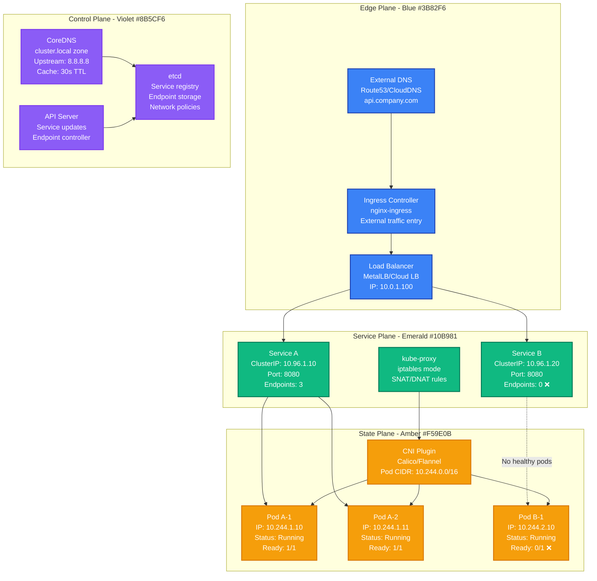
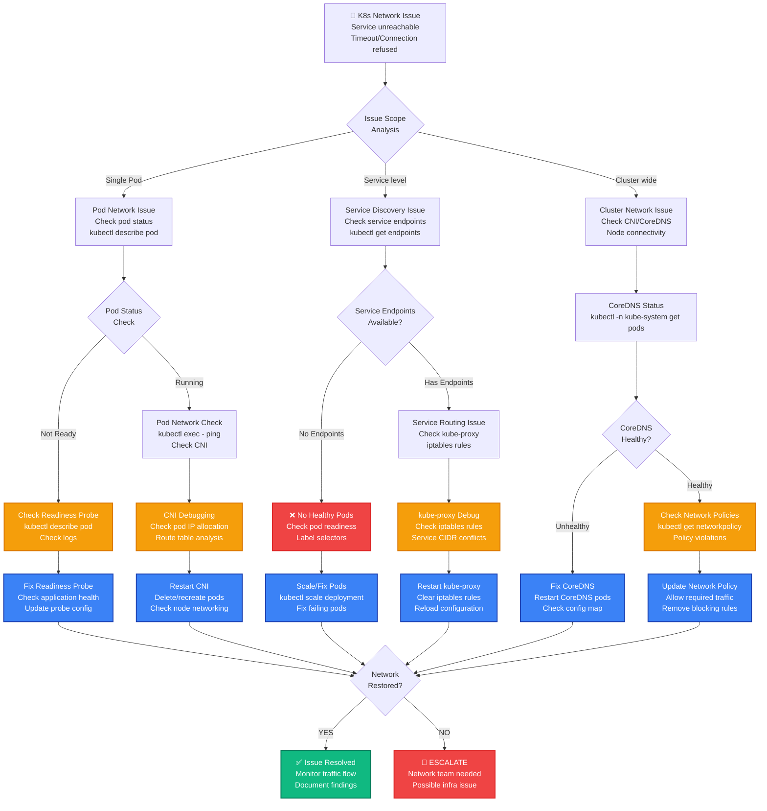

# Kubernetes Networking Production Debugging

## Emergency Response Overview

**Incident Severity**: P1 - Service-to-service communication failure
**MTTR Target**: < 3 minutes for traffic restoration, < 15 minutes for root cause resolution
**Primary Tools**: `kubectl`, `dig`, `nslookup`, `tcpdump`, `netstat`, `crictl`, `calicoctl`



## 3 AM Debugging Flowchart



## Critical Commands & Immediate Actions

### Pod Connectivity Diagnosis (< 1 minute)

```bash
# 1. QUICK POD STATUS CHECK
kubectl get pods -o wide                        # Pod IPs and nodes
kubectl get pods --field-selector=status.phase!=Running  # Non-running pods

# 2. SERVICE ENDPOINTS CHECK
kubectl get svc                                 # Service overview
kubectl get endpoints                           # Service endpoints
kubectl describe svc <service-name>             # Service details

# 3. POD NETWORK TEST
POD_NAME=$(kubectl get pods -l app=frontend -o jsonpath='{.items[0].metadata.name}')
kubectl exec $POD_NAME -- ping -c 3 google.com  # External connectivity
kubectl exec $POD_NAME -- nslookup kubernetes.default.svc.cluster.local  # DNS test

# 4. INTER-POD CONNECTIVITY
BACKEND_IP=$(kubectl get pod -l app=backend -o jsonpath='{.items[0].status.podIP}')
kubectl exec $POD_NAME -- curl -m 5 http://$BACKEND_IP:8080/health
```

### CoreDNS Debugging (< 2 minutes)

```bash
# 1. COREDNS STATUS
kubectl -n kube-system get pods -l k8s-app=kube-dns
kubectl -n kube-system logs -l k8s-app=kube-dns --tail=50

# 2. DNS RESOLUTION TEST
kubectl run dns-test --image=busybox:1.28 --rm -it --restart=Never -- nslookup kubernetes.default

# 3. COREDNS CONFIGURATION
kubectl -n kube-system get configmap coredns -o yaml

# 4. DNS FROM INSIDE POD
kubectl exec $POD_NAME -- nslookup <service-name>.<namespace>.svc.cluster.local
kubectl exec $POD_NAME -- cat /etc/resolv.conf
```

### CNI Network Debugging (< 3 minutes)

```bash
# 1. NODE NETWORK STATUS
kubectl get nodes -o wide                       # Node IPs and status
kubectl describe node <node-name> | grep -A 10 "Addresses:"

# 2. CALICO DEBUGGING (if using Calico)
calicoctl node status                           # Calico node status
calicoctl get ippool -o wide                    # IP pool allocation
calicoctl get workloadendpoint                  # Pod network endpoints

# 3. POD NETWORK DETAILS
kubectl describe pod $POD_NAME | grep -A 5 "IP:"
ip route                                        # Node routing table
iptables -t nat -L                             # NAT rules (requires node access)

# 4. FLANNEL DEBUGGING (if using Flannel)
kubectl -n kube-system get pods -l app=flannel
kubectl -n kube-system logs -l app=flannel --tail=50
```

### Netflix Production K8s Debugging Commands

```bash
# NETFLIX'S RAPID K8S NETWORK DIAGNOSIS
#!/bin/bash
NAMESPACE=${1:-default}
APP_LABEL=${2:-app}

echo "=== NETFLIX K8S NETWORK DIAGNOSIS ==="
echo "Namespace: $NAMESPACE"
echo "App Label: $APP_LABEL"
echo "Time: $(date)"

# 1. Service and endpoint health
echo "=== SERVICE HEALTH ==="
kubectl -n $NAMESPACE get svc -o custom-columns="NAME:.metadata.name,TYPE:.spec.type,CLUSTER-IP:.spec.clusterIP,PORTS:.spec.ports[*].port"
echo ""
kubectl -n $NAMESPACE get endpoints -o custom-columns="NAME:.metadata.name,ENDPOINTS:.subsets[*].addresses[*].ip"

# 2. Pod readiness analysis
echo "=== POD READINESS ==="
kubectl -n $NAMESPACE get pods -l $APP_LABEL -o custom-columns="NAME:.metadata.name,READY:.status.containerStatuses[*].ready,STATUS:.status.phase,IP:.status.podIP,NODE:.spec.nodeName"

# 3. DNS functionality test
echo "=== DNS TEST ==="
TEST_POD=$(kubectl -n $NAMESPACE get pods -l $APP_LABEL -o jsonpath='{.items[0].metadata.name}' 2>/dev/null)
if [ ! -z "$TEST_POD" ]; then
    echo "Testing DNS from pod: $TEST_POD"
    kubectl -n $NAMESPACE exec $TEST_POD -- nslookup kubernetes.default.svc.cluster.local 2>/dev/null || echo "DNS test failed"
else
    echo "No pods available for DNS testing"
fi

# 4. Network policy check
echo "=== NETWORK POLICIES ==="
kubectl -n $NAMESPACE get networkpolicy
if [ $? -eq 0 ]; then
    kubectl -n $NAMESPACE describe networkpolicy
fi
```

### Uber Production K8s Debugging Commands

```bash
# UBER'S COMPREHENSIVE NETWORK DEBUG
#!/bin/bash

echo "=== UBER K8S NETWORK COMPREHENSIVE DEBUG ==="

# 1. Cluster-wide network status
echo "=== CLUSTER NETWORK STATUS ==="
kubectl cluster-info
kubectl get nodes -o wide
kubectl -n kube-system get pods -l component=kube-proxy

# 2. CoreDNS deep analysis
echo "=== COREDNS ANALYSIS ==="
kubectl -n kube-system get pods -l k8s-app=kube-dns -o wide
kubectl -n kube-system top pods -l k8s-app=kube-dns
kubectl -n kube-system logs -l k8s-app=kube-dns --tail=20

# 3. CNI plugin status
echo "=== CNI STATUS ==="
kubectl -n kube-system get ds                   # DaemonSets (CNI usually deployed as DS)
kubectl -n kube-system get pods -l name=calico-node 2>/dev/null || \
kubectl -n kube-system get pods -l app=flannel 2>/dev/null || \
echo "Unknown CNI plugin"

# 4. Service mesh status (if applicable)
echo "=== SERVICE MESH STATUS ==="
kubectl -n istio-system get pods 2>/dev/null || echo "No Istio detected"
kubectl get pods -A | grep envoy 2>/dev/null || echo "No Envoy sidecars detected"

# 5. Ingress controller status
echo "=== INGRESS STATUS ==="
kubectl -n ingress-nginx get pods 2>/dev/null || \
kubectl -n kube-system get pods -l app.kubernetes.io/name=ingress-nginx 2>/dev/null || \
echo "No NGINX ingress detected"
```

## Common Root Causes & Probabilities

### 1. Pod Readiness/Health Check Failures (40% of cases)
**Netflix Example**: Microservice failed health checks due to slow database startup

```yaml
# PROBLEMATIC READINESS PROBE
apiVersion: v1
kind: Pod
spec:
  containers:
  - name: app
    readinessProbe:
      httpGet:
        path: /health
        port: 8080
      initialDelaySeconds: 10      # TOO SHORT for DB init
      periodSeconds: 5
      timeoutSeconds: 1            # TOO SHORT
      failureThreshold: 3          # TOO AGGRESSIVE

# NETFLIX'S PRODUCTION SETTINGS
    readinessProbe:
      httpGet:
        path: /health
        port: 8080
      initialDelaySeconds: 30      # Allow DB connection time
      periodSeconds: 10
      timeoutSeconds: 5            # Reasonable timeout
      failureThreshold: 6          # More resilient
      successThreshold: 2          # Ensure stability

# DETECTION COMMANDS
kubectl get pods -o custom-columns="NAME:.metadata.name,READY:.status.containerStatuses[*].ready"
kubectl describe pod <pod-name> | grep -A 10 "Conditions:"
```

### 2. Service Selector Mismatches (25% of cases)
**Uber Example**: Deployment label updated but service selector not updated

```yaml
# DEPLOYMENT LABELS
apiVersion: apps/v1
kind: Deployment
metadata:
  name: payment-service
spec:
  selector:
    matchLabels:
      app: payment-service
      version: v2                # NEW VERSION LABEL
  template:
    metadata:
      labels:
        app: payment-service
        version: v2              # UPDATED LABEL

---
# SERVICE SELECTOR (NOT UPDATED - PROBLEM!)
apiVersion: v1
kind: Service
metadata:
  name: payment-service
spec:
  selector:
    app: payment-service
    version: v1                  # STILL OLD VERSION - NO MATCH!

# DETECTION COMMANDS
kubectl get svc payment-service -o yaml | grep -A 5 selector
kubectl get pods -l app=payment-service --show-labels
kubectl describe svc payment-service | grep -A 5 "Selector:"
```

### 3. CoreDNS/DNS Resolution Issues (20% of cases)
**Meta Example**: CoreDNS overwhelmed during traffic spike, causing resolution timeouts

```bash
# SYMPTOMS
kubectl exec test-pod -- nslookup service-name.namespace.svc.cluster.local
# Result: timeout, no response

# DETECTION
kubectl -n kube-system logs -l k8s-app=kube-dns | grep -i error
kubectl -n kube-system top pods -l k8s-app=kube-dns

# COMMON ISSUES
# 1. CoreDNS pods crashed/restarting
# 2. CoreDNS ConfigMap misconfigured
# 3. DNS query load too high
# 4. Upstream DNS servers unreachable

# QUICK FIXES
kubectl -n kube-system delete pods -l k8s-app=kube-dns  # Restart CoreDNS
kubectl -n kube-system scale deployment coredns --replicas=3  # Scale up
```

### 4. Network Policies Blocking Traffic (10% of cases)
**Stripe Example**: New network policy blocked payment service communication

```yaml
# OVERLY RESTRICTIVE NETWORK POLICY
apiVersion: networking.k8s.io/v1
kind: NetworkPolicy
metadata:
  name: payment-policy
spec:
  podSelector:
    matchLabels:
      app: payment-service
  policyTypes:
  - Ingress
  ingress: []                    # BLOCKS ALL INGRESS - TOO RESTRICTIVE!

# CORRECT POLICY (Stripe's approach)
  ingress:
  - from:
    - podSelector:
        matchLabels:
          app: api-gateway       # Allow from API gateway
    - namespaceSelector:
        matchLabels:
          name: monitoring       # Allow from monitoring
    ports:
    - protocol: TCP
      port: 8080

# DETECTION COMMANDS
kubectl get networkpolicy -A
kubectl describe networkpolicy <policy-name>
kubectl exec test-pod -- curl -m 5 http://target-service:8080/  # Test connectivity
```

### 5. CNI Plugin Issues (5% of cases)
**GitHub Example**: Calico IP pool exhaustion prevented new pod scheduling

```bash
# CALICO IP POOL EXHAUSTION
calicoctl get ippool -o wide
# Result: CIDR 10.244.0.0/16, Size: 65536, InUse: 65530, Available: 6

# DETECTION SYMPTOMS
kubectl get pods | grep Pending                 # Pods stuck in Pending
kubectl describe pod <pending-pod> | grep "FailedCreatePodSandBox"

# FLANNEL ROUTE TABLE ISSUES
ip route | grep flannel
# Missing or incorrect routes

# RESOLUTION
# Expand IP pool (Calico)
calicoctl create -f - <<EOF
apiVersion: projectcalico.org/v3
kind: IPPool
metadata:
  name: new-pool
spec:
  cidr: 10.245.0.0/16
  ipipMode: Always
  natOutgoing: true
EOF
```

## Recovery Procedures (< 10 minutes)

### Phase 1: Immediate Service Restoration (< 3 minutes)

```bash
# KUBERNETES NETWORK EMERGENCY RECOVERY
#!/bin/bash
NAMESPACE=${1:-default}
SERVICE_NAME=${2:-api-service}

echo "=== EMERGENCY K8S NETWORK RECOVERY ==="
echo "Target: $SERVICE_NAME in $NAMESPACE"

# 1. Quick service health check
echo "Checking service endpoints..."
ENDPOINT_COUNT=$(kubectl -n $NAMESPACE get endpoints $SERVICE_NAME -o jsonpath='{.subsets[0].addresses}' | jq length 2>/dev/null || echo 0)
echo "Available endpoints: $ENDPOINT_COUNT"

if [ "$ENDPOINT_COUNT" -eq 0 ]; then
    echo "No healthy endpoints! Checking pods..."

    # 2. Scale up if no healthy pods
    DEPLOYMENT=$(kubectl -n $NAMESPACE get deployment -l app=$SERVICE_NAME -o name | head -1)
    if [ ! -z "$DEPLOYMENT" ]; then
        echo "Scaling up $DEPLOYMENT..."
        kubectl -n $NAMESPACE scale $DEPLOYMENT --replicas=3
    fi

    # 3. Restart failing pods
    kubectl -n $NAMESPACE delete pods -l app=$SERVICE_NAME --field-selector=status.phase!=Running
fi

# 4. DNS resolution fix
echo "Restarting CoreDNS if needed..."
DNS_PODS=$(kubectl -n kube-system get pods -l k8s-app=kube-dns -o jsonpath='{.items[*].status.containerStatuses[*].ready}' | grep false || echo "")
if [ ! -z "$DNS_PODS" ]; then
    kubectl -n kube-system delete pods -l k8s-app=kube-dns
fi

# 5. Verify connectivity
sleep 30
echo "Testing connectivity..."
TEST_POD=$(kubectl -n $NAMESPACE get pods -l app=$SERVICE_NAME -o jsonpath='{.items[0].metadata.name}' 2>/dev/null)
if [ ! -z "$TEST_POD" ]; then
    kubectl -n $NAMESPACE exec $TEST_POD -- nslookup $SERVICE_NAME.$NAMESPACE.svc.cluster.local
fi
```

### Phase 2: Network Component Recovery (< 5 minutes)

```bash
# CNI AND KUBE-PROXY RECOVERY
#!/bin/bash

echo "=== NETWORK COMPONENT RECOVERY ==="

# 1. kube-proxy restart (if needed)
echo "Checking kube-proxy status..."
PROXY_ISSUES=$(kubectl -n kube-system get pods -l component=kube-proxy -o jsonpath='{.items[*].status.containerStatuses[*].ready}' | grep false || echo "")
if [ ! -z "$PROXY_ISSUES" ]; then
    echo "Restarting kube-proxy..."
    kubectl -n kube-system delete pods -l component=kube-proxy
fi

# 2. CNI plugin restart (Calico example)
echo "Checking CNI status..."
CNI_ISSUES=$(kubectl -n kube-system get pods -l k8s-app=calico-node -o jsonpath='{.items[*].status.containerStatuses[*].ready}' | grep false 2>/dev/null || echo "")
if [ ! -z "$CNI_ISSUES" ]; then
    echo "Restarting Calico nodes..."
    kubectl -n kube-system delete pods -l k8s-app=calico-node
fi

# 3. Clear iptables rules (on nodes - requires access)
# Note: This is dangerous and should only be done if you have physical access
# iptables -t nat -F
# iptables -t mangle -F

echo "Waiting for components to stabilize..."
sleep 60

# 4. Verify cluster network health
echo "=== NETWORK HEALTH VERIFICATION ==="
kubectl cluster-info
kubectl get nodes
kubectl -n kube-system get pods | grep -E "(coredns|kube-proxy|calico|flannel)"
```

### Phase 3: Service-Level Recovery (< 10 minutes)

```bash
# SERVICE DISCOVERY RECOVERY
#!/bin/bash
NAMESPACE=${1:-default}

echo "=== SERVICE DISCOVERY RECOVERY ==="

# 1. Fix common service issues
for svc in $(kubectl -n $NAMESPACE get svc -o name); do
    SVC_NAME=$(echo $svc | cut -d'/' -f2)
    echo "Checking service: $SVC_NAME"

    # Check endpoints
    ENDPOINTS=$(kubectl -n $NAMESPACE get endpoints $SVC_NAME -o jsonpath='{.subsets[*].addresses[*].ip}' | wc -w)
    if [ $ENDPOINTS -eq 0 ]; then
        echo "No endpoints for $SVC_NAME - checking selectors..."

        # Get service selector
        SELECTOR=$(kubectl -n $NAMESPACE get svc $SVC_NAME -o jsonpath='{.spec.selector}')
        echo "Service selector: $SELECTOR"

        # Check matching pods
        kubectl -n $NAMESPACE get pods -l app=$SVC_NAME --show-labels
    fi
done

# 2. Network policy audit
echo "=== NETWORK POLICY AUDIT ==="
kubectl -n $NAMESPACE get networkpolicy
if [ $? -eq 0 ]; then
    echo "Network policies found - checking for blocking rules..."
    for policy in $(kubectl -n $NAMESPACE get networkpolicy -o name); do
        echo "Policy: $policy"
        kubectl -n $NAMESPACE describe $policy
    done
fi

# 3. Ingress health check
echo "=== INGRESS HEALTH CHECK ==="
kubectl get ingress -A
kubectl -n ingress-nginx get pods 2>/dev/null || echo "No NGINX ingress found"
```

## Real-World Examples

### Netflix: 2020 Kubernetes DNS Storm

**Scenario**: CoreDNS overwhelmed during Black Friday traffic surge

**Timeline**:
- T+0: Traffic increased 300% over normal
- T+15min: DNS resolution timeouts started
- T+20min: Service-to-service calls failing
- T+25min: Cascade failure across microservices

**Detection**:
```bash
# High DNS query rate detected
kubectl -n kube-system logs -l k8s-app=kube-dns | grep "too many open files"

# CoreDNS CPU spiking
kubectl -n kube-system top pods -l k8s-app=kube-dns
# Result: CPU: 950m/1000m, Memory: 512Mi/1Gi
```

**Root Cause**: Default CoreDNS configuration couldn't handle query load

**Resolution**:
```yaml
# Scaled CoreDNS
kubectl -n kube-system scale deployment coredns --replicas=6

# Tuned CoreDNS config
apiVersion: v1
kind: ConfigMap
metadata:
  name: coredns
  namespace: kube-system
data:
  Corefile: |
    .:53 {
        errors
        health {
            lameduck 5s
        }
        ready
        kubernetes cluster.local in-addr.arpa ip6.arpa {
            pods insecure
            fallthrough in-addr.arpa ip6.arpa
            ttl 30
        }
        prometheus :9153
        cache 300                    # Increased cache time
        loop
        reload
        loadbalance
    }
```

### Uber: 2019 Service Mesh Networking Issues

**Scenario**: Istio sidecar injection causing inter-service communication failures

**Detection**:
```bash
# Services with 0 endpoints
kubectl get endpoints | grep "<none>"

# Pods not ready due to sidecar issues
kubectl get pods | grep "1/2"  # App ready, sidecar not ready
```

**Root Cause**: Istio sidecar proxy not starting due to resource constraints

**Resolution**:
```yaml
# Increased sidecar resources
apiVersion: install.istio.io/v1alpha1
kind: IstioOperator
spec:
  values:
    global:
      proxy:
        resources:
          requests:
            cpu: 100m
            memory: 128Mi
          limits:
            cpu: 200m
            memory: 256Mi
```

### Stripe: 2021 Network Policy Incident

**Scenario**: Overly restrictive network policy blocked payment processing

**Detection**:
```bash
# Payment service endpoints empty
kubectl get endpoints payment-service
# Result: No endpoints

# Pods healthy but not receiving traffic
kubectl get pods -l app=payment-service
# Result: Running and ready

# Network policy blocking traffic
kubectl describe networkpolicy payment-policy
```

**Root Cause**: Network policy denied ingress from API gateway

**Resolution**:
```yaml
# Fixed network policy
apiVersion: networking.k8s.io/v1
kind: NetworkPolicy
metadata:
  name: payment-policy
spec:
  podSelector:
    matchLabels:
      app: payment-service
  policyTypes:
  - Ingress
  ingress:
  - from:
    - podSelector:
        matchLabels:
          app: api-gateway         # Fixed: Allow API gateway
    - namespaceSelector:
        matchLabels:
          name: monitoring
    ports:
    - protocol: TCP
      port: 8080
```

## Monitoring & Prevention

### Key Kubernetes Network Metrics

```yaml
# KUBERNETES NETWORK METRICS (Prometheus)
- kube_service_info                            # Service configuration
- kube_endpoints_ready                         # Ready endpoints per service
- kube_pod_status_ready                        # Pod readiness status
- coredns_dns_request_duration_seconds         # DNS query latency
- coredns_dns_request_count_total              # DNS query rate
- coredns_dns_response_rcode_count_total       # DNS response codes
- container_network_receive_bytes_total        # Network traffic
- container_network_transmit_bytes_total       # Network traffic
- kube_networkpolicy_created                   # Network policies
```

### Critical Alerting Rules

```yaml
# SERVICE ENDPOINTS DOWN
- alert: KubernetesServiceEndpointsDown
  expr: kube_endpoint_address_available == 0
  for: 1m
  labels:
    severity: critical
  annotations:
    summary: "Kubernetes service has no endpoints"
    description: "Service {{ $labels.service }} in {{ $labels.namespace }} has no available endpoints"

# DNS RESOLUTION FAILURES
- alert: CoreDNSHighErrorRate
  expr: rate(coredns_dns_response_rcode_count_total{rcode!="NOERROR"}[5m]) > 0.1
  for: 2m
  labels:
    severity: warning
  annotations:
    summary: "CoreDNS high error rate"
    description: "CoreDNS error rate {{ $value }} errors/sec"

# POD READINESS ISSUES
- alert: KubernetesPodNotReady
  expr: kube_pod_status_ready{condition="false"} > 0
  for: 5m
  labels:
    severity: warning
  annotations:
    summary: "Kubernetes pod not ready"
    description: "Pod {{ $labels.pod }} in {{ $labels.namespace }} not ready for 5+ minutes"

# NETWORK POLICY VIOLATIONS
- alert: NetworkPolicyDeniedConnections
  expr: increase(networkpolicy_denied_connections_total[5m]) > 10
  for: 1m
  labels:
    severity: warning
  annotations:
    summary: "Network policy denying connections"
    description: "{{ $value }} connections denied by network policies"
```

### Automated Health Checks

```bash
# KUBERNETES NETWORK HEALTH CHECKER
#!/bin/bash
# /opt/scripts/k8s-network-healthcheck.sh

echo "=== KUBERNETES NETWORK HEALTH CHECK ==="
echo "$(date): Starting health check"

# 1. Core component health
echo "=== CORE COMPONENTS ==="
kubectl get componentstatuses
kubectl cluster-info

# 2. DNS health
echo "=== DNS HEALTH ==="
DNS_READY=$(kubectl -n kube-system get pods -l k8s-app=kube-dns -o jsonpath='{.items[*].status.containerStatuses[*].ready}' | grep -c true)
DNS_TOTAL=$(kubectl -n kube-system get pods -l k8s-app=kube-dns | wc -l)
echo "CoreDNS: $DNS_READY/$DNS_TOTAL ready"

if [ $DNS_READY -lt $DNS_TOTAL ]; then
    echo "WARNING: CoreDNS pods not fully ready"
    kubectl -n kube-system get pods -l k8s-app=kube-dns
fi

# 3. Service endpoint health
echo "=== SERVICE ENDPOINT HEALTH ==="
SERVICES_NO_ENDPOINTS=$(kubectl get endpoints --all-namespaces -o json | jq -r '.items[] | select(.subsets == null or .subsets == []) | "\(.metadata.namespace)/\(.metadata.name)"')

if [ ! -z "$SERVICES_NO_ENDPOINTS" ]; then
    echo "WARNING: Services with no endpoints:"
    echo "$SERVICES_NO_ENDPOINTS"
fi

# 4. Network connectivity test
echo "=== CONNECTIVITY TEST ==="
# Create test pod for connectivity testing
kubectl run network-test --image=busybox:1.28 --rm -it --restart=Never --timeout=30s -- nslookup kubernetes.default > /dev/null 2>&1
if [ $? -eq 0 ]; then
    echo "DNS connectivity: OK"
else
    echo "ERROR: DNS connectivity failed"
fi

# 5. CNI health
echo "=== CNI HEALTH ==="
CNI_PODS=$(kubectl -n kube-system get pods -l k8s-app=calico-node 2>/dev/null | wc -l || echo 0)
if [ $CNI_PODS -gt 0 ]; then
    echo "Calico pods: $CNI_PODS"
    CNI_READY=$(kubectl -n kube-system get pods -l k8s-app=calico-node -o jsonpath='{.items[*].status.containerStatuses[*].ready}' | grep -c true)
    echo "Calico ready: $CNI_READY/$CNI_PODS"
fi

echo "$(date): Health check complete"
```

## Production Best Practices

### Robust Service Configuration

```yaml
# PRODUCTION-READY SERVICE CONFIGURATION
apiVersion: apps/v1
kind: Deployment
metadata:
  name: payment-service
  namespace: payments
spec:
  replicas: 3                    # Multiple replicas for availability
  selector:
    matchLabels:
      app: payment-service
      version: v1
  template:
    metadata:
      labels:
        app: payment-service
        version: v1
    spec:
      containers:
      - name: payment-service
        image: payment-service:v1.2.3
        ports:
        - containerPort: 8080
          name: http
        resources:
          requests:
            cpu: 100m
            memory: 256Mi
          limits:
            cpu: 500m
            memory: 512Mi
        # ROBUST HEALTH CHECKS
        livenessProbe:
          httpGet:
            path: /health/liveness
            port: 8080
          initialDelaySeconds: 60
          periodSeconds: 10
          timeoutSeconds: 5
          failureThreshold: 3
        readinessProbe:
          httpGet:
            path: /health/readiness
            port: 8080
          initialDelaySeconds: 30
          periodSeconds: 5
          timeoutSeconds: 3
          failureThreshold: 3
          successThreshold: 2
        # GRACEFUL SHUTDOWN
        lifecycle:
          preStop:
            exec:
              command: ["/bin/sh", "-c", "sleep 15"]
        env:
        - name: SHUTDOWN_TIMEOUT
          value: "30s"

---
apiVersion: v1
kind: Service
metadata:
  name: payment-service
  namespace: payments
spec:
  selector:
    app: payment-service          # Match deployment labels
  ports:
  - name: http
    port: 80
    targetPort: 8080
    protocol: TCP
  type: ClusterIP
  # SESSION AFFINITY (if needed)
  sessionAffinity: None
```

### Network Policy Best Practices

```yaml
# SECURE NETWORK POLICY CONFIGURATION
apiVersion: networking.k8s.io/v1
kind: NetworkPolicy
metadata:
  name: payment-service-policy
  namespace: payments
spec:
  podSelector:
    matchLabels:
      app: payment-service
  policyTypes:
  - Ingress
  - Egress
  ingress:
  # Allow from API gateway
  - from:
    - namespaceSelector:
        matchLabels:
          name: api-gateway
      podSelector:
        matchLabels:
          app: gateway
    ports:
    - protocol: TCP
      port: 8080
  # Allow from monitoring
  - from:
    - namespaceSelector:
        matchLabels:
          name: monitoring
    ports:
    - protocol: TCP
      port: 8080
  egress:
  # Allow DNS
  - to: []
    ports:
    - protocol: UDP
      port: 53
  # Allow database access
  - to:
    - namespaceSelector:
        matchLabels:
          name: database
    ports:
    - protocol: TCP
      port: 5432
  # Allow external APIs (payment providers)
  - to: []
    ports:
    - protocol: TCP
      port: 443
```

### CoreDNS Production Configuration

```yaml
# PRODUCTION COREDNS CONFIGURATION
apiVersion: v1
kind: ConfigMap
metadata:
  name: coredns
  namespace: kube-system
data:
  Corefile: |
    .:53 {
        errors
        health {
            lameduck 5s
        }
        ready
        kubernetes cluster.local in-addr.arpa ip6.arpa {
            pods insecure
            fallthrough in-addr.arpa ip6.arpa
            ttl 30
        }
        prometheus :9153
        cache 300 {
            success 9984 30
            denial 9984 5
        }
        loop
        reload
        loadbalance round_robin
        # FORWARD TO UPSTREAM DNS
        forward . 8.8.8.8 8.8.4.4 {
            max_concurrent 1000
        }
    }

---
# SCALE COREDNS FOR PRODUCTION
apiVersion: apps/v1
kind: Deployment
metadata:
  name: coredns
  namespace: kube-system
spec:
  replicas: 3                    # Scale based on cluster size
  strategy:
    type: RollingUpdate
    rollingUpdate:
      maxUnavailable: 1
      maxSurge: 25%
  template:
    spec:
      containers:
      - name: coredns
        image: k8s.gcr.io/coredns/coredns:v1.8.6
        resources:
          limits:
            memory: 512Mi
            cpu: 500m
          requests:
            cpu: 100m
            memory: 128Mi
        # ANTI-AFFINITY FOR AVAILABILITY
        affinity:
          podAntiAffinity:
            preferredDuringSchedulingIgnoredDuringExecution:
            - weight: 100
              podAffinityTerm:
                labelSelector:
                  matchExpressions:
                  - key: k8s-app
                    operator: In
                    values:
                    - kube-dns
                topologyKey: kubernetes.io/hostname
```

## Incident Response Checklist

### Immediate Response (< 3 minutes)
- [ ] Check service endpoints status (`kubectl get endpoints`)
- [ ] Verify pod readiness and health (`kubectl get pods -o wide`)
- [ ] Test DNS resolution from within cluster
- [ ] Check CoreDNS pod status and logs
- [ ] Identify scope of networking issue (pod/service/cluster-wide)

### Investigation (< 5 minutes)
- [ ] Analyze service selector vs pod labels
- [ ] Check network policies for traffic blocking
- [ ] Verify CNI plugin health (Calico/Flannel)
- [ ] Test inter-pod connectivity directly
- [ ] Review recent deployments or configuration changes

### Recovery (< 10 minutes)
- [ ] Scale up failing services if needed
- [ ] Restart CoreDNS pods if DNS issues detected
- [ ] Restart CNI plugin pods if networking broken
- [ ] Update service selectors or network policies if mismatched
- [ ] Verify service-to-service communication restored

### Post-Incident (< 30 minutes)
- [ ] Document root cause and resolution steps
- [ ] Update monitoring and alerting for gaps identified
- [ ] Review network policies and service configurations
- [ ] Test disaster recovery and rollback procedures
- [ ] Schedule network architecture review if needed

**Remember**: Kubernetes networking is complex with many moving parts. Start with the simplest checks (service endpoints, pod readiness) before diving into CNI and network policies. Most issues are configuration-related, not infrastructure failures.