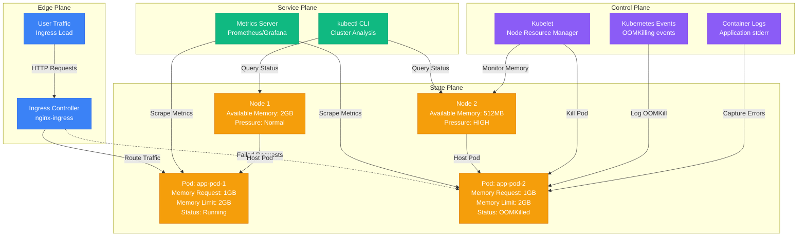
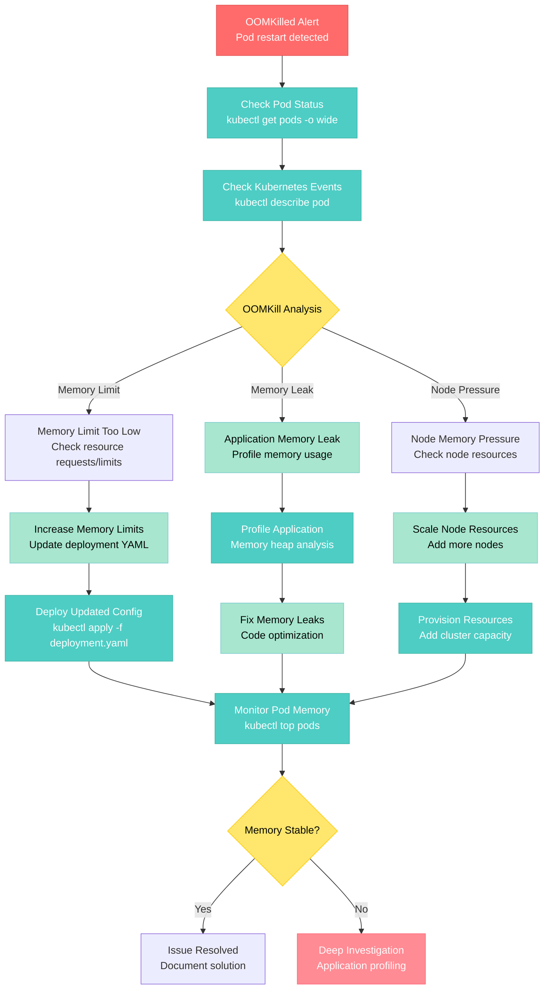

# Kubernetes OOMKilled Pod Debugging

**Scenario**: Production Kubernetes pods being terminated with OOMKilled status, causing service disruptions and application restarts.

**The 3 AM Reality**: Pods constantly restarting, applications losing state, and potential data loss from unexpected terminations.

## Symptoms Checklist

- [ ] Pods showing OOMKilled status in `kubectl get pods`
- [ ] High restart counts on affected pods
- [ ] Application performance degradation before crashes
- [ ] Memory usage spiking to resource limits
- [ ] Event logs showing memory pressure

## Kubernetes OOMKilled Architecture



## Step-by-Step Debugging Flow



## Critical Commands & Queries

### Immediate Pod Analysis
```bash
# Check pod status and restart counts
kubectl get pods -o wide --sort-by=.status.containerStatuses[0].restartCount

# Describe problematic pod for events
kubectl describe pod <pod-name>

# Check pod resource usage
kubectl top pods --sort-by=memory

# Get detailed pod status
kubectl get pod <pod-name> -o yaml | grep -A 10 -B 10 -E "status|resources"

# Check pod logs for OOM indicators
kubectl logs <pod-name> --previous | tail -100
```

### Node Resource Analysis
```bash
# Check node memory pressure
kubectl describe nodes | grep -A 5 -B 5 "MemoryPressure\|OutOfDisk"

# Node resource capacity and usage
kubectl top nodes

# Detailed node resource information
kubectl describe node <node-name> | grep -A 20 "Allocated resources"

# Check node conditions
kubectl get nodes -o custom-columns=NAME:.metadata.name,MEMORY-PRESSURE:.status.conditions[?(@.type==\"MemoryPressure\")].status
```

### Resource Requests and Limits Analysis
```bash
# Check resource requests and limits for all pods
kubectl get pods -o=custom-columns='NAME:.metadata.name,MEMORY-REQUESTS:.spec.containers[*].resources.requests.memory,MEMORY-LIMITS:.spec.containers[*].resources.limits.memory'

# Analyze resource usage vs limits
kubectl top pods | awk 'NR>1 {print $1, $3}' | while read pod memory; do
  limit=$(kubectl get pod $pod -o jsonpath='{.spec.containers[0].resources.limits.memory}')
  echo "Pod: $pod, Usage: $memory, Limit: $limit"
done

# Find pods without resource limits
kubectl get pods -o yaml | grep -C 5 "resources: {}"
```

### Memory Usage Monitoring
```bash
# Real-time memory monitoring for specific pod
watch -n 2 "kubectl top pod <pod-name>"

# Memory usage over time (requires metrics-server)
kubectl get --raw /apis/metrics.k8s.io/v1beta1/namespaces/default/pods/<pod-name> | jq '.containers[].usage.memory'

# Check cgroup memory limits (from within container)
kubectl exec <pod-name> -- cat /sys/fs/cgroup/memory/memory.limit_in_bytes
kubectl exec <pod-name> -- cat /sys/fs/cgroup/memory/memory.usage_in_bytes
```

## Log Analysis Locations

### Kubernetes Events
```bash
# Get all events sorted by time
kubectl get events --sort-by=.metadata.creationTimestamp

# Filter for OOMKilled events
kubectl get events --field-selector reason=Killing,type=Warning

# Watch events in real-time
kubectl get events --watch

# Events for specific pod
kubectl get events --field-selector involvedObject.name=<pod-name>
```

### Container Logs
```bash
# Current container logs
kubectl logs <pod-name> -c <container-name>

# Previous container logs (after restart)
kubectl logs <pod-name> -c <container-name> --previous

# Follow logs in real-time
kubectl logs -f <pod-name>

# Logs with timestamps
kubectl logs <pod-name> --timestamps=true | tail -100
```

### Node-Level Logs
```bash
# Kubelet logs on the node
sudo journalctl -u kubelet -f

# System OOM killer logs
sudo dmesg | grep -i "killed process"
sudo journalctl -k | grep -i "out of memory"

# Container runtime logs (Docker/containerd)
sudo journalctl -u docker -f
sudo journalctl -u containerd -f
```

### Application-Level Memory Profiling
```bash
# Java applications - heap dump analysis
kubectl exec <pod-name> -- jcmd <pid> GC.run_finalization
kubectl exec <pod-name> -- jcmd <pid> VM.memory_summary

# Python applications - memory profiling
kubectl exec <pod-name> -- python -c "
import psutil
process = psutil.Process()
print(f'Memory: {process.memory_info().rss / 1024 / 1024:.2f} MB')
print(f'Memory %: {process.memory_percent():.2f}%')
"

# Node.js applications - memory usage
kubectl exec <pod-name> -- node -e "
console.log('Memory Usage:');
console.log(process.memoryUsage());
"
```

## Monitoring Queries

### Prometheus Queries for Memory Monitoring
```promql
# Container memory usage
container_memory_usage_bytes{pod="pod-name"}

# Memory usage percentage vs limit
(container_memory_usage_bytes / container_spec_memory_limit_bytes) * 100

# OOMKilled container restarts
increase(kube_pod_container_status_restarts_total{reason="OOMKilled"}[5m])

# Memory request vs usage
container_memory_usage_bytes / container_spec_memory_request_bytes

# Node memory pressure
kube_node_status_condition{condition="MemoryPressure",status="true"}
```

### Grafana Dashboard Queries
```json
{
  "targets": [
    {
      "expr": "container_memory_usage_bytes{namespace=\"$namespace\",pod=\"$pod\"}",
      "legendFormat": "{{container}} memory usage"
    },
    {
      "expr": "container_spec_memory_limit_bytes{namespace=\"$namespace\",pod=\"$pod\"}",
      "legendFormat": "{{container}} memory limit"
    }
  ]
}
```

### Custom Monitoring Script
```bash
#!/bin/bash
# k8s-memory-monitor.sh - Monitor pod memory usage

NAMESPACE=${1:-default}
THRESHOLD=${2:-80}  # Alert if memory usage > 80%
SLACK_WEBHOOK="your-slack-webhook-url"

# Function to send alerts
send_alert() {
    curl -X POST -H 'Content-type: application/json' \
        --data "{\"text\":\"K8s Memory Alert: $1\"}" \
        $SLACK_WEBHOOK
}

# Get pod memory usage
kubectl top pods -n $NAMESPACE --no-headers | while read pod cpu memory; do
    # Extract numeric value from memory (e.g., "150Mi" -> "150")
    memory_value=$(echo $memory | sed 's/[^0-9]*//g')
    memory_unit=$(echo $memory | sed 's/[0-9]*//g')

    # Convert to MB
    case $memory_unit in
        "Ki") memory_mb=$((memory_value / 1024)) ;;
        "Mi") memory_mb=$memory_value ;;
        "Gi") memory_mb=$((memory_value * 1024)) ;;
        *) memory_mb=$memory_value ;;
    esac

    # Get memory limit
    limit=$(kubectl get pod $pod -n $NAMESPACE -o jsonpath='{.spec.containers[0].resources.limits.memory}' 2>/dev/null)

    if [ ! -z "$limit" ]; then
        limit_value=$(echo $limit | sed 's/[^0-9]*//g')
        limit_unit=$(echo $limit | sed 's/[0-9]*//g')

        case $limit_unit in
            "Ki") limit_mb=$((limit_value / 1024)) ;;
            "Mi") limit_mb=$limit_value ;;
            "Gi") limit_mb=$((limit_value * 1024)) ;;
            *) limit_mb=$limit_value ;;
        esac

        # Calculate percentage
        if [ $limit_mb -gt 0 ]; then
            percentage=$((memory_mb * 100 / limit_mb))
            echo "Pod: $pod, Memory: ${memory_mb}MB/${limit_mb}MB (${percentage}%)"

            if [ $percentage -gt $THRESHOLD ]; then
                send_alert "Pod $pod memory usage: ${percentage}% (${memory_mb}MB/${limit_mb}MB)"
            fi
        fi
    fi
done
```

## Common Root Causes (by Probability)

### 1. Insufficient Memory Limits (40% of cases)
**Symptoms**: Pods consistently killed at same memory threshold
```bash
# Detection
kubectl describe pod <pod-name> | grep -A 5 "Limits"

# Fix - Update deployment with higher limits
apiVersion: apps/v1
kind: Deployment
spec:
  template:
    spec:
      containers:
      - name: app
        resources:
          requests:
            memory: "512Mi"
          limits:
            memory: "2Gi"  # Increased from 1Gi

kubectl apply -f deployment.yaml
```

### 2. Application Memory Leaks (30% of cases)
**Symptoms**: Memory usage continuously growing over time
```bash
# Detection - Monitor memory growth
kubectl top pod <pod-name> --no-headers | awk '{print $3}' >> memory_usage.log

# Java heap dump analysis
kubectl exec <pod-name> -- jcmd <pid> GC.dump_heap /tmp/heap.hprof
kubectl cp <pod-name>:/tmp/heap.hprof ./heap.hprof

# Python memory profiling
kubectl exec <pod-name> -- pip install memory-profiler
kubectl exec <pod-name> -- python -m memory_profiler your_script.py
```

### 3. Node Memory Pressure (20% of cases)
**Symptoms**: Multiple pods OOMKilled on same node
```bash
# Detection
kubectl describe nodes | grep -A 10 "MemoryPressure.*True"

# Fix - Add more nodes or resize existing ones
# For AWS EKS
eksctl scale nodegroup --cluster=my-cluster --name=my-nodegroup --nodes=5

# For GKE
gcloud container clusters resize my-cluster --num-nodes=5 --zone=us-central1-a
```

### 4. Incorrect Resource Requests (5% of cases)
**Symptoms**: Pods scheduled on nodes without sufficient memory
```bash
# Detection
kubectl describe node <node-name> | grep -A 20 "Allocated resources"

# Fix - Set appropriate resource requests
resources:
  requests:
    memory: "1Gi"    # Ensure realistic request
  limits:
    memory: "2Gi"
```

### 5. Memory Overcommit (5% of cases)
**Symptoms**: Node runs out of memory despite limits
```bash
# Detection
kubectl describe nodes | grep "memory.*pressure"

# Fix - Implement resource quotas
apiVersion: v1
kind: ResourceQuota
metadata:
  name: memory-quota
spec:
  hard:
    requests.memory: "10Gi"
    limits.memory: "20Gi"
```

## Immediate Mitigation Steps

### Emergency Response (< 5 minutes)
1. **Scale Pod Replicas**
   ```bash
   # Increase replicas to handle load
   kubectl scale deployment <app-name> --replicas=5

   # Check if scaling helps
   kubectl get pods -w
   ```

2. **Temporary Memory Limit Increase**
   ```bash
   # Quick patch for emergency
   kubectl patch deployment <app-name> -p='{"spec":{"template":{"spec":{"containers":[{"name":"app","resources":{"limits":{"memory":"4Gi"}}}]}}}}'

   # Verify patch applied
   kubectl describe deployment <app-name> | grep -A 5 limits
   ```

### Short-term Fixes (< 30 minutes)
1. **Resource Optimization**
   ```yaml
   # deployment.yaml - Optimized resource allocation
   apiVersion: apps/v1
   kind: Deployment
   metadata:
     name: app-deployment
   spec:
     replicas: 3
     template:
       spec:
         containers:
         - name: app
           image: app:latest
           resources:
             requests:
               memory: "1Gi"
               cpu: "500m"
             limits:
               memory: "2Gi"
               cpu: "1000m"
   ```

2. **Horizontal Pod Autoscaler (HPA)**
   ```yaml
   apiVersion: autoscaling/v2
   kind: HorizontalPodAutoscaler
   metadata:
     name: app-hpa
   spec:
     scaleTargetRef:
       apiVersion: apps/v1
       kind: Deployment
       name: app-deployment
     minReplicas: 2
     maxReplicas: 10
     metrics:
     - type: Resource
       resource:
         name: memory
         target:
           type: Utilization
           averageUtilization: 70
   ```

## Long-term Prevention

### Vertical Pod Autoscaler (VPA)
```yaml
apiVersion: autoscaling.k8s.io/v1
kind: VerticalPodAutoscaler
metadata:
  name: app-vpa
spec:
  targetRef:
    apiVersion: apps/v1
    kind: Deployment
    name: app-deployment
  updatePolicy:
    updateMode: "Auto"  # Automatically apply recommendations
  resourcePolicy:
    containerPolicies:
    - containerName: app
      maxAllowed:
        memory: "4Gi"
      minAllowed:
        memory: "256Mi"
```

### Memory Monitoring and Alerting
```yaml
# PrometheusRule for memory alerts
apiVersion: monitoring.coreos.com/v1
kind: PrometheusRule
metadata:
  name: pod-memory-alerts
spec:
  groups:
  - name: pod.memory
    rules:
    - alert: PodMemoryUsageHigh
      expr: (container_memory_usage_bytes / container_spec_memory_limit_bytes) * 100 > 80
      for: 5m
      labels:
        severity: warning
      annotations:
        summary: "Pod {{ $labels.pod }} memory usage is above 80%"

    - alert: PodOOMKilled
      expr: increase(kube_pod_container_status_restarts_total{reason="OOMKilled"}[5m]) > 0
      for: 0m
      labels:
        severity: critical
      annotations:
        summary: "Pod {{ $labels.pod }} was OOMKilled"
```

### Application-Level Memory Management
```python
# Python application with memory monitoring
import psutil
import gc
import os
import logging

class MemoryMonitor:
    def __init__(self, threshold_mb=1500):
        self.threshold_mb = threshold_mb
        self.logger = logging.getLogger(__name__)

    def check_memory_usage(self):
        """Monitor memory usage and trigger garbage collection if needed"""
        process = psutil.Process(os.getpid())
        memory_mb = process.memory_info().rss / 1024 / 1024

        if memory_mb > self.threshold_mb:
            self.logger.warning(f"Memory usage high: {memory_mb:.2f}MB")
            gc.collect()  # Force garbage collection

            # Check again after GC
            memory_mb = process.memory_info().rss / 1024 / 1024
            self.logger.info(f"Memory after GC: {memory_mb:.2f}MB")

        return memory_mb

    def get_memory_stats(self):
        """Get detailed memory statistics"""
        process = psutil.Process(os.getpid())
        return {
            'rss': process.memory_info().rss / 1024 / 1024,
            'vms': process.memory_info().vms / 1024 / 1024,
            'percent': process.memory_percent(),
            'available': psutil.virtual_memory().available / 1024 / 1024
        }

# Usage in application
monitor = MemoryMonitor(threshold_mb=1500)

def process_request():
    # Your application logic here
    pass

    # Monitor memory after processing
    monitor.check_memory_usage()
```

### Resource Quota and Limit Ranges
```yaml
# Namespace resource quota
apiVersion: v1
kind: ResourceQuota
metadata:
  name: compute-quota
  namespace: production
spec:
  hard:
    requests.cpu: "10"
    requests.memory: 20Gi
    limits.cpu: "20"
    limits.memory: 40Gi
    pods: "10"

---
# Limit range for default container limits
apiVersion: v1
kind: LimitRange
metadata:
  name: container-limit-range
  namespace: production
spec:
  limits:
  - default:
      memory: "1Gi"
      cpu: "500m"
    defaultRequest:
      memory: "256Mi"
      cpu: "100m"
    type: Container
```

## Production Examples

### Spotify's Memory Leak Crisis (2020)
- **Incident**: Podcast service pods constantly OOMKilled during peak hours
- **Root Cause**: Memory leak in audio processing library
- **Impact**: 30% of podcast streams failed, user churn increased
- **Resolution**: Fixed memory leak, increased limits temporarily
- **Prevention**: Implemented memory profiling in CI/CD pipeline

### Uber's Node Memory Pressure (2019)
- **Incident**: Rider app backend pods killed during surge pricing
- **Root Cause**: Node overcommit, insufficient cluster capacity
- **Impact**: Ride matching delays, revenue loss
- **Resolution**: Added more nodes, implemented proper resource quotas
- **Learning**: Always reserve 20% node capacity for system processes

### Discord's Voice Chat Memory Issues (2021)
- **Incident**: Voice service pods OOMKilled during large server events
- **Root Cause**: Audio buffer accumulation without proper cleanup
- **Impact**: Voice disconnections, user complaints
- **Resolution**: Fixed buffer management, implemented VPA
- **Prevention**: Memory usage alerts, automated scaling

## Recovery Automation

### OOMKill Recovery Script
```bash
#!/bin/bash
# oomkill-recovery.sh - Automated OOMKill recovery

NAMESPACE=${1:-default}
DEPLOYMENT_PREFIX=${2:-app}
SLACK_WEBHOOK="your-slack-webhook-url"

send_alert() {
    curl -X POST -H 'Content-type: application/json' \
        --data "{\"text\":\"K8s OOMKill Recovery: $1\"}" \
        $SLACK_WEBHOOK
}

# Find pods with recent OOMKills
oomkilled_pods=$(kubectl get pods -n $NAMESPACE -o json | \
    jq -r '.items[] | select(.status.containerStatuses[]?.lastState.terminated.reason == "OOMKilled") | .metadata.name')

if [ ! -z "$oomkilled_pods" ]; then
    send_alert "Found OOMKilled pods: $oomkilled_pods"

    for pod in $oomkilled_pods; do
        # Get deployment name
        deployment=$(kubectl get pod $pod -n $NAMESPACE -o jsonpath='{.metadata.labels.app}')

        if [[ $deployment == $DEPLOYMENT_PREFIX* ]]; then
            # Get current memory limit
            current_limit=$(kubectl get deployment $deployment -n $NAMESPACE -o jsonpath='{.spec.template.spec.containers[0].resources.limits.memory}')

            # Increase memory limit by 50%
            if [[ $current_limit =~ ([0-9]+)([A-Za-z]+) ]]; then
                value=${BASH_REMATCH[1]}
                unit=${BASH_REMATCH[2]}
                new_value=$((value * 3 / 2))
                new_limit="${new_value}${unit}"

                send_alert "Increasing memory limit for $deployment from $current_limit to $new_limit"

                # Patch deployment
                kubectl patch deployment $deployment -n $NAMESPACE -p="
                {\"spec\":{\"template\":{\"spec\":{\"containers\":[{\"name\":\"app\",\"resources\":{\"limits\":{\"memory\":\"$new_limit\"}}}]}}}}
                "

                # Wait for rollout
                kubectl rollout status deployment/$deployment -n $NAMESPACE --timeout=300s

                send_alert "Successfully increased memory limit for $deployment"
            fi
        fi
    done
else
    echo "No OOMKilled pods found"
fi

# Check for memory pressure on nodes
pressure_nodes=$(kubectl get nodes -o json | \
    jq -r '.items[] | select(.status.conditions[]? | select(.type == "MemoryPressure" and .status == "True")) | .metadata.name')

if [ ! -z "$pressure_nodes" ]; then
    send_alert "Memory pressure detected on nodes: $pressure_nodes"
fi
```

**Remember**: OOMKilled pods indicate resource allocation issues. Always analyze memory usage patterns before simply increasing limits. Consider both vertical scaling (more memory) and horizontal scaling (more replicas) based on application characteristics.