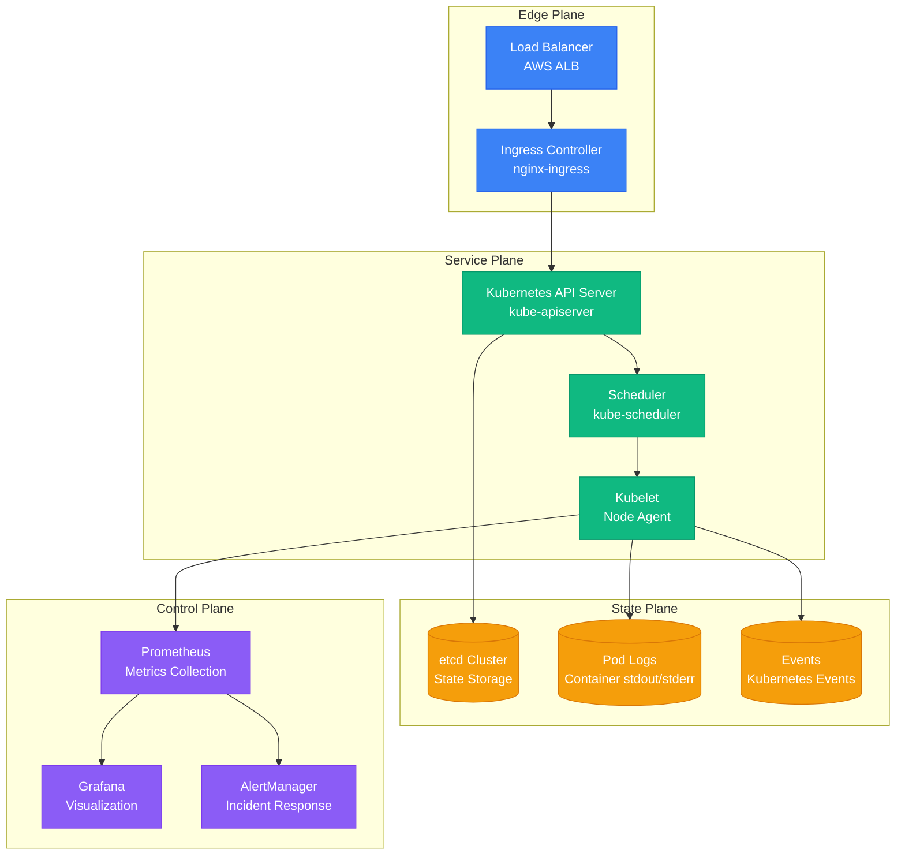
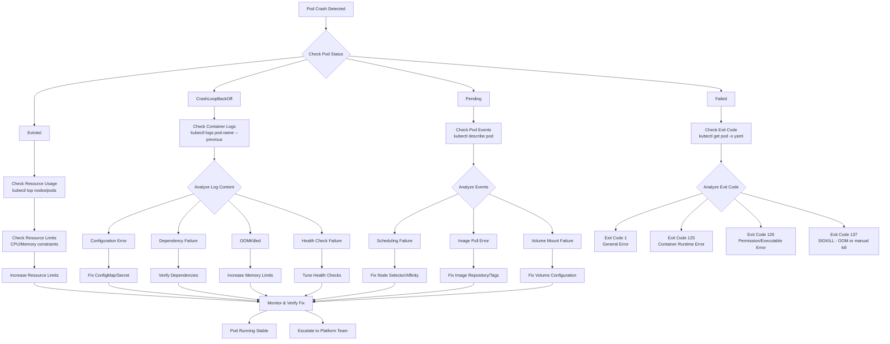

# Kubernetes Pod Crashes - Systematic Debugging Guide

## Overview

This guide provides a comprehensive approach to debugging Kubernetes pod crashes and CrashLoopBackOff scenarios. Based on production incidents from Netflix, Uber, and Spotify's container orchestration teams.

## Architecture Context



## Debugging Flowchart



## Investigation Commands

### 1. Initial Status Check
```bash
# Get pod status and basic info
kubectl get pods -o wide

# Detailed pod description with events
kubectl describe pod <pod-name>

# Get pod YAML configuration
kubectl get pod <pod-name> -o yaml
```

### 2. Log Analysis
```bash
# Current container logs
kubectl logs <pod-name> -c <container-name>

# Previous container logs (for crashes)
kubectl logs <pod-name> -c <container-name> --previous

# Follow logs in real-time
kubectl logs <pod-name> -f

# Logs with timestamps
kubectl logs <pod-name> --timestamps=true
```

### 3. Resource Investigation
```bash
# Check resource usage
kubectl top pods
kubectl top nodes

# Check resource quotas
kubectl describe quota

# Check limit ranges
kubectl describe limitrange
```

### 4. Deep Inspection
```bash
# Execute into running container (if possible)
kubectl exec -it <pod-name> -- /bin/bash

# Debug with ephemeral container (K8s 1.23+)
kubectl debug <pod-name> -it --image=busybox

# Port forward for debugging
kubectl port-forward <pod-name> 8080:8080
```

## Common Root Causes & Solutions

### 1. CrashLoopBackOff Scenarios

#### Application Startup Failures
**Symptoms:**
- Exit code 1 or application-specific error codes
- Logs show configuration errors or missing dependencies

**Commands:**
```bash
# Check application logs
kubectl logs <pod-name> --previous --tail=50

# Verify environment variables
kubectl exec <pod-name> -- env

# Check mounted secrets/configmaps
kubectl exec <pod-name> -- ls -la /etc/config/
```

**Solutions:**
- Fix application configuration
- Verify database connection strings
- Check service discovery configuration
- Validate API endpoints and credentials

#### Resource Exhaustion (OOMKilled)
**Symptoms:**
- Exit code 137 (SIGKILL)
- Events show "OOMKilled"
- High memory usage in metrics

**Commands:**
```bash
# Check memory limits and usage
kubectl describe pod <pod-name> | grep -A 10 "Limits:"
kubectl top pod <pod-name> --containers

# Historical memory usage
kubectl get --raw /api/v1/nodes/<node-name>/proxy/stats/summary
```

**Solutions:**
```yaml
# Increase memory limits
resources:
  limits:
    memory: "2Gi"  # Increased from 512Mi
  requests:
    memory: "1Gi"
```

### 2. Pending Pods

#### Insufficient Resources
**Symptoms:**
- Pod stuck in "Pending" state
- Events: "Insufficient cpu" or "Insufficient memory"

**Commands:**
```bash
# Check node capacity
kubectl describe nodes | grep -A 5 "Allocatable:"

# Check pod resource requests
kubectl describe pod <pod-name> | grep -A 10 "Requests:"
```

**Solutions:**
- Scale cluster nodes
- Reduce resource requests
- Use node affinity to target larger nodes

#### Scheduling Constraints
**Symptoms:**
- Pod pending with no suitable nodes
- Events show node selector or affinity issues

**Commands:**
```bash
# Check node labels
kubectl get nodes --show-labels

# Verify pod scheduling constraints
kubectl get pod <pod-name> -o yaml | grep -A 10 "nodeSelector\|affinity"
```

### 3. Image Pull Errors

#### Image Repository Issues
**Symptoms:**
- Status: "ErrImagePull" or "ImagePullBackOff"
- Events show authentication or repository errors

**Commands:**
```bash
# Check image pull secrets
kubectl get pods <pod-name> -o yaml | grep imagePullSecrets

# Verify secret exists
kubectl get secrets

# Test image pull manually
docker pull <image-name>
```

**Solutions:**
```yaml
# Fix image pull secrets
apiVersion: v1
kind: Pod
spec:
  imagePullSecrets:
  - name: regcred
  containers:
  - name: app
    image: private-registry.com/app:v1.2.3
```

## Production Examples

### Netflix: Java Application Memory Tuning
```yaml
# Before: Frequent OOMKilled
resources:
  limits:
    memory: "512Mi"
  requests:
    memory: "256Mi"

# After: Proper JVM heap sizing
resources:
  limits:
    memory: "2Gi"
  requests:
    memory: "1.5Gi"
env:
- name: JAVA_OPTS
  value: "-Xmx1536m -Xms1536m -XX:+UseG1GC"
```

### Uber: Database Connection Pool Crashes
```yaml
# Problem: Connection pool exhaustion
# Solution: Proper connection management
env:
- name: DB_POOL_SIZE
  value: "10"
- name: DB_TIMEOUT
  value: "30s"
- name: DB_RETRY_COUNT
  value: "3"

# Health check adjustment
livenessProbe:
  httpGet:
    path: /health
    port: 8080
  initialDelaySeconds: 60  # Increased from 30
  timeoutSeconds: 10       # Increased from 5
```

### Spotify: Init Container Dependencies
```yaml
# Problem: Application starts before database migration
# Solution: Init containers for dependencies
spec:
  initContainers:
  - name: migration
    image: migrate/migrate:v4.15.2
    command: ['migrate', '-path', '/migrations', '-database', '$(DB_URL)', 'up']
  containers:
  - name: app
    image: spotify/playlist-service:v2.1.0
```

## Monitoring Queries

### Prometheus Queries
```promql
# Pod restart rate
rate(kube_pod_container_status_restarts_total[5m])

# OOMKilled events
increase(kube_pod_container_status_terminated_reason{reason="OOMKilled"}[1h])

# Pod phase distribution
kube_pod_status_phase

# Container memory usage vs limits
container_memory_usage_bytes / container_spec_memory_limit_bytes * 100

# Image pull errors
increase(kube_pod_container_status_waiting_reason{reason="ErrImagePull"}[5m])
```

### Grafana Dashboard Panels
```json
{
  "title": "Pod Crash Investigation",
  "panels": [
    {
      "title": "Pod Restart Rate",
      "type": "graph",
      "targets": [{
        "expr": "rate(kube_pod_container_status_restarts_total[5m])"
      }]
    },
    {
      "title": "Memory Usage vs Limits",
      "type": "heatmap",
      "targets": [{
        "expr": "container_memory_usage_bytes / container_spec_memory_limit_bytes"
      }]
    }
  ]
}
```

## Tools & Utilities

### kubectl Plugins
```bash
# Install useful plugins
kubectl krew install debug
kubectl krew install resource-capacity
kubectl krew install pod-lens

# Debug crashed pods
kubectl debug <pod-name> --image=nicolaka/netshoot

# Resource capacity across cluster
kubectl resource-capacity --sort cpu.limit
```

### Debug Utilities Image
```dockerfile
# Create debug image with essential tools
FROM alpine:3.18

RUN apk add --no-cache \
    curl \
    netcat-openbsd \
    tcpdump \
    strace \
    ps \
    top \
    lsof

ENTRYPOINT ["/bin/sh"]
```

## Prevention Strategies

### 1. Resource Right-Sizing
```yaml
# Use vertical pod autoscaler recommendations
apiVersion: autoscaling.k8s.io/v1
kind: VerticalPodAutoscaler
metadata:
  name: app-vpa
spec:
  targetRef:
    apiVersion: apps/v1
    kind: Deployment
    name: app
  updatePolicy:
    updateMode: "Auto"
```

### 2. Health Check Tuning
```yaml
# Proper health check configuration
livenessProbe:
  httpGet:
    path: /health/live
    port: 8080
  initialDelaySeconds: 30
  periodSeconds: 10
  timeoutSeconds: 5
  failureThreshold: 3

readinessProbe:
  httpGet:
    path: /health/ready
    port: 8080
  initialDelaySeconds: 5
  periodSeconds: 5
  timeoutSeconds: 3
  failureThreshold: 3
```

### 3. Startup Probe for Slow Applications
```yaml
# For applications with long startup times
startupProbe:
  httpGet:
    path: /health/startup
    port: 8080
  initialDelaySeconds: 10
  periodSeconds: 10
  timeoutSeconds: 5
  failureThreshold: 30  # 5 minutes total
```

## Escalation Procedures

### Level 1: Self-Service Debug
1. Check pod logs and events
2. Verify resource limits and usage
3. Test configuration changes in staging
4. Apply fixes and monitor

### Level 2: Platform Team
1. Node-level issues (kubelet, container runtime)
2. Cluster-wide resource constraints
3. Storage class or persistent volume issues
4. Network policy or service mesh problems

### Level 3: Infrastructure Team
1. Kubernetes control plane issues
2. etcd cluster problems
3. Cloud provider integration issues
4. Security policy violations

## Success Metrics

- **Pod Stability**: < 1% crash rate across deployments
- **MTTR**: < 15 minutes from crash detection to fix
- **Prevention**: 90% of crashes prevented by proper resource sizing
- **Automation**: 80% of crashes auto-resolved by HPA/VPA

## The 3 AM Test

**Scenario**: You're woken up at 3 AM because 50% of your e-commerce pods are crashing during peak traffic.

**This guide provides**:
1. **Immediate triage**: Pod status check commands
2. **Root cause identification**: Systematic log and event analysis
3. **Quick fixes**: Resource adjustments and configuration repairs
4. **Monitoring setup**: Queries to prevent future incidents
5. **Escalation path**: When to involve platform teams

**Expected outcome**: Pods stabilized within 15 minutes, root cause identified, permanent fix deployed within 2 hours.