# Kubernetes Pod CrashLoopBackOff Debugging: Production Survival Guide

*When pods start crash-looping and your deployment is stuck in an endless restart cycle - this is your emergency playbook.*

## The 3 AM Nightmare

Your phone buzzes with alerts: 50 pods stuck in CrashLoopBackOff, service unavailable, customer complaints flooding in. Each pod starts, crashes within 30 seconds, waits, restarts, and crashes again. Your deployment is trapped in an endless cycle of failure.

**This guide is based on real incidents from Spotify (2019 playlist service crash), Airbnb (2020 booking system failure), and Slack (2021 message delivery outage).**

## Emergency Crash Loop Decision Tree

```mermaid
graph TB
    Alert[🚨 CrashLoopBackOff Alert<br/>Pods restarting every 30-60s] --> CheckPodPhase{Pod Phase<br/>Status?}

    CheckPodPhase -->|Running → Crashed| RuntimeCrash[Runtime crash during execution<br/>Application error 60%]
    CheckPodPhase -->|Pending → Failed| StartupFailure[Startup failure<br/>Configuration/Resource issue 25%]
    CheckPodPhase -->|Init error| InitContainerFail[Init container failure<br/>Dependencies/Config 15%]

    RuntimeCrash --> CheckExitCode{Exit Code<br/>Analysis}
    CheckExitCode -->|0| GracefulShutdown[Graceful shutdown<br/>Resource limits hit]
    CheckExitCode -->|1| GeneralError[General application error<br/>Check logs for stack trace]
    CheckExitCode -->|125| ContainerStartError[Container start error<br/>Image or command issue]
    CheckExitCode -->|126| PermissionError[Permission denied<br/>User/security context issue]
    CheckExitCode -->|127| CommandNotFound[Command not found<br/>Binary or path issue]
    CheckExitCode -->|137| SIGKILLed[Process killed by system<br/>OOM or resource limits]
    CheckExitCode -->|143| SIGTERMed[Process terminated<br/>Graceful shutdown timeout]

    StartupFailure --> CheckResources{Resource<br/>Requests Met?}
    CheckResources -->|No| InsufficientResources[Insufficient cluster resources<br/>Scale cluster or reduce requests]
    CheckResources -->|Yes| CheckImagePull{Image Pull<br/>Status?}

    CheckImagePull -->|Failed| ImagePullError[Image pull failure<br/>Registry/auth/network issue]
    CheckImagePull -->|Success| ConfigError[Configuration error<br/>ConfigMap/Secret/Volume issue]

    %% Apply 4-plane colors (Tailwind)
    classDef edgeStyle fill:#3B82F6,stroke:#1D4ED8,color:#fff
    classDef serviceStyle fill:#10B981,stroke:#047857,color:#fff
    classDef stateStyle fill:#F59E0B,stroke:#D97706,color:#fff
    classDef controlStyle fill:#8B5CF6,stroke:#7C3AED,color:#fff

    class Alert,CheckPodPhase,CheckExitCode,CheckResources,CheckImagePull edgeStyle
    class RuntimeCrash,StartupFailure,InitContainerFail serviceStyle
    class GracefulShutdown,GeneralError,ContainerStartError,PermissionError,CommandNotFound,SIGKILLed,SIGTERMed,InsufficientResources,ImagePullError,ConfigError stateStyle
```



## Immediate Diagnostic Commands (First 2 Minutes)

### 1. Pod Status Overview
```bash
# Spotify's rapid pod assessment
kubectl get pods -n production --field-selector=status.phase=Failed
kubectl get pods -n production | grep -E "(CrashLoopBackOff|Error|Pending)"

# Get recent events for context
kubectl get events -n production --sort-by='.lastTimestamp' | tail -20
```

### 2. Detailed Pod Analysis
```bash
# Airbnb's pod diagnostics script
POD_NAME="booking-service-7d4b8c9f6b-x7k2m"
NAMESPACE="production"

# Pod description with events
kubectl describe pod $POD_NAME -n $NAMESPACE

# Check restart count and timing
kubectl get pod $POD_NAME -n $NAMESPACE -o json | jq '.status.containerStatuses[0].restartCount'

# Get crash loop interval
kubectl get pod $POD_NAME -n $NAMESPACE -o json | jq '.status.containerStatuses[0].state'
```

### 3. Container Exit Code Analysis
```bash
# Exit code extraction
kubectl get pod $POD_NAME -n $NAMESPACE -o json | \
  jq '.status.containerStatuses[] | {name: .name, exitCode: .lastState.terminated.exitCode, reason: .lastState.terminated.reason}'

# Recent container logs
kubectl logs $POD_NAME -n $NAMESPACE --previous
kubectl logs $POD_NAME -n $NAMESPACE --tail=100
```

## Architecture-Specific Debugging

### Spotify's Playlist Service Architecture

```mermaid
graph TB
    subgraph EdgePlane[Edge Plane - Traffic Management]
        Ingress[NGINX Ingress Controller<br/>nginx-ingress:1.8.1<br/>TLS termination, rate limiting]
        LoadBalancer[Google Cloud Load Balancer<br/>Global HTTP(S) LB<br/>Health checks every 10s]
    end

    subgraph ServicePlane[Service Plane - Application Layer]
        PlaylistAPI[Playlist API Service<br/>Spring Boot 2.7, Java 17<br/>Replicas: 12, CPU: 2000m]
        MusicCatalog[Music Catalog Service<br/>Node.js 18, Express<br/>Replicas: 8, Memory: 1Gi]
        UserService[User Service<br/>Python 3.10, FastAPI<br/>Replicas: 6, CPU: 1000m]
    end

    subgraph StatePlane[State Plane - Data Persistence]
        PostgresPlaylist[PostgreSQL Playlist DB<br/>CloudSQL postgres:14<br/>Connection pool: 100]
        RedisSession[Redis Session Store<br/>GKE Redis cluster<br/>Memory: 4GB, Persistence: RDB]
        CassandraMusic[Cassandra Music Metadata<br/>3-node cluster, RF=3<br/>Keyspace: music_catalog]
    end

    subgraph ControlPlane[Control Plane - Platform Management]
        KubernetesAPI[Kubernetes API Server<br/>GKE 1.27.3-gke.100<br/>Node pools: 3x n2-standard-4]
        PrometheusMonitoring[Prometheus + Grafana<br/>Pod metrics, JVM stats<br/>Scrape interval: 15s]
        FluentdLogging[Fluentd Daemonset<br/>Log aggregation to BigQuery<br/>Retention: 30 days]
    end

    %% Request flow with failure points
    LoadBalancer -->|Health check: /health| Ingress
    Ingress -->|Route: /api/playlist| PlaylistAPI
    PlaylistAPI -->|Query playlists| PostgresPlaylist
    PlaylistAPI -->|Cache lookup| RedisSession
    PlaylistAPI -->|Music metadata| MusicCatalog
    MusicCatalog -->|Query catalog| CassandraMusic

    %% Monitoring and control
    PlaylistAPI -.->|JVM metrics| PrometheusMonitoring
    PlaylistAPI -.->|Application logs| FluentdLogging
    KubernetesAPI -.->|Pod lifecycle| PrometheusMonitoring

    %% Apply 4-plane colors (Tailwind)
    classDef edgeStyle fill:#3B82F6,stroke:#1D4ED8,color:#fff
    classDef serviceStyle fill:#10B981,stroke:#047857,color:#fff
    classDef stateStyle fill:#F59E0B,stroke:#D97706,color:#fff
    classDef controlStyle fill:#8B5CF6,stroke:#7C3AED,color:#fff

    class Ingress,LoadBalancer edgeStyle
    class PlaylistAPI,MusicCatalog,UserService serviceStyle
    class PostgresPlaylist,RedisSession,CassandraMusic stateStyle
    class KubernetesAPI,PrometheusMonitoring,FluentdLogging controlStyle
```

**Spotify's 2019 Playlist Service Crash**: Playlist API pods crashed every 45 seconds during high traffic, affecting 10M users for 2 hours.

**Root Cause**: JVM OutOfMemoryError due to memory leak in playlist caching logic. Memory limit was 1GB but heap grew to 1.2GB.

**Recovery Steps (Spotify)**:
1. **Immediate**: Increased memory limit from 1GB to 2GB (`kubectl patch deployment`)
2. **Short-term**: Rolled back to previous version with working memory management
3. **Long-term**: Fixed memory leak in playlist cache eviction logic
4. **Recovery time**: 15 minutes for immediate fix, 4 hours for full resolution

### Airbnb's Booking System Architecture


**Airbnb's 2020 Booking System Failure**: Payment service pods crashed every 60 seconds during peak booking hours, causing 500+ booking failures per minute.

**Root Cause**: Database connection pool exhaustion. Payment service tried to establish 200+ connections but PostgreSQL limit was 100.

**Recovery Steps (Airbnb)**:
1. **Emergency**: Increased PostgreSQL connection limit to 500
2. **Immediate**: Reduced connection pool size in app from 50 to 20 per pod
3. **Fix**: Implemented connection pooling with PgBouncer
4. **Recovery time**: 8 minutes for emergency fix, 30 minutes for stable service

## Common Root Causes & Debugging Strategies

### 1. Out of Memory (OOM) Kills (35% of incidents)

**Slack's OOM Detection Script**:
```bash
#!/bin/bash
# oom-detective.sh
POD_NAME=$1
NAMESPACE=${2:-default}

echo "=== OOM Kill Investigation for $POD_NAME ==="

# Check if pod was OOM killed
EXIT_CODE=$(kubectl get pod $POD_NAME -n $NAMESPACE -o json | jq -r '.status.containerStatuses[0].lastState.terminated.exitCode // empty')
REASON=$(kubectl get pod $POD_NAME -n $NAMESPACE -o json | jq -r '.status.containerStatuses[0].lastState.terminated.reason // empty')

if [[ "$EXIT_CODE" == "137" ]] && [[ "$REASON" == "OOMKilled" ]]; then
  echo "✓ CONFIRMED: Pod was OOM killed"

  # Check memory limits and requests
  echo "=== Memory Configuration ==="
  kubectl get pod $POD_NAME -n $NAMESPACE -o json | jq -r '.spec.containers[0].resources'

  # Check memory usage before crash
  echo "=== Memory Usage History ==="
  kubectl top pod $POD_NAME -n $NAMESPACE --containers 2>/dev/null || echo "Metrics not available"

  # Check for memory leaks in logs
  echo "=== Checking for Memory-Related Log Entries ==="
  kubectl logs $POD_NAME -n $NAMESPACE --previous | grep -i -E "(out.*memory|oom|heap|gc|memory.*leak)" | tail -10

else
  echo "❌ Pod was not OOM killed. Exit code: $EXIT_CODE, Reason: $REASON"
fi
```

**Spotify's Memory Debugging Commands**:
```bash
# Get memory limits and usage
kubectl describe pod $POD_NAME -n $NAMESPACE | grep -A 10 -B 5 -i memory

# Check for memory pressure on nodes
kubectl describe nodes | grep -A 10 -B 5 -i "memory pressure"

# Historical memory usage (requires metrics-server)
kubectl top pod $POD_NAME -n $NAMESPACE --containers
```

### 2. Configuration Errors (25% of incidents)

**Airbnb's Config Validation Script**:
```bash
#!/bin/bash
# config-validator.sh
POD_NAME=$1
NAMESPACE=${2:-default}

echo "=== Configuration Validation for $POD_NAME ==="

# Check ConfigMaps referenced by pod
echo "=== ConfigMaps ==="
kubectl get pod $POD_NAME -n $NAMESPACE -o json | \
  jq -r '.spec.volumes[]? | select(.configMap) | .configMap.name' | \
  while read cm; do
    echo "Checking ConfigMap: $cm"
    kubectl get configmap $cm -n $NAMESPACE >/dev/null 2>&1 || echo "❌ ConfigMap $cm not found"
  done

# Check Secrets referenced by pod
echo "=== Secrets ==="
kubectl get pod $POD_NAME -n $NAMESPACE -o json | \
  jq -r '.spec.volumes[]? | select(.secret) | .secret.secretName' | \
  while read secret; do
    echo "Checking Secret: $secret"
    kubectl get secret $secret -n $NAMESPACE >/dev/null 2>&1 || echo "❌ Secret $secret not found"
  done

# Check environment variables
echo "=== Environment Variables ==="
kubectl get pod $POD_NAME -n $NAMESPACE -o json | \
  jq -r '.spec.containers[0].env[]? | select(.valueFrom.configMapKeyRef or .valueFrom.secretKeyRef)' 2>/dev/null || echo "No external env refs"

# Check volume mounts
echo "=== Volume Mounts ==="
kubectl describe pod $POD_NAME -n $NAMESPACE | grep -A 20 "Mounts:"
```

### 3. Image Pull Failures (20% of incidents)

**Image Pull Debugging**:
```bash
# Check image pull status
kubectl describe pod $POD_NAME -n $NAMESPACE | grep -A 10 -B 5 -i "image"

# Test image pull manually
IMAGE=$(kubectl get pod $POD_NAME -n $NAMESPACE -o json | jq -r '.spec.containers[0].image')
echo "Testing image pull for: $IMAGE"

# Check image registry accessibility
docker pull $IMAGE 2>&1 | head -10

# Check imagePullSecrets
kubectl get pod $POD_NAME -n $NAMESPACE -o json | jq -r '.spec.imagePullSecrets[]?.name // "No imagePullSecrets"'
```

### 4. Resource Constraints (15% of incidents)

**Slack's Resource Analysis**:
```bash
#!/bin/bash
# resource-analyzer.sh
NAMESPACE=${1:-default}

echo "=== Cluster Resource Analysis ==="

# Node resource availability
echo "=== Node Resources ==="
kubectl describe nodes | grep -A 5 "Allocated resources:"

# Pending pods due to resources
echo "=== Pending Pods ==="
kubectl get pods -n $NAMESPACE --field-selector=status.phase=Pending

# Resource requests vs limits in namespace
echo "=== Resource Usage by Namespace ==="
kubectl top nodes
kubectl top pods -n $NAMESPACE --sort-by=memory
```

### 5. Dependency Failures (5% of incidents)

**Dependency Health Check**:
```bash
# Check external service connectivity
kubectl run debug-pod --rm -i --tty --image=nicolaka/netshoot -- /bin/bash

# Inside the debug pod:
# nslookup postgres-service.default.svc.cluster.local
# telnet redis-service.default.svc.cluster.local 6379
# curl -v http://api-service.default.svc.cluster.local/health
```

## Recovery Procedures by Crash Type

### OOM Killed (Exit Code 137)

**Immediate Fix (1-2 minutes)**:
```bash
# Spotify's emergency memory scaling
kubectl patch deployment booking-api -p '{"spec":{"template":{"spec":{"containers":[{"name":"booking-api","resources":{"limits":{"memory":"4Gi"},"requests":{"memory":"2Gi"}}}]}}}}'

# Scale up replicas to handle load while fixing
kubectl scale deployment booking-api --replicas=20
```

### Application Crash (Exit Code 1)

**Airbnb's Crash Analysis Procedure**:
```bash
# Get application logs with context
kubectl logs $POD_NAME -n $NAMESPACE --previous --tail=500 > crash_logs.txt

# Look for common crash patterns
grep -i -E "(exception|error|panic|fatal|crash)" crash_logs.txt

# Check for startup sequence issues
grep -i -E "(starting|initializing|connecting|loading)" crash_logs.txt | head -20

# Emergency rollback if needed
kubectl rollout undo deployment/booking-api
```

### Permission Issues (Exit Code 126)

**Security Context Fix**:
```bash
# Check current security context
kubectl get pod $POD_NAME -n $NAMESPACE -o json | jq '.spec.securityContext'

# Fix common permission issues
kubectl patch deployment booking-api -p '{
  "spec": {
    "template": {
      "spec": {
        "securityContext": {
          "runAsUser": 1000,
          "runAsGroup": 1000,
          "fsGroup": 1000
        }
      }
    }
  }
}'
```

## Production Monitoring & Prevention

### Spotify's Pod Health Monitoring
```yaml
# pod-health-monitor.yaml
apiVersion: monitoring.coreos.com/v1
kind: PrometheusRule
metadata:
  name: pod-crashloop-alerts
  namespace: monitoring
spec:
  groups:
  - name: kubernetes.pods
    rules:
    - alert: PodCrashLooping
      expr: rate(kube_pod_container_status_restarts_total[15m]) > 0
      for: 5m
      labels:
        severity: critical
      annotations:
        summary: "Pod {{ $labels.pod }} is crash looping"
        description: "Pod {{ $labels.pod }} in namespace {{ $labels.namespace }} has restarted {{ $value }} times in the last 15 minutes"

    - alert: PodOOMKilled
      expr: increase(kube_pod_container_status_restarts_total[1h]) > 0 and on(pod) kube_pod_container_status_last_terminated_reason{reason="OOMKilled"} == 1
      for: 0m
      labels:
        severity: warning
      annotations:
        summary: "Pod {{ $labels.pod }} killed due to OOM"
        description: "Pod {{ $labels.pod }} in namespace {{ $labels.namespace }} was killed due to out of memory"
```

### Airbnb's Proactive Health Checks
```bash
#!/bin/bash
# proactive-pod-health.sh
# Run every 5 minutes via cron

NAMESPACE="production"

# Check for pods with high restart counts
kubectl get pods -n $NAMESPACE -o json | \
  jq -r '.items[] | select(.status.containerStatuses[0].restartCount > 3) | .metadata.name + " restarts: " + (.status.containerStatuses[0].restartCount | tostring)'

# Check for memory pressure
kubectl top pods -n $NAMESPACE --sort-by=memory | head -10

# Check for pending pods
PENDING=$(kubectl get pods -n $NAMESPACE --field-selector=status.phase=Pending --no-headers | wc -l)
if [ "$PENDING" -gt 0 ]; then
  echo "Warning: $PENDING pods pending in $NAMESPACE"
fi

# Check recent events for errors
kubectl get events -n $NAMESPACE --sort-by='.lastTimestamp' | grep -i -E "(error|failed|kill)" | tail -5
```

## Quick Reference Emergency Kit

### Essential Debugging Commands
```bash
# Rapid pod status check
kubectl get pods -A | grep -v Running

# Pod crash analysis
kubectl describe pod $POD_NAME -n $NAMESPACE | grep -A 20 "Events:"

# Get container logs
kubectl logs $POD_NAME -n $NAMESPACE --previous --tail=100

# Resource utilization
kubectl top pods -n $NAMESPACE --sort-by=memory

# Emergency scaling
kubectl scale deployment $DEPLOYMENT --replicas=10

# Emergency rollback
kubectl rollout undo deployment/$DEPLOYMENT
```

### Emergency Escalation Paths
- **Spotify**: #platform-oncall Slack, k8s-sre@spotify.com
- **Airbnb**: Platform team PagerDuty, +1-555-K8S-HELP
- **Slack**: #infrastructure-k8s, escalate to Platform SRE

## Production Lessons Learned

### Spotify's Key Insights
1. **Memory limits prevent crashes**: Always set memory limits 20-30% above normal usage
2. **Graceful shutdown matters**: Use proper SIGTERM handling to avoid data corruption
3. **Health checks are critical**: Liveness and readiness probes catch issues early

### Airbnb's Best Practices
1. **Connection pool tuning**: Database connection limits must match application pools
2. **Circuit breakers**: Prevent cascading failures from external dependencies
3. **Resource requests accuracy**: Set requests based on actual usage, not guesses

### Slack's Prevention Strategies
1. **Chaos engineering**: Regular pod kill tests reveal hidden issues
2. **Canary deployments**: Catch crashes before full rollout
3. **Comprehensive logging**: Structured logs make crash analysis faster

---

*Last updated: September 2024 | Based on incidents from Spotify (Playlist crash 2019), Airbnb (Booking failure 2020), Slack (Message delivery outage 2021)*

**Remember**: 70% of CrashLoopBackOff issues are: OOM kills, config errors, or image problems. Check exit codes first, then logs, then resources.