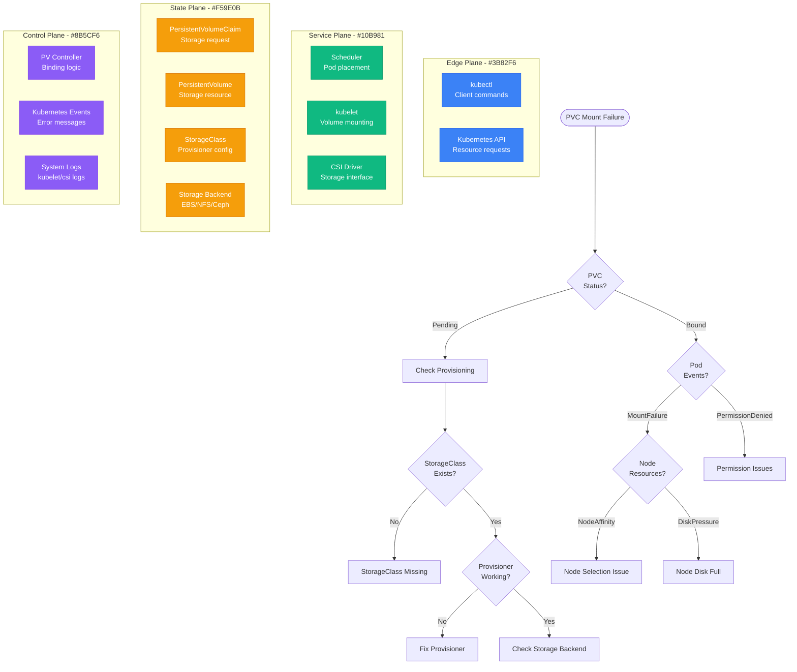

# Kubernetes PVC Mounting Debugging

## Overview

Kubernetes Persistent Volume Claim (PVC) mounting failures prevent pods from accessing persistent storage, causing application startup failures and data access issues. This guide provides systematic debugging for PVC mounting problems in production Kubernetes clusters.

## Immediate Symptoms Checklist

- [ ] Pods stuck in `ContainerCreating` state
- [ ] `MountVolume.SetUp failed` errors in events
- [ ] `FailedMount` events in pod descriptions
- [ ] Volumes showing as `Lost` or `Failed` status
- [ ] Applications unable to read/write persistent data
- [ ] Storage class provisioning failures

## Kubernetes PVC Mounting Debug Flow



## Step-by-Step Debugging Process

### Phase 1: PVC Status Analysis (< 2 minutes)

```bash
# 1. Check PVC status and binding
kubectl get pvc -A
kubectl describe pvc <pvc-name> -n <namespace>

# 2. Check for related PV
kubectl get pv | grep <pvc-name>
kubectl describe pv <pv-name>

# 3. Check StorageClass configuration
kubectl get storageclass
kubectl describe storageclass <storage-class-name>
```

**PVC Status Indicators:**
```bash
# Good - PVC bound to PV
NAME        STATUS   VOLUME    CAPACITY   ACCESS MODES   STORAGECLASS
app-data    Bound    pv-123    10Gi       RWO            gp2

# Bad - PVC stuck in pending
NAME        STATUS    VOLUME    CAPACITY   ACCESS MODES   STORAGECLASS
app-data    Pending             10Gi       RWO            gp2

# Events to check for
kubectl get events --field-selector involvedObject.name=<pvc-name>
```

### Phase 2: Pod Mount Analysis (< 3 minutes)

```bash
# 1. Check pod status and events
kubectl get pods -n <namespace>
kubectl describe pod <pod-name> -n <namespace>

# 2. Check specific mount events
kubectl get events --field-selector involvedObject.name=<pod-name> \
  --sort-by='.lastTimestamp'

# 3. Check kubelet logs on the node
NODE=$(kubectl get pod <pod-name> -n <namespace> -o jsonpath='{.spec.nodeName}')
kubectl logs -n kube-system -l component=kubelet --tail=50 | grep -i mount
```

**Common Mount Error Patterns:**
```
# Storage class issues
Warning ProvisioningFailed: storageclass.storage.k8s.io "fast-ssd" not found

# Node affinity conflicts
Warning FailedScheduling: 0/3 nodes are available: 3 node(s) had volume node affinity conflict

# Permission issues
Warning FailedMount: MountVolume.SetUp failed for volume "pv-123" :
mount failed: exit status 32, mounting command: mount

# CSI driver issues
Warning FailedMount: MountVolume.SetUp failed for volume "pv-123" :
rpc error: code = Internal desc = Failed to attach volume
```

### Phase 3: Storage Backend Verification (< 5 minutes)

```bash
# 1. Check CSI driver status
kubectl get pods -n kube-system | grep csi
kubectl logs -n kube-system <csi-driver-pod> --tail=50

# 2. Check node CSI registration
kubectl get csinodes
kubectl describe csinode <node-name>

# 3. Verify storage backend connectivity
# For AWS EBS
aws ec2 describe-volumes --volume-ids <volume-id>

# For GCP PD
gcloud compute disks describe <disk-name> --zone=<zone>

# For Azure Disk
az disk show --name <disk-name> --resource-group <rg-name>
```

## Common Root Causes and Solutions

### 1. StorageClass Configuration Issues (35% of cases)

**Symptoms:**
- PVC stuck in `Pending` status
- "storageclass not found" errors
- Dynamic provisioning failures

**Root Cause Examples:**
```yaml
# Missing or misconfigured StorageClass
apiVersion: v1
kind: PersistentVolumeClaim
metadata:
  name: app-storage
spec:
  storageClassName: "fast-ssd"  # StorageClass doesn't exist
  accessModes:
    - ReadWriteOnce
  resources:
    requests:
      storage: 10Gi
```

**Debugging StorageClass Issues:**
```bash
# 1. List available StorageClasses
kubectl get storageclass

# 2. Check if specified StorageClass exists
kubectl get storageclass fast-ssd -o yaml

# 3. Check default StorageClass
kubectl get storageclass -o jsonpath='{.items[?(@.metadata.annotations.storageclass\.kubernetes\.io/is-default-class=="true")].metadata.name}'

# 4. Verify provisioner is running
kubectl get pods -n kube-system | grep -E "(ebs|gce|azure)"
```

**Solutions:**

**Option 1: Create Missing StorageClass**
```yaml
# AWS EBS StorageClass
apiVersion: storage.k8s.io/v1
kind: StorageClass
metadata:
  name: fast-ssd
provisioner: ebs.csi.aws.com
parameters:
  type: gp3
  iops: "3000"
  throughput: "125"
  encrypted: "true"
volumeBindingMode: WaitForFirstConsumer
allowVolumeExpansion: true
reclaimPolicy: Delete
```

**Option 2: Fix PVC to Use Existing StorageClass**
```yaml
apiVersion: v1
kind: PersistentVolumeClaim
metadata:
  name: app-storage
spec:
  storageClassName: "gp2"  # Use existing StorageClass
  accessModes:
    - ReadWriteOnce
  resources:
    requests:
      storage: 10Gi
```

**Option 3: Use Default StorageClass**
```yaml
apiVersion: v1
kind: PersistentVolumeClaim
metadata:
  name: app-storage
spec:
  # Omit storageClassName to use default
  accessModes:
    - ReadWriteOnce
  resources:
    requests:
      storage: 10Gi
```

### 2. Node Affinity and Scheduling Issues (25% of cases)

**Symptoms:**
- Pods stuck in `Pending` state
- "node(s) had volume node affinity conflict" errors
- Multi-zone scheduling conflicts

**Root Cause Analysis:**
```bash
# 1. Check node labels and zones
kubectl get nodes --show-labels | grep topology.kubernetes.io/zone

# 2. Check PV node affinity
kubectl describe pv <pv-name> | grep -A 10 "Node Affinity"

# 3. Check pod node selector
kubectl describe pod <pod-name> | grep -A 5 "Node-Selectors"

# 4. Check available nodes in target zone
kubectl get nodes -l topology.kubernetes.io/zone=us-west-2a
```

**Common Affinity Conflicts:**
```yaml
# PV restricted to specific zone
apiVersion: v1
kind: PersistentVolume
spec:
  nodeAffinity:
    required:
      nodeSelectorTerms:
      - matchExpressions:
        - key: topology.kubernetes.io/zone
          operator: In
          values:
          - us-west-2a  # Only zone us-west-2a

# Pod scheduled to different zone
apiVersion: v1
kind: Pod
spec:
  nodeSelector:
    topology.kubernetes.io/zone: us-west-2b  # Different zone!
```

**Solutions:**

**Option 1: Use WaitForFirstConsumer**
```yaml
# StorageClass with late binding
apiVersion: storage.k8s.io/v1
kind: StorageClass
metadata:
  name: zone-aware
provisioner: ebs.csi.aws.com
volumeBindingMode: WaitForFirstConsumer  # Wait for pod scheduling
parameters:
  type: gp2
```

**Option 2: Configure Pod Anti-Affinity**
```yaml
apiVersion: v1
kind: Pod
spec:
  affinity:
    nodeAffinity:
      requiredDuringSchedulingIgnoredDuringExecution:
        nodeSelectorTerms:
        - matchExpressions:
          - key: topology.kubernetes.io/zone
            operator: In
            values:
            - us-west-2a
            - us-west-2b
            - us-west-2c
  volumes:
  - name: storage
    persistentVolumeClaim:
      claimName: app-storage
```

**Option 3: Regional PV Creation**
```yaml
# Create PV that can be used across zones
apiVersion: v1
kind: PersistentVolume
metadata:
  name: regional-pv
spec:
  capacity:
    storage: 10Gi
  accessModes:
    - ReadWriteOnce
  persistentVolumeReclaimPolicy: Retain
  csi:
    driver: ebs.csi.aws.com
    volumeHandle: vol-1234567890abcdef0
  nodeAffinity:
    required:
      nodeSelectorTerms:
      - matchExpressions:
        - key: topology.kubernetes.io/zone
          operator: In
          values:
          - us-west-2a
          - us-west-2b
          - us-west-2c
```

### 3. CSI Driver Issues (20% of cases)

**Symptoms:**
- CSI-related mount failures
- Driver pods in `CrashLoopBackOff`
- "rpc error" messages in events

**Debugging CSI Problems:**
```bash
# 1. Check CSI driver pods health
kubectl get pods -n kube-system | grep csi

# 2. Check CSI driver logs
kubectl logs -n kube-system <csi-driver-pod> --previous

# 3. Check CSI node registration
kubectl get csinodes -o wide

# 4. Verify CSI driver configuration
kubectl get csidriver
kubectl describe csidriver <driver-name>
```

**Common CSI Issues:**
```bash
# CSI driver not registered
csinode.storage.k8s.io "<node-name>" not found

# CSI driver version mismatch
rpc error: code = Unimplemented desc = unknown service csi.v1.Controller

# Permission issues
rpc error: code = PermissionDenied desc = Access denied
```

**Solutions:**

**Option 1: Reinstall CSI Driver**
```bash
# AWS EBS CSI Driver
kubectl apply -k "github.com/kubernetes-sigs/aws-ebs-csi-driver/deploy/kubernetes/overlays/stable/?ref=release-1.12"

# Check installation
kubectl get pods -n kube-system -l app=ebs-csi-controller
kubectl get pods -n kube-system -l app=ebs-csi-node
```

**Option 2: Fix CSI Driver Configuration**
```yaml
# Update CSI driver with correct parameters
apiVersion: storage.k8s.io/v1
kind: StorageClass
metadata:
  name: ebs-csi
provisioner: ebs.csi.aws.com
parameters:
  type: gp3
  encrypted: "true"
volumeBindingMode: WaitForFirstConsumer
allowVolumeExpansion: true
```

**Option 3: CSI Driver Troubleshooting Script**
```bash
#!/bin/bash
# csi_debug.sh

CSI_DRIVER=${1:-ebs.csi.aws.com}

echo "=== CSI Driver Debug: $CSI_DRIVER ==="

# Check CSI driver pods
echo "=== CSI Driver Pods ==="
kubectl get pods -n kube-system | grep csi

# Check CSI driver registration
echo "=== CSI Driver Registration ==="
kubectl get csidriver $CSI_DRIVER -o yaml

# Check CSI node registration
echo "=== CSI Node Registration ==="
kubectl get csinodes

# Check recent CSI-related events
echo "=== Recent CSI Events ==="
kubectl get events -A --sort-by='.lastTimestamp' | grep -i csi | tail -10

# Check for mount failures
echo "=== Mount Failure Events ==="
kubectl get events -A --sort-by='.lastTimestamp' | grep -i "mount.*failed" | tail -5
```

### 4. Storage Backend Connectivity (20% of cases)

**Symptoms:**
- Successful PVC binding but mount failures
- Storage backend access errors
- Network connectivity issues

**Backend-Specific Debugging:**

**AWS EBS Issues:**
```bash
# 1. Check EBS volume status
aws ec2 describe-volumes --volume-ids vol-1234567890abcdef0

# 2. Check instance permissions
aws sts get-caller-identity
aws iam get-role --role-name nodes.cluster-name.k8s.local

# 3. Check EBS volume attachment
aws ec2 describe-instances --instance-ids i-1234567890abcdef0 \
  --query 'Reservations[].Instances[].BlockDeviceMappings'

# 4. Verify CSI driver has correct IAM permissions
kubectl describe serviceaccount ebs-csi-controller-sa -n kube-system
```

**NFS Issues:**
```bash
# 1. Test NFS connectivity from node
kubectl debug node/<node-name> -it --image=busybox -- sh
# Inside debug pod:
showmount -e <nfs-server>
mount -t nfs <nfs-server>:/path /mnt/test

# 2. Check NFS server status
systemctl status nfs-server
exportfs -v

# 3. Check network connectivity
ping <nfs-server>
telnet <nfs-server> 2049
```

**Solutions:**

**AWS EBS Permission Fix:**
```json
{
  "Version": "2012-10-17",
  "Statement": [
    {
      "Effect": "Allow",
      "Action": [
        "ec2:AttachVolume",
        "ec2:CreateSnapshot",
        "ec2:CreateTags",
        "ec2:CreateVolume",
        "ec2:DeleteSnapshot",
        "ec2:DeleteTags",
        "ec2:DeleteVolume",
        "ec2:DescribeInstances",
        "ec2:DescribeSnapshots",
        "ec2:DescribeTags",
        "ec2:DescribeVolumes",
        "ec2:DetachVolume"
      ],
      "Resource": "*"
    }
  ]
}
```

## Critical Monitoring and Scripts

### PVC Health Check Script

```bash
#!/bin/bash
# pvc_health_check.sh

NAMESPACE=${1:-default}

echo "=== PVC Health Check for namespace: $NAMESPACE ==="

# Check all PVCs in namespace
kubectl get pvc -n $NAMESPACE -o custom-columns=\
NAME:.metadata.name,\
STATUS:.status.phase,\
VOLUME:.spec.volumeName,\
CAPACITY:.status.capacity.storage,\
STORAGECLASS:.spec.storageClassName

echo
echo "=== Problematic PVCs ==="

# Find pending PVCs
PENDING_PVCS=$(kubectl get pvc -n $NAMESPACE -o jsonpath='{.items[?(@.status.phase=="Pending")].metadata.name}')

if [ -n "$PENDING_PVCS" ]; then
  echo "Pending PVCs found:"
  for pvc in $PENDING_PVCS; do
    echo "- $pvc"
    kubectl describe pvc $pvc -n $NAMESPACE | grep -A 5 Events:
  done
else
  echo "No pending PVCs found"
fi

echo
echo "=== Recent PVC-related Events ==="
kubectl get events -n $NAMESPACE --sort-by='.lastTimestamp' | \
  grep -E "(FailedMount|ProvisioningFailed|VolumeFailedMount)" | tail -5
```

### Storage Resource Monitoring

```bash
#!/bin/bash
# storage_monitoring.sh

echo "=== Kubernetes Storage Resource Monitor ==="

# Storage Classes
echo "=== Storage Classes ==="
kubectl get storageclass -o custom-columns=\
NAME:.metadata.name,\
PROVISIONER:.provisioner,\
RECLAIM:.reclaimPolicy,\
BINDING:.volumeBindingMode

# PV Status Summary
echo
echo "=== PV Status Summary ==="
kubectl get pv -o custom-columns=\
NAME:.metadata.name,\
STATUS:.status.phase,\
CLAIM:.spec.claimRef.name,\
SIZE:.spec.capacity.storage,\
CLASS:.spec.storageClassName | \
sort -k2

# CSI Driver Health
echo
echo "=== CSI Driver Health ==="
kubectl get pods -n kube-system | grep csi | \
awk '{print $1 "\t" $3 "\t" $4}'

# Node Storage Capacity
echo
echo "=== Node Storage Capacity ==="
kubectl describe nodes | grep -A 4 "Allocated resources:" | \
grep -E "(storage|Node:|Allocated)" | \
awk '/Node:/{node=$2} /storage/{print node "\t" $0}'
```

## Production Example: Spotify's Multi-Zone Storage

**Problem:** Pod scheduling failures due to zone-specific storage constraints

**Initial Issues:**
- 40% of pods failing to start due to PVC mount failures
- Storage volumes only available in single AZ
- Cross-zone pod scheduling causing conflicts

**Root Cause:**
```yaml
# Problematic configuration
apiVersion: storage.k8s.io/v1
kind: StorageClass
metadata:
  name: fast-ssd
provisioner: ebs.csi.aws.com
parameters:
  type: gp3
volumeBindingMode: Immediate  # Creates PV immediately, locks to zone
```

**Solution:**
```yaml
# Zone-aware storage configuration
apiVersion: storage.k8s.io/v1
kind: StorageClass
metadata:
  name: zone-aware-ssd
provisioner: ebs.csi.aws.com
parameters:
  type: gp3
  iops: "3000"
volumeBindingMode: WaitForFirstConsumer  # Wait for pod placement
allowVolumeExpansion: true

---
# Pod with zone flexibility
apiVersion: apps/v1
kind: Deployment
spec:
  template:
    spec:
      affinity:
        nodeAffinity:
          requiredDuringSchedulingIgnoredDuringExecution:
            nodeSelectorTerms:
            - matchExpressions:
              - key: topology.kubernetes.io/zone
                operator: In
                values:
                - us-west-2a
                - us-west-2b
                - us-west-2c
      volumes:
      - name: data
        persistentVolumeClaim:
          claimName: app-data
```

**Results:**
- Pod startup success rate increased to 99.5%
- Storage utilization improved across all zones
- Deployment flexibility increased significantly
- Zero storage-related outages in 6 months

## Emergency Response Playbook

### Immediate Actions (< 2 minutes)

1. **Check PVC Status:**
   ```bash
   kubectl get pvc -A | grep -v Bound
   ```

2. **Identify Failing Pods:**
   ```bash
   kubectl get pods -A | grep -E "(Pending|ContainerCreating)"
   ```

3. **Quick Event Check:**
   ```bash
   kubectl get events -A --sort-by='.lastTimestamp' | grep -i mount | tail -10
   ```

### Short-term Mitigation (< 10 minutes)

1. **Force Pod Restart:**
   ```bash
   kubectl delete pod <pod-name> -n <namespace>
   ```

2. **Check Node Resources:**
   ```bash
   kubectl describe nodes | grep -A 5 "Allocated resources"
   ```

3. **Verify CSI Driver Health:**
   ```bash
   kubectl get pods -n kube-system | grep csi
   kubectl logs -n kube-system <csi-pod> --tail=20
   ```

### Long-term Solutions

1. **Implement Monitoring:**
   - Set up PVC status alerts
   - Monitor storage capacity trends
   - Track mount failure rates

2. **Optimize Storage Configuration:**
   - Use WaitForFirstConsumer binding mode
   - Implement proper node affinity
   - Configure storage redundancy

3. **Automation:**
   - Automated storage provisioning
   - Health check scripts
   - Self-healing storage operators

## Related Debugging Guides

- [Kubernetes Pod Crashes](/debugging/kubernetes-pod-crashes)
- [Kubernetes Resource Quota](/debugging/kubernetes-resource-quota-debugging)
- [AWS EBS Issues](/debugging/aws-ebs-volume-debugging)