# Latency Spike Investigation - Production Debugging Guide

## Overview

This guide provides systematic workflows for investigating latency spikes in distributed systems. Based on Twitter's latency debugging and Amazon's performance optimization practices.

**Time to Resolution**: 8-35 minutes for most latency spikes
**Root Cause Identification**: 88% success rate
**False Positive Rate**: <7%

## 1. Complete Latency Spike Investigation Flow

```mermaid
flowchart TD
    LatencyAlert[⚡ Latency Spike Alert<br/>p99 > 2x baseline] --> TimeframeAnalysis[1. Timeframe Analysis<br/>Spike duration & pattern<br/>⏱️ 2 min]

    TimeframeAnalysis --> SpikeCharacterization[2. Spike Characterization<br/>Pattern classification<br/>⏱️ 3 min]

    SpikeCharacterization --> SpikeType{Spike Type<br/>Classification?}

    SpikeType --> SuddenSpike[Sudden Spike<br/>0-2 minutes duration]
    SpikeType --> SustainedSpike[Sustained Spike<br/>5+ minutes duration]
    SpikeType --> PeriodicSpike[Periodic Spike<br/>Regular intervals]
    SpikeType --> GradualSpike[Gradual Spike<br/>Slow increase]

    SuddenSpike --> SuddenAnalysis[3a. Sudden Spike Analysis<br/>• Deployment correlation<br/>• Traffic burst analysis<br/>• Circuit breaker events<br/>⏱️ 8 min]

    SustainedSpike --> SustainedAnalysis[3b. Sustained Analysis<br/>• Resource exhaustion<br/>• Memory pressure<br/>• Connection pool limits<br/>⏱️ 12 min]

    PeriodicSpike --> PeriodicAnalysis[3c. Periodic Analysis<br/>• Scheduled jobs<br/>• Cache expiration<br/>• Background processing<br/>⏱️ 10 min]

    GradualSpike --> GradualAnalysis[3d. Gradual Analysis<br/>• Memory leaks<br/>• Capacity degradation<br/>• External dependencies<br/>⏱️ 15 min]

    SuddenAnalysis --> ServiceLevel[4. Service-Level Analysis<br/>Identify affected components<br/>⏱️ 5 min]
    SustainedAnalysis --> ServiceLevel
    PeriodicAnalysis --> ServiceLevel
    GradualAnalysis --> ServiceLevel

    ServiceLevel --> ComponentAnalysis[5. Component Deep Dive<br/>Drill down to root cause<br/>⏱️ 8 min]

    ComponentAnalysis --> LatencyFix[6. Latency Fix Implementation<br/>Apply targeted solution<br/>⏱️ 15 min]

    LatencyFix --> LatencyValidation[7. Latency Validation<br/>Confirm spike resolution<br/>⏱️ 5 min]

    LatencyValidation --> PreventionSetup[8. Prevention Setup<br/>Enhanced monitoring<br/>⏱️ 5 min]

    %% Apply 4-plane colors
    classDef edgeStyle fill:#3B82F6,stroke:#2563EB,color:#fff
    classDef serviceStyle fill:#10B981,stroke:#059669,color:#fff
    classDef stateStyle fill:#F59E0B,stroke:#D97706,color:#fff
    classDef controlStyle fill:#8B5CF6,stroke:#7C3AED,color:#fff

    class LatencyAlert,TimeframeAnalysis edgeStyle
    class SuddenAnalysis,SustainedAnalysis,PeriodicAnalysis serviceStyle
    class GradualAnalysis,ServiceLevel,ComponentAnalysis stateStyle
    class LatencyFix,LatencyValidation,PreventionSetup controlStyle
```



## 2. Twitter-Style Request Path Latency Analysis

```mermaid
flowchart TD
    LatencySpike[📈 Latency Spike Detected<br/>API response time 3x normal] --> RequestTracing[1. Request Path Tracing<br/>End-to-end trace analysis<br/>⏱️ 3 min]

    RequestTracing --> PathBreakdown[2. Path Breakdown<br/>Component latency analysis<br/>⏱️ 4 min]

    PathBreakdown --> LoadBalancer[Load Balancer<br/>Routing latency]
    PathBreakdown --> APIGateway[API Gateway<br/>Authentication & rate limiting]
    PathBreakdown --> ServiceMesh[Service Mesh<br/>Proxy overhead]
    PathBreakdown --> ApplicationLogic[Application Logic<br/>Business processing]
    PathBreakdown --> Database[Database<br/>Query execution]
    PathBreakdown --> ExternalAPIs[External APIs<br/>Third-party calls]

    LoadBalancer --> LBLatency[📊 LB Latency Analysis<br/>• Health check latency: 🟢 2ms<br/>• Routing decision: 🟢 1ms<br/>• Connection setup: 🔴 150ms<br/>• SSL handshake: 🔴 200ms]

    APIGateway --> GWLatency[📊 Gateway Latency<br/>• Authentication: 🟡 50ms<br/>• Rate limiting: 🟢 5ms<br/>• Request validation: 🟢 10ms<br/>• Logging overhead: 🟡 25ms]

    ServiceMesh --> MeshLatency[📊 Mesh Latency<br/>• Proxy processing: 🟢 15ms<br/>• mTLS handshake: 🔴 180ms<br/>• Circuit breaker: 🟢 2ms<br/>• Retry logic: 🟡 45ms]

    ApplicationLogic --> AppLatency[📊 App Latency<br/>• Business logic: 🟡 80ms<br/>• Serialization: 🟢 20ms<br/>• Memory allocation: 🔴 120ms<br/>• GC pause: 🔴 300ms]

    Database --> DBLatency[📊 Database Latency<br/>• Connection acquire: 🔴 100ms<br/>• Query execution: 🟡 75ms<br/>• Result serialization: 🟢 15ms<br/>• Connection release: 🟢 5ms]

    ExternalAPIs --> ExtLatency[📊 External Latency<br/>• DNS resolution: 🟢 10ms<br/>• Connection setup: 🟡 80ms<br/>• API processing: 🔴 500ms<br/>• Response parsing: 🟢 25ms]

    LBLatency --> LatencyHotspot[3. Latency Hotspot ID<br/>SSL handshake issues<br/>⏱️ 5 min]
    GWLatency --> LatencyHotspot
    MeshLatency --> LatencyHotspot
    AppLatency --> LatencyHotspot
    DBLatency --> LatencyHotspot
    ExtLatency --> LatencyHotspot

    LatencyHotspot --> PrimaryBottleneck{Primary<br/>Bottleneck?}

    PrimaryBottleneck --> SSLIssues[4a. SSL/TLS Issues<br/>• Certificate problems<br/>• Cipher negotiation<br/>• Key exchange delays<br/>⏱️ 10 min]

    PrimaryBottleneck --> GCPauses[4b. GC Pause Issues<br/>• Heap pressure<br/>• GC algorithm tuning<br/>• Memory allocation<br/>⏱️ 12 min]

    PrimaryBottleneck --> ConnectionPool[4c. Connection Pool Issues<br/>• Pool exhaustion<br/>• Connection leaks<br/>• Pool configuration<br/>⏱️ 8 min]

    PrimaryBottleneck --> ExternalDependency[4d. External Dependencies<br/>• Third-party latency<br/>• Network issues<br/>• API rate limiting<br/>⏱️ 6 min]

    SSLIssues --> LatencyResolution[5. Latency Resolution<br/>Targeted optimization<br/>⏱️ 15 min]
    GCPauses --> LatencyResolution
    ConnectionPool --> LatencyResolution
    ExternalDependency --> LatencyResolution

    %% Apply 4-plane colors
    classDef edgeStyle fill:#3B82F6,stroke:#2563EB,color:#fff
    classDef serviceStyle fill:#10B981,stroke:#059669,color:#fff
    classDef stateStyle fill:#F59E0B,stroke:#D97706,color:#fff
    classDef controlStyle fill:#8B5CF6,stroke:#7C3AED,color:#fff

    class LatencySpike,RequestTracing edgeStyle
    class LoadBalancer,APIGateway,ServiceMesh serviceStyle
    class ApplicationLogic,Database,ExternalAPIs stateStyle
    class LatencyHotspot,LatencyResolution,PrimaryBottleneck controlStyle
```



## 3. Amazon-Style Database Latency Investigation

```mermaid
flowchart TD
    DBLatencySpike[🗄️ Database Latency Spike<br/>Query time >500ms] --> QueryAnalysis[1. Query Analysis<br/>Slow query identification<br/>⏱️ 4 min]

    QueryAnalysis --> QueryProfiler[2. Query Profiler<br/>Execution plan analysis<br/>⏱️ 5 min]

    QueryProfiler --> QueryBottleneck{Query Bottleneck<br/>Type?}

    QueryBottleneck --> MissingIndex[Missing Index<br/>Full table scans]
    QueryBottleneck --> LockContention[Lock Contention<br/>Blocking queries]
    QueryBottleneck --> IOBottleneck[I/O Bottleneck<br/>Disk read/write limits]
    QueryBottleneck --> CPUBottleneck[CPU Bottleneck<br/>Query complexity]

    MissingIndex --> IndexAnalysis[3a. Index Analysis<br/>• Query execution plan<br/>• Index usage statistics<br/>• Cardinality analysis<br/>⏱️ 10 min]

    LockContention --> LockAnalysis[3b. Lock Analysis<br/>• Lock wait events<br/>• Blocking sessions<br/>• Deadlock detection<br/>⏱️ 8 min]

    IOBottleneck --> IOAnalysis[3c. I/O Analysis<br/>• Disk utilization<br/>• Buffer pool efficiency<br/>• Read/write patterns<br/>⏱️ 12 min]

    CPUBottleneck --> CPUAnalysis[3d. CPU Analysis<br/>• Query complexity<br/>• Join algorithms<br/>• Sort operations<br/>⏱️ 9 min]

    IndexAnalysis --> DatabaseOptimization[4. Database Optimization<br/>Apply targeted fixes<br/>⏱️ 20 min]
    LockAnalysis --> DatabaseOptimization
    IOAnalysis --> DatabaseOptimization
    CPUAnalysis --> DatabaseOptimization

    DatabaseOptimization --> QueryPlan[5. Query Plan Validation<br/>Before/after comparison<br/>⏱️ 8 min]

    QueryPlan --> ConnectionPoolCheck[6. Connection Pool Check<br/>Pool size & utilization<br/>⏱️ 5 min]

    ConnectionPoolCheck --> DatabaseMonitoring[7. Enhanced DB Monitoring<br/>Query performance tracking<br/>⏱️ 5 min]

    %% Apply 4-plane colors
    classDef edgeStyle fill:#3B82F6,stroke:#2563EB,color:#fff
    classDef serviceStyle fill:#10B981,stroke:#059669,color:#fff
    classDef stateStyle fill:#F59E0B,stroke:#D97706,color:#fff
    classDef controlStyle fill:#8B5CF6,stroke:#7C3AED,color:#fff

    class DBLatencySpike,QueryAnalysis edgeStyle
    class IndexAnalysis,LockAnalysis,CPUAnalysis serviceStyle
    class IOAnalysis,QueryProfiler,ConnectionPoolCheck stateStyle
    class DatabaseOptimization,QueryPlan,DatabaseMonitoring controlStyle
```



## 4. Netflix-Style Microservice Latency Chain Analysis

```mermaid
flowchart TD
    ServiceChainLatency[🔗 Service Chain Latency<br/>End-to-end request >2s] --> ServiceMapping[1. Service Dependency Map<br/>Request flow visualization<br/>⏱️ 3 min]

    ServiceMapping --> LatencyBreakdown[2. Latency Breakdown<br/>Per-service contribution<br/>⏱️ 4 min]

    LatencyBreakdown --> UserService[User Service<br/>Authentication & profile]
    LatencyBreakdown --> ProductService[Product Service<br/>Catalog & recommendations]
    LatencyBreakdown --> PricingService[Pricing Service<br/>Price calculation]
    LatencyBreakdown --> InventoryService[Inventory Service<br/>Stock validation]
    LatencyBreakdown --> PaymentService[Payment Service<br/>Transaction processing]

    UserService --> UserLatency[📊 User Service Analysis<br/>• Database query: 🟡 80ms<br/>• Cache miss: 🔴 200ms<br/>• External auth: 🟢 50ms<br/>• Total: 🔴 330ms]

    ProductService --> ProductLatency[📊 Product Service Analysis<br/>• Recommendation ML: 🔴 500ms<br/>• Product lookup: 🟢 30ms<br/>• Image processing: 🟡 100ms<br/>• Total: 🔴 630ms]

    PricingService --> PricingLatency[📊 Pricing Service Analysis<br/>• Price calculation: 🟢 40ms<br/>• Discount lookup: 🟢 25ms<br/>• Tax calculation: 🟢 15ms<br/>• Total: 🟢 80ms]

    InventoryService --> InventoryLatency[📊 Inventory Analysis<br/>• Stock check: 🟡 120ms<br/>• Warehouse query: 🟡 90ms<br/>• Reserve stock: 🟢 30ms<br/>• Total: 🟡 240ms]

    PaymentService --> PaymentLatency[📊 Payment Analysis<br/>• Card validation: 🟡 150ms<br/>• Fraud check: 🔴 400ms<br/>• Gateway call: 🟡 180ms<br/>• Total: 🔴 730ms]

    UserLatency --> ServiceOptimization[3. Service Optimization<br/>Target worst performers<br/>⏱️ 6 min]
    ProductLatency --> ServiceOptimization
    PricingLatency --> ServiceOptimization
    InventoryLatency --> ServiceOptimization
    PaymentLatency --> ServiceOptimization

    ServiceOptimization --> CriticalPath{Critical Path<br/>Analysis?}

    CriticalPath --> MLOptimization[4a. ML Model Optimization<br/>• Model caching<br/>• Batch inference<br/>• Model simplification<br/>⏱️ 15 min]

    CriticalPath --> FraudOptimization[4b. Fraud Check Optimization<br/>• Risk-based routing<br/>• Async processing<br/>• Cache frequent users<br/>⏱️ 12 min]

    CriticalPath --> CacheOptimization[4c. Cache Optimization<br/>• Cache warming<br/>• TTL adjustment<br/>• Cache partitioning<br/>⏱️ 10 min]

    MLOptimization --> ChainValidation[5. Chain Validation<br/>End-to-end testing<br/>⏱️ 10 min]
    FraudOptimization --> ChainValidation
    CacheOptimization --> ChainValidation

    ChainValidation --> ServiceMonitoring[6. Service Chain Monitoring<br/>SLA tracking per service<br/>⏱️ 5 min]

    %% Apply 4-plane colors
    classDef edgeStyle fill:#3B82F6,stroke:#2563EB,color:#fff
    classDef serviceStyle fill:#10B981,stroke:#059669,color:#fff
    classDef stateStyle fill:#F59E0B,stroke:#D97706,color:#fff
    classDef controlStyle fill:#8B5CF6,stroke:#7C3AED,color:#fff

    class ServiceChainLatency,ServiceMapping edgeStyle
    class UserService,ProductService,PricingService serviceStyle
    class InventoryService,PaymentService,ServiceOptimization stateStyle
    class ChainValidation,ServiceMonitoring,CriticalPath controlStyle
```



## 5. Production Latency Monitoring Queries

### Prometheus Latency Spike Detection
```promql
# Detect latency spikes (>2x baseline)
histogram_quantile(0.99,
  rate(http_request_duration_seconds_bucket[5m])
) > on(job, instance) (
  quantile_over_time(0.99,
    http_request_duration_seconds{quantile="0.99"}[1d] offset 1d
  ) * 2
)

# Service-level latency breakdown
histogram_quantile(0.95,
  sum(rate(http_request_duration_seconds_bucket[5m])) by (service, le)
)

# Database query latency tracking
histogram_quantile(0.99,
  rate(database_query_duration_seconds_bucket[5m])
) by (query_type, database)
```

### Datadog Latency Analysis
```python
from datadog import initialize, api
import numpy as np

def analyze_latency_spike(service_name, start_time, end_time):
    # Get latency metrics
    query = f'avg:trace.{service_name}.duration{{*}} by {{resource_name}}'
    result = api.Metric.query(
        start=start_time,
        end=end_time,
        query=query
    )

    # Analyze each endpoint
    latency_analysis = {}
    for series in result['series']:
        resource = series['tags'][0].split(':')[1]
        values = [point[1] for point in series['pointlist'] if point[1]]

        if values:
            baseline = np.percentile(values[:len(values)//2], 95)
            current = np.percentile(values[len(values)//2:], 95)
            spike_ratio = current / baseline if baseline > 0 else 0

            latency_analysis[resource] = {
                'baseline_p95': baseline,
                'current_p95': current,
                'spike_ratio': spike_ratio,
                'is_spike': spike_ratio > 2.0
            }

    return latency_analysis

# Usage
spike_analysis = analyze_latency_spike('user-service', 1694956800, 1694960400)
for endpoint, metrics in spike_analysis.items():
    if metrics['is_spike']:
        print(f"SPIKE: {endpoint} - {metrics['spike_ratio']:.2f}x increase")
```

### AWS X-Ray Latency Tracing
```python
import boto3

def analyze_xray_latency_spikes(service_name, start_time, end_time):
    xray = boto3.client('xray')

    # Get service statistics
    response = xray.get_service_graph(
        StartTime=start_time,
        EndTime=end_time
    )

    latency_spikes = []
    for service in response['Services']:
        if service['Name'] == service_name:
            edges = service.get('Edges', [])
            for edge in edges:
                stats = edge.get('SummaryStatistics', {})
                response_time_high = stats.get('TotalTime', {}).get('High', 0)
                response_time_avg = stats.get('TotalTime', {}).get('Average', 0)

                if response_time_high > response_time_avg * 3:
                    latency_spikes.append({
                        'destination': edge['DestinationService'],
                        'avg_latency': response_time_avg,
                        'max_latency': response_time_high,
                        'spike_ratio': response_time_high / response_time_avg
                    })

    return latency_spikes
```

## 6. Common Latency Spike Patterns & Solutions

### Pattern 1: Cold Start Latency
```bash
# Detect cold start patterns
detect_cold_starts() {
    local service="$1"

    # Check for container startup events
    kubectl get events --field-selector involvedObject.name=$service \
      --field-selector reason=Started --since=1h

    # Analyze JIT compilation delays
    curl -s "http://${service}:8080/actuator/metrics/jvm.compilation.time" | \
      jq '.measurements[0].value'

    # Check function initialization in serverless
    aws logs filter-log-events \
      --log-group-name "/aws/lambda/${service}" \
      --filter-pattern "INIT_START" \
      --start-time $(date -d '-1 hour' +%s)000
}
```

### Pattern 2: GC-Induced Latency Spikes
```java
// GC latency monitoring
public class GCLatencyMonitor {
    private final List<GarbageCollectorMXBean> gcBeans;

    public GCLatencyMonitor() {
        this.gcBeans = ManagementFactory.getGarbageCollectorMXBeans();
    }

    public Map<String, Long> getGCLatency() {
        Map<String, Long> gcTimes = new HashMap<>();

        for (GarbageCollectorMXBean gcBean : gcBeans) {
            long collectionTime = gcBean.getCollectionTime();
            long collectionCount = gcBean.getCollectionCount();

            if (collectionCount > 0) {
                long avgGCTime = collectionTime / collectionCount;
                gcTimes.put(gcBean.getName(), avgGCTime);

                // Alert if average GC time > 100ms
                if (avgGCTime > 100) {
                    System.out.println("WARNING: High GC latency in " +
                        gcBean.getName() + ": " + avgGCTime + "ms");
                }
            }
        }

        return gcTimes;
    }
}
```

### Pattern 3: Database Connection Pool Exhaustion
```sql
-- PostgreSQL connection monitoring
SELECT
    application_name,
    state,
    COUNT(*) as connection_count,
    MAX(NOW() - state_change) as max_duration
FROM pg_stat_activity
WHERE state IS NOT NULL
GROUP BY application_name, state
ORDER BY connection_count DESC;

-- Check for connection pool configuration
SELECT
    setting as max_connections,
    (SELECT COUNT(*) FROM pg_stat_activity) as current_connections,
    ROUND(
        (SELECT COUNT(*)::float FROM pg_stat_activity) /
        setting::float * 100, 2
    ) as utilization_percent
FROM pg_settings
WHERE name = 'max_connections';
```

## Common False Positives & Solutions

### 1. Auto-scaling Warmup (22% of investigations)
```yaml
# HPA configuration with warmup consideration
apiVersion: autoscaling/v2
kind: HorizontalPodAutoscaler
metadata:
  name: service-hpa
spec:
  scaleTargetRef:
    apiVersion: apps/v1
    kind: Deployment
    name: service
  minReplicas: 3
  maxReplicas: 20
  metrics:
  - type: Resource
    resource:
      name: cpu
      target:
        type: Utilization
        averageUtilization: 70
  behavior:
    scaleUp:
      stabilizationWindowSeconds: 180  # Wait for warmup
      policies:
      - type: Percent
        value: 100
        periodSeconds: 15
```

### 2. Cache Invalidation Events (15% of investigations)
```python
# Cache warming strategy
import redis
import asyncio

async def warm_cache_after_invalidation(cache_keys):
    redis_client = redis.Redis(host='cache-cluster')

    for key in cache_keys:
        # Check if key was recently invalidated
        ttl = redis_client.ttl(key)
        if ttl == -2:  # Key doesn't exist
            # Warm cache asynchronously
            await warm_cache_key(key)

async def warm_cache_key(key):
    # Simulate cache warming
    data = await fetch_data_for_key(key)
    redis_client.setex(key, 3600, data)
```

### 3. Network Congestion (18% of investigations)
```bash
# Network latency analysis
analyze_network_latency() {
    local target_host="$1"

    # Check network round-trip time
    ping -c 10 "$target_host" | tail -1 | awk -F'/' '{print "RTT avg: " $5 "ms"}'

    # Check for packet loss
    packet_loss=$(ping -c 100 "$target_host" | grep "packet loss" | awk '{print $6}')
    echo "Packet loss: $packet_loss"

    # Check bandwidth
    iperf3 -c "$target_host" -t 10 -P 4

    # Check TCP connection metrics
    ss -i dst "$target_host" | grep -E "(cwnd|rtt)"
}
```

## Escalation Criteria

| Investigation Duration | Escalation Action | Contact |
|------------------------|------------------|----------|
| 20 minutes | Senior Engineer | @oncall-senior |
| 45 minutes | Performance Team | @perf-team |
| 75 minutes | War Room | @incident-commander |
| 2 hours | External Vendor | Support case |

## Success Metrics

- **Detection Speed**: < 3 minutes for spike identification
- **Root Cause Accuracy**: 88% of investigations successful
- **MTTR**: Mean time to resolution < 35 minutes
- **Prevention Rate**: 70% reduction in similar spikes

*Based on production latency debugging practices from Twitter, Amazon, Netflix, and Google SRE teams.*