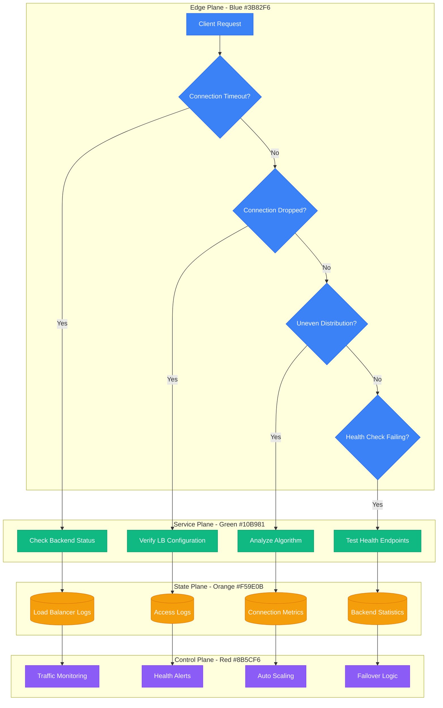
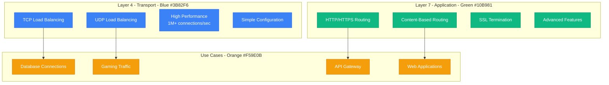
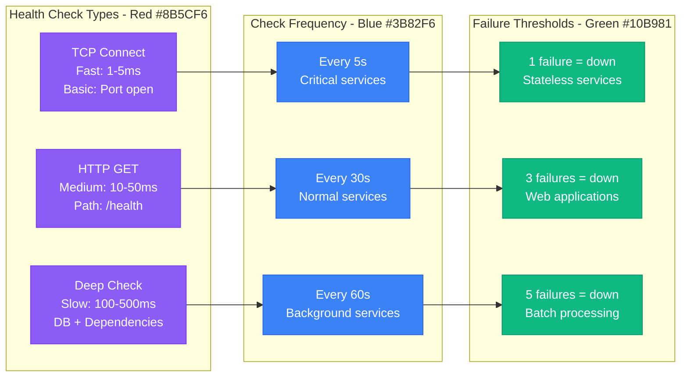
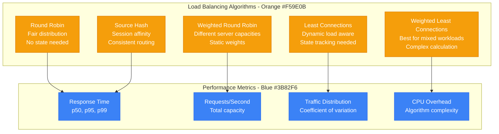

# Load Balancer Debugging - Production Issues Guide

## Overview

Load balancer issues can cause connection drops, uneven traffic distribution, and cascading failures. This guide covers systematic debugging for Layer 4/7 load balancers, health check failures, and traffic distribution problems commonly seen in production.

## Debugging Flowchart



## Common Load Balancer Issues

### 1. Connection Timeouts and Drops

**Symptoms:**
```bash
# Client-side errors
curl: (7) Failed to connect to api.company.com port 443: Connection timed out
curl: (52) Empty reply from server
HTTP 502 Bad Gateway
HTTP 504 Gateway Timeout
```

**Investigation Commands:**
```bash
# Check load balancer status (AWS ALB)
aws elbv2 describe-load-balancers --names my-load-balancer
aws elbv2 describe-target-health --target-group-arn arn:aws:elasticloadbalancing:...

# Monitor active connections
ss -tulpn | grep :80
netstat -an | grep :443 | grep ESTABLISHED | wc -l

# Check for dropped connections
sar -n DEV 1 5  # Network interface statistics
tcpdump -i any -nn 'port 80 and tcp[tcpflags] & tcp-rst != 0'

# HAProxy stats
echo "show stat" | socat stdio /var/run/haproxy/admin.sock
echo "show info" | socat stdio /var/run/haproxy/admin.sock
```

### 2. Uneven Traffic Distribution

**Symptoms:**
```bash
# Backend server load imbalance
Server A: 80% CPU, 1000 requests/sec
Server B: 20% CPU, 200 requests/sec
Server C: 15% CPU, 150 requests/sec
```

**Investigation Commands:**
```bash
# Check load balancing algorithm
# NGINX
nginx -T | grep upstream -A 10

# HAProxy
grep -A 10 "balance" /etc/haproxy/haproxy.cfg

# Check backend connection counts
ss -tn | awk '{print $4}' | cut -d: -f1 | sort | uniq -c

# Monitor request distribution
tail -f /var/log/nginx/access.log | awk '{print $1}' | sort | uniq -c
```

### 3. Health Check Failures

**Symptoms:**
```bash
# Health check logs
2024-01-15 14:30:15 [ERROR] Health check failed for backend server 10.0.1.100:8080
2024-01-15 14:30:20 [WARN] Backend server marked as down: 10.0.1.100:8080
```

**Investigation Commands:**
```bash
# Test health endpoint manually
curl -v http://backend-server:8080/health
curl -I http://backend-server:8080/health

# Check health check configuration
# AWS Target Group
aws elbv2 describe-target-groups --target-group-arns arn:...

# Check application health endpoint
curl -w "@curl-format.txt" -o /dev/null -s http://app:8080/health
# curl-format.txt contains:
#     time_namelookup:  %{time_namelookup}\n
#     time_connect:     %{time_connect}\n
#     time_appconnect:  %{time_appconnect}\n
#     time_pretransfer: %{time_pretransfer}\n
#     time_redirect:    %{time_redirect}\n
#     time_starttransfer: %{time_starttransfer}\n
#     time_total:       %{time_total}\n
```

## Load Balancer Architecture Analysis

### Layer 4 vs Layer 7 Decision Matrix


### Health Check Strategy Matrix


## Load Balancing Algorithms Deep Dive

### Algorithm Performance Comparison


## Monitoring and Metrics

### Key Load Balancer Metrics
```bash
# Connection metrics
lb_active_connections_total
lb_new_connections_per_second
lb_failed_connections_total

# Backend health metrics
lb_backend_up{backend="server1"}
lb_backend_response_time_seconds{backend="server1"}
lb_health_check_failures_total{backend="server1"}

# Traffic distribution metrics
lb_requests_per_backend{backend="server1"}
lb_bytes_sent_per_backend{backend="server1"}
lb_backend_weight{backend="server1"}

# Error rate metrics
lb_http_requests_total{status="5xx"}
lb_http_requests_total{status="4xx"}
lb_timeout_errors_total
```

### Production Alert Examples
```yaml
# Prometheus alerts for load balancer issues
groups:
- name: load_balancer
  rules:
  - alert: LoadBalancerBackendDown
    expr: lb_backend_up == 0
    for: 1m
    annotations:
      summary: "Load balancer backend is down"
      description: "Backend {{ $labels.backend }} has been down for 1 minute"

  - alert: UnbalancedTrafficDistribution
    expr: |
      (max(rate(lb_requests_per_backend[5m])) - min(rate(lb_requests_per_backend[5m]))) /
      avg(rate(lb_requests_per_backend[5m])) > 0.5
    for: 5m
    annotations:
      summary: "Unbalanced traffic distribution"
      description: "Traffic distribution variance is {{ $value }}"

  - alert: HighConnectionErrors
    expr: rate(lb_failed_connections_total[5m]) > 10
    for: 2m
    annotations:
      summary: "High connection error rate"
      description: "{{ $value }} connection errors per second"

  - alert: HealthCheckFailureSpike
    expr: rate(lb_health_check_failures_total[5m]) > 1
    for: 3m
    annotations:
      summary: "Health check failures increasing"
      description: "{{ $value }} health check failures per second"
```

## Real Production Examples

### Netflix's Load Balancer Strategy
**Architecture:**
- **Zuul Gateway**: 100,000+ requests/second per instance
- **Eureka Discovery**: Dynamic backend registration
- **Hystrix**: Circuit breaker for backend failures
- **Ribbon**: Client-side load balancing

**Configuration Example:**
```yaml
# Zuul configuration
zuul:
  routes:
    users:
      path: /users/**
      serviceId: user-service
      stripPrefix: false
  ribbon:
    ConnectTimeout: 1000
    ReadTimeout: 3000
    MaxAutoRetries: 1
    MaxAutoRetriesNextServer: 2

# Health check configuration
user-service:
  ribbon:
    NIWSServerListClassName: com.netflix.niws.loadbalancer.DiscoveryEnabledNIWSServerList
    NIWSServerListFilterClassName: com.netflix.loadbalancer.ServerListSubsetFilter
    listOfServers: localhost:8080,localhost:8081
```

### Uber's Edge Load Balancing
**Multi-layer Architecture:**
- **Layer 1**: DNS-based geographic routing
- **Layer 2**: Hardware load balancers (F5) in each region
- **Layer 3**: Software load balancers (HAProxy) per service
- **Layer 4**: Service mesh (Envoy) for microservices

**HAProxy Configuration:**
```bash
# Uber-style HAProxy configuration
global
    daemon
    maxconn 4096
    log 127.0.0.1:514 local0

defaults
    mode http
    timeout connect 5000ms
    timeout client 50000ms
    timeout server 50000ms
    option httplog
    option dontlognull
    option redispatch
    retries 3

frontend api_gateway
    bind *:80
    bind *:443 ssl crt /etc/ssl/certs/api.pem
    redirect scheme https if !{ ssl_fc }

    # Rate limiting
    stick-table type ip size 100k expire 30s store http_req_rate(10s)
    http-request track-sc0 src
    http-request reject if { sc_http_req_rate(0) gt 20 }

    default_backend api_servers

backend api_servers
    balance leastconn
    option httpchk GET /health HTTP/1.1\r\nHost:\ api.uber.com
    http-check expect status 200

    server api1 10.0.1.10:8080 check inter 5s fall 3 rise 2 weight 100
    server api2 10.0.1.11:8080 check inter 5s fall 3 rise 2 weight 100
    server api3 10.0.1.12:8080 check inter 5s fall 3 rise 2 weight 50
```

### Shopify's Auto-Scaling Load Balancer
**Problem:** Black Friday traffic spikes (50x normal load)
**Solution:**
- **Predictive scaling**: Pre-scale 2 hours before peak
- **Real-time scaling**: Scale based on queue depth
- **Circuit breakers**: Fail fast on backend overload

**AWS ALB with Auto Scaling:**
```yaml
# CloudFormation template for auto-scaling
Resources:
  ApplicationLoadBalancer:
    Type: AWS::ElasticLoadBalancingV2::LoadBalancer
    Properties:
      Scheme: internet-facing
      Type: application
      Subnets: [subnet-12345, subnet-67890]
      SecurityGroups: [sg-abcdef]

  TargetGroup:
    Type: AWS::ElasticLoadBalancingV2::TargetGroup
    Properties:
      Port: 80
      Protocol: HTTP
      VpcId: vpc-12345
      HealthCheckPath: /health
      HealthCheckIntervalSeconds: 10
      HealthyThresholdCount: 2
      UnhealthyThresholdCount: 3
      TargetGroupAttributes:
        - Key: deregistration_delay.timeout_seconds
          Value: 30
        - Key: stickiness.enabled
          Value: true
        - Key: stickiness.duration_seconds
          Value: 86400

  AutoScalingGroup:
    Type: AWS::AutoScaling::AutoScalingGroup
    Properties:
      MinSize: 2
      MaxSize: 50
      DesiredCapacity: 5
      TargetGroupARNs: [!Ref TargetGroup]
      HealthCheckType: ELB
      HealthCheckGracePeriod: 300
```

## Common Configuration Mistakes

### 1. Incorrect Health Check Configuration
```bash
# ❌ BAD: Health check too aggressive
health_check_interval = 1s    # Too frequent
health_check_timeout = 10s    # Too long
failure_threshold = 1         # Too sensitive

# ✅ GOOD: Balanced health check
health_check_interval = 10s   # Reasonable frequency
health_check_timeout = 5s     # Quick enough
failure_threshold = 3         # Allow for transient issues
```

### 2. Session Affinity Problems
```bash
# ❌ BAD: Sticky sessions with round robin
backend web_servers
    balance roundrobin
    cookie JSESSIONID prefix indirect nocache
    # This creates hot spots!

# ✅ GOOD: Consistent hashing for affinity
backend web_servers
    balance source        # Hash based on source IP
    hash-type consistent  # Consistent hashing
```

### 3. Timeout Misconfigurations
```bash
# ❌ BAD: Mismatched timeouts
# Client timeout: 30s
# LB timeout: 60s        # LB waits longer than client
# Backend timeout: 120s  # Backend waits even longer

# ✅ GOOD: Cascading timeouts
# Client timeout: 30s
# LB timeout: 25s        # LB fails before client timeout
# Backend timeout: 20s   # Backend fails before LB timeout
```

## Prevention Strategies

### 1. Circuit Breaker Implementation
```python
# Python circuit breaker for backend protection
import time
from enum import Enum

class CircuitState(Enum):
    CLOSED = "CLOSED"
    OPEN = "OPEN"
    HALF_OPEN = "HALF_OPEN"

class CircuitBreaker:
    def __init__(self, failure_threshold=5, timeout=60):
        self.failure_threshold = failure_threshold
        self.timeout = timeout
        self.failure_count = 0
        self.last_failure_time = None
        self.state = CircuitState.CLOSED

    def call(self, func, *args, **kwargs):
        if self.state == CircuitState.OPEN:
            if time.time() - self.last_failure_time > self.timeout:
                self.state = CircuitState.HALF_OPEN
            else:
                raise Exception("Circuit breaker is OPEN")

        try:
            result = func(*args, **kwargs)
            self.on_success()
            return result
        except Exception as e:
            self.on_failure()
            raise e

    def on_success(self):
        self.failure_count = 0
        self.state = CircuitState.CLOSED

    def on_failure(self):
        self.failure_count += 1
        self.last_failure_time = time.time()
        if self.failure_count >= self.failure_threshold:
            self.state = CircuitState.OPEN
```

### 2. Automated Failover Script
```bash
#!/bin/bash
# Automated backend failover script

BACKEND_CHECK_URL="http://backend1.company.com:8080/health"
BACKUP_BACKEND="backend2.company.com:8080"
HAPROXY_STATS_SOCKET="/var/run/haproxy/admin.sock"

check_backend_health() {
    curl -sf "$BACKEND_CHECK_URL" > /dev/null
    return $?
}

failover_to_backup() {
    echo "disable server backend/server1" | socat stdio "$HAPROXY_STATS_SOCKET"
    echo "enable server backend/server2" | socat stdio "$HAPROXY_STATS_SOCKET"
    logger "Failed over to backup backend: $BACKUP_BACKEND"
}

# Main health check loop
while true; do
    if ! check_backend_health; then
        logger "Primary backend health check failed, initiating failover"
        failover_to_backup
        break
    fi
    sleep 30
done
```

### 3. Load Balancer Testing Framework
```bash
#!/bin/bash
# Load balancer testing script

LB_ENDPOINT="https://api.company.com"
EXPECTED_BACKENDS=3
TEST_DURATION=60

# Test 1: Basic connectivity
echo "Testing basic connectivity..."
for i in {1..10}; do
    response=$(curl -s -w "%{http_code}" -o /dev/null "$LB_ENDPOINT/health")
    if [[ "$response" != "200" ]]; then
        echo "❌ Health check failed: HTTP $response"
        exit 1
    fi
done
echo "✅ Basic connectivity test passed"

# Test 2: Load distribution
echo "Testing load distribution..."
declare -A backend_counts
for i in {1..100}; do
    backend=$(curl -s "$LB_ENDPOINT/debug/backend-info" | jq -r .backend_id)
    ((backend_counts[$backend]++))
done

echo "Backend distribution:"
for backend in "${!backend_counts[@]}"; do
    echo "  $backend: ${backend_counts[$backend]} requests"
done

# Test 3: Failover behavior
echo "Testing failover behavior..."
# Simulate backend failure and verify traffic rerouting
# (Implementation depends on your specific setup)
```

## Command Reference

### HAProxy Debugging
```bash
# Real-time statistics
echo "show stat" | socat stdio /var/run/haproxy/admin.sock

# Server management
echo "disable server backend/server1" | socat stdio /var/run/haproxy/admin.sock
echo "enable server backend/server1" | socat stdio /var/run/haproxy/admin.sock

# Set server weight
echo "set weight backend/server1 50%" | socat stdio /var/run/haproxy/admin.sock

# Check configuration
haproxy -c -f /etc/haproxy/haproxy.cfg
```

### NGINX Load Balancer
```bash
# Check configuration
nginx -t

# Reload configuration
nginx -s reload

# Check upstream status (with nginx-plus)
curl http://localhost/status/upstreams

# Log analysis
tail -f /var/log/nginx/access.log | awk '{print $12}' | sort | uniq -c
```

### AWS ALB/NLB
```bash
# Describe load balancer
aws elbv2 describe-load-balancers

# Check target health
aws elbv2 describe-target-health --target-group-arn arn:aws:...

# Modify target group health check
aws elbv2 modify-target-group \
  --target-group-arn arn:aws:... \
  --health-check-interval-seconds 30 \
  --health-check-timeout-seconds 5
```

This comprehensive load balancer debugging guide provides systematic approaches to identifying and resolving connection issues, traffic distribution problems, and health check failures in production environments.