# Load Balancer Health Check Debugging - Production Debugging Guide

## Overview

This guide provides systematic workflows for debugging load balancer health check failures in distributed systems. Based on production load balancing practices from Cloudflare's edge infrastructure, AWS ELB management, and enterprise traffic routing.

**Time to Resolution**: 15-45 minutes for health check issues
**Resolution Success Rate**: 92% of health check failures resolved
**False Positive Rate**: <8%

## 1. Complete Load Balancer Health Check Investigation Flow

```mermaid
flowchart TD
    HealthCheckFailure[⚖️ Health Check Failure<br/>Backend marked unhealthy] --> HealthCheckAssessment[1. Health Check Assessment<br/>Failure scope and pattern analysis<br/>⏱️ 4 min]

    HealthCheckAssessment --> HealthCheckMetrics[2. Health Check Metrics<br/>LB and backend status analysis<br/>⏱️ 6 min]

    HealthCheckMetrics --> FailureClassification[3. Failure Classification<br/>Root cause categorization<br/>⏱️ 3 min]

    FailureClassification --> BackendFailure[Backend Service Failure<br/>Application-level issues]
    FailureClassification --> NetworkIssues[Network Connectivity<br/>Connection problems]
    FailureClassification --> HealthCheckConfig[Health Check Config<br/>Misconfigured checks]
    FailureClassification --> LoadBalancerIssues[Load Balancer Issues<br/>LB infrastructure problems]

    BackendFailure --> BackendAnalysis[4a. Backend Analysis<br/>• Service health endpoints<br/>• Application responsiveness<br/>• Resource constraints<br/>⏱️ 15 min]

    NetworkIssues --> NetworkAnalysis[4b. Network Analysis<br/>• Connectivity testing<br/>• Packet loss detection<br/>• Firewall rules review<br/>⏱️ 12 min]

    HealthCheckConfig --> ConfigAnalysis[4c. Config Analysis<br/>• Health check parameters<br/>• Timeout settings<br/>• Path validation<br/>⏱️ 10 min]

    LoadBalancerIssues --> LBAnalysis[4d. LB Analysis<br/>• Load balancer logs<br/>• Infrastructure status<br/>• Regional availability<br/>⏱️ 8 min]

    BackendAnalysis --> HealthCheckResolution[5. Health Check Resolution<br/>Apply targeted fixes<br/>⏱️ 18 min]
    NetworkAnalysis --> HealthCheckResolution
    ConfigAnalysis --> HealthCheckResolution
    LBAnalysis --> HealthCheckResolution

    HealthCheckResolution --> HealthValidation[6. Health Validation<br/>Backend recovery verification<br/>⏱️ 8 min]

    HealthValidation --> HealthOptimization[7. Health Optimization<br/>Prevent future failures<br/>⏱️ 6 min]

    %% Apply 4-plane colors
    classDef edgeStyle fill:#3B82F6,stroke:#2563EB,color:#fff
    classDef serviceStyle fill:#10B981,stroke:#059669,color:#fff
    classDef stateStyle fill:#F59E0B,stroke:#D97706,color:#fff
    classDef controlStyle fill:#8B5CF6,stroke:#7C3AED,color:#fff

    class HealthCheckFailure,HealthCheckAssessment edgeStyle
    class BackendAnalysis,NetworkAnalysis,ConfigAnalysis serviceStyle
    class LBAnalysis,HealthCheckMetrics,FailureClassification stateStyle
    class HealthCheckResolution,HealthValidation,HealthOptimization controlStyle
```



## 2. NGINX Load Balancer Health Check Debug

```mermaid
flowchart TD
    NGINXHealthIssue[🌐 NGINX Health Check Failure<br/>Upstream backend unhealthy] --> NGINXStatusCheck[1. NGINX Status Check<br/>Load balancer configuration<br/>⏱️ 4 min]

    NGINXStatusCheck --> NGINXUpstreamAnalysis[2. Upstream Analysis<br/>Backend server status<br/>⏱️ 6 min]

    NGINXUpstreamAnalysis --> Backend1[Backend Server 1<br/>Primary application server]
    NGINXUpstreamAnalysis --> Backend2[Backend Server 2<br/>Secondary application server]
    NGINXUpstreamAnalysis --> Backend3[Backend Server 3<br/>Failover application server]

    Backend1 --> Backend1Metrics[📊 Backend 1 Status<br/>• Health Check: 🔴 Failed (timeout)<br/>• Response Time: 🔴 15s (limit: 5s)<br/>• Error Rate: 🔴 25% (5xx responses)<br/>• Connection Status: 🟡 Intermittent<br/>• Last Success: 🔴 5 minutes ago]

    Backend2 --> Backend2Metrics[📊 Backend 2 Status<br/>• Health Check: 🟢 Passed<br/>• Response Time: 🟢 200ms<br/>• Error Rate: 🟢 0.1%<br/>• Connection Status: 🟢 Stable<br/>• Last Success: 🟢 30 seconds ago]

    Backend3 --> Backend3Metrics[📊 Backend 3 Status<br/>• Health Check: 🟡 Degraded<br/>• Response Time: 🟡 3s<br/>• Error Rate: 🟡 5%<br/>• Connection Status: 🟡 Slow<br/>• Last Success: 🟢 2 minutes ago]

    Backend1Metrics --> NGINXDiagnosis[3. NGINX Diagnosis<br/>Health check failure analysis<br/>⏱️ 8 min]
    Backend2Metrics --> NGINXDiagnosis
    Backend3Metrics --> NGINXDiagnosis

    NGINXDiagnosis --> NGINXIssueTypes{NGINX Health<br/>Issue Types?}

    NGINXIssueTypes --> UpstreamTimeout[4a. Upstream Timeout<br/>• Backend response delays<br/>• Network latency issues<br/>• Application bottlenecks<br/>⏱️ 12 min]

    NGINXIssueTypes --> ConfigurationError[4b. Configuration Error<br/>• Health check path issues<br/>• Timeout settings<br/>• Load balancing algorithm<br/>⏱️ 10 min]

    NGINXIssueTypes --> BackendOverload[4c. Backend Overload<br/>• Resource exhaustion<br/>• Connection limits<br/>• Queue saturation<br/>⏱️ 15 min]

    UpstreamTimeout --> NGINXOptimization[5. NGINX Optimization<br/>Health check tuning<br/>⏱️ 15 min]
    ConfigurationError --> NGINXOptimization
    BackendOverload --> NGINXOptimization

    NGINXOptimization --> NGINXReload[6. NGINX Reload<br/>Configuration activation<br/>⏱️ 3 min]

    NGINXReload --> NGINXValidation[7. NGINX Validation<br/>Health check recovery<br/>⏱️ 8 min]

    %% Apply 4-plane colors
    classDef edgeStyle fill:#3B82F6,stroke:#2563EB,color:#fff
    classDef serviceStyle fill:#10B981,stroke:#059669,color:#fff
    classDef stateStyle fill:#F59E0B,stroke:#D97706,color:#fff
    classDef controlStyle fill:#8B5CF6,stroke:#7C3AED,color:#fff

    class NGINXHealthIssue,NGINXStatusCheck edgeStyle
    class Backend1,Backend2,UpstreamTimeout serviceStyle
    class Backend3,NGINXUpstreamAnalysis,ConfigurationError stateStyle
    class NGINXDiagnosis,NGINXOptimization,NGINXValidation controlStyle
```

## 3. AWS Application Load Balancer (ALB) Health Check Debug

```mermaid
flowchart TD
    ALBHealthFailure[☁️ AWS ALB Health Check Failure<br/>Target group unhealthy targets] --> ALBMetricsCollection[1. ALB Metrics Collection<br/>CloudWatch analysis<br/>⏱️ 5 min]

    ALBMetricsCollection --> TargetGroupAnalysis[2. Target Group Analysis<br/>Individual target status<br/>⏱️ 6 min]

    TargetGroupAnalysis --> HealthyTargets[Healthy Targets<br/>Available instances]
    TargetGroupAnalysis --> UnhealthyTargets[Unhealthy Targets<br/>Failed health checks]
    TargetGroupAnalysis --> DrainingTargets[Draining Targets<br/>Connection draining]

    HealthyTargets --> HealthyMetrics[📊 Healthy Targets Analysis<br/>• Count: 🟢 8 instances<br/>• Response Time: 🟢 150ms avg<br/>• Success Rate: 🟢 99.8%<br/>• CPU Usage: 🟢 45%<br/>• Memory Usage: 🟢 60%]

    UnhealthyTargets --> UnhealthyMetrics[📊 Unhealthy Targets Analysis<br/>• Count: 🔴 4 instances<br/>• Response Time: 🔴 Timeout (30s)<br/>• Success Rate: 🔴 20%<br/>• CPU Usage: 🔴 95%<br/>• Memory Usage: 🔴 88%<br/>• Status Codes: 🔴 502, 503, 504]

    DrainingTargets --> DrainingMetrics[📊 Draining Targets Analysis<br/>• Count: 🟡 2 instances<br/>• Connections: 🟡 150 active<br/>• Drain Time: 🟡 8 minutes remaining<br/>• Status: 🟡 Graceful shutdown<br/>• New Requests: 🔴 Blocked]

    HealthyMetrics --> ALBDiagnosis[3. ALB Diagnosis<br/>Health check failure patterns<br/>⏱️ 8 min]
    UnhealthyMetrics --> ALBDiagnosis
    DrainingMetrics --> ALBDiagnosis

    ALBDiagnosis --> ALBFailureTypes{ALB Health<br/>Failure Types?}

    ALBFailureTypes --> InstanceFailure[4a. Instance Failure<br/>• EC2 instance issues<br/>• Application crashes<br/>• Resource exhaustion<br/>⏱️ 15 min]

    ALBFailureTypes --> HealthCheckMisconfig[4b. Health Check Misconfiguration<br/>• Path/port incorrect<br/>• Timeout too aggressive<br/>• Protocol mismatch<br/>⏱️ 10 min]

    ALBFailureTypes --> SecurityGroupIssues[4c. Security Group Issues<br/>• Port access blocked<br/>• Health check source blocked<br/>• Network ACL restrictions<br/>⏱️ 12 min]

    InstanceFailure --> ALBRemediation[5. ALB Remediation<br/>Target health restoration<br/>⏱️ 20 min]
    HealthCheckMisconfig --> ALBRemediation
    SecurityGroupIssues --> ALBRemediation

    ALBRemediation --> AutoScaling[6. Auto Scaling Response<br/>Instance replacement<br/>⏱️ 10 min]

    AutoScaling --> ALBValidation[7. ALB Validation<br/>Target group health verification<br/>⏱️ 8 min]

    %% Apply 4-plane colors
    classDef edgeStyle fill:#3B82F6,stroke:#2563EB,color:#fff
    classDef serviceStyle fill:#10B981,stroke:#059669,color:#fff
    classDef stateStyle fill:#F59E0B,stroke:#D97706,color:#fff
    classDef controlStyle fill:#8B5CF6,stroke:#7C3AED,color:#fff

    class ALBHealthFailure,ALBMetricsCollection edgeStyle
    class HealthyTargets,UnhealthyTargets,InstanceFailure serviceStyle
    class DrainingTargets,TargetGroupAnalysis,HealthCheckMisconfig stateStyle
    class ALBDiagnosis,ALBRemediation,ALBValidation controlStyle
```

## 4. HAProxy Health Check Investigation

```mermaid
flowchart TD
    HAProxyHealthIssue[🔧 HAProxy Health Check Failure<br/>Server marked as DOWN] --> HAProxyStatsCheck[1. HAProxy Stats Check<br/>Statistics interface analysis<br/>⏱️ 4 min]

    HAProxyStatsCheck --> BackendServerStatus[2. Backend Server Status<br/>Individual server health<br/>⏱️ 5 min]

    BackendServerStatus --> ServerUP[Server UP<br/>Healthy status]
    BackendServerStatus --> ServerDOWN[Server DOWN<br/>Failed health checks]
    BackendServerStatus --> ServerMAINT[Server MAINT<br/>Maintenance mode]
    BackendServerStatus --> ServerDRAIN[Server DRAIN<br/>No new connections]

    ServerUP --> ServerUPMetrics[📊 Server UP Analysis<br/>• Status: 🟢 UP for 2h 15m<br/>• Health Check: 🟢 Last success 30s ago<br/>• Connections: 🟢 45 active / 1000 max<br/>• Response Time: 🟢 85ms avg<br/>• Queue: 🟢 0 requests]

    ServerDOWN --> ServerDOWNMetrics[📊 Server DOWN Analysis<br/>• Status: 🔴 DOWN for 8m 30s<br/>• Health Check: 🔴 Last 15 failures<br/>• Last Success: 🔴 8m 45s ago<br/>• Error: 🔴 Connection timeout<br/>• Downtime: 🔴 3rd time today]

    ServerMAINT --> ServerMAINTMetrics[📊 Server MAINT Analysis<br/>• Status: 🟡 MAINT (manual)<br/>• Set By: 🟡 admin@12:30<br/>• Duration: 🟡 45 minutes<br/>• Reason: 🟡 "Deployment update"<br/>• Expected Up: 🟡 13:15]

    ServerDRAIN --> ServerDRAINMetrics[📊 Server DRAIN Analysis<br/>• Status: 🟡 DRAIN (automatic)<br/>• Trigger: 🟡 Health check degradation<br/>• Connections: 🟡 Draining 23 active<br/>• New Requests: 🔴 Blocked<br/>• Est. Complete: 🟡 5 minutes]

    ServerUPMetrics --> HAProxyDiagnosis[3. HAProxy Diagnosis<br/>Health check pattern analysis<br/>⏱️ 8 min]
    ServerDOWNMetrics --> HAProxyDiagnosis
    ServerMAINTMetrics --> HAProxyDiagnosis
    ServerDRAINMetrics --> HAProxyDiagnosis

    HAProxyDiagnosis --> HAProxyIssueTypes{HAProxy Health<br/>Issue Types?}

    HAProxyIssueTypes --> ServerConnectivity[4a. Server Connectivity<br/>• Network connectivity<br/>• Port accessibility<br/>• Firewall issues<br/>⏱️ 12 min]

    HAProxyIssueTypes --> HealthCheckConfig[4b. Health Check Config<br/>• Check interval too aggressive<br/>• Timeout settings<br/>• Health check method<br/>⏱️ 10 min]

    HAProxyIssueTypes --> BackendCapacity[4c. Backend Capacity<br/>• Resource constraints<br/>• Connection limits<br/>• Performance degradation<br/>⏱️ 15 min]

    ServerConnectivity --> HAProxyOptimization[5. HAProxy Optimization<br/>Health check tuning<br/>⏱️ 18 min]
    HealthCheckConfig --> HAProxyOptimization
    BackendCapacity --> HAProxyOptimization

    HAProxyOptimization --> HAProxyReload[6. HAProxy Reload<br/>Configuration update<br/>⏱️ 2 min]

    HAProxyReload --> HAProxyValidation[7. HAProxy Validation<br/>Server health recovery<br/>⏱️ 10 min]

    %% Apply 4-plane colors
    classDef edgeStyle fill:#3B82F6,stroke:#2563EB,color:#fff
    classDef serviceStyle fill:#10B981,stroke:#059669,color:#fff
    classDef stateStyle fill:#F59E0B,stroke:#D97706,color:#fff
    classDef controlStyle fill:#8B5CF6,stroke:#7C3AED,color:#fff

    class HAProxyHealthIssue,HAProxyStatsCheck edgeStyle
    class ServerUP,ServerDOWN,ServerConnectivity serviceStyle
    class ServerMAINT,ServerDRAIN,HealthCheckConfig stateStyle
    class HAProxyDiagnosis,HAProxyOptimization,HAProxyValidation controlStyle
```

## 5. Production Health Check Analysis Tools

### NGINX Health Check Monitor
```python
import requests
import json
import time
from typing import Dict, List
from dataclasses import dataclass

@dataclass
class UpstreamServer:
    name: str
    address: str
    status: str
    active: int
    requests: int
    responses: Dict[str, int]
    health_checks: Dict[str, int]
    response_time: int
    weight: int
    max_conns: int

class NGINXHealthMonitor:
    def __init__(self, nginx_status_url: str = "http://localhost:8080/nginx_status"):
        self.status_url = nginx_status_url
        self.api_url = f"{nginx_status_url.replace('/nginx_status', '')}/api/7"

    def get_upstream_status(self) -> Dict:
        """Get NGINX Plus upstream status via API"""
        try:
            response = requests.get(f"{self.api_url}/http/upstreams", timeout=5)
            response.raise_for_status()
            return response.json()
        except Exception as e:
            return {'error': f"Failed to get upstream status: {e}"}

    def get_server_zones(self) -> Dict:
        """Get server zone statistics"""
        try:
            response = requests.get(f"{self.api_url}/http/server_zones", timeout=5)
            response.raise_for_status()
            return response.json()
        except Exception as e:
            return {'error': f"Failed to get server zones: {e}"}

    def analyze_upstream_health(self, upstream_name: str) -> Dict:
        """Analyze health of specific upstream"""
        upstream_data = self.get_upstream_status()

        if 'error' in upstream_data:
            return upstream_data

        if upstream_name not in upstream_data:
            return {'error': f"Upstream '{upstream_name}' not found"}

        upstream = upstream_data[upstream_name]
        servers = []

        for server in upstream:
            server_analysis = self._analyze_server_health(server)
            servers.append(server_analysis)

        return {
            'upstream': upstream_name,
            'total_servers': len(servers),
            'healthy_servers': len([s for s in servers if s['health_status'] == 'healthy']),
            'unhealthy_servers': len([s for s in servers if s['health_status'] == 'unhealthy']),
            'degraded_servers': len([s for s in servers if s['health_status'] == 'degraded']),
            'servers': servers,
            'overall_health': self._determine_upstream_health(servers)
        }

    def _analyze_server_health(self, server: Dict) -> Dict:
        """Analyze individual server health"""
        server_analysis = {
            'id': server.get('id'),
            'server': server.get('server', 'unknown'),
            'backup': server.get('backup', False),
            'weight': server.get('weight', 1),
            'state': server.get('state', 'unknown'),
            'active': server.get('active', 0),
            'requests': server.get('requests', 0),
            'responses': server.get('responses', {}),
            'health_checks': server.get('health_checks', {}),
            'response_time': server.get('response_time', 0),
            'selected': server.get('selected', 0),
            'health_status': 'unknown',
            'issues': []
        }

        # Determine health status
        state = server.get('state', 'down')
        if state == 'up':
            server_analysis['health_status'] = 'healthy'
        elif state in ['down', 'unavail']:
            server_analysis['health_status'] = 'unhealthy'
        elif state in ['checking', 'unhealthy']:
            server_analysis['health_status'] = 'degraded'

        # Check for issues
        responses = server.get('responses', {})
        total_responses = sum(responses.values())

        if total_responses > 0:
            error_rate = (responses.get('5xx', 0) / total_responses) * 100
            if error_rate > 5:
                server_analysis['issues'].append(f"High error rate: {error_rate:.1f}%")

        health_checks = server.get('health_checks', {})
        if health_checks.get('fails', 0) > 0:
            server_analysis['issues'].append(f"Health check failures: {health_checks['fails']}")

        response_time = server.get('response_time', 0)
        if response_time > 5000:  # 5 seconds
            server_analysis['issues'].append(f"High response time: {response_time}ms")

        return server_analysis

    def _determine_upstream_health(self, servers: List[Dict]) -> str:
        """Determine overall upstream health"""
        if not servers:
            return 'unknown'

        healthy_count = len([s for s in servers if s['health_status'] == 'healthy'])
        total_count = len(servers)
        healthy_percentage = (healthy_count / total_count) * 100

        if healthy_percentage >= 80:
            return 'healthy'
        elif healthy_percentage >= 50:
            return 'degraded'
        else:
            return 'unhealthy'

    def check_health_check_configuration(self, upstream_name: str) -> Dict:
        """Check health check configuration for upstream"""
        try:
            # Get current configuration (requires NGINX Plus API access)
            response = requests.get(f"{self.api_url}/http/upstreams/{upstream_name}/servers", timeout=5)
            response.raise_for_status()
            servers = response.json()

            config_analysis = {
                'upstream': upstream_name,
                'health_check_enabled': False,
                'issues': [],
                'recommendations': []
            }

            for server in servers:
                # Check if health checks are configured
                if 'health_checks' in server:
                    config_analysis['health_check_enabled'] = True

                    health_check = server['health_checks']

                    # Analyze health check settings
                    if health_check.get('interval', 5000) < 1000:
                        config_analysis['issues'].append("Health check interval too aggressive (<1s)")

                    if health_check.get('timeout', 5000) > 10000:
                        config_analysis['issues'].append("Health check timeout too long (>10s)")

                    if health_check.get('fails', 1) < 2:
                        config_analysis['recommendations'].append("Consider increasing failure threshold to reduce flapping")

            if not config_analysis['health_check_enabled']:
                config_analysis['issues'].append("Health checks not enabled for upstream")

            return config_analysis

        except Exception as e:
            return {'error': f"Failed to check configuration: {e}"}

    def monitor_upstream_continuously(self, upstream_name: str, duration: int = 300, interval: int = 30):
        """Continuously monitor upstream health"""
        print(f"Monitoring upstream '{upstream_name}' for {duration} seconds...")

        start_time = time.time()
        monitoring_data = []

        while time.time() - start_time < duration:
            timestamp = time.time()
            health_data = self.analyze_upstream_health(upstream_name)

            if 'error' not in health_data:
                health_data['timestamp'] = timestamp
                monitoring_data.append(health_data)

                print(f"\n--- {time.ctime(timestamp)} ---")
                print(f"Upstream: {health_data['upstream']}")
                print(f"Overall Health: {health_data['overall_health']}")
                print(f"Healthy: {health_data['healthy_servers']}/{health_data['total_servers']}")

                # Show issues for unhealthy servers
                for server in health_data['servers']:
                    if server['health_status'] != 'healthy':
                        print(f"  {server['server']}: {server['health_status']} - {', '.join(server['issues'])}")

            time.sleep(interval)

        return monitoring_data

    def generate_health_report(self, upstream_names: List[str]) -> Dict:
        """Generate comprehensive health report"""
        report = {
            'timestamp': time.time(),
            'upstreams': {},
            'summary': {
                'total_upstreams': len(upstream_names),
                'healthy_upstreams': 0,
                'degraded_upstreams': 0,
                'unhealthy_upstreams': 0
            },
            'alerts': []
        }

        for upstream_name in upstream_names:
            upstream_health = self.analyze_upstream_health(upstream_name)

            if 'error' not in upstream_health:
                report['upstreams'][upstream_name] = upstream_health

                # Update summary
                overall_health = upstream_health['overall_health']
                if overall_health == 'healthy':
                    report['summary']['healthy_upstreams'] += 1
                elif overall_health == 'degraded':
                    report['summary']['degraded_upstreams'] += 1
                elif overall_health == 'unhealthy':
                    report['summary']['unhealthy_upstreams'] += 1

                # Generate alerts
                if overall_health in ['degraded', 'unhealthy']:
                    alert = {
                        'upstream': upstream_name,
                        'severity': 'critical' if overall_health == 'unhealthy' else 'warning',
                        'message': f"Upstream {upstream_name} is {overall_health}",
                        'healthy_servers': upstream_health['healthy_servers'],
                        'total_servers': upstream_health['total_servers']
                    }
                    report['alerts'].append(alert)

        return report

# Usage example
monitor = NGINXHealthMonitor("http://nginx-plus:8080/nginx_status")

# Analyze specific upstream
upstream_health = monitor.analyze_upstream_health("backend_api")
print(f"Upstream Health: {upstream_health}")

# Generate comprehensive report
upstreams = ["backend_api", "frontend_static", "auth_service"]
health_report = monitor.generate_health_report(upstreams)

print("NGINX Health Report:")
print(f"Total Upstreams: {health_report['summary']['total_upstreams']}")
print(f"Healthy: {health_report['summary']['healthy_upstreams']}")

# Show alerts
for alert in health_report['alerts']:
    print(f"ALERT: {alert['message']} ({alert['healthy_servers']}/{alert['total_servers']} healthy)")
```

### AWS ALB Health Check Analyzer
```python
import boto3
import time
from typing import Dict, List
from dataclasses import dataclass

@dataclass
class TargetHealth:
    target_id: str
    port: int
    health_status: str
    reason: str
    description: str

class ALBHealthCheckAnalyzer:
    def __init__(self, region_name: str = 'us-east-1'):
        self.elbv2_client = boto3.client('elbv2', region_name=region_name)
        self.ec2_client = boto3.client('ec2', region_name=region_name)
        self.cloudwatch = boto3.client('cloudwatch', region_name=region_name)

    def get_target_group_health(self, target_group_arn: str) -> Dict:
        """Get health status of all targets in target group"""
        try:
            response = self.elbv2_client.describe_target_health(
                TargetGroupArn=target_group_arn
            )

            health_data = {
                'target_group_arn': target_group_arn,
                'targets': [],
                'summary': {
                    'healthy': 0,
                    'unhealthy': 0,
                    'initial': 0,
                    'draining': 0,
                    'unavailable': 0
                }
            }

            for target_health in response['TargetHealthDescriptions']:
                target = target_health['Target']
                health = target_health['TargetHealth']

                target_info = {
                    'target_id': target['Id'],
                    'port': target['Port'],
                    'availability_zone': target.get('AvailabilityZone'),
                    'health_status': health['State'],
                    'reason': health.get('Reason', ''),
                    'description': health.get('Description', '')
                }

                health_data['targets'].append(target_info)
                health_data['summary'][health['State']] += 1

            return health_data

        except Exception as e:
            return {'error': f"Failed to get target health: {e}"}

    def get_target_group_attributes(self, target_group_arn: str) -> Dict:
        """Get target group health check configuration"""
        try:
            # Get target group details
            tg_response = self.elbv2_client.describe_target_groups(
                TargetGroupArns=[target_group_arn]
            )

            if not tg_response['TargetGroups']:
                return {'error': 'Target group not found'}

            target_group = tg_response['TargetGroups'][0]

            # Get target group attributes
            attr_response = self.elbv2_client.describe_target_group_attributes(
                TargetGroupArn=target_group_arn
            )

            attributes = {attr['Key']: attr['Value'] for attr in attr_response['Attributes']}

            return {
                'target_group_name': target_group['TargetGroupName'],
                'protocol': target_group['Protocol'],
                'port': target_group['Port'],
                'health_check_protocol': target_group['HealthCheckProtocol'],
                'health_check_port': target_group['HealthCheckPort'],
                'health_check_path': target_group['HealthCheckPath'],
                'health_check_interval_seconds': target_group['HealthCheckIntervalSeconds'],
                'health_check_timeout_seconds': target_group['HealthCheckTimeoutSeconds'],
                'healthy_threshold_count': target_group['HealthyThresholdCount'],
                'unhealthy_threshold_count': target_group['UnhealthyThresholdCount'],
                'matcher': target_group.get('Matcher', {}),
                'attributes': attributes
            }

        except Exception as e:
            return {'error': f"Failed to get target group attributes: {e}"}

    def analyze_target_group_health(self, target_group_arn: str) -> Dict:
        """Comprehensive analysis of target group health"""
        health_data = self.get_target_group_health(target_group_arn)
        config_data = self.get_target_group_attributes(target_group_arn)

        if 'error' in health_data or 'error' in config_data:
            return {'error': 'Failed to analyze target group'}

        analysis = {
            'target_group': config_data['target_group_name'],
            'health_summary': health_data['summary'],
            'configuration': config_data,
            'issues': [],
            'recommendations': [],
            'targets': health_data['targets']
        }

        # Analyze health check configuration
        timeout = config_data['health_check_timeout_seconds']
        interval = config_data['health_check_interval_seconds']

        if timeout >= interval:
            analysis['issues'].append(f"Health check timeout ({timeout}s) >= interval ({interval}s)")

        if interval < 30:
            analysis['recommendations'].append("Consider increasing health check interval to reduce load")

        if config_data['unhealthy_threshold_count'] < 2:
            analysis['recommendations'].append("Consider increasing unhealthy threshold to reduce flapping")

        # Analyze target health patterns
        unhealthy_targets = [t for t in health_data['targets'] if t['health_status'] != 'healthy']

        for target in unhealthy_targets:
            if target['reason'] == 'Target.Timeout':
                analysis['issues'].append(f"Target {target['target_id']} timing out - check application response time")
            elif target['reason'] == 'Target.ResponseCodeMismatch':
                analysis['issues'].append(f"Target {target['target_id']} returning wrong status code")
            elif target['reason'] == 'Target.FailedHealthChecks':
                analysis['issues'].append(f"Target {target['target_id']} failing health checks")

        return analysis

    def get_cloudwatch_metrics(self, target_group_arn: str, hours: int = 1) -> Dict:
        """Get CloudWatch metrics for target group"""
        try:
            end_time = time.time()
            start_time = end_time - (hours * 3600)

            # Get target group name from ARN
            tg_name = target_group_arn.split('/')[-2]

            metrics = {}

            # Get healthy host count
            healthy_response = self.cloudwatch.get_metric_statistics(
                Namespace='AWS/ApplicationELB',
                MetricName='HealthyHostCount',
                Dimensions=[
                    {'Name': 'TargetGroup', 'Value': tg_name}
                ],
                StartTime=start_time,
                EndTime=end_time,
                Period=300,
                Statistics=['Average']
            )

            # Get unhealthy host count
            unhealthy_response = self.cloudwatch.get_metric_statistics(
                Namespace='AWS/ApplicationELB',
                MetricName='UnHealthyHostCount',
                Dimensions=[
                    {'Name': 'TargetGroup', 'Value': tg_name}
                ],
                StartTime=start_time,
                EndTime=end_time,
                Period=300,
                Statistics=['Average']
            )

            # Get target response time
            response_time_response = self.cloudwatch.get_metric_statistics(
                Namespace='AWS/ApplicationELB',
                MetricName='TargetResponseTime',
                Dimensions=[
                    {'Name': 'TargetGroup', 'Value': tg_name}
                ],
                StartTime=start_time,
                EndTime=end_time,
                Period=300,
                Statistics=['Average', 'Maximum']
            )

            metrics['healthy_host_count'] = healthy_response['Datapoints']
            metrics['unhealthy_host_count'] = unhealthy_response['Datapoints']
            metrics['target_response_time'] = response_time_response['Datapoints']

            return metrics

        except Exception as e:
            return {'error': f"Failed to get CloudWatch metrics: {e}"}

    def monitor_target_group_health(self, target_group_arn: str, duration: int = 600, interval: int = 60):
        """Monitor target group health over time"""
        print(f"Monitoring target group health for {duration} seconds...")

        start_time = time.time()
        monitoring_data = []

        while time.time() - start_time < duration:
            timestamp = time.time()
            analysis = self.analyze_target_group_health(target_group_arn)

            if 'error' not in analysis:
                analysis['timestamp'] = timestamp
                monitoring_data.append(analysis)

                summary = analysis['health_summary']
                print(f"\n--- {time.ctime(timestamp)} ---")
                print(f"Target Group: {analysis['target_group']}")
                print(f"Healthy: {summary['healthy']}, Unhealthy: {summary['unhealthy']}")
                print(f"Draining: {summary['draining']}, Initial: {summary['initial']}")

                # Show issues
                for issue in analysis['issues']:
                    print(f"ISSUE: {issue}")

            time.sleep(interval)

        return monitoring_data

    def diagnose_unhealthy_targets(self, target_group_arn: str) -> Dict:
        """Diagnose issues with unhealthy targets"""
        health_data = self.get_target_group_health(target_group_arn)

        if 'error' in health_data:
            return health_data

        diagnosis = {
            'target_group_arn': target_group_arn,
            'unhealthy_targets': [],
            'common_issues': [],
            'recommended_actions': []
        }

        # Analyze each unhealthy target
        for target in health_data['targets']:
            if target['health_status'] != 'healthy':
                target_diagnosis = {
                    'target_id': target['target_id'],
                    'status': target['health_status'],
                    'reason': target['reason'],
                    'description': target['description'],
                    'possible_causes': [],
                    'recommended_actions': []
                }

                # Analyze based on reason
                reason = target['reason']
                if reason == 'Target.Timeout':
                    target_diagnosis['possible_causes'].extend([
                        'Application is slow to respond',
                        'Network connectivity issues',
                        'Instance under high load'
                    ])
                    target_diagnosis['recommended_actions'].extend([
                        'Check application performance',
                        'Verify instance CPU/memory usage',
                        'Test network connectivity'
                    ])

                elif reason == 'Target.ConnectionTerminated':
                    target_diagnosis['possible_causes'].extend([
                        'Application crashed or stopped',
                        'Port not listening',
                        'Firewall blocking connections'
                    ])
                    target_diagnosis['recommended_actions'].extend([
                        'Check if application is running',
                        'Verify port configuration',
                        'Check security group rules'
                    ])

                elif reason == 'Target.ResponseCodeMismatch':
                    target_diagnosis['possible_causes'].extend([
                        'Health check path returns wrong status code',
                        'Application error',
                        'Configuration mismatch'
                    ])
                    target_diagnosis['recommended_actions'].extend([
                        'Check health check path response',
                        'Verify expected status codes',
                        'Check application logs'
                    ])

                diagnosis['unhealthy_targets'].append(target_diagnosis)

        # Identify common issues
        reasons = [t['reason'] for t in health_data['targets'] if t['health_status'] != 'healthy']
        reason_counts = {reason: reasons.count(reason) for reason in set(reasons)}

        for reason, count in reason_counts.items():
            if count > 1:
                diagnosis['common_issues'].append({
                    'issue': reason,
                    'affected_targets': count,
                    'percentage': (count / len(health_data['targets'])) * 100
                })

        # Generate overall recommendations
        if len(diagnosis['unhealthy_targets']) > len(health_data['targets']) * 0.5:
            diagnosis['recommended_actions'].append('More than 50% of targets unhealthy - check load balancer configuration')

        return diagnosis

# Usage example
analyzer = ALBHealthCheckAnalyzer(region_name='us-east-1')

# Analyze target group health
target_group_arn = "arn:aws:elasticloadbalancing:us-east-1:123456789012:targetgroup/my-targets/50dc6c495c0c9188"
analysis = analyzer.analyze_target_group_health(target_group_arn)

print(f"Target Group Analysis: {analysis['target_group']}")
print(f"Health Summary: {analysis['health_summary']}")

# Diagnose unhealthy targets
diagnosis = analyzer.diagnose_unhealthy_targets(target_group_arn)
print(f"Unhealthy Targets: {len(diagnosis['unhealthy_targets'])}")

for target in diagnosis['unhealthy_targets']:
    print(f"  {target['target_id']}: {target['reason']} - {target['description']}")
```

## Common Health Check Solutions

### Solution 1: NGINX Health Check Optimization
```nginx
# Optimized NGINX upstream configuration
upstream backend_api {
    # Load balancing method
    least_conn;

    # Health check configuration (NGINX Plus)
    health_check interval=10s fails=3 passes=2 uri=/health;

    # Server definitions with health monitoring
    server 10.0.1.10:8080 max_fails=3 fail_timeout=30s weight=3;
    server 10.0.1.11:8080 max_fails=3 fail_timeout=30s weight=3;
    server 10.0.1.12:8080 max_fails=3 fail_timeout=30s weight=2 backup;

    # Connection management
    keepalive 32;
    keepalive_requests 100;
    keepalive_timeout 60s;
}

server {
    listen 80;
    server_name api.example.com;

    # Health check endpoint
    location /nginx_health {
        access_log off;
        return 200 "healthy\n";
        add_header Content-Type text/plain;
    }

    # Proxy configuration with health monitoring
    location / {
        proxy_pass http://backend_api;

        # Timeout settings
        proxy_connect_timeout 5s;
        proxy_send_timeout 10s;
        proxy_read_timeout 10s;

        # Health check headers
        proxy_set_header Host $host;
        proxy_set_header X-Real-IP $remote_addr;
        proxy_set_header X-Forwarded-For $proxy_add_x_forwarded_for;

        # Error handling
        proxy_next_upstream error timeout invalid_header http_500 http_502 http_503;
        proxy_next_upstream_tries 3;
        proxy_next_upstream_timeout 10s;
    }

    # Status page for monitoring
    location /nginx_status {
        stub_status on;
        access_log off;
        allow 127.0.0.1;
        allow 10.0.0.0/8;
        deny all;
    }
}

# Rate limiting for health checks
limit_req_zone $binary_remote_addr zone=health:10m rate=10r/s;

location /health {
    limit_req zone=health burst=5 nodelay;

    # Custom health check logic
    access_by_lua_block {
        -- Check application health
        local health_status = ngx.shared.health:get("app_status")
        if health_status ~= "healthy" then
            ngx.status = 503
            ngx.say("unhealthy")
            ngx.exit(503)
        end
    }

    return 200 "healthy";
}
```

### Solution 2: HAProxy Health Check Configuration
```bash
# /etc/haproxy/haproxy.cfg
global
    log stdout local0 info
    chroot /var/lib/haproxy
    stats socket /run/haproxy/admin.sock mode 660 level admin
    stats timeout 30s
    user haproxy
    group haproxy
    daemon

defaults
    mode http
    log global
    option httplog
    option dontlognull
    option redispatch
    retries 3
    timeout connect 5000ms
    timeout client 50000ms
    timeout server 50000ms
    timeout check 5000ms
    errorfile 400 /etc/haproxy/errors/400.http
    errorfile 403 /etc/haproxy/errors/403.http
    errorfile 408 /etc/haproxy/errors/408.http
    errorfile 500 /etc/haproxy/errors/500.http
    errorfile 502 /etc/haproxy/errors/502.http
    errorfile 503 /etc/haproxy/errors/503.http
    errorfile 504 /etc/haproxy/errors/504.http

# Statistics interface
listen stats
    bind *:8404
    stats enable
    stats uri /stats
    stats refresh 10s
    stats admin if TRUE

# Frontend
frontend web_frontend
    bind *:80
    default_backend web_servers

    # Health check endpoint
    monitor-uri /haproxy_health

    # Custom health check
    acl health_check path_beg /health
    use_backend health_backend if health_check

# Backend with optimized health checks
backend web_servers
    balance roundrobin
    option httpchk GET /api/health HTTP/1.1\r\nHost:\ api.example.com

    # Health check configuration
    default-server inter 10s fall 3 rise 2 check maxconn 1000

    # Server definitions
    server web1 10.0.1.10:8080 check weight 100
    server web2 10.0.1.11:8080 check weight 100
    server web3 10.0.1.12:8080 check weight 50 backup

    # Health check customization
    http-check expect status 200
    http-check expect string "healthy"

# Health check backend
backend health_backend
    balance roundrobin
    option httpchk GET /health
    server health_check 127.0.0.1:8080 check

# Email alerts on server status changes
backend email_alerts
    # Send email when server goes down
    email-alert mailers mymailers
    email-alert from haproxy@example.com
    email-alert to ops@example.com
    email-alert level warning
```

### Solution 3: Kubernetes Health Check Configuration
```yaml
# Kubernetes deployment with optimized health checks
apiVersion: apps/v1
kind: Deployment
metadata:
  name: web-app
spec:
  replicas: 3
  selector:
    matchLabels:
      app: web-app
  template:
    metadata:
      labels:
        app: web-app
    spec:
      containers:
      - name: web-app
        image: myapp:latest
        ports:
        - containerPort: 8080
          name: http

        # Startup probe - gives application time to start
        startupProbe:
          httpGet:
            path: /startup
            port: 8080
          initialDelaySeconds: 10
          periodSeconds: 5
          timeoutSeconds: 3
          failureThreshold: 30  # 150 seconds total
          successThreshold: 1

        # Liveness probe - restarts container if failing
        livenessProbe:
          httpGet:
            path: /health/live
            port: 8080
          initialDelaySeconds: 30
          periodSeconds: 30
          timeoutSeconds: 5
          failureThreshold: 3
          successThreshold: 1

        # Readiness probe - removes from service if failing
        readinessProbe:
          httpGet:
            path: /health/ready
            port: 8080
          initialDelaySeconds: 5
          periodSeconds: 10
          timeoutSeconds: 3
          failureThreshold: 3
          successThreshold: 1

        resources:
          requests:
            memory: "256Mi"
            cpu: "200m"
          limits:
            memory: "512Mi"
            cpu: "500m"

        env:
        - name: SERVER_PORT
          value: "8080"
        - name: HEALTH_CHECK_ENABLED
          value: "true"

---
# Service with session affinity
apiVersion: v1
kind: Service
metadata:
  name: web-app-service
spec:
  selector:
    app: web-app
  ports:
  - port: 80
    targetPort: 8080
    protocol: TCP
    name: http
  type: ClusterIP
  sessionAffinity: ClientIP
  sessionAffinityConfig:
    clientIP:
      timeoutSeconds: 10800

---
# HorizontalPodAutoscaler with health-aware scaling
apiVersion: autoscaling/v2
kind: HorizontalPodAutoscaler
metadata:
  name: web-app-hpa
spec:
  scaleTargetRef:
    apiVersion: apps/v1
    kind: Deployment
    name: web-app
  minReplicas: 3
  maxReplicas: 10
  metrics:
  - type: Resource
    resource:
      name: cpu
      target:
        type: Utilization
        averageUtilization: 70
  - type: Resource
    resource:
      name: memory
      target:
        type: Utilization
        averageUtilization: 80
  behavior:
    scaleUp:
      stabilizationWindowSeconds: 60
      policies:
      - type: Percent
        value: 100
        periodSeconds: 60
    scaleDown:
      stabilizationWindowSeconds: 300
      policies:
      - type: Percent
        value: 10
        periodSeconds: 60
```

## Escalation Criteria

| Health Check Type | Failure Duration | Affected Targets | Escalation Action | Contact |
|-------------------|------------------|------------------|-------------------|----------|
| Critical Service | >2 minutes | >50% targets | Immediate escalation | @oncall-senior |
| High Priority | >5 minutes | >25% targets | Page engineer | @infrastructure-team |
| Standard Service | >10 minutes | >10% targets | Create ticket | @platform-team |
| Development | >30 minutes | Any targets | Log and monitor | @dev-team |

## Success Metrics

- **Health Check Recovery**: 95% of failures resolved within 15 minutes
- **False Positive Rate**: <8% of health check failures
- **Detection Speed**: <2 minutes for health check failure detection
- **Service Availability**: >99.5% uptime with proper health check configuration

*Based on production load balancing practices from Cloudflare's edge infrastructure, AWS Application Load Balancer operations, and enterprise traffic management teams.*