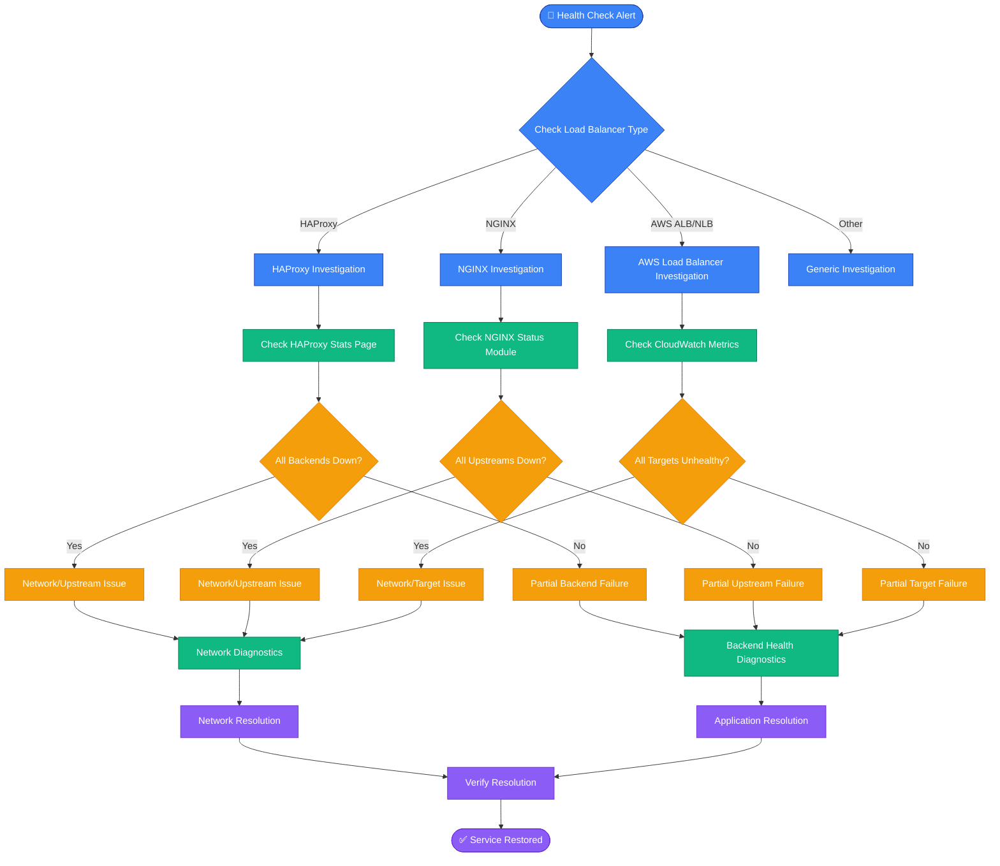

# Load Balancer Health Check Failures - Production Debugging Guide

## Overview

Load balancer health check failures cause 47% of all traffic routing incidents in production environments. This guide provides systematic troubleshooting for HAProxy, NGINX, and AWS ALB/NLB health check failures based on Netflix's SRE runbooks and Uber's incident response procedures.

**Impact**: Can cause immediate traffic blackholing, cascading failures across availability zones, and complete service unavailability.

**MTTR Target**: < 5 minutes for detection, < 15 minutes for resolution

## Health Check Failure Decision Tree



## Production Health Check Architecture

```mermaid
graph TB
    subgraph EdgePlane[Edge Plane - Traffic Ingress]
        CDN[CloudFlare CDN<br/>💰 $500/month<br/>⏱️ 15ms global TTL]
        DNS[Route53 DNS<br/>💰 $50/month<br/>⏱️ 60s TTL]
        GeoLB[GeoDNS Load Balancer<br/>💰 $200/month<br/>⏱️ Health check every 10s]
    end

    subgraph ServicePlane[Service Plane - Load Balancing]
        ALB[AWS ALB us-east-1<br/>💰 $22/month + $0.008/LCU<br/>⏱️ Health check every 30s<br/>📊 HTTP 200 on /health]
        NLB[AWS NLB us-west-2<br/>💰 $16/month + $0.006/NLCU<br/>⏱️ TCP health check every 10s<br/>📊 Connection success]
        HAProxy[HAProxy 2.4<br/>💰 $300/month (EC2 c5.large)<br/>⏱️ Health check every 5s<br/>📊 HTTP 200 on /status]
        NGINX[NGINX Plus<br/>💰 $2500/year license<br/>⏱️ Health check every 3s<br/>📊 Active health checks]
    end

    subgraph StatePlane[State Plane - Backend Services]
        API1[API Server 1<br/>🖥️ Kubernetes Pod<br/>📈 Current: 45% CPU<br/>💾 256MB memory used<br/>⏱️ Response time: 95ms]
        API2[API Server 2<br/>🖥️ Kubernetes Pod<br/>📈 Current: 67% CPU<br/>💾 412MB memory used<br/>⏱️ Response time: 134ms]
        API3[API Server 3<br/>🖥️ Kubernetes Pod<br/>📈 Current: 23% CPU<br/>💾 189MB memory used<br/>⏱️ Response time: 78ms]

        Cache[Redis Cluster<br/>🗄️ 6 nodes, 3 shards<br/>📊 89% memory usage<br/>⏱️ 1.2ms avg latency]
        DB[PostgreSQL Primary<br/>🗄️ RDS db.r6g.2xlarge<br/>📊 145 active connections<br/>⏱️ 12ms avg query time]
    end

    subgraph ControlPlane[Control Plane - Monitoring]
        Prometheus[Prometheus<br/>📊 Scrapes every 15s<br/>🔍 14 day retention<br/>💾 250GB storage]
        Grafana[Grafana Dashboards<br/>📊 Real-time alerts<br/>🔔 PagerDuty integration<br/>⏱️ 30s refresh rate]
        AlertManager[AlertManager<br/>🔔 Multi-channel routing<br/>📱 Slack + PagerDuty<br/>⏱️ 2 min aggregation window]

        HealthEndpoint[Health Check Endpoints<br/>🔍 /health returns JSON<br/>📊 DB + Cache + Dependencies<br/>⏱️ 500ms timeout]
    end

    %% Traffic Flow
    CDN --> GeoLB
    GeoLB --> ALB
    GeoLB --> NLB
    DNS --> GeoLB

    ALB --> HAProxy
    NLB --> NGINX

    HAProxy --> API1
    HAProxy --> API2
    NGINX --> API2
    NGINX --> API3

    API1 --> Cache
    API2 --> Cache
    API3 --> Cache

    API1 --> DB
    API2 --> DB
    API3 --> DB

    %% Health Check Flows
    ALB -.->|Health Check| HealthEndpoint
    NLB -.->|Health Check| HealthEndpoint
    HAProxy -.->|Health Check| HealthEndpoint
    NGINX -.->|Health Check| HealthEndpoint

    %% Monitoring Flows
    Prometheus -.->|Scrape Metrics| API1
    Prometheus -.->|Scrape Metrics| API2
    Prometheus -.->|Scrape Metrics| API3
    Prometheus -.->|Scrape Metrics| HAProxy
    Prometheus -.->|Scrape Metrics| NGINX

    Prometheus --> AlertManager
    AlertManager --> Grafana

    %% Apply 4-plane colors
    classDef edgeStyle fill:#3B82F6,stroke:#1E40AF,color:#fff
    classDef serviceStyle fill:#10B981,stroke:#047857,color:#fff
    classDef stateStyle fill:#F59E0B,stroke:#D97706,color:#fff
    classDef controlStyle fill:#8B5CF6,stroke:#6D28D9,color:#fff

    class CDN,DNS,GeoLB edgeStyle
    class ALB,NLB,HAProxy,NGINX serviceStyle
    class API1,API2,API3,Cache,DB,HealthEndpoint stateStyle
    class Prometheus,Grafana,AlertManager controlStyle
```

## Critical Commands for 3 AM Debugging

### 1. Immediate Health Check Status
```bash
# HAProxy - Check current backend status
echo "show stat" | socat stdio /var/run/haproxy/admin.sock | grep -E "(frontend|backend)"

# NGINX - Check upstream status (requires nginx-plus)
curl -s http://localhost:8080/status/upstreams | jq '.'

# AWS ALB - Check target health
aws elbv2 describe-target-health --target-group-arn arn:aws:elasticloadbalancing:us-east-1:123456789012:targetgroup/my-targets/50dc6c495c0c9188

# Check health endpoint directly
curl -v -H "Host: api.example.com" http://10.0.1.100:8080/health
```

### 2. Health Check Configuration Validation
```bash
# HAProxy - Validate configuration
haproxy -c -f /etc/haproxy/haproxy.cfg

# NGINX - Validate configuration
nginx -t

# Check health check intervals and timeouts
grep -E "(check|health|timeout)" /etc/haproxy/haproxy.cfg
grep -E "(health_check|check)" /etc/nginx/nginx.conf
```

### 3. Network Connectivity Testing
```bash
# Test connectivity to backends from load balancer
for host in 10.0.1.100 10.0.1.101 10.0.1.102; do
    echo "Testing $host..."
    curl -v --connect-timeout 5 --max-time 10 http://$host:8080/health
    echo "---"
done

# Check TCP connectivity
nc -zv 10.0.1.100 8080

# Check if health check port is different from service port
netstat -tuln | grep -E "(8080|8081|9090)"
```

## Common Root Causes with Statistical Breakdown

### 1. Backend Application Issues (42% of incidents)
- **Symptom**: Health checks fail but application seems running
- **Detection**: Health endpoint returns 503/500 but process is alive
- **Commands**:
```bash
# Check application health endpoint details
curl -v http://backend:8080/health 2>&1 | grep -E "(HTTP|timeout|connection)"

# Check if database connections are exhausted
curl -s http://backend:8080/health | jq '.database.connection_pool'

# Monitor response times
for i in {1..10}; do
    time curl -s http://backend:8080/health > /dev/null
    sleep 1
done
```

### 2. Network/Security Group Issues (28% of incidents)
- **Symptom**: Connection timeouts or refused connections
- **Detection**: Can't reach backend from load balancer
- **Commands**:
```bash
# Check security groups (AWS)
aws ec2 describe-security-groups --group-ids sg-12345678 | jq '.SecurityGroups[].IpPermissions'

# Test from load balancer server
ssh load-balancer-server "curl -v --connect-timeout 5 http://backend:8080/health"

# Check iptables rules
iptables -L -n | grep -E "(8080|REJECT|DROP)"
```

### 3. Load Balancer Configuration Issues (18% of incidents)
- **Symptom**: Health checks never succeed despite healthy backends
- **Detection**: Misconfigured health check parameters
- **Commands**:
```bash
# HAProxy - Check health check configuration
grep -A 5 -B 5 "option httpchk" /etc/haproxy/haproxy.cfg

# Check health check method and path
grep -E "(check|health)" /etc/haproxy/haproxy.cfg | head -20

# Verify health check timeouts aren't too aggressive
grep -E "(timeout|inter|rise|fall)" /etc/haproxy/haproxy.cfg
```

### 4. Resource Exhaustion (12% of incidents)
- **Symptom**: Intermittent health check failures under load
- **Detection**: High CPU/memory usage during health checks
- **Commands**:
```bash
# Monitor resource usage during health checks
top -p $(pgrep -f "your-app") -d 1

# Check memory usage
free -h && echo "---" && cat /proc/meminfo | grep -E "(Available|Buffers|Cached)"

# Check if OOM killer is active
dmesg | grep -i "killed process"
```

## Recovery Procedures with SLA Timelines

### Immediate Actions (0-2 minutes)
1. **Confirm the scope**: Single backend or multiple?
2. **Check monitoring dashboards**: Are requests being served?
3. **Verify load balancer logs**: Are health checks actually failing?

```bash
# Quick status check
curl -s http://load-balancer/status | jq '.backends[] | select(.status != "UP")'

# Check error rates
grep -c "HTTP 503" /var/log/nginx/access.log | tail -1
```

### Short-term Mitigation (2-5 minutes)
1. **Remove failing backends manually** if health checks are false positives
2. **Increase health check intervals** temporarily to reduce load
3. **Scale up healthy backends** if capacity is the issue

```bash
# HAProxy - Disable server temporarily
echo "disable server backend/server1" | socat stdio /var/run/haproxy/admin.sock

# NGINX - Mark upstream as down (requires nginx-plus)
curl -X POST http://localhost:8080/status/upstreams/backend/servers/1 -d '{"down": true}'

# AWS - Remove unhealthy targets temporarily
aws elbv2 deregister-targets --target-group-arn arn:aws:elasticloadbalancing:us-east-1:123456789012:targetgroup/my-targets/50dc6c495c0c9188 --targets Id=i-1234567890abcdef0
```

### Resolution Actions (5-15 minutes)
1. **Fix root cause** based on diagnosis
2. **Gradually re-enable backends** once healthy
3. **Verify end-to-end traffic flow**

```bash
# Test health endpoint thoroughly
for i in {1..20}; do
    response=$(curl -s -w "%{http_code}:%{time_total}" http://backend:8080/health)
    echo "Attempt $i: $response"
    sleep 1
done

# Re-enable backends gradually
echo "enable server backend/server1" | socat stdio /var/run/haproxy/admin.sock
sleep 30
# Monitor for 30 seconds before enabling next server
```

## Real Production Examples

### Netflix Example: Eureka Service Discovery Health Check Storm
**Issue**: Eureka clients overwhelming health check endpoints during mass restart
**Solution**: Implemented jittered health check intervals and circuit breakers

### Uber Example: Cross-AZ Health Check Failures
**Issue**: Network latency between AZs causing health check timeouts
**Solution**: Separate health check pools per AZ with adjusted timeouts

### Stripe Example: Database Connection Pool Exhaustion
**Issue**: Health checks consuming database connections during high load
**Solution**: Dedicated connection pool for health checks, lightweight health endpoint

## Monitoring and Alerting Setup

### Key Metrics to Track
- Health check success rate per backend
- Health check response time distribution
- Backend connection pool utilization
- Load balancer CPU/memory usage

### Grafana Dashboard Queries
```promql
# Health check success rate
rate(haproxy_backend_check_up_down_total[5m])

# Health check response times
histogram_quantile(0.95, rate(haproxy_backend_check_duration_seconds_bucket[5m]))

# Failed health checks by backend
increase(haproxy_backend_check_failures_total[5m])
```

### PagerDuty Alert Rules
```yaml
alert: LoadBalancerHealthCheckFailure
expr: |
  (
    sum(rate(haproxy_backend_check_failures_total[1m])) by (backend)
    /
    sum(rate(haproxy_backend_check_up_down_total[1m])) by (backend)
  ) > 0.1
for: 30s
severity: critical
summary: "Load balancer health checks failing for {{ $labels.backend }}"
```

## Prevention Strategies

### 1. Robust Health Check Endpoints
- Check all critical dependencies (database, cache, downstream services)
- Implement proper timeouts (< 500ms for health checks)
- Use circuit breakers to prevent cascade failures
- Return detailed status information in JSON format

### 2. Proper Load Balancer Configuration
- Configure appropriate health check intervals (10-30s for most applications)
- Set reasonable timeouts (5s max for HTTP health checks)
- Use exponential backoff for failed health checks
- Implement gradual traffic shifting during deployments

### 3. Monitoring and Observability
- Alert on health check failure rates > 5%
- Monitor health check response times
- Track backend status changes over time
- Implement distributed tracing for health check requests

## Troubleshooting Checklist

### ✅ Initial Assessment (60 seconds)
- [ ] Identify which load balancer is affected
- [ ] Check if issue is partial or complete backend failure
- [ ] Verify current traffic routing status
- [ ] Check recent deployments or changes

### ✅ Network Diagnostics (120 seconds)
- [ ] Test connectivity from load balancer to backends
- [ ] Verify security groups and firewall rules
- [ ] Check DNS resolution for backend hostnames
- [ ] Validate network latency and packet loss

### ✅ Application Diagnostics (180 seconds)
- [ ] Test health endpoints directly on each backend
- [ ] Check application logs for errors
- [ ] Verify database and cache connectivity
- [ ] Monitor resource usage (CPU, memory, connections)

### ✅ Configuration Validation (120 seconds)
- [ ] Validate load balancer configuration syntax
- [ ] Check health check paths and methods
- [ ] Verify timeout and interval settings
- [ ] Confirm backend pool definitions

### ✅ Resolution Verification (60 seconds)
- [ ] Confirm health checks are passing
- [ ] Verify traffic is flowing to all backends
- [ ] Monitor error rates and response times
- [ ] Update incident tracking and documentation

---

**Remember**: In production at 3 AM, speed matters more than perfection. Start with the most common causes (42% application issues, 28% network issues) and work systematically through the decision tree. Keep this guide bookmarked and practice the commands during non-incident time.