# Log Correlation Across Services - Production Debugging Guide

## Overview

This guide provides step-by-step workflows for correlating logs across distributed services to identify root causes. Based on Uber's centralized logging and Google's structured logging practices.

**Time to Resolution**: 10-30 minutes for most issues
**Success Rate**: 90% of issues identified through log correlation
**False Positive Rate**: <5%

## 1. Complete Log Correlation Debug Flow


## 2. Uber-Style Multi-Service Log Correlation

```mermaid
flowchart TD
    UserRequest[👤 User Request<br/>ride_request_id: abc123] --> APIGateway[1. API Gateway Logs<br/>Search: ride_request_id<br/>⏱️ 1 min]

    APIGateway --> ServiceChain[2. Extract Service Chain<br/>From API Gateway logs<br/>⏱️ 2 min]

    ServiceChain --> ServiceLogs[3. Query Each Service<br/>Parallel log queries<br/>⏱️ 3 min]

    ServiceLogs --> UserService[User Service<br/>user_id validation]
    ServiceLogs --> LocationService[Location Service<br/>geolocation processing]
    ServiceLogs --> MatchingService[Matching Service<br/>driver assignment]
    ServiceLogs --> PricingService[Pricing Service<br/>fare calculation]
    ServiceLogs --> PaymentService[Payment Service<br/>transaction processing]

    UserService --> UserTiming[📊 User Service Timeline<br/>• Auth: 50ms<br/>• Validation: 30ms<br/>• Profile fetch: 80ms]

    LocationService --> LocationTiming[📊 Location Timeline<br/>• Geocoding: 120ms<br/>• ETA calculation: 200ms<br/>• Zone lookup: 40ms]

    MatchingService --> MatchingTiming[📊 Matching Timeline<br/>• Driver query: 300ms<br/>• Algorithm: 150ms<br/>• Assignment: 80ms]

    PricingService --> PricingTiming[📊 Pricing Timeline<br/>• Base fare: 20ms<br/>• Surge calculation: 180ms<br/>• Discount: 30ms]

    PaymentService --> PaymentTiming[📊 Payment Timeline<br/>• Card validation: 250ms<br/>• Authorization: 400ms<br/>• Fraud check: 100ms]

    UserTiming --> TimelineAnalysis[4. Timeline Analysis<br/>Identify bottlenecks<br/>⏱️ 5 min]
    LocationTiming --> TimelineAnalysis
    MatchingTiming --> TimelineAnalysis
    PricingTiming --> TimelineAnalysis
    PaymentTiming --> TimelineAnalysis

    TimelineAnalysis --> BottleneckID{Bottleneck<br/>Identified?}

    BottleneckID -->|Payment Auth| PaymentDebug[5a. Payment Debug<br/>• Third-party API logs<br/>• Network latency<br/>• Error rates<br/>⏱️ 8 min]

    BottleneckID -->|Driver Matching| MatchingDebug[5b. Matching Debug<br/>• Database query logs<br/>• Algorithm efficiency<br/>• Load patterns<br/>⏱️ 10 min]

    BottleneckID -->|Location Processing| LocationDebug[5c. Location Debug<br/>• External API calls<br/>• Cache performance<br/>• Data accuracy<br/>⏱️ 6 min]

    PaymentDebug --> CorrelatedFix[6. Apply Correlated Fix<br/>Based on log evidence<br/>⏱️ 15 min]
    MatchingDebug --> CorrelatedFix
    LocationDebug --> CorrelatedFix

    %% Apply 4-plane colors
    classDef edgeStyle fill:#0066CC,stroke:#004499,color:#fff
    classDef serviceStyle fill:#00AA00,stroke:#007700,color:#fff
    classDef stateStyle fill:#FF8800,stroke:#CC6600,color:#fff
    classDef controlStyle fill:#CC0000,stroke:#990000,color:#fff

    class UserRequest,APIGateway edgeStyle
    class UserService,MatchingService,PricingService serviceStyle
    class LocationService,PaymentService,ServiceLogs stateStyle
    class TimelineAnalysis,CorrelatedFix,BottleneckID controlStyle
```



## 3. Google-Style Structured Log Analysis

```mermaid
flowchart TD
    StructuredLogs[📋 Structured Log Entry<br/>JSON format across services] --> FieldExtraction[1. Extract Key Fields<br/>requestId, userId, spanId<br/>⏱️ 1 min]

    FieldExtraction --> LogAggregation[2. Aggregate by Fields<br/>Group related entries<br/>⏱️ 2 min]

    LogAggregation --> SeverityAnalysis[3. Severity Analysis<br/>ERROR > WARN > INFO<br/>⏱️ 2 min]

    SeverityAnalysis --> ErrorFirst{First ERROR<br/>in timeline?}
    SeverityAnalysis --> WarnPattern{WARN pattern<br/>analysis?}
    SeverityAnalysis --> InfoContext{INFO context<br/>gathering?}

    ErrorFirst -->|Yes| ErrorDrill[4a. Error Drill-Down<br/>• Exception stack trace<br/>• Error code analysis<br/>• Input validation<br/>⏱️ 8 min]

    WarnPattern -->|Yes| WarnAnalysis[4b. Warning Pattern<br/>• Resource constraints<br/>• Performance degradation<br/>• Configuration issues<br/>⏱️ 6 min]

    InfoContext -->|Yes| InfoAnalysis[4c. Context Analysis<br/>• Business logic flow<br/>• Data transformation<br/>• External API calls<br/>⏱️ 4 min]

    ErrorDrill --> FieldCorrelation[5. Field Correlation<br/>Common attributes<br/>⏱️ 3 min]
    WarnAnalysis --> FieldCorrelation
    InfoAnalysis --> FieldCorrelation

    FieldCorrelation --> AttributePattern{Common Attribute<br/>Pattern Found?}

    AttributePattern -->|User ID| UserPattern[6a. User-Specific Issue<br/>• Account problems<br/>• Permission issues<br/>• Data corruption<br/>⏱️ 8 min]

    AttributePattern -->|Service Version| VersionPattern[6b. Version-Specific Issue<br/>• Deployment correlation<br/>• Feature flag impact<br/>• Code regression<br/>⏱️ 10 min]

    AttributePattern -->|Geographic| GeoPattern[6c. Geographic Issue<br/>• Regional service problems<br/>• Network connectivity<br/>• Data center issues<br/>⏱️ 7 min]

    UserPattern --> TargetedResolution[7. Targeted Resolution<br/>Specific fix based on pattern<br/>⏱️ 12 min]
    VersionPattern --> TargetedResolution
    GeoPattern --> TargetedResolution

    %% Apply 4-plane colors
    classDef edgeStyle fill:#0066CC,stroke:#004499,color:#fff
    classDef serviceStyle fill:#00AA00,stroke:#007700,color:#fff
    classDef stateStyle fill:#FF8800,stroke:#CC6600,color:#fff
    classDef controlStyle fill:#CC0000,stroke:#990000,color:#fff

    class StructuredLogs,FieldExtraction edgeStyle
    class ErrorDrill,WarnAnalysis,UserPattern serviceStyle
    class InfoAnalysis,LogAggregation,GeoPattern stateStyle
    class FieldCorrelation,TargetedResolution,AttributePattern controlStyle
```



## 4. Netflix-Style Error Correlation Pipeline

```mermaid
flowchart TD
    ErrorStream[🌊 Real-time Error Stream<br/>Kafka error topic] --> ErrorAggregation[1. Error Aggregation<br/>Group by service + error type<br/>⏱️ 30 seconds]

    ErrorAggregation --> ThresholdCheck[2. Threshold Detection<br/>Error rate > baseline<br/>⏱️ 10 seconds]

    ThresholdCheck --> ErrorSpike{Error Spike<br/>Detected?}

    ErrorSpike -->|Yes| RapidCorrelation[3. Rapid Correlation<br/>Last 5 minutes of logs<br/>⏱️ 2 min]

    RapidCorrelation --> ServiceImpact[4. Service Impact Analysis<br/>Affected services map<br/>⏱️ 3 min]

    ServiceImpact --> PrimaryService{Primary Service<br/>Identified?}

    PrimaryService -->|Yes| PrimaryAnalysis[5a. Primary Service Debug<br/>• Recent deployments<br/>• Configuration changes<br/>• Infrastructure events<br/>⏱️ 8 min]

    PrimaryService -->|No| CascadeAnalysis[5b. Cascade Analysis<br/>• Dependency chain<br/>• Circuit breaker status<br/>• Load balancer health<br/>⏱️ 12 min]

    PrimaryAnalysis --> DeploymentCheck[6. Deployment Correlation<br/>Git commit + deploy time<br/>⏱️ 3 min]

    CascadeAnalysis --> DependencyCheck[6. Dependency Health<br/>External service status<br/>⏱️ 5 min]

    DeploymentCheck --> DeploymentIssue{Deployment<br/>Correlation?}
    DependencyCheck --> DependencyIssue{Dependency<br/>Issue?}

    DeploymentIssue -->|Yes| RollbackAction[7a. Rollback Action<br/>Automated or manual<br/>⏱️ 5 min]
    DependencyIssue -->|Yes| DependencyFix[7b. Dependency Fix<br/>Circuit breaker, retry<br/>⏱️ 8 min]

    DeploymentIssue -->|No| DeepDive[7c. Deep Dive Analysis<br/>Code-level investigation<br/>⏱️ 20 min]
    DependencyIssue -->|No| DeepDive

    RollbackAction --> ValidationCheck[8. Validation<br/>Error rate normalization<br/>⏱️ 5 min]
    DependencyFix --> ValidationCheck
    DeepDive --> ValidationCheck

    %% Apply 4-plane colors
    classDef edgeStyle fill:#0066CC,stroke:#004499,color:#fff
    classDef serviceStyle fill:#00AA00,stroke:#007700,color:#fff
    classDef stateStyle fill:#FF8800,stroke:#CC6600,color:#fff
    classDef controlStyle fill:#CC0000,stroke:#990000,color:#fff

    class ErrorStream,ErrorAggregation edgeStyle
    class PrimaryAnalysis,CascadeAnalysis,RollbackAction serviceStyle
    class DependencyCheck,ServiceImpact,DeepDive stateStyle
    class ValidationCheck,DeploymentCheck,ThresholdCheck controlStyle
```



## 5. Production Log Query Examples

### Elasticsearch/ELK Stack Queries
```json
{
  "query": {
    "bool": {
      "must": [
        {"term": {"request_id": "abc123"}},
        {"range": {"@timestamp": {"gte": "now-1h"}}},
        {"terms": {"service_name": ["user-svc", "order-svc", "payment-svc"]}}
      ]
    }
  },
  "sort": [{"@timestamp": {"order": "asc"}}],
  "size": 1000
}
```

### Splunk Query Language
```splunk
index=app_logs request_id="abc123"
| eval service_order=case(
    service_name="api-gateway", 1,
    service_name="user-service", 2,
    service_name="order-service", 3,
    service_name="payment-service", 4,
    1=1, 5
)
| sort _time, service_order
| table _time, service_name, log_level, message, duration_ms
```

### Datadog Log Query
```
service:(user-service OR order-service OR payment-service)
request_id:abc123
@timestamp:[now-1h TO now]
| sort @timestamp asc
```

## 6. LinkedIn-Style Business Logic Correlation

```mermaid
flowchart TD
    BusinessEvent[💼 Business Event Failure<br/>User profile update failed] --> EventID[1. Extract Event ID<br/>From business logs<br/>⏱️ 1 min]

    EventID --> BusinessFlow[2. Map Business Flow<br/>Profile → Validation → Storage<br/>⏱️ 3 min]

    BusinessFlow --> StepAnalysis[3. Analyze Each Step<br/>Success/failure status<br/>⏱️ 5 min]

    StepAnalysis --> ValidationStep[Validation Service<br/>Input validation logs]
    StepAnalysis --> ProfileStep[Profile Service<br/>Business logic logs]
    StepAnalysis --> StorageStep[Storage Service<br/>Database operation logs]

    ValidationStep --> ValidationCheck{Validation<br/>Passed?}
    ValidationCheck -->|No| ValidationError[4a. Validation Error<br/>• Input format issues<br/>• Business rule violations<br/>• Schema validation<br/>⏱️ 6 min]
    ValidationCheck -->|Yes| ProfileLogic[Continue to Profile]

    ProfileStep --> BusinessLogic{Business Logic<br/>Executed?}
    BusinessLogic -->|No| BusinessError[4b. Business Logic Error<br/>• State machine issues<br/>• Permission problems<br/>• Data conflicts<br/>⏱️ 8 min]
    BusinessLogic -->|Yes| StorageLogic[Continue to Storage]

    StorageStep --> StorageOperation{Storage Operation<br/>Successful?}
    StorageOperation -->|No| StorageError[4c. Storage Error<br/>• Database constraints<br/>• Transaction failures<br/>• Timeout issues<br/>⏱️ 10 min]
    StorageOperation -->|Yes| SuccessPath[Success Path Analysis]

    ValidationError --> ErrorContext[5. Error Context Analysis<br/>Related business data<br/>⏱️ 4 min]
    BusinessError --> ErrorContext
    StorageError --> ErrorContext

    ErrorContext --> ImpactAssessment[6. Impact Assessment<br/>User/business impact<br/>⏱️ 3 min]

    ImpactAssessment --> SingleUser{Single User<br/>Affected?}
    SingleUser -->|Yes| UserFix[7a. User-Specific Fix<br/>Data correction<br/>⏱️ 10 min]
    SingleUser -->|No| SystemFix[7b. System-Wide Fix<br/>Service correction<br/>⏱️ 20 min]

    UserFix --> BusinessValidation[8. Business Validation<br/>Verify business flow<br/>⏱️ 5 min]
    SystemFix --> BusinessValidation

    %% Apply 4-plane colors
    classDef edgeStyle fill:#0066CC,stroke:#004499,color:#fff
    classDef serviceStyle fill:#00AA00,stroke:#007700,color:#fff
    classDef stateStyle fill:#FF8800,stroke:#CC6600,color:#fff
    classDef controlStyle fill:#CC0000,stroke:#990000,color:#fff

    class BusinessEvent,EventID edgeStyle
    class ValidationStep,ProfileStep,BusinessError serviceStyle
    class StorageStep,StorageError,ErrorContext stateStyle
    class ImpactAssessment,BusinessValidation,SingleUser controlStyle
```



## Production Tools & Configuration

### Uber Log Aggregation Pipeline
```yaml
# Fluentd configuration for multi-service correlation
<source>
  @type tail
  path /var/log/app/*.log
  pos_file /var/log/fluentd/app.log.pos
  tag app.**
  format json
  time_key timestamp
  time_format %Y-%m-%dT%H:%M:%S.%L%z
</source>

<filter app.**>
  @type record_transformer
  <record>
    service_name ${tag_parts[1]}
    correlation_id ${record["request_id"] || record["trace_id"] || record["session_id"]}
  </record>
</filter>

<match app.**>
  @type elasticsearch
  host elasticsearch.logging.internal
  port 9200
  index_name app-logs-%Y%m%d
  include_tag_key true
  tag_key service_tag
</match>
```

### Google Structured Logging Format
```json
{
  "timestamp": "2024-01-15T10:30:45.123Z",
  "severity": "ERROR",
  "service": "user-service",
  "version": "1.2.3",
  "trace": "4bf92f3577b34da6a3ce929d0e0e4736",
  "span": "00f067aa0ba902b7",
  "request_id": "req_abc123",
  "user_id": "user_xyz789",
  "message": "Database connection timeout",
  "error": {
    "type": "TimeoutException",
    "message": "Connection timeout after 5000ms",
    "stack": "..."
  },
  "context": {
    "operation": "user_profile_fetch",
    "duration_ms": 5234,
    "database": "user_db_primary"
  }
}
```

### Netflix Log Correlation Queries
```python
# Real-time log correlation using Kafka Streams
from kafka import KafkaConsumer
import json
from collections import defaultdict

def correlate_logs_by_request_id():
    consumer = KafkaConsumer('app-logs',
                           bootstrap_servers=['kafka1:9092'],
                           value_deserializer=lambda x: json.loads(x.decode('utf-8')))

    request_logs = defaultdict(list)

    for message in consumer:
        log_entry = message.value
        request_id = log_entry.get('request_id')

        if request_id:
            request_logs[request_id].append(log_entry)

            # Trigger correlation analysis if error detected
            if log_entry.get('severity') == 'ERROR':
                analyze_request_flow(request_logs[request_id])

def analyze_request_flow(logs):
    # Sort by timestamp
    sorted_logs = sorted(logs, key=lambda x: x['timestamp'])

    # Build service call chain
    service_chain = []
    for log in sorted_logs:
        service_chain.append({
            'service': log['service'],
            'timestamp': log['timestamp'],
            'severity': log['severity'],
            'message': log['message']
        })

    return service_chain
```

## Common False Positives & Solutions

### 1. Clock Skew Between Services (12% of investigations)
```bash
# Check for clock synchronization issues
for service in user-svc order-svc payment-svc; do
  kubectl exec -n production deployment/$service -- date +%s
done | awk 'BEGIN{min=9999999999; max=0} {if($1<min) min=$1; if($1>max) max=$1} END{print "Clock skew: " (max-min) " seconds"}'
```

### 2. Log Sampling Inconsistency (8% of investigations)
```yaml
# Ensure consistent sampling across services
logging:
  sampling:
    error_rate: 1.0      # 100% sampling for errors
    warn_rate: 0.5       # 50% sampling for warnings
    info_rate: 0.1       # 10% sampling for info
    debug_rate: 0.01     # 1% sampling for debug
```

### 3. Correlation ID Propagation Gaps (15% of investigations)
```java
// Proper correlation ID propagation
@Component
public class CorrelationIdFilter implements Filter {
    @Override
    public void doFilter(ServletRequest request, ServletResponse response, FilterChain chain) {
        String correlationId = ((HttpServletRequest) request).getHeader("X-Correlation-ID");
        if (correlationId == null) {
            correlationId = UUID.randomUUID().toString();
        }

        MDC.put("correlationId", correlationId);
        ((HttpServletResponse) response).setHeader("X-Correlation-ID", correlationId);

        try {
            chain.doFilter(request, response);
        } finally {
            MDC.clear();
        }
    }
}
```

## Escalation Criteria

| Time Spent | Escalation Action | Contact |
|------------|------------------|----------|
| 20 minutes | Senior Engineer | @oncall-senior |
| 45 minutes | Engineering Manager | @oncall-em |
| 60 minutes | War Room | @incident-commander |
| 90 minutes | External Vendor | Support case |

## Success Metrics

- **MTTR**: Mean time to resolution < 30 minutes
- **Coverage**: 95% of requests have correlated logs
- **Accuracy**: Root cause identified in 90% of cases
- **False Positives**: < 5% of debugging sessions

*Based on production log correlation practices from Uber, Google, Netflix, and LinkedIn distributed systems teams.*