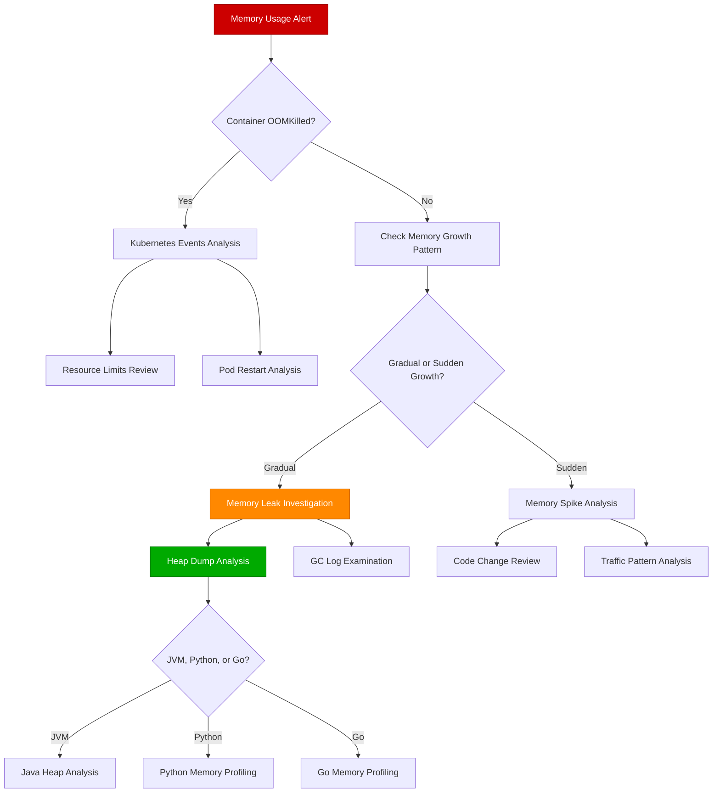

# Memory Leak Detection Guide

## Overview

Memory leaks in distributed systems can bring down entire clusters, causing cascading failures across microservices. This guide covers systematic detection and resolution approaches used by production teams at Google, Microsoft, and other companies running memory-intensive workloads.

**Time to Resolution**: 30-90 minutes for simple leaks, 4-8 hours for complex distributed memory issues

## Decision Tree



## Immediate Triage Commands (First 5 Minutes)

### 1. System Memory Overview
```bash
# Memory usage by process
ps aux --sort=-%mem | head -20

# System memory details
free -h
cat /proc/meminfo | grep -E "(MemTotal|MemFree|MemAvailable|Buffers|Cached)"

# Check for OOM killer activity
dmesg | grep -i "killed process" | tail -10
journalctl -k | grep -i "out of memory" | tail -10
```

### 2. Container Memory Status
```bash
# Docker container memory usage
docker stats --no-stream --format "table {{.Container}}\t{{.Name}}\t{{.CPUPerc}}\t{{.MemUsage}}\t{{.MemPerc}}"

# Kubernetes pod memory usage
kubectl top pods --all-namespaces --sort-by=memory

# Check for recent OOMKilled events
kubectl get events --field-selector=reason=OOMKilling --all-namespaces | head -10
```

### 3. Application-Specific Quick Checks
```bash
# Java heap usage (if JMX is enabled)
jstat -gc -t $(pgrep java) 5s 3

# Python memory usage for specific process
python -c "
import psutil
import os
process = psutil.Process(os.getpid())
print(f'Memory: {process.memory_info().rss / 1024 / 1024:.2f} MB')
print(f'Memory Percent: {process.memory_percent():.2f}%')
"

# Go runtime memory stats (if expvar is enabled)
curl -s http://localhost:8080/debug/vars | jq '.memstats'
```

## Deep Dive Analysis by Language

### Java/JVM Memory Leak Analysis

#### 1. Heap Dump Generation and Analysis
```bash
# Generate heap dump for running Java process
jcmd $(pgrep java) GC.run_finalization
jcmd $(pgrep java) VM.gc
jmap -dump:format=b,file=heapdump_$(date +%s).hprof $(pgrep java)

# Alternative using JVM flags (add to application startup)
# -XX:+HeapDumpOnOutOfMemoryError -XX:HeapDumpPath=/tmp/
```

#### 2. Heap Dump Analysis with Eclipse MAT
```bash
# Download Eclipse Memory Analyzer Tool (MAT)
# https://www.eclipse.org/mat/downloads.php

# Command line analysis
./mat/MemoryAnalyzer -vmargs -Xmx4g -application org.eclipse.mat.api.parse heapdump.hprof org.eclipse.mat.api:suspects org.eclipse.mat.api:overview
```

#### 3. GC Log Analysis
```bash
# Enable GC logging (JVM startup flags)
# -Xloggc:gc.log -XX:+PrintGCDetails -XX:+PrintGCTimeStamps -XX:+PrintGCApplicationStoppedTime

# Analyze GC logs
# Install GCViewer: https://github.com/chewiebug/GCViewer
java -jar gcviewer-1.36.jar gc.log

# Quick command line GC analysis
grep "Full GC" gc.log | tail -20
awk '/Full GC/ {print $1, $9}' gc.log | tail -20  # timestamp and heap usage after GC
```

#### 4. Production Java Memory Debugging
```java
// JMX-based memory monitoring
import java.lang.management.ManagementFactory;
import java.lang.management.MemoryMXBean;
import java.lang.management.MemoryUsage;

public class MemoryMonitor {
    public static void printMemoryUsage() {
        MemoryMXBean memoryBean = ManagementFactory.getMemoryMXBean();
        MemoryUsage heapUsage = memoryBean.getHeapMemoryUsage();
        MemoryUsage nonHeapUsage = memoryBean.getNonHeapMemoryUsage();

        System.out.printf("Heap Memory: %d MB used, %d MB committed, %d MB max%n",
            heapUsage.getUsed() / (1024 * 1024),
            heapUsage.getCommitted() / (1024 * 1024),
            heapUsage.getMax() / (1024 * 1024));

        System.out.printf("Non-Heap Memory: %d MB used, %d MB committed%n",
            nonHeapUsage.getUsed() / (1024 * 1024),
            nonHeapUsage.getCommitted() / (1024 * 1024));
    }
}
```

### Python Memory Leak Analysis

#### 1. Memory Profiling with memory_profiler
```python
# Install: pip install memory-profiler psutil

from memory_profiler import profile
import psutil
import os

@profile
def memory_intensive_function():
    # Your function here
    large_list = [i for i in range(1000000)]
    return large_list

# Command line usage
python -m memory_profiler your_script.py

# Monitoring specific process
python -c "
import psutil
import time
process = psutil.Process(12345)  # Replace with actual PID
while True:
    memory_info = process.memory_info()
    print(f'RSS: {memory_info.rss / 1024 / 1024:.2f} MB, VMS: {memory_info.vms / 1024 / 1024:.2f} MB')
    time.sleep(5)
"
```

#### 2. Object Growth Tracking with objgraph
```python
# Install: pip install objgraph

import objgraph
import gc

def track_memory_growth():
    # Take snapshot before
    objgraph.show_growth()

    # Your code that might leak memory
    potentially_leaky_function()

    # Force garbage collection
    gc.collect()

    # Show what grew
    objgraph.show_growth()

    # Show most common types
    objgraph.show_most_common_types(limit=20)

# Find objects referencing a specific object
import weakref
objgraph.find_backref_chain(
    weakref.ref(suspected_leaked_object()),
    objgraph.is_proper_module
)
```

#### 3. Line-by-Line Memory Profiling
```python
# Install: pip install line_profiler

# Add @profile decorator to functions you want to profile
@profile
def function_to_profile():
    data = []
    for i in range(100000):
        data.append(i * 2)
    return data

# Run with:
# kernprof -l -v your_script.py
```

### Go Memory Leak Analysis

#### 1. Go Runtime Memory Profiling
```go
package main

import (
    "fmt"
    "net/http"
    _ "net/http/pprof"
    "runtime"
    "time"
)

func memoryStats() {
    var m runtime.MemStats
    runtime.ReadMemStats(&m)

    fmt.Printf("Alloc = %d KB", bToKb(m.Alloc))
    fmt.Printf("TotalAlloc = %d KB", bToKb(m.TotalAlloc))
    fmt.Printf("Sys = %d KB", bToKb(m.Sys))
    fmt.Printf("NumGC = %d\n", m.NumGC)
}

func bToKb(b uint64) uint64 {
    return b / 1024
}

// Enable pprof endpoint
go func() {
    log.Println(http.ListenAndServe("localhost:6060", nil))
}()

// Continuous monitoring
go func() {
    for {
        memoryStats()
        time.Sleep(30 * time.Second)
    }
}()
```

#### 2. Command Line Memory Profiling
```bash
# Capture memory profile
go tool pprof -http=:8080 http://localhost:6060/debug/pprof/heap

# Analyze specific allocations
go tool pprof -top http://localhost:6060/debug/pprof/heap
go tool pprof -list=functionName http://localhost:6060/debug/pprof/heap

# Memory allocation over time
go tool pprof -cum http://localhost:6060/debug/pprof/heap
```

## Platform-Specific Memory Debugging

### AWS

#### ECS Memory Monitoring
```bash
# CloudWatch metrics for ECS memory usage
aws cloudwatch get-metric-statistics \
  --namespace AWS/ECS \
  --metric-name MemoryUtilization \
  --dimensions Name=ServiceName,Value=my-service Name=ClusterName,Value=my-cluster \
  --start-time $(date -u -d '1 hour ago' +%Y-%m-%dT%H:%M:%S) \
  --end-time $(date -u +%Y-%m-%dT%H:%M:%S) \
  --period 300 \
  --statistics Average,Maximum

# ECS container insights
aws logs filter-log-events \
  --log-group-name /ecs/my-service \
  --start-time $(date -d '1 hour ago' +%s)000 \
  --filter-pattern "OUT OF MEMORY"
```

#### Lambda Memory Analysis
```bash
# Lambda memory usage from CloudWatch
aws logs filter-log-events \
  --log-group-name /aws/lambda/my-function \
  --start-time $(date -d '1 hour ago' +%s)000 \
  --filter-pattern "Memory Size"

# Lambda performance insights
aws lambda get-function --function-name my-function | jq '.Configuration.MemorySize'
```

### GCP

#### Google Kubernetes Engine (GKE)
```bash
# GKE memory metrics
gcloud monitoring metrics list --filter="resource.type=k8s_container AND metric.type:memory"

# Container memory usage
kubectl top pods --containers --sort-by=memory
kubectl describe node | grep -A 5 "Allocated resources"

# Memory requests vs limits analysis
kubectl get pods -o jsonpath='{range .items[*]}{.metadata.name}{"\t"}{.spec.containers[*].resources.requests.memory}{"\t"}{.spec.containers[*].resources.limits.memory}{"\n"}{end}'
```

### Azure

#### Azure Container Instances
```bash
# Container memory metrics
az monitor metrics list \
  --resource "/subscriptions/SUB_ID/resourceGroups/RG_NAME/providers/Microsoft.ContainerInstance/containerGroups/CONTAINER_GROUP" \
  --metric "MemoryUsage" \
  --start-time $(date -u -d '1 hour ago' +%Y-%m-%dT%H:%M:%S.%3NZ)

# Application Insights memory tracking
az monitor app-insights query \
  --app my-app-insights \
  --analytics-query "performanceCounters | where name == 'Private Bytes' | summarize avg(value) by bin(timestamp, 5m)"
```

## Production Case Studies

### Case Study 1: Spotify - Java Heap Memory Leak

**Problem**: Music streaming service experiencing gradual memory growth, leading to daily restarts

**Investigation Process**:
1. **Heap dump analysis** revealed 2GB of cached user playlist data never being cleaned up
2. **GC logs** showed Old Generation constantly growing
3. **Code analysis** found WeakHashMap not being used correctly for caches

**Commands Used**:
```bash
# Generated heap dump during high memory usage
jcmd 12345 GC.run_finalization
jmap -dump:format=b,file=spotify_heap.hprof 12345

# Analyzed with Eclipse MAT
./MemoryAnalyzer -data workspace -application org.eclipse.mat.api.parse spotify_heap.hprof org.eclipse.mat.api:suspects

# Found cache retention issue
grep -r "WeakHashMap" src/ | grep -v "import"
```

**Resolution**: Replaced incorrect WeakHashMap usage with Guava Cache with TTL
**Time to Resolution**: 6 hours

### Case Study 2: Twitter - Python Memory Growth

**Problem**: Tweet processing service memory usage growing 50MB/hour, causing OOM after 8 hours

**Root Cause**: Global dictionary accumulating tweet metadata without cleanup

**Investigation Commands**:
```python
# Memory tracking during processing
import tracemalloc
tracemalloc.start()

# Process tweets
process_tweet_batch()

# Get top memory allocations
snapshot = tracemalloc.take_snapshot()
top_stats = snapshot.statistics('lineno')
for stat in top_stats[:10]:
    print(stat)

# Found growing global cache
import objgraph
objgraph.show_most_common_types()
objgraph.show_growth()
```

**Resolution**: Implemented LRU cache with size limits using `functools.lru_cache`
**Time to Resolution**: 4 hours

### Case Study 3: Uber - Go Goroutine Memory Leak

**Problem**: Ride matching service consuming 8GB memory during peak hours

**Root Cause**: Goroutines not being properly closed, accumulating in memory

**Investigation Process**:
```bash
# Memory profile analysis
go tool pprof -http=:8080 http://ride-matcher:6060/debug/pprof/heap

# Goroutine analysis
go tool pprof http://ride-matcher:6060/debug/pprof/goroutine
curl http://ride-matcher:6060/debug/pprof/goroutine?debug=2 | grep "goroutine" | wc -l
```

**Key Finding**: 50,000+ goroutines active (normal: 200-500)

**Resolution**: Added proper context cancellation and goroutine lifecycle management
**Time to Resolution**: 3 hours

## Container Memory Limits and Optimization

### Kubernetes Resource Management

```yaml
# Proper memory resource configuration
apiVersion: v1
kind: Pod
metadata:
  name: memory-optimized-app
spec:
  containers:
  - name: app
    image: my-app:latest
    resources:
      requests:
        memory: "256Mi"
        cpu: "200m"
      limits:
        memory: "512Mi"
        cpu: "500m"
    # Java-specific memory configuration
    env:
    - name: JAVA_OPTS
      value: "-Xms256m -Xmx450m -XX:+UseG1GC -XX:MaxGCPauseMillis=100"
```

### Memory Monitoring Sidecar
```yaml
apiVersion: v1
kind: ConfigMap
metadata:
  name: memory-monitor
data:
  monitor.sh: |
    #!/bin/bash
    while true; do
      echo "$(date): Memory usage: $(free -h | grep Mem | awk '{print $3 "/" $2}')"
      echo "$(date): Top processes: $(ps aux --sort=-%mem | head -5 | tail -4)"
      sleep 30
    done
---
apiVersion: v1
kind: Pod
spec:
  containers:
  - name: app
    # ... main application
  - name: memory-monitor
    image: alpine:latest
    command: ["/bin/sh", "/scripts/monitor.sh"]
    volumeMounts:
    - name: scripts
      mountPath: /scripts
  volumes:
  - name: scripts
    configMap:
      name: memory-monitor
      defaultMode: 0755
```

## Prevention Strategies

### 1. Automated Memory Monitoring

```python
# Python memory monitoring daemon
import psutil
import time
import logging
from dataclasses import dataclass
from typing import Dict, List

@dataclass
class MemoryAlert:
    threshold_mb: int
    alert_sent: bool = False

class MemoryMonitor:
    def __init__(self, pid: int, alerts: List[MemoryAlert]):
        self.process = psutil.Process(pid)
        self.alerts = alerts
        self.baseline_memory = self.process.memory_info().rss

    def check_memory_growth(self):
        current_memory = self.process.memory_info().rss
        growth_mb = (current_memory - self.baseline_memory) / (1024 * 1024)

        for alert in self.alerts:
            if growth_mb > alert.threshold_mb and not alert.alert_sent:
                self.send_alert(f"Memory growth: {growth_mb:.2f}MB")
                alert.alert_sent = True

        return {
            'current_mb': current_memory / (1024 * 1024),
            'growth_mb': growth_mb,
            'memory_percent': self.process.memory_percent()
        }

    def send_alert(self, message: str):
        # Integration with alerting system
        logging.error(f"MEMORY ALERT: {message}")
        # webhook_notify(message)

# Usage
monitor = MemoryMonitor(12345, [
    MemoryAlert(100),  # Alert at 100MB growth
    MemoryAlert(500),  # Alert at 500MB growth
    MemoryAlert(1000)  # Alert at 1GB growth
])

while True:
    stats = monitor.check_memory_growth()
    print(f"Memory: {stats['current_mb']:.2f}MB, Growth: {stats['growth_mb']:.2f}MB")
    time.sleep(60)
```

### 2. Memory-Aware Load Balancing

```nginx
# Nginx configuration for memory-aware routing
upstream backend {
    server app1:8080 weight=3;  # Higher memory capacity
    server app2:8080 weight=2;  # Medium memory capacity
    server app3:8080 weight=1;  # Lower memory capacity
}

# Health check including memory status
location /health {
    proxy_pass http://backend/health;
    proxy_next_upstream error timeout http_500;
}
```

### 3. Proactive Memory Limits

```dockerfile
# Docker memory limits and optimization
FROM openjdk:11-jre-slim

# Set container memory limit
LABEL memory_limit="512m"

# Java memory configuration
ENV JAVA_OPTS="-Xms256m -Xmx450m -XX:+UseG1GC -XX:+UseContainerSupport"

# Application configuration
COPY app.jar /app.jar
ENTRYPOINT ["sh", "-c", "java $JAVA_OPTS -jar /app.jar"]

# Health check including memory
HEALTHCHECK --interval=30s --timeout=3s --start-period=30s --retries=3 \
    CMD curl -f http://localhost:8080/health || exit 1
```

## 3 AM Debugging Checklist

When you're called at 3 AM for memory issues:

### First 2 Minutes
- [ ] Check if any containers were OOMKilled: `kubectl get events | grep OOMKilling`
- [ ] Verify system memory: `free -h` and `df -h`
- [ ] Check for memory alerts in monitoring system
- [ ] Look at recent memory usage trends

### Minutes 2-5
- [ ] Identify which service/container is consuming memory
- [ ] Check if issue started after recent deployment
- [ ] Verify memory limits are configured correctly
- [ ] Look for memory-related errors in logs

### Minutes 5-15
- [ ] Generate heap dump if JVM-based application
- [ ] Check GC logs for memory pressure signs
- [ ] Analyze memory allocation patterns
- [ ] Review recent code changes for memory usage

### If Still Debugging After 15 Minutes
- [ ] Escalate to senior engineer
- [ ] Consider restarting affected services
- [ ] Implement temporary memory limits increase
- [ ] Document findings for detailed analysis

## Memory Metrics and SLOs

### Key Memory Metrics to Track
- **Heap utilization percentage** (target: <80%)
- **Memory growth rate** (MB/hour)
- **GC frequency and duration** (Full GC <1/hour)
- **Container memory usage vs limits** (target: <90%)
- **OOMKill events** (target: 0 per day)

### Example SLO Configuration
```yaml
memory_slos:
  - name: "Heap Memory Usage"
    description: "JVM heap usage stays below 80%"
    metric: "jvm_memory_used_bytes{area='heap'} / jvm_memory_max_bytes{area='heap'}"
    target: 0.8
    window: "5m"

  - name: "Container Memory Usage"
    description: "Container memory usage stays below 90% of limits"
    metric: "container_memory_usage_bytes / container_spec_memory_limit_bytes"
    target: 0.9
    window: "5m"
```

**Remember**: Memory leaks can take hours to manifest but minutes to cause total system failure. Early detection and systematic analysis are crucial for maintaining system stability.

This guide represents collective wisdom from teams managing petabytes of memory across thousands of containers in production environments.