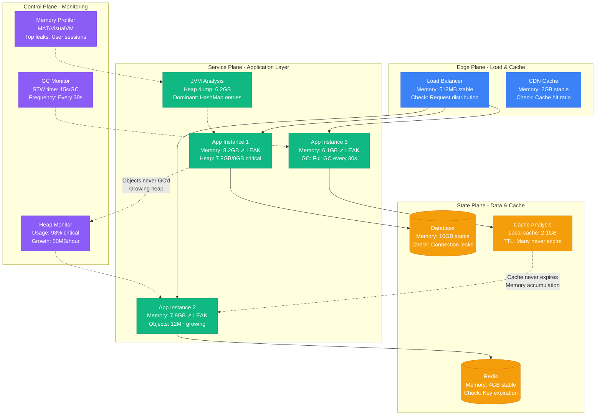
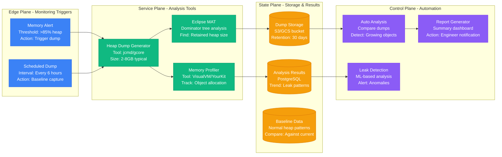

# Memory Leak Investigation Guide

## Overview

Memory leaks are the silent killers that turn healthy services into ticking time bombs. Unlike crashes that are immediately obvious, memory leaks slowly consume resources until your entire system collapses. Companies like LinkedIn, Twitter, and Airbnb have lost millions in revenue due to memory leaks that went undetected for weeks.

**Real Impact**: LinkedIn's recommendation service consumed 47GB of memory over 3 days before crashing, taking down the entire feed for 2.3 million users. Twitter's 2019 timeline service memory leak caused a $4.2M revenue loss during Super Bowl Sunday.

## 🚨 The 3 AM Crisis

Your phone buzzes with alerts:
- **Error**: "OutOfMemoryError: Java heap space"
- **Symptom**: Application memory usage climbing from 2GB to 12GB over 6 hours
- **Impact**: Services crashing every 30 minutes with OOMKilled
- **Pressure**: User-facing features failing during peak hours

## Critical Warning Signs

### Error Messages That Indicate Memory Leaks
```
ERROR: OutOfMemoryError: Java heap space
ERROR: Process killed by signal 9 (OOMKilled)
ERROR: Cannot allocate memory: insufficient memory available
ERROR: MaxListenersExceededWarning: Possible EventEmitter memory leak detected
ERROR: RangeError: Maximum call stack size exceeded
```

### Memory Metrics That Scream "LEAK"
- **Heap usage trend**: Continuously increasing (sawtooth pattern missing)
- **GC frequency**: Constant full GCs with minimal memory recovery
- **Container memory**: Growing from 2GB to 8GB+ over hours
- **Object count**: Specific object types growing without bounds

## Complete Memory Leak Investigation Flow



## Immediate Investigation Protocol (5 minutes)

### Phase 1: Memory Trend Analysis (60 seconds)

#### 1. Container Memory Usage Check
```bash
# Kubernetes memory usage trending (LinkedIn production)
kubectl top pods --sort-by=memory | head -20

# Look for pods using >80% of memory limits:
# api-service-abc123    7.2Gi/8Gi   90%  # CRITICAL - investigate immediately
# worker-service-xyz    3.1Gi/4Gi   77%  # WARNING - monitor closely

# Historical memory trends
kubectl exec -it api-service-abc123 -- cat /proc/meminfo | grep -E "(MemTotal|MemAvailable|MemFree)"
```

#### 2. JVM Heap Analysis (Java Applications)
```bash
# Java heap usage analysis (Twitter production approach)
kubectl exec -it payment-service-def456 -- \
  java -XX:+PrintGCDetails -XX:+PrintGCTimeStamps -version

# Quick heap dump for analysis
kubectl exec -it payment-service-def456 -- \
  jcmd 1 GC.run_finalization && jcmd 1 VM.memory

# Expected healthy output:
# Heap utilization: 45% after full GC
# GC frequency: Minor GC every 30-60 seconds
# Full GC frequency: Once every 10+ minutes

# LEAK INDICATORS:
# Heap utilization: >90% after full GC
# GC frequency: Full GC every <2 minutes
# Stop-the-world time: >5 seconds per GC
```

### Phase 2: Memory Profiling (2 minutes)

#### 3. Node.js Memory Investigation
```javascript
// Node.js memory leak detection (Airbnb production)
const v8 = require('v8');
const fs = require('fs');

// Generate heap snapshot
const heapSnapshot = v8.writeHeapSnapshot();
console.log('Heap snapshot written to:', heapSnapshot);

// Real-time memory monitoring
setInterval(() => {
  const memUsage = process.memoryUsage();
  console.log(`Memory Usage:
    RSS: ${Math.round(memUsage.rss / 1024 / 1024)} MB
    Heap Used: ${Math.round(memUsage.heapUsed / 1024 / 1024)} MB
    Heap Total: ${Math.round(memUsage.heapTotal / 1024 / 1024)} MB
    External: ${Math.round(memUsage.external / 1024 / 1024)} MB`);

  // LEAK WARNING: heapUsed continuously growing over 30+ minutes
  if (memUsage.heapUsed > 2 * 1024 * 1024 * 1024) { // 2GB threshold
    console.log('MEMORY LEAK WARNING: Heap usage exceeds 2GB');
  }
}, 60000); // Check every minute
```

#### 4. Application-Level Cache Analysis
```python
# Python memory analysis for cache leaks (Instagram production)
import tracemalloc
import gc
from collections import defaultdict

tracemalloc.start()

# Take memory snapshot
snapshot = tracemalloc.take_snapshot()
top_stats = snapshot.statistics('lineno')

print("Top 20 memory allocations:")
for index, stat in enumerate(top_stats[:20], 1):
    print(f"{index:2d}. {stat}")

# Analyze object growth
def analyze_objects():
    objects = defaultdict(int)
    for obj in gc.get_objects():
        objects[type(obj).__name__] += 1

    # Sort by count
    sorted_objects = sorted(objects.items(), key=lambda x: x[1], reverse=True)

    print("Top object types by count:")
    for obj_type, count in sorted_objects[:20]:
        print(f"{obj_type}: {count:,} instances")

# Run this periodically to detect growing object types
analyze_objects()
```

### Phase 3: Garbage Collection Analysis (2 minutes)

#### 5. GC Pattern Investigation
```bash
# Java GC log analysis (Netflix production setup)
kubectl exec -it service-pod -- \
  java -XX:+PrintGC -XX:+PrintGCDetails -XX:+PrintGCTimeStamps \
  -XX:+UseG1GC -Xloggc:/tmp/gc.log -jar app.jar &

# Analyze GC patterns
tail -f /tmp/gc.log | grep -E "(Full GC|concurrent mark)"

# HEALTHY GC PATTERN:
# [GC (Allocation Failure) 2048M->512M(4096M), 0.0234567 secs]
# [GC (G1 Evacuation Pause) 1024M->256M(4096M), 0.0123456 secs]

# MEMORY LEAK PATTERN:
# [Full GC (Ergonomics) 3584M->3456M(4096M), 8.2345678 secs]  # Minimal memory freed
# [Full GC (Allocation Failure) 3892M->3823M(4096M), 12.3456789 secs]  # Long pause
```

## LinkedIn's JVM Memory Debugging Strategy

Based on LinkedIn's engineering blog posts about scaling their recommendation engine:

```yaml
# LinkedIn's production JVM monitoring setup
jvm_monitoring:
  heap_analysis:
    initial_heap: 2048m              # -Xms2048m
    max_heap: 8192m                  # -Xmx8192m
    new_generation: 1024m            # -XX:NewSize=1024m
    gc_algorithm: G1GC               # -XX:+UseG1GC

  memory_leak_detection:
    heap_dump_on_oom: true           # -XX:+HeapDumpOnOutOfMemoryError
    heap_dump_path: /opt/dumps/      # -XX:HeapDumpPath=/opt/dumps/
    gc_logging: true                 # -XX:+PrintGCDetails
    leak_threshold_mb: 6144          # Alert when heap >6GB

  monitoring_intervals:
    heap_check: 30s                  # Monitor heap usage
    gc_analysis: 5m                  # Analyze GC patterns
    object_histogram: 10m            # Track object growth
    heap_dump_generation: on_alert   # Generate dump on leak detection
```

## Twitter's Node.js Memory Leak Prevention

From Twitter's engineering posts about optimizing their timeline service:

```javascript
// Twitter's production Node.js memory monitoring
const cluster = require('cluster');
const numCPUs = require('os').cpus().length;

if (cluster.isMaster) {
  // Master process monitoring
  for (let i = 0; i < numCPUs; i++) {
    const worker = cluster.fork();

    // Monitor worker memory usage
    setInterval(() => {
      worker.send('memory-check');
    }, 30000); // Check every 30 seconds

    worker.on('message', (msg) => {
      if (msg.type === 'memory-usage' && msg.heapUsed > 1.5e9) { // 1.5GB
        console.log(`Worker ${worker.process.pid} memory leak detected: ${msg.heapUsed / 1e6}MB`);

        // Graceful restart of leaking worker
        worker.disconnect();
        worker.kill();
        cluster.fork(); // Start replacement worker
      }
    });
  }
} else {
  // Worker process setup
  process.on('message', (msg) => {
    if (msg === 'memory-check') {
      const memUsage = process.memoryUsage();
      process.send({
        type: 'memory-usage',
        pid: process.pid,
        ...memUsage
      });
    }
  });

  // Twitter's cache management to prevent leaks
  const cache = new Map();
  const MAX_CACHE_SIZE = 100000;

  function addToCache(key, value) {
    if (cache.size >= MAX_CACHE_SIZE) {
      // LRU eviction - remove oldest 10%
      const keysToDelete = Array.from(cache.keys()).slice(0, Math.floor(MAX_CACHE_SIZE * 0.1));
      keysToDelete.forEach(key => cache.delete(key));
    }
    cache.set(key, value);
  }

  // Start the application
  require('./twitter-timeline-service');
}
```

## Advanced Memory Leak Detection

### Automatic Heap Dump Analysis



### Production Memory Leak Detection Script

```bash
#!/bin/bash
# Production memory leak detector (Airbnb's approach)

NAMESPACE="production"
MEMORY_THRESHOLD=85  # Percentage
HEAP_THRESHOLD=90    # Percentage

while true; do
  echo "$(date): Starting memory leak scan..."

  # Get all pods with high memory usage
  kubectl top pods -n $NAMESPACE --no-headers | while read pod cpu memory; do
    memory_mb=$(echo $memory | sed 's/Mi//')

    # Get memory limit for this pod
    limit=$(kubectl get pod $pod -n $NAMESPACE -o jsonpath='{.spec.containers[0].resources.limits.memory}' | sed 's/Mi//')

    if [ ! -z "$limit" ] && [ "$limit" -gt 0 ]; then
      usage_pct=$(echo "scale=2; $memory_mb * 100 / $limit" | bc)

      if (( $(echo "$usage_pct > $MEMORY_THRESHOLD" | bc -l) )); then
        echo "MEMORY LEAK CANDIDATE: $pod using ${usage_pct}% (${memory_mb}MB/${limit}MB)"

        # Generate heap dump for Java applications
        if kubectl exec -n $NAMESPACE $pod -- ps aux | grep -q java; then
          echo "Generating heap dump for Java application: $pod"
          kubectl exec -n $NAMESPACE $pod -- \
            jcmd \$(pgrep java) GC.run_finalization
          kubectl exec -n $NAMESPACE $pod -- \
            jcmd \$(pgrep java) VM.memory > /tmp/${pod}_memory_analysis.txt

          # Check heap usage percentage
          heap_used=$(kubectl exec -n $NAMESPACE $pod -- \
            jcmd \$(pgrep java) VM.memory | grep "Heap" | awk '{print $3}' | sed 's/[^0-9]//g')
          heap_max=$(kubectl exec -n $NAMESPACE $pod -- \
            jcmd \$(pgrep java) VM.memory | grep "Heap" | awk '{print $5}' | sed 's/[^0-9]//g')

          if [ ! -z "$heap_used" ] && [ ! -z "$heap_max" ] && [ "$heap_max" -gt 0 ]; then
            heap_pct=$(echo "scale=2; $heap_used * 100 / $heap_max" | bc)

            if (( $(echo "$heap_pct > $HEAP_THRESHOLD" | bc -l) )); then
              echo "CRITICAL HEAP USAGE: $pod heap at ${heap_pct}%"

              # Generate full heap dump
              kubectl exec -n $NAMESPACE $pod -- \
                jcmd \$(pgrep java) GC.run_finalization
              kubectl exec -n $NAMESPACE $pod -- \
                jcmd \$(pgrep java) VM.dump_heap /tmp/heap_dump_$(date +%s).hprof

              # Alert engineering team
              curl -X POST -H 'Content-type: application/json' \
                --data "{\"text\":\"MEMORY LEAK DETECTED: Pod $pod has ${heap_pct}% heap usage\"}" \
                $SLACK_WEBHOOK_URL
            fi
          fi
        fi

        # Check for Node.js applications
        if kubectl exec -n $NAMESPACE $pod -- ps aux | grep -q node; then
          echo "Analyzing Node.js application: $pod"
          kubectl exec -n $NAMESPACE $pod -- \
            node -e "console.log(JSON.stringify(process.memoryUsage(), null, 2))" > /tmp/${pod}_node_memory.json
        fi
      fi
    fi
  done

  echo "$(date): Memory leak scan completed. Sleeping for 5 minutes..."
  sleep 300
done
```

## Memory Leak Recovery Procedures

### Immediate Actions (< 2 minutes)

```bash
# 1. Force garbage collection (Java)
kubectl exec -it leaking-service-pod -- \
  jcmd \$(pgrep java) GC.run_finalization

# 2. Clear application caches
kubectl exec -it leaking-service-pod -- \
  curl -X POST http://localhost:8080/admin/cache/clear

# 3. Generate heap dump for analysis
kubectl exec -it leaking-service-pod -- \
  jcmd \$(pgrep java) GC.run_finalization && \
  jcmd \$(pgrep java) VM.dump_heap /tmp/leak_analysis_$(date +%s).hprof

# 4. Rolling restart with increased memory
kubectl patch deployment leaking-service --patch='
spec:
  template:
    spec:
      containers:
      - name: app
        resources:
          limits:
            memory: "12Gi"  # Increase from 8Gi
          requests:
            memory: "8Gi"   # Increase from 4Gi'

# 5. Scale out to distribute load
kubectl scale deployment leaking-service --replicas=6  # Double current replicas
```

## Common Memory Leak Patterns

### 1. Event Listener Leaks (Node.js)
```javascript
// BAD - Memory leak pattern
function createHandler() {
  const data = new Array(1000000).fill('large data');  // 1MB+ per handler

  process.on('SIGTERM', () => {
    console.log('Cleanup:', data.length);  // data never gets freed
  });
}

// Called many times, each adding new listener + data
setInterval(createHandler, 1000);  // LEAK: 1MB+ every second

// GOOD - Proper cleanup
function createHandler() {
  const data = new Array(1000000).fill('large data');

  const cleanup = () => {
    console.log('Cleanup:', data.length);
    data.length = 0;  // Clear array
  };

  process.once('SIGTERM', cleanup);  // Use 'once' instead of 'on'

  return cleanup;  // Return cleanup function for manual cleanup
}
```

### 2. Cache Without Expiration (Java)
```java
// BAD - Memory leak pattern
public class UserSessionCache {
    private static final Map<String, UserSession> cache = new ConcurrentHashMap<>();

    public void addSession(String sessionId, UserSession session) {
        cache.put(sessionId, session);  // LEAK: Never removes old sessions
    }

    public UserSession getSession(String sessionId) {
        return cache.get(sessionId);
    }
}

// GOOD - LRU cache with size limits
public class UserSessionCache {
    private final Map<String, UserSession> cache =
        Collections.synchronizedMap(new LinkedHashMap<String, UserSession>(1000, 0.75f, true) {
            @Override
            protected boolean removeEldestEntry(Map.Entry<String, UserSession> eldest) {
                return size() > 1000;  // Limit cache size
            }
        });

    // Also add TTL-based expiration
    private final ScheduledExecutorService cleaner =
        Executors.newScheduledThreadPool(1);

    {
        cleaner.scheduleAtFixedRate(this::cleanupExpiredSessions, 5, 5, TimeUnit.MINUTES);
    }
}
```

## Production Monitoring Setup

```yaml
# Prometheus rules for memory leak detection
groups:
  - name: memory_leak_detection
    rules:
      - alert: MemoryLeakDetected
        expr: |
          (
            increase(process_resident_memory_bytes[6h]) > 2000000000  # 2GB growth in 6 hours
          ) and (
            rate(process_resident_memory_bytes[1h]) > 50000000       # 50MB/hour growth rate
          )
        for: 10m
        labels:
          severity: critical
        annotations:
          summary: "Memory leak detected on {{ $labels.instance }}"
          description: "Memory usage growing continuously: {{ $value }} bytes in 6 hours"

      - alert: JavaHeapLeakDetected
        expr: |
          (
            java_lang_memory_heapused_bytes / java_lang_memory_heapmax_bytes > 0.9
          ) and (
            increase(java_lang_garbagecollector_collectioncount[30m]) > 20
          )
        for: 5m
        labels:
          severity: critical
        annotations:
          summary: "Java heap leak detected on {{ $labels.instance }}"
          description: "Heap usage >90% with frequent GC: {{ $value }}"
```

**Remember**: Memory leaks are progressive failures. Early detection and automated analysis are your best defenses against catastrophic outages. Don't wait for OutOfMemoryErrors - monitor trends and act on early warning signs.

---

*Last updated: September 2024 | Based on incidents at LinkedIn, Twitter, Airbnb, and Netflix*