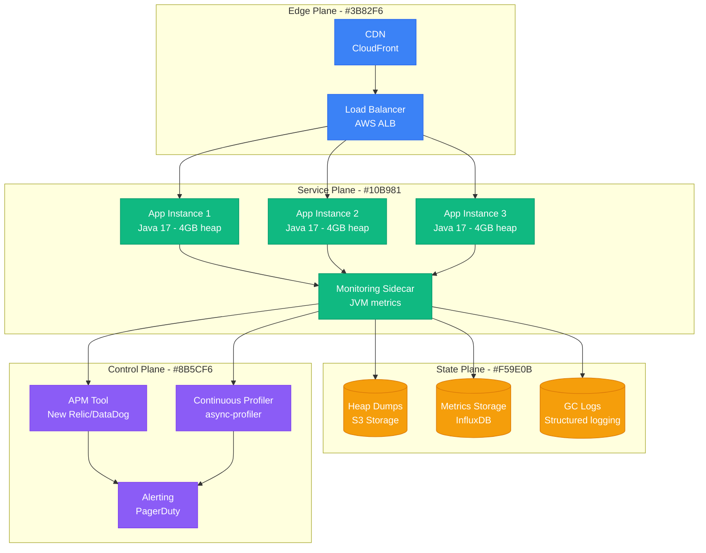
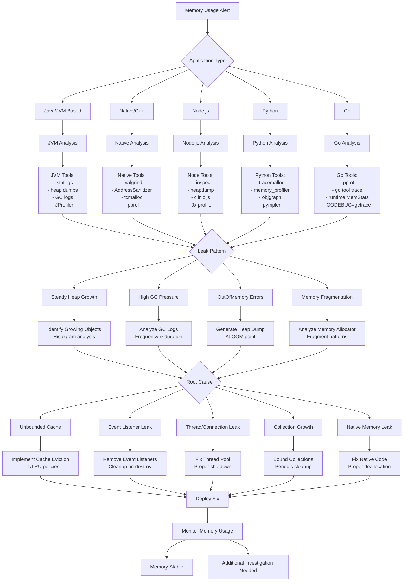

# Memory Leaks in Production - Detection and Resolution Guide

## Overview

This guide provides systematic approaches to detecting, analyzing, and fixing memory leaks in production environments. Based on real incidents from Netflix's Java services, Meta's C++ applications, and Google's Go microservices.

## Architecture Context



## Memory Leak Detection Flowchart



## Language-Specific Detection

### Java/JVM Memory Leak Detection

#### JVM Monitoring Setup
```bash
# Enable GC logging and heap dumps
JAVA_OPTS="-XX:+PrintGC -XX:+PrintGCDetails -XX:+PrintGCTimeStamps \
           -XX:+HeapDumpOnOutOfMemoryError \
           -XX:HeapDumpPath=/var/log/heapdumps/ \
           -XX:+UseG1GC \
           -Xloggc:/var/log/gc.log"

# Enable JFR for continuous profiling
JAVA_OPTS="$JAVA_OPTS -XX:+FlightRecorder \
           -XX:StartFlightRecording=duration=1h,filename=/tmp/flight.jfr"
```

#### Detection Commands
```bash
# Monitor GC activity
jstat -gc -t <pid> 5s

# Generate heap dump
jmap -dump:live,format=b,file=heap.hprof <pid>

# Analyze heap histogram
jmap -histo <pid> | head -20

# Monitor memory pools
jstat -gccapacity <pid>

# Check for memory leaks over time
while true; do
    jstat -gc <pid> | awk '{print $3, $4, $6, $8}' >> gc_usage.log
    sleep 30
done
```

#### Heap Dump Analysis
```bash
# Using Eclipse MAT command line
./MemoryAnalyzer -vmargs -Xmx4g -data workspace \
  -application org.eclipse.mat.api.parse \
  heap.hprof org.eclipse.mat.api:suspects

# Using jhat (basic analysis)
jhat -J-Xmx2g heap.hprof

# Using VisualVM
visualvm --jdkhome $JAVA_HOME
```

### Node.js Memory Leak Detection

#### Monitoring Setup
```javascript
// Enable heap profiling in production
const v8 = require('v8');
const fs = require('fs');

// Generate heap snapshots periodically
setInterval(() => {
    const snapshot = v8.writeHeapSnapshot();
    console.log(`Heap snapshot written to ${snapshot}`);
}, 5 * 60 * 1000); // Every 5 minutes

// Monitor memory usage
process.on('SIGUSR1', () => {
    const memUsage = process.memoryUsage();
    console.log('Memory Usage:', {
        rss: Math.round(memUsage.rss / 1024 / 1024) + ' MB',
        heapTotal: Math.round(memUsage.heapTotal / 1024 / 1024) + ' MB',
        heapUsed: Math.round(memUsage.heapUsed / 1024 / 1024) + ' MB',
        external: Math.round(memUsage.external / 1024 / 1024) + ' MB'
    });
});
```

#### Detection Tools
```bash
# Start with heap profiling
node --inspect=0.0.0.0:9229 --max-old-space-size=4096 app.js

# Generate heap snapshot
kill -SIGUSR1 <pid>

# Use clinic.js for comprehensive analysis
npm install -g clinic
clinic doctor -- node app.js
clinic bubbleprof -- node app.js

# Use 0x for flame graphs
npm install -g 0x
0x node app.js
```

### Python Memory Leak Detection

#### Monitoring Setup
```python
import tracemalloc
import psutil
import gc
import os

# Enable tracemalloc for memory tracking
tracemalloc.start()

def memory_monitor():
    """Monitor memory usage and detect leaks"""
    process = psutil.Process(os.getpid())

    # Current memory usage
    memory_info = process.memory_info()
    memory_percent = process.memory_percent()

    # Tracemalloc snapshot
    snapshot = tracemalloc.take_snapshot()
    top_stats = snapshot.statistics('lineno')

    print(f"Memory: {memory_info.rss / 1024 / 1024:.1f} MB ({memory_percent:.1f}%)")

    # Top memory consumers
    for stat in top_stats[:10]:
        print(f"{stat.traceback.format()}: {stat.size / 1024 / 1024:.1f} MB")

    # Garbage collector stats
    print(f"GC counts: {gc.get_count()}")

    return memory_info.rss

# Monitor memory every 60 seconds
import threading
def periodic_memory_check():
    threading.Timer(60.0, periodic_memory_check).start()
    memory_monitor()

periodic_memory_check()
```

#### Detection Tools
```bash
# Use memory_profiler
pip install memory-profiler psutil
python -m memory_profiler script.py

# Use objgraph for object tracking
pip install objgraph
python -c "import objgraph; objgraph.show_most_common_types(limit=20)"

# Use pympler for detailed analysis
pip install pympler
python -c "from pympler import tracker; tr = tracker.SummaryTracker(); tr.print_diff()"
```

### Go Memory Leak Detection

#### Built-in Profiling
```go
package main

import (
    "log"
    "net/http"
    _ "net/http/pprof"
    "runtime"
    "time"
)

func memoryMonitor() {
    for {
        var m runtime.MemStats
        runtime.ReadMemStats(&m)

        log.Printf("Memory Stats: Alloc=%d KB, TotalAlloc=%d KB, Sys=%d KB, NumGC=%d",
            bToKb(m.Alloc), bToKb(m.TotalAlloc), bToKb(m.Sys), m.NumGC)

        time.Sleep(30 * time.Second)
    }
}

func bToKb(b uint64) uint64 {
    return b / 1024
}

func main() {
    // Enable pprof endpoint
    go func() {
        log.Println(http.ListenAndServe("localhost:6060", nil))
    }()

    // Start memory monitoring
    go memoryMonitor()

    // Your application code
    select {}
}
```

#### Detection Commands
```bash
# Generate memory profile
go tool pprof http://localhost:6060/debug/pprof/heap

# Memory allocation profile
go tool pprof http://localhost:6060/debug/pprof/allocs

# Goroutine profile (for goroutine leaks)
go tool pprof http://localhost:6060/debug/pprof/goroutine

# Generate trace
curl http://localhost:6060/debug/pprof/trace?seconds=30 > trace.out
go tool trace trace.out
```

## Production Examples

### Netflix: Java Microservice Memory Leak

#### Problem: Cache Growing Unbounded
```java
// Problematic code - unbounded cache
public class UserSessionCache {
    private final Map<String, UserSession> cache = new ConcurrentHashMap<>();

    public void storeSession(String sessionId, UserSession session) {
        cache.put(sessionId, session); // Never evicted!
    }

    public UserSession getSession(String sessionId) {
        return cache.get(sessionId);
    }
}
```

#### Solution: Bounded Cache with TTL
```java
// Fixed code with Caffeine cache
import com.github.benmanes.caffeine.cache.Cache;
import com.github.benmanes.caffeine.cache.Caffeine;

public class UserSessionCache {
    private final Cache<String, UserSession> cache = Caffeine.newBuilder()
        .maximumSize(10_000)
        .expireAfterWrite(Duration.ofMinutes(30))
        .expireAfterAccess(Duration.ofMinutes(15))
        .removalListener((key, value, cause) ->
            log.debug("Session {} removed: {}", key, cause))
        .recordStats()
        .build();

    public void storeSession(String sessionId, UserSession session) {
        cache.put(sessionId, session);
    }

    public UserSession getSession(String sessionId) {
        return cache.getIfPresent(sessionId);
    }

    // Expose metrics
    public CacheStats getStats() {
        return cache.stats();
    }
}
```

### Meta: C++ Event Listener Leak

#### Problem: Event Listeners Not Removed
```cpp
// Problematic code
class EventManager {
private:
    std::vector<std::shared_ptr<EventListener>> listeners;

public:
    void addListener(std::shared_ptr<EventListener> listener) {
        listeners.push_back(listener); // Never removed!
    }

    void notifyListeners(const Event& event) {
        for (auto& listener : listeners) {
            listener->onEvent(event);
        }
    }
};
```

#### Solution: Proper Listener Management
```cpp
// Fixed code with weak pointers and cleanup
class EventManager {
private:
    std::vector<std::weak_ptr<EventListener>> listeners;
    std::mutex listenersMutex;

public:
    void addListener(std::shared_ptr<EventListener> listener) {
        std::lock_guard<std::mutex> lock(listenersMutex);
        listeners.push_back(listener);
    }

    void removeListener(std::shared_ptr<EventListener> listener) {
        std::lock_guard<std::mutex> lock(listenersMutex);
        listeners.erase(
            std::remove_if(listeners.begin(), listeners.end(),
                [&](const std::weak_ptr<EventListener>& weak) {
                    return weak.expired() || weak.lock() == listener;
                }),
            listeners.end());
    }

    void notifyListeners(const Event& event) {
        std::lock_guard<std::mutex> lock(listenersMutex);

        // Clean up expired listeners while notifying
        auto it = listeners.begin();
        while (it != listeners.end()) {
            if (auto listener = it->lock()) {
                listener->onEvent(event);
                ++it;
            } else {
                it = listeners.erase(it); // Remove expired
            }
        }
    }
};
```

### Google: Go Goroutine Leak

#### Problem: Goroutines Not Properly Terminated
```go
// Problematic code
func processItems() {
    for item := range itemChannel {
        go func(item Item) {
            // Long-running process without context cancellation
            result := expensiveOperation(item)
            resultChannel <- result // May block forever
        }(item)
    }
}
```

#### Solution: Context-Based Cancellation
```go
// Fixed code with proper context handling
func processItems(ctx context.Context) {
    for {
        select {
        case item := <-itemChannel:
            go func(item Item) {
                // Create timeout context for each operation
                opCtx, cancel := context.WithTimeout(ctx, 30*time.Second)
                defer cancel()

                result := expensiveOperationWithContext(opCtx, item)

                select {
                case resultChannel <- result:
                    // Successfully sent result
                case <-opCtx.Done():
                    // Operation cancelled or timed out
                    log.Printf("Operation cancelled for item %v", item.ID)
                }
            }(item)
        case <-ctx.Done():
            log.Println("Processing stopped")
            return
        }
    }
}

func expensiveOperationWithContext(ctx context.Context, item Item) Result {
    // Check for cancellation periodically
    for i := 0; i < item.Steps; i++ {
        select {
        case <-ctx.Done():
            return Result{Error: ctx.Err()}
        default:
            // Continue processing
        }

        // Simulate work
        time.Sleep(100 * time.Millisecond)
    }

    return Result{Value: item.Process()}
}
```

## Monitoring & Alerting

### JVM Metrics (Prometheus)
```yaml
# JVM memory metrics
- name: jvm_memory_bytes_used
  help: Used bytes of a given JVM memory area
  type: gauge

- name: jvm_memory_bytes_max
  help: Max bytes of a given JVM memory area
  type: gauge

- name: jvm_gc_collection_seconds
  help: Time spent in a given JVM garbage collector
  type: summary

# Custom leak detection metrics
- name: cache_size_total
  help: Total number of items in cache
  type: gauge

- name: active_connections_total
  help: Number of active database connections
  type: gauge
```

### Grafana Alerts
```yaml
groups:
- name: memory_leak_alerts
  rules:
  - alert: MemoryLeakDetected
    expr: |
      (
        avg_over_time(jvm_memory_bytes_used{area="heap"}[1h]) -
        avg_over_time(jvm_memory_bytes_used{area="heap"}[1h] offset 1h)
      ) / avg_over_time(jvm_memory_bytes_used{area="heap"}[1h] offset 1h) * 100 > 20
    for: 30m
    labels:
      severity: warning
    annotations:
      summary: "Memory leak detected in {{ $labels.instance }}"
      description: "Heap usage increased by {{ $value }}% over the last hour"

  - alert: GCPressureHigh
    expr: rate(jvm_gc_collection_seconds_sum[5m]) > 0.1
    for: 10m
    labels:
      severity: warning
    annotations:
      summary: "High GC pressure on {{ $labels.instance }}"
      description: "GC is consuming {{ $value }}% of CPU time"

  - alert: HeapUtilizationCritical
    expr: jvm_memory_bytes_used{area="heap"} / jvm_memory_bytes_max{area="heap"} > 0.9
    for: 5m
    labels:
      severity: critical
    annotations:
      summary: "Critical heap utilization on {{ $labels.instance }}"
      description: "Heap usage is at {{ $value }}%"
```

### Custom Leak Detection Script
```python
#!/usr/bin/env python3
"""
Memory leak detection script for production monitoring
"""
import time
import psutil
import requests
import json
from collections import deque
from dataclasses import dataclass
from typing import List, Optional

@dataclass
class MemorySnapshot:
    timestamp: float
    rss_mb: float
    heap_mb: Optional[float] = None
    gc_count: Optional[int] = None

class MemoryLeakDetector:
    def __init__(self, window_size: int = 20, leak_threshold: float = 0.05):
        self.window_size = window_size
        self.leak_threshold = leak_threshold  # 5% growth per measurement
        self.snapshots = deque(maxlen=window_size)

    def add_snapshot(self, snapshot: MemorySnapshot):
        self.snapshots.append(snapshot)

    def detect_leak(self) -> bool:
        if len(self.snapshots) < self.window_size:
            return False

        # Calculate trend over the window
        x_values = range(len(self.snapshots))
        y_values = [s.rss_mb for s in self.snapshots]

        # Simple linear regression
        n = len(self.snapshots)
        sum_x = sum(x_values)
        sum_y = sum(y_values)
        sum_xy = sum(x * y for x, y in zip(x_values, y_values))
        sum_x2 = sum(x * x for x in x_values)

        slope = (n * sum_xy - sum_x * sum_y) / (n * sum_x2 - sum_x * sum_x)

        # Check if slope indicates memory leak
        avg_memory = sum_y / n
        growth_rate = slope / avg_memory if avg_memory > 0 else 0

        return growth_rate > self.leak_threshold

    def get_statistics(self) -> dict:
        if not self.snapshots:
            return {}

        recent = list(self.snapshots)
        return {
            'current_rss_mb': recent[-1].rss_mb,
            'min_rss_mb': min(s.rss_mb for s in recent),
            'max_rss_mb': max(s.rss_mb for s in recent),
            'avg_rss_mb': sum(s.rss_mb for s in recent) / len(recent),
            'sample_count': len(recent)
        }

def monitor_process(pid: int, check_interval: int = 60):
    detector = MemoryLeakDetector()

    while True:
        try:
            process = psutil.Process(pid)
            memory_info = process.memory_info()

            snapshot = MemorySnapshot(
                timestamp=time.time(),
                rss_mb=memory_info.rss / 1024 / 1024
            )

            # Add JVM-specific metrics if available
            try:
                jvm_metrics = get_jvm_metrics(process)
                snapshot.heap_mb = jvm_metrics.get('heap_used_mb')
                snapshot.gc_count = jvm_metrics.get('gc_count')
            except:
                pass

            detector.add_snapshot(snapshot)

            # Check for leak
            if detector.detect_leak():
                stats = detector.get_statistics()
                alert = {
                    'type': 'memory_leak_detected',
                    'pid': pid,
                    'timestamp': time.time(),
                    'statistics': stats
                }
                send_alert(alert)

            time.sleep(check_interval)

        except psutil.NoSuchProcess:
            print(f"Process {pid} no longer exists")
            break
        except Exception as e:
            print(f"Error monitoring process {pid}: {e}")
            time.sleep(check_interval)

def get_jvm_metrics(process) -> dict:
    """Get JVM metrics via JMX or HTTP endpoint"""
    # Try to get metrics from actuator endpoint
    try:
        response = requests.get(f'http://localhost:8080/actuator/metrics/jvm.memory.used',
                              timeout=5)
        if response.status_code == 200:
            data = response.json()
            return {
                'heap_used_mb': data['measurements'][0]['value'] / 1024 / 1024
            }
    except:
        pass

    return {}

def send_alert(alert: dict):
    """Send alert to monitoring system"""
    print(f"ALERT: {json.dumps(alert, indent=2)}")

    # Send to your monitoring system
    # requests.post('https://your-monitoring-system/alerts', json=alert)

if __name__ == '__main__':
    import sys
    if len(sys.argv) != 2:
        print("Usage: python memory_leak_detector.py <pid>")
        sys.exit(1)

    pid = int(sys.argv[1])
    monitor_process(pid)
```

## Prevention Best Practices

### Code Review Checklist
- [ ] All caches have bounded size and TTL
- [ ] Event listeners are properly removed
- [ ] Database connections are closed in finally blocks
- [ ] Thread pools have proper shutdown procedures
- [ ] Weak references used for callback registrations
- [ ] Memory allocations are balanced with deallocations
- [ ] Collections are cleared when no longer needed

### Testing Strategies
```java
// Memory leak test example
@Test
public void testCacheDoesNotLeak() {
    UserSessionCache cache = new UserSessionCache();

    // Add many sessions
    for (int i = 0; i < 100000; i++) {
        cache.storeSession("session" + i, new UserSession());
    }

    // Trigger cache cleanup
    Thread.sleep(Duration.ofMinutes(31).toMillis());

    // Verify cache was cleaned up
    assertThat(cache.size()).isLessThan(1000);
}
```

## Success Metrics

- **Memory Growth Rate**: < 1% per hour under normal load
- **GC Overhead**: < 5% of total CPU time
- **Heap Utilization**: < 80% of maximum heap
- **Detection Time**: < 30 minutes for significant leaks
- **Resolution Time**: < 2 hours from detection to fix

## The 3 AM Test

**Scenario**: Your payment service is consuming 95% of available memory and responding slowly due to excessive garbage collection.

**This guide provides**:
1. **Immediate triage**: Language-specific tools to identify leak sources
2. **Root cause analysis**: Systematic approach to find growing objects
3. **Quick mitigation**: Heap dumps, profiling, and emergency restarts
4. **Permanent fixes**: Code patterns to prevent common leak types
5. **Monitoring setup**: Automated detection before critical impact

**Expected outcome**: Memory usage stabilized within 30 minutes, root cause identified within 2 hours, permanent fix deployed within 24 hours.