# Message Queue Backlog Debugging - Production Debugging Guide

## Overview

This guide provides systematic workflows for debugging message queue backlogs in distributed systems. Based on Apache Kafka's consumer lag management and RabbitMQ's queue monitoring practices.

**Time to Resolution**: 10-40 minutes for queue backlogs
**Resolution Success Rate**: 85% of backlog issues resolved
**False Positive Rate**: <12%

## 1. Complete Message Queue Backlog Investigation Flow

```mermaid
flowchart TD
    QueueBacklog[📬 Queue Backlog Alert<br/>Consumer lag increasing] --> BacklogAssessment[1. Backlog Assessment<br/>Scope and severity analysis<br/>⏱️ 4 min]

    BacklogAssessment --> QueueMetrics[2. Queue Metrics Analysis<br/>Production/consumption rates<br/>⏱️ 5 min]

    QueueMetrics --> BacklogCategories[3. Backlog Classification<br/>Root cause patterns<br/>⏱️ 3 min]

    BacklogCategories --> ProducerOverload[Producer Overload<br/>Message rate spike]
    BacklogCategories --> ConsumerFailure[Consumer Failure<br/>Processing bottleneck]
    BacklogCategories --> QueueCapacity[Queue Capacity<br/>Storage limitations]
    BacklogCategories --> NetworkIssues[Network Issues<br/>Connection problems]

    ProducerOverload --> ProducerAnalysis[4a. Producer Analysis<br/>• Message volume spike<br/>• Burst traffic patterns<br/>• Upstream system issues<br/>⏱️ 10 min]

    ConsumerFailure --> ConsumerAnalysis[4b. Consumer Analysis<br/>• Processing failures<br/>• Resource exhaustion<br/>• Dead letter patterns<br/>⏱️ 12 min]

    QueueCapacity --> CapacityAnalysis[4c. Capacity Analysis<br/>• Storage utilization<br/>• Memory pressure<br/>• Disk space limits<br/>⏱️ 8 min]

    NetworkIssues --> NetworkAnalysis[4d. Network Analysis<br/>• Connection timeouts<br/>• Packet loss<br/>• Bandwidth saturation<br/>⏱️ 6 min]

    ProducerAnalysis --> BacklogResolution[5. Backlog Resolution<br/>Apply targeted fixes<br/>⏱️ 18 min]
    ConsumerAnalysis --> BacklogResolution
    CapacityAnalysis --> BacklogResolution
    NetworkAnalysis --> BacklogResolution

    BacklogResolution --> QueueValidation[6. Queue Validation<br/>Lag reduction verification<br/>⏱️ 10 min]

    QueueValidation --> QueueOptimization[7. Queue Optimization<br/>Prevent future backlogs<br/>⏱️ 8 min]

    %% Apply 4-plane colors
    classDef edgeStyle fill:#3B82F6,stroke:#2563EB,color:#fff
    classDef serviceStyle fill:#10B981,stroke:#059669,color:#fff
    classDef stateStyle fill:#F59E0B,stroke:#D97706,color:#fff
    classDef controlStyle fill:#8B5CF6,stroke:#7C3AED,color:#fff

    class QueueBacklog,BacklogAssessment edgeStyle
    class ProducerAnalysis,ConsumerAnalysis,CapacityAnalysis serviceStyle
    class NetworkAnalysis,QueueMetrics,BacklogCategories stateStyle
    class BacklogResolution,QueueValidation,QueueOptimization controlStyle
```



## 2. Apache Kafka-Style Consumer Lag Analysis

```mermaid
flowchart TD
    KafkaLag[🔴 Kafka Consumer Lag<br/>Partition lag monitoring] --> LagMetrics[1. Lag Metrics Collection<br/>Per-partition analysis<br/>⏱️ 4 min]

    LagMetrics --> PartitionAnalysis[2. Partition Analysis<br/>Lag distribution patterns<br/>⏱️ 5 min]

    PartitionAnalysis --> Partition0[Partition 0<br/>Hot partition analysis]
    PartitionAnalysis --> Partition1[Partition 1<br/>Balanced load check]
    PartitionAnalysis --> Partition2[Partition 2<br/>Key distribution review]
    PartitionAnalysis --> PartitionN[Partition N<br/>Scale pattern analysis]

    Partition0 --> Partition0Metrics[📊 Partition 0 Metrics<br/>• Consumer Lag: 🔴 50K messages<br/>• Production Rate: 🔴 1K msg/sec<br/>• Consumption Rate: 🔴 200 msg/sec<br/>• Key Distribution: 🔴 Skewed (80%)]

    Partition1 --> Partition1Metrics[📊 Partition 1 Metrics<br/>• Consumer Lag: 🟡 5K messages<br/>• Production Rate: 🟢 500 msg/sec<br/>• Consumption Rate: 🟢 480 msg/sec<br/>• Key Distribution: 🟢 Balanced]

    Partition2 --> Partition2Metrics[📊 Partition 2 Metrics<br/>• Consumer Lag: 🟢 100 messages<br/>• Production Rate: 🟢 300 msg/sec<br/>• Consumption Rate: 🟢 320 msg/sec<br/>• Key Distribution: 🟢 Even]

    PartitionN --> PartitionNMetrics[📊 Partition N Metrics<br/>• Consumer Lag: 🔴 30K messages<br/>• Production Rate: 🔴 800 msg/sec<br/>• Consumption Rate: 🔴 150 msg/sec<br/>• Key Distribution: 🔴 Hot keys]

    Partition0Metrics --> KafkaLagAnalysis[3. Kafka Lag Analysis<br/>Consumer group investigation<br/>⏱️ 8 min]
    Partition1Metrics --> KafkaLagAnalysis
    Partition2Metrics --> KafkaLagAnalysis
    PartitionNMetrics --> KafkaLagAnalysis

    KafkaLagAnalysis --> LagCauses{Lag Root<br/>Causes?}

    LagCauses --> PartitionSkew[4a. Partition Skew<br/>• Key distribution issues<br/>• Hot partition problems<br/>• Rebalancing needs<br/>⏱️ 12 min]

    LagCauses --> ConsumerPerformance[4b. Consumer Performance<br/>• Processing bottlenecks<br/>• Resource constraints<br/>• Error handling issues<br/>⏱️ 15 min]

    LagCauses --> ProducerBurst[4c. Producer Burst<br/>• Traffic spike handling<br/>• Batching optimization<br/>• Rate limiting needs<br/>⏱️ 10 min]

    PartitionSkew --> KafkaOptimization[5. Kafka Optimization<br/>Lag mitigation strategies<br/>⏱️ 20 min]
    ConsumerPerformance --> KafkaOptimization
    ProducerBurst --> KafkaOptimization

    KafkaOptimization --> ConsumerGroupRebalance[6. Consumer Group Rebalance<br/>Load redistribution<br/>⏱️ 8 min]

    ConsumerGroupRebalance --> LagValidation[7. Lag Validation<br/>Monitor lag reduction<br/>⏱️ 12 min]

    %% Apply 4-plane colors
    classDef edgeStyle fill:#3B82F6,stroke:#2563EB,color:#fff
    classDef serviceStyle fill:#10B981,stroke:#059669,color:#fff
    classDef stateStyle fill:#F59E0B,stroke:#D97706,color:#fff
    classDef controlStyle fill:#8B5CF6,stroke:#7C3AED,color:#fff

    class KafkaLag,LagMetrics edgeStyle
    class Partition0,Partition1,PartitionSkew serviceStyle
    class Partition2,PartitionN,ConsumerPerformance stateStyle
    class KafkaLagAnalysis,KafkaOptimization,LagValidation controlStyle
```

## 3. RabbitMQ-Style Queue Depth Investigation

```mermaid
flowchart TD
    RabbitMQBacklog[🐰 RabbitMQ Queue Backlog<br/>Queue depth exceeded] --> QueueInspection[1. Queue Inspection<br/>Detailed queue analysis<br/>⏱️ 4 min]

    QueueInspection --> QueueHealth[2. Queue Health Assessment<br/>Per-queue metrics<br/>⏱️ 5 min]

    QueueHealth --> OrderQueue[Order Processing Queue<br/>High-priority business logic]
    QueueHealth --> EmailQueue[Email Notification Queue<br/>Async communication]
    QueueHealth --> LoggingQueue[Logging Queue<br/>System events]
    QueueHealth --> DeadLetterQueue[Dead Letter Queue<br/>Failed message handling]

    OrderQueue --> OrderQueueMetrics[📊 Order Queue Analysis<br/>• Queue Depth: 🔴 10K messages<br/>• Consumer Count: 🟡 3 active<br/>• Message Rate In: 🔴 500 msg/sec<br/>• Message Rate Out: 🔴 100 msg/sec<br/>• Memory Usage: 🔴 500MB]

    EmailQueue --> EmailQueueMetrics[📊 Email Queue Analysis<br/>• Queue Depth: 🟡 2K messages<br/>• Consumer Count: 🟢 5 active<br/>• Message Rate In: 🟢 200 msg/sec<br/>• Message Rate Out: 🟡 180 msg/sec<br/>• Memory Usage: 🟢 50MB]

    LoggingQueue --> LoggingQueueMetrics[📊 Logging Queue Analysis<br/>• Queue Depth: 🔴 50K messages<br/>• Consumer Count: 🔴 1 active<br/>• Message Rate In: 🔴 1K msg/sec<br/>• Message Rate Out: 🔴 20 msg/sec<br/>• Memory Usage: 🔴 1GB]

    DeadLetterQueue --> DLQMetrics[📊 Dead Letter Analysis<br/>• Queue Depth: 🔴 5K messages<br/>• Growth Rate: 🔴 Increasing<br/>• Message Patterns: 🔴 Poison messages<br/>• Retry Attempts: 🔴 Exhausted<br/>• Error Types: 🔴 Serialization]

    OrderQueueMetrics --> RabbitMQDiagnosis[3. RabbitMQ Diagnosis<br/>Queue bottleneck analysis<br/>⏱️ 8 min]
    EmailQueueMetrics --> RabbitMQDiagnosis
    LoggingQueueMetrics --> RabbitMQDiagnosis
    DLQMetrics --> RabbitMQDiagnosis

    RabbitMQDiagnosis --> QueueIssueType{Queue Issue<br/>Classification?}

    QueueIssueType --> ConsumerScaling[4a. Consumer Scaling<br/>• Horizontal scaling needs<br/>• Consumer group sizing<br/>• Processing optimization<br/>⏱️ 12 min]

    QueueIssueType --> MessagePoisoning[4b. Message Poisoning<br/>• Dead letter analysis<br/>• Malformed messages<br/>• Processing failures<br/>⏱️ 15 min]

    QueueIssueType --> MemoryPressure[4c. Memory Pressure<br/>• Queue memory limits<br/>• Message persistence<br/>• Disk space issues<br/>⏱️ 10 min]

    ConsumerScaling --> RabbitMQOptimization[5. RabbitMQ Optimization<br/>Queue performance tuning<br/>⏱️ 18 min]
    MessagePoisoning --> RabbitMQOptimization
    MemoryPressure --> RabbitMQOptimization

    RabbitMQOptimization --> QueueRebalancing[6. Queue Rebalancing<br/>Load distribution optimization<br/>⏱️ 10 min]

    QueueRebalancing --> RabbitMQValidation[7. RabbitMQ Validation<br/>Queue depth monitoring<br/>⏱️ 8 min]

    %% Apply 4-plane colors
    classDef edgeStyle fill:#3B82F6,stroke:#2563EB,color:#fff
    classDef serviceStyle fill:#10B981,stroke:#059669,color:#fff
    classDef stateStyle fill:#F59E0B,stroke:#D97706,color:#fff
    classDef controlStyle fill:#8B5CF6,stroke:#7C3AED,color:#fff

    class RabbitMQBacklog,QueueInspection edgeStyle
    class OrderQueue,EmailQueue,ConsumerScaling serviceStyle
    class LoggingQueue,DeadLetterQueue,MessagePoisoning stateStyle
    class RabbitMQDiagnosis,RabbitMQOptimization,RabbitMQValidation controlStyle
```



## 4. AWS SQS-Style Message Processing Debug

```mermaid
flowchart TD
    SQSBacklog[☁️ AWS SQS Backlog<br/>Message visibility timeout issues] --> SQSMetrics[1. SQS Metrics Collection<br/>CloudWatch analysis<br/>⏱️ 4 min]

    SQSMetrics --> SQSQueueAnalysis[2. SQS Queue Analysis<br/>Message flow patterns<br/>⏱️ 5 min]

    SQSQueueAnalysis --> StandardQueue[Standard SQS Queue<br/>High throughput processing]
    SQSQueueAnalysis --> FIFOQueue[FIFO SQS Queue<br/>Ordered message processing]
    SQSQueueAnalysis --> DLQQueue[Dead Letter Queue<br/>Failed message storage]

    StandardQueue --> StandardMetrics[📊 Standard Queue Metrics<br/>• Messages Available: 🔴 50K<br/>• Messages In Flight: 🔴 10K<br/>• Receive Rate: 🔴 100 msg/sec<br/>• Send Rate: 🔴 500 msg/sec<br/>• Age of Oldest Message: 🔴 2 hours]

    FIFOQueue --> FIFOMetrics[📊 FIFO Queue Metrics<br/>• Messages Available: 🟡 5K<br/>• Messages In Flight: 🟡 1K<br/>• Receive Rate: 🟡 50 msg/sec<br/>• Send Rate: 🟡 60 msg/sec<br/>• Message Groups: 🔴 Blocked groups]

    DLQQueue --> DLQMetrics[📊 DLQ Metrics<br/>• Messages Available: 🔴 2K<br/>• Receive Count: 🔴 High retries<br/>• Message Attributes: 🔴 Error patterns<br/>• Source Queue: 🔴 Multiple origins<br/>• Retention Period: 🟡 14 days]

    StandardMetrics --> SQSIssueAnalysis[3. SQS Issue Analysis<br/>Processing bottleneck identification<br/>⏱️ 8 min]
    FIFOMetrics --> SQSIssueAnalysis
    DLQMetrics --> SQSIssueAnalysis

    SQSIssueAnalysis --> SQSIssueTypes{SQS Issue<br/>Types?}

    SQSIssueTypes --> VisibilityTimeout[4a. Visibility Timeout<br/>• Timeout too short<br/>• Processing time variance<br/>• Duplicate processing<br/>⏱️ 10 min]

    SQSIssueTypes --> ConsumerCapacity[4b. Consumer Capacity<br/>• Insufficient consumers<br/>• Processing bottlenecks<br/>• Auto-scaling issues<br/>⏱️ 12 min]

    SQSIssueTypes --> MessagePoisoning[4c. Poison Messages<br/>• Malformed content<br/>• Processing failures<br/>• Infinite retry loops<br/>⏱️ 8 min]

    VisibilityTimeout --> SQSOptimization[5. SQS Optimization<br/>Configuration tuning<br/>⏱️ 15 min]
    ConsumerCapacity --> SQSOptimization
    MessagePoisoning --> SQSOptimization

    SQSOptimization --> AutoScaling[6. Auto Scaling Setup<br/>Consumer auto-scaling<br/>⏱️ 10 min]

    AutoScaling --> SQSValidation[7. SQS Validation<br/>Message flow normalization<br/>⏱️ 8 min]

    %% Apply 4-plane colors
    classDef edgeStyle fill:#3B82F6,stroke:#2563EB,color:#fff
    classDef serviceStyle fill:#10B981,stroke:#059669,color:#fff
    classDef stateStyle fill:#F59E0B,stroke:#D97706,color:#fff
    classDef controlStyle fill:#8B5CF6,stroke:#7C3AED,color:#fff

    class SQSBacklog,SQSMetrics edgeStyle
    class StandardQueue,FIFOQueue,VisibilityTimeout serviceStyle
    class DLQQueue,SQSQueueAnalysis,ConsumerCapacity stateStyle
    class SQSIssueAnalysis,SQSOptimization,SQSValidation controlStyle
```



## 5. Production Queue Monitoring & Analysis Tools

### Kafka Consumer Lag Monitor
```python
import time
from kafka import KafkaConsumer, TopicPartition
from kafka.admin import KafkaAdminClient, ConfigResource, ConfigResourceType
from typing import Dict, List, Tuple
import json

class KafkaLagMonitor:
    def __init__(self, bootstrap_servers: str, consumer_group: str):
        self.bootstrap_servers = bootstrap_servers
        self.consumer_group = consumer_group
        self.admin_client = KafkaAdminClient(
            bootstrap_servers=bootstrap_servers,
            client_id='lag_monitor'
        )

    def get_consumer_lag(self, topic: str) -> Dict[int, Dict]:
        """Get consumer lag for all partitions of a topic"""
        consumer = KafkaConsumer(
            bootstrap_servers=self.bootstrap_servers,
            group_id=self.consumer_group,
            enable_auto_commit=False
        )

        try:
            # Get topic partitions
            partitions = consumer.partitions_for_topic(topic)
            if not partitions:
                return {}

            lag_info = {}

            for partition_id in partitions:
                topic_partition = TopicPartition(topic, partition_id)

                # Get current offset (consumer position)
                try:
                    consumer.assign([topic_partition])
                    current_offset = consumer.position(topic_partition)
                except:
                    current_offset = 0

                # Get latest offset (producer position)
                end_offsets = consumer.end_offsets([topic_partition])
                latest_offset = end_offsets.get(topic_partition, 0)

                # Calculate lag
                lag = latest_offset - current_offset

                lag_info[partition_id] = {
                    'current_offset': current_offset,
                    'latest_offset': latest_offset,
                    'lag': lag,
                    'lag_percentage': (lag / max(latest_offset, 1)) * 100
                }

        finally:
            consumer.close()

        return lag_info

    def get_topic_metrics(self, topic: str) -> Dict:
        """Get comprehensive topic metrics"""
        consumer = KafkaConsumer(
            bootstrap_servers=self.bootstrap_servers,
            enable_auto_commit=False
        )

        try:
            # Get topic metadata
            metadata = consumer.list_consumer_group_offsets(self.consumer_group)
            partitions = consumer.partitions_for_topic(topic)

            total_lag = 0
            max_lag = 0
            partition_count = len(partitions) if partitions else 0

            lag_by_partition = self.get_consumer_lag(topic)

            for partition_id, lag_data in lag_by_partition.items():
                lag = lag_data['lag']
                total_lag += lag
                max_lag = max(max_lag, lag)

            return {
                'topic': topic,
                'partition_count': partition_count,
                'total_lag': total_lag,
                'max_lag': max_lag,
                'avg_lag': total_lag / max(partition_count, 1),
                'lag_by_partition': lag_by_partition
            }

        finally:
            consumer.close()

    def analyze_consumer_performance(self, topic: str, time_window: int = 300) -> Dict:
        """Analyze consumer performance over time"""
        start_time = time.time()
        measurements = []

        print(f"Analyzing consumer performance for {time_window} seconds...")

        while time.time() - start_time < time_window:
            metrics = self.get_topic_metrics(topic)
            measurements.append({
                'timestamp': time.time(),
                'total_lag': metrics['total_lag'],
                'max_lag': metrics['max_lag']
            })

            time.sleep(30)  # Measure every 30 seconds

        # Analyze trends
        if len(measurements) < 2:
            return {'error': 'Insufficient data for analysis'}

        initial_lag = measurements[0]['total_lag']
        final_lag = measurements[-1]['total_lag']
        lag_change = final_lag - initial_lag

        # Calculate lag rate (messages per second)
        time_diff = measurements[-1]['timestamp'] - measurements[0]['timestamp']
        lag_rate = lag_change / time_diff if time_diff > 0 else 0

        return {
            'initial_lag': initial_lag,
            'final_lag': final_lag,
            'lag_change': lag_change,
            'lag_rate_per_second': lag_rate,
            'trend': 'increasing' if lag_change > 0 else 'decreasing' if lag_change < 0 else 'stable',
            'measurements': measurements
        }

    def detect_hot_partitions(self, topic: str, threshold_ratio: float = 2.0) -> List[int]:
        """Detect partitions with disproportionately high lag"""
        lag_info = self.get_consumer_lag(topic)

        if not lag_info:
            return []

        # Calculate average lag
        total_lag = sum(info['lag'] for info in lag_info.values())
        avg_lag = total_lag / len(lag_info)

        # Find hot partitions
        hot_partitions = []
        for partition_id, info in lag_info.items():
            if info['lag'] > avg_lag * threshold_ratio:
                hot_partitions.append(partition_id)

        return hot_partitions

    def get_consumer_group_info(self) -> Dict:
        """Get consumer group information"""
        consumer = KafkaConsumer(
            bootstrap_servers=self.bootstrap_servers,
            group_id=self.consumer_group,
            enable_auto_commit=False
        )

        try:
            # Get group metadata
            group_metadata = consumer.list_consumer_groups()
            offsets = consumer.list_consumer_group_offsets(self.consumer_group)

            return {
                'group_id': self.consumer_group,
                'consumer_count': len(offsets) if offsets else 0,
                'assigned_partitions': list(offsets.keys()) if offsets else [],
                'group_state': 'active' if offsets else 'inactive'
            }

        finally:
            consumer.close()

    def generate_lag_report(self, topics: List[str]) -> Dict:
        """Generate comprehensive lag report"""
        report = {
            'timestamp': time.time(),
            'consumer_group': self.consumer_group,
            'group_info': self.get_consumer_group_info(),
            'topics': {}
        }

        for topic in topics:
            try:
                metrics = self.get_topic_metrics(topic)
                hot_partitions = self.detect_hot_partitions(topic)

                report['topics'][topic] = {
                    'metrics': metrics,
                    'hot_partitions': hot_partitions,
                    'status': self._determine_topic_status(metrics)
                }

            except Exception as e:
                report['topics'][topic] = {'error': str(e)}

        return report

    def _determine_topic_status(self, metrics: Dict) -> str:
        """Determine topic health status based on metrics"""
        total_lag = metrics['total_lag']
        max_lag = metrics['max_lag']

        if total_lag > 100000:  # High lag threshold
            return 'critical'
        elif total_lag > 10000:  # Medium lag threshold
            return 'warning'
        elif max_lag > 5000:    # Single partition high lag
            return 'attention'
        else:
            return 'healthy'

# Usage example
monitor = KafkaLagMonitor(
    bootstrap_servers='localhost:9092',
    consumer_group='my-consumer-group'
)

# Generate lag report
topics = ['orders', 'events', 'notifications']
report = monitor.generate_lag_report(topics)

print("Kafka Consumer Lag Report:")
print(json.dumps(report, indent=2))

# Analyze specific topic performance
performance = monitor.analyze_consumer_performance('orders', time_window=300)
print(f"Performance analysis: {performance}")
```

### RabbitMQ Queue Monitor
```python
import requests
import time
from typing import Dict, List
from dataclasses import dataclass

@dataclass
class QueueStats:
    name: str
    messages: int
    messages_ready: int
    messages_unacknowledged: int
    consumers: int
    memory: int
    message_rate_in: float
    message_rate_out: float

class RabbitMQMonitor:
    def __init__(self, host: str, port: int = 15672, username: str = 'guest', password: str = 'guest'):
        self.base_url = f"http://{host}:{port}/api"
        self.auth = (username, password)

    def get_queue_stats(self, queue_name: str, vhost: str = '%2F') -> QueueStats:
        """Get detailed statistics for a specific queue"""
        url = f"{self.base_url}/queues/{vhost}/{queue_name}"

        try:
            response = requests.get(url, auth=self.auth)
            response.raise_for_status()
            data = response.json()

            return QueueStats(
                name=data['name'],
                messages=data.get('messages', 0),
                messages_ready=data.get('messages_ready', 0),
                messages_unacknowledged=data.get('messages_unacknowledged', 0),
                consumers=data.get('consumers', 0),
                memory=data.get('memory', 0),
                message_rate_in=data.get('message_stats', {}).get('publish_details', {}).get('rate', 0),
                message_rate_out=data.get('message_stats', {}).get('deliver_get_details', {}).get('rate', 0)
            )

        except Exception as e:
            print(f"Error getting queue stats for {queue_name}: {e}")
            return None

    def get_all_queues(self, vhost: str = '%2F') -> List[Dict]:
        """Get list of all queues"""
        url = f"{self.base_url}/queues/{vhost}"

        try:
            response = requests.get(url, auth=self.auth)
            response.raise_for_status()
            return response.json()

        except Exception as e:
            print(f"Error getting queue list: {e}")
            return []

    def detect_queue_backlogs(self, threshold_messages: int = 1000, threshold_ratio: float = 2.0) -> List[Dict]:
        """Detect queues with significant backlogs"""
        queues = self.get_all_queues()
        backlogged_queues = []

        for queue_data in queues:
            queue_name = queue_data['name']
            stats = self.get_queue_stats(queue_name)

            if not stats:
                continue

            # Check for high message count
            if stats.messages > threshold_messages:
                backlogged_queues.append({
                    'queue': queue_name,
                    'issue': 'high_message_count',
                    'details': {
                        'messages': stats.messages,
                        'threshold': threshold_messages
                    }
                })

            # Check for imbalanced production/consumption
            if stats.message_rate_in > 0 and stats.message_rate_out > 0:
                rate_ratio = stats.message_rate_in / stats.message_rate_out
                if rate_ratio > threshold_ratio:
                    backlogged_queues.append({
                        'queue': queue_name,
                        'issue': 'production_consumption_imbalance',
                        'details': {
                            'rate_in': stats.message_rate_in,
                            'rate_out': stats.message_rate_out,
                            'ratio': rate_ratio
                        }
                    })

            # Check for consumers without activity
            if stats.consumers == 0 and stats.messages > 0:
                backlogged_queues.append({
                    'queue': queue_name,
                    'issue': 'no_consumers',
                    'details': {
                        'messages': stats.messages,
                        'consumers': stats.consumers
                    }
                })

        return backlogged_queues

    def analyze_queue_health(self, queue_names: List[str]) -> Dict:
        """Analyze health of specified queues"""
        analysis = {
            'timestamp': time.time(),
            'queues': {},
            'overall_health': 'healthy',
            'alerts': []
        }

        critical_issues = 0
        warning_issues = 0

        for queue_name in queue_names:
            stats = self.get_queue_stats(queue_name)

            if not stats:
                analysis['queues'][queue_name] = {'error': 'Unable to fetch stats'}
                continue

            queue_analysis = {
                'stats': {
                    'messages': stats.messages,
                    'messages_ready': stats.messages_ready,
                    'messages_unacknowledged': stats.messages_unacknowledged,
                    'consumers': stats.consumers,
                    'memory_mb': stats.memory / 1024 / 1024,
                    'rate_in': stats.message_rate_in,
                    'rate_out': stats.message_rate_out
                },
                'health': 'healthy',
                'issues': []
            }

            # Health assessment
            if stats.messages > 10000:
                queue_analysis['health'] = 'critical'
                queue_analysis['issues'].append('Very high message count')
                critical_issues += 1

            elif stats.messages > 1000:
                queue_analysis['health'] = 'warning'
                queue_analysis['issues'].append('High message count')
                warning_issues += 1

            if stats.consumers == 0 and stats.messages > 0:
                queue_analysis['health'] = 'critical'
                queue_analysis['issues'].append('No active consumers')
                critical_issues += 1

            if stats.message_rate_in > stats.message_rate_out * 2:
                queue_analysis['health'] = 'warning'
                queue_analysis['issues'].append('Production exceeds consumption')
                warning_issues += 1

            analysis['queues'][queue_name] = queue_analysis

        # Overall health assessment
        if critical_issues > 0:
            analysis['overall_health'] = 'critical'
        elif warning_issues > 0:
            analysis['overall_health'] = 'warning'

        return analysis

    def get_node_health(self) -> Dict:
        """Get RabbitMQ node health information"""
        url = f"{self.base_url}/nodes"

        try:
            response = requests.get(url, auth=self.auth)
            response.raise_for_status()
            nodes = response.json()

            node_health = {}
            for node in nodes:
                node_name = node['name']
                node_health[node_name] = {
                    'running': node.get('running', False),
                    'memory_used': node.get('mem_used', 0),
                    'memory_limit': node.get('mem_limit', 0),
                    'disk_free': node.get('disk_free', 0),
                    'disk_free_limit': node.get('disk_free_limit', 0),
                    'fd_used': node.get('fd_used', 0),
                    'fd_total': node.get('fd_total', 0)
                }

            return node_health

        except Exception as e:
            print(f"Error getting node health: {e}")
            return {}

    def monitor_queues_continuously(self, queue_names: List[str], interval: int = 30):
        """Continuously monitor queue health"""
        print(f"Starting continuous monitoring of {len(queue_names)} queues...")

        while True:
            try:
                analysis = self.analyze_queue_health(queue_names)

                print(f"\n=== Queue Health Report at {time.ctime()} ===")
                print(f"Overall health: {analysis['overall_health']}")

                for queue_name, queue_data in analysis['queues'].items():
                    if 'error' in queue_data:
                        print(f"{queue_name}: ERROR - {queue_data['error']}")
                        continue

                    stats = queue_data['stats']
                    health = queue_data['health']
                    issues = queue_data['issues']

                    print(f"{queue_name}: {health.upper()}")
                    print(f"  Messages: {stats['messages']} (Ready: {stats['messages_ready']}, Unacked: {stats['messages_unacknowledged']})")
                    print(f"  Consumers: {stats['consumers']}")
                    print(f"  Rates: In={stats['rate_in']:.1f}/sec, Out={stats['rate_out']:.1f}/sec")

                    if issues:
                        print(f"  Issues: {', '.join(issues)}")

                time.sleep(interval)

            except KeyboardInterrupt:
                print("Monitoring stopped")
                break
            except Exception as e:
                print(f"Error during monitoring: {e}")
                time.sleep(interval)

# Usage example
monitor = RabbitMQMonitor('localhost', username='admin', password='password')

# Analyze specific queues
queue_names = ['orders', 'notifications', 'logging', 'dead_letter']
analysis = monitor.analyze_queue_health(queue_names)

print("RabbitMQ Queue Health Analysis:")
for queue, data in analysis['queues'].items():
    print(f"{queue}: {data}")

# Detect backlogs
backlogs = monitor.detect_queue_backlogs()
if backlogs:
    print("Detected backlogs:")
    for backlog in backlogs:
        print(f"  {backlog}")

# Continuous monitoring
# monitor.monitor_queues_continuously(queue_names, interval=60)
```

## Common Queue Backlog Solutions

### Solution 1: Consumer Auto-scaling
```yaml
# Kubernetes HPA for queue consumers
apiVersion: autoscaling/v2
kind: HorizontalPodAutoscaler
metadata:
  name: queue-consumer-hpa
spec:
  scaleTargetRef:
    apiVersion: apps/v1
    kind: Deployment
    name: queue-consumer
  minReplicas: 2
  maxReplicas: 20
  metrics:
  - type: External
    external:
      metric:
        name: rabbitmq_queue_messages
        selector:
          matchLabels:
            queue: "orders"
      target:
        type: AverageValue
        averageValue: "1000"  # Scale up when >1000 messages
  behavior:
    scaleUp:
      stabilizationWindowSeconds: 60
      policies:
      - type: Percent
        value: 100  # Double pod count
        periodSeconds: 60
    scaleDown:
      stabilizationWindowSeconds: 300
      policies:
      - type: Percent
        value: 50   # Halve pod count
        periodSeconds: 60
```

### Solution 2: Dead Letter Queue Handling
```python
# Dead letter queue processor
class DeadLetterProcessor:
    def __init__(self, rabbitmq_client):
        self.rabbitmq = rabbitmq_client

    def process_dead_letters(self, dlq_name: str, max_retry_attempts: int = 3):
        """Process messages from dead letter queue"""

        # Get messages from DLQ
        messages = self.rabbitmq.get_messages(dlq_name)

        for message in messages:
            try:
                # Check retry count
                retry_count = message.headers.get('x-retry-count', 0)

                if retry_count < max_retry_attempts:
                    # Increment retry count
                    message.headers['x-retry-count'] = retry_count + 1

                    # Add delay based on retry count (exponential backoff)
                    delay = min(2 ** retry_count * 1000, 300000)  # Max 5 minutes

                    # Re-queue with delay
                    self.rabbitmq.publish_delayed(
                        message.body,
                        routing_key=message.original_routing_key,
                        delay=delay,
                        headers=message.headers
                    )
                else:
                    # Max retries exceeded - move to permanent failure queue
                    self.rabbitmq.publish(
                        message.body,
                        routing_key='permanent_failures',
                        headers=message.headers
                    )

                    # Log for investigation
                    logger.error(f"Message permanently failed after {retry_count} attempts: {message.body}")

                # Acknowledge the DLQ message
                message.ack()

            except Exception as e:
                logger.error(f"Error processing dead letter: {e}")
                message.nack(requeue=False)
```

### Solution 3: Kafka Partition Rebalancing
```bash
#!/bin/bash
# Kafka partition rebalancing script

KAFKA_HOME="/opt/kafka"
BOOTSTRAP_SERVERS="localhost:9092"
TOPIC_NAME="$1"

if [ -z "$TOPIC_NAME" ]; then
    echo "Usage: $0 <topic_name>"
    exit 1
fi

log_message() {
    echo "$(date '+%Y-%m-%d %H:%M:%S'): $1"
}

generate_reassignment_plan() {
    local topic="$1"

    log_message "Generating partition reassignment plan for topic: $topic"

    # Get current partition assignment
    $KAFKA_HOME/bin/kafka-topics.sh \
        --bootstrap-server "$BOOTSTRAP_SERVERS" \
        --describe \
        --topic "$topic" > current_assignment.txt

    # Create topics to move JSON
    cat > topics_to_move.json << EOF
{
  "topics": [
    {"topic": "$topic"}
  ],
  "version": 1
}
EOF

    # Generate reassignment plan
    $KAFKA_HOME/bin/kafka-reassign-partitions.sh \
        --bootstrap-server "$BOOTSTRAP_SERVERS" \
        --topics-to-move-json-file topics_to_move.json \
        --broker-list "0,1,2" \
        --generate > reassignment_plan.txt

    # Extract the proposed assignment
    grep -A 1000 "Proposed partition reassignment configuration" reassignment_plan.txt | \
    grep -v "Proposed partition reassignment configuration" > proposed_assignment.json

    log_message "Reassignment plan generated in proposed_assignment.json"
}

execute_reassignment() {
    log_message "Executing partition reassignment"

    # Execute the reassignment
    $KAFKA_HOME/bin/kafka-reassign-partitions.sh \
        --bootstrap-server "$BOOTSTRAP_SERVERS" \
        --reassignment-json-file proposed_assignment.json \
        --execute

    log_message "Reassignment initiated"
}

verify_reassignment() {
    log_message "Verifying partition reassignment progress"

    # Check reassignment status
    $KAFKA_HOME/bin/kafka-reassign-partitions.sh \
        --bootstrap-server "$BOOTSTRAP_SERVERS" \
        --reassignment-json-file proposed_assignment.json \
        --verify
}

monitor_consumer_lag() {
    local topic="$1"
    local consumer_group="$2"

    log_message "Monitoring consumer lag during rebalancing"

    while true; do
        lag_output=$($KAFKA_HOME/bin/kafka-consumer-groups.sh \
            --bootstrap-server "$BOOTSTRAP_SERVERS" \
            --describe \
            --group "$consumer_group" 2>/dev/null | grep "$topic")

        if [ -n "$lag_output" ]; then
            total_lag=$(echo "$lag_output" | awk '{sum += $5} END {print sum}')
            echo "Current total lag: $total_lag"
        fi

        sleep 30
    done
}

main() {
    local topic="$TOPIC_NAME"

    log_message "Starting Kafka partition rebalancing for topic: $topic"

    # Generate reassignment plan
    generate_reassignment_plan "$topic"

    # Confirm with user
    echo "Review the reassignment plan in proposed_assignment.json"
    read -p "Proceed with reassignment? (y/n): " confirm

    if [ "$confirm" = "y" ]; then
        execute_reassignment

        # Monitor progress
        echo "Monitoring reassignment progress..."
        while true; do
            verify_reassignment
            if $? -eq 0; then
                log_message "Reassignment completed successfully"
                break
            fi
            sleep 60
        done
    else
        log_message "Reassignment cancelled"
    fi

    # Cleanup
    rm -f topics_to_move.json reassignment_plan.txt proposed_assignment.json current_assignment.txt
}

main "$@"
```

## Escalation Criteria

| Queue Type | Backlog Size | Duration | Escalation Action | Contact |
|------------|--------------|----------|------------------|----------|
| Critical Business | >1000 messages | 5 minutes | Immediate escalation | @business-critical-team |
| High Priority | >5000 messages | 10 minutes | Senior Engineer | @oncall-senior |
| Standard | >10000 messages | 15 minutes | Queue Team | @messaging-team |
| Low Priority | >50000 messages | 30 minutes | Platform Team | @platform-team |

## Success Metrics

- **Lag Resolution**: 90% of backlogs cleared within 20 minutes
- **Detection Speed**: < 3 minutes for backlog detection
- **False Positives**: < 12% of alerts
- **Consumer Efficiency**: >85% message processing success rate

*Based on production message queue management practices from Apache Kafka, RabbitMQ, AWS SQS, and enterprise messaging teams.*