# Message Queue Dead Letter Queue Debugging - Production Guide

## Overview

Dead Letter Queue (DLQ) issues account for 41% of all message queue incidents and 29% of data processing pipeline failures in production. This guide provides systematic troubleshooting based on Amazon SQS operations, Apache Kafka best practices, and RabbitMQ production deployments.

**Impact**: Message loss, data processing delays, customer notification failures, payment processing interruptions, cascading system failures.

**MTTR Target**: < 3 minutes for detection, < 12 minutes for resolution

## Dead Letter Queue Investigation Decision Tree

```mermaid
flowchart TD
    Start([🚨 Dead Letter Queue Alert]) --> QueueType{Queue System Type?}

    QueueType -->|AWS SQS| SQS[SQS DLQ Investigation]
    QueueType -->|Apache Kafka| Kafka[Kafka DLQ Investigation]
    QueueType -->|RabbitMQ| RabbitMQ[RabbitMQ DLQ Investigation]
    QueueType -->|Redis Streams| Redis[Redis Streams Investigation]
    QueueType -->|Google Pub/Sub| PubSub[Pub/Sub DLQ Investigation]

    SQS --> SQSCheck{SQS DLQ Status?}
    SQSCheck -->|Messages Accumulating| SQSBacklog[SQS Message Backlog]
    SQSCheck -->|Processing Errors| SQSErrors[SQS Processing Errors]
    SQSCheck -->|Visibility Timeout| SQSTimeout[SQS Visibility Issues]

    Kafka --> KafkaCheck{Kafka Error Type?}
    KafkaCheck -->|Consumer Lag| KafkaLag[Kafka Consumer Lag]
    KafkaCheck -->|Deserialization| KafkaDeser[Kafka Serialization Errors]
    KafkaCheck -->|Offset Management| KafkaOffset[Kafka Offset Issues]

    RabbitMQ --> RMQCheck{RabbitMQ Issue Type?}
    RMQCheck -->|Queue Full| RMQFull[RabbitMQ Queue Full]
    RMQCheck -->|Consumer Errors| RMQConsumer[RabbitMQ Consumer Issues]
    RMQCheck -->|Exchange Problems| RMQExchange[RabbitMQ Exchange Issues]

    Redis --> RedisCheck{Redis Streams Issue?}
    RedisCheck -->|Stream Backlog| RedisBacklog[Redis Stream Backlog]
    RedisCheck -->|Consumer Group| RedisConsumer[Redis Consumer Group Issues]

    PubSub --> PubSubCheck{Pub/Sub Issue Type?}
    PubSubCheck -->|Subscription Errors| PubSubSub[Pub/Sub Subscription Issues]
    PubSubCheck -->|Message Retention| PubSubRetention[Pub/Sub Retention Issues]

    %% Resolution paths
    SQSBacklog --> SQSBacklogFix[Scale SQS Processing]
    SQSErrors --> SQSErrorFix[Fix SQS Message Processing]
    SQSTimeout --> SQSTimeoutFix[Adjust SQS Visibility Timeout]

    KafkaLag --> KafkaLagFix[Scale Kafka Consumers]
    KafkaDeser --> KafkaDeserFix[Fix Kafka Serialization]
    KafkaOffset --> KafkaOffsetFix[Reset Kafka Offsets]

    RMQFull --> RMQFullFix[Scale RabbitMQ Resources]
    RMQConsumer --> RMQConsumerFix[Fix RabbitMQ Consumers]
    RMQExchange --> RMQExchangeFix[Fix RabbitMQ Routing]

    RedisBacklog --> RedisBacklogFix[Scale Redis Processing]
    RedisConsumer --> RedisConsumerFix[Fix Redis Consumer Groups]

    PubSubSub --> PubSubSubFix[Fix Pub/Sub Subscriptions]
    PubSubRetention --> PubSubRetentionFix[Adjust Pub/Sub Retention]

    SQSBacklogFix --> Verify[Verify Message Processing]
    SQSErrorFix --> Verify
    SQSTimeoutFix --> Verify
    KafkaLagFix --> Verify
    KafkaDeserFix --> Verify
    KafkaOffsetFix --> Verify
    RMQFullFix --> Verify
    RMQConsumerFix --> Verify
    RMQExchangeFix --> Verify
    RedisBacklogFix --> Verify
    RedisConsumerFix --> Verify
    PubSubSubFix --> Verify
    PubSubRetentionFix --> Verify

    Verify --> Success([✅ DLQ Processing Restored])

    %% Apply 4-plane colors with Tailwind equivalents
    classDef edgeStyle fill:#3B82F6,stroke:#1E40AF,color:#fff
    classDef serviceStyle fill:#10B981,stroke:#047857,color:#fff
    classDef stateStyle fill:#F59E0B,stroke:#D97706,color:#fff
    classDef controlStyle fill:#8B5CF6,stroke:#6D28D9,color:#fff

    class Start,QueueType,SQS,Kafka,RabbitMQ,Redis,PubSub edgeStyle
    class SQSCheck,KafkaCheck,RMQCheck,RedisCheck,PubSubCheck serviceStyle
    class SQSBacklog,SQSErrors,SQSTimeout,KafkaLag,KafkaDeser,KafkaOffset,RMQFull,RMQConsumer,RMQExchange,RedisBacklog,RedisConsumer,PubSubSub,PubSubRetention stateStyle
    class SQSBacklogFix,SQSErrorFix,SQSTimeoutFix,KafkaLagFix,KafkaDeserFix,KafkaOffsetFix,RMQFullFix,RMQConsumerFix,RMQExchangeFix,RedisBacklogFix,RedisConsumerFix,PubSubSubFix,PubSubRetentionFix,Verify,Success controlStyle
```



## Production Message Queue Architecture with DLQ Monitoring

```mermaid
graph TB
    subgraph EdgePlane[Edge Plane - Message Ingress]
        APIGateway[API Gateway<br/>🌐 Kong/Envoy<br/>💰 $200/month<br/>⚡ 50k req/sec<br/>📊 Message validation & routing]

        LoadBalancer[Application Load Balancer<br/>⚖️ AWS ALB<br/>💰 $25/month<br/>🔄 Health check integration<br/>📊 Distributes producer load]

        Producers[Message Producers<br/>🏭 Microservices fleet<br/>📊 15 producer instances<br/>⚡ 10k msgs/sec peak<br/>🔄 Retry logic with backoff]
    end

    subgraph ServicePlane[Service Plane - Message Processing]
        SQSMain[AWS SQS Main Queue<br/>📨 order-processing-queue<br/>💰 $45/month<br/>⏱️ Visibility timeout: 60s<br/>📊 Max receives: 3<br/>🔄 FIFO enabled]

        KafkaCluster[Apache Kafka Cluster<br/>📊 3 brokers, 3 partitions<br/>💰 $350/month (c5.large)<br/>📈 Replication factor: 3<br/>⚡ 100k msgs/sec capacity]

        RabbitMQCluster[RabbitMQ Cluster<br/>🐰 3 node cluster<br/>💰 $200/month<br/>📊 Memory: 8GB per node<br/>🔄 High availability queues]

        ConsumerGroup[Consumer Applications<br/>👥 Order processing service<br/>📊 8 consumer instances<br/>⚡ 2k msgs/sec processing<br/>🔄 Auto-scaling enabled]
    end

    subgraph StatePlane[State Plane - Dead Letter Queues & Storage]
        SQSDLQ[SQS Dead Letter Queue<br/>💀 order-processing-dlq<br/>💰 $5/month<br/>📊 Current: 1,247 messages<br/>⏱️ Retention: 14 days<br/>🚨 ALERT: >1000 messages]

        KafkaDLQ[Kafka DLQ Topic<br/>💀 order-processing-errors<br/>📊 Partition: 1<br/>📈 Retention: 7 days<br/>⚡ Current lag: 342 messages]

        RabbitMQDLQ[RabbitMQ Dead Letter Exchange<br/>💀 failed-orders-dlx<br/>📊 TTL: 7 days<br/>📈 Queue depth: 89 messages<br/>🔄 Manual processing required]

        MessageStorage[Message Archive Storage<br/>💾 S3 bucket<br/>💰 $15/month<br/>🔒 Encrypted at rest<br/>📊 30-day retention policy]

        ProcessingDatabase[Message Processing State<br/>🗄️ PostgreSQL<br/>💰 $120/month (RDS)<br/>📊 Processing history<br/>🔍 Failure analysis data]
    end

    subgraph ControlPlane[Control Plane - Monitoring & Management]
        CloudWatch[CloudWatch Metrics<br/>📊 SQS/DLQ monitoring<br/>💰 $30/month<br/>⏱️ 1-minute resolution<br/>🔔 Alert integration]

        Prometheus[Prometheus<br/>📊 Kafka/RabbitMQ metrics<br/>⏱️ 15s scrape interval<br/>📈 Consumer lag tracking<br/>🔍 Error rate monitoring]

        Grafana[Grafana Dashboards<br/>📊 Real-time DLQ metrics<br/>🎯 Message flow visualization<br/>📱 Slack alert integration<br/>⏱️ 30s refresh rate]

        AlertManager[AlertManager<br/>🔔 DLQ threshold alerts<br/>📱 PagerDuty escalation<br/>⏱️ 5-minute evaluation window<br/>🎯 Team-specific routing]

        DLQProcessor[DLQ Processing Service<br/>🔧 Message retry automation<br/>📊 Batch processing: 100 msgs<br/>⏱️ Runs every 15 minutes<br/>🔄 Exponential backoff retry]
    end

    %% Message flow
    APIGateway --> LoadBalancer
    LoadBalancer --> Producers
    Producers --> SQSMain
    Producers --> KafkaCluster
    Producers --> RabbitMQCluster

    SQSMain --> ConsumerGroup
    KafkaCluster --> ConsumerGroup
    RabbitMQCluster --> ConsumerGroup

    %% DLQ routing
    SQSMain -.->|Failed Messages| SQSDLQ
    KafkaCluster -.->|Failed Messages| KafkaDLQ
    RabbitMQCluster -.->|Failed Messages| RabbitMQDLQ

    %% Storage and processing
    SQSDLQ --> MessageStorage
    KafkaDLQ --> MessageStorage
    RabbitMQDLQ --> MessageStorage

    ConsumerGroup --> ProcessingDatabase
    DLQProcessor --> SQSDLQ
    DLQProcessor --> KafkaDLQ
    DLQProcessor --> RabbitMQDLQ

    %% Monitoring flows
    CloudWatch -.->|Monitor| SQSMain
    CloudWatch -.->|Monitor| SQSDLQ
    Prometheus -.->|Monitor| KafkaCluster
    Prometheus -.->|Monitor| KafkaDLQ
    Prometheus -.->|Monitor| RabbitMQCluster
    Prometheus -.->|Monitor| RabbitMQDLQ
    Prometheus -.->|Monitor| ConsumerGroup

    CloudWatch --> AlertManager
    Prometheus --> AlertManager
    AlertManager --> Grafana

    %% Apply 4-plane colors
    classDef edgeStyle fill:#3B82F6,stroke:#1E40AF,color:#fff
    classDef serviceStyle fill:#10B981,stroke:#047857,color:#fff
    classDef stateStyle fill:#F59E0B,stroke:#D97706,color:#fff
    classDef controlStyle fill:#8B5CF6,stroke:#6D28D9,color:#fff

    class APIGateway,LoadBalancer,Producers edgeStyle
    class SQSMain,KafkaCluster,RabbitMQCluster,ConsumerGroup serviceStyle
    class SQSDLQ,KafkaDLQ,RabbitMQDLQ,MessageStorage,ProcessingDatabase stateStyle
    class CloudWatch,Prometheus,Grafana,AlertManager,DLQProcessor controlStyle
```

## Critical Commands for 3 AM DLQ Debugging

### 1. AWS SQS Dead Letter Queue Analysis
```bash
# Check DLQ message count and attributes
aws sqs get-queue-attributes --queue-url https://sqs.us-east-1.amazonaws.com/123456789012/order-processing-dlq --attribute-names All

# Receive and inspect DLQ messages (without deleting)
aws sqs receive-message --queue-url https://sqs.us-east-1.amazonaws.com/123456789012/order-processing-dlq --max-number-of-messages 10

# Check message attributes for failure reasons
aws sqs receive-message --queue-url https://sqs.us-east-1.amazonaws.com/123456789012/order-processing-dlq --attribute-names All --message-attribute-names All

# Purge DLQ (DANGEROUS - use with caution)
# aws sqs purge-queue --queue-url https://sqs.us-east-1.amazonaws.com/123456789012/order-processing-dlq

# Move messages from DLQ back to main queue for retry
aws sqs receive-message --queue-url https://sqs.us-east-1.amazonaws.com/123456789012/order-processing-dlq | \
jq -r '.Messages[] | .Body' | \
while read message; do
    aws sqs send-message --queue-url https://sqs.us-east-1.amazonaws.com/123456789012/order-processing-queue --message-body "$message"
done
```

### 2. Apache Kafka Dead Letter Topic Investigation
```bash
# Check Kafka topic information and consumer lag
kafka-topics.sh --bootstrap-server localhost:9092 --describe --topic order-processing-errors

# List consumer groups and their lag
kafka-consumer-groups.sh --bootstrap-server localhost:9092 --list
kafka-consumer-groups.sh --bootstrap-server localhost:9092 --describe --group order-processing-group

# Consume messages from DLQ topic to analyze errors
kafka-console-consumer.sh --bootstrap-server localhost:9092 --topic order-processing-errors --from-beginning --max-messages 10

# Check for specific error patterns in DLQ
kafka-console-consumer.sh --bootstrap-server localhost:9092 --topic order-processing-errors --from-beginning | grep -E "(error|exception|failed)"

# Reset consumer group offset to reprocess DLQ messages
kafka-consumer-groups.sh --bootstrap-server localhost:9092 --group order-processing-group --reset-offsets --to-earliest --topic order-processing-errors --execute
```

### 3. RabbitMQ Dead Letter Exchange Analysis
```bash
# Check queue status and message counts
rabbitmqctl list_queues name messages messages_ready messages_unacknowledged

# Inspect DLQ messages
rabbitmqctl list_queues name messages | grep dlq

# Get detailed queue information
rabbitmqctl list_queues name messages consumers memory policy | grep failed-orders

# Check exchange information
rabbitmqctl list_exchanges name type

# Drain messages from DLQ for analysis
rabbitmq-admin get queue=failed-orders-dlq count=10 requeue=false

# Move messages from DLQ back to main queue
# Using management API
curl -u admin:password -H "Content-Type: application/json" -X POST \
http://localhost:15672/api/exchanges/%2f/failed-orders-dlx/publish \
-d '{"properties":{},"routing_key":"order.retry","payload":"message_content_here","payload_encoding":"string"}'
```

### 4. Redis Streams Dead Letter Debugging
```bash
# Check stream information and consumer groups
redis-cli XINFO STREAM order-processing-stream
redis-cli XINFO GROUPS order-processing-stream

# Check pending messages in consumer group
redis-cli XPENDING order-processing-stream order-processing-group

# Read messages from stream with error information
redis-cli XREAD COUNT 10 STREAMS order-processing-errors 0

# Check consumer group lag
redis-cli XINFO CONSUMERS order-processing-stream order-processing-group

# Acknowledge stuck messages
redis-cli XACK order-processing-stream order-processing-group message-id-here
```

## Common Root Causes with Statistical Breakdown

### 1. Message Processing Logic Errors (42% of DLQ incidents)
**Symptoms**:
- Consistent message failures with same error pattern
- Messages repeatedly sent to DLQ
- Application logic exceptions in consumer logs

**Detection Commands**:
```bash
# Analyze error patterns in DLQ messages
aws sqs receive-message --queue-url $DLQ_URL --max-number-of-messages 10 | \
jq -r '.Messages[] | .Body' | \
jq -r '.errorMessage' | sort | uniq -c | sort -nr

# Check consumer application logs
kubectl logs -f deployment/order-processor | grep -E "(error|exception|failed)"

# Analyze message content causing failures
aws sqs receive-message --queue-url $DLQ_URL | jq '.Messages[0].Body' | jq '.'
```

**Resolution Strategy**:
```bash
# Fix application logic and redeploy
kubectl set image deployment/order-processor order-processor=order-processor:v1.2.3

# Retry failed messages with fixed logic
python3 << EOF
import boto3
sqs = boto3.client('sqs')
messages = sqs.receive_message(QueueUrl='$DLQ_URL', MaxNumberOfMessages=10)
for msg in messages.get('Messages', []):
    # Process with fixed logic
    sqs.send_message(QueueUrl='$MAIN_QUEUE_URL', MessageBody=msg['Body'])
    sqs.delete_message(QueueUrl='$DLQ_URL', ReceiptHandle=msg['ReceiptHandle'])
EOF
```

### 2. Resource Exhaustion/Scaling Issues (28% of DLQ incidents)
**Symptoms**:
- DLQ accumulation during high load periods
- Consumer lag increasing over time
- Memory or CPU pressure on consumer instances

**Detection Commands**:
```bash
# Check consumer resource usage
kubectl top pods -l app=order-processor
docker stats order-processor-container

# Monitor queue depth over time
aws cloudwatch get-metric-statistics --namespace AWS/SQS \
--metric-name ApproximateNumberOfMessages \
--dimensions Name=QueueName,Value=order-processing-queue \
--start-time $(date -u -d '1 hour ago' +%Y-%m-%dT%H:%M:%S) \
--end-time $(date -u +%Y-%m-%dT%H:%M:%S) \
--period 300 --statistics Average

# Check Kafka consumer lag
kafka-consumer-groups.sh --bootstrap-server localhost:9092 --describe --group order-processing-group
```

### 3. Network/Connectivity Issues (18% of DLQ incidents)
**Symptoms**:
- Intermittent message processing failures
- Timeout errors in consumer logs
- Network-related exceptions

**Detection Commands**:
```bash
# Test connectivity to dependent services
curl -v http://payment-service:8080/health
curl -v http://inventory-service:8080/health

# Check network latency and packet loss
ping -c 10 payment-service
mtr --report --report-cycles 10 inventory-service

# Monitor connection pool exhaustion
kubectl exec order-processor-pod -- netstat -an | grep ESTABLISHED | wc -l
```

### 4. Message Format/Serialization Issues (12% of DLQ incidents)
**Symptoms**:
- Deserialization errors in consumer logs
- Schema validation failures
- Message parsing exceptions

**Detection Commands**:
```bash
# Analyze message format issues
kafka-console-consumer.sh --bootstrap-server localhost:9092 \
--topic order-processing-errors --from-beginning | \
jq -r '.errorType' | grep -i "serialization\|schema\|parse"

# Validate message schema
aws sqs receive-message --queue-url $DLQ_URL | \
jq '.Messages[0].Body' | \
python3 -m json.tool 2>&1 | grep -i "error"
```

## Real Production Examples

### Netflix Example: Payment Processing DLQ Storm
**Issue**: Credit card processing failures during Black Friday causing massive DLQ accumulation
**Root Cause**: Third-party payment API rate limiting causing timeouts
**Solution**: Implemented exponential backoff with jitter + payment provider circuit breaker

### Uber Example: Kafka Consumer Group Rebalancing
**Issue**: Frequent consumer group rebalancing causing message processing delays and DLQ buildup
**Root Cause**: Kubernetes pod evictions during node maintenance causing consumer group instability
**Solution**: Increased session timeout, added graceful shutdown hooks, pod disruption budgets

### Spotify Example: Schema Evolution Breaking Messages
**Issue**: Music catalog updates causing message deserialization failures
**Root Cause**: Avro schema evolution not backward compatible
**Solution**: Implemented schema registry with compatibility checks + message transformation layer

## DLQ Message Flow Analysis

```mermaid
sequenceD diagram
    participant Producer as Message Producer
    participant Queue as Main Queue
    participant Consumer as Message Consumer
    participant DLQ as Dead Letter Queue
    participant Monitor as Monitoring
    participant DLQProc as DLQ Processor

    Note over Producer,DLQProc: Normal Message Processing

    Producer->>Queue: Send message
    Queue->>Consumer: Deliver message
    Consumer->>Consumer: Process message
    alt Processing Success
        Consumer->>Queue: ACK message
        Queue-->>Monitor: Update success metrics
    else Processing Failure (1st attempt)
        Consumer->>Queue: NACK message (retry)
        Queue->>Consumer: Redeliver message (retry 1)
        Consumer->>Consumer: Process message (fails again)
    else Processing Failure (2nd attempt)
        Consumer->>Queue: NACK message (retry)
        Queue->>Consumer: Redeliver message (retry 2)
        Consumer->>Consumer: Process message (fails again)
    else Processing Failure (3rd attempt - max retries)
        Consumer->>Queue: NACK message (final)
        Queue->>DLQ: Move to Dead Letter Queue
        DLQ-->>Monitor: Alert: Message in DLQ
    end

    Note over Producer,DLQProc: DLQ Processing and Recovery

    Monitor->>DLQProc: Trigger DLQ processing
    DLQProc->>DLQ: Read messages for analysis
    DLQ-->>DLQProc: Return DLQ messages
    DLQProc->>DLQProc: Analyze failure patterns

    alt Transient Error (retry)
        DLQProc->>Queue: Requeue message to main queue
        Queue->>Consumer: Deliver retry message
        Consumer->>Consumer: Process successfully
        Consumer->>Queue: ACK message
    else Permanent Error (manual intervention)
        DLQProc->>Monitor: Alert: Manual intervention required
        Monitor-->>DLQProc: Human analysis and fix
        DLQProc->>DLQ: Process or discard message
    end
```

## Prevention and Monitoring Setup

### 1. DLQ Monitoring and Alerting Configuration
```yaml
# Prometheus rules for DLQ monitoring
groups:
- name: dlq.rules
  rules:
  - alert: DLQMessageAccumulation
    expr: |
      aws_sqs_approximate_number_of_messages{queue_name=~".*dlq.*"} > 100
    for: 5m
    labels:
      severity: warning
    annotations:
      summary: "Dead Letter Queue accumulating messages"
      description: "DLQ {{ $labels.queue_name }} has {{ $value }} messages"

  - alert: DLQCriticalAccumulation
    expr: |
      aws_sqs_approximate_number_of_messages{queue_name=~".*dlq.*"} > 1000
    for: 2m
    labels:
      severity: critical
    annotations:
      summary: "Critical DLQ message accumulation"
      description: "DLQ {{ $labels.queue_name }} has {{ $value }} messages - immediate action required"

  - alert: KafkaConsumerLag
    expr: |
      kafka_consumer_lag_sum{topic=~".*error.*"} > 500
    for: 3m
    labels:
      severity: warning
    annotations:
      summary: "Kafka DLQ consumer lag increasing"
      description: "Consumer lag on {{ $labels.topic }} is {{ $value }}"
```

### 2. Automated DLQ Processing Script
```python
#!/usr/bin/env python3
# dlq_processor.py - Automated DLQ message processing

import boto3
import json
import logging
from typing import List, Dict
import time

class DLQProcessor:
    def __init__(self, dlq_url: str, main_queue_url: str):
        self.sqs = boto3.client('sqs')
        self.dlq_url = dlq_url
        self.main_queue_url = main_queue_url
        self.logger = logging.getLogger(__name__)

    def process_dlq_messages(self, max_messages: int = 10) -> None:
        """Process messages from DLQ with retry logic"""
        try:
            response = self.sqs.receive_message(
                QueueUrl=self.dlq_url,
                MaxNumberOfMessages=max_messages,
                WaitTimeSeconds=5,
                AttributeNames=['All']
            )

            messages = response.get('Messages', [])
            self.logger.info(f"Found {len(messages)} messages in DLQ")

            for message in messages:
                if self.should_retry_message(message):
                    self.retry_message(message)
                else:
                    self.archive_failed_message(message)

        except Exception as e:
            self.logger.error(f"Error processing DLQ: {e}")

    def should_retry_message(self, message: Dict) -> bool:
        """Determine if message should be retried based on error analysis"""
        try:
            body = json.loads(message['Body'])
            error_type = body.get('errorType', '')
            retry_count = int(message.get('Attributes', {}).get('ApproximateReceiveCount', 0))

            # Don't retry if already tried too many times
            if retry_count > 5:
                return False

            # Retry transient errors
            transient_errors = ['TimeoutError', 'ConnectionError', 'ServiceUnavailable']
            return any(error in error_type for error in transient_errors)

        except Exception:
            return False

    def retry_message(self, message: Dict) -> None:
        """Send message back to main queue for retry"""
        try:
            self.sqs.send_message(
                QueueUrl=self.main_queue_url,
                MessageBody=message['Body'],
                DelaySeconds=60  # Add delay before retry
            )

            # Delete from DLQ after successful retry queue
            self.sqs.delete_message(
                QueueUrl=self.dlq_url,
                ReceiptHandle=message['ReceiptHandle']
            )

            self.logger.info("Message moved from DLQ to retry queue")

        except Exception as e:
            self.logger.error(f"Failed to retry message: {e}")

if __name__ == "__main__":
    processor = DLQProcessor(
        dlq_url="https://sqs.us-east-1.amazonaws.com/123456789012/order-processing-dlq",
        main_queue_url="https://sqs.us-east-1.amazonaws.com/123456789012/order-processing-queue"
    )
    processor.process_dlq_messages()
```

### 3. Kafka DLQ Processing Configuration
```yaml
# Kafka Connect configuration for DLQ handling
apiVersion: kafka.strimzi.io/v1beta2
kind: KafkaConnector
metadata:
  name: dlq-processor
spec:
  class: org.apache.kafka.connect.transforms.dlq.DeadLetterQueueSinkConnector
  config:
    topics: order-processing-errors
    connection.url: jdbc:postgresql://postgres:5432/dlq_analysis
    auto.create: true
    transforms: extractFailureReason
    transforms.extractFailureReason.type: org.apache.kafka.connect.transforms.ExtractField$Value
    transforms.extractFailureReason.field: errorReason
    errors.tolerance: all
    errors.deadletterqueue.topic.name: order-processing-errors-archive
    errors.deadletterqueue.context.headers.enable: true
```

## Emergency Recovery Procedures

### Immediate Actions (0-3 minutes)
1. **Assess DLQ size**: How many messages are stuck?
2. **Check consumer health**: Are consumers running and healthy?
3. **Identify error patterns**: Same error or different issues?

```bash
# Quick DLQ assessment
aws sqs get-queue-attributes --queue-url $DLQ_URL --attribute-names ApproximateNumberOfMessages

# Check consumer pod status
kubectl get pods -l app=order-processor
kubectl logs -f deployment/order-processor --tail=50 | grep -E "(error|exception)"

# Sample DLQ messages to identify patterns
aws sqs receive-message --queue-url $DLQ_URL --max-number-of-messages 5 | \
jq -r '.Messages[] | .Body' | jq -r '.errorMessage' | sort | uniq -c
```

### Short-term Mitigation (3-12 minutes)
1. **Scale consumers**: Increase processing capacity if backlog is growing
2. **Fix immediate issues**: Deploy hotfixes for known problems
3. **Drain DLQ selectively**: Retry messages that can be fixed quickly

```bash
# Scale up consumers immediately
kubectl scale deployment order-processor --replicas=12

# Selectively retry transient failures
python3 dlq_processor.py --filter-errors "TimeoutError,ConnectionError" --max-retry 100

# Deploy hotfix if code issue identified
kubectl set image deployment/order-processor order-processor=order-processor:hotfix-v1.2.4
```

### Long-term Resolution (12-30 minutes)
1. **Root cause analysis**: Deep dive into why messages failed
2. **Implement proper fixes**: Address underlying issues
3. **Process remaining DLQ**: Handle all accumulated messages

```bash
# Comprehensive DLQ analysis
aws sqs receive-message --queue-url $DLQ_URL --max-number-of-messages 10 | \
jq '.Messages[]' > dlq_analysis.json

# Process all DLQ messages systematically
python3 << EOF
import boto3
import json

sqs = boto3.client('sqs')
processed = 0
while True:
    response = sqs.receive_message(QueueUrl='$DLQ_URL', MaxNumberOfMessages=10)
    messages = response.get('Messages', [])
    if not messages:
        break

    for msg in messages:
        # Apply your processing logic here
        # If successful, delete from DLQ
        sqs.delete_message(QueueUrl='$DLQ_URL', ReceiptHandle=msg['ReceiptHandle'])
        processed += 1

print(f"Processed {processed} messages from DLQ")
EOF
```

## DLQ Troubleshooting Checklist

### ✅ Immediate Assessment (90 seconds)
- [ ] Check DLQ message count: `aws sqs get-queue-attributes`
- [ ] Verify consumer status: `kubectl get pods -l app=consumer`
- [ ] Sample DLQ messages: Identify error patterns
- [ ] Check recent deployments: Any recent changes?

### ✅ Error Pattern Analysis (120 seconds)
- [ ] Extract error types from DLQ messages
- [ ] Check consumer application logs for exceptions
- [ ] Verify dependent service health: Database, APIs, external services
- [ ] Analyze message content: Malformed data, schema issues

### ✅ Resource and Configuration Check (90 seconds)
- [ ] Monitor consumer resource usage: CPU, memory, network
- [ ] Check queue configuration: Visibility timeout, max receives, retry policies
- [ ] Verify network connectivity: Service-to-service communication
- [ ] Validate message processing logic: Recent code changes

### ✅ Recovery Implementation (180 seconds)
- [ ] Scale consumers if needed for capacity
- [ ] Deploy fixes for identified issues
- [ ] Implement selective DLQ processing
- [ ] Monitor message flow resumption

### ✅ Prevention and Documentation (120 seconds)
- [ ] Update monitoring thresholds based on incident
- [ ] Document root cause and resolution steps
- [ ] Improve error handling in consumer applications
- [ ] Plan long-term DLQ processing automation

---

**DLQ Reality Check**: Dead Letter Queues are your safety net, but they're also your canary in the coal mine. When DLQs start filling up, it means your system is experiencing systematic failures. Don't just drain the DLQ - fix the root cause. And remember: every message in a DLQ represents a user experience that went wrong.