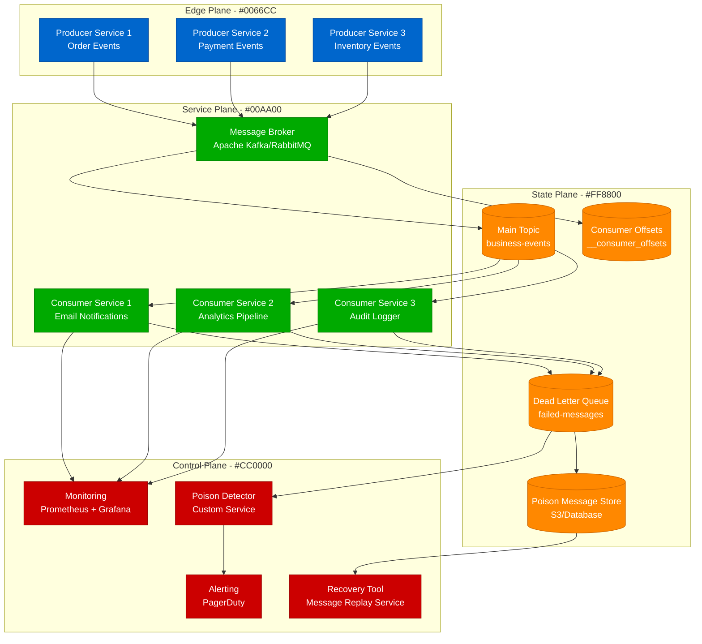

# Message Queue Poison Messages - Detection and Handling Guide

## Overview

This guide provides systematic approaches to identifying and handling poison messages in message queues. Based on production experiences from LinkedIn's Kafka operations, Amazon's SQS message processing, and Shopify's event-driven architecture.

## Architecture Context



## Poison Message Detection Flowchart

```mermaid
flowchart TD
    START[Message Processing Failure] --> IDENTIFY_PATTERN{Failure Pattern}

    IDENTIFY_PATTERN --> RETRY_EXHAUSTED[Retry Attempts Exhausted]
    IDENTIFY_PATTERN --> PARSE_ERROR[Message Parse Error]
    IDENTIFY_PATTERN --> SCHEMA_VIOLATION[Schema Validation Failure]
    IDENTIFY_PATTERN --> CONSUMER_CRASH[Consumer Crash/Exception]
    IDENTIFY_PATTERN --> INFINITE_REDELIVERY[Infinite Redelivery Loop]

    RETRY_EXHAUSTED --> CHECK_MESSAGE[Check Message Content<br/>Extract payload & headers]
    PARSE_ERROR --> VALIDATE_FORMAT[Validate Message Format<br/>JSON/Avro/Protobuf]
    SCHEMA_VIOLATION --> CHECK_SCHEMA[Check Schema Evolution<br/>Compatibility issues]
    CONSUMER_CRASH --> ANALYZE_STACK[Analyze Stack Trace<br/>Exception patterns]
    INFINITE_REDELIVERY --> CHECK_CONSUMER_LAG[Check Consumer Lag<br/>Offset progression]

    CHECK_MESSAGE --> MESSAGE_ANALYSIS{Message Analysis}
    VALIDATE_FORMAT --> FORMAT_ANALYSIS{Format Analysis}
    CHECK_SCHEMA --> SCHEMA_ANALYSIS{Schema Analysis}
    ANALYZE_STACK --> EXCEPTION_ANALYSIS{Exception Analysis}
    CHECK_CONSUMER_LAG --> LAG_ANALYSIS{Lag Analysis}

    MESSAGE_ANALYSIS --> CORRUPT_DATA[Corrupted Message Data]
    MESSAGE_ANALYSIS --> INVALID_CONTENT[Invalid Business Logic]
    MESSAGE_ANALYSIS --> OVERSIZED_MESSAGE[Message Too Large]

    FORMAT_ANALYSIS --> MALFORMED_JSON[Malformed JSON/XML]
    FORMAT_ANALYSIS --> ENCODING_ISSUE[Character Encoding Issue]
    FORMAT_ANALYSIS --> MISSING_FIELDS[Required Fields Missing]

    SCHEMA_ANALYSIS --> INCOMPATIBLE_SCHEMA[Schema Incompatibility]
    SCHEMA_ANALYSIS --> VERSION_MISMATCH[Version Mismatch]
    SCHEMA_ANALYSIS --> FIELD_TYPE_CHANGE[Field Type Changed]

    EXCEPTION_ANALYSIS --> NULL_POINTER[Null Pointer Exception]
    EXCEPTION_ANALYSIS --> TYPE_CAST_ERROR[Type Cast Exception]
    EXCEPTION_ANALYSIS --> BUSINESS_LOGIC_ERROR[Business Logic Error]

    LAG_ANALYSIS --> STUCK_CONSUMER[Consumer Stuck on Message]
    LAG_ANALYSIS --> PROCESSING_TOO_SLOW[Processing Too Slow]

    %% Solutions
    CORRUPT_DATA --> QUARANTINE_MESSAGE[Quarantine Message<br/>Move to poison queue]
    INVALID_CONTENT --> VALIDATE_BUSINESS_RULES[Validate Business Rules<br/>Update validation]
    OVERSIZED_MESSAGE --> SPLIT_MESSAGE[Split Large Messages<br/>Chunking strategy]

    MALFORMED_JSON --> FIX_PRODUCER[Fix Producer<br/>Validate before send]
    ENCODING_ISSUE --> STANDARDIZE_ENCODING[Standardize Encoding<br/>UTF-8 everywhere]
    MISSING_FIELDS --> ADD_DEFAULT_VALUES[Add Default Values<br/>Backward compatibility]

    INCOMPATIBLE_SCHEMA --> SCHEMA_MIGRATION[Schema Migration<br/>Gradual rollout]
    VERSION_MISMATCH --> VERSION_STRATEGY[Version Strategy<br/>Multiple version support]
    FIELD_TYPE_CHANGE --> TYPE_CONVERSION[Type Conversion<br/>Safe casting]

    NULL_POINTER --> NULL_SAFETY[Implement Null Safety<br/>Defensive programming]
    TYPE_CAST_ERROR --> TYPE_VALIDATION[Add Type Validation<br/>Safe casting]
    BUSINESS_LOGIC_ERROR --> LOGIC_FIX[Fix Business Logic<br/>Handle edge cases]

    STUCK_CONSUMER --> SKIP_MESSAGE[Skip Poison Message<br/>Manual intervention]
    PROCESSING_TOO_SLOW --> OPTIMIZE_PROCESSING[Optimize Processing<br/>Performance tuning]

    %% Recovery
    QUARANTINE_MESSAGE --> MANUAL_REVIEW[Manual Review & Recovery]
    FIX_PRODUCER --> REPLAY_MESSAGES[Replay Valid Messages]
    STANDARDIZE_ENCODING --> REPLAY_MESSAGES
    ADD_DEFAULT_VALUES --> REPLAY_MESSAGES
    SCHEMA_MIGRATION --> GRADUAL_MIGRATION[Gradual Migration]
    VERSION_STRATEGY --> GRADUAL_MIGRATION
    TYPE_CONVERSION --> GRADUAL_MIGRATION
    NULL_SAFETY --> UPDATE_CONSUMER[Update Consumer Code]
    TYPE_VALIDATION --> UPDATE_CONSUMER
    LOGIC_FIX --> UPDATE_CONSUMER
    SKIP_MESSAGE --> MANUAL_REVIEW
    OPTIMIZE_PROCESSING --> UPDATE_CONSUMER

    %% Monitoring
    MANUAL_REVIEW --> MONITOR[Monitor Queue Health]
    REPLAY_MESSAGES --> MONITOR
    GRADUAL_MIGRATION --> MONITOR
    UPDATE_CONSUMER --> MONITOR

    MONITOR --> SUCCESS[Queue Processing Stable]
    MONITOR --> ESCALATE[Escalate to Platform Team]
```



## Platform-Specific Detection

### Apache Kafka Poison Message Detection

#### Consumer Lag and Offset Analysis
```bash
# Check consumer group lag
kafka-consumer-groups --bootstrap-server kafka:9092 --group my-consumer-group --describe

# Check stuck consumers
kafka-consumer-groups --bootstrap-server kafka:9092 --group my-consumer-group --describe | \
  awk 'NR>1 && $5 > 1000 {print "Partition " $2 " stuck with lag: " $5}'

# Get specific message at offset
kafka-console-consumer --bootstrap-server kafka:9092 \
  --topic problematic-topic --partition 0 --offset 12345 --max-messages 1

# Check message size distribution
kafka-run-class kafka.tools.DumpLogSegments \
  --files /var/kafka-logs/problematic-topic-0/00000000000000000000.log \
  --print-data-log | grep "payload size" | sort -n | tail -10
```

#### Kafka Streams Poison Message Handling
```java
// Kafka Streams with poison message handling
public class PoisonMessageHandler {

    public KafkaStreams createStream() {
        StreamsBuilder builder = new StreamsBuilder();

        KStream<String, String> input = builder.stream("input-topic");

        // Add poison message detection
        KStream<String, String> processed = input
            .mapValues((readOnlyKey, value) -> {
                try {
                    return processMessage(value);
                } catch (Exception e) {
                    // Log poison message details
                    logPoisonMessage(readOnlyKey, value, e);

                    // Send to dead letter topic
                    sendToDeadLetterTopic(readOnlyKey, value, e);

                    return null; // Filter out poison message
                }
            })
            .filter((key, value) -> value != null);

        processed.to("output-topic");

        Properties props = new Properties();
        props.put(StreamsConfig.APPLICATION_ID_CONFIG, "poison-handler-app");
        props.put(StreamsConfig.BOOTSTRAP_SERVERS_CONFIG, "kafka:9092");

        // Configure error handling
        props.put(StreamsConfig.DEFAULT_DESERIALIZATION_EXCEPTION_HANDLER_CLASS_CONFIG,
                 LogAndContinueExceptionHandler.class);
        props.put(StreamsConfig.DEFAULT_PRODUCTION_EXCEPTION_HANDLER_CLASS_CONFIG,
                 DefaultProductionExceptionHandler.class);

        return new KafkaStreams(builder.build(), props);
    }

    private String processMessage(String message) throws ProcessingException {
        // Validate message format
        if (message == null || message.trim().isEmpty()) {
            throw new ProcessingException("Empty message");
        }

        // Parse JSON
        ObjectMapper mapper = new ObjectMapper();
        try {
            JsonNode jsonNode = mapper.readTree(message);

            // Validate required fields
            if (!jsonNode.has("id") || !jsonNode.has("timestamp")) {
                throw new ProcessingException("Missing required fields");
            }

            // Business logic validation
            String messageType = jsonNode.get("type").asText();
            if (!isValidMessageType(messageType)) {
                throw new ProcessingException("Invalid message type: " + messageType);
            }

            // Transform message
            return transformMessage(jsonNode);

        } catch (JsonProcessingException e) {
            throw new ProcessingException("Invalid JSON format", e);
        }
    }

    private void logPoisonMessage(String key, String value, Exception e) {
        PoisonMessageLog poisonLog = PoisonMessageLog.builder()
            .messageKey(key)
            .messageValue(value)
            .errorType(e.getClass().getSimpleName())
            .errorMessage(e.getMessage())
            .timestamp(Instant.now())
            .build();

        // Log to structured logging
        log.error("Poison message detected: {}", poisonLog);

        // Store in database for analysis
        poisonMessageRepository.save(poisonLog);
    }

    private void sendToDeadLetterTopic(String key, String value, Exception e) {
        DeadLetterMessage dlm = DeadLetterMessage.builder()
            .originalKey(key)
            .originalValue(value)
            .errorReason(e.getMessage())
            .errorStackTrace(ExceptionUtils.getStackTrace(e))
            .originalTopic("input-topic")
            .failureTimestamp(Instant.now())
            .build();

        deadLetterProducer.send(new ProducerRecord<>("dead-letter-topic",
            key, objectMapper.writeValueAsString(dlm)));
    }
}

// Custom exception handler for deserialization errors
public class CustomDeserializationHandler implements DeserializationExceptionHandler {
    @Override
    public DeserializationHandlerResponse handle(ProcessorContext context,
                                               ConsumerRecord<byte[], byte[]> record,
                                               Exception exception) {

        log.error("Deserialization error for record {}: {}",
                 record, exception.getMessage());

        // Send malformed message to dead letter topic
        sendMalformedMessageToDLT(record, exception);

        // Continue processing other messages
        return DeserializationHandlerResponse.CONTINUE;
    }

    private void sendMalformedMessageToDLT(ConsumerRecord<byte[], byte[]> record,
                                          Exception exception) {
        MalformedMessage malformed = MalformedMessage.builder()
            .rawKey(record.key())
            .rawValue(record.value())
            .partition(record.partition())
            .offset(record.offset())
            .errorMessage(exception.getMessage())
            .build();

        // Send to malformed message topic for manual review
        malformedMessageProducer.send(new ProducerRecord<>("malformed-messages",
            record.key(), serialize(malformed)));
    }
}
```

### Amazon SQS Poison Message Handling

#### SQS Dead Letter Queue Configuration
```yaml
# CloudFormation template for SQS with DLQ
Resources:
  MainQueue:
    Type: AWS::SQS::Queue
    Properties:
      QueueName: order-processing-queue
      VisibilityTimeoutSeconds: 300
      MessageRetentionPeriod: 1209600  # 14 days
      RedrivePolicy:
        deadLetterTargetArn: !GetAtt DeadLetterQueue.Arn
        maxReceiveCount: 3

  DeadLetterQueue:
    Type: AWS::SQS::Queue
    Properties:
      QueueName: order-processing-dlq
      MessageRetentionPeriod: 1209600  # 14 days

  PoisonMessageAlarm:
    Type: AWS::CloudWatch::Alarm
    Properties:
      AlarmName: poison-messages-detected
      AlarmDescription: Messages sent to DLQ
      MetricName: ApproximateNumberOfMessages
      Namespace: AWS/SQS
      Statistic: Sum
      Period: 300
      EvaluationPeriods: 1
      Threshold: 1
      ComparisonOperator: GreaterThanOrEqualToThreshold
      Dimensions:
        - Name: QueueName
          Value: !GetAtt DeadLetterQueue.QueueName
      AlarmActions:
        - !Ref PoisonMessageTopic

  PoisonMessageTopic:
    Type: AWS::SNS::Topic
    Properties:
      TopicName: poison-message-alerts
```

#### SQS Consumer with Poison Message Detection
```python
import boto3
import json
import logging
from typing import Optional, Dict, Any
from dataclasses import dataclass
from datetime import datetime

@dataclass
class PoisonMessageInfo:
    message_id: str
    receipt_handle: str
    body: str
    attributes: Dict[str, Any]
    error_type: str
    error_message: str
    receive_count: int

class SQSPoisonMessageHandler:
    def __init__(self, queue_url: str, dlq_url: str):
        self.sqs = boto3.client('sqs')
        self.queue_url = queue_url
        self.dlq_url = dlq_url
        self.logger = logging.getLogger(__name__)

    def process_messages(self):
        """Process messages with poison message detection"""
        while True:
            try:
                # Receive messages
                response = self.sqs.receive_message(
                    QueueUrl=self.queue_url,
                    MaxNumberOfMessages=10,
                    WaitTimeSeconds=20,
                    AttributeNames=['ApproximateReceiveCount', 'SentTimestamp'],
                    MessageAttributeNames=['All']
                )

                messages = response.get('Messages', [])

                for message in messages:
                    try:
                        self.process_single_message(message)
                    except Exception as e:
                        self.handle_poison_message(message, e)

            except Exception as e:
                self.logger.error(f"Error processing message batch: {e}")

    def process_single_message(self, message: Dict[str, Any]):
        """Process a single message with validation"""
        message_body = message['Body']
        receipt_handle = message['ReceiptHandle']
        receive_count = int(message['Attributes'].get('ApproximateReceiveCount', 0))

        try:
            # Parse message body
            if self.is_json_message(message_body):
                parsed_message = json.loads(message_body)
            else:
                raise ValueError("Message is not valid JSON")

            # Validate message structure
            self.validate_message_structure(parsed_message)

            # Validate business rules
            self.validate_business_rules(parsed_message)

            # Process message
            result = self.process_business_logic(parsed_message)

            # Delete message on success
            self.sqs.delete_message(
                QueueUrl=self.queue_url,
                ReceiptHandle=receipt_handle
            )

            self.logger.info(f"Successfully processed message {message['MessageId']}")

        except Exception as e:
            # Check if this might be a poison message
            if receive_count >= 3:
                self.mark_as_poison_message(message, e)
            else:
                # Let SQS retry the message
                self.logger.warning(f"Message processing failed (attempt {receive_count}): {e}")
                raise

    def validate_message_structure(self, message: Dict[str, Any]):
        """Validate required message fields"""
        required_fields = ['id', 'type', 'timestamp', 'data']

        for field in required_fields:
            if field not in message:
                raise ValueError(f"Missing required field: {field}")

        # Validate timestamp format
        try:
            datetime.fromisoformat(message['timestamp'])
        except ValueError:
            raise ValueError("Invalid timestamp format")

        # Validate message type
        valid_types = ['order_created', 'order_updated', 'order_cancelled']
        if message['type'] not in valid_types:
            raise ValueError(f"Invalid message type: {message['type']}")

    def validate_business_rules(self, message: Dict[str, Any]):
        """Validate business logic rules"""
        data = message.get('data', {})

        if message['type'] == 'order_created':
            if 'customer_id' not in data or 'items' not in data:
                raise ValueError("Order creation message missing required data")

            if not isinstance(data['items'], list) or len(data['items']) == 0:
                raise ValueError("Order must have at least one item")

        elif message['type'] == 'order_updated':
            if 'order_id' not in data:
                raise ValueError("Order update message missing order_id")

    def mark_as_poison_message(self, message: Dict[str, Any], error: Exception):
        """Mark message as poison and handle appropriately"""
        poison_info = PoisonMessageInfo(
            message_id=message['MessageId'],
            receipt_handle=message['ReceiptHandle'],
            body=message['Body'],
            attributes=message.get('Attributes', {}),
            error_type=type(error).__name__,
            error_message=str(error),
            receive_count=int(message['Attributes'].get('ApproximateReceiveCount', 0))
        )

        # Log poison message
        self.logger.error(f"Poison message detected: {poison_info}")

        # Store poison message details for analysis
        self.store_poison_message_analysis(poison_info)

        # Move to dead letter queue (SQS will do this automatically)
        # But we'll delete the message to prevent further processing
        self.sqs.delete_message(
            QueueUrl=self.queue_url,
            ReceiptHandle=message['ReceiptHandle']
        )

        # Send alert
        self.send_poison_message_alert(poison_info)

    def store_poison_message_analysis(self, poison_info: PoisonMessageInfo):
        """Store poison message for later analysis"""
        analysis_data = {
            'message_id': poison_info.message_id,
            'error_type': poison_info.error_type,
            'error_message': poison_info.error_message,
            'message_body': poison_info.body,
            'receive_count': poison_info.receive_count,
            'detection_timestamp': datetime.utcnow().isoformat(),
            'queue_name': self.queue_url.split('/')[-1]
        }

        # Store in DynamoDB or similar for analysis
        # dynamodb.put_item(TableName='poison_messages', Item=analysis_data)

        # Or send to analytics pipeline
        self.logger.info(f"Stored poison message analysis: {analysis_data}")

    def send_poison_message_alert(self, poison_info: PoisonMessageInfo):
        """Send alert for poison message"""
        alert_message = {
            'alert_type': 'poison_message_detected',
            'queue_name': self.queue_url.split('/')[-1],
            'message_id': poison_info.message_id,
            'error_type': poison_info.error_type,
            'error_message': poison_info.error_message,
            'receive_count': poison_info.receive_count
        }

        # Send to monitoring system
        # sns.publish(TopicArn=poison_alert_topic, Message=json.dumps(alert_message))

    def is_json_message(self, message_body: str) -> bool:
        """Check if message body is valid JSON"""
        try:
            json.loads(message_body)
            return True
        except json.JSONDecodeError:
            return False

    def process_business_logic(self, message: Dict[str, Any]) -> Any:
        """Implement your business logic here"""
        # Simulate processing
        return {"status": "processed", "message_id": message["id"]}
```

### RabbitMQ Poison Message Handling

#### RabbitMQ Dead Letter Exchange Setup
```python
import pika
import json
import logging
from typing import Dict, Any, Optional

class RabbitMQPoisonMessageHandler:
    def __init__(self, connection_url: str):
        self.connection = pika.BlockingConnection(pika.URLParameters(connection_url))
        self.channel = self.connection.channel()
        self.logger = logging.getLogger(__name__)
        self.setup_queues()

    def setup_queues(self):
        """Setup main queue with dead letter exchange"""
        # Declare dead letter exchange
        self.channel.exchange_declare(
            exchange='dead_letter_exchange',
            exchange_type='direct',
            durable=True
        )

        # Declare dead letter queue
        self.channel.queue_declare(
            queue='dead_letter_queue',
            durable=True,
            arguments={
                'x-message-ttl': 1209600000,  # 14 days in milliseconds
            }
        )

        # Bind dead letter queue to exchange
        self.channel.queue_bind(
            exchange='dead_letter_exchange',
            queue='dead_letter_queue',
            routing_key='failed'
        )

        # Declare main processing queue with DLX
        self.channel.queue_declare(
            queue='order_processing',
            durable=True,
            arguments={
                'x-dead-letter-exchange': 'dead_letter_exchange',
                'x-dead-letter-routing-key': 'failed',
                'x-max-retries': 3
            }
        )

    def consume_messages(self):
        """Consume messages with poison message handling"""
        self.channel.basic_qos(prefetch_count=10)
        self.channel.basic_consume(
            queue='order_processing',
            on_message_callback=self.process_message,
            auto_ack=False
        )

        self.logger.info("Starting message consumption...")
        self.channel.start_consuming()

    def process_message(self, channel, method, properties, body):
        """Process individual message with error handling"""
        try:
            # Decode message
            message_str = body.decode('utf-8')
            message_data = json.loads(message_str)

            # Get retry count from headers
            retry_count = 0
            if properties.headers and 'x-retry-count' in properties.headers:
                retry_count = properties.headers['x-retry-count']

            # Validate message
            self.validate_message(message_data)

            # Process business logic
            self.process_order_message(message_data)

            # Acknowledge successful processing
            channel.basic_ack(delivery_tag=method.delivery_tag)
            self.logger.info(f"Successfully processed message {message_data.get('id', 'unknown')}")

        except json.JSONDecodeError as e:
            self.handle_poison_message(channel, method, properties, body,
                                     "JSON_DECODE_ERROR", str(e))

        except ValueError as e:
            self.handle_poison_message(channel, method, properties, body,
                                     "VALIDATION_ERROR", str(e))

        except Exception as e:
            retry_count = 0
            if properties.headers and 'x-retry-count' in properties.headers:
                retry_count = properties.headers['x-retry-count']

            if retry_count < 3:
                # Retry the message
                self.retry_message(channel, method, properties, body, retry_count + 1)
            else:
                # Mark as poison message
                self.handle_poison_message(channel, method, properties, body,
                                         "PROCESSING_ERROR", str(e))

    def validate_message(self, message: Dict[str, Any]):
        """Validate message structure and content"""
        required_fields = ['id', 'type', 'data']

        for field in required_fields:
            if field not in message:
                raise ValueError(f"Missing required field: {field}")

        # Validate message type
        valid_types = ['order_created', 'order_updated', 'order_cancelled']
        if message['type'] not in valid_types:
            raise ValueError(f"Invalid message type: {message['type']}")

        # Validate data structure based on type
        if message['type'] == 'order_created':
            data = message['data']
            if 'customer_id' not in data or 'items' not in data:
                raise ValueError("Order creation missing required fields")

    def retry_message(self, channel, method, properties, body, retry_count):
        """Retry message with exponential backoff"""
        # Add retry count to headers
        headers = properties.headers or {}
        headers['x-retry-count'] = retry_count
        headers['x-retry-timestamp'] = int(time.time())

        # Calculate delay (exponential backoff)
        delay_ms = min(1000 * (2 ** (retry_count - 1)), 30000)  # Max 30 seconds

        # Publish to delayed queue or use TTL + DLX for delay
        retry_properties = pika.BasicProperties(
            headers=headers,
            delivery_mode=2,  # Persistent
            expiration=str(delay_ms)
        )

        # Reject and requeue after delay
        channel.basic_nack(delivery_tag=method.delivery_tag, requeue=False)

        # Publish to retry queue with delay
        self.channel.basic_publish(
            exchange='',
            routing_key='order_processing',
            body=body,
            properties=retry_properties
        )

        self.logger.warning(f"Retrying message (attempt {retry_count}) after {delay_ms}ms delay")

    def handle_poison_message(self, channel, method, properties, body,
                            error_type: str, error_message: str):
        """Handle poison message"""
        try:
            # Create poison message record
            poison_record = {
                'original_body': body.decode('utf-8', errors='replace'),
                'error_type': error_type,
                'error_message': error_message,
                'routing_key': method.routing_key,
                'exchange': method.exchange,
                'delivery_tag': method.delivery_tag,
                'timestamp': datetime.utcnow().isoformat(),
                'headers': dict(properties.headers) if properties.headers else {}
            }

            # Log poison message
            self.logger.error(f"Poison message detected: {poison_record}")

            # Store for analysis
            self.store_poison_message(poison_record)

            # Send alert
            self.send_poison_alert(poison_record)

        except Exception as e:
            self.logger.error(f"Error handling poison message: {e}")

        finally:
            # Reject message (will go to DLX)
            channel.basic_nack(delivery_tag=method.delivery_tag, requeue=False)

    def store_poison_message(self, poison_record: Dict[str, Any]):
        """Store poison message for later analysis"""
        # Store in database or send to analytics system
        # This could be MongoDB, PostgreSQL, or an analytics pipeline
        self.logger.info(f"Storing poison message: {poison_record['error_type']}")

    def send_poison_alert(self, poison_record: Dict[str, Any]):
        """Send alert for poison message detection"""
        alert = {
            'alert_type': 'poison_message',
            'error_type': poison_record['error_type'],
            'error_message': poison_record['error_message'],
            'queue': 'order_processing',
            'timestamp': poison_record['timestamp']
        }

        # Send to monitoring system
        self.logger.warning(f"POISON MESSAGE ALERT: {alert}")

    def process_order_message(self, message: Dict[str, Any]):
        """Process order business logic"""
        # Implement your business logic here
        order_type = message['type']
        order_data = message['data']

        if order_type == 'order_created':
            self.create_order(order_data)
        elif order_type == 'order_updated':
            self.update_order(order_data)
        elif order_type == 'order_cancelled':
            self.cancel_order(order_data)

    def create_order(self, order_data: Dict[str, Any]):
        """Create order logic"""
        # Simulate order creation
        customer_id = order_data['customer_id']
        items = order_data['items']

        # Validate customer exists
        # Validate items availability
        # Create order record
        pass

    def update_order(self, order_data: Dict[str, Any]):
        """Update order logic"""
        pass

    def cancel_order(self, order_data: Dict[str, Any]):
        """Cancel order logic"""
        pass
```

## Monitoring & Recovery

### Poison Message Analytics Dashboard
```python
# Poison message analytics service
from dataclasses import dataclass
from typing import List, Dict, Any
from datetime import datetime, timedelta
import pandas as pd

@dataclass
class PoisonMessageStats:
    total_count: int
    error_type_distribution: Dict[str, int]
    hourly_trend: List[Dict[str, Any]]
    affected_queues: Dict[str, int]
    top_error_messages: List[Dict[str, Any]]

class PoisonMessageAnalytics:
    def __init__(self, storage_backend):
        self.storage = storage_backend

    def generate_poison_message_report(self, hours_back: int = 24) -> PoisonMessageStats:
        """Generate comprehensive poison message report"""
        end_time = datetime.utcnow()
        start_time = end_time - timedelta(hours=hours_back)

        # Query poison messages from storage
        poison_messages = self.storage.query_poison_messages(start_time, end_time)

        # Convert to DataFrame for analysis
        df = pd.DataFrame(poison_messages)

        if df.empty:
            return PoisonMessageStats(0, {}, [], {}, [])

        # Calculate statistics
        total_count = len(df)

        # Error type distribution
        error_type_dist = df['error_type'].value_counts().to_dict()

        # Hourly trend
        df['hour'] = pd.to_datetime(df['timestamp']).dt.floor('H')
        hourly_trend = (df.groupby(['hour', 'error_type'])
                       .size()
                       .reset_index(name='count')
                       .to_dict('records'))

        # Affected queues
        affected_queues = df['queue_name'].value_counts().to_dict()

        # Top error messages
        top_errors = (df.groupby('error_message')
                     .size()
                     .sort_values(ascending=False)
                     .head(10)
                     .reset_index(name='count')
                     .to_dict('records'))

        return PoisonMessageStats(
            total_count=total_count,
            error_type_distribution=error_type_dist,
            hourly_trend=hourly_trend,
            affected_queues=affected_queues,
            top_error_messages=top_errors
        )

    def identify_poison_patterns(self, hours_back: int = 168) -> List[Dict[str, Any]]:
        """Identify recurring poison message patterns"""
        end_time = datetime.utcnow()
        start_time = end_time - timedelta(hours=hours_back)

        poison_messages = self.storage.query_poison_messages(start_time, end_time)
        df = pd.DataFrame(poison_messages)

        if df.empty:
            return []

        patterns = []

        # Pattern 1: Repeated error messages
        repeated_errors = (df.groupby('error_message')
                          .size()
                          .sort_values(ascending=False)
                          .head(5))

        for error_msg, count in repeated_errors.items():
            if count > 10:  # Threshold for concern
                patterns.append({
                    'type': 'repeated_error',
                    'pattern': error_msg,
                    'count': count,
                    'severity': 'high' if count > 100 else 'medium'
                })

        # Pattern 2: Sudden spikes
        df['hour'] = pd.to_datetime(df['timestamp']).dt.floor('H')
        hourly_counts = df.groupby('hour').size()
        mean_hourly = hourly_counts.mean()
        std_hourly = hourly_counts.std()

        for hour, count in hourly_counts.items():
            if count > mean_hourly + (2 * std_hourly):  # 2 standard deviations
                patterns.append({
                    'type': 'spike',
                    'pattern': f'Spike at {hour}',
                    'count': count,
                    'severity': 'high'
                })

        return patterns
```

### Automated Recovery System
```python
class PoisonMessageRecovery:
    def __init__(self, queue_manager, storage_backend):
        self.queue_manager = queue_manager
        self.storage = storage_backend
        self.logger = logging.getLogger(__name__)

    def recover_fixable_messages(self, recovery_strategy: str = 'auto'):
        """Attempt to recover poison messages that can be fixed"""
        # Get poison messages from last 24 hours
        poison_messages = self.storage.get_recoverable_messages()

        recovery_stats = {
            'attempted': 0,
            'successful': 0,
            'failed': 0,
            'skipped': 0
        }

        for poison_msg in poison_messages:
            recovery_stats['attempted'] += 1

            try:
                if self.can_auto_recover(poison_msg):
                    fixed_message = self.fix_message(poison_msg)
                    if fixed_message:
                        # Republish fixed message
                        self.queue_manager.publish_message(
                            poison_msg['original_queue'],
                            fixed_message
                        )
                        recovery_stats['successful'] += 1
                        self.mark_message_recovered(poison_msg['id'])
                    else:
                        recovery_stats['skipped'] += 1
                else:
                    recovery_stats['skipped'] += 1

            except Exception as e:
                self.logger.error(f"Recovery failed for message {poison_msg['id']}: {e}")
                recovery_stats['failed'] += 1

        return recovery_stats

    def can_auto_recover(self, poison_msg: Dict[str, Any]) -> bool:
        """Determine if message can be automatically recovered"""
        error_type = poison_msg['error_type']

        # Auto-recoverable error types
        recoverable_errors = [
            'MISSING_FIELD',
            'TIMESTAMP_FORMAT',
            'ENCODING_ISSUE',
            'MINOR_VALIDATION_ERROR'
        ]

        return error_type in recoverable_errors

    def fix_message(self, poison_msg: Dict[str, Any]) -> Optional[Dict[str, Any]]:
        """Attempt to fix poison message"""
        try:
            original_body = json.loads(poison_msg['original_body'])
            error_type = poison_msg['error_type']

            if error_type == 'MISSING_FIELD':
                return self.fix_missing_fields(original_body, poison_msg['error_message'])
            elif error_type == 'TIMESTAMP_FORMAT':
                return self.fix_timestamp_format(original_body)
            elif error_type == 'ENCODING_ISSUE':
                return self.fix_encoding_issue(original_body)

            return None

        except Exception as e:
            self.logger.error(f"Message fix failed: {e}")
            return None

    def fix_missing_fields(self, message: Dict[str, Any], error_msg: str) -> Dict[str, Any]:
        """Fix messages with missing fields by adding defaults"""
        # Extract missing field from error message
        if 'timestamp' in error_msg.lower():
            message['timestamp'] = datetime.utcnow().isoformat()
        if 'id' in error_msg.lower() and 'id' not in message:
            message['id'] = str(uuid.uuid4())

        return message

    def fix_timestamp_format(self, message: Dict[str, Any]) -> Dict[str, Any]:
        """Fix timestamp format issues"""
        if 'timestamp' in message:
            # Try to parse and reformat timestamp
            ts_str = message['timestamp']
            try:
                # Try various formats
                for fmt in ['%Y-%m-%d %H:%M:%S', '%Y-%m-%dT%H:%M:%S', '%Y/%m/%d %H:%M:%S']:
                    try:
                        dt = datetime.strptime(ts_str, fmt)
                        message['timestamp'] = dt.isoformat()
                        break
                    except ValueError:
                        continue
            except:
                # If all fails, use current timestamp
                message['timestamp'] = datetime.utcnow().isoformat()

        return message
```

## Success Metrics

- **Poison Message Rate**: < 0.1% of total messages processed
- **Detection Time**: < 5 minutes from first occurrence
- **Dead Letter Queue Size**: < 1000 messages at any time
- **Recovery Success Rate**: > 80% for auto-recoverable messages
- **False Positive Rate**: < 1% of poison message alerts
- **Consumer Lag**: No consumer stuck on poison messages > 5 minutes

## The 3 AM Test

**Scenario**: Your order processing system is down because consumers are stuck processing the same malformed message repeatedly, causing a 4-hour backlog of unprocessed orders.

**This guide provides**:
1. **Immediate detection**: Commands to identify stuck consumers and problematic messages
2. **Message analysis**: Tools to extract and analyze poison message content
3. **Quick mitigation**: Scripts to quarantine poison messages and restart processing
4. **Pattern identification**: Analytics to find recurring poison message patterns
5. **Automated recovery**: Systems to fix and replay recoverable messages

**Expected outcome**: Consumers unstuck within 10 minutes, poison messages quarantined, normal processing resumed, automated recovery system deployed within 2 hours.