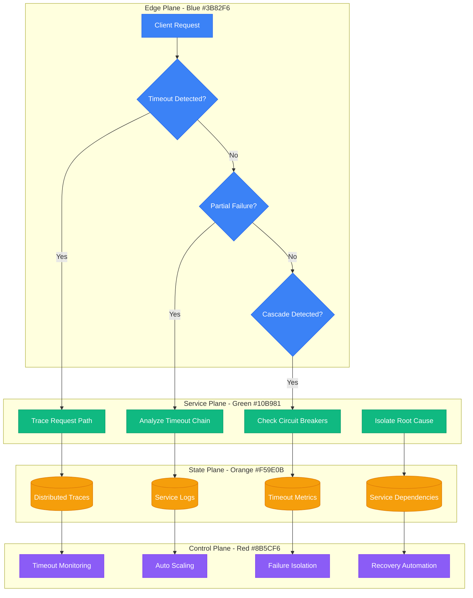
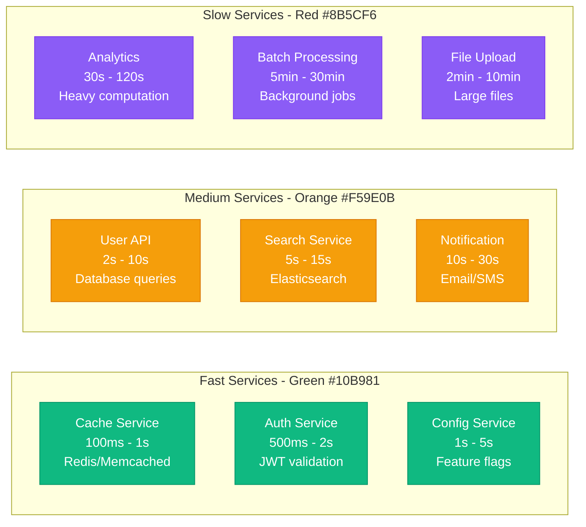

# Microservice Timeout Chains - Production Debugging Guide

## Overview

Cascading timeout failures in microservice architectures can bring down entire systems. This guide covers systematic debugging for timeout propagation, circuit breaker failures, and distributed system resilience patterns commonly required in production environments.

## Debugging Flowchart



## Common Timeout Chain Patterns

### 1. Cascading Timeout Failures
**Typical Scenario:**
```
User Request (30s timeout)
  → API Gateway (25s timeout)
    → User Service (20s timeout)
      → Database (15s timeout) ← SLOW QUERY (30s actual)
        ↓
      ✗ Database timeout after 15s
    ↓
    ✗ User Service timeout after 20s
  ↓
  ✗ API Gateway timeout after 25s
↓
✗ User sees timeout after 30s
```

**Investigation Commands:**
```bash
# Check service dependency chain
kubectl get services -o wide
kubectl describe service user-service

# Analyze distributed traces
curl -H "X-Trace-Id: abc123" http://jaeger:16686/api/traces/abc123

# Check timeout configurations
kubectl get configmap app-config -o yaml | grep -i timeout

# Monitor active connections
ss -tulpn | grep :8080
netstat -an | grep ESTABLISHED | wc -l
```

### 2. Circuit Breaker Cascade
**Failure Pattern:**
```
Service A → Service B → Service C
    ↓           ↓           ↓
Circuit      Circuit    Circuit
Breaker      Breaker    Breaker
[CLOSED]     [HALF-OPEN] [OPEN] ← Root failure
    ↓           ↓           ↓
[OPEN]       [OPEN]      [OPEN] ← All breakers trip
```

**Detection and Analysis:**
```bash
# Check circuit breaker status (Hystrix example)
curl http://hystrix-dashboard:7979/hystrix/monitor?stream=http://app:8080/actuator/hystrix.stream

# Circuit breaker metrics
curl http://app:8080/actuator/metrics/hystrix.command.UserService.circuitBreaker.open

# Service mesh circuit breaker status (Istio)
kubectl get destinationrule -o yaml | grep -A 10 circuitBreaker
```

## Timeout Configuration Analysis

### Timeout Hierarchy Visualization

```mermaid
graph TB
    subgraph TimeoutLayers[Timeout Configuration Layers - Blue #3B82F6]
        LOAD_BALANCER[Load Balancer<br/>60s - External timeout]
        API_GATEWAY[API Gateway<br/>45s - Service timeout]
        SERVICE_MESH[Service Mesh<br/>30s - Inter-service timeout]
        APPLICATION[Application<br/>20s - Business logic timeout]
        DATABASE[Database<br/>10s - Query timeout]
    end

    subgraph BestPractices[Best Practices - Green #10B981]
        DECREASING[Decreasing Timeouts<br/>Each layer < previous]
        BUFFER_TIME[Buffer Time<br/>5-10s between layers]
        CIRCUIT_BREAKERS[Circuit Breakers<br/>Fail fast on timeout]
        RETRY_LOGIC[Exponential Backoff<br/>Avoid retry storms]
    end

    subgraph AntiPatterns[Anti-Patterns - Red #8B5CF6]
        SAME_TIMEOUT[Same Timeout<br/>All layers = 30s]
        INCREASING[Increasing Timeouts<br/>Downstream > upstream]
        NO_TIMEOUTS[No Timeouts<br/>Infinite wait]
        AGGRESSIVE_RETRY[Aggressive Retry<br/>Retry storms]
    end

    LOAD_BALANCER --> DECREASING
    API_GATEWAY --> BUFFER_TIME
    SERVICE_MESH --> CIRCUIT_BREAKERS
    APPLICATION --> RETRY_LOGIC

    SAME_TIMEOUT --> DECREASING
    INCREASING --> BUFFER_TIME
    NO_TIMEOUTS --> CIRCUIT_BREAKERS
    AGGRESSIVE_RETRY --> RETRY_LOGIC

    classDef timeoutStyle fill:#3B82F6,stroke:#2563EB,color:#fff
    classDef goodStyle fill:#10B981,stroke:#059669,color:#fff
    classDef badStyle fill:#8B5CF6,stroke:#7C3AED,color:#fff

    class LOAD_BALANCER,API_GATEWAY,SERVICE_MESH,APPLICATION,DATABASE timeoutStyle
    class DECREASING,BUFFER_TIME,CIRCUIT_BREAKERS,RETRY_LOGIC goodStyle
    class SAME_TIMEOUT,INCREASING,NO_TIMEOUTS,AGGRESSIVE_RETRY badStyle
```


### Service-Specific Timeout Patterns


## Distributed Tracing for Timeout Analysis

### Jaeger Trace Analysis
```bash
# Query traces with timeout errors
curl "http://jaeger:16686/api/traces?service=user-service&operation=get-user&tags=%7B%22error%22%3A%22true%22%7D&limit=50"

# Analyze trace duration
curl "http://jaeger:16686/api/traces?service=user-service&minDuration=10s&maxDuration=30s"

# Find slow dependencies
curl "http://jaeger:16686/api/services/user-service/operations" | jq '.data[] | select(.operationName | contains("database"))'
```

### Custom Timeout Tracking
```python
# Python decorator for timeout tracking
import time
import functools
import asyncio
from typing import Optional, Callable, Any
import logging

logger = logging.getLogger(__name__)

class TimeoutTracker:
    def __init__(self):
        self.timeout_events = []
        self.service_timeouts = {}

    def track_timeout(self, service_name: str, operation: str, timeout_value: float):
        """Track timeout configuration for a service operation"""
        key = f"{service_name}.{operation}"
        self.service_timeouts[key] = timeout_value

    def record_timeout_event(self, service_name: str, operation: str, duration: float, success: bool):
        """Record timeout event for analysis"""
        event = {
            'service': service_name,
            'operation': operation,
            'duration': duration,
            'success': success,
            'timestamp': time.time()
        }
        self.timeout_events.append(event)

        # Detect potential timeout chains
        if not success and duration > 0.8 * self.service_timeouts.get(f"{service_name}.{operation}", float('inf')):
            self.analyze_timeout_chain(service_name, operation)

    def analyze_timeout_chain(self, service_name: str, operation: str):
        """Analyze potential timeout chain patterns"""
        recent_timeouts = [
            event for event in self.timeout_events
            if time.time() - event['timestamp'] < 60  # Last minute
            and not event['success']
        ]

        if len(recent_timeouts) > 3:
            logger.warning(f"Potential timeout cascade detected: {len(recent_timeouts)} timeouts in last minute")
            self.trigger_circuit_breaker(service_name)

    def trigger_circuit_breaker(self, service_name: str):
        """Trigger circuit breaker to prevent cascade"""
        logger.critical(f"Triggering circuit breaker for {service_name} due to timeout cascade")
        # Implementation depends on circuit breaker library

# Timeout decorator with distributed tracing
def with_timeout_tracking(service_name: str, operation: str, timeout_seconds: float):
    """Decorator to track service call timeouts"""

    def decorator(func: Callable) -> Callable:
        @functools.wraps(func)
        async def wrapper(*args, **kwargs) -> Any:
            start_time = time.time()
            success = False

            try:
                # Set timeout for the operation
                result = await asyncio.wait_for(
                    func(*args, **kwargs),
                    timeout=timeout_seconds
                )
                success = True
                return result

            except asyncio.TimeoutError:
                duration = time.time() - start_time
                logger.error(f"Timeout in {service_name}.{operation} after {duration:.2f}s")

                # Record timeout event
                timeout_tracker.record_timeout_event(service_name, operation, duration, False)

                # Add trace information
                trace_id = get_current_trace_id()  # From your tracing library
                logger.error(f"Timeout trace_id: {trace_id}")

                raise

            except Exception as e:
                duration = time.time() - start_time
                logger.error(f"Error in {service_name}.{operation}: {e}")
                timeout_tracker.record_timeout_event(service_name, operation, duration, False)
                raise

            finally:
                if success:
                    duration = time.time() - start_time
                    timeout_tracker.record_timeout_event(service_name, operation, duration, True)

        return wrapper
    return decorator

# Initialize global timeout tracker
timeout_tracker = TimeoutTracker()

# Example usage
@with_timeout_tracking("user-service", "get-user-profile", 5.0)
async def get_user_profile(user_id: str):
    """Get user profile with timeout tracking"""
    # Simulated database call
    await asyncio.sleep(2)  # Simulated processing time
    return {"user_id": user_id, "name": "John Doe"}

@with_timeout_tracking("user-service", "update-user", 10.0)
async def update_user_profile(user_id: str, data: dict):
    """Update user profile with timeout tracking"""
    # This might call multiple downstream services
    await call_database_service(user_id, data)
    await call_cache_service(user_id, data)
    await call_notification_service(user_id)
    return {"success": True}

@with_timeout_tracking("database-service", "query", 3.0)
async def call_database_service(user_id: str, data: dict):
    """Database service call with timeout"""
    await asyncio.sleep(1)  # Simulated DB query
    return {"result": "updated"}

def get_current_trace_id():
    """Extract trace ID from current context"""
    # This would integrate with your tracing library (Jaeger, Zipkin, etc.)
    return "trace-12345"
```

## Real Production Examples

### Netflix's Timeout Strategy
**Architecture:** 100+ microservices with complex dependency chains

**Hystrix Configuration:**
```java
// Netflix Hystrix timeout configuration
@HystrixCommand(
    commandKey = "UserService.getUserProfile",
    groupKey = "UserService",
    threadPoolKey = "UserServicePool",
    commandProperties = {
        @HystrixProperty(name = "execution.isolation.thread.timeoutInMilliseconds", value = "2000"),
        @HystrixProperty(name = "circuitBreaker.requestVolumeThreshold", value = "20"),
        @HystrixProperty(name = "circuitBreaker.errorThresholdPercentage", value = "50"),
        @HystrixProperty(name = "circuitBreaker.sleepWindowInMilliseconds", value = "30000")
    },
    threadPoolProperties = {
        @HystrixProperty(name = "coreSize", value = "10"),
        @HystrixProperty(name = "maxQueueSize", value = "20"),
        @HystrixProperty(name = "queueSizeRejectionThreshold", value = "15")
    },
    fallbackMethod = "getUserProfileFallback"
)
public UserProfile getUserProfile(String userId) {
    return userServiceClient.getProfile(userId);
}

public UserProfile getUserProfileFallback(String userId) {
    // Return cached or default profile
    return cacheService.getCachedProfile(userId)
            .orElse(UserProfile.defaultProfile(userId));
}

// Timeout configuration per service type
@Configuration
public class TimeoutConfiguration {

    @Bean
    public RestTemplate restTemplate() {
        HttpComponentsClientHttpRequestFactory factory = new HttpComponentsClientHttpRequestFactory();

        // Different timeouts for different service types
        factory.setConnectTimeout(1000);     // 1 second connection timeout
        factory.setReadTimeout(5000);        // 5 second read timeout

        return new RestTemplate(factory);
    }

    @Bean
    @Qualifier("fastService")
    public RestTemplate fastServiceTemplate() {
        HttpComponentsClientHttpRequestFactory factory = new HttpComponentsClientHttpRequestFactory();
        factory.setConnectTimeout(500);      // 500ms for cache/config services
        factory.setReadTimeout(2000);        // 2 seconds read timeout
        return new RestTemplate(factory);
    }

    @Bean
    @Qualifier("slowService")
    public RestTemplate slowServiceTemplate() {
        HttpComponentsClientHttpRequestFactory factory = new HttpComponentsClientHttpRequestFactory();
        factory.setConnectTimeout(2000);     // 2 seconds for analytics services
        factory.setReadTimeout(30000);       // 30 seconds read timeout
        return new RestTemplate(factory);
    }
}
```

### Uber's Distributed Timeout Management
**Challenge:** Real-time ride matching with strict latency requirements

**Service Mesh Configuration (Istio):**
```yaml
# Istio DestinationRule for timeout configuration
apiVersion: networking.istio.io/v1beta1
kind: DestinationRule
metadata:
  name: ride-service-timeout
  namespace: production
spec:
  host: ride-service
  trafficPolicy:
    connectionPool:
      tcp:
        maxConnections: 100
        connectTimeout: 1s
      http:
        http1MaxPendingRequests: 50
        http2MaxRequests: 100
        maxRequestsPerConnection: 10
        maxRetries: 3
        consecutiveGatewayErrors: 5
        interval: 30s
        baseEjectionTime: 30s
    outlierDetection:
      consecutive5xxErrors: 3
      consecutiveGatewayErrors: 3
      interval: 30s
      baseEjectionTime: 30s
      maxEjectionPercent: 50

---
# VirtualService for request timeout
apiVersion: networking.istio.io/v1beta1
kind: VirtualService
metadata:
  name: ride-service-routes
  namespace: production
spec:
  hosts:
  - ride-service
  http:
  - match:
    - uri:
        prefix: "/api/v1/rides/urgent"
    timeout: 2s  # Urgent requests get shorter timeout
    route:
    - destination:
        host: ride-service
        subset: urgent-pool
  - match:
    - uri:
        prefix: "/api/v1/rides"
    timeout: 10s  # Normal requests
    route:
    - destination:
        host: ride-service
        subset: normal-pool
  - match:
    - uri:
        prefix: "/api/v1/reports"
    timeout: 60s  # Reports can take longer
    route:
    - destination:
        host: ride-service
        subset: reports-pool
```

### GitHub's Git Operations Timeout Strategy
**Challenge:** Variable Git operation times (clone, push, pull)

**Adaptive Timeout Configuration:**
```python
# GitHub-style adaptive timeout management
import time
import statistics
from collections import defaultdict, deque
from typing import Dict, Deque

class AdaptiveTimeoutManager:
    def __init__(self):
        self.operation_history: Dict[str, Deque[float]] = defaultdict(lambda: deque(maxlen=100))
        self.base_timeouts = {
            'git-clone-small': 30,      # < 100MB repositories
            'git-clone-large': 300,     # > 100MB repositories
            'git-push': 60,             # Push operations
            'git-pull': 30,             # Pull operations
            'webhook-delivery': 10,      # Webhook deliveries
        }

    def get_adaptive_timeout(self, operation_type: str, repository_size: int = 0) -> float:
        """Calculate adaptive timeout based on historical performance"""

        # Get base timeout
        if operation_type == 'git-clone':
            if repository_size > 100 * 1024 * 1024:  # 100MB
                base_timeout = self.base_timeouts['git-clone-large']
            else:
                base_timeout = self.base_timeouts['git-clone-small']
        else:
            base_timeout = self.base_timeouts.get(operation_type, 30)

        # Get historical data
        history = self.operation_history[operation_type]

        if len(history) < 10:
            # Not enough data, use base timeout with safety margin
            return base_timeout * 1.5

        # Calculate percentiles
        p95 = statistics.quantiles(history, n=20)[18]  # 95th percentile
        p99 = statistics.quantiles(history, n=100)[98]  # 99th percentile
        mean = statistics.mean(history)

        # Adaptive timeout: p95 with safety margin, but cap at 3x base timeout
        adaptive_timeout = min(p95 * 1.2, base_timeout * 3)

        # Ensure minimum timeout
        return max(adaptive_timeout, base_timeout * 0.5)

    def record_operation_time(self, operation_type: str, duration: float):
        """Record operation completion time"""
        self.operation_history[operation_type].append(duration)

    def get_timeout_configuration(self, repository_info: dict) -> dict:
        """Get complete timeout configuration for a repository operation"""

        repo_size = repository_info.get('size_bytes', 0)
        operation_type = repository_info.get('operation', 'git-clone')

        return {
            'connection_timeout': 5,  # Always quick connection
            'operation_timeout': self.get_adaptive_timeout(operation_type, repo_size),
            'total_timeout': self.get_adaptive_timeout(operation_type, repo_size) + 10,
            'retry_attempts': 3 if repo_size < 50 * 1024 * 1024 else 1,  # Fewer retries for large repos
        }

# Usage example
timeout_manager = AdaptiveTimeoutManager()

async def perform_git_operation(repo_info: dict):
    """Perform Git operation with adaptive timeout"""

    config = timeout_manager.get_timeout_configuration(repo_info)
    operation_type = repo_info['operation']

    start_time = time.time()
    success = False

    try:
        # Perform the actual Git operation with timeout
        result = await asyncio.wait_for(
            execute_git_command(repo_info),
            timeout=config['operation_timeout']
        )
        success = True
        return result

    except asyncio.TimeoutError:
        logger.error(f"Git operation timeout: {operation_type} after {config['operation_timeout']}s")
        raise

    finally:
        if success:
            duration = time.time() - start_time
            timeout_manager.record_operation_time(operation_type, duration)
```

## Monitoring and Alerting

### Timeout Metrics Collection
```python
# Prometheus metrics for timeout monitoring
from prometheus_client import Counter, Histogram, Gauge

# Timeout counters
timeout_counter = Counter(
    'service_timeouts_total',
    'Total number of service timeouts',
    ['service_name', 'operation', 'timeout_type']
)

# Timeout duration histogram
timeout_duration = Histogram(
    'service_timeout_duration_seconds',
    'Duration of operations that timed out',
    ['service_name', 'operation'],
    buckets=[0.1, 0.5, 1.0, 2.5, 5.0, 10.0, 30.0, 60.0, 120.0, float('inf')]
)

# Circuit breaker state gauge
circuit_breaker_state = Gauge(
    'circuit_breaker_state',
    'Circuit breaker state (0=closed, 1=half-open, 2=open)',
    ['service_name', 'operation']
)

# Success rate after timeout
success_rate_after_timeout = Gauge(
    'service_success_rate_after_timeout',
    'Success rate for operations after timeout recovery',
    ['service_name', 'operation']
)

def record_timeout_event(service_name: str, operation: str, duration: float, timeout_type: str):
    """Record timeout event with metrics"""
    timeout_counter.labels(
        service_name=service_name,
        operation=operation,
        timeout_type=timeout_type
    ).inc()

    timeout_duration.labels(
        service_name=service_name,
        operation=operation
    ).observe(duration)
```

### Alert Rules for Timeout Chains
```yaml
# Prometheus alert rules for timeout chains
groups:
- name: timeout_chains
  rules:
  - alert: ServiceTimeoutRateHigh
    expr: rate(service_timeouts_total[5m]) > 0.1
    for: 2m
    labels:
      severity: warning
    annotations:
      summary: "High timeout rate detected"
      description: "Service {{ $labels.service_name }} timeout rate: {{ $value }}/sec"

  - alert: TimeoutCascadeDetected
    expr: |
      (
        count by (service_name) (
          rate(service_timeouts_total[2m]) > 0.05
        )
      ) > 3
    for: 1m
    labels:
      severity: critical
    annotations:
      summary: "Timeout cascade detected"
      description: "Multiple services experiencing timeouts simultaneously"

  - alert: CircuitBreakerOpen
    expr: circuit_breaker_state == 2
    for: 30s
    labels:
      severity: warning
    annotations:
      summary: "Circuit breaker opened"
      description: "Circuit breaker for {{ $labels.service_name }}.{{ $labels.operation }} is open"

  - alert: LongRunningTimeouts
    expr: service_timeout_duration_seconds{quantile="0.95"} > 30
    for: 5m
    labels:
      severity: warning
    annotations:
      summary: "Long running timeouts detected"
      description: "95th percentile timeout duration: {{ $value }}s"
```

## Prevention and Recovery Strategies

### 1. Timeout Chain Prevention
```bash
#!/bin/bash
# Automated timeout configuration validation

SERVICE_CONFIG_DIR="/etc/service-configs"
VALIDATION_ERRORS=0

validate_timeout_hierarchy() {
    local service_name=$1
    local config_file="$SERVICE_CONFIG_DIR/$service_name.yaml"

    if [[ ! -f "$config_file" ]]; then
        echo "❌ Config file not found: $config_file"
        ((VALIDATION_ERRORS++))
        return 1
    fi

    # Extract timeout values
    local client_timeout=$(yq eval '.timeouts.client' "$config_file")
    local service_timeout=$(yq eval '.timeouts.service' "$config_file")
    local database_timeout=$(yq eval '.timeouts.database' "$config_file")

    # Validate timeout hierarchy (client > service > database)
    if [[ "$client_timeout" -le "$service_timeout" ]]; then
        echo "❌ $service_name: Client timeout ($client_timeout) should be > service timeout ($service_timeout)"
        ((VALIDATION_ERRORS++))
    fi

    if [[ "$service_timeout" -le "$database_timeout" ]]; then
        echo "❌ $service_name: Service timeout ($service_timeout) should be > database timeout ($database_timeout)"
        ((VALIDATION_ERRORS++))
    fi

    echo "✅ $service_name: Timeout hierarchy is valid"
}

# Validate all services
for config_file in "$SERVICE_CONFIG_DIR"/*.yaml; do
    service_name=$(basename "$config_file" .yaml)
    validate_timeout_hierarchy "$service_name"
done

if [[ $VALIDATION_ERRORS -gt 0 ]]; then
    echo "❌ Found $VALIDATION_ERRORS timeout configuration errors"
    exit 1
else
    echo "✅ All timeout configurations are valid"
fi
```

### 2. Automatic Recovery System
```python
# Automatic timeout recovery system
import asyncio
import logging
from typing import Dict, List, Callable
from dataclasses import dataclass
from enum import Enum

class RecoveryAction(Enum):
    INCREASE_TIMEOUT = "increase_timeout"
    SCALE_SERVICE = "scale_service"
    ENABLE_CIRCUIT_BREAKER = "enable_circuit_breaker"
    ROUTE_TO_BACKUP = "route_to_backup"

@dataclass
class TimeoutEvent:
    service_name: str
    operation: str
    timestamp: float
    duration: float
    error_message: str

class TimeoutRecoverySystem:
    def __init__(self):
        self.recent_timeouts: List[TimeoutEvent] = []
        self.recovery_actions: Dict[str, Callable] = {
            RecoveryAction.INCREASE_TIMEOUT.value: self._increase_timeout,
            RecoveryAction.SCALE_SERVICE.value: self._scale_service,
            RecoveryAction.ENABLE_CIRCUIT_BREAKER.value: self._enable_circuit_breaker,
            RecoveryAction.ROUTE_TO_BACKUP.value: self._route_to_backup,
        }
        self.logger = logging.getLogger(__name__)

    async def handle_timeout_event(self, event: TimeoutEvent):
        """Handle a timeout event and determine recovery actions"""
        self.recent_timeouts.append(event)

        # Clean old events (older than 5 minutes)
        cutoff_time = event.timestamp - 300
        self.recent_timeouts = [e for e in self.recent_timeouts if e.timestamp > cutoff_time]

        # Analyze timeout pattern
        recovery_actions = self._analyze_timeout_pattern(event)

        # Execute recovery actions
        for action in recovery_actions:
            await self._execute_recovery_action(action, event)

    def _analyze_timeout_pattern(self, event: TimeoutEvent) -> List[RecoveryAction]:
        """Analyze timeout patterns and recommend recovery actions"""
        actions = []

        # Count recent timeouts for this service
        service_timeouts = [e for e in self.recent_timeouts if e.service_name == event.service_name]

        if len(service_timeouts) >= 5:
            # Multiple timeouts in short period - aggressive recovery
            actions.extend([
                RecoveryAction.ENABLE_CIRCUIT_BREAKER,
                RecoveryAction.SCALE_SERVICE,
                RecoveryAction.ROUTE_TO_BACKUP
            ])
        elif len(service_timeouts) >= 3:
            # Moderate timeout rate - gradual recovery
            actions.extend([
                RecoveryAction.INCREASE_TIMEOUT,
                RecoveryAction.SCALE_SERVICE
            ])
        else:
            # Single timeout - minimal intervention
            actions.append(RecoveryAction.INCREASE_TIMEOUT)

        return actions

    async def _execute_recovery_action(self, action: RecoveryAction, event: TimeoutEvent):
        """Execute a specific recovery action"""
        try:
            if action.value in self.recovery_actions:
                await self.recovery_actions[action.value](event)
                self.logger.info(f"Executed recovery action {action.value} for {event.service_name}")
            else:
                self.logger.warning(f"Unknown recovery action: {action.value}")
        except Exception as e:
            self.logger.error(f"Failed to execute recovery action {action.value}: {e}")

    async def _increase_timeout(self, event: TimeoutEvent):
        """Increase timeout for the affected service"""
        # This would integrate with your configuration management system
        current_timeout = await self._get_current_timeout(event.service_name, event.operation)
        new_timeout = min(current_timeout * 1.5, 60)  # Cap at 60 seconds

        await self._update_service_timeout(event.service_name, event.operation, new_timeout)
        self.logger.info(f"Increased timeout for {event.service_name}.{event.operation} to {new_timeout}s")

    async def _scale_service(self, event: TimeoutEvent):
        """Scale up the affected service"""
        # This would integrate with your orchestration system (Kubernetes, etc.)
        await self._trigger_service_scaling(event.service_name, scale_factor=1.5)
        self.logger.info(f"Triggered scaling for {event.service_name}")

    async def _enable_circuit_breaker(self, event: TimeoutEvent):
        """Enable circuit breaker for the affected service"""
        await self._configure_circuit_breaker(event.service_name, event.operation, enabled=True)
        self.logger.info(f"Enabled circuit breaker for {event.service_name}.{event.operation}")

    async def _route_to_backup(self, event: TimeoutEvent):
        """Route traffic to backup service instances"""
        await self._update_load_balancer_config(event.service_name, use_backup=True)
        self.logger.info(f"Enabled backup routing for {event.service_name}")

    async def _get_current_timeout(self, service_name: str, operation: str) -> float:
        """Get current timeout configuration"""
        # Implementation depends on your config management
        return 30.0  # Default

    async def _update_service_timeout(self, service_name: str, operation: str, timeout: float):
        """Update service timeout configuration"""
        # Implementation depends on your config management
        pass

    async def _trigger_service_scaling(self, service_name: str, scale_factor: float):
        """Trigger service scaling"""
        # Implementation depends on your orchestration platform
        pass

    async def _configure_circuit_breaker(self, service_name: str, operation: str, enabled: bool):
        """Configure circuit breaker"""
        # Implementation depends on your circuit breaker library
        pass

    async def _update_load_balancer_config(self, service_name: str, use_backup: bool):
        """Update load balancer configuration"""
        # Implementation depends on your load balancing setup
        pass

# Usage
recovery_system = TimeoutRecoverySystem()

# Example of handling a timeout event
timeout_event = TimeoutEvent(
    service_name="user-service",
    operation="get-profile",
    timestamp=time.time(),
    duration=25.0,
    error_message="Connection timeout after 25 seconds"
)

await recovery_system.handle_timeout_event(timeout_event)
```

This comprehensive microservice timeout chains debugging guide provides systematic approaches to identifying, analyzing, and preventing cascading timeout failures in distributed systems, with real production examples and automated recovery strategies.