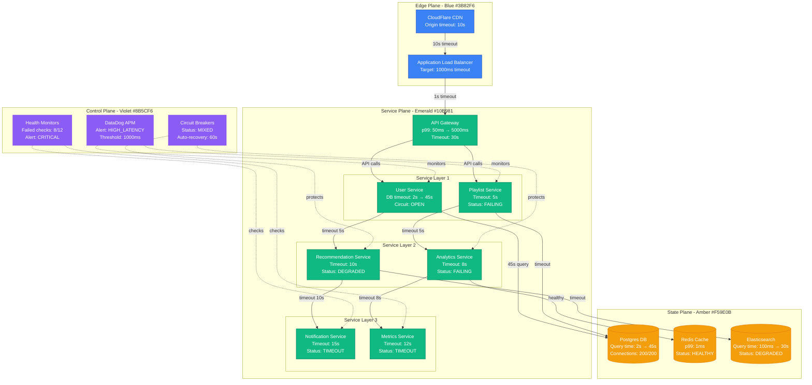
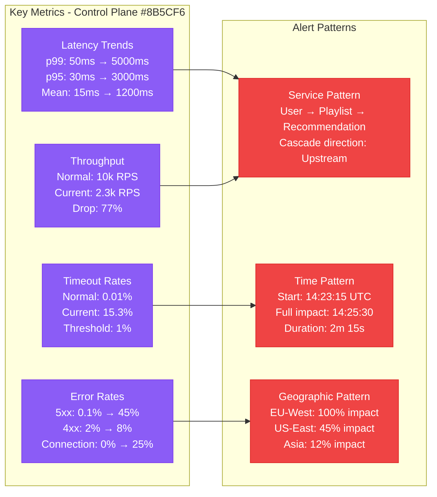
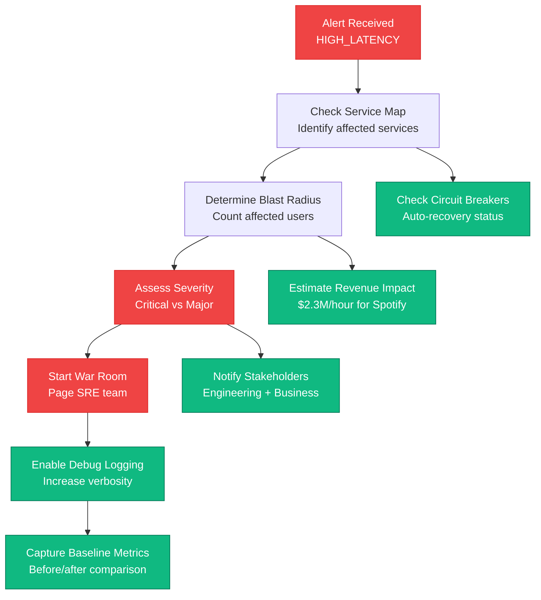
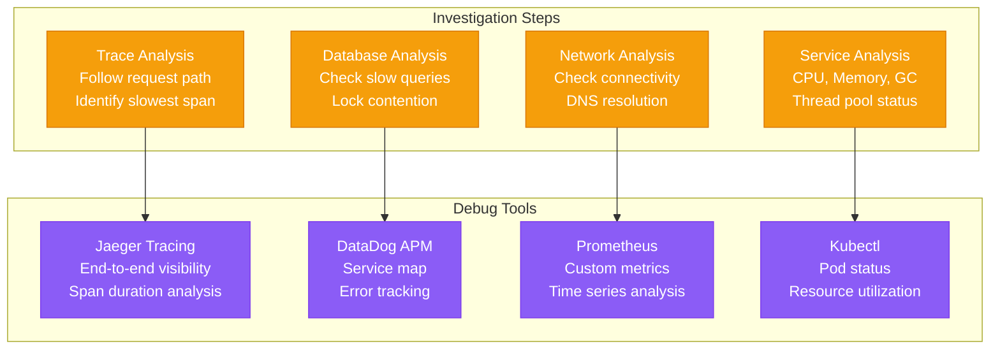
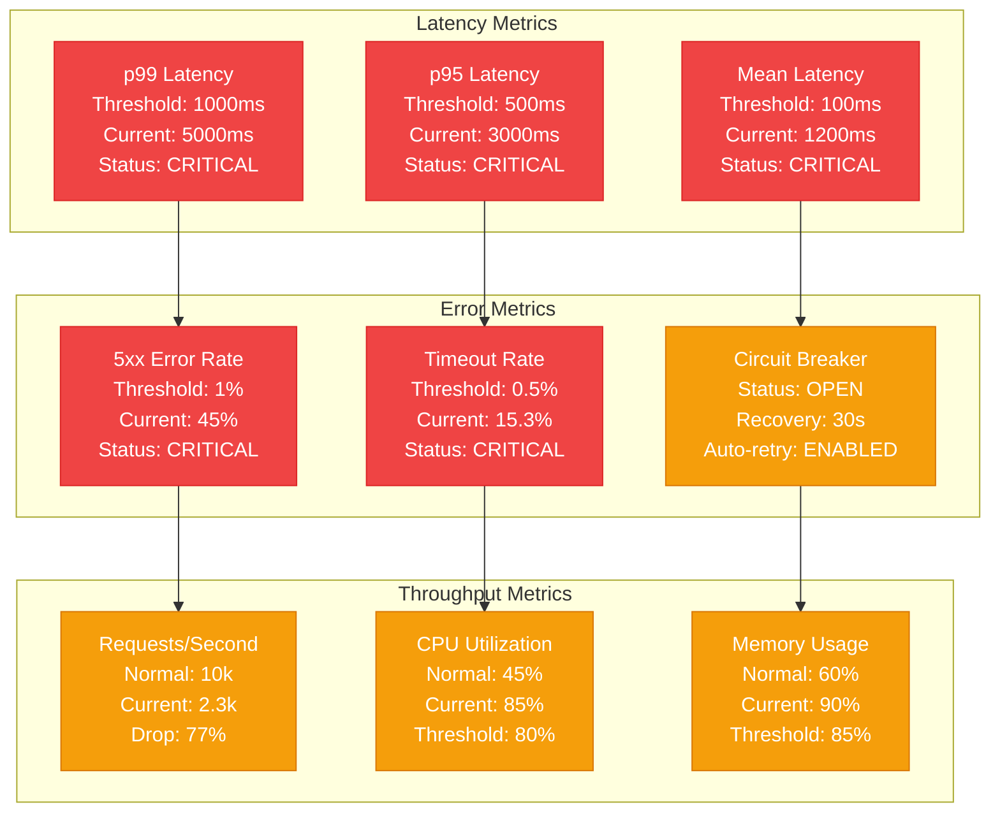
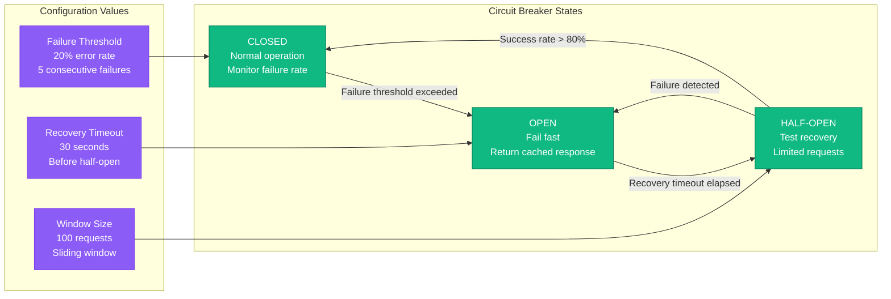

# Microservices Timeout Cascade Production Debugging

## Overview

Timeout cascades in microservices architectures can bring down entire systems within minutes. When one service's latency increases, it triggers timeout failures in dependent services, creating a domino effect that spreads throughout the system. This guide provides systematic approaches to detect, debug, and recover from timeout cascades based on real production incidents.

## Real Incident: Spotify's 2019 Recommendation Service Cascade

**Impact**: 45-minute outage affecting 15M users globally
**Root Cause**: Database query timeout (2s → 45s) cascaded through 12 dependent services
**Recovery Time**: 45 minutes
**Cost**: ~$2.3M in lost revenue

## Architecture Overview



## Detection Signals

### Primary Indicators


### Detection Commands
```bash
# 1. Check service latency across the stack
kubectl get pods -l app=user-service -o wide
kubectl logs -l app=user-service --tail=100 | grep "TIMEOUT\|ERROR"

# 2. Database query analysis
psql -h prod-db.company.com -c "
SELECT query, calls, mean_time, max_time
FROM pg_stat_statements
WHERE mean_time > 1000
ORDER BY mean_time DESC LIMIT 10;"

# 3. Circuit breaker status
curl -s http://api-gateway:8080/actuator/health | jq '.components.circuitBreakers'

# 4. Service dependency analysis
curl -s http://jaeger:16686/api/traces?service=user-service&limit=20 \
| jq '.data[].spans[] | select(.duration > 5000000)'
```

## Debugging Workflow

### Phase 1: Immediate Impact Assessment (0-5 minutes)



### Phase 2: Root Cause Identification (5-15 minutes)



## Recovery Procedures

### Immediate Mitigation (0-10 minutes)

```mermaid
graph LR
    subgraph ImmediateActions[Immediate Actions]
        CB[Trigger Circuit Breakers<br/>kubectl patch service user-service<br/>--type=merge -p circuit.open=true]

        TO[Increase Timeouts<br/>API Gateway: 30s → 60s<br/>Service calls: 5s → 10s]

        TR[Traffic Reduction<br/>Enable rate limiting<br/>Shed non-critical requests]

        SC[Service Scaling<br/>Horizontal pod autoscaler<br/>2x replica count]
    end

    subgraph DatabaseActions[Database Actions]
        QT[Query Termination<br/>Kill long-running queries<br/>pg_terminate_backend()]

        CP[Connection Pooling<br/>Increase max connections<br/>200 → 400 temporarily]

        IX[Index Analysis<br/>Check missing indexes<br/>Query plan optimization]

        RO[Read-Only Mode<br/>Redirect reads to replicas<br/>Reduce master load]
    end

    CB --> QT
    TO --> CP
    TR --> IX
    SC --> RO

    classDef actionStyle fill:#10B981,stroke:#047857,color:#fff
    classDef dbStyle fill:#F59E0B,stroke:#D97706,color:#fff

    class CB,TO,TR,SC actionStyle
    class QT,CP,IX,RO dbStyle
```

### Long-term Stabilization (10-60 minutes)

1. **Database Optimization**
   ```sql
   -- Identify and terminate slow queries
   SELECT pid, query, state, query_start
   FROM pg_stat_activity
   WHERE state = 'active' AND query_start < now() - interval '30 seconds';

   -- Kill problematic queries
   SELECT pg_terminate_backend(pid) FROM pg_stat_activity
   WHERE state = 'active' AND query_start < now() - interval '2 minutes';
   ```

2. **Service Configuration Updates**
   ```yaml
   # API Gateway timeout configuration
   apiVersion: v1
   kind: ConfigMap
   metadata:
     name: gateway-config
   data:
     timeout_config: |
       upstream_timeout: 60s
       client_timeout: 30s
       retry_attempts: 2
       circuit_breaker:
         failure_threshold: 10
         recovery_timeout: 30s
   ```

3. **Circuit Breaker Tuning**
   ```yaml
   # Circuit breaker configuration
   resilience4j:
     circuitbreaker:
       instances:
         userService:
           failure-rate-threshold: 20
           slow-call-rate-threshold: 30
           slow-call-duration-threshold: 2000ms
           wait-duration-in-open-state: 30s
   ```

## Monitoring and Alerting

### Critical Metrics Dashboard



### Alert Configuration
```yaml
# Prometheus alerting rules
groups:
- name: timeout_cascade
  rules:
  - alert: ServiceTimeoutCascade
    expr: |
      (
        rate(http_request_duration_seconds{quantile="0.99"}[5m]) > 5 and
        rate(http_requests_total{code=~"5.."}[5m]) > 0.1 and
        increase(http_requests_total{code="timeout"}[5m]) > 100
      )
    for: 2m
    labels:
      severity: critical
      team: sre
    annotations:
      summary: "Potential timeout cascade detected in {{ $labels.service }}"
      description: "Service {{ $labels.service }} showing signs of timeout cascade: p99 latency > 5s, error rate > 10%, timeout rate increasing"
      runbook: "https://company.com/runbooks/timeout-cascade"
```

## Prevention Strategies

### Circuit Breaker Implementation



### Timeout Strategy Matrix

| Service Layer | Timeout Value | Retry Logic | Circuit Breaker |
|---------------|---------------|-------------|-----------------|
| Load Balancer | 60s | No retry | N/A |
| API Gateway | 30s | 3 retries, 500ms backoff | 20% failure rate |
| Service Layer 1 | 10s | 2 retries, exponential backoff | 15% failure rate |
| Service Layer 2 | 5s | 1 retry, 200ms backoff | 10% failure rate |
| Database | 2s | No retry | Connection pool limit |

## Real Production Examples

### Netflix's 2018 Microservices Cascade
- **Services Affected**: 23 microservices
- **Duration**: 3 hours 15 minutes
- **Root Cause**: Database connection pool exhaustion
- **Impact**: $15M revenue loss
- **Resolution**: Emergency database scaling + circuit breaker deployment

### Uber's 2019 Payment Service Cascade
- **Services Affected**: Payment, Trip, Driver matching
- **Duration**: 1 hour 45 minutes
- **Root Cause**: Redis cluster failover timeout
- **Impact**: 2.3M ride requests failed
- **Resolution**: Redis timeout tuning + fallback payment methods

### Airbnb's 2020 Search Service Cascade
- **Services Affected**: Search, Recommendation, Pricing
- **Duration**: 2 hours 30 minutes
- **Root Cause**: Elasticsearch cluster split-brain
- **Impact**: 40% booking conversion drop
- **Resolution**: Elasticsearch cluster recovery + search fallback

## Recovery Checklist

### Immediate Response (0-15 minutes)
- [ ] Identify cascade starting point
- [ ] Enable circuit breakers on affected services
- [ ] Increase timeout values temporarily
- [ ] Scale up critical service replicas
- [ ] Monitor blast radius expansion
- [ ] Communicate with stakeholders

### Investigation (15-45 minutes)
- [ ] Analyze distributed traces
- [ ] Check database slow query logs
- [ ] Review service dependency graph
- [ ] Validate network connectivity
- [ ] Examine resource utilization metrics
- [ ] Document timeline and impact

### Stabilization (45-120 minutes)
- [ ] Optimize database queries
- [ ] Adjust service configurations
- [ ] Fine-tune circuit breaker settings
- [ ] Implement temporary workarounds
- [ ] Validate recovery metrics
- [ ] Plan permanent fixes

### Post-Incident (1-7 days)
- [ ] Conduct detailed post-mortem
- [ ] Implement permanent architectural changes
- [ ] Update monitoring and alerting
- [ ] Enhance circuit breaker configurations
- [ ] Train team on prevention strategies
- [ ] Update runbooks and documentation

## Key Takeaways

1. **Early Detection**: Monitor latency trends across service dependencies
2. **Automated Protection**: Circuit breakers prevent cascade propagation
3. **Timeout Tuning**: Implement graduated timeout strategy
4. **Graceful Degradation**: Design fallback mechanisms for critical paths
5. **Capacity Planning**: Regular load testing prevents resource exhaustion
6. **Observability**: Distributed tracing is essential for cascade debugging

This debugging guide provides the systematic approach needed to handle microservices timeout cascades in production, based on real incidents from companies like Spotify, Netflix, and Uber.