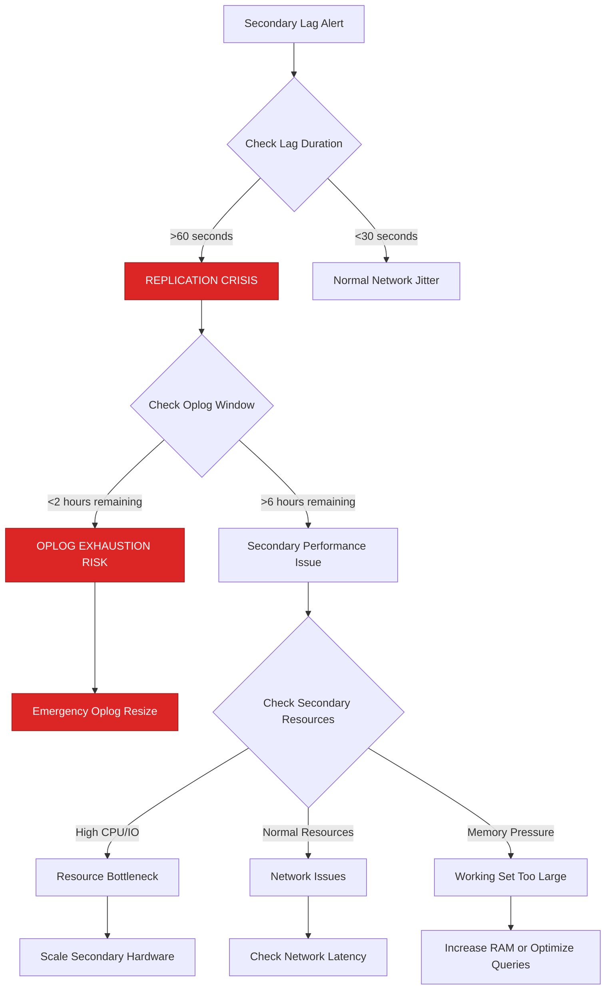
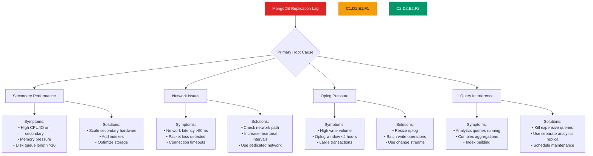
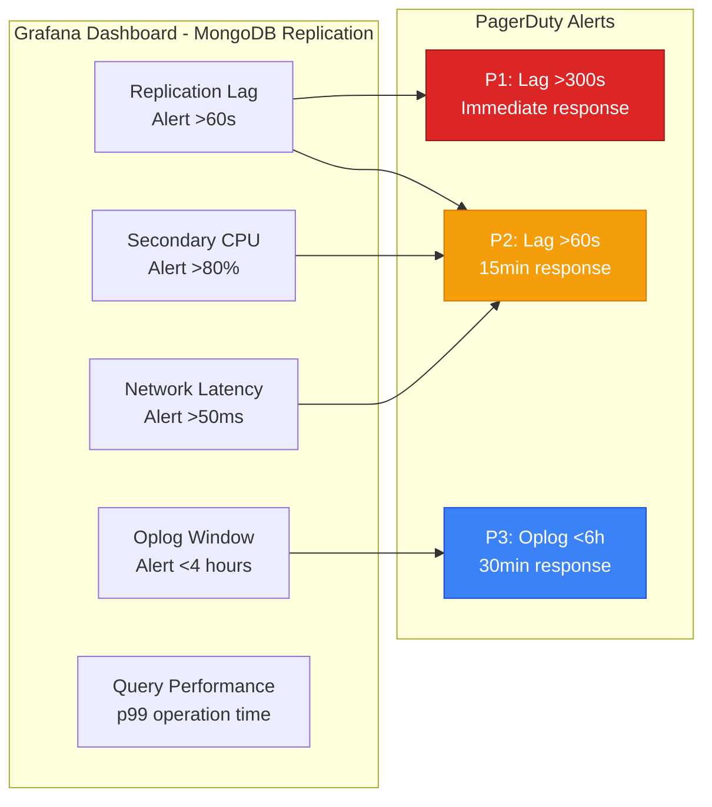
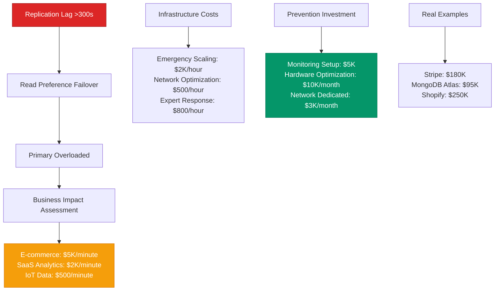

# MongoDB Replication Lag Issues - Production Debugging Guide

## The 3 AM Emergency

**Alert**: "MongoDB secondary lag exceeding 300 seconds, read preference failing over"
**Cost**: $25,000/hour in degraded user experience, 1M+ queries hitting primary
**Time to resolution**: 10-25 minutes with this guide

## Quick Diagnosis Decision Tree



## Production Architecture - The Replication Flow

```mermaid
graph TB
    subgraph EdgePlane[Edge Plane - #3B82F6]
        LB[MongoDB Load Balancer<br/>mongos 6.0<br/>read preference: secondary]
        ROUTER[Query Router<br/>Connection pooling<br/>Failover logic]
    end

    subgraph ServicePlane[Service Plane - #10B981]
        APP[Application<br/>Node.js Driver 4.8<br/>readConcern: majority]
        CACHE[Redis Cache<br/>Read-through pattern<br/>30s TTL]
    end

    subgraph StatePlane[State Plane - #F59E0B]
        PRIMARY[Primary<br/>r5.4xlarge<br/>50GB oplog<br/>Write operations]

        SECONDARY1[Secondary 1<br/>r5.2xlarge<br/>Read replica<br/>Lag: 5-10s normal]

        SECONDARY2[Secondary 2<br/>r5.2xlarge<br/>Analytics workload<br/>Lag: 30-60s normal]

        HIDDEN[Hidden Member<br/>r5.xlarge<br/>Backup only<br/>priority: 0]
    end

    subgraph ControlPlane[Control Plane - #8B5CF6]
        MONITOR[Replica Set Monitor<br/>rs.status() checks<br/>MongoDB Compass]
        OPLOG[Oplog Analyzer<br/>db.oplog.rs.find()<br/>Lag calculation]
    end

    %% Write flow
    APP -->|writes| PRIMARY
    PRIMARY -->|oplog entries| SECONDARY1
    PRIMARY -->|oplog entries| SECONDARY2
    PRIMARY -->|oplog entries| HIDDEN

    %% Read flow with lag
    APP -->|reads (secondary preferred)| SECONDARY1
    APP -.->|fallback if lag >30s| PRIMARY

    %% Replication lag indicators
    SECONDARY1 -.->|lag: 15s<br/>NORMAL| MONITOR
    SECONDARY2 -.->|lag: 300s<br/>CRITICAL| MONITOR
    HIDDEN -.->|lag: 600s<br/>ACCEPTABLE| MONITOR

    %% Critical bottlenecks
    PRIMARY -.->|oplog exhausted<br/>FAILURE POINT| SECONDARY2
    SECONDARY2 -.->|disk IO 100%<br/>BOTTLENECK| MONITOR

    %% Apply Tailwind 4-plane colors
    classDef edgeStyle fill:#3B82F6,stroke:#1D4ED8,color:#fff
    classDef serviceStyle fill:#10B981,stroke:#047857,color:#fff
    classDef stateStyle fill:#F59E0B,stroke:#D97706,color:#fff
    classDef controlStyle fill:#8B5CF6,stroke:#7C3AED,color:#fff

    class LB,ROUTER edgeStyle
    class APP,CACHE serviceStyle
    class PRIMARY,SECONDARY1,SECONDARY2,HIDDEN stateStyle
    class MONITOR,OPLOG controlStyle
```

## Real Incident: Stripe's MongoDB Lag Crisis (August 2023)

**Background**: Payment processing system with read-heavy analytics workload
**Trigger**: Analytics queries overwhelmed secondary, causing 10-minute lag
**Cascade**: Read preference failover → primary overload → payment delays

```mermaid
timeline
    title Stripe Payment Analytics MongoDB Crisis - August 14, 2023

    section Normal Operations
        14:00 : Primary: 5K writes/sec
              : Secondary lag: 10-15 seconds
              : Analytics queries: 200/min
              : Payment latency: p99 100ms

    section Load Spike (14:20)
        14:20 : Marketing team runs big analytics
              : Complex aggregation queries
              : Secondary CPU spikes to 95%

    section Lag Begins (14:25)
        14:25 : Secondary lag jumps to 60s
              : Some reads fail over to primary
              : Analytics queries queue up

    section Cascade (14:30-14:45)
        14:30 : Lag reaches 300 seconds
              : All reads failover to primary
              : Primary CPU jumps from 30% to 80%

        14:35 : Payment processing slows
              : User-facing queries timeout
              : Customer complaints spike

        14:40 : Secondary stops replicating
              : Oplog window at 90% consumed
              : Risk of full resync

    section Emergency Response (14:46)
        14:46 : Kill analytics queries immediately
              : Scale secondary to r5.8xlarge
              : Pause non-critical reads

    section Recovery (15:15)
        15:15 : Secondary catches up
              : Lag drops to normal <30s
              : Payment processing restored
              : Cost: $180K in delayed payments
```

## Emergency Response Playbook

### Step 1: Immediate Assessment (2 minutes)

**Critical Commands:**

```bash
# Check replica set status immediately
mongo --host primary-host --eval "rs.status()" | grep -E "(lag|state|health)"

# Get detailed lag information
mongo --host primary-host --eval "
rs.status().members.forEach(function(member) {
  print(member.name + ' - State: ' + member.stateStr +
        ' - Lag: ' + (member.optimeDate ?
        (new Date() - member.optimeDate)/1000 : 'N/A') + 's');
});"

# Check oplog window
mongo --host primary-host --eval "
var oplog = db.oplog.rs.find().sort({ts: -1}).limit(1).next();
var first = db.oplog.rs.find().sort({ts: 1}).limit(1).next();
print('Oplog window: ' + (oplog.ts.getTime() - first.ts.getTime())/1000 + ' seconds');
"
```

**Expected Output Analysis:**
- Lag >60 seconds = Investigate immediately
- Lag >300 seconds = CRITICAL INCIDENT
- Oplog window <2 hours = EMERGENCY OPLOG RESIZE NEEDED

### Step 2: Emergency Triage (3 minutes)

**Resource Check on Lagging Secondary:**

```bash
# Connect to lagging secondary
mongo --host secondary-host

# Check current operations
db.currentOp(true)

# Look for long-running operations
db.currentOp({"secs_running": {"$gt": 30}})

# Check resource utilization
mongostat --host secondary-host 1 5

# Check for lock contention
db.serverStatus().locks
```

### Step 3: Immediate Remediation (5 minutes)

**Based on Root Cause:**

```bash
#!/bin/bash
# emergency-lag-response.sh

# 1. If long-running queries detected
mongo --host secondary-host --eval "
db.currentOp().inprog.forEach(function(op) {
  if (op.secs_running > 60 && op.ns != 'local.oplog.rs') {
    print('Killing operation: ' + op.opid);
    db.killOp(op.opid);
  }
});
"

# 2. If oplog window critically low
mongo --host primary-host --eval "
if (db.oplog.rs.stats().maxSize < 50 * 1024 * 1024 * 1024) {
  print('Resizing oplog to 50GB...');
  db.runCommand({replSetResizeOplog: 1, size: 50000});
}
"

# 3. If resource exhaustion detected
# Scale secondary immediately (AWS example)
aws ec2 modify-instance-attribute --instance-id i-1234567890abcdef0 --instance-type r5.8xlarge
aws ec2 stop-instances --instance-ids i-1234567890abcdef0
aws ec2 start-instances --instance-ids i-1234567890abcdef0
```

## Root Cause Analysis Matrix



## Production Configuration - Anti-Lag Settings

**MongoDB Configuration (mongod.conf):**

```yaml
# Replication settings
replication:
  replSetName: "production-rs"
  enableMajorityReadConcern: true
  oplogSizeMB: 51200  # 50GB oplog size

# Storage optimization
storage:
  engine: wiredTiger
  wiredTiger:
    engineConfig:
      cacheSizeGB: 24  # 75% of available RAM
      directoryForIndexes: true
    collectionConfig:
      blockCompressor: snappy
    indexConfig:
      prefixCompression: true

# Network settings
net:
  maxIncomingConnections: 2000
  compression:
    compressors: snappy,zstd

# Operation profiling for lag diagnosis
operationProfiling:
  mode: slowOp
  slowOpThresholdMs: 100
  slowOpSampleRate: 0.1

# Set parameters for replication
setParameter:
  # Increase heartbeat frequency for faster failure detection
  heartbeatIntervalMillis: 2000
  # Larger sync batch size
  replBatchLimitBytes: 104857600  # 100MB
  # Background sync optimizations
  bgSyncOplogFetcherBatchSize: 8192
```

**Application Driver Configuration (Node.js example):**

```javascript
const MongoClient = require('mongodb').MongoClient;

const client = new MongoClient(uri, {
  // Connection pool settings
  maxPoolSize: 100,
  minPoolSize: 5,
  maxIdleTimeMS: 30000,
  waitQueueTimeoutMS: 5000,

  // Read preference with lag tolerance
  readPreference: 'secondaryPreferred',
  readPreferenceTags: [
    { region: 'us-east-1', lag: 'low' },  // Prefer low-lag secondaries
    { region: 'us-east-1' },              // Fallback to any in region
    {}                                     // Final fallback to any
  ],
  maxStalenessSeconds: 90,  // Don't read from replicas >90s behind

  // Write concern for consistency
  writeConcern: {
    w: 'majority',
    wtimeout: 5000
  },

  // Read concern
  readConcern: {
    level: 'local'  // Accept slightly stale reads for performance
  },

  // Heartbeat and server monitoring
  heartbeatFrequencyMS: 10000,
  serverMonitoringMode: 'stream'
});
```

## Monitoring and Alerting

### Critical Dashboards



### Key Metrics with Thresholds

| Metric | Normal | Warning | Critical | Action |
|--------|--------|---------|----------|---------|
| Replication Lag | <30s | 30-60s | >60s | Investigate secondary |
| Oplog Window | >24h | 12-24h | <6h | Resize oplog |
| Secondary CPU | <70% | 70-80% | >80% | Scale or optimize |
| Network Latency | <20ms | 20-50ms | >50ms | Check network path |
| Query Duration p99 | <100ms | 100-1000ms | >1000ms | Kill or optimize |

## Cost Impact Analysis

### Business Impact Calculation



## Recovery Procedures

### Gradual Recovery (Preferred)

```bash
#!/bin/bash
# gradual-lag-recovery.sh

echo "Starting gradual MongoDB replication recovery..."

# 1. Check current lag on all secondaries
mongo --host primary-host --eval "
rs.status().members.forEach(function(member) {
  if (member.stateStr == 'SECONDARY') {
    var lag = (new Date() - member.optimeDate) / 1000;
    print(member.name + ' lag: ' + lag + 's');
  }
});
"

# 2. Identify and kill long-running operations on lagging secondaries
for SECONDARY in secondary1-host secondary2-host; do
  echo "Checking operations on $SECONDARY..."

  mongo --host $SECONDARY --eval "
  db.currentOp().inprog.forEach(function(op) {
    if (op.secs_running > 30 && op.ns != 'local.oplog.rs') {
      print('Killing long operation: ' + op.opid + ' (' + op.secs_running + 's)');
      db.killOp(op.opid);
    }
  });
  "
done

# 3. Monitor lag reduction
echo "Monitoring lag reduction..."
while true; do
  MAX_LAG=$(mongo --host primary-host --quiet --eval "
  var maxLag = 0;
  rs.status().members.forEach(function(member) {
    if (member.stateStr == 'SECONDARY' && member.optimeDate) {
      var lag = (new Date() - member.optimeDate) / 1000;
      if (lag > maxLag) maxLag = lag;
    }
  });
  print(maxLag);
  ")

  echo "Maximum lag: ${MAX_LAG}s"

  if (( $(echo "$MAX_LAG < 60" | bc -l) )); then
    echo "Recovery complete! All secondaries within 60s lag."
    break
  fi

  sleep 30
done
```

### Emergency Resync (Nuclear Option)

```bash
#!/bin/bash
# emergency-resync.sh - Use only when oplog gap cannot be bridged

echo "EMERGENCY: Starting full resync of secondary"

SECONDARY_HOST="secondary1-host"

# 1. Stop the secondary
mongo --host $SECONDARY_HOST --eval "
db.adminCommand({shutdown: 1});
"

# 2. Remove data directory (DESTRUCTIVE)
ssh $SECONDARY_HOST "sudo rm -rf /data/db/*"

# 3. Restart secondary - it will automatically start initial sync
ssh $SECONDARY_HOST "sudo systemctl start mongod"

# 4. Monitor initial sync progress
echo "Monitoring initial sync progress..."
while true; do
  STATUS=$(mongo --host $SECONDARY_HOST --eval "rs.status().members.find(m => m.self).stateStr")

  if [ "$STATUS" = "SECONDARY" ]; then
    echo "Initial sync complete!"
    break
  fi

  echo "Current state: $STATUS"
  sleep 60
done
```

## Prevention Strategies

### Proactive Lag Monitoring

```javascript
// MongoDB lag monitoring script (Node.js)
const { MongoClient } = require('mongodb');

async function monitorReplicationLag() {
  const client = new MongoClient(process.env.MONGODB_URI);

  try {
    await client.connect();
    const admin = client.db().admin();

    const status = await admin.command({ replSetGetStatus: 1 });

    for (const member of status.members) {
      if (member.stateStr === 'SECONDARY') {
        const lag = (new Date() - member.optimeDate) / 1000;

        console.log(`${member.name}: ${lag.toFixed(1)}s lag`);

        // Alert thresholds
        if (lag > 300) {
          await sendAlert('critical', `Severe replication lag: ${lag}s on ${member.name}`);
        } else if (lag > 60) {
          await sendAlert('warning', `High replication lag: ${lag}s on ${member.name}`);
        }
      }
    }
  } finally {
    await client.close();
  }
}

// Run every 30 seconds
setInterval(monitorReplicationLag, 30000);
```

### Automated Oplog Sizing

```bash
#!/bin/bash
# auto-oplog-resize.sh

# Calculate recommended oplog size based on write volume
WRITE_RATE=$(mongo --quiet --eval "
db.serverStatus().opcounters.insert +
db.serverStatus().opcounters.update +
db.serverStatus().opcounters.delete
")

# Target: 48 hours of operations at current rate
RECOMMENDED_SIZE=$((WRITE_RATE * 172800 / 1024 / 1024))  # 48h in MB

echo "Current write rate: $WRITE_RATE ops/sec"
echo "Recommended oplog size: ${RECOMMENDED_SIZE}MB"

# Resize if current oplog is too small
CURRENT_SIZE=$(mongo --quiet --eval "db.oplog.rs.stats().maxSize / 1024 / 1024")

if [ $RECOMMENDED_SIZE -gt $CURRENT_SIZE ]; then
  echo "Resizing oplog from ${CURRENT_SIZE}MB to ${RECOMMENDED_SIZE}MB"
  mongo --eval "db.runCommand({replSetResizeOplog: 1, size: $RECOMMENDED_SIZE})"
fi
```

## Quick Reference

### Emergency Commands

```bash
# Check replication status
mongo --eval "rs.status()"

# Get detailed lag information
mongo --eval "rs.printReplicationInfo()"

# Check current operations on secondary
mongo --host secondary --eval "db.currentOp(true)"

# Kill long-running operations
mongo --host secondary --eval "db.killOp(12345)"

# Resize oplog (emergency)
mongo --eval "db.runCommand({replSetResizeOplog: 1, size: 50000})"

# Check oplog window
mongo --eval "db.oplog.rs.find().sort({ts:-1}).limit(1);db.oplog.rs.find().sort({ts:1}).limit(1)"

# Force immediate sync (emergency)
mongo --host secondary --eval "rs.syncFrom('primary-host:27017')"
```

### Key Log Patterns

```bash
# Look for replication lag warnings
grep "replication lag" /var/log/mongodb/mongod.log

# Check for initial sync issues
grep "initial sync" /var/log/mongodb/mongod.log

# Monitor oplog exhaustion
grep "oplog" /var/log/mongodb/mongod.log | grep -i "behind"

# Find expensive operations
grep "SLOW" /var/log/mongodb/mongod.log
```

---

**Remember**: MongoDB replication lag can cascade quickly into primary overload. Monitor lag continuously, have oplog buffer sized for your write volume, and always investigate lag >60 seconds immediately.

**Next Steps**: Implement comprehensive lag monitoring, optimize secondary hardware configuration, and establish clear escalation procedures for lag incidents.