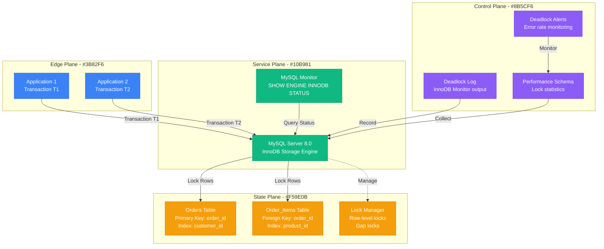
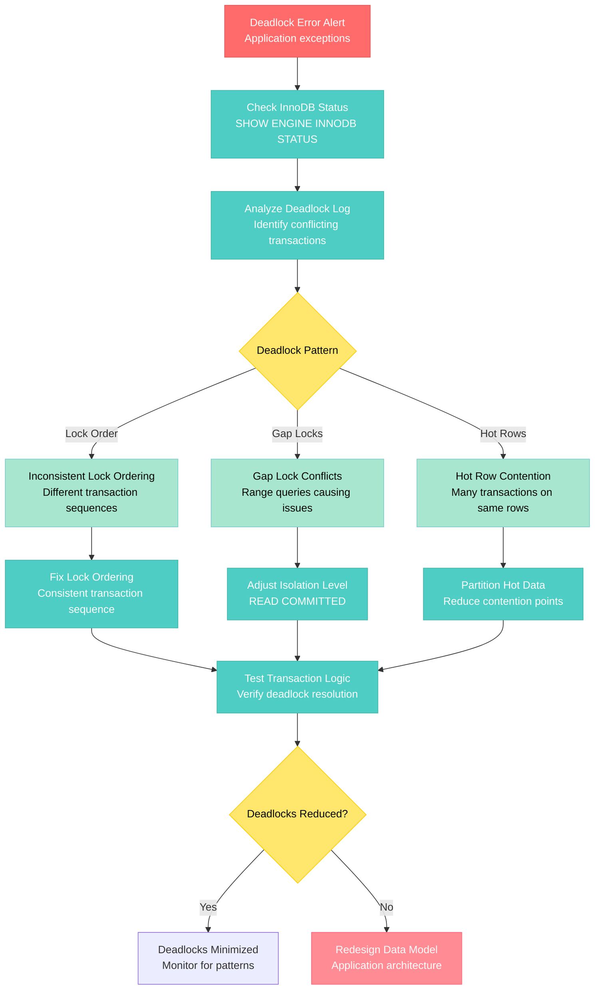

# MySQL Deadlock Debugging

**Scenario**: Production MySQL database experiencing frequent deadlocks, causing transaction failures and application errors.

**The 3 AM Reality**: Applications throwing deadlock exceptions, failed transactions requiring retry logic, and potential data inconsistency issues.

## Symptoms Checklist

- [ ] Deadlock found when trying to get lock errors in application logs
- [ ] InnoDB Monitor showing deadlock information
- [ ] Increased transaction rollbacks in MySQL metrics
- [ ] Application retry logic being triggered frequently
- [ ] Performance degradation due to transaction conflicts

## MySQL Deadlock Architecture



## Step-by-Step Debugging Flow



## Critical Commands & Queries

### Immediate Deadlock Analysis
```sql
-- Check current InnoDB status for deadlock information
SHOW ENGINE INNODB STATUS\G

-- Enable deadlock logging (MySQL 8.0+)
SET GLOBAL innodb_print_all_deadlocks = ON;

-- Check recent deadlocks in error log
-- grep "LATEST DETECTED DEADLOCK" /var/log/mysql/error.log

-- Performance Schema deadlock detection
SELECT * FROM performance_schema.events_statements_history_long
WHERE sql_text LIKE '%deadlock%'
ORDER BY timer_start DESC LIMIT 10;
```

### Transaction Analysis
```sql
-- Show current transactions and locks
SELECT
    r.trx_id AS waiting_trx_id,
    r.trx_mysql_thread_id AS waiting_thread,
    r.trx_query AS waiting_query,
    b.trx_id AS blocking_trx_id,
    b.trx_mysql_thread_id AS blocking_thread,
    b.trx_query AS blocking_query
FROM information_schema.innodb_lock_waits w
INNER JOIN information_schema.innodb_trx b ON b.trx_id = w.blocking_trx_id
INNER JOIN information_schema.innodb_trx r ON r.trx_id = w.requesting_trx_id;

-- Check lock information
SELECT
    lock_id,
    lock_trx_id,
    lock_mode,
    lock_type,
    lock_table,
    lock_index,
    lock_data
FROM information_schema.innodb_locks;

-- Transaction isolation levels
SELECT @@global.transaction_isolation, @@session.transaction_isolation;
```

### Deadlock Pattern Analysis
```sql
-- Find tables with frequent deadlocks
SELECT
    OBJECT_SCHEMA,
    OBJECT_NAME,
    COUNT_READ,
    COUNT_WRITE,
    COUNT_READ_WITH_SHARED_LOCKS,
    SUM_TIMER_READ,
    SUM_TIMER_WRITE
FROM performance_schema.table_io_waits_summary_by_table
WHERE OBJECT_SCHEMA = 'your_database'
ORDER BY (COUNT_READ + COUNT_WRITE) DESC;

-- Analyze query patterns leading to deadlocks
SELECT
    event_name,
    sql_text,
    current_schema,
    message_text
FROM performance_schema.events_statements_history_long
WHERE message_text LIKE '%deadlock%'
ORDER BY timer_start DESC;
```

### Lock Wait Analysis
```sql
-- Current lock waits
SELECT
    waiting_pid,
    waiting_query,
    waiting_lock_mode,
    blocking_pid,
    blocking_query,
    blocking_lock_mode,
    waited_time
FROM sys.innodb_lock_waits;

-- Lock wait timeout configuration
SHOW VARIABLES LIKE 'innodb_lock_wait_timeout';

-- Deadlock detection configuration
SHOW VARIABLES LIKE 'innodb_deadlock_detect';
```

## Log Analysis Locations

### MySQL Error Logs
```bash
# Find deadlock entries in error log
grep -A 20 -B 5 "LATEST DETECTED DEADLOCK" /var/log/mysql/error.log

# Monitor real-time deadlock detection
tail -f /var/log/mysql/error.log | grep -A 30 "DEADLOCK"

# Count deadlocks by hour
grep "LATEST DETECTED DEADLOCK" /var/log/mysql/error.log | \
    awk '{print $1, $2}' | cut -d: -f1-2 | sort | uniq -c

# Extract transaction details from deadlock log
awk '/LATEST DETECTED DEADLOCK/,/WE ROLL BACK/' /var/log/mysql/error.log
```

### InnoDB Monitor Output
```sql
-- Enable extended InnoDB monitoring
SET GLOBAL innodb_status_output = ON;
SET GLOBAL innodb_status_output_locks = ON;

-- Create InnoDB monitor tables (older versions)
-- CREATE TABLE innodb_monitor (a INT) ENGINE=INNODB;
-- CREATE TABLE innodb_lock_monitor (a INT) ENGINE=INNODB;

-- Check monitor output
SHOW ENGINE INNODB STATUS\G

-- Parse specific sections
-- Transaction section shows current transactions
-- Semaphores section shows lock waits
-- Latest detected deadlock section shows deadlock details
```

### Performance Schema Monitoring
```sql
-- Enable Performance Schema instruments
UPDATE performance_schema.setup_instruments
SET ENABLED = 'YES'
WHERE NAME LIKE '%lock%';

UPDATE performance_schema.setup_consumers
SET ENABLED = 'YES'
WHERE NAME LIKE '%events_waits%';

-- Monitor lock events
SELECT
    EVENT_NAME,
    COUNT_STAR,
    SUM_TIMER_WAIT/1000000000 as SUM_TIMER_WAIT_SEC,
    AVG_TIMER_WAIT/1000000000 as AVG_TIMER_WAIT_SEC
FROM performance_schema.events_waits_summary_global_by_event_name
WHERE EVENT_NAME LIKE '%lock%'
ORDER BY SUM_TIMER_WAIT DESC;
```

## Common Root Causes (by Probability)

### 1. Inconsistent Lock Ordering (50% of cases)
**Symptoms**: Transactions acquiring locks in different orders
```sql
-- Problematic pattern - Transaction A
START TRANSACTION;
UPDATE orders SET status = 'processing' WHERE order_id = 123;
UPDATE order_items SET status = 'reserved' WHERE order_id = 123;
COMMIT;

-- Problematic pattern - Transaction B (different order)
START TRANSACTION;
UPDATE order_items SET quantity = 5 WHERE order_id = 123;
UPDATE orders SET total = 150.00 WHERE order_id = 123;
COMMIT;

-- Solution - Consistent lock ordering
START TRANSACTION;
-- Always lock orders table first, then order_items
UPDATE orders SET status = 'processing' WHERE order_id = 123;
UPDATE order_items SET status = 'reserved' WHERE order_id = 123;
COMMIT;
```

### 2. Gap Lock Conflicts (25% of cases)
**Symptoms**: Range queries causing gap locks in REPEATABLE READ isolation
```sql
-- Problematic - Range queries with gaps
-- Transaction A
SELECT * FROM orders WHERE order_date BETWEEN '2023-01-01' AND '2023-01-31' FOR UPDATE;

-- Transaction B (conflicts with gap locks)
INSERT INTO orders (order_date, customer_id) VALUES ('2023-01-15', 456);

-- Solution - Use READ COMMITTED isolation level
SET SESSION TRANSACTION ISOLATION LEVEL READ COMMITTED;

-- Or use specific row locking
SELECT * FROM orders WHERE order_id IN (SELECT order_id FROM orders
    WHERE order_date BETWEEN '2023-01-01' AND '2023-01-31') FOR UPDATE;
```

### 3. Hot Row Contention (15% of cases)
**Symptoms**: Multiple transactions competing for same popular rows
```sql
-- Problematic - Hot counter updates
UPDATE counters SET value = value + 1 WHERE name = 'page_views';

-- Solution - Partitioned counters
CREATE TABLE counters_sharded (
    name VARCHAR(50),
    shard_id INT,
    value BIGINT,
    PRIMARY KEY (name, shard_id)
);

-- Update random shard
UPDATE counters_sharded
SET value = value + 1
WHERE name = 'page_views' AND shard_id = FLOOR(RAND() * 10);

-- Read aggregated value
SELECT SUM(value) FROM counters_sharded WHERE name = 'page_views';
```

### 4. Large Transaction Scope (7% of cases)
**Symptoms**: Long-running transactions holding locks too long
```sql
-- Problematic - Large transaction
START TRANSACTION;
-- Many operations that take time
UPDATE large_table SET status = 'processed' WHERE condition = 'value';
-- ... more operations ...
-- Complex business logic
COMMIT;

-- Solution - Smaller transaction scope
-- Process in batches
SET @batch_size = 1000;
REPEAT
    START TRANSACTION;
    UPDATE large_table SET status = 'processed'
    WHERE condition = 'value' AND status != 'processed'
    LIMIT @batch_size;
    SET @rows_affected = ROW_COUNT();
    COMMIT;
UNTIL @rows_affected < @batch_size END REPEAT;
```

### 5. Foreign Key Lock Escalation (3% of cases)
**Symptoms**: Foreign key constraints causing unexpected locks
```sql
-- Problematic - Foreign key checks
DELETE FROM orders WHERE order_id = 123;  -- Locks order_items rows

-- Solution - Explicit order of operations
START TRANSACTION;
DELETE FROM order_items WHERE order_id = 123;  -- Delete children first
DELETE FROM orders WHERE order_id = 123;       -- Then parent
COMMIT;

-- Or use ON DELETE CASCADE
ALTER TABLE order_items
ADD CONSTRAINT fk_order_items_order_id
FOREIGN KEY (order_id) REFERENCES orders(order_id)
ON DELETE CASCADE;
```

## Immediate Mitigation Steps

### Emergency Response (< 5 minutes)
1. **Kill Blocking Transactions**
   ```sql
   -- Identify long-running transactions
   SELECT
       trx_id,
       trx_started,
       trx_mysql_thread_id,
       trx_query,
       TIME_TO_SEC(TIMEDIFF(NOW(), trx_started)) AS duration_seconds
   FROM information_schema.innodb_trx
   WHERE TIME_TO_SEC(TIMEDIFF(NOW(), trx_started)) > 60
   ORDER BY duration_seconds DESC;

   -- Kill problematic connections
   KILL CONNECTION <thread_id>;
   ```

2. **Adjust Deadlock Detection**
   ```sql
   -- Reduce lock wait timeout for faster detection
   SET GLOBAL innodb_lock_wait_timeout = 10;  -- Default is 50 seconds

   -- Enable deadlock detection if disabled
   SET GLOBAL innodb_deadlock_detect = ON;
   ```

### Short-term Fixes (< 30 minutes)
1. **Change Isolation Level**
   ```sql
   -- Reduce gap locking with READ COMMITTED
   SET GLOBAL transaction_isolation = 'READ-COMMITTED';

   -- Or set per session
   SET SESSION TRANSACTION ISOLATION LEVEL READ COMMITTED;
   ```

2. **Application Retry Logic**
   ```python
   import time
   import random
   import mysql.connector

   def execute_with_deadlock_retry(cursor, query, params=None, max_retries=3):
       for attempt in range(max_retries):
           try:
               cursor.execute(query, params)
               return cursor.fetchall()
           except mysql.connector.Error as e:
               if e.errno == 1213:  # Deadlock error code
                   if attempt < max_retries - 1:
                       # Exponential backoff with jitter
                       delay = (2 ** attempt) + random.uniform(0, 1)
                       time.sleep(delay)
                       continue
               raise e
   ```

## Long-term Prevention

### Transaction Design Patterns
```sql
-- Pattern 1: Consistent Lock Ordering
DELIMITER //
CREATE PROCEDURE update_order_with_items(
    IN p_order_id INT,
    IN p_new_status VARCHAR(50),
    IN p_item_updates JSON
)
BEGIN
    DECLARE EXIT HANDLER FOR SQLEXCEPTION
    BEGIN
        ROLLBACK;
        RESIGNAL;
    END;

    START TRANSACTION;

    -- Always lock in consistent order: orders first, then order_items
    SELECT order_id INTO @dummy FROM orders WHERE order_id = p_order_id FOR UPDATE;

    UPDATE orders
    SET status = p_new_status, updated_at = NOW()
    WHERE order_id = p_order_id;

    -- Process item updates
    UPDATE order_items
    SET quantity = JSON_EXTRACT(p_item_updates, CONCAT('$.', item_id, '.quantity'))
    WHERE order_id = p_order_id
    AND item_id IN (SELECT JSON_KEYS(p_item_updates));

    COMMIT;
END //
DELIMITER ;
```

### Index Optimization for Lock Reduction
```sql
-- Reduce lock scope with better indexes
-- Before: Range scan locks many rows
SELECT * FROM orders WHERE customer_id = 123 AND status = 'pending' FOR UPDATE;

-- After: Compound index reduces locks
CREATE INDEX idx_customer_status ON orders(customer_id, status);

-- Use covering indexes to avoid row locks when possible
CREATE INDEX idx_order_summary ON orders(order_id, customer_id, status, total);

-- This query won't need row locks, only index locks
SELECT order_id, customer_id, status, total
FROM orders
WHERE customer_id = 123;
```

### Monitoring and Alerting
```sql
-- Create monitoring views for deadlock tracking
CREATE VIEW deadlock_summary AS
SELECT
    DATE(created_time) as date,
    COUNT(*) as deadlock_count,
    COUNT(DISTINCT thread_id) as affected_connections
FROM mysql.general_log
WHERE command_type = 'Query'
AND argument LIKE '%deadlock%'
GROUP BY DATE(created_time);

-- Performance Schema setup for lock monitoring
UPDATE performance_schema.setup_instruments
SET ENABLED = 'YES', TIMED = 'YES'
WHERE NAME LIKE '%wait/synch/%';

-- Monitor lock contention
SELECT
    object_schema,
    object_name,
    index_name,
    lock_type,
    lock_mode,
    COUNT(*) as lock_count
FROM performance_schema.data_locks
GROUP BY object_schema, object_name, index_name, lock_type, lock_mode
ORDER BY lock_count DESC;
```

### Application-Level Solutions
```python
# Python deadlock-aware transaction manager
import mysql.connector
import time
import random
import logging
from contextlib import contextmanager

class DeadlockAwareConnection:
    def __init__(self, **connection_params):
        self.connection_params = connection_params
        self.connection = None
        self.max_retries = 3
        self.base_delay = 0.1

    def connect(self):
        self.connection = mysql.connector.connect(**self.connection_params)
        # Set consistent isolation level
        cursor = self.connection.cursor()
        cursor.execute("SET SESSION TRANSACTION ISOLATION LEVEL READ COMMITTED")
        cursor.close()

    @contextmanager
    def transaction(self):
        if not self.connection:
            self.connect()

        for attempt in range(self.max_retries):
            try:
                self.connection.start_transaction()
                cursor = self.connection.cursor()
                yield cursor
                self.connection.commit()
                cursor.close()
                break

            except mysql.connector.Error as e:
                self.connection.rollback()
                cursor.close()

                if e.errno == 1213:  # Deadlock detected
                    if attempt < self.max_retries - 1:
                        delay = self.base_delay * (2 ** attempt) + random.uniform(0, 0.1)
                        logging.warning(f"Deadlock detected, retrying in {delay}s (attempt {attempt + 1})")
                        time.sleep(delay)
                        continue

                logging.error(f"Transaction failed: {e}")
                raise

# Usage example
db = DeadlockAwareConnection(
    host='localhost',
    user='app_user',
    password='password',
    database='ecommerce'
)

with db.transaction() as cursor:
    # Consistent lock ordering
    cursor.execute("UPDATE orders SET status = %s WHERE order_id = %s", ('processing', 123))
    cursor.execute("UPDATE order_items SET status = %s WHERE order_id = %s", ('reserved', 123))
```

## Production Examples

### Shopify's Inventory Deadlocks (2020)
- **Incident**: E-commerce inventory updates causing frequent deadlocks during flash sales
- **Root Cause**: Multiple transactions updating inventory and orders in different sequences
- **Impact**: 15% of checkout attempts failed during peak periods
- **Resolution**: Implemented consistent lock ordering, inventory reservation pattern
- **Prevention**: Added application-level retry logic with exponential backoff

### Uber's Driver Location Deadlocks (2019)
- **Incident**: Driver location updates deadlocking with ride matching transactions
- **Root Cause**: Hot row contention on popular geographic areas
- **Impact**: Ride matching delays in busy metropolitan areas
- **Resolution**: Partitioned location data by geographic regions
- **Learning**: Redesigned to use Redis for real-time location, MySQL for persistent data

### GitHub's Repository Lock Conflicts (2021)
- **Incident**: Git push operations causing deadlocks in repository metadata updates
- **Root Cause**: Concurrent updates to repository statistics and branch information
- **Impact**: Push operations failed, developers couldn't commit code
- **Resolution**: Moved statistics updates to async background jobs
- **Prevention**: Separated read-heavy and write-heavy operations

## Recovery Automation

### Deadlock Monitoring Script
```bash
#!/bin/bash
# mysql-deadlock-monitor.sh

MYSQL_HOST="localhost"
MYSQL_USER="monitor_user"
MYSQL_PASSWORD="password"
MYSQL_DATABASE="your_database"
SLACK_WEBHOOK="your-slack-webhook-url"

# Function to send alerts
send_alert() {
    curl -X POST -H 'Content-type: application/json' \
        --data "{\"text\":\"MySQL Deadlock Alert: $1\"}" \
        $SLACK_WEBHOOK
}

# Check recent deadlocks
DEADLOCK_COUNT=$(mysql -h $MYSQL_HOST -u $MYSQL_USER -p$MYSQL_PASSWORD -D $MYSQL_DATABASE -se "
    SELECT COUNT(*) FROM performance_schema.events_statements_history_long
    WHERE sql_text LIKE '%deadlock%'
    AND timer_start > UNIX_TIMESTAMP(DATE_SUB(NOW(), INTERVAL 1 HOUR)) * 1000000000000;
")

echo "Deadlocks in last hour: $DEADLOCK_COUNT"

if [ "$DEADLOCK_COUNT" -gt 10 ]; then
    send_alert "High deadlock rate: $DEADLOCK_COUNT deadlocks in last hour"

    # Get deadlock patterns
    PATTERNS=$(mysql -h $MYSQL_HOST -u $MYSQL_USER -p$MYSQL_PASSWORD -D $MYSQL_DATABASE -se "
        SELECT SUBSTRING(sql_text, 1, 100) as query_pattern, COUNT(*) as count
        FROM performance_schema.events_statements_history_long
        WHERE message_text LIKE '%deadlock%'
        GROUP BY query_pattern
        ORDER BY count DESC
        LIMIT 5;
    ")

    send_alert "Top deadlock patterns: $PATTERNS"

    # Check if we should adjust lock wait timeout
    CURRENT_TIMEOUT=$(mysql -h $MYSQL_HOST -u $MYSQL_USER -p$MYSQL_PASSWORD -se "
        SELECT @@global.innodb_lock_wait_timeout;
    ")

    if [ "$CURRENT_TIMEOUT" -gt 20 ]; then
        echo "Reducing lock wait timeout to 20 seconds"
        mysql -h $MYSQL_HOST -u $MYSQL_USER -p$MYSQL_PASSWORD -e "
            SET GLOBAL innodb_lock_wait_timeout = 20;
        "
        send_alert "Reduced lock wait timeout to 20 seconds"
    fi
fi
```

**Remember**: Deadlocks are often a symptom of application design issues rather than database problems. Focus on consistent lock ordering, smaller transaction scopes, and appropriate isolation levels. Always implement retry logic in applications to handle the occasional deadlock gracefully.