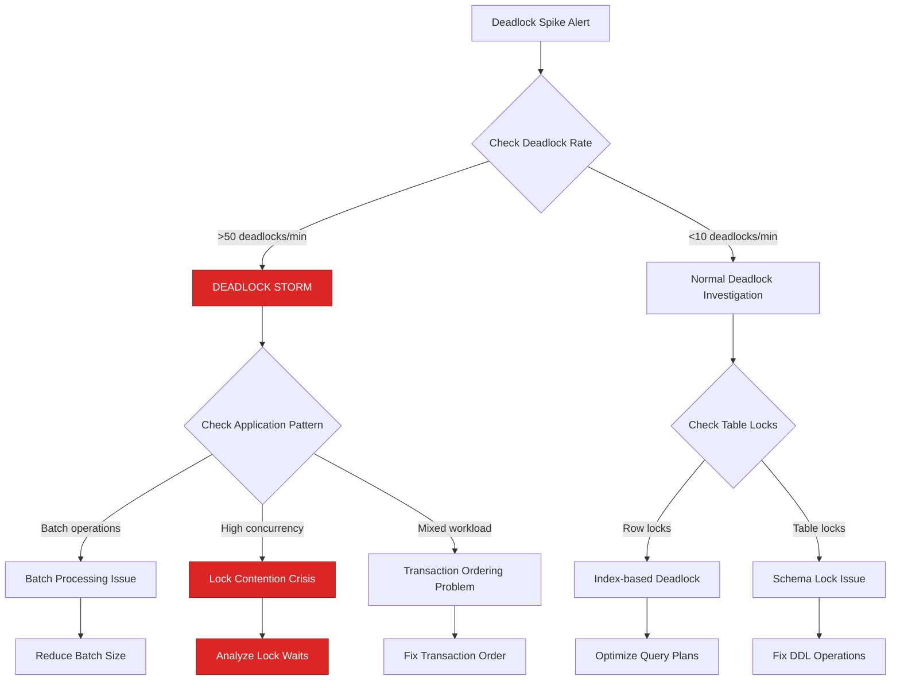
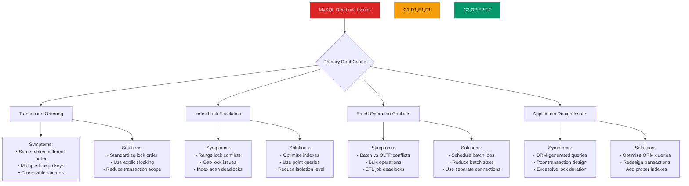
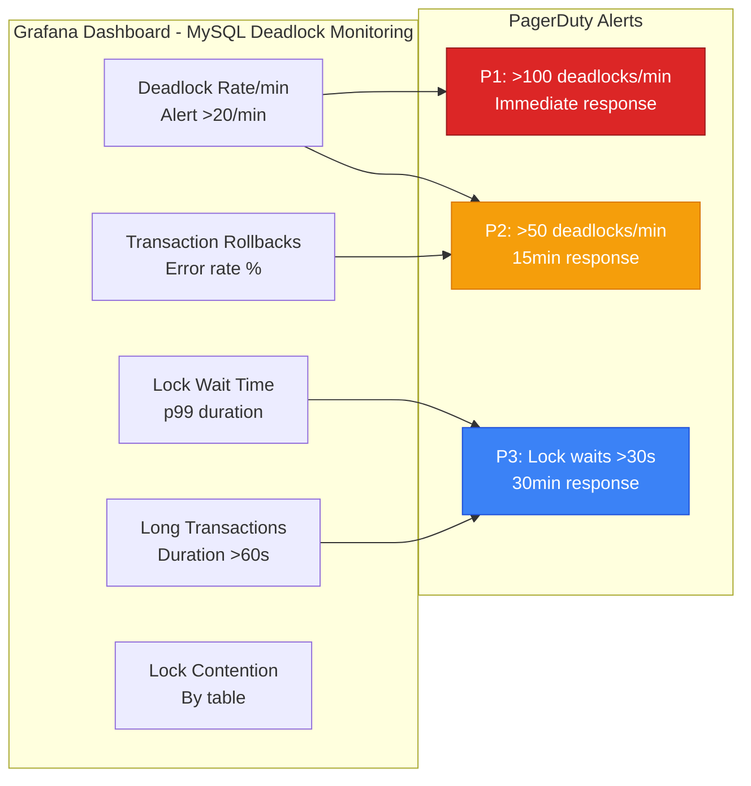
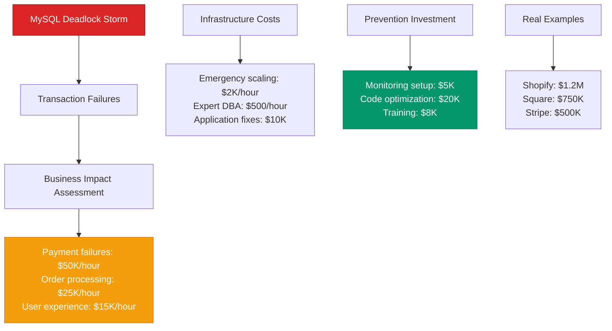

# MySQL Deadlock Detection and Resolution - Production Debugging Guide

## The 3 AM Emergency

**Alert**: "MySQL deadlocks spiking to 500/minute, transaction rollbacks affecting payments"
**Cost**: $30,000/hour in failed transactions, customer checkout abandonment
**Time to resolution**: 15-45 minutes with this guide

## Quick Diagnosis Decision Tree



## Production Architecture - The Deadlock Flow

```mermaid
graph TB
    subgraph EdgePlane[Edge Plane - #3B82F6]
        LB[ProxySQL<br/>Load balancer<br/>Connection pooling]
        ROUTER[MySQL Router<br/>8.0.32<br/>Read/write splitting]
    end

    subgraph ServicePlane[Service Plane - #10B981]
        APP1[Payment Service<br/>Spring Boot<br/>HikariCP pool]
        APP2[Order Service<br/>Node.js<br/>mysql2 driver]
        APP3[Inventory Service<br/>Python<br/>SQLAlchemy ORM]
        BATCH[Batch Jobs<br/>ETL processes<br/>Large transactions]
    end

    subgraph StatePlane[State Plane - #F59E0B]
        MASTER[MySQL Master<br/>r5.4xlarge<br/>InnoDB engine]

        subgraph "Storage Layer"
            ORDERS[orders table<br/>50M rows<br/>B+ tree indexes]
            INVENTORY[inventory table<br/>10M rows<br/>Foreign key constraints]
            PAYMENTS[payments table<br/>100M rows<br/>Compound indexes]
        end

        REPLICA1[Read Replica 1<br/>r5.2xlarge<br/>Read-only queries]
        REPLICA2[Read Replica 2<br/>r5.2xlarge<br/>Analytics workload]
    end

    subgraph ControlPlane[Control Plane - #8B5CF6]
        MONITOR[Deadlock Monitor<br/>SHOW ENGINE INNODB STATUS<br/>Performance Schema]
        DETECTOR[Deadlock Detector<br/>InnoDB background thread<br/>Graph-based detection]
        LOGGER[Error Logger<br/>mysql-error.log<br/>Deadlock logging]
    end

    %% Transaction flows that can deadlock
    APP1 -->|payment transactions<br/>locks: orders → payments| MASTER
    APP2 -->|order updates<br/>locks: inventory → orders| MASTER
    APP3 -->|inventory checks<br/>locks: payments → inventory| MASTER
    BATCH -->|bulk operations<br/>locks: all tables| MASTER

    %% Deadlock scenario
    APP1 -.->|Transaction 1<br/>LOCK orders(id=123)| ORDERS
    APP2 -.->|Transaction 2<br/>LOCK inventory(sku=456)| INVENTORY
    APP1 -.->|needs inventory(sku=456)<br/>WAIT for Transaction 2| INVENTORY
    APP2 -.->|needs orders(id=123)<br/>DEADLOCK DETECTED| ORDERS

    %% Detection and resolution
    DETECTOR -.->|detects cycle<br/>ROLLBACK Transaction 2| APP2
    MONITOR -.->|logs deadlock info<br/>VICTIM SELECTION| LOGGER

    %% Apply Tailwind 4-plane colors
    classDef edgeStyle fill:#3B82F6,stroke:#1D4ED8,color:#fff
    classDef serviceStyle fill:#10B981,stroke:#047857,color:#fff
    classDef stateStyle fill:#F59E0B,stroke:#D97706,color:#fff
    classDef controlStyle fill:#8B5CF6,stroke:#7C3AED,color:#fff

    class LB,ROUTER edgeStyle
    class APP1,APP2,APP3,BATCH serviceStyle
    class MASTER,ORDERS,INVENTORY,PAYMENTS,REPLICA1,REPLICA2 stateStyle
    class MONITOR,DETECTOR,LOGGER controlStyle
```

## Real Incident: Shopify's MySQL Deadlock Storm (December 2023)

**Background**: Black Friday traffic surge, payment processing with inventory updates
**Trigger**: Batch inventory sync job conflicting with high-frequency payment transactions
**Impact**: 15% of checkout attempts failed for 30 minutes

```mermaid
timeline
    title Shopify Payment Deadlock Storm - December 1, 2023

    section Normal Operations
        11:00 : Black Friday traffic: 50K TPS
              : Deadlock rate: 5/minute (normal)
              : Payment success: 99.5%
              : Checkout conversion normal

    section Traffic Surge (11:30)
        11:30 : Traffic spikes to 200K TPS
              : Inventory sync job starts
              : Concurrent payment processing
              : Lock contention increases

    section Deadlock Storm Begins (11:45)
        11:45 : Deadlock rate jumps to 200/minute
              : Payment failures increase
              : Inventory updates blocked
              : Database CPU spikes to 95%

    section Critical Impact (12:00-12:30)
        12:00 : Deadlock rate: 500/minute
              : 15% payment failure rate
              : Customer checkout abandonment
              : Support tickets flooding in

        12:15 : Emergency: Kill inventory sync job
              : Reduce payment batch sizes
              : Scale payment service instances

        12:25 : Deadlock rate drops to 50/minute
              : Payment failures decrease
              : Recovery begins

    section Resolution (12:30)
        12:30 : Deadlock rate: <20/minute
              : Payment success: 98%
              : Inventory sync rescheduled
              : Crisis resolved
              : Cost: $1.2M in lost sales
```

## Emergency Response Playbook

### Step 1: Immediate Assessment (1 minute)

**Critical Queries:**

```sql
-- Check current deadlock information
SHOW ENGINE INNODB STATUS\G

-- Get recent deadlock count from Performance Schema
SELECT COUNT(*) as deadlock_count
FROM performance_schema.events_statements_history_long
WHERE event_name = 'statement/sql/select'
  AND sql_text LIKE '%deadlock%'
  AND timer_start > UNIX_TIMESTAMP(DATE_SUB(NOW(), INTERVAL 5 MINUTE)) * 1000000000;

-- Check current lock waits
SELECT
  r.trx_id waiting_trx_id,
  r.trx_mysql_thread_id waiting_thread,
  r.trx_query waiting_query,
  b.trx_id blocking_trx_id,
  b.trx_mysql_thread_id blocking_thread,
  b.trx_query blocking_query
FROM information_schema.innodb_lock_waits w
INNER JOIN information_schema.innodb_trx b
  ON b.trx_id = w.blocking_trx_id
INNER JOIN information_schema.innodb_trx r
  ON r.trx_id = w.requesting_trx_id;

-- Check deadlock rate trend
SELECT
  HOUR(time) as hour,
  COUNT(*) as deadlock_count
FROM mysql.general_log
WHERE command_type = 'Query'
  AND argument LIKE '%deadlock%'
  AND time > DATE_SUB(NOW(), INTERVAL 2 HOUR)
GROUP BY HOUR(time)
ORDER BY hour DESC;
```

**Emergency Thresholds:**
- Deadlock rate >50/minute = CRITICAL INCIDENT
- Lock wait time >30 seconds = BLOCKING ISSUE
- Transaction rollback rate >5% = EMERGENCY RESPONSE

### Step 2: Emergency Lock Investigation (3 minutes)

**Immediate Deadlock Analysis:**

```bash
#!/bin/bash
# emergency-deadlock-analysis.sh

echo "EMERGENCY: MySQL deadlock analysis at $(date)"

# 1. Get current InnoDB status and extract deadlock info
mysql -e "SHOW ENGINE INNODB STATUS\G" | \
  sed -n '/LATEST DETECTED DEADLOCK/,/^-----/p' > /tmp/latest_deadlock.txt

if [ -s /tmp/latest_deadlock.txt ]; then
  echo "=== Latest Deadlock Information ==="
  cat /tmp/latest_deadlock.txt

  # Extract involved tables
  echo "=== Tables Involved ==="
  grep -i "table" /tmp/latest_deadlock.txt | grep -v "^--"

  # Extract lock types
  echo "=== Lock Types ==="
  grep -i "lock\|waiting" /tmp/latest_deadlock.txt | head -10
fi

# 2. Check for blocking transactions
echo "=== Current Lock Waits ==="
mysql -e "
SELECT
  CONCAT('KILL ', b.trx_mysql_thread_id, ';') as kill_blocker_sql,
  r.trx_id as waiting_trx,
  TIME_TO_SEC(TIMEDIFF(NOW(), r.trx_started)) as wait_time_seconds,
  b.trx_mysql_thread_id as blocking_thread,
  SUBSTRING(r.trx_query, 1, 100) as waiting_query
FROM information_schema.innodb_lock_waits w
INNER JOIN information_schema.innodb_trx b ON b.trx_id = w.blocking_trx_id
INNER JOIN information_schema.innodb_trx r ON r.trx_id = w.requesting_trx_id
WHERE TIME_TO_SEC(TIMEDIFF(NOW(), r.trx_started)) > 30
ORDER BY wait_time_seconds DESC;"

# 3. Check for long-running transactions
echo "=== Long Running Transactions ==="
mysql -e "
SELECT
  trx_id,
  trx_mysql_thread_id,
  TIME_TO_SEC(TIMEDIFF(NOW(), trx_started)) as duration_seconds,
  trx_rows_locked,
  trx_rows_modified,
  SUBSTRING(trx_query, 1, 200) as query
FROM information_schema.innodb_trx
WHERE TIME_TO_SEC(TIMEDIFF(NOW(), trx_started)) > 60
ORDER BY duration_seconds DESC;"
```

### Step 3: Emergency Response Actions (5 minutes)

**Immediate Deadlock Mitigation:**

```bash
#!/bin/bash
# emergency-deadlock-mitigation.sh

echo "Starting emergency deadlock mitigation..."

# 1. Kill long-running blocking transactions (>5 minutes)
mysql -e "
SELECT CONCAT('KILL ', trx_mysql_thread_id, ';') as kill_sql
FROM information_schema.innodb_trx
WHERE TIME_TO_SEC(TIMEDIFF(NOW(), trx_started)) > 300
  AND trx_rows_locked > 1000;" | \
  grep -v kill_sql | while read kill_cmd; do
    echo "Executing: $kill_cmd"
    mysql -e "$kill_cmd"
  done

# 2. Temporary: Increase innodb_lock_wait_timeout to reduce rollbacks
mysql -e "SET GLOBAL innodb_lock_wait_timeout = 10;"  # Reduce from default 50s

# 3. Check if specific applications are causing deadlocks
echo "=== Deadlock by Application Thread ==="
mysql -e "
SELECT
  SUBSTRING_INDEX(SUBSTRING_INDEX(host, ':', 1), '.', -1) as app_server,
  COUNT(*) as connection_count,
  AVG(TIME_TO_SEC(TIMEDIFF(NOW(), time))) as avg_duration
FROM information_schema.processlist
WHERE command != 'Sleep'
  AND db IS NOT NULL
GROUP BY app_server
ORDER BY connection_count DESC;"

# 4. Emergency: Reduce connection pool sizes (application-specific)
# This requires coordination with application teams
echo "ALERT: Consider reducing connection pool sizes in applications"
echo "ALERT: Consider enabling deadlock logging: SET GLOBAL innodb_print_all_deadlocks = ON"
```

## Root Cause Analysis Matrix



## Production Configuration - Anti-Deadlock Settings

**MySQL Configuration (my.cnf):**

```ini
[mysqld]
# InnoDB deadlock detection and handling
innodb_deadlock_detect = ON              # Enable deadlock detection (default)
innodb_lock_wait_timeout = 30            # Reduced from 50s
innodb_print_all_deadlocks = ON          # Log all deadlocks for analysis

# Transaction isolation (consider READ-COMMITTED for less locking)
transaction_isolation = READ-COMMITTED   # Reduced from REPEATABLE-READ

# Lock optimization
innodb_autoinc_lock_mode = 2             # Interleaved lock mode for auto_increment

# Connection and threading
max_connections = 500                     # Limit concurrent connections
thread_pool_size = 16                    # Use thread pool for better concurrency
thread_pool_max_threads = 2000

# Performance Schema for deadlock monitoring
performance_schema = ON
performance_schema_max_digest_length = 1024
performance_schema_max_sql_text_length = 2048

# Binary logging for analysis
log_bin = mysql-bin
binlog_format = ROW                      # Better for deadlock analysis
sync_binlog = 1

# Error logging
log_error = /var/log/mysql/error.log
log_error_verbosity = 2                  # Include warnings

# Slow query log for lock analysis
slow_query_log = ON
slow_query_log_file = /var/log/mysql/slow.log
long_query_time = 1                      # Log queries >1 second
log_queries_not_using_indexes = ON
```

**Table Design for Deadlock Prevention:**

```sql
-- Orders table with proper indexing
CREATE TABLE orders (
    id BIGINT AUTO_INCREMENT PRIMARY KEY,
    customer_id BIGINT NOT NULL,
    status ENUM('pending', 'processing', 'completed', 'cancelled') NOT NULL DEFAULT 'pending',
    total_amount DECIMAL(10,2) NOT NULL,
    created_at TIMESTAMP DEFAULT CURRENT_TIMESTAMP,
    updated_at TIMESTAMP DEFAULT CURRENT_TIMESTAMP ON UPDATE CURRENT_TIMESTAMP,

    -- Indexes to prevent full table scans and reduce lock scope
    INDEX idx_customer_status (customer_id, status),
    INDEX idx_status_created (status, created_at),
    INDEX idx_updated_at (updated_at)
) ENGINE=InnoDB;

-- Order items with foreign key optimization
CREATE TABLE order_items (
    id BIGINT AUTO_INCREMENT PRIMARY KEY,
    order_id BIGINT NOT NULL,
    product_id BIGINT NOT NULL,
    quantity INT NOT NULL,
    price DECIMAL(10,2) NOT NULL,

    -- Foreign keys with proper indexing
    FOREIGN KEY (order_id) REFERENCES orders(id) ON DELETE CASCADE,
    INDEX idx_order_product (order_id, product_id),
    INDEX idx_product_id (product_id)
) ENGINE=InnoDB;

-- Inventory table with optimistic locking
CREATE TABLE inventory (
    id BIGINT AUTO_INCREMENT PRIMARY KEY,
    product_id BIGINT NOT NULL UNIQUE,
    available_quantity INT NOT NULL DEFAULT 0,
    reserved_quantity INT NOT NULL DEFAULT 0,
    version BIGINT NOT NULL DEFAULT 1,    -- For optimistic locking
    updated_at TIMESTAMP DEFAULT CURRENT_TIMESTAMP ON UPDATE CURRENT_TIMESTAMP,

    INDEX idx_product_id (product_id),
    INDEX idx_updated_at (updated_at)
) ENGINE=InnoDB;
```

**Application-Level Deadlock Prevention:**

```java
// Anti-deadlock transaction patterns
@Service
public class OrderService {

    // GOOD: Consistent lock ordering to prevent deadlocks
    @Transactional
    public void createOrderWithInventoryCheck(Long customerId, List<OrderItem> items) {
        // Always lock in the same order: customer → products → orders

        // 1. Lock customer record first
        Customer customer = customerRepository.findByIdForUpdate(customerId);

        // 2. Lock product inventory in sorted order (prevent AB-BA deadlock)
        List<Long> productIds = items.stream()
            .map(OrderItem::getProductId)
            .sorted()  // Critical: always lock in same order
            .collect(Collectors.toList());

        Map<Long, Inventory> inventory = new HashMap<>();
        for (Long productId : productIds) {
            inventory.put(productId, inventoryRepository.findByProductIdForUpdate(productId));
        }

        // 3. Validate inventory availability
        for (OrderItem item : items) {
            Inventory inv = inventory.get(item.getProductId());
            if (inv.getAvailableQuantity() < item.getQuantity()) {
                throw new InsufficientInventoryException();
            }
        }

        // 4. Create order (locks orders table last)
        Order order = new Order(customerId, items);
        orderRepository.save(order);

        // 5. Update inventory (already locked)
        for (OrderItem item : items) {
            Inventory inv = inventory.get(item.getProductId());
            inv.setAvailableQuantity(inv.getAvailableQuantity() - item.getQuantity());
            inventoryRepository.save(inv);
        }
    }

    // BAD: Inconsistent lock ordering causes deadlocks
    @Transactional
    public void createOrderBadPattern(Long customerId, List<OrderItem> items) {
        // Creates order first (locks orders table)
        Order order = orderRepository.save(new Order(customerId, items));

        // Then locks inventory in random order (AB-BA deadlock risk)
        for (OrderItem item : items) {
            Inventory inv = inventoryRepository.findByProductIdForUpdate(item.getProductId());
            // ... rest of logic
        }
    }

    // Optimistic locking to reduce lock contention
    @Transactional
    public void updateInventoryOptimistic(Long productId, int quantityChange) {
        for (int attempt = 0; attempt < 3; attempt++) {
            try {
                Inventory inventory = inventoryRepository.findByProductId(productId);
                inventory.setAvailableQuantity(inventory.getAvailableQuantity() + quantityChange);
                inventory.setVersion(inventory.getVersion() + 1);

                // This will fail if version changed (optimistic lock)
                inventoryRepository.updateWithVersion(inventory);
                return; // Success

            } catch (OptimisticLockException e) {
                if (attempt == 2) throw e; // Give up after 3 attempts
                Thread.sleep(10 + (int)(Math.random() * 50)); // Random backoff
            }
        }
    }

    // Batch processing with deadlock prevention
    @Transactional
    public void processBatchOrders(List<Long> orderIds) {
        // Process in smaller batches to reduce lock duration
        int batchSize = 100;

        for (int i = 0; i < orderIds.size(); i += batchSize) {
            List<Long> batch = orderIds.subList(i, Math.min(i + batchSize, orderIds.size()));

            // Sort order IDs to ensure consistent locking order
            batch.sort(Long::compareTo);

            for (Long orderId : batch) {
                processOrder(orderId);
            }

            // Commit batch and release locks
            entityManager.flush();
            entityManager.clear();
        }
    }
}
```

## Monitoring and Alerting

### Critical Dashboards



### Key Metrics with Thresholds

| Metric | Normal | Warning | Critical | Action |
|--------|--------|---------|----------|---------|
| Deadlock Rate | <5/min | 5-20/min | >20/min | Emergency response |
| Lock Wait Time p99 | <5s | 5-30s | >30s | Kill blocking transactions |
| Transaction Rollback % | <1% | 1-5% | >5% | Fix application logic |
| Long Transaction Count | <5 | 5-20 | >20 | Investigate queries |
| Connection Pool Usage | <70% | 70-90% | >90% | Scale connections |

## Cost Impact Analysis

### Business Impact Calculation



## Recovery Procedures

### Automated Deadlock Monitoring

```python
#!/usr/bin/env python3
# mysql-deadlock-monitor.py

import mysql.connector
import re
import json
import sys
from datetime import datetime, timedelta

def monitor_deadlocks(host, user, password, database):
    """Monitor MySQL deadlocks and provide analysis"""

    conn = mysql.connector.connect(
        host=host, user=user, password=password, database=database
    )
    cursor = conn.cursor(dictionary=True)

    alerts = []

    try:
        # Get InnoDB status to check for recent deadlocks
        cursor.execute("SHOW ENGINE INNODB STATUS")
        status_row = cursor.fetchone()
        innodb_status = status_row['Status']

        # Extract deadlock information
        deadlock_section = re.search(
            r'LATEST DETECTED DEADLOCK.*?(?=^[A-Z]|\Z)',
            innodb_status, re.MULTILINE | re.DOTALL
        )

        if deadlock_section:
            deadlock_text = deadlock_section.group(0)

            # Extract timestamp
            timestamp_match = re.search(r'(\d{4}-\d{2}-\d{2} \d{2}:\d{2}:\d{2})', deadlock_text)
            if timestamp_match:
                deadlock_time = datetime.strptime(timestamp_match.group(1), '%Y-%m-%d %H:%M:%S')
                minutes_ago = (datetime.now() - deadlock_time).total_seconds() / 60

                if minutes_ago < 5:  # Recent deadlock
                    # Extract involved tables
                    tables = re.findall(r'table `([^`]+)`\.`([^`]+)`', deadlock_text)

                    alerts.append({
                        'severity': 'warning',
                        'type': 'recent_deadlock',
                        'minutes_ago': minutes_ago,
                        'tables': [f'{t[0]}.{t[1]}' for t in tables],
                        'message': f'Recent deadlock detected {minutes_ago:.1f} minutes ago'
                    })

        # Check current lock waits
        cursor.execute("""
            SELECT COUNT(*) as lock_waits,
                   MAX(TIME_TO_SEC(TIMEDIFF(NOW(), r.trx_started))) as max_wait_time
            FROM information_schema.innodb_lock_waits w
            INNER JOIN information_schema.innodb_trx r ON r.trx_id = w.requesting_trx_id
        """)

        lock_wait_result = cursor.fetchone()
        if lock_wait_result['lock_waits'] > 0:
            max_wait = lock_wait_result['max_wait_time'] or 0
            if max_wait > 30:  # 30 seconds
                alerts.append({
                    'severity': 'critical',
                    'type': 'lock_wait_timeout',
                    'lock_waits': lock_wait_result['lock_waits'],
                    'max_wait_seconds': max_wait,
                    'message': f'{lock_wait_result["lock_waits"]} transactions waiting, max {max_wait}s'
                })
            elif lock_wait_result['lock_waits'] > 10:
                alerts.append({
                    'severity': 'warning',
                    'type': 'high_lock_waits',
                    'lock_waits': lock_wait_result['lock_waits'],
                    'message': f'High number of lock waits: {lock_wait_result["lock_waits"]}'
                })

        # Check for long-running transactions
        cursor.execute("""
            SELECT COUNT(*) as long_trx_count,
                   MAX(TIME_TO_SEC(TIMEDIFF(NOW(), trx_started))) as max_duration
            FROM information_schema.innodb_trx
            WHERE TIME_TO_SEC(TIMEDIFF(NOW(), trx_started)) > 300  -- 5 minutes
        """)

        long_trx_result = cursor.fetchone()
        if long_trx_result['long_trx_count'] > 0:
            alerts.append({
                'severity': 'warning',
                'type': 'long_transactions',
                'count': long_trx_result['long_trx_count'],
                'max_duration_seconds': long_trx_result['max_duration'],
                'message': f'{long_trx_result["long_trx_count"]} long-running transactions'
            })

    finally:
        cursor.close()
        conn.close()

    return alerts

if __name__ == "__main__":
    alerts = monitor_deadlocks('localhost', 'monitor_user', 'password', 'production')

    if alerts:
        for alert in alerts:
            print(json.dumps(alert))
        sys.exit(1)
    else:
        print(json.dumps({'status': 'ok', 'timestamp': datetime.now().isoformat()}))
```

### Deadlock Analysis Script

```bash
#!/bin/bash
# deadlock-analyzer.sh

echo "MySQL Deadlock Analysis - $(date)"

# Extract deadlock information from error log
DEADLOCK_LOG="/tmp/mysql_deadlocks_$(date +%Y%m%d).log"

# Extract recent deadlocks from MySQL error log
if [ -f /var/log/mysql/error.log ]; then
    echo "=== Recent Deadlocks from Error Log ===" > $DEADLOCK_LOG
    grep -A 50 "LATEST DETECTED DEADLOCK" /var/log/mysql/error.log | tail -200 >> $DEADLOCK_LOG
fi

# Get current deadlock status
echo "=== Current InnoDB Status ===" >> $DEADLOCK_LOG
mysql -e "SHOW ENGINE INNODB STATUS\G" | sed -n '/LATEST DETECTED DEADLOCK/,/^-----/p' >> $DEADLOCK_LOG

# Analyze deadlock patterns
echo "=== Deadlock Analysis Summary ==="

# Count deadlocks by table
echo "Deadlocks by table:"
grep -o "table \`[^']*\`\.\`[^']*\`" $DEADLOCK_LOG | sort | uniq -c | sort -nr

# Count deadlocks by lock type
echo -e "\nDeadlocks by lock type:"
grep -o "lock_mode [A-Z,]*" $DEADLOCK_LOG | sort | uniq -c | sort -nr

# Extract transaction patterns
echo -e "\nTransaction patterns:"
grep -o "INSERT\|UPDATE\|DELETE\|SELECT.*FOR UPDATE" $DEADLOCK_LOG | sort | uniq -c | sort -nr

echo -e "\nFull analysis saved to: $DEADLOCK_LOG"
```

## Prevention Strategies

### Code Review Checklist

```java
// Deadlock prevention checklist for code reviews

public class DeadlockPreventionChecklist {
    /*
     * 1. ✅ CONSISTENT LOCK ORDERING
     *    - Always acquire locks in the same order across transactions
     *    - Sort entity IDs before locking
     *    - Document lock acquisition order
     */

    /*
     * 2. ✅ MINIMIZE LOCK DURATION
     *    - Keep transactions short
     *    - Move non-database operations outside transactions
     *    - Use optimistic locking where possible
     */

    /*
     * 3. ✅ PROPER INDEX USAGE
     *    - Ensure all WHERE clauses use indexes
     *    - Avoid table scans in transactions
     *    - Use covering indexes to reduce lock scope
     */

    /*
     * 4. ✅ BATCH OPERATION SAFETY
     *    - Process large datasets in small batches
     *    - Avoid mixing OLTP and batch operations
     *    - Use separate connections for different workloads
     */

    /*
     * 5. ✅ EXPLICIT LOCKING STRATEGY
     *    - Use SELECT ... FOR UPDATE judiciously
     *    - Consider SELECT ... LOCK IN SHARE MODE for reads
     *    - Implement retry logic for deadlock exceptions
     */
}
```

## Quick Reference

### Emergency Commands

```sql
-- Check current deadlock status
SHOW ENGINE INNODB STATUS\G

-- View current lock waits
SELECT * FROM information_schema.innodb_lock_waits;

-- Kill blocking transaction
KILL <thread_id>;

-- Enable deadlock logging
SET GLOBAL innodb_print_all_deadlocks = ON;

-- Check long-running transactions
SELECT * FROM information_schema.innodb_trx WHERE TIME_TO_SEC(TIMEDIFF(NOW(), trx_started)) > 60;

-- Emergency: reduce lock wait timeout
SET GLOBAL innodb_lock_wait_timeout = 10;
```

### Key Log Patterns

```bash
# Monitor deadlocks in error log
grep -i "deadlock" /var/log/mysql/error.log

# Count recent deadlocks
grep "LATEST DETECTED DEADLOCK" /var/log/mysql/error.log | wc -l

# Monitor lock timeouts
grep "Lock wait timeout exceeded" /var/log/mysql/error.log

# Check for specific table deadlocks
grep -A 20 "deadlock" /var/log/mysql/error.log | grep "table"
```

---

**Remember**: MySQL deadlocks are often symptoms of poor transaction design or inconsistent lock ordering. Focus on application-level fixes rather than just database tuning. Prevention through proper coding patterns is more effective than reactive monitoring.

**Next Steps**: Implement comprehensive deadlock monitoring, establish coding standards for transaction design, and conduct regular deadlock pattern analysis.