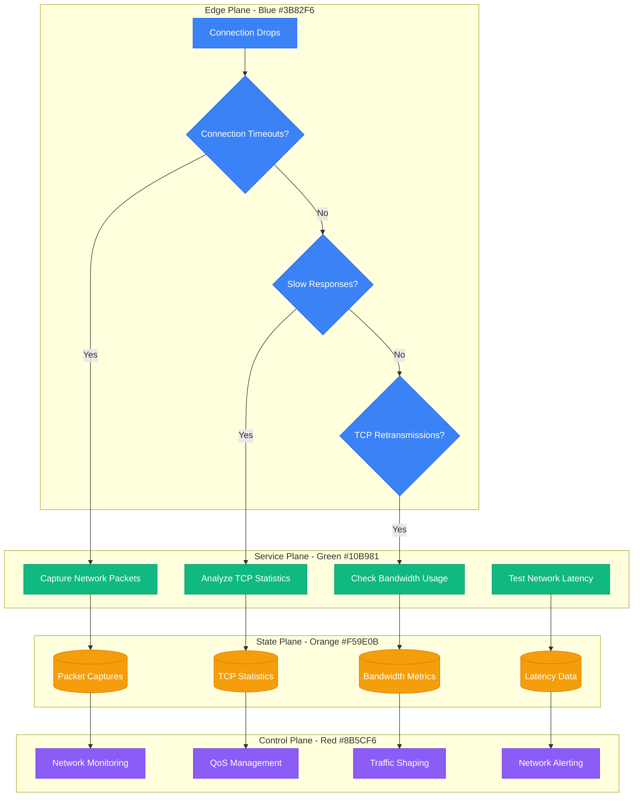
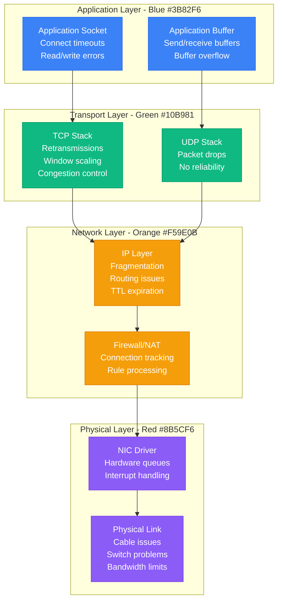
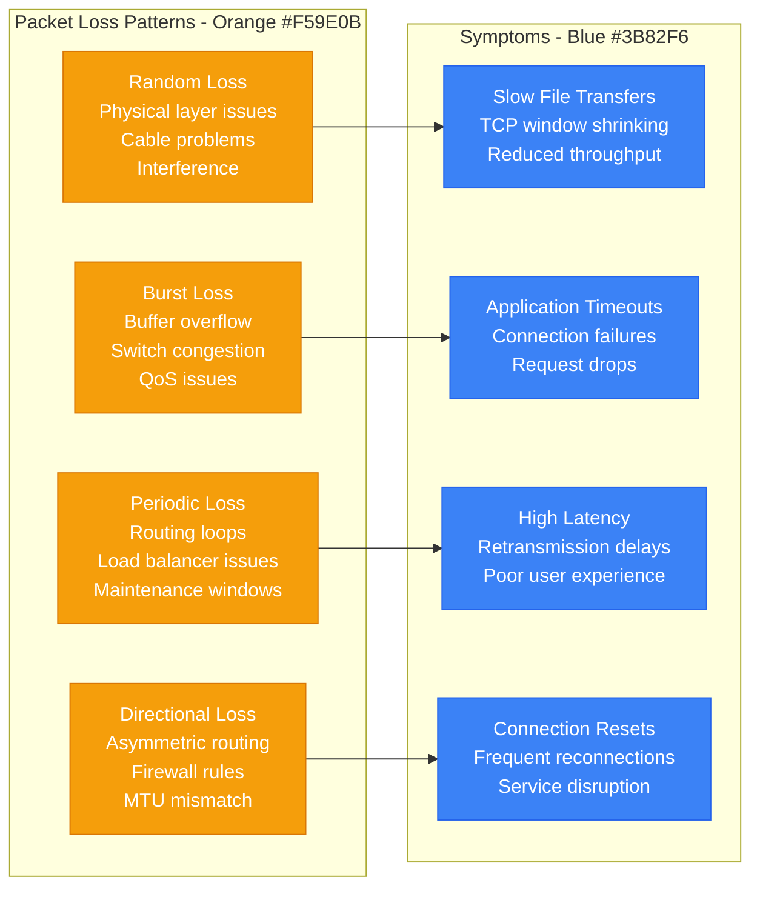

# Network Packet Loss - Production Debugging Guide

## Overview

Network packet loss can cause application timeouts, data corruption, and service degradation. This guide covers systematic TCP retransmission debugging, network latency analysis, and packet capture investigation for production network issues.

## Debugging Flowchart



## Network Diagnosis Commands

### 1. Packet Loss Detection
```bash
# Ping with packet loss analysis
ping -c 100 -i 0.1 destination.com | grep "packet loss"

# Continuous ping monitoring
ping destination.com | while read line; do
    echo "$(date): $line"
done

# MTR for network path analysis
mtr --report --report-cycles 100 destination.com

# TCP connection testing
nc -zv destination.com 80
telnet destination.com 80

# Check for dropped packets
netstat -i | grep -E "(RX-DRP|TX-DRP)"

# Monitor network errors
cat /proc/net/dev | awk '{if (NR>2) print $1, $4, $5, $12, $13}'
```

### 2. TCP Retransmission Analysis
```bash
# TCP retransmission statistics
ss -i | grep -E "(retrans|lost)"

# Netstat TCP statistics
netstat -s | grep -E "(retransmit|timeout|failed)"

# TCP connection state analysis
ss -tuln | grep LISTEN | wc -l
ss -t | grep ESTAB | wc -l

# Check for TCP resets
tcpdump -i any 'tcp[tcpflags] & tcp-rst != 0' -c 10

# Monitor TCP window scaling issues
tcpdump -i any 'tcp[tcpflags] & tcp-syn != 0' -v | grep "wscale"
```

### 3. Packet Capture and Analysis
```bash
# Capture packets for analysis
tcpdump -i any -w capture.pcap host destination.com

# Real-time packet analysis
tcpdump -i any -n host destination.com | head -20

# Filter specific protocols
tcpdump -i any port 80 -w http_traffic.pcap

# Analyze captured packets with tshark
tshark -r capture.pcap -q -z conv,tcp
tshark -r capture.pcap -q -z io,stat,1

# Check for fragmentation
tcpdump -i any 'ip[6:2] & 0x3fff != 0'

# Monitor bandwidth usage
iftop -i eth0
nethogs -d 1
```

## Network Performance Analysis

### Network Stack Visualization


### Common Packet Loss Patterns


## Real Production Examples

### AWS Network Performance Debugging
```bash
#!/bin/bash
# AWS-specific network debugging

# Check instance network performance
curl -s http://169.254.169.254/latest/meta-data/instance-type
curl -s http://169.254.169.254/latest/meta-data/placement/availability-zone

# Enhanced networking check
ethtool -i eth0 | grep "driver\|version"
ethtool -S eth0 | grep -E "(rx_packets|tx_packets|rx_dropped|tx_dropped)"

# SR-IOV support check
lspci | grep -i ethernet
cat /sys/class/net/eth0/device/sriov_numvfs

# Network bandwidth testing between instances
iperf3 -s  # On server instance
iperf3 -c server-ip -t 60 -P 4  # On client instance

# Check for EC2 network credit exhaustion
curl -s http://169.254.169.254/latest/meta-data/network/interfaces/macs/$(cat /sys/class/net/eth0/address)/network-card-index

# Monitor CloudWatch network metrics
aws cloudwatch get-metric-statistics \
  --namespace AWS/EC2 \
  --metric-name NetworkPacketsIn \
  --start-time 2024-01-01T00:00:00Z \
  --end-time 2024-01-01T01:00:00Z \
  --period 300 \
  --statistics Average,Maximum \
  --dimensions Name=InstanceId,Value=i-1234567890abcdef0
```

### Google Cloud Network Analysis
```bash
#!/bin/bash
# GCP network performance analysis

# Check instance network tier
gcloud compute instances describe instance-name --zone=us-central1-a --format="value(networkInterfaces[0].accessConfigs[0].networkTier)"

# VPC Flow Logs analysis
gcloud logging read "resource.type=gce_subnetwork" --limit=50 --format=json

# Network connectivity testing
gcloud compute instances get-serial-port-output instance-name --zone=us-central1-a

# Firewall rule analysis
gcloud compute firewall-rules list --filter="direction:INGRESS AND allowed[].ports:80"

# Load balancer health check
gcloud compute backend-services get-health backend-service-name --global

# Network endpoint group analysis
gcloud compute network-endpoint-groups list
```

### Kubernetes Network Debugging
```bash
#!/bin/bash
# Kubernetes network debugging

# Check pod network policies
kubectl get networkpolicies -A
kubectl describe networkpolicy policy-name -n namespace

# CNI plugin diagnostics
kubectl get pods -n kube-system | grep -E "(calico|flannel|weave|cilium)"

# Service mesh debugging (Istio)
kubectl get pods -n istio-system
istioctl proxy-config routes pod-name.namespace

# DNS resolution testing
kubectl run test-pod --image=busybox --rm -it -- nslookup kubernetes.default

# Network connectivity between pods
kubectl exec -it pod1 -- ping pod2-ip
kubectl exec -it pod1 -- nc -zv service-name 80

# Check kube-proxy rules
kubectl get endpoints service-name -o yaml
iptables -t nat -L | grep service-name
```

## Advanced Network Analysis

### Packet Loss Investigation Script
```python
#!/usr/bin/env python3
# Advanced packet loss analysis

import subprocess
import re
import time
import json
from typing import Dict, List, Tuple
from dataclasses import dataclass

@dataclass
class NetworkStats:
    timestamp: float
    rx_packets: int
    tx_packets: int
    rx_dropped: int
    tx_dropped: int
    rx_errors: int
    tx_errors: int

class NetworkAnalyzer:
    def __init__(self, interface: str = "eth0"):
        self.interface = interface
        self.baseline_stats = None
        self.history = []

    def get_network_stats(self) -> NetworkStats:
        """Get current network statistics"""
        try:
            # Parse /proc/net/dev
            with open('/proc/net/dev', 'r') as f:
                lines = f.readlines()

            for line in lines:
                if self.interface in line:
                    fields = line.split()
                    return NetworkStats(
                        timestamp=time.time(),
                        rx_packets=int(fields[1]),
                        tx_packets=int(fields[9]),
                        rx_dropped=int(fields[4]),
                        tx_dropped=int(fields[12]),
                        rx_errors=int(fields[3]),
                        tx_errors=int(fields[11])
                    )

        except Exception as e:
            print(f"Error reading network stats: {e}")
            return None

    def detect_packet_loss(self, duration: int = 60) -> Dict:
        """Monitor for packet loss over specified duration"""
        print(f"Monitoring {self.interface} for {duration} seconds...")

        start_stats = self.get_network_stats()
        time.sleep(duration)
        end_stats = self.get_network_stats()

        if not start_stats or not end_stats:
            return {"error": "Failed to get network statistics"}

        # Calculate differences
        rx_packets_delta = end_stats.rx_packets - start_stats.rx_packets
        tx_packets_delta = end_stats.tx_packets - start_stats.tx_packets
        rx_dropped_delta = end_stats.rx_dropped - start_stats.rx_dropped
        tx_dropped_delta = end_stats.tx_dropped - start_stats.tx_dropped
        rx_errors_delta = end_stats.rx_errors - start_stats.rx_errors
        tx_errors_delta = end_stats.tx_errors - start_stats.tx_errors

        # Calculate loss percentages
        rx_loss_percent = (rx_dropped_delta / max(rx_packets_delta, 1)) * 100
        tx_loss_percent = (tx_dropped_delta / max(tx_packets_delta, 1)) * 100

        results = {
            'duration': duration,
            'interface': self.interface,
            'packets': {
                'rx_total': rx_packets_delta,
                'tx_total': tx_packets_delta,
                'rx_dropped': rx_dropped_delta,
                'tx_dropped': tx_dropped_delta,
                'rx_errors': rx_errors_delta,
                'tx_errors': tx_errors_delta
            },
            'loss_percentage': {
                'rx_loss': rx_loss_percent,
                'tx_loss': tx_loss_percent
            },
            'assessment': self.assess_network_health(rx_loss_percent, tx_loss_percent)
        }

        return results

    def assess_network_health(self, rx_loss: float, tx_loss: float) -> str:
        """Assess network health based on loss percentages"""
        max_loss = max(rx_loss, tx_loss)

        if max_loss == 0:
            return "Excellent - No packet loss detected"
        elif max_loss < 0.1:
            return "Good - Minimal packet loss (<0.1%)"
        elif max_loss < 1.0:
            return "Fair - Low packet loss (<1%)"
        elif max_loss < 5.0:
            return "Poor - Moderate packet loss (<5%)"
        else:
            return "Critical - High packet loss (>5%)"

    def analyze_tcp_retransmissions(self) -> Dict:
        """Analyze TCP retransmission statistics"""
        try:
            result = subprocess.run(['ss', '-i'], capture_output=True, text=True)
            tcp_info = result.stdout

            # Parse retransmission info
            retrans_pattern = r'retrans:(\d+)/(\d+)'
            lost_pattern = r'lost:(\d+)'

            retrans_matches = re.findall(retrans_pattern, tcp_info)
            lost_matches = re.findall(lost_pattern, tcp_info)

            total_retrans = sum(int(match[0]) for match in retrans_matches)
            total_lost = sum(int(match) for match in lost_matches)

            return {
                'total_retransmissions': total_retrans,
                'total_lost_packets': total_lost,
                'active_connections': len(retrans_matches),
                'assessment': self.assess_tcp_health(total_retrans, total_lost)
            }

        except Exception as e:
            return {"error": f"Failed to analyze TCP stats: {e}"}

    def assess_tcp_health(self, retrans: int, lost: int) -> str:
        """Assess TCP health based on retransmission stats"""
        if retrans == 0 and lost == 0:
            return "Excellent - No retransmissions"
        elif retrans < 10 and lost < 5:
            return "Good - Low retransmission rate"
        elif retrans < 100 and lost < 50:
            return "Fair - Moderate retransmissions"
        else:
            return "Poor - High retransmission rate"

    def test_connectivity(self, targets: List[str]) -> List[Dict]:
        """Test connectivity to multiple targets"""
        results = []

        for target in targets:
            print(f"Testing connectivity to {target}...")

            try:
                # Ping test
                ping_result = subprocess.run(
                    ['ping', '-c', '10', '-i', '0.1', target],
                    capture_output=True, text=True, timeout=15
                )

                # Parse ping results
                ping_output = ping_result.stdout
                loss_match = re.search(r'(\d+)% packet loss', ping_output)
                rtt_match = re.search(r'min/avg/max/stddev = ([\d.]+)/([\d.]+)/([\d.]+)/([\d.]+)', ping_output)

                packet_loss = int(loss_match.group(1)) if loss_match else 100
                avg_rtt = float(rtt_match.group(2)) if rtt_match else float('inf')

                # TCP connectivity test
                tcp_result = subprocess.run(
                    ['nc', '-zv', target, '80'],
                    capture_output=True, text=True, timeout=10
                )

                tcp_success = tcp_result.returncode == 0

                results.append({
                    'target': target,
                    'packet_loss_percent': packet_loss,
                    'average_rtt_ms': avg_rtt,
                    'tcp_connectivity': tcp_success,
                    'status': 'healthy' if packet_loss < 5 and tcp_success else 'unhealthy'
                })

            except subprocess.TimeoutExpired:
                results.append({
                    'target': target,
                    'packet_loss_percent': 100,
                    'average_rtt_ms': float('inf'),
                    'tcp_connectivity': False,
                    'status': 'timeout'
                })

            except Exception as e:
                results.append({
                    'target': target,
                    'error': str(e),
                    'status': 'error'
                })

        return results

    def generate_report(self) -> str:
        """Generate comprehensive network analysis report"""
        print("Generating comprehensive network report...")

        # Collect all analysis data
        packet_loss_data = self.detect_packet_loss(30)  # 30 second test
        tcp_data = self.analyze_tcp_retransmissions()

        # Test common targets
        test_targets = ['8.8.8.8', 'google.com', 'cloudflare.com']
        connectivity_data = self.test_connectivity(test_targets)

        report = [
            "Network Analysis Report",
            "=" * 50,
            f"Interface: {self.interface}",
            f"Timestamp: {time.strftime('%Y-%m-%d %H:%M:%S')}",
            "",
            "Packet Loss Analysis:",
            f"  RX Loss: {packet_loss_data.get('loss_percentage', {}).get('rx_loss', 0):.2f}%",
            f"  TX Loss: {packet_loss_data.get('loss_percentage', {}).get('tx_loss', 0):.2f}%",
            f"  Assessment: {packet_loss_data.get('assessment', 'Unknown')}",
            "",
            "TCP Analysis:",
            f"  Retransmissions: {tcp_data.get('total_retransmissions', 0)}",
            f"  Lost Packets: {tcp_data.get('total_lost_packets', 0)}",
            f"  Assessment: {tcp_data.get('assessment', 'Unknown')}",
            "",
            "Connectivity Tests:"
        ]

        for test in connectivity_data:
            report.extend([
                f"  {test['target']}:",
                f"    Packet Loss: {test.get('packet_loss_percent', 'N/A')}%",
                f"    Avg RTT: {test.get('average_rtt_ms', 'N/A')}ms",
                f"    TCP: {'OK' if test.get('tcp_connectivity') else 'FAILED'}",
                f"    Status: {test['status']}",
                ""
            ])

        return "\n".join(report)

# Usage example
if __name__ == "__main__":
    analyzer = NetworkAnalyzer("eth0")
    report = analyzer.generate_report()
    print(report)

    # Save report to file
    with open(f"/tmp/network_report_{int(time.time())}.txt", "w") as f:
        f.write(report)
```

This network packet loss debugging guide provides comprehensive tools and techniques for identifying, analyzing, and resolving network performance issues in production environments, with real-world examples and automated analysis scripts.