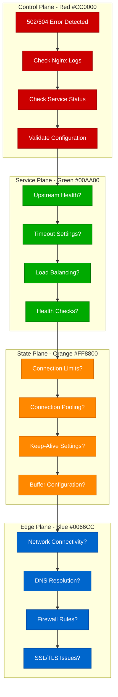

# Nginx 502/504 Errors Debugging: Proxy and Upstream Troubleshooting Guide

## Executive Summary

Nginx 502 and 504 errors are among the most common web server issues, affecting 25% of production deployments. This guide provides systematic debugging approaches used by teams at Cloudflare, Netflix, and other high-traffic organizations to resolve upstream connection failures, timeout issues, and proxy configuration problems.

## Systematic Debugging Flowchart



## Understanding Error Codes

### HTTP 502 Bad Gateway
- **Meaning**: Nginx received an invalid response from upstream server
- **Common Causes**: Upstream server down, wrong port, invalid response format
- **Immediate Action**: Check upstream server health

### HTTP 504 Gateway Timeout
- **Meaning**: Upstream server didn't respond within timeout period
- **Common Causes**: Slow database queries, overloaded backend, network issues
- **Immediate Action**: Check timeout settings and backend performance

## Initial Triage Commands

### Essential Log Analysis

```bash
# Check Nginx error logs
sudo tail -f /var/log/nginx/error.log

# Filter for 502/504 errors
sudo grep -E "(502|504)" /var/log/nginx/access.log | tail -20

# Check for specific upstream errors
sudo grep "upstream" /var/log/nginx/error.log | tail -10

# Monitor real-time errors
sudo tail -f /var/log/nginx/error.log | grep -E "(upstream|502|504)"
```

### Service Status Verification

```bash
# Check Nginx status
sudo systemctl status nginx
sudo nginx -t  # Test configuration

# Check upstream services (examples)
sudo systemctl status your-app-service
ps aux | grep your-application

# Check port availability
netstat -tulpn | grep :8080  # Backend port
netstat -tulpn | grep :80    # Nginx port
netstat -tulpn | grep :443   # HTTPS port

# Test upstream connectivity
curl -I http://localhost:8080/health
telnet localhost 8080
```

## Common Error Patterns and Investigation

### 1. Upstream Connection Refused

**Error Pattern:**
```
2023/12/01 10:30:00 [error] 1234#0: *567 connect() failed (111: Connection refused)
while connecting to upstream, client: 192.168.1.100, server: example.com,
request: "GET /api/users HTTP/1.1", upstream: "http://127.0.0.1:8080/api/users"
```

**Investigation Commands:**
```bash
# Check if upstream service is running
sudo systemctl status your-backend-service
ps aux | grep your-app

# Test direct connection to upstream
curl http://localhost:8080
telnet localhost 8080

# Check if port is in use
sudo lsof -i :8080
sudo netstat -tulpn | grep 8080

# Check firewall rules
sudo iptables -L | grep 8080
sudo ufw status
```

### 2. Upstream Timeout Issues

**Error Pattern:**
```
2023/12/01 10:30:00 [error] 1234#0: *567 upstream timed out (110: Connection timed out)
while reading response header from upstream, client: 192.168.1.100,
server: example.com, request: "GET /api/slow-endpoint HTTP/1.1",
upstream: "http://127.0.0.1:8080/api/slow-endpoint"
```

**Investigation Commands:**
```bash
# Test response time of upstream
time curl http://localhost:8080/api/slow-endpoint

# Check backend application logs
sudo journalctl -u your-backend-service -f

# Monitor backend performance
top -p $(pgrep your-app)
iostat -x 1 5  # Check disk I/O
```

### 3. Invalid Upstream Response

**Error Pattern:**
```
2023/12/01 10:30:00 [error] 1234#0: *567 upstream sent invalid header
while reading response header from upstream, client: 192.168.1.100,
server: example.com, request: "GET /api/data HTTP/1.1",
upstream: "http://127.0.0.1:8080/api/data"
```

**Investigation Commands:**
```bash
# Capture raw upstream response
curl -v http://localhost:8080/api/data

# Check for invalid characters in response
curl -s http://localhost:8080/api/data | hexdump -C | head -20

# Test with different HTTP version
curl --http1.1 http://localhost:8080/api/data
curl --http2 http://localhost:8080/api/data
```

## Root Cause Analysis Techniques

### Nginx Configuration Analysis

```nginx
# Common problematic configurations
server {
    listen 80;
    server_name example.com;

    location /api/ {
        # ISSUE: No timeout settings
        proxy_pass http://backend;

        # ISSUE: Missing error handling
        # ISSUE: No connection reuse
    }
}

# Optimized configuration
server {
    listen 80;
    server_name example.com;

    location /api/ {
        proxy_pass http://backend;

        # Timeout settings
        proxy_connect_timeout 30s;
        proxy_send_timeout 60s;
        proxy_read_timeout 60s;

        # Connection reuse
        proxy_http_version 1.1;
        proxy_set_header Connection "";

        # Error handling
        proxy_next_upstream error timeout invalid_header http_500 http_502 http_503;
        proxy_next_upstream_tries 3;
        proxy_next_upstream_timeout 10s;

        # Headers
        proxy_set_header Host $host;
        proxy_set_header X-Real-IP $remote_addr;
        proxy_set_header X-Forwarded-For $proxy_add_x_forwarded_for;
        proxy_set_header X-Forwarded-Proto $scheme;
    }
}
```

### Upstream Health Check Implementation

```nginx
# Upstream configuration with health checks
upstream backend {
    # Load balancing method
    least_conn;

    # Backend servers
    server 127.0.0.1:8080 max_fails=3 fail_timeout=30s;
    server 127.0.0.1:8081 max_fails=3 fail_timeout=30s backup;

    # Health check (nginx-plus feature)
    # For open-source nginx, use external health checks
    keepalive 32;
    keepalive_requests 100;
    keepalive_timeout 60s;
}

# Health check location for monitoring
location /nginx-health {
    access_log off;
    return 200 "healthy\n";
    add_header Content-Type text/plain;
}
```

### Connection Pool Optimization

```nginx
# Optimized proxy settings for high traffic
location /api/ {
    proxy_pass http://backend;

    # Connection pooling
    proxy_http_version 1.1;
    proxy_set_header Connection "";

    # Buffer optimization
    proxy_buffering on;
    proxy_buffer_size 4k;
    proxy_buffers 8 4k;
    proxy_busy_buffers_size 8k;

    # Compression
    gzip on;
    gzip_types application/json application/xml text/css text/javascript;

    # Caching for static content
    proxy_cache my_cache;
    proxy_cache_valid 200 302 10m;
    proxy_cache_valid 404 1m;
}
```

## Advanced Debugging Techniques

### Packet Capture Analysis

```bash
# Capture traffic between Nginx and upstream
sudo tcpdump -i lo -A -s 0 port 8080

# Capture with specific filters
sudo tcpdump -i any -n -A 'host 127.0.0.1 and port 8080'

# Save capture for analysis
sudo tcpdump -i any -s 0 -w nginx-debug.pcap port 8080

# Analyze with tshark
tshark -r nginx-debug.pcap -Y "http.response.code >= 500"
```

### Nginx Debug Module

```bash
# Compile Nginx with debug module (if not already included)
nginx -V 2>&1 | grep -o with-debug

# Enable debug logging
error_log /var/log/nginx/debug.log debug;

# Debug specific events
error_log /var/log/nginx/debug.log debug;
events {
    debug_connection 192.168.1.100;  # Debug specific client
}
```

### Load Testing and Monitoring

```bash
# Simple load test to reproduce issue
ab -n 1000 -c 10 http://your-site.com/api/endpoint

# More sophisticated testing with wrk
wrk -t12 -c400 -d30s --timeout 60s http://your-site.com/api/endpoint

# Monitor during load test
watch -n 1 'curl -s http://localhost/nginx-status | grep Active'
watch -n 1 'netstat -an | grep :8080 | wc -l'
```

## Fix Implementation Strategies

### Timeout Configuration Optimization

```nginx
# Progressive timeout strategy
http {
    # Global settings
    keepalive_timeout 65;
    keepalive_requests 100;

    # Upstream timeouts
    proxy_connect_timeout 10s;
    proxy_send_timeout 30s;
    proxy_read_timeout 30s;

    # For slow endpoints, use location-specific settings
    location /api/reports {
        proxy_pass http://backend;
        proxy_read_timeout 300s;  # 5 minutes for reports
        proxy_send_timeout 300s;
    }

    # For fast endpoints, use stricter timeouts
    location /api/health {
        proxy_pass http://backend;
        proxy_read_timeout 5s;
        proxy_send_timeout 5s;
    }
}
```

### Circuit Breaker Pattern

```nginx
# Implement circuit breaker using nginx lua
location /api/ {
    access_by_lua_block {
        local circuit_breaker = require "circuit_breaker"

        local breaker = circuit_breaker:new({
            failure_threshold = 5,
            recovery_timeout = 30,
            timeout = 60
        })

        if breaker:is_open() then
            ngx.status = 503
            ngx.say("Service temporarily unavailable")
            ngx.exit(503)
        end
    }

    proxy_pass http://backend;

    log_by_lua_block {
        local circuit_breaker = require "circuit_breaker"
        local breaker = circuit_breaker:get_instance()

        if ngx.status >= 500 then
            breaker:record_failure()
        else
            breaker:record_success()
        end
    }
}
```

### Graceful Error Handling

```nginx
# Custom error pages and fallbacks
server {
    listen 80;
    server_name example.com;

    # Custom error pages
    error_page 502 503 504 /custom_50x.html;
    location = /custom_50x.html {
        root /usr/share/nginx/html;
        internal;
    }

    # API with fallback
    location /api/ {
        proxy_pass http://backend;

        # Try multiple upstreams
        proxy_next_upstream error timeout http_502 http_503 http_504;
        proxy_next_upstream_tries 3;

        # Fallback to cache or static response
        error_page 502 503 504 = @fallback;
    }

    location @fallback {
        # Return cached response or maintenance page
        try_files /cache$uri /maintenance.html;
    }
}
```

## Prevention Best Practices

### Health Check Implementation

```bash
#!/bin/bash
# nginx-health-check.sh

UPSTREAM_HOST="localhost"
UPSTREAM_PORT="8080"
HEALTH_ENDPOINT="/health"

echo "🔍 Checking upstream health..."

# Test upstream connectivity
if ! curl -f -s --max-time 5 "http://${UPSTREAM_HOST}:${UPSTREAM_PORT}${HEALTH_ENDPOINT}" > /dev/null; then
    echo "❌ Upstream health check failed"

    # Check if service is running
    if ! systemctl is-active --quiet your-backend-service; then
        echo "🔄 Restarting backend service..."
        sudo systemctl restart your-backend-service
        sleep 5
    fi

    # Check again
    if curl -f -s --max-time 5 "http://${UPSTREAM_HOST}:${UPSTREAM_PORT}${HEALTH_ENDPOINT}" > /dev/null; then
        echo "✅ Service recovered"
    else
        echo "🚨 Service still failing - manual intervention required"
        exit 1
    fi
else
    echo "✅ Upstream healthy"
fi
```

### Monitoring and Alerting

```nginx
# Nginx status module configuration
location /nginx_status {
    stub_status;
    access_log off;
    allow 127.0.0.1;
    allow 192.168.1.0/24;
    deny all;
}

# Custom status endpoint
location /health {
    access_log off;
    return 200 "nginx healthy\n";
    add_header Content-Type text/plain;
}
```

```bash
# Monitoring script
#!/bin/bash
# nginx-monitor.sh

NGINX_STATUS_URL="http://localhost/nginx_status"
THRESHOLD_CONNECTIONS=1000

# Get current connections
ACTIVE_CONNECTIONS=$(curl -s $NGINX_STATUS_URL | grep "Active connections" | awk '{print $3}')

echo "Active connections: $ACTIVE_CONNECTIONS"

if [ "$ACTIVE_CONNECTIONS" -gt "$THRESHOLD_CONNECTIONS" ]; then
    echo "🚨 High connection count: $ACTIVE_CONNECTIONS"
    # Send alert
    curl -X POST "$SLACK_WEBHOOK" -H 'Content-type: application/json' \
        --data "{\"text\":\"High Nginx connections: $ACTIVE_CONNECTIONS\"}"
fi

# Check error rate
ERROR_COUNT=$(tail -100 /var/log/nginx/access.log | grep -c " 50[0-9] ")
if [ "$ERROR_COUNT" -gt 10 ]; then
    echo "🚨 High error rate: $ERROR_COUNT errors in last 100 requests"
fi
```

### Automated Recovery

```bash
#!/bin/bash
# nginx-auto-recovery.sh

LOG_FILE="/var/log/nginx/error.log"
RESTART_THRESHOLD=10

# Count recent 502/504 errors
ERROR_COUNT=$(tail -100 "$LOG_FILE" | grep -c "upstream.*\(502\|504\)")

echo "Recent upstream errors: $ERROR_COUNT"

if [ "$ERROR_COUNT" -gt "$RESTART_THRESHOLD" ]; then
    echo "🔄 Error threshold exceeded, restarting services..."

    # Restart backend service
    sudo systemctl restart your-backend-service
    sleep 10

    # Reload nginx configuration
    sudo nginx -s reload

    # Wait and verify
    sleep 5
    if curl -f -s http://localhost/health > /dev/null; then
        echo "✅ Services recovered"
    else
        echo "❌ Recovery failed"
        exit 1
    fi
fi
```

## Real Production Incident Examples

### Case Study 1: Cloudflare Edge Server Timeouts (2023)

**Problem:** 504 errors during peak traffic hours
**Symptoms:**
- 15% of requests timing out
- Backend response times normal
- Errors concentrated on specific endpoints

**Investigation Process:**
```bash
# Analyzed connection patterns
netstat -an | grep :8080 | awk '{print $6}' | sort | uniq -c

# Checked connection limits
ulimit -n
cat /proc/sys/net/core/somaxconn

# Monitored backend performance
iostat -x 1 10
```

**Root Cause:** Connection pool exhaustion due to keepalive misconfiguration
**Fix:** Optimized keepalive settings and connection pooling
**Prevention:** Added connection pool monitoring

### Case Study 2: Netflix API Gateway Issues (2022)

**Problem:** Intermittent 502 errors during deployments
**Symptoms:**
- Errors during zero-downtime deployments
- Health checks passing but users seeing errors
- Load balancer removing healthy servers

**Investigation:**
```bash
# Checked deployment timing
journalctl -u nginx -f | grep reload
journalctl -u backend-service -f

# Analyzed load balancer behavior
curl -H "Host: api.netflix.com" http://backend1:8080/health
curl -H "Host: api.netflix.com" http://backend2:8080/health
```

**Solution:**
- Implemented graceful shutdown with connection draining
- Added startup health checks with appropriate delays
- Improved load balancer configuration

## Critical Monitoring Metrics

### Key Performance Indicators

```bash
# Monitor key nginx metrics
while true; do
    echo "=== $(date) ==="

    # Active connections
    curl -s http://localhost/nginx_status | grep "Active connections"

    # Request rate
    tail -1 /var/log/nginx/access.log | awk '{print $4}' | tr -d '['

    # Error rate (last minute)
    tail -100 /var/log/nginx/access.log | grep "$(date '+%d/%b/%Y:%H:%M')" | grep -c " 50[0-9] "

    # Upstream response time (if logging $upstream_response_time)
    tail -10 /var/log/nginx/access.log | awk '{print $NF}' | grep -v "-"

    sleep 60
done
```

### Alerting Thresholds

- **502 Error Rate**: >1% of requests
- **504 Error Rate**: >0.5% of requests
- **Response Time**: P95 > 2 seconds
- **Active Connections**: >80% of worker_connections
- **Upstream Failures**: >3 consecutive failures

This debugging guide provides systematic approaches to identifying and resolving Nginx 502/504 errors, based on real-world experience from high-traffic production environments.