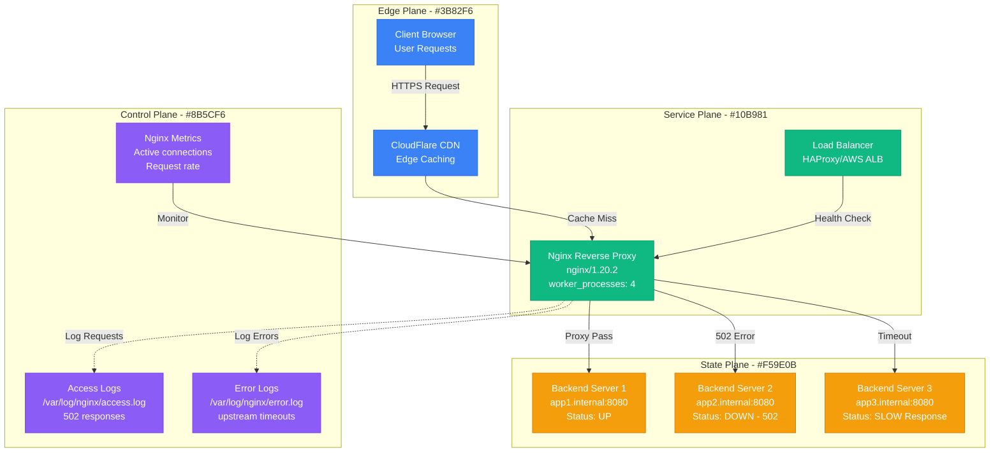
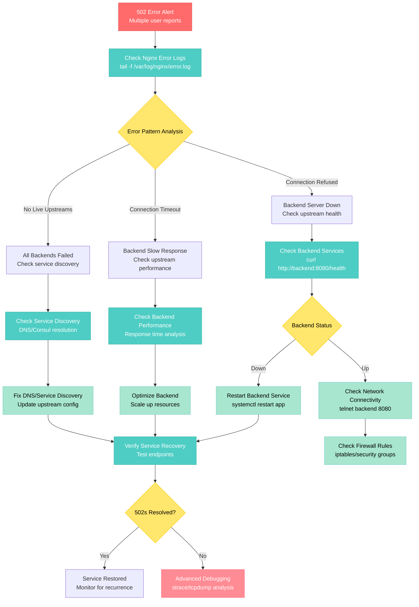

# Nginx 502 Error Debugging

**Scenario**: Production Nginx reverse proxy returning 502 Bad Gateway errors, preventing user access to backend services.

**The 3 AM Reality**: Users seeing error pages, backend services unreachable through Nginx, and potential revenue loss from service unavailability.

## Symptoms Checklist

- [ ] HTTP 502 responses in access logs
- [ ] Upstream connection failures in error logs
- [ ] Backend services responding but Nginx can't connect
- [ ] Intermittent 502s during high traffic periods
- [ ] Health check failures to upstream servers

## Nginx 502 Error Architecture



## Step-by-Step Debugging Flow



## Critical Commands & Queries

### Immediate Error Analysis
```bash
# Check recent 502 errors in access logs
tail -1000 /var/log/nginx/access.log | grep " 502 " | tail -20

# Real-time error monitoring
tail -f /var/log/nginx/error.log | grep -E "upstream|502|timeout"

# Count 502 errors in last hour
awk '$4 ~ /$(date +%d\\/%b\\/%Y:%H)/ && $9 == "502"' /var/log/nginx/access.log | wc -l

# Check nginx configuration syntax
nginx -t

# Test nginx configuration and reload
nginx -s reload
```

### Upstream Health Analysis
```bash
# Test backend connectivity directly
curl -I http://backend-server:8080/health
curl -w "%{time_total}\n" -o /dev/null -s http://backend-server:8080/

# Check if backend services are listening
netstat -tlnp | grep :8080
ss -tlnp | grep :8080

# Test connection to upstream from nginx server
telnet backend-server 8080
nc -zv backend-server 8080

# Check DNS resolution for upstream servers
nslookup backend-server
dig backend-server +short
```

### Nginx Process and Resource Analysis
```bash
# Check nginx process status
ps aux | grep nginx
systemctl status nginx

# Check nginx worker processes
nginx -V 2>&1 | grep -o with-file-aio
cat /proc/$(pidof nginx | cut -d' ' -f1)/limits

# Monitor nginx connections
watch -n 1 'ss -s | grep -E "estab|time-wait"'

# Check file descriptor usage
lsof -p $(pidof nginx | head -1) | wc -l
cat /proc/sys/fs/file-max
```

### Network Connectivity Debugging
```bash
# Trace network path to upstream
traceroute backend-server
mtr --report backend-server

# Check iptables rules
iptables -L -n | grep -E "8080|DROP|REJECT"

# Monitor network connections
netstat -an | grep -E ":80|:8080|:443"

# Check for network packet loss
ping -c 10 backend-server
```

## Log Analysis Locations

### Nginx Error Logs
```bash
# Main nginx error log
tail -f /var/log/nginx/error.log

# Search for upstream connection issues
grep -E "connect\(\) failed|upstream timed out|no live upstreams" /var/log/nginx/error.log

# Check for resource exhaustion
grep -E "worker_connections|accept\(\) failed" /var/log/nginx/error.log

# Look for configuration errors
grep -E "directive|unknown|invalid" /var/log/nginx/error.log
```

### Nginx Access Logs
```bash
# Analyze 502 error patterns
awk '$9 == "502" {print $1, $4, $7, $12}' /var/log/nginx/access.log | sort | uniq -c

# Check request timing patterns
awk '$9 == "502" {print $4}' /var/log/nginx/access.log | cut -d: -f2-4 | sort | uniq -c

# Identify problematic endpoints
awk '$9 == "502" {print $7}' /var/log/nginx/access.log | sort | uniq -c | sort -nr

# Monitor response times
tail -f /var/log/nginx/access.log | awk '{print $NF, $9}' | grep -E "502|5\."
```

### System and Application Logs
```bash
# Backend application logs
tail -f /var/log/app/application.log | grep -E "ERROR|Exception|timeout"

# System resource logs
dmesg | grep -E "Out of memory|TCP"
cat /proc/meminfo | grep -E "MemFree|MemAvailable"

# Check systemd logs for services
journalctl -u nginx -f
journalctl -u backend-app -f --lines=50
```

## Monitoring Queries

### Nginx Status Module Queries
```bash
# Enable nginx status module (add to nginx.conf)
# location /nginx_status {
#     stub_status on;
#     access_log off;
#     allow 127.0.0.1;
#     deny all;
# }

# Get nginx status
curl http://localhost/nginx_status

# Parse nginx status for monitoring
curl -s http://localhost/nginx_status | awk '
NR==1 {active=$3}
NR==3 {requests=$3; rate=requests/NR}
NR==4 {reading=$2; writing=$4; waiting=$6}
END {
    print "Active Connections:", active
    print "Total Requests:", requests
    print "Reading:", reading, "Writing:", writing, "Waiting:", waiting
}'
```

### Prometheus Metrics (using nginx-prometheus-exporter)
```promql
# 502 error rate
rate(nginx_http_requests_total{status="502"}[5m])

# Upstream response time
histogram_quantile(0.95, rate(nginx_http_request_duration_seconds_bucket[5m]))

# Active connections
nginx_connections_active

# Request rate
rate(nginx_http_requests_total[5m])

# Upstream server status
nginx_upstream_server_up
```

### Log-based Monitoring
```bash
#!/bin/bash
# nginx-502-monitor.sh - Real-time 502 monitoring script

LOG_FILE="/var/log/nginx/access.log"
ERROR_THRESHOLD=10  # 502 errors per minute
SLACK_WEBHOOK="your-slack-webhook-url"

# Function to send alerts
send_alert() {
    curl -X POST -H 'Content-type: application/json' \
        --data "{\"text\":\"Nginx 502 Alert: $1\"}" \
        $SLACK_WEBHOOK
}

# Count 502 errors in last minute
CURRENT_502=$(tail -1000 $LOG_FILE | \
    awk -v timestamp="$(date -d '1 minute ago' '+%d/%b/%Y:%H:%M')" \
    '$4 >= "["timestamp && $9 == "502"' | wc -l)

if [ $CURRENT_502 -gt $ERROR_THRESHOLD ]; then
    # Get affected endpoints
    ENDPOINTS=$(tail -1000 $LOG_FILE | \
        awk '$9 == "502" {print $7}' | \
        sort | uniq -c | sort -nr | head -5)

    send_alert "502 errors: $CURRENT_502/min (threshold: $ERROR_THRESHOLD). Affected endpoints: $ENDPOINTS"
fi
```

## Common Root Causes (by Probability)

### 1. Backend Service Down/Unresponsive (45% of cases)
**Symptoms**: Connection refused errors, health check failures
```bash
# Detection
curl -f http://backend:8080/health || echo "Backend down"

# Emergency fix
systemctl restart backend-service

# Check service logs
journalctl -u backend-service --lines=100

# Temporary workaround - remove from upstream
# In nginx.conf:
# upstream backend {
#     server backend1:8080;
#     server backend2:8080 down;  # Temporarily disable
# }
nginx -s reload
```

### 2. Backend Performance Issues (25% of cases)
**Symptoms**: Upstream timeout errors, slow response times
```bash
# Detection
curl -w "Time: %{time_total}s\n" http://backend:8080/

# Fix - Increase nginx timeouts temporarily
# In nginx.conf:
# proxy_connect_timeout 30s;
# proxy_send_timeout 30s;
# proxy_read_timeout 30s;

# Scale backend resources
kubectl scale deployment backend --replicas=6
```

### 3. Network Connectivity Issues (15% of cases)
**Symptoms**: Intermittent connection failures, packet loss
```bash
# Detection
ping -c 10 backend-server
mtr --report backend-server

# Check network configuration
ip route show
iptables -L -n

# Test different ports
nc -zv backend-server 8080
telnet backend-server 8080
```

### 4. Nginx Configuration Errors (10% of cases)
**Symptoms**: Consistent 502s, configuration syntax errors
```bash
# Detection
nginx -t

# Common issues:
# - Wrong upstream server addresses
# - Missing upstream block
# - Incorrect proxy_pass directive

# Fix configuration
vim /etc/nginx/sites-enabled/default
nginx -s reload
```

### 5. Resource Exhaustion (5% of cases)
**Symptoms**: Connection limit reached, memory exhaustion
```bash
# Detection
netstat -an | grep :80 | wc -l
cat /proc/meminfo | grep MemAvailable

# Increase worker connections
# In nginx.conf:
# events {
#     worker_connections 2048;
# }

# Add more worker processes
# worker_processes auto;
```

## Immediate Mitigation Steps

### Emergency Response (< 5 minutes)
1. **Verify Backend Services**
   ```bash
   # Quick health check all backends
   for backend in backend1 backend2 backend3; do
     echo -n "$backend: "
     curl -f -m 5 http://$backend:8080/health && echo "OK" || echo "FAILED"
   done

   # Restart failed services
   systemctl restart backend-service
   ```

2. **Temporary Nginx Configuration Fix**
   ```bash
   # Remove failed upstream temporarily
   nginx -t && nginx -s reload

   # Or route traffic to working backends only
   # Edit /etc/nginx/conf.d/upstream.conf
   ```

### Short-term Fixes (< 30 minutes)
1. **Scale Backend Services**
   ```bash
   # Kubernetes scaling
   kubectl scale deployment backend --replicas=5

   # Docker Compose scaling
   docker-compose up -d --scale backend=3

   # Traditional service restart
   systemctl restart backend-service
   ```

2. **Optimize Nginx Configuration**
   ```nginx
   # /etc/nginx/nginx.conf optimizations
   worker_processes auto;
   worker_rlimit_nofile 65535;

   events {
       worker_connections 2048;
       use epoll;
       multi_accept on;
   }

   http {
       # Upstream configuration
       upstream backend {
           least_conn;
           server backend1:8080 max_fails=3 fail_timeout=30s;
           server backend2:8080 max_fails=3 fail_timeout=30s;
           server backend3:8080 max_fails=3 fail_timeout=30s;
           keepalive 32;
       }

       # Proxy timeouts
       proxy_connect_timeout 10s;
       proxy_send_timeout 30s;
       proxy_read_timeout 30s;
       proxy_next_upstream error timeout http_502 http_503 http_504;
   }
   ```

## Long-term Prevention

### Health Check Implementation
```nginx
# nginx.conf - Advanced upstream configuration
upstream backend {
    least_conn;
    server backend1:8080 max_fails=2 fail_timeout=10s;
    server backend2:8080 max_fails=2 fail_timeout=10s;
    server backend3:8080 max_fails=2 fail_timeout=10s;
    keepalive 16;
}

# Health check endpoint
location /health {
    access_log off;
    return 200 "healthy\n";
    add_header Content-Type text/plain;
}

# Proxy configuration with retries
location / {
    proxy_pass http://backend;
    proxy_next_upstream error timeout http_502 http_503 http_504;
    proxy_next_upstream_tries 3;
    proxy_next_upstream_timeout 10s;

    # Headers
    proxy_set_header Host $host;
    proxy_set_header X-Real-IP $remote_addr;
    proxy_set_header X-Forwarded-For $proxy_add_x_forwarded_for;
    proxy_set_header X-Forwarded-Proto $scheme;

    # Timeouts
    proxy_connect_timeout 5s;
    proxy_send_timeout 30s;
    proxy_read_timeout 30s;
}
```

### Monitoring and Alerting
```yaml
# Grafana alerts for nginx 502 errors
groups:
  - name: nginx
    rules:
    - alert: Nginx502ErrorsHigh
      expr: rate(nginx_http_requests_total{status="502"}[5m]) > 0.1
      for: 2m
      labels:
        severity: critical
      annotations:
        summary: "High rate of nginx 502 errors"
        description: "Nginx is returning 502 errors at {{ $value }} per second"

    - alert: NginxUpstreamDown
      expr: nginx_upstream_server_up == 0
      for: 1m
      labels:
        severity: warning
      annotations:
        summary: "Nginx upstream server is down"
        description: "Upstream server {{ $labels.server }} is not responding"
```

### Application-Level Circuit Breaker
```python
# Python circuit breaker for backend calls
import time
import requests
from enum import Enum

class CircuitState(Enum):
    CLOSED = 1
    OPEN = 2
    HALF_OPEN = 3

class CircuitBreaker:
    def __init__(self, failure_threshold=5, timeout=60):
        self.failure_threshold = failure_threshold
        self.timeout = timeout
        self.failure_count = 0
        self.last_failure_time = None
        self.state = CircuitState.CLOSED

    def call(self, func, *args, **kwargs):
        if self.state == CircuitState.OPEN:
            if time.time() - self.last_failure_time > self.timeout:
                self.state = CircuitState.HALF_OPEN
            else:
                raise Exception("Circuit breaker is OPEN")

        try:
            result = func(*args, **kwargs)
            self.on_success()
            return result
        except Exception as e:
            self.on_failure()
            raise e

    def on_success(self):
        self.failure_count = 0
        self.state = CircuitState.CLOSED

    def on_failure(self):
        self.failure_count += 1
        self.last_failure_time = time.time()
        if self.failure_count >= self.failure_threshold:
            self.state = CircuitState.OPEN

# Usage example
circuit_breaker = CircuitBreaker()

def make_backend_request():
    return circuit_breaker.call(
        requests.get,
        'http://backend:8080/api/data',
        timeout=5
    )
```

## Production Examples

### GitHub's Nginx 502 Incident (2020)
- **Incident**: Widespread 502 errors during code push surge
- **Root Cause**: Backend services overwhelmed, connection pool exhaustion
- **Impact**: 15-minute service disruption, 30% of push operations failed
- **Resolution**: Increased backend capacity, implemented request queuing
- **Prevention**: Dynamic scaling based on connection pool utilization

### Netflix's Edge Proxy Failure (2019)
- **Incident**: Regional 502 errors in US-East
- **Root Cause**: Database connection leak in backend services
- **Impact**: 25% of streaming requests failed for 8 minutes
- **Resolution**: Restarted backend services, fixed connection pooling
- **Learning**: Implemented circuit breakers and better connection monitoring

### Stripe's Payment Gateway 502s (2021)
- **Incident**: Payment processing 502 errors during Black Friday
- **Root Cause**: Nginx upstream health checks disabled, failed servers not removed
- **Impact**: 12% payment failure rate, potential revenue loss
- **Resolution**: Re-enabled health checks, implemented proper load balancing
- **Prevention**: Automated upstream server management

## Recovery Automation Script

```bash
#!/bin/bash
# nginx-502-recovery.sh - Automated 502 recovery script

NGINX_CONF="/etc/nginx/sites-enabled/default"
UPSTREAM_SERVERS=("backend1:8080" "backend2:8080" "backend3:8080")
HEALTH_ENDPOINT="/health"
SLACK_WEBHOOK="your-slack-webhook-url"

# Function to send alerts
send_alert() {
    curl -X POST -H 'Content-type: application/json' \
        --data "{\"text\":\"Nginx Recovery: $1\"}" \
        $SLACK_WEBHOOK
}

# Function to test upstream health
test_upstream() {
    local server=$1
    curl -f -m 5 http://$server$HEALTH_ENDPOINT > /dev/null 2>&1
    return $?
}

# Function to update nginx upstream
update_upstream() {
    local servers=("$@")
    send_alert "Updating nginx upstream configuration"

    # Backup current config
    cp $NGINX_CONF $NGINX_CONF.backup

    # Generate new upstream block
    cat > /tmp/upstream.conf << EOF
upstream backend {
    least_conn;
$(for server in "${servers[@]}"; do
    echo "    server $server max_fails=2 fail_timeout=10s;"
done)
    keepalive 16;
}
EOF

    # Update nginx configuration
    # This is a simplified example - in production, use proper config management
    nginx -t && nginx -s reload

    send_alert "Nginx configuration updated with $(echo ${#servers[@]}) healthy servers"
}

# Main recovery logic
echo "Starting nginx 502 recovery check..."

# Test all upstream servers
healthy_servers=()
failed_servers=()

for server in "${UPSTREAM_SERVERS[@]}"; do
    if test_upstream $server; then
        healthy_servers+=($server)
        echo "✓ $server is healthy"
    else
        failed_servers+=($server)
        echo "✗ $server is unhealthy"
    fi
done

# If we have failed servers, update configuration
if [ ${#failed_servers[@]} -gt 0 ]; then
    send_alert "Found ${#failed_servers[@]} failed servers: ${failed_servers[*]}"

    if [ ${#healthy_servers[@]} -gt 0 ]; then
        update_upstream "${healthy_servers[@]}"
    else
        send_alert "CRITICAL: All upstream servers are down!"
        # Emergency response: restart services, scale up, etc.
    fi
else
    echo "All upstream servers are healthy"
fi

# Check current 502 rate
CURRENT_502=$(tail -100 /var/log/nginx/access.log | grep " 502 " | wc -l)
echo "Current 502 errors in last 100 requests: $CURRENT_502"

if [ $CURRENT_502 -gt 10 ]; then
    send_alert "High 502 error rate detected: $CURRENT_502/100 requests"
fi
```

**Remember**: Nginx 502 errors often indicate backend issues rather than Nginx problems. Always check upstream services first, then network connectivity, and finally Nginx configuration. Quick backend restarts can often resolve immediate issues, but root cause analysis is essential for prevention.