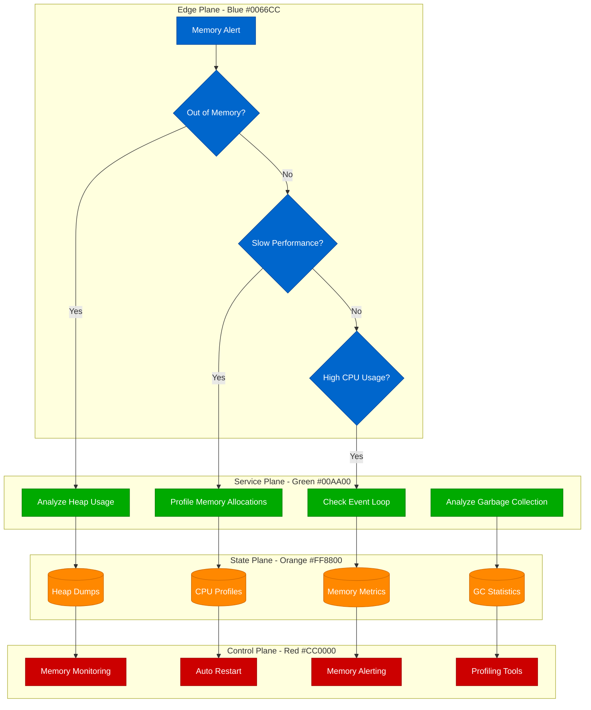

# Node.js Memory Profiling - Production Debugging Guide

## Overview

Node.js memory issues can cause application crashes, performance degradation, and service instability. This guide covers heap dump analysis, memory leak detection, and V8 optimization for production Node.js applications.

## Debugging Flowchart



## Memory Profiling Commands

### 1. Basic Memory Analysis
```bash
# Check Node.js memory usage
node --max-old-space-size=4096 --inspect app.js

# Generate heap dump
kill -USR2 <node_pid>  # Creates heapdump-<timestamp>.heapsnapshot

# Using clinic.js for comprehensive profiling
npm install -g clinic
clinic doctor -- node app.js
clinic flame -- node app.js
clinic bubbleprof -- node app.js

# Monitor memory usage
ps -eo pid,ppid,cmd,%mem,%cpu --sort=-%mem | head -10

# Check V8 heap statistics
node -p "process.memoryUsage()"
# Output: { rss: 23MB, heapTotal: 8MB, heapUsed: 4MB, external: 1MB }
```

### 2. Heap Dump Analysis
```javascript
// Generate heap snapshot programmatically
const v8 = require('v8');
const fs = require('fs');

function takeHeapSnapshot() {
    const filename = `heap-${Date.now()}.heapsnapshot`;
    const stream = v8.getHeapSnapshot();
    const file = fs.createWriteStream(filename);
    stream.pipe(file);
    console.log(`Heap snapshot saved to ${filename}`);
}

// Memory monitoring middleware
function memoryMonitor(req, res, next) {
    const beforeMem = process.memoryUsage();

    res.on('finish', () => {
        const afterMem = process.memoryUsage();
        const heapDiff = afterMem.heapUsed - beforeMem.heapUsed;

        if (heapDiff > 10 * 1024 * 1024) { // 10MB threshold
            console.warn(`Large memory allocation detected: ${heapDiff / 1024 / 1024}MB`);
            console.warn(`Request: ${req.method} ${req.url}`);
        }
    });

    next();
}

// GC monitoring
if (global.gc) {
    const originalGC = global.gc;
    global.gc = function() {
        const before = process.memoryUsage();
        const start = Date.now();

        originalGC();

        const after = process.memoryUsage();
        const duration = Date.now() - start;
        const freed = before.heapUsed - after.heapUsed;

        console.log(`GC: freed ${freed / 1024 / 1024}MB in ${duration}ms`);
    };
}
```

### 3. Memory Leak Detection
```javascript
// Memory leak detector
class MemoryLeakDetector {
    constructor(options = {}) {
        this.threshold = options.threshold || 100 * 1024 * 1024; // 100MB
        this.interval = options.interval || 30000; // 30 seconds
        this.samples = [];
        this.isMonitoring = false;
    }

    start() {
        if (this.isMonitoring) return;

        this.isMonitoring = true;
        this.intervalId = setInterval(() => {
            this.checkMemory();
        }, this.interval);

        console.log('Memory leak detector started');
    }

    stop() {
        if (this.intervalId) {
            clearInterval(this.intervalId);
            this.isMonitoring = false;
            console.log('Memory leak detector stopped');
        }
    }

    checkMemory() {
        const usage = process.memoryUsage();
        const timestamp = Date.now();

        this.samples.push({
            timestamp,
            heapUsed: usage.heapUsed,
            heapTotal: usage.heapTotal,
            rss: usage.rss,
            external: usage.external
        });

        // Keep only last 20 samples
        if (this.samples.length > 20) {
            this.samples.shift();
        }

        // Detect trend
        if (this.samples.length >= 10) {
            const trend = this.analyzeMemoryTrend();
            if (trend.isLeaking) {
                this.handleMemoryLeak(trend);
            }
        }

        // Check absolute threshold
        if (usage.heapUsed > this.threshold) {
            this.handleHighMemoryUsage(usage);
        }
    }

    analyzeMemoryTrend() {
        const recentSamples = this.samples.slice(-10);
        const oldSamples = this.samples.slice(-20, -10);

        if (oldSamples.length === 0) return { isLeaking: false };

        const recentAvg = recentSamples.reduce((sum, s) => sum + s.heapUsed, 0) / recentSamples.length;
        const oldAvg = oldSamples.reduce((sum, s) => sum + s.heapUsed, 0) / oldSamples.length;

        const growthRate = (recentAvg - oldAvg) / oldAvg;
        const isLeaking = growthRate > 0.1; // 10% growth

        return {
            isLeaking,
            growthRate,
            recentAvg,
            oldAvg,
            trend: recentAvg > oldAvg ? 'increasing' : 'decreasing'
        };
    }

    handleMemoryLeak(trend) {
        console.error('Memory leak detected!', {
            growthRate: `${(trend.growthRate * 100).toFixed(2)}%`,
            currentMemory: `${(trend.recentAvg / 1024 / 1024).toFixed(2)}MB`,
            previousMemory: `${(trend.oldAvg / 1024 / 1024).toFixed(2)}MB`
        });

        // Take heap snapshot for analysis
        this.takeHeapSnapshot();

        // Alert monitoring system
        this.sendAlert('memory_leak', {
            growthRate: trend.growthRate,
            currentMemory: trend.recentAvg,
            timestamp: Date.now()
        });
    }

    handleHighMemoryUsage(usage) {
        console.warn('High memory usage detected!', {
            heapUsed: `${(usage.heapUsed / 1024 / 1024).toFixed(2)}MB`,
            heapTotal: `${(usage.heapTotal / 1024 / 1024).toFixed(2)}MB`,
            rss: `${(usage.rss / 1024 / 1024).toFixed(2)}MB`
        });

        // Force garbage collection if available
        if (global.gc) {
            global.gc();
            console.log('Forced garbage collection');
        }
    }

    takeHeapSnapshot() {
        try {
            const v8 = require('v8');
            const fs = require('fs');

            const filename = `/tmp/heap-leak-${Date.now()}.heapsnapshot`;
            const stream = v8.getHeapSnapshot();
            const file = fs.createWriteStream(filename);
            stream.pipe(file);

            console.log(`Heap snapshot saved: ${filename}`);
        } catch (error) {
            console.error('Failed to take heap snapshot:', error);
        }
    }

    sendAlert(type, data) {
        // Integration with your alerting system
        console.log(`ALERT: ${type}`, data);
    }
}

// Usage
const detector = new MemoryLeakDetector({
    threshold: 500 * 1024 * 1024, // 500MB
    interval: 10000 // 10 seconds
});

detector.start();

// Stop on graceful shutdown
process.on('SIGINT', () => {
    detector.stop();
    process.exit(0);
});
```

## Real Production Examples

### Netflix's Node.js Memory Optimization
```javascript
// Netflix-style memory optimization patterns
const ObjectPool = require('generic-pool');

class OptimizedExpressApp {
    constructor() {
        this.stringBuilderPool = this.createStringBuilderPool();
        this.bufferPool = this.createBufferPool();
        this.requestCache = new Map();
        this.maxCacheSize = 10000;
    }

    createStringBuilderPool() {
        return ObjectPool.createPool({
            create: () => [],
            destroy: (arr) => arr.length = 0
        }, {
            max: 100,
            min: 10
        });
    }

    createBufferPool() {
        return ObjectPool.createPool({
            create: () => Buffer.allocUnsafe(8192),
            destroy: (buffer) => buffer.fill(0)
        }, {
            max: 50,
            min: 5
        });
    }

    // Optimized JSON response
    async sendJsonResponse(res, data) {
        const stringBuilder = await this.stringBuilderPool.acquire();

        try {
            // Use streaming JSON serialization for large objects
            if (this.isLargeObject(data)) {
                await this.streamJsonResponse(res, data);
            } else {
                const json = JSON.stringify(data);
                res.setHeader('Content-Type', 'application/json');
                res.send(json);
            }
        } finally {
            await this.stringBuilderPool.release(stringBuilder);
        }
    }

    // Memory-efficient cache with LRU eviction
    cacheResponse(key, data) {
        if (this.requestCache.size >= this.maxCacheSize) {
            // Remove oldest entries
            const iterator = this.requestCache.keys();
            for (let i = 0; i < 100; i++) {
                const oldKey = iterator.next().value;
                if (oldKey) {
                    this.requestCache.delete(oldKey);
                }
            }
        }

        this.requestCache.set(key, {
            data,
            timestamp: Date.now()
        });
    }

    // Streaming JSON for large responses
    async streamJsonResponse(res, data) {
        const stream = require('stream');
        const { pipeline } = require('stream/promises');

        const jsonStream = new stream.Readable({
            objectMode: true,
            read() {}
        });

        const transformStream = new stream.Transform({
            objectMode: true,
            transform(chunk, encoding, callback) {
                callback(null, JSON.stringify(chunk));
            }
        });

        res.setHeader('Content-Type', 'application/json');

        // Stream data in chunks
        if (Array.isArray(data)) {
            res.write('[');
            for (let i = 0; i < data.length; i++) {
                if (i > 0) res.write(',');
                jsonStream.push(data[i]);
            }
            res.write(']');
        } else {
            jsonStream.push(data);
        }

        jsonStream.push(null); // End stream

        await pipeline(jsonStream, transformStream, res);
    }

    isLargeObject(obj) {
        // Simple heuristic for large objects
        return JSON.stringify(obj).length > 100000; // 100KB
    }
}

// Global memory optimization
process.env.NODE_OPTIONS = '--max-old-space-size=4096 --optimize-for-size';

// V8 compilation cache
const Module = require('module');
const originalLoad = Module._load;

Module._load = function(request, parent) {
    const result = originalLoad.apply(this, arguments);

    // Cache compiled modules more aggressively
    if (parent && parent.filename && request.endsWith('.js')) {
        v8.serialize(result); // Trigger V8 optimization
    }

    return result;
};
```

### Airbnb's Memory Leak Prevention
```javascript
// Airbnb-style memory leak prevention
class LeakPreventionManager {
    constructor() {
        this.activeRequests = new Map();
        this.eventListenerRegistry = new WeakMap();
        this.timerRegistry = new Set();
        this.streamRegistry = new WeakSet();
    }

    // Request lifecycle tracking
    trackRequest(req, res) {
        const requestId = req.headers['x-request-id'] || this.generateId();
        const startTime = Date.now();

        this.activeRequests.set(requestId, {
            startTime,
            url: req.url,
            method: req.method
        });

        // Cleanup on response finish
        res.on('finish', () => {
            this.activeRequests.delete(requestId);
            this.cleanupRequestResources(requestId);
        });

        // Timeout protection
        const timeout = setTimeout(() => {
            console.warn(`Long running request detected: ${requestId}`);
            this.cleanupRequestResources(requestId);
        }, 30000); // 30 second timeout

        this.timerRegistry.add(timeout);
        res.on('finish', () => {
            clearTimeout(timeout);
            this.timerRegistry.delete(timeout);
        });

        return requestId;
    }

    // Event listener leak prevention
    addEventListenerSafely(emitter, event, listener, options = {}) {
        if (!this.eventListenerRegistry.has(emitter)) {
            this.eventListenerRegistry.set(emitter, new Set());
        }

        const registry = this.eventListenerRegistry.get(emitter);

        // Wrap listener with auto-cleanup
        const wrappedListener = (...args) => {
            try {
                return listener(...args);
            } catch (error) {
                console.error('Event listener error:', error);
                this.removeEventListenerSafely(emitter, event, wrappedListener);
            }
        };

        // Add to registry
        registry.add({ event, listener: wrappedListener });

        // Set timeout for auto-cleanup
        if (options.timeout) {
            setTimeout(() => {
                this.removeEventListenerSafely(emitter, event, wrappedListener);
            }, options.timeout);
        }

        emitter.on(event, wrappedListener);
        return wrappedListener;
    }

    removeEventListenerSafely(emitter, event, listener) {
        emitter.removeListener(event, listener);

        const registry = this.eventListenerRegistry.get(emitter);
        if (registry) {
            registry.forEach(item => {
                if (item.event === event && item.listener === listener) {
                    registry.delete(item);
                }
            });
        }
    }

    // Stream leak prevention
    trackStream(stream) {
        this.streamRegistry.add(stream);

        // Auto-cleanup on stream end
        stream.on('end', () => {
            this.cleanupStream(stream);
        });

        stream.on('error', () => {
            this.cleanupStream(stream);
        });

        // Timeout protection for streams
        const timeout = setTimeout(() => {
            if (!stream.destroyed) {
                stream.destroy();
                this.cleanupStream(stream);
            }
        }, 300000); // 5 minute timeout

        stream.on('end', () => clearTimeout(timeout));
        stream.on('error', () => clearTimeout(timeout));

        return stream;
    }

    cleanupStream(stream) {
        if (this.streamRegistry.has(stream)) {
            this.streamRegistry.delete(stream);

            if (!stream.destroyed) {
                stream.destroy();
            }
        }
    }

    cleanupRequestResources(requestId) {
        // Cleanup any resources associated with this request
        console.log(`Cleaning up resources for request: ${requestId}`);
    }

    // Global cleanup on shutdown
    shutdown() {
        console.log('Shutting down leak prevention manager...');

        // Clear all timers
        this.timerRegistry.forEach(timer => clearTimeout(timer));
        this.timerRegistry.clear();

        // Cleanup all tracked streams
        this.streamRegistry.forEach(stream => {
            if (!stream.destroyed) {
                stream.destroy();
            }
        });

        console.log('Leak prevention manager shutdown complete');
    }

    generateId() {
        return Math.random().toString(36).substring(2, 15);
    }
}

// Global instance
const leakPrevention = new LeakPreventionManager();

// Graceful shutdown
process.on('SIGINT', () => {
    leakPrevention.shutdown();
    process.exit(0);
});

module.exports = leakPrevention;
```

## Monitoring and Alerting

### Prometheus Metrics for Node.js
```javascript
// Node.js Prometheus metrics
const promClient = require('prom-client');

// Memory metrics
const heapUsedGauge = new promClient.Gauge({
    name: 'nodejs_heap_used_bytes',
    help: 'Heap memory used in bytes'
});

const heapTotalGauge = new promClient.Gauge({
    name: 'nodejs_heap_total_bytes',
    help: 'Total heap memory in bytes'
});

const rssGauge = new promClient.Gauge({
    name: 'nodejs_rss_bytes',
    help: 'Resident set size in bytes'
});

const gcDurationHistogram = new promClient.Histogram({
    name: 'nodejs_gc_duration_seconds',
    help: 'GC duration in seconds',
    labelNames: ['kind'],
    buckets: [0.001, 0.01, 0.1, 1, 2, 5]
});

// Collect metrics every 5 seconds
setInterval(() => {
    const memUsage = process.memoryUsage();
    heapUsedGauge.set(memUsage.heapUsed);
    heapTotalGauge.set(memUsage.heapTotal);
    rssGauge.set(memUsage.rss);
}, 5000);

// GC monitoring
const performanceObserver = require('perf_hooks').PerformanceObserver;
const obs = new performanceObserver((list) => {
    list.getEntries().forEach((entry) => {
        if (entry.entryType === 'gc') {
            gcDurationHistogram
                .labels(entry.kind === 1 ? 'minor' : 'major')
                .observe(entry.duration / 1000);
        }
    });
});

obs.observe({ entryTypes: ['gc'] });
```

This Node.js memory profiling guide provides comprehensive debugging techniques for production memory issues, including leak detection, heap analysis, and performance optimization strategies used by major tech companies.