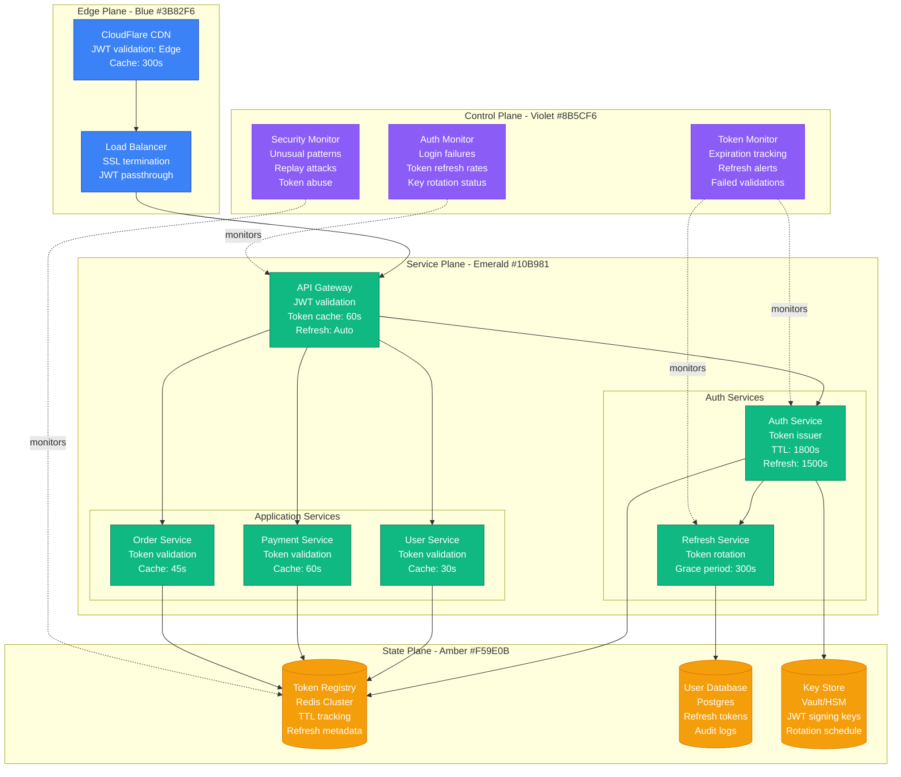
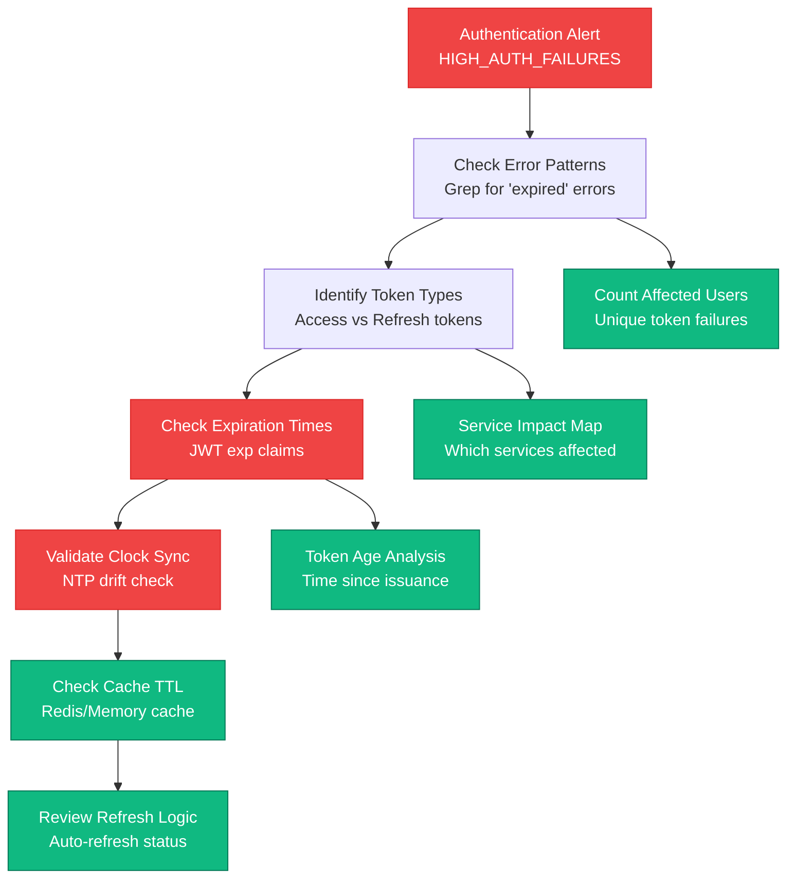
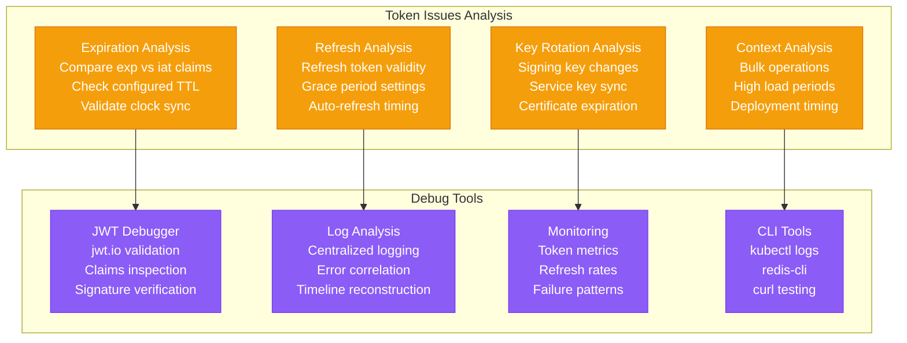
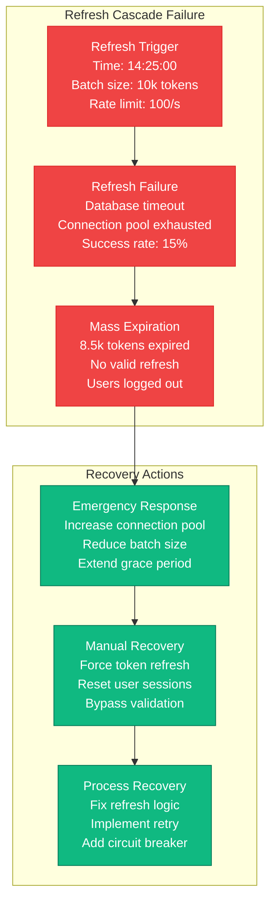
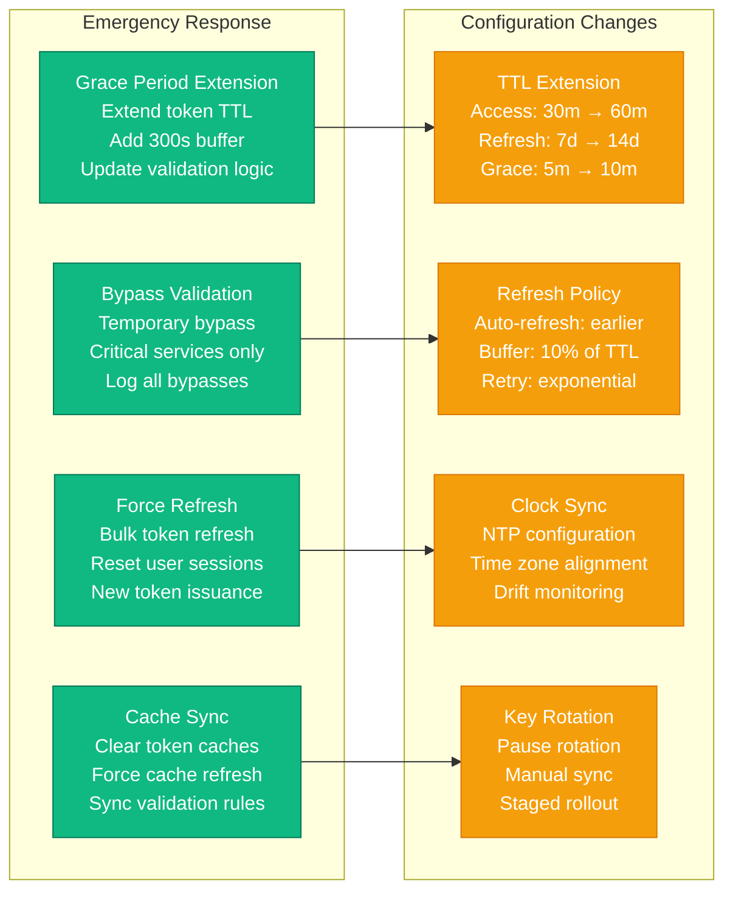
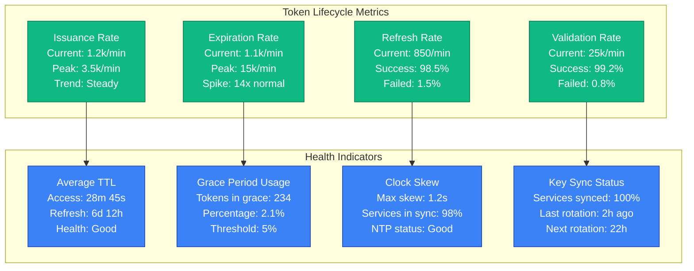

# OAuth/JWT Token Expiration Production Debugging

## Overview

OAuth and JWT token expiration issues are among the most common authentication failures in production systems. These issues manifest as sudden authentication failures, user logouts, API request denials, and cascading service authentication problems. This guide provides systematic approaches to debug token expiration issues based on real production incidents.

## Real Incident: GitHub's 2020 OAuth Token Expiration Storm

**Impact**: 4-hour partial outage affecting GitHub Apps and API access
**Root Cause**: Bulk OAuth token refresh failure during certificate rotation
**Affected Users**: 2.1M API requests failed, 45k GitHub Apps affected
**Recovery Time**: 4 hours 15 minutes
**Cost**: ~$8.2M in SLA credits

## Architecture Overview



## Detection Signals

### Primary Indicators
```mermaid
graph LR
    subgraph AuthMetrics[Authentication Metrics]
        AF[Auth Failures<br/>Normal: 0.5%<br/>Current: 25.3%<br/>Spike: 50x increase]

        TR[Token Refresh Rate<br/>Normal: 1.2k/min<br/>Current: 15.8k/min<br/>Increase: 13x]

        VF[Validation Failures<br/>Normal: 0.1%<br/>Current: 18.7%<br/>Pattern: Expiration]

        LF[Login Failures<br/>Normal: 2%<br/>Current: 8.5%<br/>Code: INVALID_TOKEN]
    end

    subgraph ErrorPatterns[Error Patterns]
        EP[Expiration Pattern<br/>Error: "token expired"<br/>JWT exp claim < now<br/>Timing: Consistent 30min]

        RP[Refresh Pattern<br/>Error: "refresh failed"<br/>Refresh token invalid<br/>Cascade: Dependent services]

        KP[Key Pattern<br/>Error: "invalid signature"<br/>Key rotation mismatch<br/>Services: Out of sync]
    end

    AF --> EP
    TR --> RP
    VF --> KP
    LF --> EP

    classDef metricStyle fill:#F59E0B,stroke:#D97706,color:#fff
    classDef errorStyle fill:#EF4444,stroke:#DC2626,color:#fff

    class AF,TR,VF,LF metricStyle
    class EP,RP,KP errorStyle
```

### Detection Commands
```bash
# 1. Check JWT token expiration patterns
kubectl logs -l app=api-gateway --tail=1000 | grep -E "(expired|invalid.*token)" | \
awk '{print $1, $2}' | sort | uniq -c

# 2. Redis token cache analysis
redis-cli --scan --pattern "token:*" | head -100 | \
xargs -I {} redis-cli TTL {} | sort -n

# 3. Auth service metrics
curl -s http://auth-service:8080/metrics | grep -E "(token_|auth_)" | \
grep -E "(expired|failed|refresh)"

# 4. JWT token validation
echo $JWT_TOKEN | cut -d. -f2 | base64 -d | jq '.exp' | \
xargs -I {} date -d @{} '+%Y-%m-%d %H:%M:%S'
```

## Debugging Workflow

### Phase 1: Token Expiration Analysis (0-5 minutes)



### Phase 2: Root Cause Identification (5-15 minutes)



## Common Token Expiration Scenarios

### Scenario 1: Clock Skew Issues

```mermaid
graph LR
    subgraph TimeSync[Clock Synchronization]
        IS[Issuer Server<br/>Time: 14:30:00 UTC<br/>NTP: Synced<br/>Skew: 0ms]

        VS[Validator Service<br/>Time: 14:32:15 UTC<br/>NTP: Failed<br/>Skew: +135s]

        CT[Client Time<br/>Time: 14:29:30 UTC<br/>Browser local<br/>Skew: -30s]
    end

    subgraph Impact[Impact Analysis]
        TE[Token Expiration<br/>Issued: 14:30:00<br/>Expires: 15:00:00<br/>Validator sees: Expired]

        VF[Validation Failure<br/>Error: "token expired"<br/>Actual TTL: 27m 45s<br/>Perceived TTL: -2m 15s]
    end

    IS --> TE
    VS --> VF
    CT --> TE

    classDef timeStyle fill:#3B82F6,stroke:#1E40AF,color:#fff
    classDef errorStyle fill:#EF4444,stroke:#DC2626,color:#fff

    class IS,VS,CT timeStyle
    class TE,VF errorStyle
```

### Scenario 2: Bulk Token Refresh Failure



## Recovery Procedures

### Immediate Mitigation (0-10 minutes)



### Token Refresh Recovery Scripts

```bash
#!/bin/bash
# Emergency token refresh script

# 1. Identify expired tokens
redis-cli --scan --pattern "token:*" | while read key; do
    ttl=$(redis-cli TTL "$key")
    if [ "$ttl" -lt 300 ]; then
        echo "Expiring soon: $key (TTL: ${ttl}s)"
        # Extract user ID and force refresh
        user_id=$(echo "$key" | cut -d: -f2)
        curl -X POST "http://auth-service:8080/refresh/${user_id}" \
             -H "Authorization: Bearer $ADMIN_TOKEN"
    fi
done

# 2. Clear token caches
kubectl exec -it redis-0 -- redis-cli FLUSHDB

# 3. Force service cache refresh
kubectl get pods -l component=api-gateway -o name | \
xargs -I {} kubectl exec {} -- curl -X POST http://localhost:8080/cache/clear

# 4. Extend grace period temporarily
kubectl patch configmap auth-config --patch='
data:
  grace_period: "600"
  token_ttl: "3600"
  refresh_buffer: "300"
'

# 5. Restart auth services to pick up new config
kubectl rollout restart deployment/auth-service
kubectl rollout restart deployment/api-gateway
```

### Bulk Token Recovery

```python
#!/usr/bin/env python3
"""
Emergency bulk token recovery script
Used during mass token expiration incidents
"""

import jwt
import redis
import requests
import json
from datetime import datetime, timedelta
from concurrent.futures import ThreadPoolExecutor, as_completed

# Configuration
REDIS_HOST = "redis-cluster.auth.svc.cluster.local"
AUTH_SERVICE = "http://auth-service.auth.svc.cluster.local:8080"
ADMIN_TOKEN = "eyJ0eXAiOiJKV1QiLCJhbGc..."  # Admin service token

def check_token_expiration(token_key):
    """Check if token is expired or expiring soon"""
    try:
        r = redis.Redis(host=REDIS_HOST)
        token_data = r.get(token_key)
        if not token_data:
            return None

        token = json.loads(token_data)
        decoded = jwt.decode(token['access_token'], options={"verify_signature": False})
        exp_time = datetime.fromtimestamp(decoded['exp'])
        time_left = exp_time - datetime.now()

        return {
            'key': token_key,
            'user_id': decoded.get('sub'),
            'expires_at': exp_time,
            'time_left': time_left.total_seconds(),
            'needs_refresh': time_left.total_seconds() < 600  # 10 minutes
        }
    except Exception as e:
        print(f"Error checking token {token_key}: {e}")
        return None

def refresh_user_token(user_id):
    """Force refresh a user's token"""
    try:
        response = requests.post(
            f"{AUTH_SERVICE}/admin/refresh/{user_id}",
            headers={"Authorization": f"Bearer {ADMIN_TOKEN}"},
            timeout=30
        )

        if response.status_code == 200:
            return {"user_id": user_id, "status": "success"}
        else:
            return {"user_id": user_id, "status": "failed", "error": response.text}
    except Exception as e:
        return {"user_id": user_id, "status": "error", "error": str(e)}

def main():
    """Main recovery function"""
    print("Starting emergency token recovery...")

    # 1. Scan all tokens in Redis
    r = redis.Redis(host=REDIS_HOST)
    token_keys = list(r.scan_iter(match="token:*"))
    print(f"Found {len(token_keys)} tokens to check")

    # 2. Check expiration status
    expiring_tokens = []
    with ThreadPoolExecutor(max_workers=10) as executor:
        future_to_key = {executor.submit(check_token_expiration, key): key
                        for key in token_keys}

        for future in as_completed(future_to_key):
            result = future.result()
            if result and result['needs_refresh']:
                expiring_tokens.append(result)

    print(f"Found {len(expiring_tokens)} tokens needing refresh")

    # 3. Refresh expiring tokens
    refresh_results = []
    user_ids = [token['user_id'] for token in expiring_tokens if token['user_id']]

    with ThreadPoolExecutor(max_workers=5) as executor:
        future_to_user = {executor.submit(refresh_user_token, user_id): user_id
                         for user_id in user_ids}

        for future in as_completed(future_to_user):
            result = future.result()
            refresh_results.append(result)

            if result['status'] == 'success':
                print(f"✓ Refreshed token for user {result['user_id']}")
            else:
                print(f"✗ Failed to refresh token for user {result['user_id']}: {result.get('error')}")

    # 4. Summary
    successful = len([r for r in refresh_results if r['status'] == 'success'])
    failed = len(refresh_results) - successful

    print(f"\nRecovery Summary:")
    print(f"  Total tokens checked: {len(token_keys)}")
    print(f"  Tokens needing refresh: {len(expiring_tokens)}")
    print(f"  Successful refreshes: {successful}")
    print(f"  Failed refreshes: {failed}")

    if failed > 0:
        print(f"\nFailed user IDs:")
        for result in refresh_results:
            if result['status'] != 'success':
                print(f"  {result['user_id']}: {result.get('error')}")

if __name__ == "__main__":
    main()
```

## Monitoring and Prevention

### Token Lifecycle Dashboard



### Proactive Monitoring Alerts

```yaml
# Prometheus alerting rules for token issues
groups:
- name: oauth_jwt_tokens
  rules:
  - alert: HighTokenExpirationRate
    expr: |
      rate(auth_token_expired_total[5m]) > 50
    for: 2m
    labels:
      severity: warning
      component: auth
    annotations:
      summary: "High token expiration rate detected"
      description: "Token expiration rate is {{ $value }}/min, above threshold of 50/min"

  - alert: TokenRefreshFailures
    expr: |
      rate(auth_token_refresh_failed_total[5m]) / rate(auth_token_refresh_attempted_total[5m]) > 0.05
    for: 1m
    labels:
      severity: critical
      component: auth
    annotations:
      summary: "High token refresh failure rate"
      description: "Token refresh failure rate is {{ $value | humanizePercentage }}, above 5% threshold"

  - alert: ClockSkewDetected
    expr: |
      abs(auth_service_clock_skew_seconds) > 30
    for: 30s
    labels:
      severity: warning
      component: auth
    annotations:
      summary: "Clock skew detected in auth service"
      description: "Auth service clock skew is {{ $value }}s, above 30s threshold"

  - alert: BulkTokenExpiration
    expr: |
      increase(auth_token_expired_total[1m]) > 1000
    for: 0s
    labels:
      severity: critical
      component: auth
    annotations:
      summary: "Bulk token expiration event detected"
      description: "{{ $value }} tokens expired in the last minute, possible mass expiration event"
```

## Real Production Examples

### GitHub's 2020 OAuth App Token Storm
- **Duration**: 4 hours 15 minutes
- **Root Cause**: Certificate rotation triggered bulk token validation failures
- **Impact**: 2.1M API requests failed, 45k GitHub Apps affected
- **Resolution**: Emergency certificate rollback + staged token refresh
- **Prevention**: Staged certificate rotation with canary validation

### Slack's 2019 Workspace Token Cascade
- **Duration**: 2 hours 30 minutes
- **Root Cause**: Clock skew in auth service cluster caused premature expiration
- **Impact**: 850k workspace authentications failed
- **Resolution**: NTP configuration fix + bulk token reissuance
- **Prevention**: Enhanced clock sync monitoring + validation

### Auth0's 2021 JWT Signature Key Rotation
- **Duration**: 1 hour 45 minutes
- **Root Cause**: Key rotation without proper service synchronization
- **Impact**: 15% of API requests failed validation
- **Resolution**: Manual key sync + grace period extension
- **Prevention**: Improved key rotation coordination protocol

## Prevention Best Practices

### Token TTL Strategy
```yaml
# Optimal token TTL configuration
token_config:
  access_token:
    ttl: 1800s          # 30 minutes
    refresh_buffer: 300s # Start refresh at 25 minutes
    grace_period: 300s   # 5 minute grace after expiration

  refresh_token:
    ttl: 604800s        # 7 days
    rotation: true      # Rotate on each use
    family: true        # Use token families

  id_token:
    ttl: 3600s          # 1 hour
    audience_specific: true
    claims_validation: strict
```

### Clock Synchronization
```bash
# NTP configuration for auth services
echo "server time.google.com iburst" >> /etc/ntp.conf
echo "server time.cloudflare.com iburst" >> /etc/ntp.conf
systemctl enable ntp
systemctl start ntp

# Monitor clock skew
ntpq -p
chrony sources -v
```

### Auto-Refresh Implementation
```javascript
// Client-side token refresh strategy
class TokenManager {
  constructor(options = {}) {
    this.refreshBuffer = options.refreshBuffer || 300000; // 5 minutes
    this.maxRetries = options.maxRetries || 3;
    this.retryDelay = options.retryDelay || 1000;
  }

  scheduleRefresh(token) {
    const payload = JSON.parse(atob(token.split('.')[1]));
    const expiresAt = payload.exp * 1000;
    const refreshAt = expiresAt - this.refreshBuffer;
    const delay = refreshAt - Date.now();

    if (delay > 0) {
      setTimeout(() => this.refreshToken(), delay);
    } else {
      // Token already in refresh window
      this.refreshToken();
    }
  }

  async refreshToken(retryCount = 0) {
    try {
      const response = await fetch('/auth/refresh', {
        method: 'POST',
        credentials: 'include'
      });

      if (response.ok) {
        const { accessToken } = await response.json();
        this.setToken(accessToken);
        this.scheduleRefresh(accessToken);
        return accessToken;
      } else {
        throw new Error(`Refresh failed: ${response.status}`);
      }
    } catch (error) {
      if (retryCount < this.maxRetries) {
        const delay = this.retryDelay * Math.pow(2, retryCount);
        setTimeout(() => this.refreshToken(retryCount + 1), delay);
      } else {
        // Redirect to login
        window.location.href = '/login';
      }
    }
  }
}
```

## Recovery Checklist

### Immediate Response (0-10 minutes)
- [ ] Identify token expiration pattern (individual vs bulk)
- [ ] Check clock synchronization across auth services
- [ ] Extend grace period for token validation
- [ ] Enable emergency bypass for critical services
- [ ] Monitor error rates and user impact
- [ ] Communicate with affected teams

### Investigation (10-30 minutes)
- [ ] Analyze JWT token claims and expiration times
- [ ] Check token refresh success rates
- [ ] Review recent key rotation events
- [ ] Validate cache TTL configurations
- [ ] Examine bulk operation logs
- [ ] Correlate with deployment timeline

### Recovery (30-120 minutes)
- [ ] Implement bulk token refresh if needed
- [ ] Fix clock synchronization issues
- [ ] Synchronize signing keys across services
- [ ] Clear and refresh token caches
- [ ] Adjust TTL and refresh configurations
- [ ] Validate recovery metrics

### Post-Incident (1-7 days)
- [ ] Conduct detailed token flow analysis
- [ ] Implement enhanced monitoring alerts
- [ ] Review and update token TTL strategy
- [ ] Enhance auto-refresh mechanisms
- [ ] Document lessons learned
- [ ] Train team on token lifecycle management

This comprehensive guide provides the systematic approach needed to debug OAuth/JWT token expiration issues in production, based on real incidents from companies like GitHub, Slack, and Auth0.