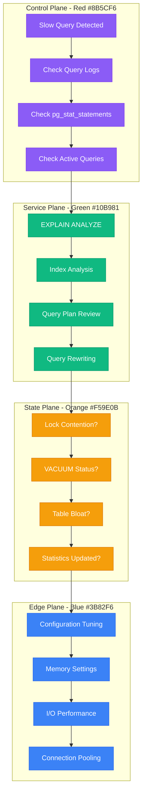

# PostgreSQL Slow Queries Debugging: Query Optimization and Performance Guide

## Executive Summary

PostgreSQL slow queries affect 40% of database performance issues and can cascade into application-wide problems. This guide provides systematic debugging approaches used by teams at Instagram, Discord, and other PostgreSQL-heavy organizations to identify and resolve query performance bottlenecks.

## Systematic Debugging Flowchart



## Initial Investigation Commands

### Query Identification and Analysis

```sql
-- Enable slow query logging (adjust log_min_duration_statement)
ALTER SYSTEM SET log_min_duration_statement = '1000ms';
SELECT pg_reload_conf();

-- Check currently running slow queries
SELECT
    pid,
    now() - pg_stat_activity.query_start AS duration,
    query,
    state,
    wait_event_type,
    wait_event
FROM pg_stat_activity
WHERE (now() - pg_stat_activity.query_start) > interval '5 minutes'
AND state = 'active'
ORDER BY duration DESC;

-- Top slow queries from pg_stat_statements
SELECT
    query,
    calls,
    total_exec_time,
    mean_exec_time,
    stddev_exec_time,
    rows,
    100.0 * shared_blks_hit / nullif(shared_blks_hit + shared_blks_read, 0) AS hit_percent
FROM pg_stat_statements
ORDER BY total_exec_time DESC
LIMIT 10;
```

### System Resource Analysis

```bash
# Check PostgreSQL process resource usage
ps aux | grep postgres | head -10

# Monitor I/O wait and CPU usage
iostat -x 1 5

# Check memory usage
free -h
cat /proc/meminfo | grep -E "(MemTotal|MemFree|Buffers|Cached)"

# PostgreSQL specific memory usage
sudo pmap $(pgrep -f "postgres.*writer") | tail -1
```

## Query Performance Investigation

### EXPLAIN ANALYZE Deep Dive

```sql
-- Basic EXPLAIN ANALYZE
EXPLAIN (ANALYZE, BUFFERS, VERBOSE)
SELECT u.username, p.title, p.created_at
FROM users u
JOIN posts p ON u.id = p.user_id
WHERE u.created_at > '2023-01-01'
AND p.status = 'published'
ORDER BY p.created_at DESC
LIMIT 50;

-- Advanced analysis with timing
EXPLAIN (ANALYZE, BUFFERS, TIMING, FORMAT JSON)
SELECT COUNT(*)
FROM large_table
WHERE indexed_column = 'some_value'
AND non_indexed_column LIKE '%pattern%';

-- Check for expensive operations
-- Look for:
-- 1. Seq Scan on large tables
-- 2. Sort operations without indexes
-- 3. Nested Loop with high cost
-- 4. Hash joins on large datasets
```

### Index Analysis and Optimization

```sql
-- Identify missing indexes
SELECT
    schemaname,
    tablename,
    attname,
    n_distinct,
    correlation
FROM pg_stats
WHERE tablename = 'your_large_table'
ORDER BY n_distinct DESC;

-- Check index usage statistics
SELECT
    schemaname,
    tablename,
    indexname,
    idx_scan,
    idx_tup_read,
    idx_tup_fetch
FROM pg_stat_user_indexes
ORDER BY idx_scan ASC;

-- Find unused indexes
SELECT
    schemaname,
    tablename,
    indexname,
    idx_scan,
    pg_size_pretty(pg_relation_size(indexrelid)) as size
FROM pg_stat_user_indexes
WHERE idx_scan = 0
AND schemaname = 'public';

-- Identify duplicate indexes
SELECT
    a.tablename,
    a.indexname as index1,
    b.indexname as index2,
    a.indexdef,
    b.indexdef
FROM pg_indexes a
JOIN pg_indexes b ON a.tablename = b.tablename
WHERE a.indexname < b.indexname
AND a.indexdef = b.indexdef;
```

## Root Cause Analysis Techniques

### Lock Contention Investigation

```sql
-- Check for lock contention
SELECT
    blocked_locks.pid AS blocked_pid,
    blocked_activity.usename AS blocked_user,
    blocking_locks.pid AS blocking_pid,
    blocking_activity.usename AS blocking_user,
    blocked_activity.query AS blocked_statement,
    blocking_activity.query AS current_statement_in_blocking_process,
    blocked_activity.application_name AS blocked_application,
    blocking_activity.application_name AS blocking_application
FROM pg_catalog.pg_locks blocked_locks
JOIN pg_catalog.pg_stat_activity blocked_activity ON blocked_activity.pid = blocked_locks.pid
JOIN pg_catalog.pg_locks blocking_locks
    ON blocking_locks.locktype = blocked_locks.locktype
    AND blocking_locks.database IS NOT DISTINCT FROM blocked_locks.database
    AND blocking_locks.relation IS NOT DISTINCT FROM blocked_locks.relation
    AND blocking_locks.page IS NOT DISTINCT FROM blocked_locks.page
    AND blocking_locks.tuple IS NOT DISTINCT FROM blocked_locks.tuple
    AND blocking_locks.virtualxid IS NOT DISTINCT FROM blocked_locks.virtualxid
    AND blocking_locks.transactionid IS NOT DISTINCT FROM blocked_locks.transactionid
    AND blocking_locks.classid IS NOT DISTINCT FROM blocked_locks.classid
    AND blocking_locks.objid IS NOT DISTINCT FROM blocked_locks.objid
    AND blocking_locks.objsubid IS NOT DISTINCT FROM blocked_locks.objsubid
    AND blocking_locks.pid != blocked_locks.pid
JOIN pg_catalog.pg_stat_activity blocking_activity ON blocking_activity.pid = blocking_locks.pid
WHERE NOT blocked_locks.granted;
```

### Table Bloat and VACUUM Analysis

```sql
-- Check table bloat
SELECT
    schemaname,
    tablename,
    pg_size_pretty(pg_total_relation_size(schemaname||'.'||tablename)) as size,
    pg_size_pretty(pg_relation_size(schemaname||'.'||tablename)) as table_size,
    round(
        100 * (pg_relation_size(schemaname||'.'||tablename) /
               pg_total_relation_size(schemaname||'.'||tablename)::numeric), 2
    ) as table_ratio
FROM pg_tables
WHERE schemaname = 'public'
ORDER BY pg_total_relation_size(schemaname||'.'||tablename) DESC;

-- Check VACUUM and ANALYZE statistics
SELECT
    schemaname,
    tablename,
    last_vacuum,
    last_autovacuum,
    last_analyze,
    last_autoanalyze,
    vacuum_count,
    autovacuum_count,
    analyze_count,
    autoanalyze_count
FROM pg_stat_user_tables
ORDER BY last_autovacuum ASC NULLS FIRST;

-- Check for tables needing VACUUM
SELECT
    schemaname,
    tablename,
    n_dead_tup,
    n_live_tup,
    round(100.0 * n_dead_tup / (n_live_tup + n_dead_tup), 2) AS dead_ratio
FROM pg_stat_user_tables
WHERE n_live_tup > 0
ORDER BY dead_ratio DESC;
```

## Advanced Debugging Techniques

### Query Plan Analysis

```sql
-- Save query plans for comparison
EXPLAIN (ANALYZE, BUFFERS, FORMAT JSON)
SELECT /* QUERY_ID: slow_user_posts */
    u.username,
    COUNT(p.id) as post_count,
    MAX(p.created_at) as latest_post
FROM users u
LEFT JOIN posts p ON u.id = p.user_id
WHERE u.active = true
GROUP BY u.id, u.username
HAVING COUNT(p.id) > 10
ORDER BY post_count DESC;

-- Compare execution plans over time
-- Save results and use tools like pgbadger or custom scripts
```

### Connection and Resource Monitoring

```sql
-- Monitor connection usage
SELECT
    state,
    COUNT(*) as connections,
    MAX(now() - query_start) as longest_query,
    MAX(now() - state_change) as longest_idle
FROM pg_stat_activity
WHERE pid != pg_backend_pid()
GROUP BY state;

-- Check configuration parameters
SELECT
    name,
    setting,
    unit,
    context,
    short_desc
FROM pg_settings
WHERE name IN (
    'shared_buffers',
    'effective_cache_size',
    'work_mem',
    'maintenance_work_mem',
    'max_connections',
    'checkpoint_segments',
    'wal_buffers'
);

-- Monitor cache hit ratio
SELECT
    'buffer_cache' as cache_type,
    round(
        100.0 * sum(blks_hit) / (sum(blks_hit) + sum(blks_read)), 2
    ) as hit_ratio
FROM pg_stat_database
UNION ALL
SELECT
    'index_cache' as cache_type,
    round(
        100.0 * sum(idx_blks_hit) / (sum(idx_blks_hit) + sum(idx_blks_read)), 2
    ) as hit_ratio
FROM pg_statio_user_indexes;
```

## Fix Implementation Strategies

### Index Optimization

```sql
-- Create composite indexes for common query patterns
-- Before: Separate indexes
CREATE INDEX idx_posts_user_id ON posts(user_id);
CREATE INDEX idx_posts_status ON posts(status);
CREATE INDEX idx_posts_created_at ON posts(created_at);

-- After: Composite index for common WHERE clause
CREATE INDEX idx_posts_user_status_created ON posts(user_id, status, created_at)
WHERE status IN ('published', 'featured');

-- Partial indexes for filtered queries
CREATE INDEX idx_active_users_email ON users(email)
WHERE active = true AND deleted_at IS NULL;

-- Expression indexes for computed values
CREATE INDEX idx_users_lower_email ON users(lower(email));

-- Covering indexes to avoid table lookups
CREATE INDEX idx_posts_covering ON posts(user_id, status)
INCLUDE (title, created_at, view_count);
```

### Query Rewriting for Performance

```sql
-- Before: Inefficient EXISTS subquery
SELECT u.username
FROM users u
WHERE EXISTS (
    SELECT 1 FROM posts p
    WHERE p.user_id = u.id
    AND p.status = 'published'
    AND p.created_at > '2023-01-01'
);

-- After: JOIN with DISTINCT
SELECT DISTINCT u.username
FROM users u
JOIN posts p ON u.id = p.user_id
WHERE p.status = 'published'
AND p.created_at > '2023-01-01';

-- Before: Inefficient COUNT in subquery
SELECT u.username,
    (SELECT COUNT(*) FROM posts p WHERE p.user_id = u.id) as post_count
FROM users u
WHERE u.active = true;

-- After: LEFT JOIN with GROUP BY
SELECT u.username, COUNT(p.id) as post_count
FROM users u
LEFT JOIN posts p ON u.id = p.user_id
WHERE u.active = true
GROUP BY u.id, u.username;

-- Before: OR conditions that prevent index usage
SELECT * FROM posts
WHERE title LIKE '%search%' OR content LIKE '%search%';

-- After: UNION of separate indexed queries
SELECT * FROM posts WHERE title LIKE '%search%'
UNION
SELECT * FROM posts WHERE content LIKE '%search%';
```

### Configuration Tuning

```sql
-- Memory configuration for better performance
ALTER SYSTEM SET shared_buffers = '256MB';           -- 25% of RAM
ALTER SYSTEM SET effective_cache_size = '1GB';       -- 75% of RAM
ALTER SYSTEM SET work_mem = '4MB';                   -- Per operation
ALTER SYSTEM SET maintenance_work_mem = '64MB';      -- For VACUUM, CREATE INDEX

-- Query planner configuration
ALTER SYSTEM SET random_page_cost = '1.1';          -- For SSD storage
ALTER SYSTEM SET effective_io_concurrency = '200';   -- For SSD

-- Checkpoint and WAL configuration
ALTER SYSTEM SET checkpoint_completion_target = '0.9';
ALTER SYSTEM SET wal_buffers = '16MB';
ALTER SYSTEM SET checkpoint_timeout = '10min';

-- Apply changes
SELECT pg_reload_conf();
```

## Prevention and Monitoring

### Automated Query Monitoring

```sql
-- Create monitoring view for slow queries
CREATE OR REPLACE VIEW slow_queries AS
SELECT
    query,
    calls,
    total_exec_time,
    mean_exec_time,
    stddev_exec_time,
    min_exec_time,
    max_exec_time,
    rows,
    100.0 * shared_blks_hit / nullif(shared_blks_hit + shared_blks_read, 0) AS hit_percent
FROM pg_stat_statements
WHERE mean_exec_time > 1000  -- Queries slower than 1 second
ORDER BY total_exec_time DESC;

-- Alert function for slow queries
CREATE OR REPLACE FUNCTION check_slow_queries()
RETURNS TABLE(alert_message text) AS $$
BEGIN
    RETURN QUERY
    SELECT 'Slow query detected: ' || left(query, 100) || '... (avg: ' ||
           round(mean_exec_time::numeric, 2) || 'ms)'
    FROM slow_queries
    WHERE mean_exec_time > 5000  -- Alert for queries > 5 seconds
    LIMIT 5;
END;
$$ LANGUAGE plpgsql;
```

### Maintenance Automation

```bash
#!/bin/bash
# postgresql-maintenance.sh

DB_NAME="your_database"
LOG_FILE="/var/log/postgresql/maintenance.log"

echo "$(date): Starting PostgreSQL maintenance" >> $LOG_FILE

# Update table statistics
echo "Updating statistics..." >> $LOG_FILE
psql -d $DB_NAME -c "
SELECT 'ANALYZE ' || schemaname || '.' || tablename || ';'
FROM pg_tables
WHERE schemaname = 'public'
AND (last_analyze IS NULL OR last_analyze < NOW() - INTERVAL '1 day')
" -t | psql -d $DB_NAME

# Check for tables needing VACUUM
echo "Checking for bloated tables..." >> $LOG_FILE
psql -d $DB_NAME -c "
SELECT tablename, n_dead_tup, n_live_tup,
       round(100.0 * n_dead_tup / (n_live_tup + n_dead_tup), 2) AS dead_ratio
FROM pg_stat_user_tables
WHERE n_dead_tup > 1000
AND n_live_tup > 0
AND round(100.0 * n_dead_tup / (n_live_tup + n_dead_tup), 2) > 20
ORDER BY dead_ratio DESC;
"

# Reset pg_stat_statements if it's getting full
STATEMENTS_COUNT=$(psql -d $DB_NAME -t -c "SELECT count(*) FROM pg_stat_statements;")
if [ "$STATEMENTS_COUNT" -gt 4500 ]; then
    echo "Resetting pg_stat_statements (count: $STATEMENTS_COUNT)" >> $LOG_FILE
    psql -d $DB_NAME -c "SELECT pg_stat_statements_reset();"
fi

echo "$(date): Maintenance completed" >> $LOG_FILE
```

## Real Production Incident Examples

### Case Study 1: Instagram Photo Query Performance (2022)

**Problem:** Photo feed queries taking 5+ seconds during peak hours
**Symptoms:**
- Sequential scans on 100M+ row table
- High I/O wait times
- Connection pool exhaustion

**Investigation Process:**
```sql
-- Identified the problematic query
SELECT photo_id, user_id, created_at, likes_count
FROM photos
WHERE user_id IN (SELECT following_id FROM follows WHERE follower_id = ?)
ORDER BY created_at DESC
LIMIT 50;

-- EXPLAIN showed sequential scan on photos table
EXPLAIN (ANALYZE, BUFFERS) [above query];
```

**Root Cause:** Missing composite index and inefficient subquery
**Fix:** Created composite index and rewrote query with JOIN
**Prevention:** Implemented query performance monitoring

### Case Study 2: Discord Message History Slowdown (2023)

**Problem:** Message history queries timing out during high traffic
**Symptoms:**
- Lock contention on message table
- VACUUM processes taking too long
- Autovacuum not keeping up with changes

**Investigation:**
```sql
-- Checked bloat ratio
SELECT schemaname, tablename, n_dead_tup, n_live_tup,
       round(100.0 * n_dead_tup / (n_live_tup + n_dead_tup), 2) AS dead_ratio
FROM pg_stat_user_tables
WHERE tablename = 'messages';

-- Found 40% dead tuple ratio
```

**Solution:**
- Implemented partitioning by date
- Tuned autovacuum settings
- Added connection pooling

## Critical Monitoring Metrics

### Key Performance Indicators

```sql
-- Database health dashboard query
WITH cache_hit AS (
    SELECT round(
        100.0 * sum(blks_hit) / (sum(blks_hit) + sum(blks_read)), 2
    ) as ratio
    FROM pg_stat_database
),
slow_queries AS (
    SELECT count(*) as count
    FROM pg_stat_statements
    WHERE mean_exec_time > 1000
),
active_connections AS (
    SELECT count(*) as count
    FROM pg_stat_activity
    WHERE state = 'active'
),
table_bloat AS (
    SELECT count(*) as bloated_tables
    FROM pg_stat_user_tables
    WHERE n_dead_tup > 1000
    AND round(100.0 * n_dead_tup / (n_live_tup + n_dead_tup), 2) > 20
)
SELECT
    'Cache Hit Ratio: ' || c.ratio || '%' as metric
FROM cache_hit c
UNION ALL
SELECT 'Slow Queries: ' || s.count FROM slow_queries s
UNION ALL
SELECT 'Active Connections: ' || a.count FROM active_connections a
UNION ALL
SELECT 'Bloated Tables: ' || b.bloated_tables FROM table_bloat b;
```

### Alerting Thresholds
- **Query Duration**: P95 > 2 seconds
- **Cache Hit Ratio**: < 95%
- **Connection Usage**: > 80% of max_connections
- **Lock Wait Time**: > 10 seconds
- **Dead Tuple Ratio**: > 25%

This debugging guide provides systematic approaches to identifying and resolving PostgreSQL slow query issues, based on real-world experience from high-scale database operations.