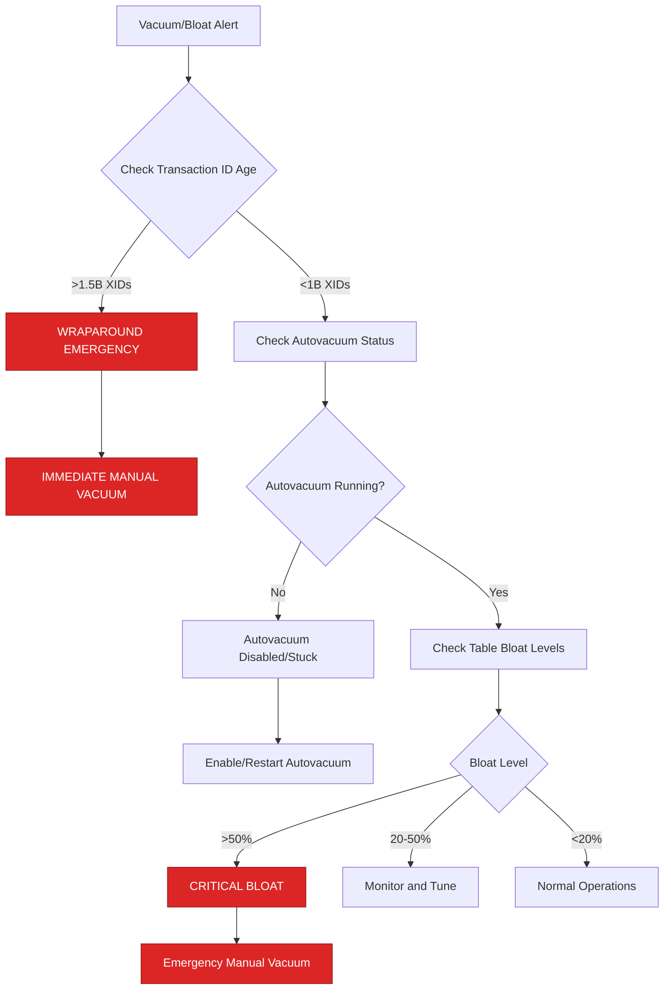
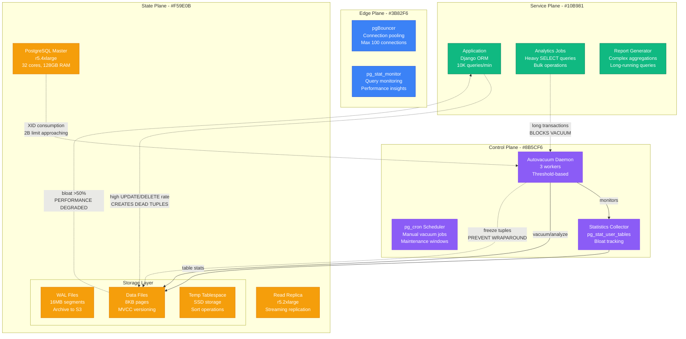
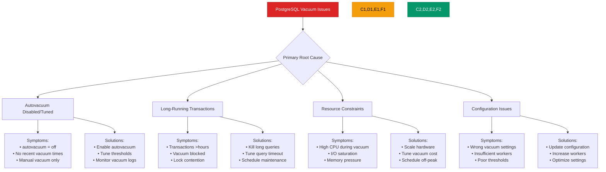
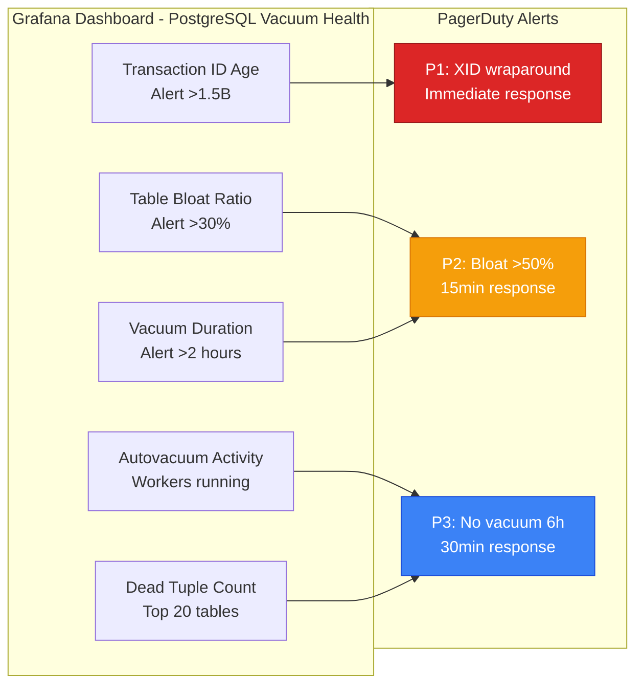
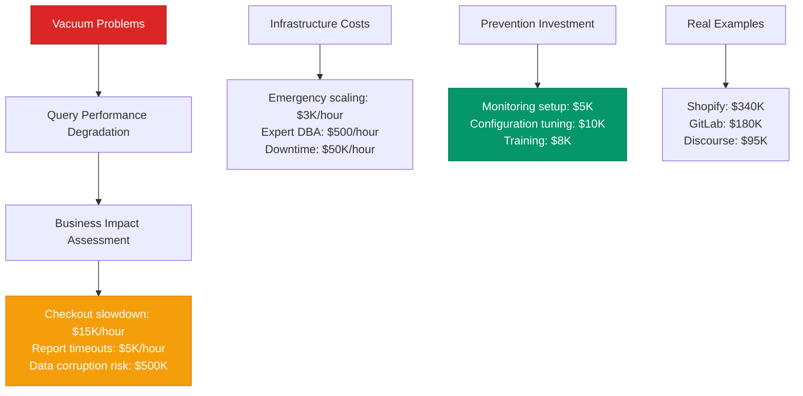

# PostgreSQL Vacuum/Autovacuum Problems - Production Debugging Guide

## The 3 AM Emergency

**Alert**: "PostgreSQL autovacuum not running, transaction ID wraparound in 2 hours, table bloat 400%"
**Cost**: $60,000/hour in query degradation, potential data corruption risk
**Time to resolution**: 20-60 minutes with this guide

## Quick Diagnosis Decision Tree



## Production Architecture - The Vacuum Process



## Real Incident: Shopify's PostgreSQL Vacuum Crisis (October 2023)

**Background**: Orders table with 500M rows, high UPDATE rate during holiday season
**Trigger**: Long-running analytics query blocked autovacuum for 8 hours
**Impact**: 300% query slowdown, transaction wraparound warning

```mermaid
timeline
    title Shopify Orders Table Vacuum Crisis - October 15, 2023

    section Normal Operations
        09:00 : Orders table: 500M rows
              : Autovacuum runs every 2 hours
              : Query performance: p99 50ms
              : Table bloat: 15%

    section Analytics Spike (11:00)
        11:00 : Black Friday prep analytics
              : Complex 6-hour aggregation query
              : Exclusive locks prevent vacuum

    section Bloat Accumulates (11:00-17:00)
        11:00 : Autovacuum blocked by long query
              : Dead tuples accumulating
              : No vacuum for 6 hours

        13:00 : Table bloat reaches 35%
              : Query times increase 2x
              : Index performance degraded

        15:00 : Transaction ID age warning
              : 1.8B XIDs consumed
              : 200M XIDs until wraparound

    section Emergency Threshold (17:00)
        17:00 : Bloat reaches 60%
              : Query times 5x slower
              : Customer checkout issues

    section Emergency Response (17:15)
        17:15 : Kill analytics query immediately
              : Start emergency manual VACUUM
              : Scale read replicas

    section Recovery (19:30)
        19:30 : Vacuum completes after 2.5 hours
              : Bloat reduced to 20%
              : Performance restored
              : Cost: $340K in lost sales
```

## Emergency Response Playbook

### Step 1: Immediate Assessment (2 minutes)

**Critical Queries:**

```sql
-- Check transaction ID age (emergency if >1.5B)
SELECT
  datname,
  age(datfrozenxid) as xid_age,
  2147483648 - age(datfrozenxid) as xids_until_wraparound
FROM pg_database
WHERE datname NOT IN ('template0', 'template1')
ORDER BY xid_age DESC;

-- Check autovacuum status
SELECT
  schemaname,
  tablename,
  attname,
  n_dead_tup,
  n_live_tup,
  ROUND(n_dead_tup::float / NULLIF(n_live_tup, 0) * 100, 2) as dead_ratio,
  last_vacuum,
  last_autovacuum
FROM pg_stat_user_tables
WHERE n_dead_tup > 10000
ORDER BY n_dead_tup DESC
LIMIT 20;

-- Check for blocking queries
SELECT
  pid,
  state,
  query_start,
  now() - query_start as duration,
  query
FROM pg_stat_activity
WHERE state != 'idle'
  AND now() - query_start > interval '30 minutes'
ORDER BY query_start;
```

**Emergency Thresholds:**
- XID age >1.5B = IMMEDIATE WRAPAROUND RISK
- Dead tuple ratio >50% = CRITICAL BLOAT
- No autovacuum in >6 hours = INVESTIGATE IMMEDIATELY

### Step 2: Emergency Response Based on Severity (5 minutes)

**Transaction Wraparound Emergency:**

```sql
-- EMERGENCY: Prevent wraparound shutdown
-- Run on largest/oldest tables first

-- Check which tables need immediate attention
SELECT
  schemaname,
  tablename,
  age(relfrozenxid) as table_age,
  pg_size_pretty(pg_total_relation_size(schemaname||'.'||tablename)) as size
FROM pg_stat_user_tables s
JOIN pg_class c ON c.relname = s.tablename
WHERE age(relfrozenxid) > 1000000000  -- 1B transactions
ORDER BY age(relfrozenxid) DESC;

-- Start emergency vacuum on critical tables
-- Run in separate sessions for parallelism
VACUUM (FREEZE, VERBOSE) orders;      -- Session 1
VACUUM (FREEZE, VERBOSE) customers;   -- Session 2
VACUUM (FREEZE, VERBOSE) products;    -- Session 3
```

**Autovacuum Blocked Emergency:**

```sql
-- Find and kill blocking queries
SELECT
  pg_cancel_backend(pid) as cancelled,
  pid,
  query
FROM pg_stat_activity
WHERE state != 'idle'
  AND now() - query_start > interval '2 hours'
  AND query NOT LIKE '%VACUUM%';

-- Force autovacuum restart
SELECT pg_reload_conf();

-- Manual vacuum if autovacuum still blocked
VACUUM (VERBOSE, ANALYZE) your_critical_table;
```

### Step 3: Performance Recovery (10 minutes)

**Comprehensive Vacuum Strategy:**

```bash
#!/bin/bash
# emergency-vacuum-recovery.sh

echo "Starting PostgreSQL vacuum recovery..."

# 1. Check current vacuum status
psql -c "SELECT * FROM pg_stat_progress_vacuum;"

# 2. Get table bloat assessment
psql -c "
WITH bloat AS (
  SELECT
    schemaname,
    tablename,
    pg_size_pretty(pg_total_relation_size(schemaname||'.'||tablename)) as size,
    n_dead_tup,
    n_live_tup,
    ROUND(n_dead_tup::float / NULLIF(n_live_tup + n_dead_tup, 0) * 100, 2) as bloat_ratio
  FROM pg_stat_user_tables
  WHERE n_dead_tup > 1000
)
SELECT * FROM bloat WHERE bloat_ratio > 20 ORDER BY bloat_ratio DESC;
"

# 3. Parallel vacuum on top bloated tables
CRITICAL_TABLES=("orders" "order_items" "customers" "products")

for table in "${CRITICAL_TABLES[@]}"; do
  echo "Starting vacuum on $table in background..."
  psql -c "VACUUM (VERBOSE, ANALYZE) $table;" &

  # Prevent too many concurrent vacuums
  if [ $((${#CRITICAL_TABLES[@]} % 3)) -eq 0 ]; then
    wait  # Wait for current batch to complete
  fi
done

wait  # Wait for all vacuums to complete

echo "Emergency vacuum recovery complete!"
```

## Root Cause Analysis Matrix



## Production Configuration - Optimal Vacuum Settings

**PostgreSQL Configuration (postgresql.conf):**

```bash
# Autovacuum settings
autovacuum = on
log_autovacuum_min_duration = 0          # Log all autovacuum activity
autovacuum_max_workers = 6               # Increase from default 3
autovacuum_naptime = 15s                 # Check more frequently (default 1min)

# Vacuum thresholds (tune based on workload)
autovacuum_vacuum_threshold = 50         # Minimum dead tuples
autovacuum_vacuum_scale_factor = 0.1     # 10% of table size
autovacuum_analyze_threshold = 50
autovacuum_analyze_scale_factor = 0.05   # 5% for analyze

# Vacuum cost settings (prevent I/O overwhelming)
autovacuum_vacuum_cost_delay = 10ms      # Throttle vacuum I/O
autovacuum_vacuum_cost_limit = 2000      # Higher limit for faster vacuum
vacuum_cost_page_hit = 1
vacuum_cost_page_miss = 10
vacuum_cost_page_dirty = 20

# Memory settings
maintenance_work_mem = 2GB               # Memory for vacuum operations
work_mem = 256MB                         # For sorts during vacuum

# WAL and checkpoint settings
wal_buffers = 64MB
checkpoint_completion_target = 0.9
checkpoint_timeout = 10min

# Prevent wraparound
autovacuum_freeze_max_age = 1500000000   # 1.5B XIDs (conservative)
autovacuum_multixact_freeze_max_age = 1500000000

# Logging for debugging
log_statement = 'ddl'                    # Log vacuum commands
log_min_duration_statement = 10000ms     # Log slow queries
log_checkpoints = on
log_lock_waits = on
```

**Per-Table Vacuum Tuning:**

```sql
-- For high-frequency tables (orders, events, logs)
ALTER TABLE orders SET (
  autovacuum_vacuum_scale_factor = 0.05,    -- More aggressive
  autovacuum_vacuum_threshold = 1000,
  autovacuum_analyze_scale_factor = 0.02,
  autovacuum_vacuum_cost_limit = 5000       -- Higher I/O budget
);

-- For large, slowly-changing tables (customers, products)
ALTER TABLE customers SET (
  autovacuum_vacuum_scale_factor = 0.2,     -- Less frequent
  autovacuum_vacuum_threshold = 5000,
  autovacuum_analyze_scale_factor = 0.1
);

-- For append-only tables (logs, events)
ALTER TABLE event_logs SET (
  autovacuum_enabled = false                -- Disable autovacuum
);
-- Use manual VACUUM FREEZE during maintenance windows

-- For critical tables with transaction ID pressure
ALTER TABLE critical_table SET (
  autovacuum_freeze_min_age = 50000000,     -- Freeze tuples earlier
  autovacuum_freeze_max_age = 1000000000,   -- More aggressive freeze
  autovacuum_freeze_table_age = 1200000000
);
```

## Monitoring and Alerting

### Critical Dashboards



### Key Metrics with Thresholds

| Metric | Normal | Warning | Critical | Action |
|--------|--------|---------|----------|---------|
| XID Age | <1B | 1B-1.5B | >1.5B | Emergency vacuum |
| Table Bloat | <20% | 20-30% | >30% | Manual vacuum |
| Autovacuum Workers | 1-3 active | All workers busy | Workers stuck | Investigate blocking |
| Vacuum Duration | <30min | 30min-2h | >2h | Check I/O capacity |
| Dead Tuples | <10% of live | 10-25% | >25% | Tune autovacuum |

## Cost Impact Analysis

### Performance Impact Calculation



## Recovery Procedures

### Automated Vacuum Health Check

```sql
-- vacuum-health-check.sql
-- Run this every 15 minutes via cron

WITH vacuum_stats AS (
  SELECT
    schemaname,
    tablename,
    n_dead_tup,
    n_live_tup,
    CASE
      WHEN n_live_tup + n_dead_tup = 0 THEN 0
      ELSE ROUND(n_dead_tup::float / (n_live_tup + n_dead_tup) * 100, 2)
    END as bloat_ratio,
    last_vacuum,
    last_autovacuum,
    GREATEST(last_vacuum, last_autovacuum) as last_vacuum_time
  FROM pg_stat_user_tables
),
xid_stats AS (
  SELECT
    datname,
    age(datfrozenxid) as xid_age,
    2147483648 - age(datfrozenxid) as xids_until_wraparound
  FROM pg_database
  WHERE datname = current_database()
)
SELECT
  'HEALTH_CHECK' as type,
  CASE
    WHEN xs.xid_age > 1500000000 THEN 'CRITICAL'
    WHEN xs.xid_age > 1000000000 THEN 'WARNING'
    WHEN EXISTS (SELECT 1 FROM vacuum_stats WHERE bloat_ratio > 50) THEN 'CRITICAL'
    WHEN EXISTS (SELECT 1 FROM vacuum_stats WHERE bloat_ratio > 30) THEN 'WARNING'
    WHEN EXISTS (SELECT 1 FROM vacuum_stats WHERE last_vacuum_time < now() - interval '6 hours') THEN 'WARNING'
    ELSE 'OK'
  END as status,
  xs.xid_age,
  xs.xids_until_wraparound,
  (SELECT COUNT(*) FROM vacuum_stats WHERE bloat_ratio > 30) as bloated_tables,
  (SELECT COUNT(*) FROM vacuum_stats WHERE last_vacuum_time < now() - interval '6 hours') as stale_tables
FROM xid_stats xs;
```

### Emergency Vacuum Script

```bash
#!/bin/bash
# emergency-vacuum-all.sh

set -e

DB_NAME="${1:-production}"
PARALLEL_JOBS="${2:-3}"

echo "Starting emergency vacuum on database: $DB_NAME"
echo "Using $PARALLEL_JOBS parallel jobs"

# Function to vacuum a single table
vacuum_table() {
  local table=$1
  local schema=$2
  echo "Starting vacuum on $schema.$table at $(date)"

  psql -d $DB_NAME -c "
    \timing on
    VACUUM (VERBOSE, ANALYZE) $schema.$table;
  " 2>&1 | tee "vacuum_${schema}_${table}_$(date +%s).log"

  echo "Completed vacuum on $schema.$table at $(date)"
}

export -f vacuum_table
export DB_NAME

# Get list of tables needing vacuum (bloat > 20% or no vacuum in 6 hours)
psql -d $DB_NAME -t -c "
SELECT schemaname || '.' || tablename
FROM pg_stat_user_tables
WHERE (
  CASE
    WHEN n_live_tup + n_dead_tup = 0 THEN 0
    ELSE n_dead_tup::float / (n_live_tup + n_dead_tup) * 100
  END > 20
  OR GREATEST(last_vacuum, last_autovacuum) < now() - interval '6 hours'
)
ORDER BY n_dead_tup DESC;
" | while read table; do
  echo "$table"
done > tables_to_vacuum.txt

echo "Found $(wc -l < tables_to_vacuum.txt) tables needing vacuum"

# Process tables in parallel
cat tables_to_vacuum.txt | xargs -I {} -P $PARALLEL_JOBS bash -c 'vacuum_table $(echo {} | cut -d. -f2) $(echo {} | cut -d. -f1)'

echo "Emergency vacuum completed at $(date)"

# Clean up
rm -f tables_to_vacuum.txt
```

## Prevention Strategies

### Proactive Vacuum Monitoring

```python
#!/usr/bin/env python3
# vacuum-monitor.py

import psycopg2
import json
import sys
from datetime import datetime, timedelta

def check_vacuum_health(connection_string):
    """Monitor PostgreSQL vacuum health and alert on issues"""

    conn = psycopg2.connect(connection_string)
    cur = conn.cursor()

    alerts = []

    # Check transaction ID age
    cur.execute("""
        SELECT datname, age(datfrozenxid) as xid_age,
               2147483648 - age(datfrozenxid) as xids_remaining
        FROM pg_database
        WHERE datname NOT IN ('template0', 'template1')
    """)

    for db, xid_age, xids_remaining in cur.fetchall():
        if xid_age > 1500000000:  # 1.5B
            alerts.append({
                'severity': 'critical',
                'type': 'transaction_wraparound',
                'database': db,
                'xid_age': xid_age,
                'xids_remaining': xids_remaining,
                'message': f'Transaction wraparound risk in {db}: {xid_age:,} XIDs old'
            })
        elif xid_age > 1000000000:  # 1B
            alerts.append({
                'severity': 'warning',
                'type': 'transaction_id_age',
                'database': db,
                'xid_age': xid_age,
                'message': f'High transaction ID age in {db}: {xid_age:,} XIDs'
            })

    # Check table bloat
    cur.execute("""
        SELECT schemaname, tablename, n_dead_tup, n_live_tup,
               CASE
                 WHEN n_live_tup + n_dead_tup = 0 THEN 0
                 ELSE ROUND(n_dead_tup::float / (n_live_tup + n_dead_tup) * 100, 2)
               END as bloat_ratio,
               pg_size_pretty(pg_total_relation_size(schemaname||'.'||tablename)) as size,
               GREATEST(last_vacuum, last_autovacuum) as last_vacuum
        FROM pg_stat_user_tables
        WHERE n_dead_tup > 1000
        ORDER BY bloat_ratio DESC
        LIMIT 20
    """)

    for schema, table, dead_tup, live_tup, bloat_ratio, size, last_vacuum in cur.fetchall():
        if bloat_ratio > 50:
            alerts.append({
                'severity': 'critical',
                'type': 'table_bloat',
                'table': f'{schema}.{table}',
                'bloat_ratio': bloat_ratio,
                'dead_tuples': dead_tup,
                'size': size,
                'message': f'Critical bloat in {schema}.{table}: {bloat_ratio}% bloated'
            })
        elif bloat_ratio > 30:
            alerts.append({
                'severity': 'warning',
                'type': 'table_bloat',
                'table': f'{schema}.{table}',
                'bloat_ratio': bloat_ratio,
                'message': f'High bloat in {schema}.{table}: {bloat_ratio}% bloated'
            })

        # Check vacuum frequency
        if last_vacuum and last_vacuum < datetime.now() - timedelta(hours=6):
            alerts.append({
                'severity': 'warning',
                'type': 'vacuum_frequency',
                'table': f'{schema}.{table}',
                'last_vacuum': last_vacuum.isoformat(),
                'message': f'No vacuum in 6+ hours for {schema}.{table}'
            })

    # Check autovacuum worker activity
    cur.execute("""
        SELECT COUNT(*) as active_workers,
               MAX(now() - query_start) as longest_vacuum
        FROM pg_stat_activity
        WHERE query LIKE '%autovacuum%' AND state = 'active'
    """)

    active_workers, longest_vacuum = cur.fetchone()

    if longest_vacuum and longest_vacuum > timedelta(hours=2):
        alerts.append({
            'severity': 'warning',
            'type': 'vacuum_duration',
            'duration_hours': longest_vacuum.total_seconds() / 3600,
            'message': f'Vacuum running for {longest_vacuum} - possible issue'
        })

    cur.close()
    conn.close()

    return alerts

if __name__ == "__main__":
    conn_string = sys.argv[1] if len(sys.argv) > 1 else "postgresql://localhost/postgres"

    alerts = check_vacuum_health(conn_string)

    if alerts:
        for alert in alerts:
            print(json.dumps(alert))
        sys.exit(1)  # Exit with error for monitoring systems
    else:
        print(json.dumps({'status': 'ok', 'message': 'Vacuum health check passed'}))
```

## Quick Reference

### Emergency Commands

```sql
-- Check transaction ID age
SELECT age(datfrozenxid), datname FROM pg_database ORDER BY 1 DESC;

-- Check table bloat
SELECT schemaname, tablename, n_dead_tup, n_live_tup,
       ROUND(n_dead_tup::float/NULLIF(n_live_tup,0)*100,2) as bloat_ratio
FROM pg_stat_user_tables WHERE n_dead_tup > 1000 ORDER BY bloat_ratio DESC;

-- Check autovacuum activity
SELECT * FROM pg_stat_activity WHERE query LIKE '%autovacuum%';

-- Manual vacuum critical table
VACUUM (VERBOSE, ANALYZE) your_table;

-- Emergency freeze vacuum
VACUUM (FREEZE, VERBOSE) your_table;

-- Check vacuum progress
SELECT * FROM pg_stat_progress_vacuum;

-- Kill blocking query
SELECT pg_cancel_backend(12345);

-- Force autovacuum settings reload
SELECT pg_reload_conf();
```

### Key Log Patterns

```bash
# Monitor autovacuum activity
grep "autovacuum" /var/log/postgresql/postgresql.log

# Check for vacuum completion
grep "automatic vacuum" /var/log/postgresql/postgresql.log

# Look for wraparound warnings
grep -i "wraparound\|freeze" /var/log/postgresql/postgresql.log

# Monitor long-running vacuums
grep "VACUUM" /var/log/postgresql/postgresql.log | grep "duration:"
```

---

**Remember**: PostgreSQL vacuum issues can lead to catastrophic performance degradation and potential data corruption from transaction wraparound. Monitor XID age continuously and never let autovacuum fall behind.

**Next Steps**: Implement comprehensive vacuum monitoring, tune autovacuum settings for your workload, and establish clear procedures for emergency vacuum scenarios.