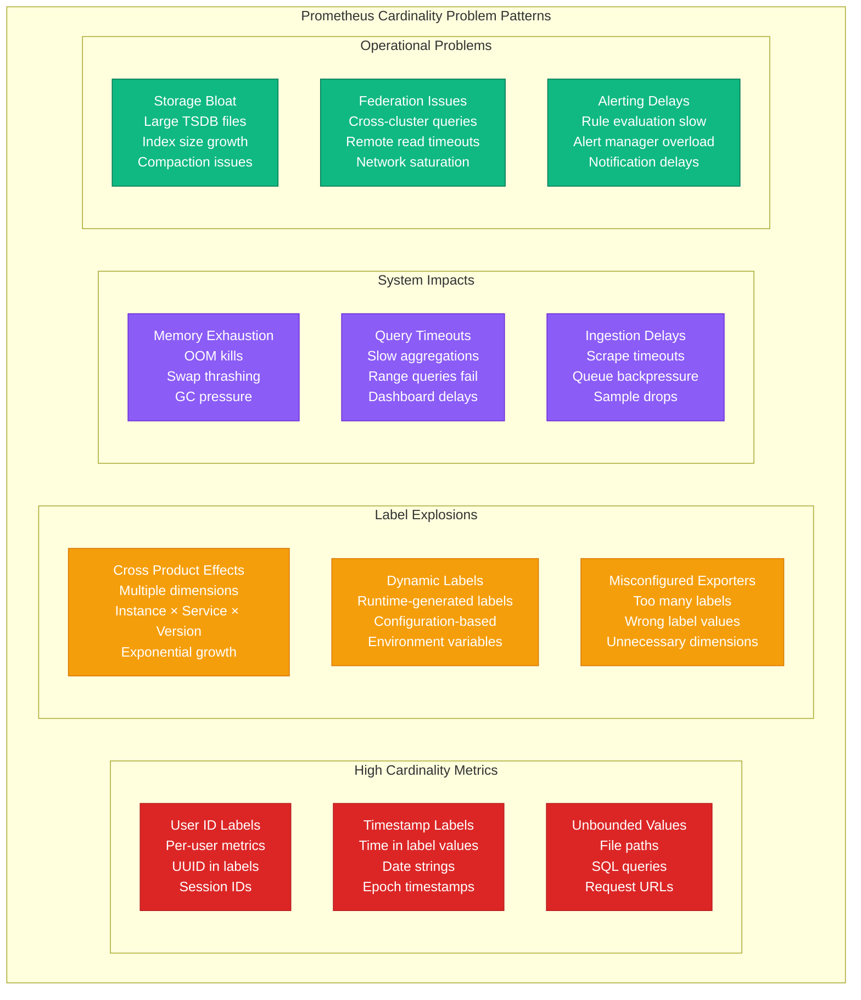
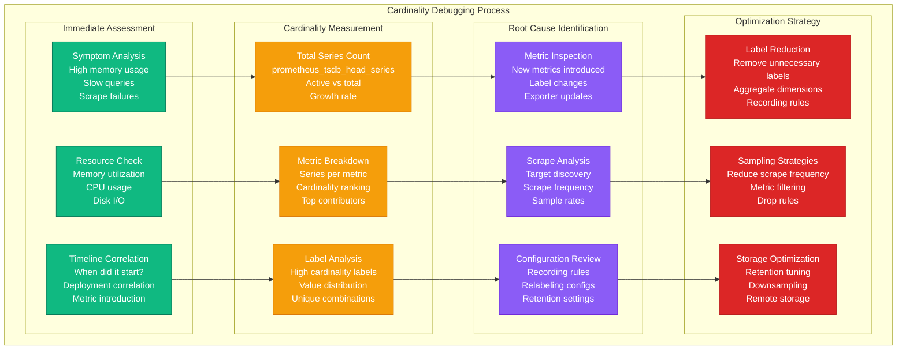

# Prometheus Cardinality Debugging

## Overview

Prometheus cardinality explosions cause memory exhaustion, query timeouts, and monitoring system failures. High cardinality metrics affect 40% of Prometheus performance issues, manifesting as OOM kills, slow queries, and ingestion delays. This guide provides systematic troubleshooting for cardinality problems and optimization strategies.

## Prometheus Cardinality Architecture

```mermaid
graph TB
    subgraph CardinalityArchitecture[Prometheus Cardinality Architecture]
        subgraph MetricIngestion[Metric Ingestion]
            SCRAPERS[Scrape Targets<br/>Applications<br/>Infrastructure<br/>Custom exporters]
            METRIC_PARSING[Metric Parsing<br/>Prometheus format<br/>Label extraction<br/>Value processing]
            SERIES_CREATION[Time Series Creation<br/>Metric name + labels<br/>Unique combinations<br/>Series registration]
        end

        subgraph CardinalityFactors[Cardinality Factors]
            LABEL_DIMENSIONS[Label Dimensions<br/>Number of labels<br/>Label value variety<br/>Dynamic labels]
            COMBINATION_EXPLOSION[Combination Explosion<br/>Cartesian product<br/>Label interactions<br/>Multiplicative effect]
            TEMPORAL_FACTORS[Temporal Factors<br/>Scrape frequency<br/>Series lifecycle<br/>Retention period]
        end

        subgraph StorageImpact[Storage Impact]
            MEMORY_USAGE[Memory Usage<br/>Series in memory<br/>Label indexes<br/>WAL buffer]
            DISK_STORAGE[Disk Storage<br/>TSDB blocks<br/>Index size<br/>Chunk compression]
            QUERY_PERFORMANCE[Query Performance<br/>Index lookups<br/>Series scanning<br/>Aggregation cost]
        end

        subgraph CardinalityTracking[Cardinality Tracking]
            SERIES_COUNT[Series Count<br/>prometheus_tsdb_symbol_table_size_bytes<br/>Active series<br/>Total series]
            LABEL_ANALYSIS[Label Analysis<br/>High cardinality labels<br/>Unused labels<br/>Label value distribution]
            GROWTH_MONITORING[Growth Monitoring<br/>Cardinality trends<br/>Growth rate<br/>Alert thresholds]
        end
    end

    SCRAPERS --> METRIC_PARSING
    METRIC_PARSING --> SERIES_CREATION

    SERIES_CREATION --> LABEL_DIMENSIONS
    LABEL_DIMENSIONS --> COMBINATION_EXPLOSION
    COMBINATION_EXPLOSION --> TEMPORAL_FACTORS

    TEMPORAL_FACTORS --> MEMORY_USAGE
    MEMORY_USAGE --> DISK_STORAGE
    DISK_STORAGE --> QUERY_PERFORMANCE

    QUERY_PERFORMANCE --> SERIES_COUNT
    SERIES_COUNT --> LABEL_ANALYSIS
    LABEL_ANALYSIS --> GROWTH_MONITORING

    classDef ingestionStyle fill:#10B981,stroke:#047857,color:#fff
    classDef factorsStyle fill:#F59E0B,stroke:#D97706,color:#fff
    classDef storageStyle fill:#8B5CF6,stroke:#6D28D9,color:#fff
    classDef trackingStyle fill:#DC2626,stroke:#B91C1C,color:#fff

    class SCRAPERS,METRIC_PARSING,SERIES_CREATION ingestionStyle
    class LABEL_DIMENSIONS,COMBINATION_EXPLOSION,TEMPORAL_FACTORS factorsStyle
    class MEMORY_USAGE,DISK_STORAGE,QUERY_PERFORMANCE storageStyle
    class SERIES_COUNT,LABEL_ANALYSIS,GROWTH_MONITORING trackingStyle
```



## Cardinality Problem Patterns



## Systematic Debugging Process



## 3 AM Debugging Commands

### Immediate Cardinality Assessment
```bash
# Check total series count
curl -s http://prometheus:9090/api/v1/query?query=prometheus_tsdb_head_series | jq '.data.result[0].value[1]'

# Check memory usage
curl -s http://prometheus:9090/api/v1/query?query=process_resident_memory_bytes | jq '.data.result[0].value[1]'

# Check ingestion rate
curl -s http://prometheus:9090/api/v1/query?query=rate\(prometheus_tsdb_head_samples_appended_total\[5m]\) | jq '.data.result[0].value[1]'

# Check for dropped samples
curl -s http://prometheus:9090/api/v1/query?query=rate\(prometheus_tsdb_out_of_order_samples_total\[5m]\) | jq '.data.result[0].value[1]'
```

### Cardinality Analysis Queries
```promql
# Top 10 metrics by series count
topk(10,
  count by (__name__) (
    {__name__=~".+"}
  )
)

# Total unique series
count(
  count by (__name__)({__name__=~".+"})
)

# Memory usage per million series
(process_resident_memory_bytes / prometheus_tsdb_head_series) * 1000000

# WAL size and growth
prometheus_tsdb_wal_size_bytes

# Index size
prometheus_tsdb_head_index_size_bytes

# Chunks in memory
prometheus_tsdb_head_chunks
```

### High Cardinality Label Detection
```bash
# Find metrics with high label cardinality
curl -s 'http://prometheus:9090/api/v1/label/__name__/values' | jq -r '.data[]' | while read metric; do
  count=$(curl -s "http://prometheus:9090/api/v1/query?query=count(count%20by%20(__name__)({__name__=\"$metric\"}))" | jq -r '.data.result[0].value[1]')
  echo "$metric: $count series"
done | sort -k2 -nr | head -20

# Analyze specific metric's label cardinality
METRIC="http_requests_total"
curl -s "http://prometheus:9090/api/v1/query?query=count%20by%20(__name__)({__name__=\"$METRIC\"})" | jq '.data.result[0].value[1]'

# Check label value distribution
curl -s "http://prometheus:9090/api/v1/label/instance/values" | jq '.data | length'
curl -s "http://prometheus:9090/api/v1/label/job/values" | jq '.data | length'
```

### Performance Impact Assessment
```bash
# Check query duration
curl -s 'http://prometheus:9090/api/v1/query?query=histogram_quantile(0.99,%20rate(prometheus_engine_query_duration_seconds_bucket[5m]))' | jq '.data.result[0].value[1]'

# Check rule evaluation duration
curl -s 'http://prometheus:9090/api/v1/query?query=histogram_quantile(0.99,%20rate(prometheus_rule_evaluation_duration_seconds_bucket[5m]))' | jq '.data.result[0].value[1]'

# Check scrape duration
curl -s 'http://prometheus:9090/api/v1/query?query=histogram_quantile(0.99,%20rate(prometheus_target_interval_length_seconds_bucket[5m]))' | jq '.data.result[0].value[1]'

# Check for scrape timeouts
curl -s 'http://prometheus:9090/api/v1/query?query=up == 0' | jq '.data.result | length'
```

## Common Issues and Solutions

### Issue 1: Memory Exhaustion from High Cardinality

**Symptoms:**
- Prometheus pod OOMKilled
- Slow query responses
- High memory usage metrics

**Investigation:**
```bash
# Check current memory usage
kubectl top pod prometheus-server-xxx

# Get detailed cardinality breakdown
kubectl exec prometheus-server-xxx -- promtool tsdb analyze /prometheus/data

# Check for memory spikes
curl -s 'http://prometheus:9090/api/v1/query_range?query=process_resident_memory_bytes&start=2024-01-15T00:00:00Z&end=2024-01-15T23:59:59Z&step=5m'

# Identify problematic metrics
curl -s 'http://prometheus:9090/api/v1/query?query=topk(10, count by (__name__)({__name__=~".+"}))' | jq '.data.result'
```

**Solution:**
```yaml
# Increase memory limits (temporary)
resources:
  limits:
    memory: 16Gi
  requests:
    memory: 8Gi

# Add metric filtering to reduce cardinality
metric_relabel_configs:
- source_labels: [__name__]
  regex: 'high_cardinality_metric_.*'
  action: drop
- source_labels: [user_id]
  regex: '.*'
  action: drop  # Remove user_id label entirely
```

### Issue 2: Specific Metric Causing Cardinality Explosion

**Symptoms:**
- Sudden increase in series count
- Memory usage spike after deployment
- New metric with many label combinations

**Investigation:**
```bash
# Find recently introduced metrics
curl -s 'http://prometheus:9090/api/v1/query?query=prometheus_tsdb_head_series offset 1h' | jq '.data.result[0].value[1]'
current_series=$(curl -s 'http://prometheus:9090/api/v1/query?query=prometheus_tsdb_head_series' | jq -r '.data.result[0].value[1]')
echo "Series increase: $((current_series - previous_series))"

# Analyze specific metric
METRIC="problematic_metric"
curl -s "http://prometheus:9090/api/v1/series?match[]=$METRIC" | jq '.data | length'

# Check label combinations
curl -s "http://prometheus:9090/api/v1/query?query=group({__name__=\"$METRIC\"}) by (label1, label2)" | jq '.data.result | length'
```

**Solution:**
```yaml
# Drop problematic labels
metric_relabel_configs:
- source_labels: [__name__]
  regex: 'problematic_metric'
  target_label: __tmp_drop_high_cardinality
- source_labels: [__tmp_drop_high_cardinality, user_id]
  regex: 'true;.*'
  target_label: user_id
  replacement: 'aggregated'

# Or create recording rule with aggregation
groups:
- name: cardinality_reduction
  rules:
  - record: problematic_metric:rate5m
    expr: rate(problematic_metric[5m])
  - record: problematic_metric:by_service
    expr: sum(rate(problematic_metric[5m])) by (service, environment)
```

### Issue 3: Query Performance Degradation

**Symptoms:**
- Dashboard timeouts
- Slow alert rule evaluation
- High query latency

**Investigation:**
```bash
# Check query performance metrics
curl -s 'http://prometheus:9090/api/v1/query?query=histogram_quantile(0.99, rate(prometheus_engine_query_duration_seconds_bucket[5m]))'

# Find slow queries
curl -s 'http://prometheus:9090/api/v1/query?query=topk(10, prometheus_engine_query_duration_seconds)'

# Check rule evaluation time
curl -s 'http://prometheus:9090/api/v1/query?query=histogram_quantile(0.99, rate(prometheus_rule_evaluation_duration_seconds_bucket[5m]))'

# Analyze index size vs series count
curl -s 'http://prometheus:9090/api/v1/query?query=prometheus_tsdb_head_index_size_bytes / prometheus_tsdb_head_series'
```

**Solution:**
```yaml
# Optimize queries with recording rules
groups:
- name: performance_optimization
  interval: 30s
  rules:
  - record: instance:cpu_usage:rate5m
    expr: rate(cpu_usage_seconds_total[5m])
  - record: job:cpu_usage:rate5m
    expr: sum(instance:cpu_usage:rate5m) by (job)

# Reduce query complexity
# Instead of: sum(rate(metric[5m])) by (many, labels, here)
# Use: sum(metric:rate5m) by (fewer, labels)
```

### Issue 4: Storage Growth Issues

**Symptoms:**
- Rapidly growing disk usage
- Long compaction times
- Block size warnings

**Investigation:**
```bash
# Check storage metrics
curl -s 'http://prometheus:9090/api/v1/query?query=prometheus_tsdb_size_bytes'
curl -s 'http://prometheus:9090/api/v1/query?query=prometheus_tsdb_wal_size_bytes'

# Check compaction metrics
curl -s 'http://prometheus:9090/api/v1/query?query=prometheus_tsdb_compactions_total'
curl -s 'http://prometheus:9090/api/v1/query?query=prometheus_tsdb_compaction_duration_seconds'

# Analyze retention vs storage
kubectl exec prometheus-server-xxx -- du -sh /prometheus/data
```

**Solution:**
```yaml
# Adjust retention settings
global:
  retention: 15d  # Reduce from 30d
  retention_size: 50GB

# Configure downsampling (with remote storage)
remote_write:
- url: "http://thanos-receive:19291/api/v1/receive"
  queue_config:
    capacity: 10000
    max_samples_per_send: 1000

# Add storage cleanup job
apiVersion: batch/v1
kind: CronJob
metadata:
  name: prometheus-cleanup
spec:
  schedule: "0 2 * * *"
  jobTemplate:
    spec:
      template:
        spec:
          containers:
          - name: cleanup
            image: prom/prometheus:latest
            command:
            - promtool
            - tsdb
            - delete-series
            - --match={__name__=~"high_cardinality_.*"}
            - /prometheus/data
```

## Cardinality Monitoring and Prevention

### Automated Cardinality Monitoring
```python
#!/usr/bin/env python3
# cardinality-monitor.py

import requests
import json
import time
from datetime import datetime, timedelta

class CardinalityMonitor:
    def __init__(self, prometheus_url):
        self.prometheus_url = prometheus_url.rstrip('/')
        self.series_threshold = 1000000  # 1M series
        self.memory_threshold = 8 * 1024 * 1024 * 1024  # 8GB

    def query_prometheus(self, query):
        """Execute Prometheus query"""
        try:
            response = requests.get(
                f"{self.prometheus_url}/api/v1/query",
                params={"query": query},
                timeout=30
            )
            response.raise_for_status()
            return response.json()
        except Exception as e:
            print(f"Query failed: {e}")
            return None

    def get_cardinality_report(self):
        """Generate comprehensive cardinality report"""
        report = {
            'timestamp': datetime.now().isoformat(),
            'total_series': 0,
            'memory_usage': 0,
            'top_metrics': [],
            'high_cardinality_labels': [],
            'alerts': []
        }

        # Get total series count
        result = self.query_prometheus('prometheus_tsdb_head_series')
        if result and result['data']['result']:
            report['total_series'] = int(float(result['data']['result'][0]['value'][1]))

        # Get memory usage
        result = self.query_prometheus('process_resident_memory_bytes')
        if result and result['data']['result']:
            report['memory_usage'] = int(float(result['data']['result'][0]['value'][1]))

        # Get top metrics by cardinality
        result = self.query_prometheus('topk(20, count by (__name__)({__name__=~".+"}))')
        if result and result['data']['result']:
            for metric in result['data']['result']:
                report['top_metrics'].append({
                    'name': metric['metric']['__name__'],
                    'series_count': int(float(metric['value'][1]))
                })

        # Check for concerning patterns
        self.analyze_cardinality_issues(report)

        return report

    def analyze_cardinality_issues(self, report):
        """Analyze report for cardinality issues"""
        # Check total series threshold
        if report['total_series'] > self.series_threshold:
            report['alerts'].append(
                f"High total series count: {report['total_series']:,} > {self.series_threshold:,}"
            )

        # Check memory threshold
        if report['memory_usage'] > self.memory_threshold:
            memory_gb = report['memory_usage'] / (1024 * 1024 * 1024)
            report['alerts'].append(f"High memory usage: {memory_gb:.1f}GB")

        # Check for extremely high cardinality metrics
        for metric in report['top_metrics'][:5]:
            if metric['series_count'] > 100000:
                report['alerts'].append(
                    f"High cardinality metric: {metric['name']} has {metric['series_count']:,} series"
                )

        # Check growth rate
        previous_series = self.get_previous_series_count()
        if previous_series and report['total_series'] > previous_series * 1.2:
            growth = ((report['total_series'] - previous_series) / previous_series) * 100
            report['alerts'].append(f"Rapid series growth: {growth:.1f}% increase")

    def get_previous_series_count(self):
        """Get series count from 1 hour ago"""
        result = self.query_prometheus('prometheus_tsdb_head_series offset 1h')
        if result and result['data']['result']:
            return int(float(result['data']['result'][0]['value'][1]))
        return None

    def send_alerts(self, report):
        """Send alerts if issues detected"""
        if report['alerts']:
            message = f"🚨 Prometheus Cardinality Alert:\n"
            message += f"Total Series: {report['total_series']:,}\n"
            message += f"Memory Usage: {report['memory_usage'] / (1024**3):.1f}GB\n"
            message += f"Issues:\n" + "\n".join(f"- {alert}" for alert in report['alerts'])

            print(message)
            # implement_slack_notification(message)

if __name__ == "__main__":
    monitor = CardinalityMonitor("http://prometheus:9090")
    report = monitor.get_cardinality_report()
    monitor.send_alerts(report)
    print(json.dumps(report, indent=2))
```

### Prometheus Configuration Optimization
```yaml
# prometheus.yml with cardinality optimizations
global:
  scrape_interval: 15s
  evaluation_interval: 15s
  external_labels:
    cluster: production
    region: us-east-1

rule_files:
- "/etc/prometheus/rules/*.yml"

scrape_configs:
- job_name: 'kubernetes-nodes'
  kubernetes_sd_configs:
  - role: node
  metric_relabel_configs:
  # Drop high cardinality labels
  - source_labels: [__name__]
    regex: 'node_filesystem_.*'
    target_label: __tmp_filesystem_metric
  - source_labels: [__tmp_filesystem_metric, device]
    regex: 'true;/dev/loop.*'
    action: drop
  # Aggregate container metrics
  - source_labels: [__name__]
    regex: 'container_.*'
    target_label: __tmp_container_metric
  - source_labels: [__tmp_container_metric, container]
    regex: 'true;POD'
    action: drop

- job_name: 'application-metrics'
  kubernetes_sd_configs:
  - role: pod
  metric_relabel_configs:
  # Drop user-specific metrics
  - source_labels: [user_id]
    action: drop
  # Limit URL path cardinality
  - source_labels: [path]
    regex: '(/api/v1/users/)[0-9]+(.*)'
    target_label: path
    replacement: '${1}<id>${2}'
  # Drop debug metrics in production
  - source_labels: [__name__]
    regex: 'debug_.*'
    action: drop

# Recording rules for cardinality reduction
recording_rules:
- name: cardinality_reduction
  interval: 30s
  rules:
  - record: instance:cpu_utilization:rate5m
    expr: rate(cpu_usage_seconds_total[5m])
  - record: job:request_rate:rate5m
    expr: sum(rate(http_requests_total[5m])) by (job, status)
  - record: cluster:memory_usage:ratio
    expr: sum(container_memory_usage_bytes) by (cluster) / sum(machine_memory_bytes) by (cluster)
```

### Cardinality Alerting Rules
```yaml
# Prometheus alerting rules for cardinality
groups:
- name: cardinality_alerts
  rules:
  - alert: HighCardinalityTotal
    expr: prometheus_tsdb_head_series > 1000000
    for: 5m
    labels:
      severity: warning
    annotations:
      summary: "High total cardinality: {{ $value }} series"
      description: "Prometheus has {{ $value }} series, approaching limits"

  - alert: CardinalityGrowthRate
    expr: increase(prometheus_tsdb_head_series[1h]) > 100000
    for: 10m
    labels:
      severity: warning
    annotations:
      summary: "Rapid cardinality growth: {{ $value }} new series in 1h"

  - alert: HighCardinalityMetric
    expr: topk(1, count by (__name__)({__name__=~".+"})) > 50000
    for: 5m
    labels:
      severity: warning
    annotations:
      summary: "Metric {{ $labels.__name__ }} has {{ $value }} series"

  - alert: PrometheusMemoryHigh
    expr: process_resident_memory_bytes / (1024^3) > 8
    for: 5m
    labels:
      severity: critical
    annotations:
      summary: "Prometheus memory usage: {{ $value }}GB"
```

## Best Practices

### 1. Label Design Guidelines
```yaml
# Good: Limited, bounded labels
http_requests_total{method="GET", status="200", service="api"}

# Bad: Unbounded labels
http_requests_total{method="GET", status="200", user_id="12345", request_id="abc-def-123"}

# Good: Aggregated labels
database_connections_total{database="users", pool="read"}

# Bad: High cardinality labels
database_connections_total{database="users", connection_id="conn-12345", client_ip="192.168.1.100"}
```

### 2. Recording Rules for Optimization
```yaml
groups:
- name: cardinality_optimization
  interval: 30s
  rules:
  # Pre-aggregate high cardinality metrics
  - record: service:request_rate:rate5m
    expr: sum(rate(http_requests_total[5m])) by (service, method, status)

  # Remove unnecessary dimensions
  - record: instance:cpu_usage:rate5m
    expr: rate(cpu_usage_seconds_total[5m])

  # Create coarse-grained aggregations
  - record: cluster:request_rate:rate5m
    expr: sum(service:request_rate:rate5m) by (cluster)
```

### 3. Metric Relabeling Patterns
```yaml
metric_relabel_configs:
# Remove high cardinality labels
- source_labels: [user_id]
  action: drop

# Sanitize URL paths
- source_labels: [path]
  regex: '(/api/v1/users/)[^/]+(.*)'
  target_label: path
  replacement: '${1}<id>${2}'

# Drop debug metrics in production
- source_labels: [__name__, environment]
  regex: 'debug_.*;production'
  action: drop

# Limit container label cardinality
- source_labels: [container]
  regex: 'k8s_POD_.*'
  target_label: container
  replacement: 'pod-overhead'
```

## Quick Reference

### Essential Queries
```promql
# Total series count
prometheus_tsdb_head_series

# Top 10 metrics by cardinality
topk(10, count by (__name__)({__name__=~".+"}))

# Memory per series
process_resident_memory_bytes / prometheus_tsdb_head_series

# Query performance
histogram_quantile(0.99, rate(prometheus_engine_query_duration_seconds_bucket[5m]))

# Series growth rate
increase(prometheus_tsdb_head_series[1h])
```

### Emergency Actions
1. ✅ Check total series count and memory usage
2. ✅ Identify top metrics by cardinality
3. ✅ Find recently introduced high-cardinality metrics
4. ✅ Apply metric drop rules for immediate relief
5. ✅ Increase memory limits temporarily
6. ✅ Plan long-term cardinality reduction strategy

*Keep this guide accessible for quick Prometheus cardinality troubleshooting during memory pressure incidents.*