# Prometheus Metric Cardinality Explosion Production Debugging

## Emergency Response Overview

**Incident Severity**: P0/P1 - Monitoring system failure, metrics ingestion failing
**MTTR Target**: < 3 minutes for metric ingestion restoration, < 15 minutes for cardinality reduction
**Primary Tools**: PromQL queries, Prometheus Admin API, `promtool`, cardinality analysis tools

```mermaid
graph TB
    subgraph EdgePlane[Edge Plane - Blue #3B82F6]
        APPS[Applications<br/>1,200 services<br/>Metrics exported: 45M/min<br/>Labels explosion detected]
        SCRAPERS[Metric Scrapers<br/>Prometheus agents<br/>Scrape failures: 25%<br/>Timeout: 30s → 2min]
        ALERTS[Alert Manager<br/>Alert evaluation lag: 5min<br/>Rules timing out<br/>Memory pressure warnings]
    end

    subgraph ServicePlane[Service Plane - Emerald #10B981]
        PROMETHEUS[Prometheus Server<br/>v2.40.0<br/>Memory: 28GB/32GB<br/>Series: 45M (limit: 50M)]
        INGESTION[Metrics Ingestion<br/>Rate: 2.1M samples/sec<br/>Errors: 15% timeout<br/>Cardinality: 45M series]
        QUERIES[Query Engine<br/>Active queries: 450<br/>Slow queries: 125<br/>Memory per query: 8GB]
    end

    subgraph StatePlane[State Plane - Amber #F59E0B]
        TSDB[Time Series Database<br/>Storage: 2.8TB<br/>Retention: 15 days<br/>WAL size: 45GB]
        BLOCKS[Storage Blocks<br/>Head: 2h, 35M series<br/>Compaction: FAILING<br/>Block size: 1.2GB each]
        INDEXES[Series Indexes<br/>Label index: 8.5GB<br/>Postings: 12.2GB<br/>Lookup time: 15s avg]
    end

    subgraph ControlPlane[Control Plane - Violet #8B5CF6]
        GRAFANA[Grafana Dashboards<br/>Query timeout: 60s<br/>Dashboard load: 45s<br/>503 errors: 35%]
        METRICS[Cardinality Metrics<br/>prometheus_tsdb_symbol_table_size_bytes<br/>prometheus_tsdb_head_series<br/>High cardinality sources]
        ADMIN[Admin API<br/>Label value analysis<br/>Series dropping<br/>Emergency cleanup]
    end

    APPS --> SCRAPERS
    SCRAPERS --> PROMETHEUS
    PROMETHEUS --> INGESTION
    INGESTION --> QUERIES
    QUERIES --> TSDB
    TSDB --> BLOCKS
    BLOCKS --> INDEXES
    INDEXES --> GRAFANA
    GRAFANA --> METRICS
    METRICS --> ADMIN
    ADMIN --> ALERTS

    %% Apply Tailwind 4-plane colors
    classDef edgeStyle fill:#3B82F6,stroke:#1E40AF,color:#fff,stroke-width:2px
    classDef serviceStyle fill:#10B981,stroke:#047857,color:#fff,stroke-width:2px
    classDef stateStyle fill:#F59E0B,stroke:#D97706,color:#fff,stroke-width:2px
    classDef controlStyle fill:#8B5CF6,stroke:#7C3AED,color:#fff,stroke-width:2px

    class APPS,SCRAPERS,ALERTS edgeStyle
    class PROMETHEUS,INGESTION,QUERIES serviceStyle
    class TSDB,BLOCKS,INDEXES stateStyle
    class GRAFANA,METRICS,ADMIN controlStyle
```

## 3 AM Debugging Flowchart

```mermaid
flowchart TD
    START[🚨 Prometheus Alert<br/>High cardinality detected<br/>Memory usage > 80%<br/>Queries timing out] --> CHECK_HEALTH{Prometheus<br/>Status Check}

    CHECK_HEALTH -->|HEALTHY| CARDINALITY_ANALYSIS[Cardinality Analysis<br/>Identify high cardinality metrics<br/>Check series growth rate]
    CHECK_HEALTH -->|UNHEALTHY| EMERGENCY_ACTIONS[Emergency Actions<br/>Increase memory limits<br/>Drop high cardinality series<br/>Reduce scrape frequency]

    CARDINALITY_ANALYSIS --> TOP_METRICS{Identify Top<br/>Cardinality Sources}

    TOP_METRICS -->|Labels explosion| LABEL_EXPLOSION[Label Explosion<br/>user_id, request_id in labels<br/>Unique identifiers causing bloat<br/>Unbounded label values]
    TOP_METRICS -->|Histogram buckets| HISTOGRAM_EXPLOSION[Histogram Explosion<br/>Too many buckets<br/>High dimensional histograms<br/>Per-request metrics]
    TOP_METRICS -->|Service discovery| SD_EXPLOSION[Service Discovery<br/>Dynamic targets<br/>Kubernetes pod churn<br/>Auto-scaling labels]

    EMERGENCY_ACTIONS --> MEMORY_RELIEF[Memory Relief<br/>Increase Prometheus memory<br/>Enable streaming parsing<br/>Reduce retention period]

    LABEL_EXPLOSION --> FIX_LABELS[Fix Label Explosion<br/>Remove high cardinality labels<br/>Use metric_relabel_configs<br/>Move IDs to trace context]
    HISTOGRAM_EXPLOSION --> FIX_HISTOGRAMS[Fix Histogram Buckets<br/>Reduce bucket count<br/>Use summary instead<br/>Aggregate at source]
    SD_EXPLOSION --> FIX_SERVICE_DISCOVERY[Fix Service Discovery<br/>Reduce label discovery<br/>Filter unstable targets<br/>Use label dropping]

    MEMORY_RELIEF --> APPLY_FIXES[Apply Emergency Fixes<br/>Update configurations<br/>Restart with more memory<br/>Enable series limiting]
    FIX_LABELS --> APPLY_FIXES
    FIX_HISTOGRAMS --> APPLY_FIXES
    FIX_SERVICE_DISCOVERY --> APPLY_FIXES

    APPLY_FIXES --> VERIFY_STABILITY{Cardinality<br/>Stabilized?}

    VERIFY_STABILITY -->|YES| OPTIMIZE_LONG_TERM[✅ Long-term Optimization<br/>Set up cardinality monitoring<br/>Implement governance<br/>Regular cardinality reviews]
    VERIFY_STABILITY -->|NO| ESCALATE[🚨 ESCALATE<br/>Consider cluster federation<br/>Horizontal scaling<br/>Alternative TSDB solutions]

    %% Apply Tailwind colors
    classDef errorStyle fill:#EF4444,stroke:#DC2626,color:#fff,stroke-width:2px
    classDef warningStyle fill:#F59E0B,stroke:#D97706,color:#fff,stroke-width:2px
    classDef actionStyle fill:#3B82F6,stroke:#1E40AF,color:#fff,stroke-width:2px
    classDef successStyle fill:#10B981,stroke:#047857,color:#fff,stroke-width:2px

    class ESCALATE,EMERGENCY_ACTIONS errorStyle
    class LABEL_EXPLOSION,HISTOGRAM_EXPLOSION,SD_EXPLOSION warningStyle
    class FIX_LABELS,FIX_HISTOGRAMS,FIX_SERVICE_DISCOVERY,APPLY_FIXES actionStyle
    class OPTIMIZE_LONG_TERM successStyle
```



## Critical Commands & Immediate Actions

### Prometheus Cardinality Analysis (< 2 minutes)

```bash
# 1. CHECK PROMETHEUS STATUS
curl -s http://localhost:9090/api/v1/query?query=prometheus_build_info
curl -s http://localhost:9090/api/v1/query?query=prometheus_tsdb_head_series

# 2. GET CURRENT CARDINALITY
curl -s "http://localhost:9090/api/v1/query?query=prometheus_tsdb_head_series" | \
  jq -r '.data.result[0].value[1]'

# 3. IDENTIFY HIGH CARDINALITY METRICS
curl -s "http://localhost:9090/api/v1/label/__name__/values" | \
  jq -r '.data[]' | head -20

# 4. FIND METRICS WITH MOST SERIES
curl -s "http://localhost:9090/api/v1/query?query={__name__=~\".+\"}" | \
  jq -r '.data.result[0].metric.__name__' | sort | uniq -c | sort -nr | head -10

# 5. CHECK MEMORY USAGE
curl -s "http://localhost:9090/api/v1/query?query=prometheus_tsdb_head_samples_appended_total" | \
  jq '.data.result[0].value[1]'

# 6. GET CARDINALITY BY METRIC
curl -s "http://localhost:9090/api/v1/query?query=topk(20, count by (__name__)({__name__=~\".+\"}))"
```

### Netflix Emergency Cardinality Analysis

```bash
# NETFLIX'S PROMETHEUS CARDINALITY EMERGENCY SCRIPT
#!/bin/bash

PROMETHEUS_URL=${1:-"http://localhost:9090"}
OUTPUT_DIR="/tmp/cardinality-analysis-$(date +%Y%m%d-%H%M%S)"
mkdir -p "$OUTPUT_DIR"

echo "=== NETFLIX PROMETHEUS CARDINALITY EMERGENCY ANALYSIS ==="
echo "Prometheus URL: $PROMETHEUS_URL"
echo "Output directory: $OUTPUT_DIR"
echo "Analysis started: $(date)"

# 1. BASIC HEALTH CHECK
echo "=== PROMETHEUS HEALTH CHECK ==="
curl -s "$PROMETHEUS_URL/api/v1/query?query=up" > "$OUTPUT_DIR/health.json"
PROMETHEUS_UP=$(jq -r '.status' "$OUTPUT_DIR/health.json")

if [ "$PROMETHEUS_UP" != "success" ]; then
    echo "ERROR: Prometheus is not responding properly"
    exit 1
fi

echo "Prometheus is responding"

# 2. CURRENT CARDINALITY STATS
echo "=== CARDINALITY STATISTICS ==="
CURRENT_SERIES=$(curl -s "$PROMETHEUS_URL/api/v1/query?query=prometheus_tsdb_head_series" | \
    jq -r '.data.result[0].value[1]')
TOTAL_SAMPLES=$(curl -s "$PROMETHEUS_URL/api/v1/query?query=prometheus_tsdb_head_samples_appended_total" | \
    jq -r '.data.result[0].value[1]')
MEMORY_USAGE=$(curl -s "$PROMETHEUS_URL/api/v1/query?query=process_resident_memory_bytes" | \
    jq -r '.data.result[0].value[1]')

echo "Current series count: $CURRENT_SERIES"
echo "Total samples: $TOTAL_SAMPLES"
echo "Memory usage: $(echo "$MEMORY_USAGE / 1024 / 1024 / 1024" | bc)GB"

# Write to file for later analysis
cat > "$OUTPUT_DIR/cardinality-stats.txt" << EOF
Current series count: $CURRENT_SERIES
Total samples: $TOTAL_SAMPLES
Memory usage: $(echo "$MEMORY_USAGE / 1024 / 1024 / 1024" | bc)GB
Analysis time: $(date)
EOF

# 3. TOP CARDINALITY METRICS
echo "=== TOP CARDINALITY METRICS ==="
curl -s "$PROMETHEUS_URL/api/v1/query?query=topk(50, count by (__name__)({__name__=~\".+\"}))" | \
    jq -r '.data.result[] | "\(.value[1]) \(.metric.__name__)"' | \
    sort -nr > "$OUTPUT_DIR/top-metrics.txt"

echo "Top 10 metrics by series count:"
head -10 "$OUTPUT_DIR/top-metrics.txt"

# 4. LABEL CARDINALITY ANALYSIS
echo "=== LABEL CARDINALITY ANALYSIS ==="
for metric in $(head -5 "$OUTPUT_DIR/top-metrics.txt" | awk '{print $2}'); do
    echo "Analyzing metric: $metric"

    # Get all label names for this metric
    curl -s "$PROMETHEUS_URL/api/v1/query?query={__name__=\"$metric\"}" | \
        jq -r '.data.result[0].metric | keys[]' | \
        grep -v "__name__" > "$OUTPUT_DIR/${metric}-labels.txt"

    # Count unique values for each label
    while read -r label; do
        if [ ! -z "$label" ]; then
            count=$(curl -s "$PROMETHEUS_URL/api/v1/label/$label/values" | jq -r '.data | length')
            echo "$label: $count unique values"
        fi
    done < "$OUTPUT_DIR/${metric}-labels.txt" > "$OUTPUT_DIR/${metric}-label-cardinality.txt"

    echo "Label cardinality for $metric:"
    cat "$OUTPUT_DIR/${metric}-label-cardinality.txt"
    echo ""
done

# 5. GROWTH RATE ANALYSIS
echo "=== GROWTH RATE ANALYSIS ==="
curl -s "$PROMETHEUS_URL/api/v1/query?query=rate(prometheus_tsdb_head_series[5m])" | \
    jq -r '.data.result[0].value[1]' > "$OUTPUT_DIR/series-growth-rate.txt"

GROWTH_RATE=$(cat "$OUTPUT_DIR/series-growth-rate.txt")
echo "Series growth rate (last 5min): $GROWTH_RATE series/second"

if (( $(echo "$GROWTH_RATE > 100" | bc -l) )); then
    echo "WARNING: High series growth rate detected!"
fi

# 6. MEMORY PRESSURE CHECK
echo "=== MEMORY PRESSURE ANALYSIS ==="
MEMORY_LIMIT=$(curl -s "$PROMETHEUS_URL/api/v1/query?query=container_spec_memory_limit_bytes{container=\"prometheus\"}" | \
    jq -r '.data.result[0].value[1]' 2>/dev/null || echo "unknown")
MEMORY_USAGE_PERCENT="unknown"

if [ "$MEMORY_LIMIT" != "unknown" ] && [ "$MEMORY_LIMIT" != "null" ]; then
    MEMORY_USAGE_PERCENT=$(echo "scale=2; $MEMORY_USAGE * 100 / $MEMORY_LIMIT" | bc)
    echo "Memory usage: ${MEMORY_USAGE_PERCENT}% of limit"

    if (( $(echo "$MEMORY_USAGE_PERCENT > 80" | bc -l) )); then
        echo "CRITICAL: Memory usage above 80%!"
    fi
else
    echo "Could not determine memory limit"
fi

# 7. IDENTIFY PROBLEMATIC PATTERNS
echo "=== PROBLEMATIC PATTERN DETECTION ==="
echo "Checking for common cardinality anti-patterns..."

# Check for user_id in metric labels
USER_ID_METRICS=$(grep -E "(user_id|userid|user)" "$OUTPUT_DIR/top-metrics.txt" | wc -l)
echo "Metrics potentially containing user IDs: $USER_ID_METRICS"

# Check for request_id patterns
REQUEST_ID_METRICS=$(grep -E "(request_id|requestid|trace_id|traceid)" "$OUTPUT_DIR/top-metrics.txt" | wc -l)
echo "Metrics potentially containing request IDs: $REQUEST_ID_METRICS"

# Check for high bucket count histograms
HISTOGRAM_METRICS=$(grep "_bucket" "$OUTPUT_DIR/top-metrics.txt" | wc -l)
echo "Histogram bucket metrics: $HISTOGRAM_METRICS"

echo ""
echo "=== ANALYSIS COMPLETE ==="
echo "Results saved to: $OUTPUT_DIR"
echo ""

# 8. EMERGENCY RECOMMENDATIONS
echo "=== EMERGENCY RECOMMENDATIONS ==="
if [ "$CURRENT_SERIES" -gt 10000000 ]; then
    echo "CRITICAL: Series count > 10M. Immediate action required:"
    echo "1. Increase Prometheus memory allocation"
    echo "2. Enable series limiting: --storage.tsdb.max-block-duration=2h"
    echo "3. Reduce scrape frequency for high cardinality targets"
    echo "4. Drop high cardinality metrics using metric_relabel_configs"
fi

if [ "$USER_ID_METRICS" -gt 0 ] || [ "$REQUEST_ID_METRICS" -gt 0 ]; then
    echo "WARNING: High cardinality labels detected:"
    echo "- Remove user_id, request_id from metric labels"
    echo "- Use exemplars or trace context instead"
    echo "- Consider sampling for high cardinality metrics"
fi

if [ "$HISTOGRAM_METRICS" -gt 20 ]; then
    echo "INFO: Many histogram metrics detected:"
    echo "- Review histogram bucket configuration"
    echo "- Consider using summaries for some metrics"
    echo "- Reduce bucket count where possible"
fi
```

## Common Root Causes & Probabilities

### 1. High Cardinality Labels (50% of cases)
**Uber Example**: Including user_id in HTTP request metrics causing millions of series

```yaml
# PROBLEMATIC METRIC CONFIGURATION
- job_name: 'web-servers'
  static_configs:
  - targets: ['web1:8080', 'web2:8080']
  metric_relabel_configs: []  # NO LABEL FILTERING!

# Application code generating high cardinality
# BAD: User ID in metric labels
http_requests_total{method="GET", path="/api/users", user_id="12345", status="200"} 1
http_requests_total{method="GET", path="/api/users", user_id="67890", status="200"} 1
# Result: One series per user = millions of series!

# UBER'S SOLUTION - Remove high cardinality labels
- job_name: 'web-servers'
  static_configs:
  - targets: ['web1:8080', 'web2:8080']
  metric_relabel_configs:
  # Drop user_id label
  - source_labels: [__name__]
    regex: 'http_requests_total'
    target_label: '__tmp_drop_user_id'
    replacement: 'true'
  - source_labels: [__tmp_drop_user_id]
    regex: 'true'
    target_label: 'user_id'
    replacement: ''

# BETTER APPLICATION METRICS - Use exemplars for high cardinality
http_requests_total{method="GET", path="/api/users", status="200"} 1 # exemplar_user_id="12345"

# Or use trace context
http_requests_total{method="GET", path="/api/users", status="200"} 1
# Link to distributed trace containing user_id

# DETECTION QUERIES
topk(20, count by (__name__)({__name__=~".+"}))
label_cardinality({__name__=~"http_requests_total"})
```

### 2. Unbounded Histogram Buckets (25% of cases)
**Netflix Example**: Response time histograms with too many buckets across microservices

```yaml
# PROBLEMATIC HISTOGRAM CONFIGURATION
# 50 microservices × 20 endpoints × 15 buckets = 15,000 series per metric type
http_request_duration_seconds_bucket{service="user-service", endpoint="/api/users", le="0.001"} 0
http_request_duration_seconds_bucket{service="user-service", endpoint="/api/users", le="0.005"} 2
# ... 15 buckets × 50 services × 20 endpoints = 15,000 series
http_request_duration_seconds_bucket{service="user-service", endpoint="/api/users", le="+Inf"} 100

# NETFLIX'S SOLUTION - Optimized bucket configuration
histogram_opts := prometheus.HistogramOpts{
    Name: "http_request_duration_seconds",
    Help: "HTTP request latency",
    // Reduced from 15 to 8 buckets - 47% reduction
    Buckets: []float64{0.005, 0.01, 0.025, 0.05, 0.1, 0.25, 0.5, 1.0, 2.5, 5.0, 10.0, +Inf},
}

# OR use Summary for high cardinality scenarios
summary_opts := prometheus.SummaryOpts{
    Name: "http_request_duration_seconds",
    Help: "HTTP request latency",
    Objectives: map[float64]float64{
        0.5:  0.05,   // 50th percentile ±5%
        0.9:  0.01,   // 90th percentile ±1%
        0.99: 0.001,  // 99th percentile ±0.1%
    },
    MaxAge: time.Minute * 5,
}

# CARDINALITY COMPARISON
# Histogram: services × endpoints × buckets = 50 × 20 × 12 = 12,000 series
# Summary: services × endpoints × quantiles = 50 × 20 × 3 = 3,000 series
# Reduction: 75%

# DETECTION QUERIES
topk(20, count by (__name__)({__name__=~".*_bucket"}))
sum(rate(prometheus_tsdb_head_samples_appended_total[5m])) by (__name__)
```

### 3. Kubernetes Service Discovery Explosion (15% of cases)
**Shopify Example**: Auto-scaling pods creating unstable metric series

```yaml
# PROBLEMATIC KUBERNETES DISCOVERY
- job_name: 'kubernetes-pods'
  kubernetes_sd_configs:
  - role: pod
  relabel_configs:
  # NO FILTERING - Scrapes everything!
  - source_labels: [__meta_kubernetes_pod_annotation_prometheus_io_scrape]
    action: keep
    regex: true

# Result: Every pod restart creates new series with different pod IPs
http_requests_total{pod="user-service-abc123", pod_ip="10.244.1.23"} 1
http_requests_total{pod="user-service-def456", pod_ip="10.244.1.24"} 1
# Pod restarts = series churn = cardinality explosion

# SHOPIFY'S SOLUTION - Stable labels only
- job_name: 'kubernetes-pods'
  kubernetes_sd_configs:
  - role: pod
  relabel_configs:
  # Keep only stable labels
  - source_labels: [__meta_kubernetes_pod_annotation_prometheus_io_scrape]
    action: keep
    regex: true
  # Use service name instead of pod name
  - source_labels: [__meta_kubernetes_pod_label_app]
    target_label: service
  - source_labels: [__meta_kubernetes_namespace]
    target_label: namespace
  # DROP unstable labels
  - regex: __meta_kubernetes_pod_name
    action: labeldrop
  - regex: __meta_kubernetes_pod_ip
    action: labeldrop
  - regex: __meta_kubernetes_pod_uid
    action: labeldrop

# Use deployment/service level aggregation
http_requests_total{service="user-service", namespace="production"} 1
# Stable regardless of pod restarts

# ADVANCED: Metric dropping for high churn services
- job_name: 'kubernetes-pods-sampled'
  kubernetes_sd_configs:
  - role: pod
  relabel_configs:
  # Sample only 10% of pods for high-churn services
  - source_labels: [__meta_kubernetes_pod_label_app]
    regex: '(user-service|payment-service)'
    target_label: __tmp_should_sample
    replacement: 'true'
  - source_labels: [__tmp_should_sample, __meta_kubernetes_pod_name]
    regex: 'true;.*([0-9])$'  # Only scrape pods ending in specific digits
    action: keep
```

### 4. Application Metric Design Issues (8% of cases)
**Stripe Example**: Creating separate metrics for each API endpoint

```go
// PROBLEMATIC APPLICATION CODE - One metric per endpoint
func init() {
    // Creates 500+ different metric names!
    userCreateCounter = prometheus.NewCounter(prometheus.CounterOpts{
        Name: "api_user_create_requests_total",
        Help: "Total user create requests",
    })
    userUpdateCounter = prometheus.NewCounter(prometheus.CounterOpts{
        Name: "api_user_update_requests_total",
        Help: "Total user update requests",
    })
    userDeleteCounter = prometheus.NewCounter(prometheus.CounterOpts{
        Name: "api_user_delete_requests_total",
        Help: "Total user delete requests",
    })
    // ... 500 more metrics for each endpoint
}

// STRIPE'S SOLUTION - Single metric with labels
var httpRequestsTotal = prometheus.NewCounterVec(
    prometheus.CounterOpts{
        Name: "http_requests_total",
        Help: "Total HTTP requests",
    },
    []string{"method", "endpoint", "status"},  // Limited, known labels
)

func trackRequest(method, endpoint, status string) {
    // Normalize endpoint to prevent cardinality explosion
    normalizedEndpoint := normalizeEndpoint(endpoint)
    httpRequestsTotal.WithLabelValues(method, normalizedEndpoint, status).Inc()
}

func normalizeEndpoint(endpoint string) string {
    // Replace dynamic parts with placeholders
    patterns := map[string]string{
        `/users/\d+`:       "/users/{id}",
        `/orders/\d+`:      "/orders/{id}",
        `/products/[^/]+`:  "/products/{slug}",
    }

    for pattern, replacement := range patterns {
        if matched, _ := regexp.MatchString(pattern, endpoint); matched {
            re := regexp.MustCompile(pattern)
            return re.ReplaceAllString(endpoint, replacement)
        }
    }

    return endpoint
}

// CARDINALITY ANALYSIS
// Before: 500 metric names × 1 series each = 500 base series + endpoint variations = 10,000+ series
// After: 1 metric name × (5 methods × 50 endpoints × 10 status codes) = 2,500 series
// Reduction: 75%
```

### 5. Recording Rule Cardinality Amplification (2% of cases)
**GitHub Example**: Recording rules accidentally creating more series than they aggregate

```yaml
# PROBLEMATIC RECORDING RULES - Amplifying cardinality
groups:
- name: user_metrics
  rules:
  # BAD: Creates one series per user per minute!
  - record: user:http_requests:rate1m
    expr: rate(http_requests_total[1m])
    # Result: Inherits all labels including user_id = millions of series

  # BAD: Histogram recording rule with too many labels
  - record: service:http_request_duration:histogram_quantile
    expr: histogram_quantile(0.95, rate(http_request_duration_seconds_bucket[5m]))
    # Keeps all original labels = no cardinality reduction

# GITHUB'S SOLUTION - Proper aggregation
groups:
- name: service_metrics
  rules:
  # GOOD: Aggregate by service only
  - record: service:http_requests:rate1m
    expr: sum(rate(http_requests_total[1m])) by (service, status)

  # GOOD: Aggregate histograms properly
  - record: service:http_request_duration:p95
    expr: histogram_quantile(0.95, sum(rate(http_request_duration_seconds_bucket[5m])) by (service, le))

  # GOOD: Multi-level aggregation
  - record: cluster:http_requests:rate1m
    expr: sum(service:http_requests:rate1m) by (status)

# CARDINALITY IMPACT
# Before: 1M series input → 1M series output (no reduction)
# After: 1M series input → 100 services × 5 statuses = 500 series output
# Reduction: 99.95%
```

## Recovery Procedures (< 15 minutes)

### Phase 1: Emergency Memory Relief (< 3 minutes)

```bash
# PROMETHEUS EMERGENCY MEMORY RELIEF
#!/bin/bash
PROMETHEUS_URL=${1:-"http://localhost:9090"}
PROMETHEUS_CONFIG=${2:-"/etc/prometheus/prometheus.yml"}

echo "=== PROMETHEUS EMERGENCY MEMORY RELIEF ==="
echo "Time: $(date)"

# 1. CHECK CURRENT STATUS
CURRENT_SERIES=$(curl -s "$PROMETHEUS_URL/api/v1/query?query=prometheus_tsdb_head_series" | \
    jq -r '.data.result[0].value[1]')
MEMORY_USAGE=$(curl -s "$PROMETHEUS_URL/api/v1/query?query=process_resident_memory_bytes" | \
    jq -r '.data.result[0].value[1]')

echo "Current series: $CURRENT_SERIES"
echo "Memory usage: $(echo "$MEMORY_USAGE / 1024 / 1024 / 1024" | bc)GB"

# 2. EMERGENCY SERIES LIMITING
if [ "$CURRENT_SERIES" -gt 10000000 ]; then
    echo "CRITICAL: Series count > 10M. Applying emergency limits..."

    # Create emergency config with series limiting
    cat > /tmp/prometheus-emergency.yml << EOF
global:
  scrape_interval: 60s  # Reduce scrape frequency
  evaluation_interval: 60s

rule_files: []  # Disable rules temporarily

scrape_configs:
- job_name: 'prometheus'
  static_configs:
  - targets: ['localhost:9090']

# Emergency: Limit series ingestion
storage:
  tsdb:
    max_block_duration: 2h
    min_block_duration: 2h
    retention.time: 7d  # Reduce retention
EOF

    echo "Emergency config created. Restart Prometheus with:"
    echo "prometheus --config.file=/tmp/prometheus-emergency.yml --storage.tsdb.max-block-duration=2h"
fi

# 3. DROP HIGH CARDINALITY METRICS VIA API
echo "Identifying metrics to drop..."

# Get top 10 highest cardinality metrics
HIGH_CARDINALITY_METRICS=$(curl -s "$PROMETHEUS_URL/api/v1/query?query=topk(10, count by (__name__)({__name__=~\".+\"}))" | \
    jq -r '.data.result[].metric.__name__')

echo "High cardinality metrics to consider dropping:"
echo "$HIGH_CARDINALITY_METRICS"

# 4. EMERGENCY METRIC DROPPING (Dangerous - use with caution)
read -p "Drop highest cardinality metric? (y/N): " confirm
if [ "$confirm" = "y" ]; then
    METRIC_TO_DROP=$(echo "$HIGH_CARDINALITY_METRICS" | head -1)
    echo "Dropping metric: $METRIC_TO_DROP"

    # Use admin API to drop series (Prometheus 2.1+)
    curl -X POST "$PROMETHEUS_URL/api/v1/admin/tsdb/delete_series?match[]={__name__=\"$METRIC_TO_DROP\"}"

    # Trigger head compaction to free memory
    curl -X POST "$PROMETHEUS_URL/api/v1/admin/tsdb/snapshot"
fi

echo "=== EMERGENCY RELIEF COMPLETE ==="
```

### Phase 2: Configuration Fixes (< 10 minutes)

```yaml
# EMERGENCY PROMETHEUS CONFIGURATION
# prometheus-emergency.yml

global:
  scrape_interval: 30s  # Increased from 15s
  evaluation_interval: 30s

# Disable high cardinality recording rules temporarily
rule_files: []

scrape_configs:
# Essential monitoring only
- job_name: 'prometheus'
  static_configs:
  - targets: ['localhost:9090']

# Emergency: Heavy metric relabeling
- job_name: 'kubernetes-pods-emergency'
  kubernetes_sd_configs:
  - role: pod
  relabel_configs:
  # Only scrape explicitly marked pods
  - source_labels: [__meta_kubernetes_pod_annotation_prometheus_io_scrape]
    action: keep
    regex: 'true'
  # Drop high cardinality labels
  - regex: '__meta_kubernetes_pod_name'
    action: labeldrop
  - regex: '__meta_kubernetes_pod_ip'
    action: labeldrop
  - regex: '__meta_kubernetes_pod_uid'
    action: labeldrop

  metric_relabel_configs:
  # Emergency: Drop metrics with user_id labels
  - source_labels: [user_id]
    regex: '.+'
    action: drop

  # Emergency: Drop histogram buckets above P99
  - source_labels: [__name__, le]
    regex: '.*_bucket;(10|25|50|75|\+Inf)'
    action: drop

  # Emergency: Sample high frequency metrics
  - source_labels: [__name__]
    regex: '(http_requests_total|grpc_requests_total)'
    target_label: '__tmp_sample'
    replacement: 'true'
  - source_labels: [__tmp_sample, instance]
    regex: 'true;.*[02468]$'  # Sample 50% of instances
    action: keep

# Emergency: Reduce scrape frequency for high cardinality jobs
- job_name: 'high-cardinality-services'
  scrape_interval: 60s  # Reduced from 15s
  static_configs:
  - targets: ['service1:8080', 'service2:8080']
  metric_relabel_configs:
  # Aggressive label dropping
  - regex: '(request_id|trace_id|user_id|session_id)'
    action: labeldrop
```

### Phase 3: Application Fixes (< 15 minutes)

```go
// EMERGENCY APPLICATION METRIC FIXES

// 1. METRIC SAMPLING FOR HIGH CARDINALITY
type MetricSampler struct {
    sampleRate float64
    mutex      sync.RWMutex
}

func (s *MetricSampler) ShouldSample() bool {
    s.mutex.RLock()
    defer s.mutex.RUnlock()
    return rand.Float64() < s.sampleRate
}

func (s *MetricSampler) SetSampleRate(rate float64) {
    s.mutex.Lock()
    defer s.mutex.Unlock()
    s.sampleRate = rate
}

var httpRequestSampler = &MetricSampler{sampleRate: 0.1} // 10% sampling

func recordHTTPRequest(method, endpoint, status, userID string) {
    // Emergency: Sample high cardinality metrics
    if httpRequestSampler.ShouldSample() {
        // Remove user_id from labels in emergency
        httpRequestsTotal.WithLabelValues(method, normalizeEndpoint(endpoint), status).Inc()
    }

    // Always record aggregated metrics
    httpRequestsAggregated.WithLabelValues(method, status).Inc()
}

// 2. EMERGENCY METRIC RESET
func emergencyResetMetrics() {
    // Reset high cardinality histogram
    httpRequestDuration.Reset()

    // Create new histogram with fewer buckets
    httpRequestDuration = prometheus.NewHistogramVec(
        prometheus.HistogramOpts{
            Name: "http_request_duration_seconds_emergency",
            Help: "HTTP request duration (emergency config)",
            Buckets: []float64{0.1, 0.5, 1.0, 5.0, 10.0}, // Reduced buckets
        },
        []string{"method", "status"}, // Reduced labels
    )

    prometheus.MustRegister(httpRequestDuration)
}

// 3. CARDINALITY MONITORING
type CardinalityMonitor struct {
    registry  *prometheus.Registry
    threshold int
}

func (cm *CardinalityMonitor) CheckCardinality() error {
    metricFamilies, err := cm.registry.Gather()
    if err != nil {
        return err
    }

    totalSeries := 0
    for _, mf := range metricFamilies {
        for _, metric := range mf.GetMetric() {
            totalSeries++
        }
    }

    if totalSeries > cm.threshold {
        log.Printf("ALERT: High cardinality detected: %d series (threshold: %d)",
            totalSeries, cm.threshold)

        // Emergency: Reduce sample rate
        httpRequestSampler.SetSampleRate(0.01) // 1% sampling
        return fmt.Errorf("cardinality threshold exceeded: %d", totalSeries)
    }

    return nil
}

// Run cardinality monitoring
func startCardinalityMonitoring() {
    monitor := &CardinalityMonitor{
        registry:  prometheus.DefaultRegisterer.(*prometheus.Registry),
        threshold: 10000, // 10k series limit
    }

    go func() {
        ticker := time.NewTicker(30 * time.Second)
        for range ticker.C {
            if err := monitor.CheckCardinality(); err != nil {
                // Alert to monitoring system
                log.Printf("Cardinality alert: %v", err)
            }
        }
    }()
}
```

## Monitoring & Prevention

### Cardinality Monitoring Dashboard

```yaml
# CARDINALITY MONITORING QUERIES (for Grafana)

# Total Series Count
prometheus_tsdb_head_series

# Series Growth Rate
rate(prometheus_tsdb_head_series[5m])

# Top Metrics by Cardinality
topk(20, count by (__name__)({__name__=~".+"}))

# Memory Usage
process_resident_memory_bytes / 1024 / 1024 / 1024

# Samples Ingested Rate
rate(prometheus_tsdb_head_samples_appended_total[5m])

# Label Cardinality by Name
count by (__name__)({__name__=~".+"})

# High Cardinality Detection
count by (__name__)({__name__=~".+"}) > 10000

# Prometheus Query Duration
histogram_quantile(0.95, rate(prometheus_engine_query_duration_seconds_bucket[5m]))

# TSDB Head Series vs Memory Correlation
prometheus_tsdb_head_series * 1000 # Approximate bytes per series
```

### Automated Cardinality Alerts

```yaml
# PROMETHEUS ALERTING RULES
groups:
- name: cardinality_alerts
  rules:
  - alert: PrometheusHighCardinality
    expr: prometheus_tsdb_head_series > 10000000
    for: 5m
    labels:
      severity: critical
    annotations:
      summary: "Prometheus series count is very high"
      description: "Prometheus has {{ $value }} series, above the 10M threshold"

  - alert: PrometheusCardinalityGrowthHigh
    expr: rate(prometheus_tsdb_head_series[5m]) > 1000
    for: 2m
    labels:
      severity: warning
    annotations:
      summary: "Prometheus series growing rapidly"
      description: "Series growing at {{ $value }} series/second"

  - alert: PrometheusMemoryHigh
    expr: process_resident_memory_bytes / 1024 / 1024 / 1024 > 16
    for: 5m
    labels:
      severity: warning
    annotations:
      summary: "Prometheus memory usage high"
      description: "Prometheus using {{ $value }}GB of memory"

  - alert: PrometheusQuerySlow
    expr: histogram_quantile(0.95, rate(prometheus_engine_query_duration_seconds_bucket[5m])) > 10
    for: 5m
    labels:
      severity: warning
    annotations:
      summary: "Prometheus queries are slow"
      description: "95th percentile query time is {{ $value }}s"

# CARDINALITY LIMIT ENFORCEMENT
- alert: MetricCardinalityTooHigh
  expr: count by (__name__)({__name__=~".+"}) > 100000
  for: 2m
  labels:
    severity: critical
    metric_name: "{{ $labels.__name__ }}"
  annotations:
    summary: "Metric {{ $labels.__name__ }} has too many series"
    description: "{{ $labels.__name__ }} has {{ $value }} series, needs investigation"
```

### Cardinality Governance Tools

```bash
# CARDINALITY GOVERNANCE SCRIPT
#!/bin/bash

PROMETHEUS_URL="http://localhost:9090"
CARDINALITY_LIMIT=50000
GROWTH_LIMIT=100

echo "=== PROMETHEUS CARDINALITY GOVERNANCE ==="
echo "Date: $(date)"

# 1. Generate cardinality report
generate_cardinality_report() {
    local output_file="cardinality-report-$(date +%Y%m%d).csv"

    echo "metric_name,series_count,growth_rate,status" > "$output_file"

    # Get all metrics with series count
    curl -s "$PROMETHEUS_URL/api/v1/query?query=topk(100, count by (__name__)({__name__=~\".+\"}))" | \
        jq -r '.data.result[] | "\(.metric.__name__),\(.value[1])"' | \
        while IFS=',' read -r metric_name series_count; do
            # Get growth rate for this metric
            growth_rate=$(curl -s "$PROMETHEUS_URL/api/v1/query?query=rate(prometheus_tsdb_head_series{__name__=\"$metric_name\"}[1h])" | \
                jq -r '.data.result[0].value[1] // "0"')

            # Determine status
            status="OK"
            if (( $(echo "$series_count > $CARDINALITY_LIMIT" | bc -l) )); then
                status="HIGH_CARDINALITY"
            elif (( $(echo "$growth_rate > $GROWTH_LIMIT" | bc -l) )); then
                status="HIGH_GROWTH"
            fi

            echo "$metric_name,$series_count,$growth_rate,$status" >> "$output_file"
        done

    echo "Cardinality report generated: $output_file"
}

# 2. Identify metrics for optimization
identify_optimization_targets() {
    echo "=== OPTIMIZATION TARGETS ==="

    # High cardinality metrics
    echo "High cardinality metrics (>$CARDINALITY_LIMIT series):"
    curl -s "$PROMETHEUS_URL/api/v1/query?query=topk(10, count by (__name__)({__name__=~\".+\"}) > $CARDINALITY_LIMIT)" | \
        jq -r '.data.result[] | "- \(.metric.__name__): \(.value[1]) series"'

    # Fast growing metrics
    echo ""
    echo "Fast growing metrics (>$GROWTH_LIMIT series/sec):"
    curl -s "$PROMETHEUS_URL/api/v1/query?query=topk(10, rate(prometheus_tsdb_head_series[1h]) > $GROWTH_LIMIT)" | \
        jq -r '.data.result[] | "- \(.metric.__name__): \(.value[1]) series/sec"'
}

# 3. Generate metric configuration recommendations
generate_recommendations() {
    echo ""
    echo "=== CONFIGURATION RECOMMENDATIONS ==="

    # Check for common anti-patterns
    curl -s "$PROMETHEUS_URL/api/v1/label/__name__/values" | \
        jq -r '.data[]' | while read -r metric_name; do
            # Check for user_id patterns
            if echo "$metric_name" | grep -qE "(user|request|trace)_id"; then
                echo "WARNING: $metric_name may contain high cardinality IDs"
                echo "  Recommendation: Remove ID labels, use exemplars instead"
            fi

            # Check for histogram bucket explosion
            if echo "$metric_name" | grep -q "_bucket$"; then
                bucket_count=$(curl -s "$PROMETHEUS_URL/api/v1/query?query=count by (__name__)({__name__=\"$metric_name\"})" | \
                    jq -r '.data.result[0].value[1]')
                if (( $(echo "$bucket_count > 1000" | bc -l) )); then
                    echo "WARNING: $metric_name has $bucket_count bucket series"
                    echo "  Recommendation: Reduce histogram buckets or use summary"
                fi
            fi
        done
}

# 4. Run governance check
run_governance_check() {
    generate_cardinality_report
    identify_optimization_targets
    generate_recommendations

    # Send report via email or Slack (customize as needed)
    # mail -s "Prometheus Cardinality Report" team@company.com < cardinality-report-$(date +%Y%m%d).csv
}

run_governance_check
```

## Incident Response Checklist

### Immediate Response (< 3 minutes)
- [ ] Check Prometheus memory usage and series count
- [ ] Identify if Prometheus is responding to queries
- [ ] Get current cardinality statistics and growth rate
- [ ] Check for obvious high cardinality metrics (>100k series)
- [ ] Apply emergency memory limits if series count > 10M

### Investigation (< 10 minutes)
- [ ] Run cardinality analysis to identify top metrics
- [ ] Check for label explosion patterns (user_id, request_id)
- [ ] Analyze histogram bucket configurations
- [ ] Review recent metric configuration changes
- [ ] Check Kubernetes service discovery for unstable labels

### Resolution (< 15 minutes)
- [ ] Apply metric_relabel_configs to drop high cardinality labels
- [ ] Reduce histogram bucket counts or switch to summaries
- [ ] Implement metric sampling for high frequency series
- [ ] Update service discovery to use stable labels only
- [ ] Restart Prometheus with increased memory if needed

### Post-Incident (< 30 minutes)
- [ ] Set up automated cardinality monitoring and alerting
- [ ] Implement cardinality governance and review process
- [ ] Document metric design guidelines for development teams
- [ ] Plan capacity management for metric growth
- [ ] Consider federation or alternative TSDB if scale limits reached

**Remember**: Prometheus cardinality issues compound quickly. A metric with 1M series can consume 1GB+ of memory and slow down all queries. Prevention through good metric design is far more effective than reactive fixes.