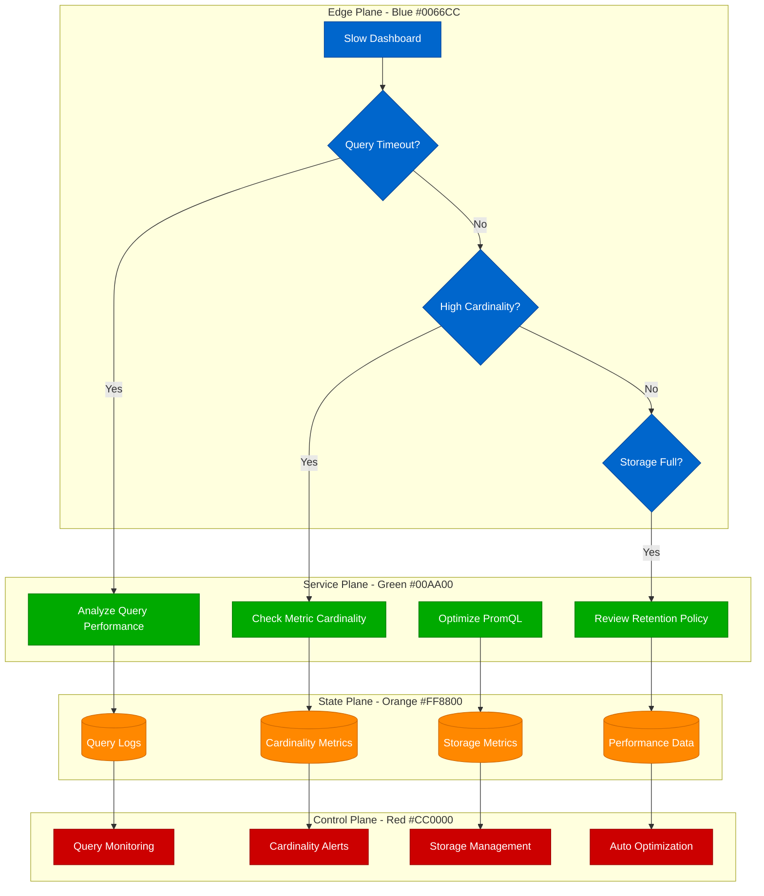
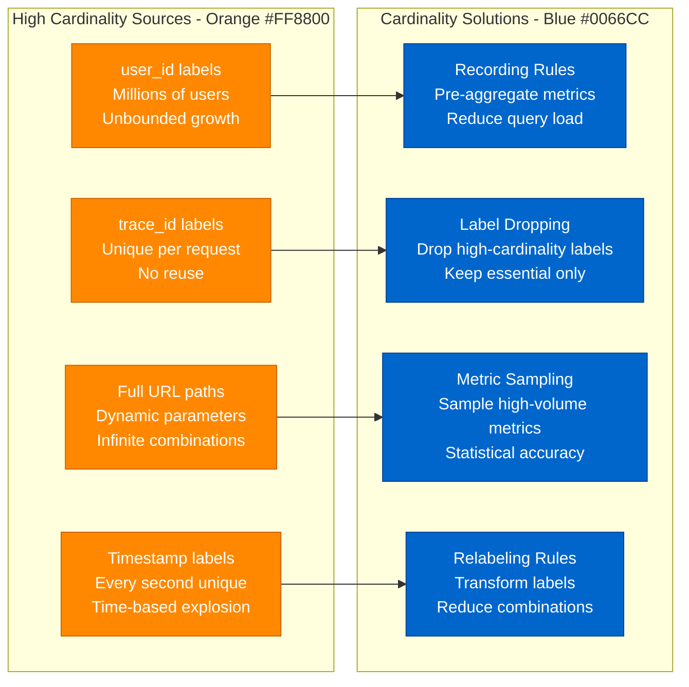

# Prometheus Query Optimization - Production Debugging Guide

## Overview

Prometheus query performance issues can cause dashboard timeouts, cardinality explosions, and monitoring system instability. This guide covers PromQL optimization, metric cardinality management, and storage efficiency for production monitoring systems.

## Debugging Flowchart



## Query Performance Analysis

### 1. Cardinality Investigation
```bash
# Check metric cardinality
curl 'http://prometheus:9090/api/v1/label/__name__/values' | jq '.data | length'

# Top high-cardinality metrics
curl 'http://prometheus:9090/api/v1/query?query=topk(10, count by (__name__)({__name__=~".+"}))'

# Check specific metric cardinality
curl 'http://prometheus:9090/api/v1/query?query=count by (__name__)({__name__="http_requests_total"})'

# Label cardinality analysis
curl 'http://prometheus:9090/api/v1/label/instance/values' | jq '.data | length'

# Series count per metric
promtool query instant 'http://prometheus:9090' 'prometheus_tsdb_symbol_table_size_bytes'

# Storage statistics
curl 'http://prometheus:9090/api/v1/query?query=prometheus_tsdb_head_series'
```

### 2. Query Performance Testing
```bash
# Test query performance
time curl 'http://prometheus:9090/api/v1/query_range?query=rate(http_requests_total[5m])&start=2024-01-01T00:00:00Z&end=2024-01-01T01:00:00Z&step=15s'

# Slow query detection
curl 'http://prometheus:9090/api/v1/query?query=prometheus_http_request_duration_seconds{quantile="0.99"}'

# Memory usage during queries
curl 'http://prometheus:9090/api/v1/query?query=process_resident_memory_bytes{job="prometheus"}'
```

## PromQL Optimization Patterns

### Query Optimization Matrix
```mermaid
graph TB
    subgraph SlowQueries[Slow Query Patterns - Red #CC0000]
        HIGH_CARD[High Cardinality<br/>http_requests_total{}<br/>1M+ series]
        WIDE_RANGE[Wide Time Range<br/>rate()[30d]<br/>Massive data scan]
        COMPLEX_REGEX[Complex Regex<br/>{job=~".*api.*"}<br/>Inefficient matching]
        NESTED_FUNCTIONS[Nested Functions<br/>avg(rate(sum()))<br/>Multiple aggregations]
    end

    subgraph OptimizedQueries[Optimized Patterns - Green #00AA00]
        FILTERED[Pre-filtered Queries<br/>http_requests_total{job="api"}<br/>Specific labels first]
        SHORTER_RANGE[Shorter Ranges<br/>rate()[5m]<br/>Reasonable windows]
        EXACT_MATCH[Exact Matching<br/>{job="api-server"}<br/>Precise selectors]
        SIMPLIFIED[Simplified Logic<br/>rate() then avg()<br/>Step-by-step aggregation]
    end

    HIGH_CARD --> FILTERED
    WIDE_RANGE --> SHORTER_RANGE
    COMPLEX_REGEX --> EXACT_MATCH
    NESTED_FUNCTIONS --> SIMPLIFIED

    classDef slowStyle fill:#CC0000,stroke:#990000,color:#fff
    classDef fastStyle fill:#00AA00,stroke:#007700,color:#fff

    class HIGH_CARD,WIDE_RANGE,COMPLEX_REGEX,NESTED_FUNCTIONS slowStyle
    class FILTERED,SHORTER_RANGE,EXACT_MATCH,SIMPLIFIED fastStyle
```

### Cardinality Management Strategy


## Real Production Examples

### Google's Prometheus Optimization
```yaml
# Google-style Prometheus configuration
global:
  scrape_interval: 15s
  evaluation_interval: 15s
  external_labels:
    cluster: 'production'
    region: 'us-central1'

# Recording rules for performance
rule_files:
  - "recording_rules.yml"
  - "alerting_rules.yml"

# Optimized scrape configs
scrape_configs:
- job_name: 'kubernetes-pods'
  kubernetes_sd_configs:
  - role: pod
  relabel_configs:
  # Drop high-cardinality labels
  - source_labels: [__meta_kubernetes_pod_annotation_prometheus_io_scrape]
    action: keep
    regex: true
  - source_labels: [__meta_kubernetes_pod_container_port_name]
    action: keep
    regex: metrics
  # Limit label values
  - source_labels: [__meta_kubernetes_pod_name]
    regex: '(.{0,50}).*'
    target_label: pod_name
    replacement: '${1}'
  # Drop unnecessary labels
  - regex: '__meta_kubernetes_pod_uid|__meta_kubernetes_pod_node_name'
    action: labeldrop

# Storage optimization
storage:
  tsdb:
    retention.time: 30d
    retention.size: 100GB
    min-block-duration: 2h
    max-block-duration: 25h
    no-lockfile: false
```

**Recording Rules for Performance:**
```yaml
# recording_rules.yml - Google-style aggregations
groups:
- name: performance.rules
  interval: 30s
  rules:
  # Pre-aggregate high-cardinality metrics
  - record: job:http_requests:rate5m
    expr: sum(rate(http_requests_total[5m])) by (job)

  - record: job:http_request_duration:p99
    expr: histogram_quantile(0.99, sum(rate(http_request_duration_seconds_bucket[5m])) by (job, le))

  # Node-level aggregations
  - record: node:cpu_utilization:avg
    expr: 1 - avg(rate(node_cpu_seconds_total{mode="idle"}[5m])) by (instance)

  - record: node:memory_utilization:ratio
    expr: 1 - (node_memory_MemAvailable_bytes / node_memory_MemTotal_bytes)

  # Application-specific rules
  - record: app:error_rate:5m
    expr: rate(http_requests_total{status=~"5.."}[5m]) / rate(http_requests_total[5m])

  - record: app:throughput:qps
    expr: sum(rate(http_requests_total[1m])) by (service)

- name: infrastructure.rules
  interval: 60s
  rules:
  # Infrastructure aggregations (less frequent)
  - record: cluster:cpu_usage:sum
    expr: sum(node:cpu_utilization:avg)

  - record: cluster:memory_usage:sum
    expr: sum(node_memory_MemTotal_bytes - node_memory_MemAvailable_bytes)

  # Cardinality monitoring
  - record: prometheus:cardinality:by_job
    expr: count by (job) ({__name__=~".+"})

  - record: prometheus:series_count:total
    expr: prometheus_tsdb_head_series
```

### Netflix's Query Optimization Strategy
```python
# Netflix-style PromQL optimization analyzer
import re
import requests
import time
from typing import Dict, List, Tuple
from dataclasses import dataclass

@dataclass
class QueryMetrics:
    query: str
    duration: float
    series_count: int
    cardinality: int
    recommendation: str

class PrometheusOptimizer:
    def __init__(self, prometheus_url: str):
        self.prometheus_url = prometheus_url
        self.optimization_rules = {
            r'rate\([^[]+\[[0-9]+[dh]\]': 'Use shorter time ranges for rate() - prefer 5m-1h',
            r'\{[^}]*=~"[^"]*\*[^"]*\*[^"]*"': 'Avoid complex regex patterns',
            r'(?:sum|avg|max|min)\s*\(\s*(?:sum|avg|max|min)': 'Avoid nested aggregations',
            r'\{[^}]*,\s*[^}]*,\s*[^}]*,\s*[^}]*,': 'Too many label filters may indicate high cardinality',
        }

    def analyze_query_performance(self, query: str) -> QueryMetrics:
        """Analyze query performance and provide optimization recommendations"""

        start_time = time.time()

        # Execute query to measure performance
        try:
            response = self.execute_query(query)
            duration = time.time() - start_time

            # Calculate metrics
            series_count = len(response.get('data', {}).get('result', []))
            cardinality = self.estimate_cardinality(query)
            recommendation = self.generate_recommendation(query, duration, series_count)

            return QueryMetrics(
                query=query,
                duration=duration,
                series_count=series_count,
                cardinality=cardinality,
                recommendation=recommendation
            )

        except Exception as e:
            return QueryMetrics(
                query=query,
                duration=time.time() - start_time,
                series_count=0,
                cardinality=0,
                recommendation=f"Query failed: {str(e)}"
            )

    def execute_query(self, query: str) -> Dict:
        """Execute PromQL query"""
        url = f"{self.prometheus_url}/api/v1/query"
        params = {'query': query}

        response = requests.get(url, params=params, timeout=30)
        response.raise_for_status()

        return response.json()

    def estimate_cardinality(self, query: str) -> int:
        """Estimate query cardinality"""
        # Extract metric name from query
        metric_match = re.search(r'([a-zA-Z_][a-zA-Z0-9_]*)', query)
        if not metric_match:
            return 0

        metric_name = metric_match.group(1)

        # Query cardinality for this metric
        cardinality_query = f'count by (__name__)({{__name__="{metric_name}"}})'

        try:
            response = self.execute_query(cardinality_query)
            result = response.get('data', {}).get('result', [])
            if result and result[0].get('value'):
                return int(float(result[0]['value'][1]))
        except:
            pass

        return 0

    def generate_recommendation(self, query: str, duration: float, series_count: int) -> str:
        """Generate optimization recommendations"""
        recommendations = []

        # Performance-based recommendations
        if duration > 5.0:
            recommendations.append("Query is slow (>5s) - consider optimizing")

        if series_count > 10000:
            recommendations.append("High series count - add more specific label filters")

        # Pattern-based recommendations
        for pattern, recommendation in self.optimization_rules.items():
            if re.search(pattern, query):
                recommendations.append(recommendation)

        # Specific optimizations
        if 'rate(' in query and '[' in query:
            time_range_match = re.search(r'\[([0-9]+)([smhd])\]', query)
            if time_range_match:
                value, unit = time_range_match.groups()
                if unit in ['h', 'd'] and int(value) > 1:
                    recommendations.append("Consider shorter time ranges for better performance")

        if len(re.findall(r'\{[^}]+\}', query)) > 1:
            recommendations.append("Multiple label selectors - ensure they're efficiently ordered")

        return '; '.join(recommendations) if recommendations else "Query appears optimized"

    def optimize_query(self, query: str) -> str:
        """Suggest optimized version of query"""
        optimized = query

        # Apply automatic optimizations
        optimizations = [
            # Replace long time ranges with shorter ones
            (r'rate\(([^[]+)\[([0-9]+)[dh]\]', lambda m: f'rate({m.group(1)}[5m]'),

            # Simplify regex patterns
            (r'=~"([^"]*\*[^"]*)"', lambda m: '="exact_match"' if '*' in m.group(1) else m.group(0)),

            # Move specific labels first
            (r'\{([^,}]+,[^}]+)\}', self._reorder_labels),
        ]

        for pattern, replacement in optimizations:
            if callable(replacement):
                optimized = re.sub(pattern, replacement, optimized)
            else:
                optimized = re.sub(pattern, replacement, optimized)

        return optimized

    def _reorder_labels(self, match):
        """Reorder labels to put most selective first"""
        labels_str = match.group(1)
        labels = [label.strip() for label in labels_str.split(',')]

        # Sort by selectivity (exact matches first, then others)
        def label_selectivity(label):
            if '=' in label and '~' not in label:
                return 0  # Exact match - most selective
            elif '!=' in label:
                return 1  # Negative match - moderately selective
            else:
                return 2  # Regex match - least selective

        sorted_labels = sorted(labels, key=label_selectivity)
        return '{' + ', '.join(sorted_labels) + '}'

    def analyze_dashboard_queries(self, dashboard_config: Dict) -> List[QueryMetrics]:
        """Analyze all queries in a Grafana dashboard"""
        queries = self.extract_queries_from_dashboard(dashboard_config)
        results = []

        for query in queries:
            if query.strip():  # Skip empty queries
                result = self.analyze_query_performance(query)
                results.append(result)

        return results

    def extract_queries_from_dashboard(self, dashboard_config: Dict) -> List[str]:
        """Extract PromQL queries from Grafana dashboard JSON"""
        queries = []

        panels = dashboard_config.get('panels', [])
        for panel in panels:
            targets = panel.get('targets', [])
            for target in targets:
                expr = target.get('expr', '')
                if expr:
                    queries.append(expr)

        return queries

    def generate_optimization_report(self, query_metrics: List[QueryMetrics]) -> str:
        """Generate comprehensive optimization report"""
        report = ["Prometheus Query Optimization Report", "=" * 40, ""]

        # Summary statistics
        total_queries = len(query_metrics)
        slow_queries = len([q for q in query_metrics if q.duration > 2.0])
        high_cardinality = len([q for q in query_metrics if q.cardinality > 100000])

        report.extend([
            f"Total queries analyzed: {total_queries}",
            f"Slow queries (>2s): {slow_queries}",
            f"High cardinality queries (>100k series): {high_cardinality}",
            ""
        ])

        # Top issues
        report.extend(["Top Performance Issues:", "-" * 25])

        sorted_by_duration = sorted(query_metrics, key=lambda x: x.duration, reverse=True)
        for i, metric in enumerate(sorted_by_duration[:5]):
            report.extend([
                f"{i+1}. Duration: {metric.duration:.2f}s, Series: {metric.series_count}",
                f"   Query: {metric.query[:80]}...",
                f"   Recommendation: {metric.recommendation}",
                ""
            ])

        return "\n".join(report)

# Usage example
optimizer = PrometheusOptimizer("http://prometheus:9090")

# Analyze specific query
query = 'rate(http_requests_total{job=~".*api.*"}[1h])'
metrics = optimizer.analyze_query_performance(query)
print(f"Query performance: {metrics.duration:.2f}s")
print(f"Recommendation: {metrics.recommendation}")

# Optimize query
optimized_query = optimizer.optimize_query(query)
print(f"Original: {query}")
print(f"Optimized: {optimized_query}")
```

## Prevention and Best Practices

### 1. Cardinality Monitoring Script
```bash
#!/bin/bash
# Prometheus cardinality monitoring

PROMETHEUS_URL="http://prometheus:9090"
CARDINALITY_THRESHOLD=100000
QUERY_TIMEOUT=30

check_overall_cardinality() {
    echo "=== Overall Cardinality Check ==="

    total_series=$(curl -s "${PROMETHEUS_URL}/api/v1/query?query=prometheus_tsdb_head_series" | jq -r '.data.result[0].value[1]')
    echo "Total active series: $total_series"

    if [ "$total_series" -gt $CARDINALITY_THRESHOLD ]; then
        echo "⚠️  High cardinality detected!"
        return 1
    else
        echo "✅ Cardinality within limits"
        return 0
    fi
}

check_metric_cardinality() {
    echo "=== Top High-Cardinality Metrics ==="

    curl -s "${PROMETHEUS_URL}/api/v1/query?query=topk(10, count by (__name__)({__name__=~\".+\"}))" | \
    jq -r '.data.result[] | "\(.metric.__name__): \(.value[1]) series"' | \
    while read line; do
        metric_name=$(echo $line | cut -d: -f1)
        series_count=$(echo $line | cut -d: -f2 | tr -d ' series')

        if [ "$series_count" -gt 10000 ]; then
            echo "⚠️  $line"
        else
            echo "✅ $line"
        fi
    done
}

check_label_cardinality() {
    echo "=== Label Cardinality Analysis ==="

    # Check high-cardinality labels
    high_cardinality_labels=("instance" "pod" "container" "job")

    for label in "${high_cardinality_labels[@]}"; do
        count=$(curl -s "${PROMETHEUS_URL}/api/v1/label/$label/values" | jq '.data | length')
        echo "$label: $count unique values"

        if [ "$count" -gt 1000 ]; then
            echo "⚠️  High cardinality label: $label"
        fi
    done
}

# Main execution
echo "Prometheus Cardinality Check - $(date)"
echo "======================================"

check_overall_cardinality
echo ""
check_metric_cardinality
echo ""
check_label_cardinality

echo ""
echo "Check complete."
```

This comprehensive Prometheus query optimization guide provides systematic approaches to identifying and resolving performance issues, cardinality explosions, and storage efficiency problems in production monitoring systems.