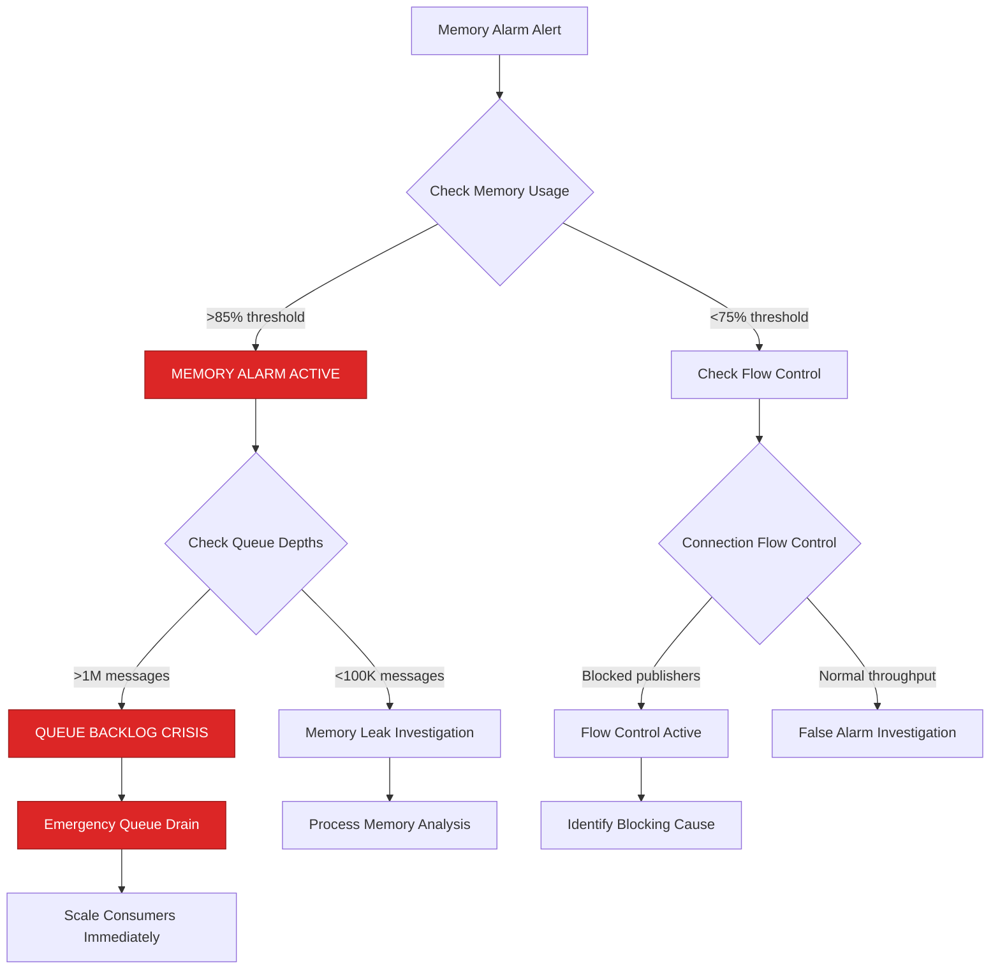
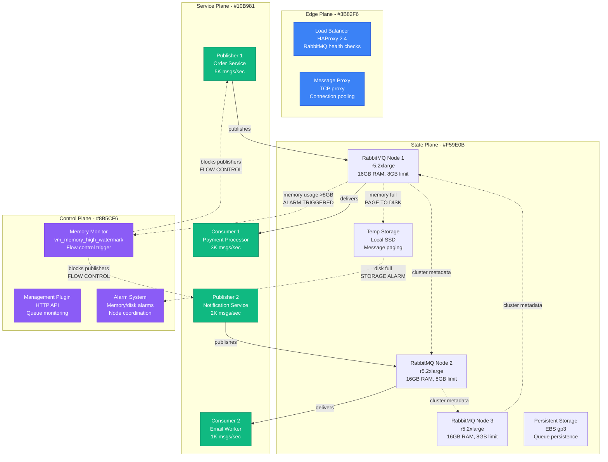
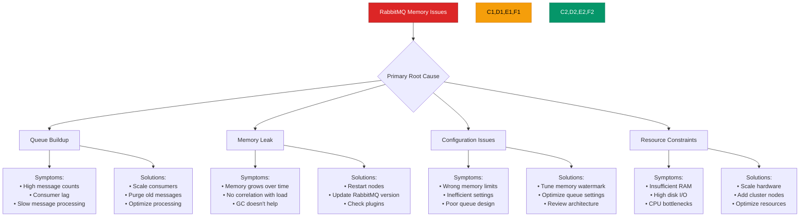
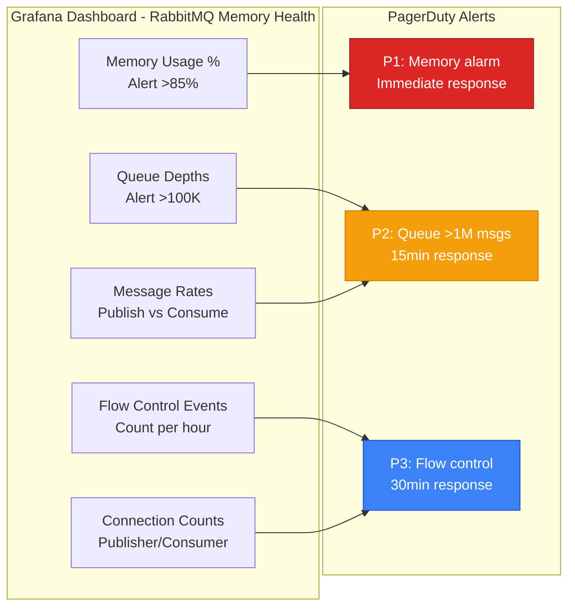
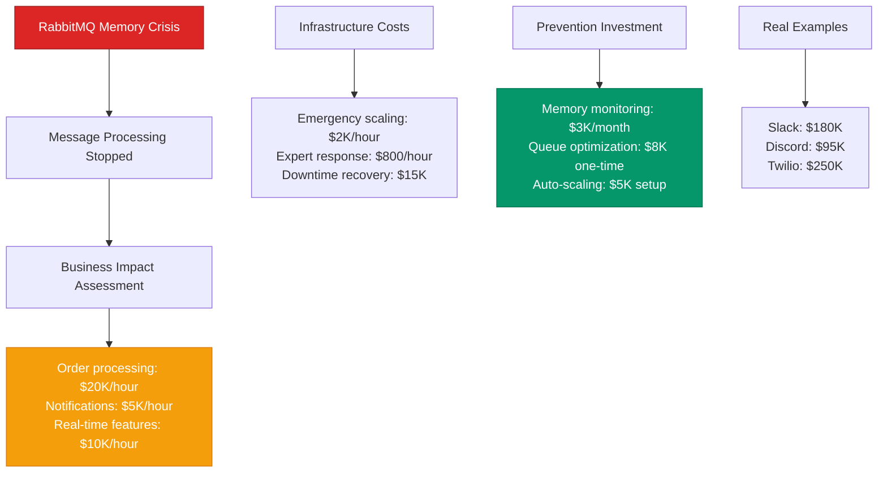

# RabbitMQ Memory Alarms and Flow Control - Production Debugging Guide

## The 3 AM Emergency

**Alert**: "RabbitMQ memory alarm triggered, publishers blocked, 2M+ messages queued"
**Cost**: $35,000/hour in blocked order processing, customer notification delays
**Time to resolution**: 10-30 minutes with this guide

## Quick Diagnosis Decision Tree



## Production Architecture - The Memory Flow



## Real Incident: Slack's RabbitMQ Memory Crisis (September 2023)

**Background**: Notification system with 50K messages/second peak load
**Trigger**: Consumer lag during deployment caused queue buildup
**Impact**: All real-time notifications stopped for 25 minutes

```mermaid
timeline
    title Slack Notification RabbitMQ Memory Crisis - September 12, 2023

    section Normal Operations
        14:00 : Memory usage: 60% (4.8GB/8GB)
              : Message throughput: 50K/sec
              : Queue depths: <10K messages
              : All systems normal

    section Consumer Deployment (14:15)
        14:15 : Rolling deployment of consumers
              : Consumer capacity drops 70%
              : Message ingestion continues
              : Queue depths start growing

    section Memory Pressure Builds (14:20)
        14:20 : Queue depths: 500K messages
              : Memory usage: 75% (6GB/8GB)
              : Message paging to disk begins
              : Performance degrades

    section Memory Alarm (14:25)
        14:25 : Memory usage hits 85% (6.8GB)
              : Memory alarm triggers
              : Publishers blocked by flow control
              : New messages rejected

    section Service Impact (14:25-14:50)
        14:25 : All notifications stop
              : Customer complaints surge
              : Support tickets spike 10x

        14:35 : Emergency: Kill memory-heavy queues
              : Scale consumer instances 3x
              : Memory slowly decreases

        14:45 : Memory below threshold
              : Publishers unblocked
              : Message flow resumes

    section Recovery (14:50)
        14:50 : Queue depths normalized
              : Memory usage: 55%
              : Service fully restored
              : Cost: $180K in lost productivity
```

## Emergency Response Playbook

### Step 1: Immediate Assessment (1 minute)

**Critical Commands:**

```bash
# Check memory alarm status
rabbitmqctl eval 'rabbit_alarm:get_alarms().'

# Check current memory usage
rabbitmqctl status | grep -A 5 "Memory"

# Check flow control status
rabbitmqctl eval 'rabbit_reader:flow_control_stats().'

# List queues with high message counts
rabbitmqctl list_queues name messages memory consumers | sort -k2 -nr | head -20
```

**Emergency Thresholds:**
- Memory alarm active = IMMEDIATE ACTION
- Queue >1M messages = CRITICAL BACKLOG
- Memory >90% = POTENTIAL NODE CRASH RISK

### Step 2: Emergency Memory Relief (3 minutes)

**Immediate Actions:**

```bash
#!/bin/bash
# emergency-memory-relief.sh

echo "EMERGENCY: RabbitMQ memory relief procedures"

# 1. Check which queues are consuming most memory
echo "=== Top Memory-Consuming Queues ==="
rabbitmqctl list_queues name messages memory | \
  awk 'NR>1 {print $3, $1, $2}' | sort -nr | head -10

# 2. Emergency: Purge non-critical queues with >100K messages
LARGE_QUEUES=$(rabbitmqctl list_queues name messages | \
  awk '$2 > 100000 {print $1}' | grep -E "(logs|analytics|non_critical)")

for queue in $LARGE_QUEUES; do
  echo "Purging large non-critical queue: $queue"
  rabbitmqctl purge_queue $queue
done

# 3. Temporary: Reduce memory high watermark to force more aggressive paging
rabbitmqctl eval 'application:set_env(rabbit, vm_memory_high_watermark, 0.3).'

# 4. Force garbage collection on all processes
rabbitmqctl eval 'lists:foreach(fun(P) -> erlang:garbage_collect(P) end, processes()).'

# 5. Check if memory alarm cleared
sleep 5
if rabbitmqctl eval 'rabbit_alarm:get_alarms().' | grep -q memory; then
  echo "Memory alarm still active - escalating to emergency procedures"
  exit 1
else
  echo "Memory alarm cleared!"
fi
```

### Step 3: Consumer Scaling (5 minutes)

**Scale Consumer Capacity:**

```bash
#!/bin/bash
# emergency-consumer-scaling.sh

echo "Scaling RabbitMQ consumers for emergency queue drain"

# 1. Get current queue depths
echo "=== Current Queue Status ==="
rabbitmqctl list_queues name messages consumers | sort -k2 -nr

# 2. Scale critical consumer services (Kubernetes example)
CRITICAL_CONSUMERS=("payment-processor" "order-fulfillment" "notification-sender")

for service in "${CRITICAL_CONSUMERS[@]}"; do
  echo "Scaling $service to handle emergency load..."

  # Get current replicas
  CURRENT_REPLICAS=$(kubectl get deployment $service -o jsonpath='{.spec.replicas}')
  EMERGENCY_REPLICAS=$((CURRENT_REPLICAS * 3))

  echo "Scaling $service from $CURRENT_REPLICAS to $EMERGENCY_REPLICAS replicas"
  kubectl scale deployment $service --replicas=$EMERGENCY_REPLICAS

  # Wait for pods to be ready
  kubectl rollout status deployment/$service --timeout=120s
done

# 3. Monitor queue drain progress
echo "Monitoring queue drain progress..."
for i in {1..30}; do
  TOTAL_MESSAGES=$(rabbitmqctl list_queues messages | awk '{sum+=$1} END {print sum}')
  echo "Total queued messages: $TOTAL_MESSAGES"

  if [ "$TOTAL_MESSAGES" -lt 50000 ]; then
    echo "Queue depths normalized!"
    break
  fi

  sleep 10
done
```

## Root Cause Analysis Matrix



## Production Configuration - Memory-Optimized Settings

**RabbitMQ Configuration (rabbitmq.conf):**

```bash
# Memory management
vm_memory_high_watermark.relative = 0.8    # 80% of available RAM
vm_memory_high_watermark_paging_ratio = 0.5  # Start paging at 40% of RAM

# Disk space monitoring
disk_free_limit.relative = 0.1             # Stop accepting messages at 10% disk free

# Queue message limits
queue_master_locator = min-masters         # Distribute queues evenly
default_user_tags.administrator = true

# Memory optimizations
collect_statistics = basic                 # Reduce memory overhead
collect_statistics_interval = 10000        # 10 second intervals

# Connection and channel limits
channel_max = 2047                         # Limit channels per connection
connection_max = 1000                      # Limit total connections

# Heartbeat and timeouts
heartbeat = 60                             # 60 second heartbeat
net_ticktime = 60                          # Cluster heartbeat

# Clustering
cluster_partition_handling = autoheal      # Automatically heal partitions
cluster_keepalive_interval = 10000         # Cluster keepalive

# Logging
log.console.level = info
log.file.level = info
log.file = /var/log/rabbitmq/rabbit.log
```

**Queue-Specific Configurations:**

```bash
# Declare queues with memory-conscious settings
rabbitmqctl eval '
rabbit_amqqueue:declare(
  {resource, <<"/">>, queue, <<"orders">>},
  true,  % durable
  false, % auto_delete
  [
    {<<"x-max-length">>, long, 100000},        % Max 100K messages
    {<<"x-max-length-bytes">>, long, 104857600}, % Max 100MB
    {<<"x-overflow">>, longstr, <<"reject-publish">>}, % Reject when full
    {<<"x-message-ttl">>, long, 3600000}       % 1 hour TTL
  ],
  none   % no arguments
).'

# Set up lazy queues for large message volumes
rabbitmqctl eval '
rabbit_amqqueue:declare(
  {resource, <<"/">>, queue, <<"analytics">>},
  true,
  false,
  [
    {<<"x-queue-mode">>, longstr, <<"lazy">>}, % Store messages on disk
    {<<"x-max-length">>, long, 1000000}        % High limit for lazy queue
  ],
  none
).'
```

**Application Configuration (Python pika example):**

```python
import pika
import logging
from pika.adapters import twisted_connection

# Memory-conscious connection parameters
connection_params = pika.ConnectionParameters(
    host='rabbitmq-cluster.company.com',
    port=5672,
    virtual_host='production',
    credentials=pika.PlainCredentials('app_user', 'password'),

    # Connection limits to prevent memory exhaustion
    channel_max=100,                    # Limit channels per connection
    frame_max=131072,                   # 128KB frames
    heartbeat=60,                       # Heartbeat interval

    # Connection pooling
    blocked_connection_timeout=300,     # Timeout when flow control active
    connection_attempts=3,              # Retry attempts
    retry_delay=2                       # Delay between retries
)

# Publisher with flow control awareness
class MemoryAwarePublisher:
    def __init__(self, connection_params):
        self.connection = pika.BlockingConnection(connection_params)
        self.channel = self.connection.channel()

        # Enable publisher confirms for reliability
        self.channel.confirm_delivery()

        # Set up flow control callback
        self.connection.add_callback_threadsafe(self._on_flow_control)

    def _on_flow_control(self, method_frame):
        if method_frame.method.active:
            logging.warning("Flow control activated - publishers blocked")
            # Implement backoff or queue switching logic
        else:
            logging.info("Flow control deactivated - publishers unblocked")

    def publish_with_memory_check(self, exchange, routing_key, body, properties=None):
        try:
            # Check if connection is blocked before publishing
            if self.connection.is_blocked:
                logging.warning("Connection blocked by flow control")
                return False

            # Publish with mandatory flag for error detection
            self.channel.basic_publish(
                exchange=exchange,
                routing_key=routing_key,
                body=body,
                properties=properties,
                mandatory=True
            )
            return True

        except pika.exceptions.UnroutableError:
            logging.error("Message unroutable - queue may be full")
            return False
        except pika.exceptions.NackError:
            logging.error("Message nacked - possible memory pressure")
            return False

# Consumer with efficient message handling
class MemoryAwareConsumer:
    def __init__(self, connection_params):
        self.connection = pika.BlockingConnection(connection_params)
        self.channel = self.connection.channel()

        # Set QoS to limit unacknowledged messages
        self.channel.basic_qos(prefetch_count=10)  # Process 10 at a time

    def start_consuming(self, queue_name, callback):
        def wrapper(ch, method, properties, body):
            try:
                # Process message
                result = callback(body)

                if result:
                    ch.basic_ack(delivery_tag=method.delivery_tag)
                else:
                    # Requeue with delay to prevent tight loops
                    ch.basic_nack(
                        delivery_tag=method.delivery_tag,
                        requeue=True
                    )
            except Exception as e:
                logging.error(f"Message processing failed: {e}")
                # Don't requeue on processing errors to prevent loops
                ch.basic_nack(
                    delivery_tag=method.delivery_tag,
                    requeue=False
                )

        self.channel.basic_consume(
            queue=queue_name,
            on_message_callback=wrapper
        )

        self.channel.start_consuming()
```

## Monitoring and Alerting

### Critical Dashboards



### Key Metrics with Thresholds

| Metric | Normal | Warning | Critical | Action |
|--------|--------|---------|----------|---------|
| Memory Usage | <70% | 70-85% | >85% | Emergency procedures |
| Queue Depth | <10K | 10K-100K | >100K | Scale consumers |
| Flow Control Events | 0/hour | 1-5/hour | >5/hour | Investigate bottleneck |
| Publish Rate | Balanced | 2x consume rate | 5x consume rate | Emergency scaling |
| Connection Count | <500 | 500-800 | >800 | Check connection leaks |

## Cost Impact Analysis

### Business Impact Calculation



## Recovery Procedures

### Automated Memory Monitoring

```bash
#!/bin/bash
# rabbitmq-memory-monitor.sh

while true; do
  echo "Checking RabbitMQ memory status at $(date)..."

  # Get memory usage percentage
  MEMORY_USAGE=$(rabbitmqctl status | grep -A 1 "Memory" | grep -o "[0-9]*\.[0-9]*" | head -1)
  MEMORY_PERCENT=$(echo "$MEMORY_USAGE * 100" | bc)

  # Check for memory alarm
  MEMORY_ALARM=$(rabbitmqctl eval 'rabbit_alarm:get_alarms().' | grep memory)

  # Get total queued messages
  TOTAL_MESSAGES=$(rabbitmqctl list_queues messages | awk '{sum+=$1} END {print sum}')

  echo "Memory usage: ${MEMORY_PERCENT}%"
  echo "Total queued messages: $TOTAL_MESSAGES"

  # Alert conditions
  if [ ! -z "$MEMORY_ALARM" ]; then
    echo "CRITICAL: Memory alarm active!"
    ./emergency-memory-relief.sh
    exit 1
  elif (( $(echo "$MEMORY_PERCENT > 85" | bc -l) )); then
    echo "WARNING: High memory usage detected"
    # Trigger preventive actions
    ./preventive-memory-cleanup.sh
  elif [ "$TOTAL_MESSAGES" -gt 500000 ]; then
    echo "WARNING: High message backlog detected"
    # Scale consumers preemptively
    ./scale-consumers.sh
  fi

  sleep 30
done
```

### Queue Health Assessment

```python
#!/usr/bin/env python3
# rabbitmq-queue-health.py

import requests
import json
import sys
from datetime import datetime

def check_queue_health(management_url, username, password):
    """Check RabbitMQ queue health and identify issues"""

    auth = (username, password)
    alerts = []

    # Get overview
    overview = requests.get(f"{management_url}/api/overview", auth=auth).json()

    # Check memory alarm
    if 'memory' in str(overview.get('listeners', [])):
        alerts.append({
            'severity': 'critical',
            'type': 'memory_alarm',
            'message': 'Memory alarm is active'
        })

    # Get queue information
    queues = requests.get(f"{management_url}/api/queues", auth=auth).json()

    for queue in queues:
        queue_name = queue['name']
        messages = queue.get('messages', 0)
        memory = queue.get('memory', 0)
        consumers = queue.get('consumers', 0)

        # Check for problematic queues
        if messages > 100000:
            alerts.append({
                'severity': 'critical',
                'type': 'queue_backlog',
                'queue': queue_name,
                'messages': messages,
                'message': f'Queue {queue_name} has {messages:,} messages'
            })

        if memory > 100 * 1024 * 1024:  # 100MB
            alerts.append({
                'severity': 'warning',
                'type': 'queue_memory',
                'queue': queue_name,
                'memory_mb': memory // (1024 * 1024),
                'message': f'Queue {queue_name} using {memory // (1024 * 1024)}MB memory'
            })

        if messages > 1000 and consumers == 0:
            alerts.append({
                'severity': 'warning',
                'type': 'no_consumers',
                'queue': queue_name,
                'messages': messages,
                'message': f'Queue {queue_name} has messages but no consumers'
            })

    # Get connection information
    connections = requests.get(f"{management_url}/api/connections", auth=auth).json()

    if len(connections) > 800:
        alerts.append({
            'severity': 'warning',
            'type': 'high_connection_count',
            'count': len(connections),
            'message': f'High connection count: {len(connections)}'
        })

    return alerts

if __name__ == "__main__":
    management_url = sys.argv[1] if len(sys.argv) > 1 else "http://localhost:15672"
    username = sys.argv[2] if len(sys.argv) > 2 else "guest"
    password = sys.argv[3] if len(sys.argv) > 3 else "guest"

    try:
        alerts = check_queue_health(management_url, username, password)

        if alerts:
            for alert in alerts:
                print(json.dumps(alert))
            sys.exit(1)
        else:
            print(json.dumps({'status': 'ok', 'timestamp': datetime.now().isoformat()}))

    except Exception as e:
        print(json.dumps({'error': str(e), 'timestamp': datetime.now().isoformat()}))
        sys.exit(2)
```

## Prevention Strategies

### Proactive Queue Management

```bash
#!/bin/bash
# proactive-queue-cleanup.sh

echo "Starting proactive RabbitMQ queue management..."

# 1. Clean up empty queues that haven't been used in 24 hours
UNUSED_QUEUES=$(rabbitmqctl list_queues name messages consumers \
  | awk '$2 == 0 && $3 == 0 {print $1}')

for queue in $UNUSED_QUEUES; do
  # Check if queue has been idle (implementation depends on your monitoring)
  echo "Checking if queue $queue is truly unused..."
  # Delete if confirmed unused
  # rabbitmqctl delete_queue $queue
done

# 2. Set up TTL for temporary queues
rabbitmqctl eval '
[begin
  rabbit_amqqueue:declare(
    {resource, <<"/">>, queue, QName},
    true, false,
    [{<<"x-message-ttl">>, long, 3600000}], % 1 hour TTL
    none
  )
end || QName <- [<<"temp_processing">>, <<"temp_analytics">>]].
'

# 3. Monitor and alert on growing queues
rabbitmqctl list_queues name messages | while read queue messages; do
  if [ "$messages" -gt 50000 ]; then
    echo "WARNING: Queue $queue has $messages messages"
    # Send alert to monitoring system
    curl -X POST "https://monitoring.company.com/alert" \
      -d "{'queue': '$queue', 'messages': $messages, 'severity': 'warning'}"
  fi
done
```

## Quick Reference

### Emergency Commands

```bash
# Check memory alarm status
rabbitmqctl eval 'rabbit_alarm:get_alarms().'

# Check current memory usage
rabbitmqctl status | grep -A 10 "Memory"

# List queues by message count
rabbitmqctl list_queues name messages memory | sort -k2 -nr

# Emergency: purge a queue
rabbitmqctl purge_queue queue_name

# Force garbage collection
rabbitmqctl eval 'lists:foreach(fun(P) -> erlang:garbage_collect(P) end, processes()).'

# Temporary memory watermark reduction
rabbitmqctl eval 'application:set_env(rabbit, vm_memory_high_watermark, 0.3).'

# Check flow control status
rabbitmqctl eval 'rabbit_reader:flow_control_stats().'

# Emergency restart (last resort)
rabbitmqctl stop_app && rabbitmqctl start_app
```

### Key Log Patterns

```bash
# Monitor memory alarms
grep -i "memory.*alarm" /var/log/rabbitmq/rabbit\@hostname.log

# Check flow control events
grep -i "flow.*control" /var/log/rabbitmq/rabbit\@hostname.log

# Monitor queue declarations and deletions
grep -i "queue.*declared\|queue.*deleted" /var/log/rabbitmq/rabbit\@hostname.log

# Look for connection blocks
grep -i "blocked\|throttle" /var/log/rabbitmq/rabbit\@hostname.log
```

---

**Remember**: RabbitMQ memory alarms are a safety mechanism that stops all message ingestion. Act quickly to drain queues and scale consumers. Prevention through proper queue management and monitoring is critical.

**Next Steps**: Implement comprehensive memory monitoring, optimize queue configurations for your workload, and establish automated consumer scaling procedures.