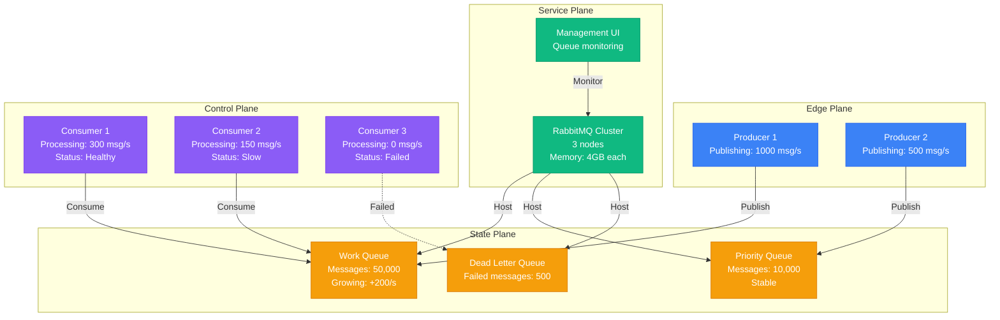

# RabbitMQ Queue Buildup Debugging

**Scenario**: Production RabbitMQ queues accumulating messages faster than consumers can process them, causing memory pressure and system instability.

**The 3 AM Reality**: Message queues growing exponentially, consumers falling behind, and potential message loss due to memory limits.

## Symptoms Checklist

- [ ] Queue length continuously increasing
- [ ] High memory usage on RabbitMQ nodes
- [ ] Consumer processing lag increasing
- [ ] Dead letter queue accumulation
- [ ] Cluster node failures due to resource exhaustion

## RabbitMQ Queue Buildup Architecture



## Critical Commands & Analysis

### Queue Analysis
```bash
# Check queue status and message counts
rabbitmqctl list_queues name messages consumers memory

# Monitor queue rates
rabbitmqctl list_queues name messages_ready messages_unacknowledged message_stats.publish_details.rate message_stats.deliver_details.rate

# Check memory usage
rabbitmqctl status | grep -A 5 memory

# Monitor cluster status
rabbitmqctl cluster_status
```

### Consumer Analysis
```bash
# Check consumer details
rabbitmqctl list_consumers queue_name channel consumer_tag ack_required

# Monitor consumer utilization
rabbitmqctl eval 'rabbit_mgmt_util:consumers().'

# Check connection details
rabbitmqctl list_connections name state channels
```

## Common Root Causes & Solutions

### 1. Slow Consumer Processing (50% of cases)
```python
# Detection: Monitor consumer performance
import pika
import time
import logging

class ConsumerMonitor:
    def __init__(self):
        self.processed_count = 0
        self.start_time = time.time()

    def process_message(self, ch, method, properties, body):
        start = time.time()

        # Your message processing logic
        result = self.handle_message(body)

        processing_time = time.time() - start
        self.processed_count += 1

        # Log slow messages
        if processing_time > 5.0:
            logging.warning(f"Slow message processing: {processing_time}s")

        # Calculate throughput
        if self.processed_count % 100 == 0:
            elapsed = time.time() - self.start_time
            rate = self.processed_count / elapsed
            logging.info(f"Processing rate: {rate:.2f} msg/s")

        ch.basic_ack(delivery_tag=method.delivery_tag)

# Solution: Optimize processing and scale consumers
# 1. Profile and optimize message handling
# 2. Implement parallel processing
# 3. Scale consumer instances
```

### 2. Producer Rate Exceeds Consumer Capacity (30% of cases)
```bash
# Monitor rates via Management API
curl -u guest:guest http://localhost:15672/api/queues/%2F/work_queue | \
    jq '.message_stats.publish_details.rate, .message_stats.deliver_details.rate'

# Implement flow control
rabbitmqctl set_policy flow-control ".*" '{"max-length":10000}' --apply-to queues

# Add more consumers
for i in {1..5}; do
    nohup python consumer.py &
done
```

### 3. Dead Letter Queue Accumulation (15% of cases)
```bash
# Check DLQ status
rabbitmqctl list_queues name messages | grep dlq

# Analyze failed message patterns
# Via Management UI: http://localhost:15672/#/queues/%2F/failed_queue

# Reprocess DLQ messages
python dlq_reprocessor.py
```

### 4. Memory Limits and Disk Space (3% of cases)
```bash
# Check memory alarms
rabbitmqctl status | grep mem_alarm

# Monitor disk space
rabbitmqctl status | grep disk_free

# Increase memory watermark
rabbitmqctl set_vm_memory_high_watermark 0.6  # 60% of available memory
```

### 5. Network Partitions (2% of cases)
```bash
# Check cluster partition status
rabbitmqctl cluster_status | grep partitions

# Recover from partition
rabbitmqctl stop_app
rabbitmqctl join_cluster rabbit@primary-node
rabbitmqctl start_app
```

## Immediate Mitigation

### Emergency Response
```bash
# Stop message publishing temporarily
rabbitmqctl set_policy temp-stop ".*" '{"max-length":0}' --apply-to queues

# Purge problematic queue (DATA LOSS)
rabbitmqctl purge_queue work_queue

# Add emergency consumers
for i in {1..10}; do
    nohup python emergency_consumer.py &
done

# Increase memory limits
rabbitmqctl set_vm_memory_high_watermark 0.8
```

## Production Examples

### Spotify's Message Queue Crisis (2020)
- **Incident**: Playlist update queue backed up to 2M messages
- **Root Cause**: Consumer processing slowed due to database lock contention
- **Impact**: Playlist changes delayed by 2+ hours
- **Resolution**: Fixed database queries, scaled consumers horizontally
- **Prevention**: Added queue depth monitoring and auto-scaling

### Uber's Ride Matching Queue (2019)
- **Incident**: Ride request queue growing during surge periods
- **Root Cause**: Matching algorithm taking longer during high demand
- **Impact**: Ride matching delays, customer complaints
- **Resolution**: Optimized matching algorithm, implemented priority queues
- **Learning**: Queue processing must scale with business logic complexity

**Remember**: RabbitMQ queue buildup usually indicates a mismatch between production and consumption rates. Focus on consumer performance, implement proper monitoring, and have auto-scaling mechanisms ready for traffic spikes.