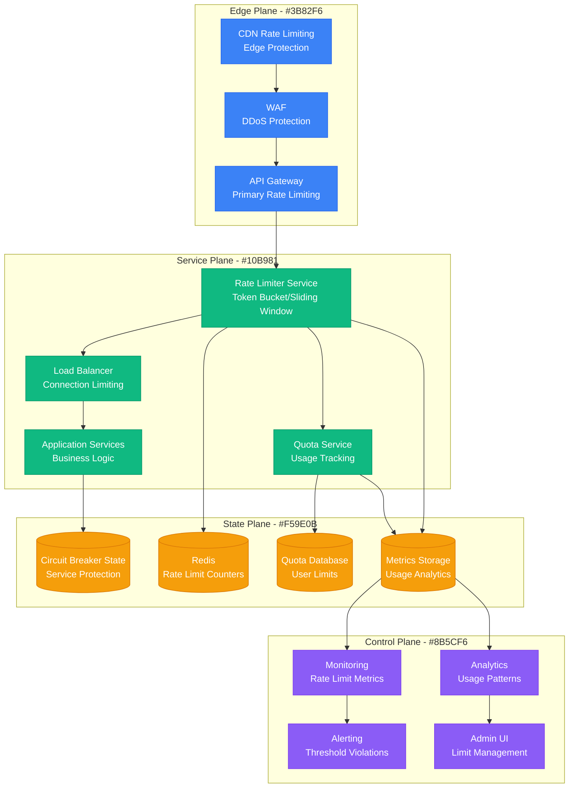

# Rate Limiting Debugging - Bottleneck Identification and Resolution

## Overview

This guide provides systematic approaches to debugging rate limiting issues and identifying bottlenecks in distributed systems. Based on production experiences from Twitter's API rate limiting, GitHub's abuse prevention, and Shopify's API throttling.

## Architecture Context



## Rate Limiting Debug Commands

### Redis Rate Limit Counter Analysis
```bash
# Check current rate limit counters
redis-cli KEYS "rate_limit:*"
redis-cli GET "rate_limit:user:12345:api_calls"
redis-cli TTL "rate_limit:user:12345:api_calls"

# Monitor rate limit operations in real-time
redis-cli MONITOR | grep rate_limit

# Check rate limit configuration
redis-cli HGETALL "rate_limit_config:api_endpoint"

# Analyze memory usage of rate limit keys
redis-cli --bigkeys | grep rate_limit
```

### API Gateway Rate Limit Investigation
```bash
# Check nginx rate limiting (if using nginx)
nginx -T | grep limit_req

# Monitor nginx rate limit logs
tail -f /var/log/nginx/error.log | grep "limiting requests"

# Check current connection limits
ss -tuln | grep :443
netstat -an | grep :443 | wc -l
```

## Production Examples

### Twitter API: Request Rate Analysis
```python
class TwitterRateLimitAnalyzer:
    def __init__(self, redis_client):
        self.redis = redis_client

    def analyze_user_rate_limits(self, user_id: str) -> dict:
        """Analyze rate limiting for specific user"""
        endpoints = ['tweets', 'followers', 'search', 'upload']
        analysis = {}

        for endpoint in endpoints:
            key = f"rate_limit:{user_id}:{endpoint}"
            current_count = self.redis.get(key) or 0
            ttl = self.redis.ttl(key)
            
            # Get rate limit configuration
            config_key = f"rate_limit_config:{endpoint}"
            limit = self.redis.hget(config_key, 'limit') or 'Unknown'
            window = self.redis.hget(config_key, 'window') or 'Unknown'
            
            analysis[endpoint] = {
                'current_usage': int(current_count),
                'limit': limit,
                'window_seconds': window,
                'time_until_reset': ttl,
                'usage_percentage': (int(current_count) / int(limit) * 100) if limit != 'Unknown' else 0
            }

        return analysis

    def identify_rate_limit_bottlenecks(self) -> dict:
        """Identify system-wide rate limiting bottlenecks"""
        # Get all rate limit keys
        keys = self.redis.keys('rate_limit:*')
        
        endpoint_stats = {}
        user_stats = {}
        
        for key in keys:
            parts = key.split(':')
            if len(parts) >= 3:
                user_id = parts[1]
                endpoint = parts[2]
                
                current_count = int(self.redis.get(key) or 0)
                
                # Aggregate by endpoint
                if endpoint not in endpoint_stats:
                    endpoint_stats[endpoint] = {'total_requests': 0, 'unique_users': set()}
                endpoint_stats[endpoint]['total_requests'] += current_count
                endpoint_stats[endpoint]['unique_users'].add(user_id)
                
                # Track high-usage users
                if user_id not in user_stats:
                    user_stats[user_id] = {'total_requests': 0, 'endpoints': []}
                user_stats[user_id]['total_requests'] += current_count
                user_stats[user_id]['endpoints'].append(endpoint)
        
        # Convert sets to counts
        for endpoint in endpoint_stats:
            endpoint_stats[endpoint]['unique_users'] = len(endpoint_stats[endpoint]['unique_users'])
        
        # Identify top users by usage
        top_users = sorted(user_stats.items(), key=lambda x: x[1]['total_requests'], reverse=True)[:10]
        
        return {
            'endpoint_statistics': endpoint_stats,
            'top_users_by_usage': top_users,
            'total_active_users': len(user_stats)
        }
```

### GitHub API: Abuse Detection
```go
package main

import (
    "context"
    "fmt"
    "time"
    "github.com/go-redis/redis/v8"
)

type GitHubRateLimitDebugger struct {
    redis *redis.Client
    ctx   context.Context
}

func (g *GitHubRateLimitDebugger) AnalyzeAbusePatterns() (map[string]interface{}, error) {
    // Get all rate limit violations in the last hour
    violationKeys, err := g.redis.Keys(g.ctx, "abuse:*").Result()
    if err != nil {
        return nil, err
    }

    abuseStats := make(map[string]interface{})
    ipViolations := make(map[string]int)
    endpointViolations := make(map[string]int)
    timeDistribution := make(map[int]int)

    for _, key := range violationKeys {
        // Extract IP and endpoint from key format: abuse:ip:endpoint:timestamp
        parts := strings.Split(key, ":")
        if len(parts) >= 4 {
            ip := parts[1]
            endpoint := parts[2]
            timestamp, _ := strconv.ParseInt(parts[3], 10, 64)
            
            ipViolations[ip]++
            endpointViolations[endpoint]++
            
            // Time distribution (hourly buckets)
            hour := int(timestamp / 3600)
            timeDistribution[hour]++
        }
    }

    // Identify repeat offenders
    repeatOffenders := make([]string, 0)
    for ip, violations := range ipViolations {
        if violations > 10 { // Threshold for repeat offender
            repeatOffenders = append(repeatOffenders, ip)
        }
    }

    abuseStats["total_violations"] = len(violationKeys)
    abuseStats["unique_ips"] = len(ipViolations)
    abuseStats["repeat_offenders"] = repeatOffenders
    abuseStats["endpoint_violations"] = endpointViolations
    abuseStats["time_distribution"] = timeDistribution

    return abuseStats, nil
}

func (g *GitHubRateLimitDebugger) CheckUserQuotaUsage(userID string) (map[string]interface{}, error) {
    quotaInfo := make(map[string]interface{})
    
    // Check different API categories
    categories := []string{"core", "search", "graphql", "integration_manifest"}
    
    for _, category := range categories {
        quotaKey := fmt.Sprintf("quota:%s:%s", userID, category)
        
        // Get current usage
        usage, err := g.redis.Get(g.ctx, quotaKey).Int()
        if err != nil && err != redis.Nil {
            return nil, err
        }
        
        // Get quota limit
        limitKey := fmt.Sprintf("quota_limit:%s:%s", userID, category)
        limit, err := g.redis.Get(g.ctx, limitKey).Int()
        if err != nil && err != redis.Nil {
            // Default limits if not set
            switch category {
            case "core":
                limit = 5000
            case "search":
                limit = 30
            case "graphql":
                limit = 5000
            default:
                limit = 1000
            }
        }
        
        // Get reset time
        resetKey := fmt.Sprintf("quota_reset:%s:%s", userID, category)
        resetTime, _ := g.redis.Get(g.ctx, resetKey).Int64()
        
        quotaInfo[category] = map[string]interface{}{
            "usage":            usage,
            "limit":            limit,
            "remaining":        limit - usage,
            "usage_percentage": float64(usage) / float64(limit) * 100,
            "reset_time":       resetTime,
            "seconds_until_reset": resetTime - time.Now().Unix(),
        }
    }
    
    return quotaInfo, nil
}
```

## Monitoring and Alerting

### Prometheus Metrics
```yaml
groups:
- name: rate_limiting_alerts
  rules:
  - alert: HighRateLimitUtilization
    expr: |
      (
        rate_limit_requests_total / rate_limit_max_requests
      ) * 100 > 80
    for: 5m
    labels:
      severity: warning
    annotations:
      summary: "High rate limit utilization"
      description: "Rate limit utilization is {{ $value }}% for {{ $labels.endpoint }}"

  - alert: RateLimitExceeded
    expr: increase(rate_limit_exceeded_total[5m]) > 100
    for: 1m
    labels:
      severity: critical
    annotations:
      summary: "Rate limit frequently exceeded"
      description: "{{ $value }} rate limit violations in 5 minutes"

  - alert: UnusualTrafficSpike
    expr: |
      (
        rate(api_requests_total[5m]) / 
        rate(api_requests_total[1h] offset 1h)
      ) > 5
    for: 2m
    labels:
      severity: warning
    annotations:
      summary: "Unusual traffic spike detected"
      description: "Traffic is {{ $value }}x higher than usual"
```

## Success Metrics

- **Rate Limit Accuracy**: > 99.9% correct enforcement
- **False Positive Rate**: < 0.1% legitimate requests blocked
- **Rate Limit Response Time**: < 10ms overhead
- **System Availability**: > 99.95% during traffic spikes
- **Abuse Detection Rate**: > 95% of malicious traffic blocked

## The 3 AM Test

**Scenario**: Your API is rejecting legitimate user requests with 429 errors, but some high-volume users seem to be bypassing limits entirely. Customer complaints are flooding in about service unavailability.

**This guide provides**:
1. **Immediate triage**: Commands to check rate limit counter states and identify configuration issues
2. **Bottleneck analysis**: Tools to identify which limits are triggering and why
3. **Usage pattern analysis**: Scripts to understand traffic patterns and abuse vectors
4. **Quick fixes**: Emergency rate limit adjustments and bypass procedures
5. **Long-term solutions**: Proper rate limiting architecture and monitoring

**Expected outcome**: Rate limiting issues identified within 10 minutes, emergency fixes applied within 30 minutes, proper limits tuned and monitoring improved within 4 hours.