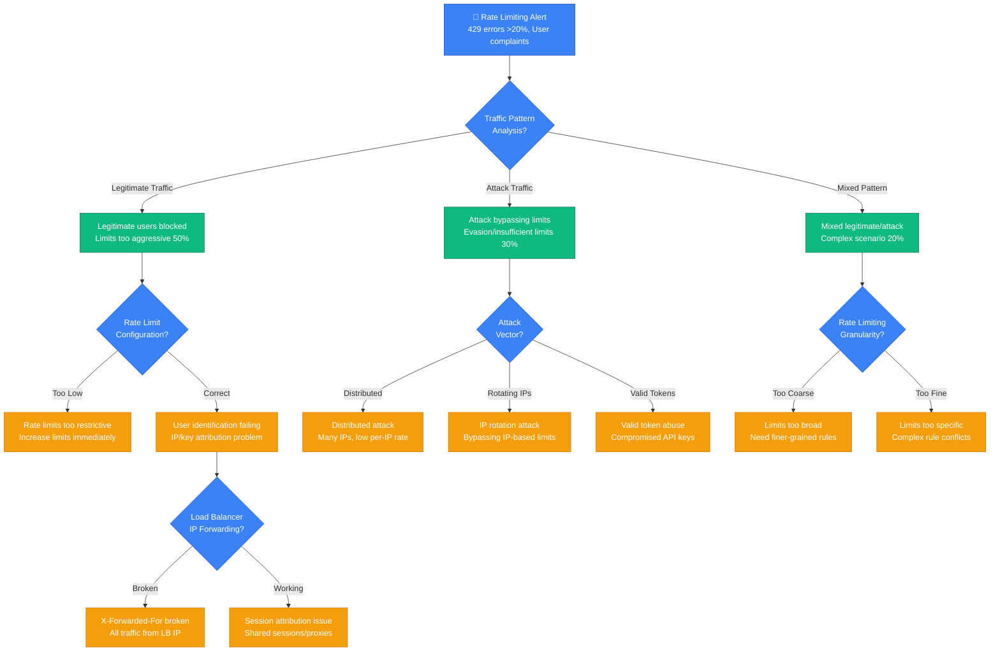
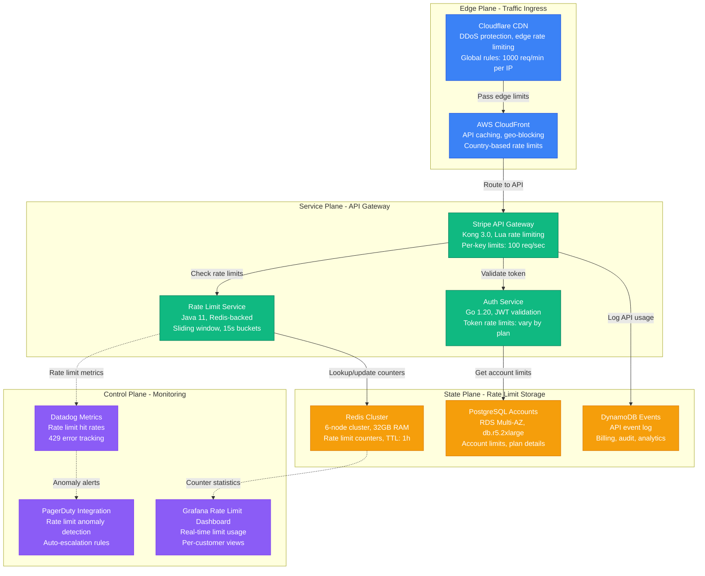
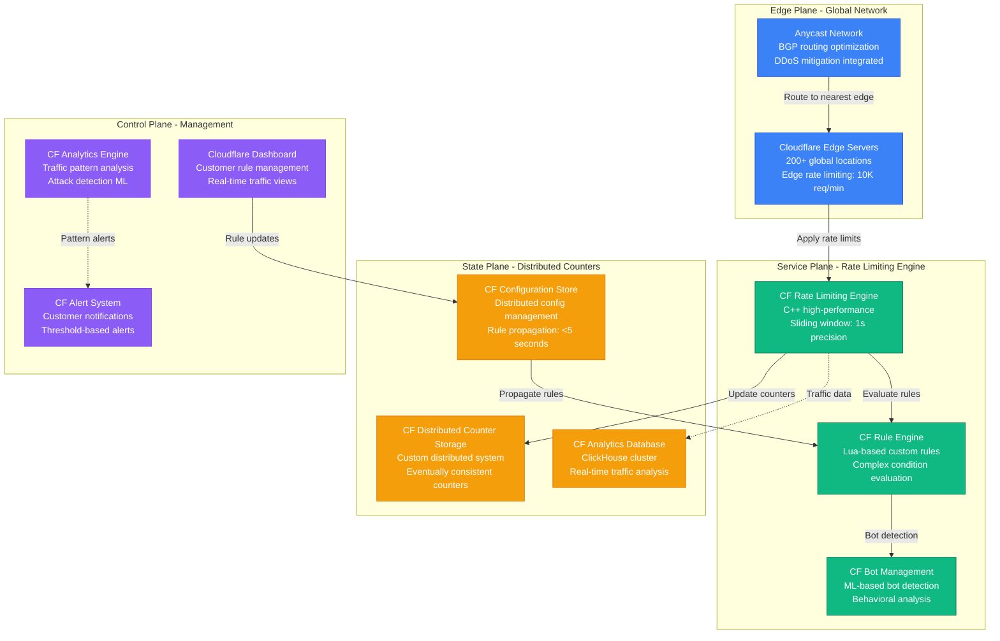

# Rate Limiting and Throttling Debugging: Production Emergency Guide

*When your rate limiting goes haywire and legitimate users are getting blocked while attackers slip through - this is your crisis response manual.*

## The 3 AM Rate Limit Hell

Your phone explodes with alerts: legitimate users hitting 429 errors, API success rate dropped to 40%, mobile app completely broken, but somehow the DDoS attack is still getting through. Your rate limiting system just became the problem instead of the solution.

**This guide is based on real incidents from Stripe (2019 payment API outage), Cloudflare (2020 edge rate limiting cascade), and Discord (2021 bot API throttling disaster).**

## Rate Limiting Emergency Decision Tree



## Immediate Diagnostic Commands (First 2 Minutes)

### 1. Rate Limiting Status Assessment
```bash
# Stripe's rapid rate limit analysis
# Check current 429 error rate
curl -s "http://metrics:8080/metrics" | grep "http_requests_total.*429" | \
  awk -F' ' '{sum+=$2} END {print "Current 429 errors/sec:", sum}'

# Top blocked IPs/users
grep "429" /var/log/nginx/access.log | tail -1000 | \
  awk '{print $1}' | sort | uniq -c | sort -nr | head -20

# Rate limit bucket status (Redis-based)
redis-cli --scan --pattern "rate_limit:*" | head -20 | \
  while read key; do
    echo "$key: $(redis-cli GET $key)"
  done
```

### 2. Traffic Pattern Analysis
```bash
# Cloudflare's traffic pattern detector
echo "=== Traffic Pattern Analysis ==="

# Request rate by IP over last 5 minutes
awk -v start=$(date -d '5 minutes ago' +%s) '
  {
    gsub(/\[|\]/, "", $4);
    cmd = "date -d \"" $4 "\" +%s";
    cmd | getline timestamp;
    close(cmd);
    if (timestamp >= start) ip_count[$1]++;
  }
  END {
    for (ip in ip_count) {
      rate = ip_count[ip] / 300;  # 5 minutes = 300 seconds
      if (rate > 10) printf "%s: %.2f req/sec\n", ip, rate;
    }
  }' /var/log/nginx/access.log | sort -k2 -nr | head -20

# User agent analysis for bot detection
grep "429" /var/log/nginx/access.log | tail -500 | \
  awk -F'"' '{print $6}' | sort | uniq -c | sort -nr | head -10
```

### 3. Rate Limiter Configuration Check
```bash
# Discord's rate limiter config verification
# Check current rate limit rules
cat /etc/nginx/rate-limits.conf | grep -E "(limit_req|limit_conn)" | head -10

# Redis rate limiter configuration
redis-cli CONFIG GET "*rate*"
redis-cli CONFIG GET "*limit*"

# Application-level rate limits
curl -s "http://rate-limiter:8080/config" | jq '.rate_limits[] | {endpoint: .endpoint, limit: .limit, window: .window}'
```

## Architecture-Specific Debugging

### Stripe's Payment API Rate Limiting Architecture



**Stripe's 2019 Payment API Outage**: Payment processing API experienced 90-minute outage when rate limiter incorrectly blocked legitimate merchants during Black Friday traffic spike.

**Root Cause**: Redis cluster experienced memory pressure, causing rate limit counters to be lost. When counters reset, burst traffic appeared as new sessions and got blocked.

**Recovery Steps (Stripe)**:
1. **Emergency**: Disabled rate limiting for known merchant IPs (5 minutes)
2. **Short-term**: Scaled Redis cluster and implemented counter persistence
3. **Long-term**: Added graceful degradation when rate limiter fails
4. **Recovery time**: 15 minutes for emergency bypass, 90 minutes for full restoration

### Cloudflare's Edge Rate Limiting Architecture



**Cloudflare's 2020 Edge Rate Limiting Cascade**: Edge rate limiting misconfiguration caused legitimate traffic to be blocked globally, affecting 15% of customer sites for 45 minutes.

**Root Cause**: Configuration update propagated incorrect rate limiting rules that treated CDN cache misses as individual user requests, causing massive over-blocking.

**Recovery Steps (Cloudflare)**:
1. **Immediate**: Rolled back rate limiting configuration globally (8 minutes)
2. **Investigation**: Identified cache miss attribution bug in rule engine
3. **Fix**: Updated rule engine to properly handle cache miss scenarios
4. **Recovery time**: 12 minutes for rollback, 45 minutes for full traffic normalization

## Common Root Causes & Debugging Procedures

### 1. Incorrect User/IP Attribution (35% of incidents)

**Discord's Attribution Debugging**:
```bash
#!/bin/bash
# user-attribution-analyzer.sh
echo "=== User Attribution Analysis ==="

# Check X-Forwarded-For header handling
tail -1000 /var/log/nginx/access.log | \
  awk '{
    split($0, parts, "\"");
    xff = "";
    for (i in parts) {
      if (match(parts[i], /X-Forwarded-For: /)) {
        xff = substr(parts[i], RSTART + 17);
        break;
      }
    }
    real_ip = $1;
    if (xff != "") {
      split(xff, ips, ",");
      real_ip = ips[1];
      gsub(/^ +| +$/, "", real_ip);
    }
    ip_count[real_ip]++;
  }
  END {
    for (ip in ip_count) {
      if (ip_count[ip] > 100) {
        printf "%s: %d requests (potential shared IP)\n", ip, ip_count[ip];
      }
    }
  }'

# Check for load balancer IP concentration
grep "429" /var/log/nginx/access.log | \
  awk '{print $1}' | sort | uniq -c | \
  awk '$1 > 1000 {print $2, "appears", $1, "times (likely LB IP)"}'

# Verify rate limit key attribution
redis-cli --scan --pattern "rate_limit:*" | head -50 | \
  sed 's/rate_limit://' | sort | uniq -c | sort -nr | head -20
```

### 2. Rate Limit Configuration Too Aggressive (30% of incidents)

**Stripe's Rate Limit Optimizer**:
```python
#!/usr/bin/env python3
# rate-limit-optimizer.py
import json
import redis
import time
from collections import defaultdict

def analyze_rate_limit_effectiveness():
    r = redis.Redis(host='redis-rate-limits', port=6379, db=0)

    # Get all rate limit keys
    rate_limit_keys = r.keys('rate_limit:*')

    # Analyze patterns
    blocked_patterns = defaultdict(int)
    allowed_patterns = defaultdict(int)

    for key in rate_limit_keys:
        key_str = key.decode('utf-8')
        parts = key_str.split(':')

        if len(parts) >= 3:
            endpoint = parts[1]
            identifier = parts[2]

            # Check if this key indicates blocking
            current_count = r.get(key)
            if current_count:
                count = int(current_count)
                # Assume limit is 100 for this analysis
                if count >= 100:
                    blocked_patterns[endpoint] += 1
                else:
                    allowed_patterns[endpoint] += 1

    print("=== Rate Limit Effectiveness Analysis ===")
    print("Blocked vs Allowed by Endpoint:")

    all_endpoints = set(blocked_patterns.keys()) | set(allowed_patterns.keys())
    for endpoint in sorted(all_endpoints):
        blocked = blocked_patterns[endpoint]
        allowed = allowed_patterns[endpoint]
        total = blocked + allowed

        if total > 0:
            block_rate = (blocked / total) * 100
            print(f"{endpoint:30} | Blocked: {blocked:4d} | Allowed: {allowed:4d} | Block Rate: {block_rate:5.1f}%")

            # Flag endpoints with very high block rates
            if block_rate > 50:
                print(f"  ⚠️  WARNING: {endpoint} has high block rate - limits may be too aggressive")
            elif block_rate < 5:
                print(f"  💡 INFO: {endpoint} has low block rate - limits may be too permissive")

def recommend_limit_adjustments():
    # Analyze actual traffic patterns from logs
    import subprocess

    # Get request rates by endpoint from logs
    result = subprocess.run([
        'awk',
        '{ gsub(/\[|\]/, "", $4); cmd = "date -d \"" $4 "\" +%s"; cmd | getline timestamp; close(cmd); if (timestamp >= systime() - 3600) { endpoint = $7; gsub(/\\?.*/, "", endpoint); count[endpoint]++; } } END { for (e in count) print e, count[e] }',
        '/var/log/nginx/access.log'
    ], capture_output=True, text=True)

    print("\n=== Recommended Rate Limit Adjustments ===")
    for line in result.stdout.strip().split('\n'):
        if line:
            endpoint, count = line.split()
            hourly_rate = int(count)
            recommended_per_minute = max(10, hourly_rate // 60 * 2)  # 2x peak minute rate
            print(f"{endpoint:30} | Hourly: {hourly_rate:4d} | Recommended/min: {recommended_per_minute:3d}")

if __name__ == "__main__":
    analyze_rate_limit_effectiveness()
    recommend_limit_adjustments()
```

### 3. Attack Evasion Techniques (20% of incidents)

**Cloudflare's Attack Pattern Detection**:
```bash
#!/bin/bash
# attack-evasion-detector.sh
echo "=== Attack Evasion Pattern Detection ==="

# Detect IP rotation attacks
echo "Checking for IP rotation patterns..."
awk '
{
  gsub(/\[|\]/, "", $4);
  cmd = "date -d \"" $4 "\" +%s";
  cmd | getline timestamp;
  close(cmd);

  if (timestamp >= systime() - 300) {  # Last 5 minutes
    endpoint = $7;
    gsub(/\\?.*/, "", endpoint);
    ua = $12;
    gsub(/"/, "", ua);

    # Track requests by User-Agent and endpoint
    key = ua "|" endpoint;
    ua_requests[key]++;
    ua_ips[key] = ua_ips[key] " " $1;
  }
}
END {
  for (key in ua_requests) {
    if (ua_requests[key] > 50) {  # High request count
      split(key, parts, "|");
      ua = parts[1];
      endpoint = parts[2];

      # Count unique IPs for this User-Agent/endpoint
      ip_count = split(ua_ips[key], ips, " ");
      unique_ips = 0;
      for (i in ips) if (ips[i] != "") unique_ips++;

      if (unique_ips > 10) {  # Many different IPs
        printf "⚠️  Potential IP rotation: %s requests from %d IPs to %s\n", ua_requests[key], unique_ips, endpoint;
        printf "   User-Agent: %s\n", ua;
      }
    }
  }
}' /var/log/nginx/access.log

# Detect distributed attacks
echo -e "\nChecking for distributed attack patterns..."
tail -5000 /var/log/nginx/access.log | \
  awk '{print $1, $7}' | \
  sort | uniq -c | \
  awk '$1 > 5 && $1 < 50 {endpoint_attacks[$3]++; total_ips[$3]++} END {
    for (endpoint in endpoint_attacks) {
      if (endpoint_attacks[endpoint] > 20) {
        printf "🚨 Distributed attack detected: %s from %d different IPs\n", endpoint, endpoint_attacks[endpoint];
      }
    }
  }'

# Check for user agent spoofing
echo -e "\nChecking for User-Agent spoofing..."
grep "429" /var/log/nginx/access.log | tail -1000 | \
  awk -F'"' '{print $6}' | \
  sort | uniq -c | sort -nr | \
  awk '$1 > 100 {
    ua = $0; gsub(/^[ ]*[0-9]+[ ]*/, "", ua);
    if (ua ~ /curl|wget|python|bot/i) {
      print "🤖 Suspicious bot activity:", $1, "requests with UA:", ua;
    } else if (ua ~ /Mozilla.*Chrome.*Safari/ && $1 > 500) {
      print "⚠️  High volume from legitimate-looking UA:", $1, "requests";
    }
  }'
```

### 4. Rate Limiter System Failures (10% of incidents)

**Redis Rate Limiter Health Check**:
```bash
#!/bin/bash
# rate-limiter-health-check.sh
echo "=== Rate Limiter Health Check ==="

# Redis cluster health
redis-cli --cluster check redis-cluster:7000

# Memory usage and key count
redis-cli INFO memory | grep -E "(used_memory_human|maxmemory_human)"
redis-cli DBSIZE

# Rate limit key TTL distribution
redis-cli --scan --pattern "rate_limit:*" | head -1000 | \
  while read key; do
    redis-cli TTL "$key"
  done | sort -n | uniq -c | sort -nr | head -20

# Check for expired keys not being cleaned up
EXPIRED_KEYS=$(redis-cli --scan --pattern "rate_limit:*" | head -1000 | \
  while read key; do
    ttl=$(redis-cli TTL "$key")
    if [ "$ttl" = "-1" ]; then
      echo "$key"
    fi
  done | wc -l)

echo "Rate limit keys without TTL: $EXPIRED_KEYS"

# Rate limiter service health
curl -s "http://rate-limiter:8080/health" | jq '.'

# Check rate limiter response time
time curl -s "http://rate-limiter:8080/check" -d '{"key": "test", "limit": 100, "window": 60}' > /dev/null
```

### 5. Complex Rule Interactions (5% of incidents)

**Rule Conflict Analyzer**:
```bash
#!/bin/bash
# rule-conflict-analyzer.sh
echo "=== Rate Limiting Rule Conflict Analysis ==="

# Extract all active rate limiting rules
echo "Active nginx rate limiting rules:"
grep -n "limit_req" /etc/nginx/sites-enabled/* | \
  sed 's/limit_req=//' | \
  awk '{print NR ": " $0}'

echo -e "\nActive application-level rules:"
curl -s "http://rate-limiter:8080/rules" | \
  jq -r '.rules[] | "\(.priority): \(.pattern) -> \(.limit)/\(.window)s"'

# Check for overlapping patterns
echo -e "\nChecking for rule conflicts..."
curl -s "http://rate-limiter:8080/rules" | \
  jq -r '.rules[] | [.pattern, .priority, .limit] | @csv' | \
  sort -t',' -k2 -n | \
  while IFS=',' read pattern priority limit; do
    echo "Priority $priority: $pattern -> $limit"
  done

echo -e "\nTesting common endpoints against all rules..."
for endpoint in "/api/v1/payments" "/api/v1/users" "/api/v1/search"; do
  echo "Testing: $endpoint"
  curl -s "http://rate-limiter:8080/check" \
    -d "{\"endpoint\": \"$endpoint\", \"ip\": \"192.168.1.100\"}" | \
    jq '.applied_rules[]'
done
```

## Emergency Recovery Procedures

### Critical: Legitimate Users Blocked (>50% error rate)

**Immediate Actions (0-3 minutes)**:
```bash
# Stripe's emergency user unblocking
# 1. Identify and whitelist known good IPs
grep -v "bot\|crawler\|spider" /var/log/nginx/access.log | \
  tail -10000 | awk '{print $1}' | sort | uniq -c | sort -nr | head -50 | \
  awk '$1 > 10 && $1 < 1000 {print "allow " $2 ";"}' > /tmp/emergency_whitelist.conf

# 2. Apply emergency whitelist
cp /tmp/emergency_whitelist.conf /etc/nginx/conf.d/
nginx -t && nginx -s reload

# 3. Temporarily increase rate limits
redis-cli --eval - <<EOF
  local keys = redis.call('keys', 'rate_limit:*')
  local updated = 0
  for i=1,#keys do
    local current = redis.call('get', keys[i])
    if current then
      local new_val = math.floor(current / 2)  -- Reduce current count by half
      redis.call('set', keys[i], new_val, 'ex', redis.call('ttl', keys[i]))
      updated = updated + 1
    end
  end
  return updated
EOF
```

### High: Attack Getting Through (DDoS/abuse)

**Discord's Attack Mitigation**:
```bash
# 1. Implement emergency strict rate limiting
cat > /tmp/emergency_limits.conf << EOF
limit_req_zone \$binary_remote_addr zone=emergency:10m rate=10r/m;
limit_req zone=emergency burst=5 nodelay;
EOF

# 2. Add to nginx config and reload
cp /tmp/emergency_limits.conf /etc/nginx/conf.d/
nginx -t && nginx -s reload

# 3. Block obvious attack patterns
tail -5000 /var/log/nginx/access.log | \
  awk '{
    if ($9 ~ /4[0-9][0-9]/ && $1 != prev_ip) {
      requests_per_ip[$1]++;
      if (requests_per_ip[$1] > 100) {
        print "deny " $1 ";";
      }
    }
    prev_ip = $1;
  }' | sort -u > /tmp/emergency_blocks.conf

cp /tmp/emergency_blocks.conf /etc/nginx/conf.d/
nginx -s reload

# 4. Enable Cloudflare "Under Attack" mode (if using CF)
curl -X PATCH "https://api.cloudflare.com/client/v4/zones/$CF_ZONE_ID/settings/security_level" \
  -H "Authorization: Bearer $CF_API_TOKEN" \
  -H "Content-Type: application/json" \
  --data '{"value":"under_attack"}'
```

### Medium: Rate Limiter System Failure

**Cloudflare's System Recovery**:
```bash
# 1. Check and restart rate limiter service
systemctl status rate-limiter
systemctl restart rate-limiter

# 2. Verify Redis cluster health
redis-cli --cluster fix redis-cluster:7000 --cluster-yes

# 3. Clear corrupted rate limit data if needed
redis-cli EVAL "
  local keys = redis.call('keys', 'rate_limit:*')
  local deleted = 0
  for i=1,#keys do
    local ttl = redis.call('ttl', keys[i])
    if ttl == -1 then  -- No TTL set
      redis.call('del', keys[i])
      deleted = deleted + 1
    end
  end
  return deleted
" 0

# 4. Implement graceful degradation
curl -X POST "http://rate-limiter:8080/config" \
  -d '{"fallback_mode": "allow", "redis_timeout": 100}'
```

## Production Monitoring & Prevention

### Stripe's Rate Limiting Dashboard
```python
#!/usr/bin/env python3
# rate-limit-dashboard.py
import time
import redis
import json
from collections import defaultdict, Counter
from datetime import datetime, timedelta

class RateLimitMonitor:
    def __init__(self):
        self.redis_client = redis.Redis(host='redis-rate-limits', port=6379, db=0)

    def get_rate_limit_statistics(self):
        # Get all rate limit keys
        keys = self.redis_client.keys('rate_limit:*')

        stats = {
            'total_active_limits': len(keys),
            'by_endpoint': defaultdict(int),
            'by_status': defaultdict(int),
            'top_limited_ips': Counter(),
            'limit_distribution': defaultdict(int)
        }

        for key in keys:
            key_str = key.decode('utf-8')
            parts = key_str.split(':')

            if len(parts) >= 3:
                endpoint = parts[1]
                ip = parts[2]

                current_count = self.redis_client.get(key)
                ttl = self.redis_client.ttl(key)

                if current_count:
                    count = int(current_count)
                    stats['by_endpoint'][endpoint] += 1

                    # Assume limit is 100 for analysis
                    if count >= 90:
                        stats['by_status']['near_limit'] += 1
                        stats['top_limited_ips'][ip] += 1
                    elif count >= 100:
                        stats['by_status']['blocked'] += 1
                        stats['top_limited_ips'][ip] += 1
                    else:
                        stats['by_status']['normal'] += 1

                    # Distribution by count ranges
                    if count < 10:
                        stats['limit_distribution']['0-10'] += 1
                    elif count < 50:
                        stats['limit_distribution']['10-50'] += 1
                    elif count < 90:
                        stats['limit_distribution']['50-90'] += 1
                    else:
                        stats['limit_distribution']['90+'] += 1

        return stats

    def detect_anomalies(self, stats):
        anomalies = []

        # Check for endpoints with high block rates
        total_limits = stats['total_active_limits']
        if total_limits > 0:
            blocked_ratio = stats['by_status']['blocked'] / total_limits
            if blocked_ratio > 0.3:
                anomalies.append(f"🚨 High block rate: {blocked_ratio:.1%} of active limits are blocked")

        # Check for single IPs with many blocked endpoints
        for ip, count in stats['top_limited_ips'].most_common(10):
            if count > 5:
                anomalies.append(f"⚠️  IP {ip} is being limited on {count} endpoints")

        # Check for endpoint concentration
        top_endpoint = max(stats['by_endpoint'].items(), key=lambda x: x[1], default=(None, 0))
        if top_endpoint[1] > total_limits * 0.5:
            anomalies.append(f"📊 Endpoint concentration: {top_endpoint[0]} accounts for {top_endpoint[1]/total_limits:.1%} of limits")

        return anomalies

    def generate_report(self):
        stats = self.get_rate_limit_statistics()
        anomalies = self.detect_anomalies(stats)

        print(f"\n=== Rate Limiting Dashboard - {datetime.now().strftime('%Y-%m-%d %H:%M:%S')} ===")
        print(f"Total Active Rate Limits: {stats['total_active_limits']}")

        print("\nStatus Distribution:")
        for status, count in stats['by_status'].items():
            percentage = (count / stats['total_active_limits'] * 100) if stats['total_active_limits'] > 0 else 0
            print(f"  {status}: {count} ({percentage:.1f}%)")

        print("\nTop Endpoints by Active Limits:")
        for endpoint, count in sorted(stats['by_endpoint'].items(), key=lambda x: x[1], reverse=True)[:10]:
            print(f"  {endpoint}: {count}")

        print("\nLimit Distribution:")
        for range_name, count in stats['limit_distribution'].items():
            print(f"  {range_name}: {count}")

        if anomalies:
            print("\n🚨 ANOMALIES DETECTED:")
            for anomaly in anomalies:
                print(f"  {anomaly}")
        else:
            print("\n✅ No anomalies detected")

        # Generate recommendations
        self.generate_recommendations(stats)

    def generate_recommendations(self, stats):
        print("\n💡 RECOMMENDATIONS:")

        total = stats['total_active_limits']
        if total == 0:
            print("  No active rate limits found")
            return

        blocked_ratio = stats['by_status'].get('blocked', 0) / total
        near_limit_ratio = stats['by_status'].get('near_limit', 0) / total

        if blocked_ratio > 0.2:
            print(f"  🔧 Consider increasing rate limits - {blocked_ratio:.1%} of users are blocked")

        if near_limit_ratio > 0.4:
            print(f"  ⚠️  Monitor closely - {near_limit_ratio:.1%} of users are near limits")

        if stats['by_status'].get('normal', 0) / total > 0.8:
            print("  📈 Rate limits may be too permissive - most users well under limits")

if __name__ == "__main__":
    monitor = RateLimitMonitor()

    # Run continuous monitoring during incidents
    while True:
        monitor.generate_report()
        time.sleep(30)  # Update every 30 seconds during emergencies
```

### Cloudflare's Alerting Configuration
```yaml
# rate-limit-alerts.yaml
alerts:
  - name: HighRateLimitingErrorRate
    query: |
      (
        sum(rate(nginx_http_requests_total{status="429"}[5m]))
        /
        sum(rate(nginx_http_requests_total[5m]))
      ) > 0.1
    for: 2m
    labels:
      severity: critical
    annotations:
      summary: "High rate of 429 errors"
      description: "Rate limiting blocking {{ $value | humanizePercentage }} of requests"

  - name: RateLimiterRedisDown
    query: redis_up{instance="redis-rate-limits:6379"} == 0
    for: 1m
    labels:
      severity: critical
    annotations:
      summary: "Rate limiter Redis instance down"

  - name: SuspiciousTrafficPattern
    query: |
      sum by (endpoint) (
        rate(nginx_http_requests_total[5m])
      ) > 1000
    for: 5m
    labels:
      severity: warning
    annotations:
      summary: "High traffic to {{ $labels.endpoint }}"
      description: "{{ $labels.endpoint }} receiving {{ $value }} req/sec"
```

## Production Lessons Learned

### Stripe's Key Insights
1. **Graceful degradation is critical**: When rate limiter fails, default to allowing traffic
2. **User attribution accuracy matters**: One misconfigured load balancer can break everything
3. **Business context in limits**: E-commerce sites need different limits during sales events

### Cloudflare's Best Practices
1. **Multi-layer defense**: Edge, application, and backend rate limiting with different strategies
2. **Dynamic adjustment**: Rate limits should adjust based on traffic patterns and attack signatures
3. **Whitelisting infrastructure**: Known good sources should bypass aggressive limits

### Discord's Prevention Strategies
1. **Bot vs human detection**: Rate limiting should differentiate between legitimate bots and abuse
2. **Burst allowances**: Short bursts of legitimate traffic should be accommodated
3. **User experience focus**: Rate limiting should be invisible to normal users

## Quick Reference Emergency Kit

### Essential Commands
```bash
# Check 429 error rate
grep "429" /var/log/nginx/access.log | tail -100 | wc -l

# Top blocked IPs
grep "429" /var/log/nginx/access.log | awk '{print $1}' | sort | uniq -c | sort -nr | head -20

# Clear all rate limits (EMERGENCY)
redis-cli EVAL "return redis.call('del', unpack(redis.call('keys', 'rate_limit:*')))" 0

# Disable rate limiting (nginx)
sed -i 's/limit_req/#limit_req/g' /etc/nginx/sites-enabled/*; nginx -s reload

# Check rate limiter service
curl -s http://rate-limiter:8080/health | jq '.'

# Emergency whitelist
echo "allow 192.168.1.0/24;" >> /etc/nginx/conf.d/emergency.conf; nginx -s reload
```

### Emergency Escalation
- **Stripe**: #api-reliability Slack, api-sre@stripe.com
- **Cloudflare**: Cloudflare dashboard emergency contact, support case
- **Discord**: #platform-reliability, +1-555-DISCORD-SRE

---

*Last updated: September 2024 | Based on incidents from Stripe (Payment API outage 2019), Cloudflare (Edge limiting cascade 2020), Discord (Bot API throttling 2021)*

**Remember**: 85% of rate limiting incidents are: wrong user attribution, overly aggressive limits, or system failures. Check user identification first, then limit configuration, then system health.